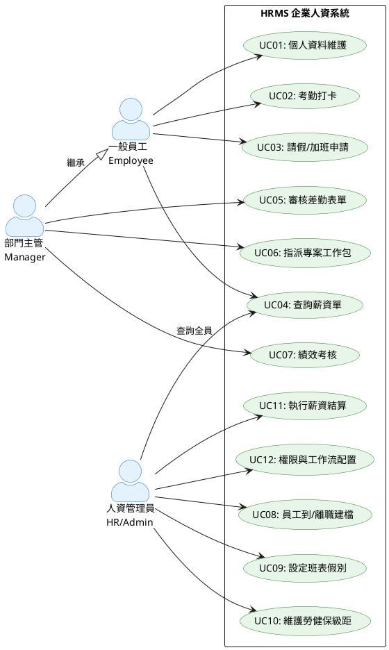

# Portfolio Docs Skill

**名稱：** 作品集文件建立與維護
**版本：** 1.0
**適用範圍：** `knowledge/` 目錄下的所有系統分析與架構文件

---

## 文件結構總覽

```
knowledge/
├── 00_系統分析與架構總覽.md       # 系統目標、架構圖、設計原則
├── 01_核心業務循序圖.md           # Sequence Diagram（入職、離職、請假簽核、薪資SAGA）
├── 02_跨微服務實體關聯圖.md       # 邏輯 ERD（跨服務無實體FK）
├── 03_系統使用案例圖與規格.md     # Use Case Diagram + UC Descriptions
├── 04_核心業務流程圖.md           # 泳道圖（考勤→薪資月結）
├── 05_開發環境快速啟動指南.md     # Docker + Maven + Vite 啟動
├── 06_CICD與系統部署指南.md       # GitHub Actions + GCP Cloud Run
├── 07_作品介紹腳本.md             # 面試說明腳本與問答準備
├── 08_技術決策紀錄.md             # ADR（Why Kafka、Why DDD...）
├── 09_測試架構與品質保證.md       # 合約測試框架、測試成果量化
├── diagrams/                      # 所有渲染後的 PNG 圖片
│   ├── 00_architecture-1.png
│   ├── 01_sequence-*.png
│   ├── 02_erd-1.png
│   ├── 03_usecase.png             # PlantUML 渲染
│   ├── 04_flowchart-1.png
│   └── 06_cicd-1.png
└── generate_diagrams.sh           # 一鍵渲染所有圖表
```

---

## 工具需求確認

```bash
# 確認 Mermaid CLI（用於架構圖、循序圖、ERD、流程圖）
mmdc --version

# 確認 PlantUML（用於 Use Case Diagram）
java -jar plantuml.jar -version
# 或使用線上服務替代：https://www.plantuml.com/plantuml/

# 確認 Node.js
node --version   # 需要 18+
```

---

## 執行流程

### 階段一：更新文件內容

**輸入：**
- 要建立或更新的文件名稱（如 `07_作品介紹腳本.md`）
- 相關設計書路徑（`knowledge/02_Requirements_Analysis/`、`knowledge/02_System_Design/`）

**執行步驟：**

1. **讀取既有文件（若存在）**
   ```
   Read: knowledge/{nn}_{文件名}.md
   ```

2. **讀取相關設計書（取得業務規格）**
   ```
   knowledge/02_Requirements_Analysis/{nn}_{服務名}需求分析書.md
   knowledge/02_System_Design/{nn}_{服務名}系統設計書.md
   ```

3. **依文件類型套用對應模板（見下方各類模板）**

4. **寫入或更新文件**
   ```
   Write/Edit: knowledge/{nn}_{文件名}.md
   ```

---

### 階段二：圖表渲染

#### Mermaid 圖（架構圖、循序圖、ERD、流程圖）

```bash
cd knowledge

# 單一文件渲染（--scale 2 提升解析度）
mmdc -i {文件名}.md -o diagrams/{輸出名}.png --scale 2

# 批次渲染所有文件
bash generate_diagrams.sh
```

**注意：** mmdc 會自動在輸出檔名後加 `-1`、`-2`...（若文件內有多個 mermaid 區塊）。

#### PlantUML 圖（Use Case Diagram）

**方法 A：本地安裝（推薦）**
```bash
# 下載 plantuml.jar（需 Java 17+）
# https://plantuml.com/download

java -jar plantuml.jar knowledge/03_系統使用案例圖與規格.puml -o diagrams/
```

**方法 B：線上服務（備用）**
- 將 PlantUML 程式碼貼到 https://www.plantuml.com/plantuml/
- 下載 PNG 存入 `knowledge/diagrams/03_usecase.png`

**方法 C：使用 node-plantuml**
```bash
npm install -g node-plantuml
puml generate knowledge/03_usecase.puml --output knowledge/diagrams/
```

---

### 階段三：驗證清單

每次更新文件後，確認以下項目：

- [ ] Mermaid 語法無錯誤（無未定義節點、無語法錯誤）
- [ ] 所有圖表已重新渲染（`bash generate_diagrams.sh`）
- [ ] PNG 圖片可正常顯示（用 Read 工具預覽確認）
- [ ] 文件內有嵌入對應的 PNG 圖片引用（``）

---

## 各文件模板

### Use Case Description 模板

```markdown
### [UC{nn}] {使用案例名稱} ({英文名稱})

- **參與者 (Actor)**：{角色}
- **前置條件 (Preconditions)**：{必要的系統狀態}
- **主要流程 (Main Flow)**：
  1. {步驟一}
  2. {步驟二}
  ...
- **替代流程 (Alternative Flow)**：
  - {條件} → {替代步驟}
- **異常流程 (Exception Flow)**：
  - {錯誤條件} → {系統回應}
- **後置條件 (Postconditions)**：{完成後的系統狀態}
```

### PlantUML Use Case Diagram 模板



### Sequence Diagram 模板（Mermaid）

```markdown
## {流程名稱}

```mermaid
%%{init: {'theme': 'base', 'themeVariables': { 'fontSize': '16px', 'fontFamily': 'sans-serif', 'textColor': '#111111', 'actorTextColor': '#111111', 'messageTextColor': '#111111', 'noteTextColor': '#111111', 'lineColor': '#333333'}}}%%
sequenceDiagram
    autonumber
    actor {Actor} as {中文名稱}
    participant {Service} as {服務名稱}
    ...
```

### 架構決策紀錄（ADR）模板

```markdown
### ADR-{nn}: {決策標題}

**狀態：** 已採用 (Accepted)
**日期：** {yyyy-mm-dd}

**背景：**
{遇到什麼問題，為什麼需要做這個決定}

**決策：**
{選擇了什麼方案}

**理由：**
- {理由一}
- {理由二}

**替代方案（被否決）：**
| 方案 | 否決原因 |
|:---|:---|
| {方案A} | {原因} |

**代價與取捨：**
- {這個決定帶來的限制或副作用}
```

### 作品介紹腳本模板

```markdown
## {時長}版本介紹腳本

### 開場（30 秒）
> "{電梯簡報一句話}"

**說明重點：**
- 這個系統解決什麼問題
- 目標使用者是誰
- 規模（500人企業、14個微服務）

### 系統架構（2 分鐘）
> 打開 `diagrams/00_architecture-1.png`

**說明順序：**
1. 三種使用者 → API Gateway → 微服務群
2. 指出 14 個服務的領域分群
3. 強調 Kafka Event Bus 的角色

**說話重點：**
"{這張圖最重要的不是每個框，而是中間這條 Kafka...}"
```

---

## 常見問題

### Mermaid 渲染錯誤

1. **未定義節點**：確認所有被引用的節點都有定義（如 `SupportDomain` bug）
2. **subgraph 名稱含空格**：用引號包住，如 `subgraph "PM & Performance"`
3. **中文字型渲染異常**：加入 `fontFamily: 'sans-serif'` themeVariables

### PlantUML 找不到 java

```bash
# Windows
where java
# 若未安裝，下載 Eclipse Temurin JRE 17+
# https://adoptium.net/
```

### PNG 圖片過小或字型模糊

```bash
# 提高解析度（mmdc）
mmdc -i input.md -o output.png --scale 3

# 或改用 SVG 格式（無損縮放）
mmdc -i input.md -o output.svg
```

---

## 參考文件

- **Mermaid 語法文件：** https://mermaid.js.org/
- **PlantUML 語法文件：** https://plantuml.com/use-case-diagram
- **系統架構規範：** `framework/architecture/系統架構設計文件.md`
- **現有文件目錄：** `knowledge/README.md`
