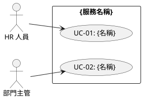
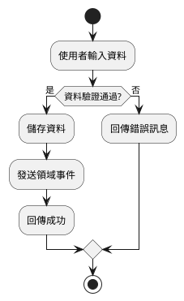
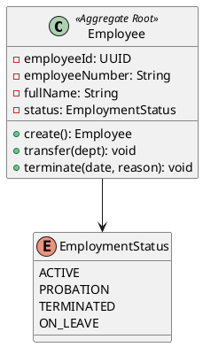
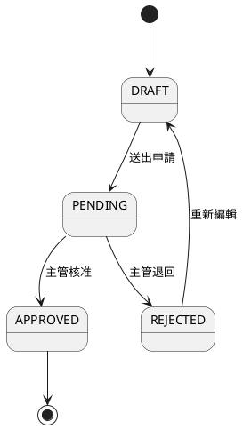
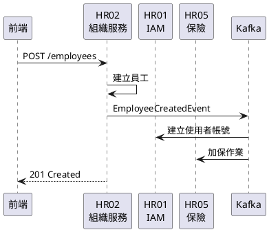
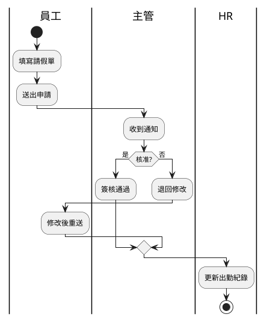
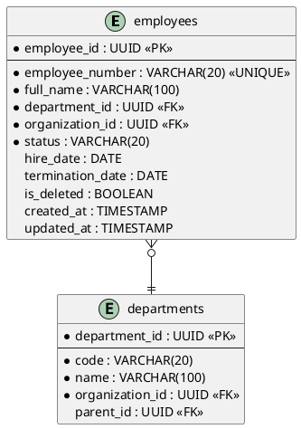

# Pre-Development Checklist Skill

**名稱：** 開發前置作業完整流程
**版本：** 1.0
**目的：** 在寫任何程式碼之前，以互動問答方式逐步完成所有必要的分析、設計文件與圖表

---

## 觸發方式

使用者輸入 `/pre-dev-checklist` 啟動此流程。

---

## 執行規則

### 互動原則

1. **每個階段都以問答方式進行**，提供編號選項讓使用者選擇
2. **每組選項都必須包含「其他（請說明）」選項**，讓使用者自由補充
3. **確認完一個階段才進入下一個階段**，不跳步
4. **產出物包含文字文件 + 圖表**（PlantUML / Mermaid），不只是文字
5. **每個產出物完成後，呈現給使用者確認**，確認後才繼續
6. **支援返回修改**：使用者可隨時要求回到前一步修改

### 產出物存放位置

| 類型 | 路徑 |
|:---|:---|
| 需求分析書 | `knowledge/02_Requirements_Analysis/{NN}_{service}_需求分析書.md` |
| 系統設計書 | `knowledge/02_System_Design/{NN}_{service}_系統設計書.md` |
| API 規格 | `knowledge/04_API_Specifications/{NN}_{service}_API詳細規格.md` |
| UI 畫面規格 | `knowledge/06_UI_Design/HR{NN}_{service}_畫面規格書.md` |
| 複雜邏輯規格 | `knowledge/03_Logic_Specifications/{name}.md` |
| 合約測試規格 | `contracts/{service}_contracts.md` |
| PlantUML 圖表 | `knowledge/` 或 `knowledge/06_UI_Design/` 下的 `.puml` 檔 |

---

## 完整流程（9 個階段）

### ═══════════════════════════════════════
### 階段 0：啟動 — 確認開發範圍
### ═══════════════════════════════════════

**向使用者詢問：**

```
請選擇要進行的開發項目：

1. 新增一個全新的微服務模組
2. 為既有模組新增功能（API / 頁面）
3. 修改既有功能（邏輯調整 / Bug 修正）
4. 跨服務整合功能
5. 其他（請說明）

請輸入編號：
```

**接著確認：**

```
請選擇目標服務：

 1. HR01 IAM（認證授權）
 2. HR02 Organization（組織員工）
 3. HR03 Attendance（考勤管理）
 4. HR04 Payroll（薪資管理）
 5. HR05 Insurance（保險管理）
 6. HR06 Project（專案管理）
 7. HR07 Timesheet（工時管理）
 8. HR08 Performance（績效管理）
 9. HR09 Recruitment（招募管理）
10. HR10 Training（訓練管理）
11. HR11 Workflow（簽核流程）
12. HR12 Notification（通知服務）
13. HR13 Document（文件管理）
14. HR14 Reporting（報表分析）
15. 其他（請說明）

請輸入編號：
```

**然後詢問功能描述：**

```
請簡述要開發的功能：
（例如：「新增員工批次匯入功能」「修改薪資計算的加班費邏輯」）
```

**確認後，根據選擇決定需要執行哪些階段：**

| 開發類型 | 需執行的階段 |
|:---|:---|
| 新增微服務 | 1 → 2 → 3 → 4 → 5 → 6 → 7 → 8 全部 |
| 新增功能 | 1 → 2（部分）→ 3 → 4 → 5 → 6 → 7 → 8 |
| 修改功能 | 確認既有文件 → 需更新的部分 → 7 → 8 |
| 跨服務整合 | 1 → 2 → 3（重點 Sequence）→ 4 → 7 → 8 |

---

### ═══════════════════════════════════════
### 階段 1：需求分析
### ═══════════════════════════════════════

**步驟 1.1 — 確認使用者角色**

```
這個功能涉及哪些使用者角色？（可多選）

1. 系統管理員（ADMIN）
2. HR 人員（HR）
3. 部門主管（MANAGER）
4. 一般員工（EMPLOYEE）
5. PM / 專案經理
6. 財務人員
7. 外部使用者（SSO / LDAP）
8. 其他（請說明）

請輸入編號（多選用逗號分隔，如 1,2,3）：
```

**步驟 1.2 — 確認功能需求**

```
請確認此功能的核心需求：

1. 資料的 CRUD（建立/查詢/更新/刪除）
2. 狀態流轉（如：草稿→送審→核准→退回）
3. 計算邏輯（如：薪資計算、工時統計）
4. 報表 / 匯出
5. 批次作業（如：批次匯入、批次審核）
6. 跨服務觸發（如：建立員工→通知 IAM 建帳號）
7. 排程作業（如：每月自動結算）
8. 通知推送（Email / LINE / Teams）
9. 其他（請說明）

請輸入編號（多選）：
```

**步驟 1.3 — 確認業務規則**

```
此功能有哪些關鍵業務規則？

1. 唯一性驗證（如：工號不得重複）
2. 權限控制（如：只有 HR 可操作）
3. 狀態限制（如：離職員工不可修改）
4. 數值範圍（如：請假天數上限）
5. 時間限制（如：只能申請未來日期）
6. 關聯驗證（如：部門必須存在）
7. 法規遵循（如：勞基法加班上限）
8. 其他（請說明）

請輸入編號（多選）：
```

**步驟 1.4 — 確認非功能性需求**

```
是否有特殊的非功能性需求？

1. 效能要求（如：查詢需 < 500ms）
2. 併發控制（如：同時編輯衝突處理）
3. 資料量考量（如：預期十萬筆以上）
4. 安全性要求（如：資料加密、稽核日誌）
5. 多租戶隔離
6. 無特殊需求
7. 其他（請說明）

請輸入編號（多選）：
```

**產出物：**
- ✅ 更新需求分析書（`knowledge/02_Requirements_Analysis/{NN}_*.md`）
- ✅ 通用語言術語表（Ubiquitous Language）
- ✅ 與其他服務的交互關係描述

---

### ═══════════════════════════════════════
### 階段 2：系統分析（Use Case + 活動圖）
### ═══════════════════════════════════════

**步驟 2.1 — 定義 Use Case**

```
根據需求，系統需要提供哪些使用案例？

範例格式：
  UC-01: HR 建立新員工
  UC-02: 主管查詢下屬考勤
  UC-03: 員工申請請假

請列出此功能的所有 Use Case（我會幫你整理成標準格式）：
```

**步驟 2.2 — 確認每個 Use Case 的細節**

對每個 UC 逐一詢問：

```
UC-01: {use case name}

主要參與者：
1. HR 人員
2. 部門主管
3. 系統自動
4. 其他（請說明）

觸發條件是什麼？
1. 使用者主動操作（按鈕點擊）
2. 系統排程觸發
3. 事件驅動（其他服務觸發）
4. 其他（請說明）

前置條件？（可多選）
1. 使用者已登入
2. 使用者擁有特定權限
3. 相關主數據已存在（如：部門已建立）
4. 特定狀態條件（如：員工為在職狀態）
5. 其他（請說明）

正常流程的步驟？（請簡述，我會幫你整理）

替代/異常流程？
1. 資料驗證失敗
2. 權限不足
3. 並發衝突
4. 外部服務不可用
5. 其他（請說明）

後置條件？（操作完成後的系統狀態變化）
```

**步驟 2.3 — 產出 Use Case Diagram**

根據確認的 UC，生成 PlantUML 使用案例圖：



**呈現給使用者確認：** 「這是根據你的描述生成的 Use Case Diagram，請確認是否正確？需要調整嗎？」

**步驟 2.4 — 產出 Activity Diagram**

對每個核心 UC 生成活動圖：



**呈現給使用者確認。**

**產出物：**
- ✅ Use Case Diagram（`.puml`）
- ✅ Use Case Description（文字，含前置/流程/替代/後置）
- ✅ Activity Diagram（`.puml`，每個核心 UC 一張）

---

### ═══════════════════════════════════════
### 階段 3：系統設計（Domain + 狀態 + 循序）
### ═══════════════════════════════════════

**步驟 3.1 — Domain 設計（Aggregate / Entity / VO）**

```
此功能的核心領域物件有哪些？

1. 新的 Aggregate Root（如：Employee, LeaveRequest）
2. 新的 Entity（屬於某 Aggregate 的子實體）
3. 新的 Value Object（如：Money, DateRange, Address）
4. 使用既有的 Domain 物件（請指定）
5. 其他（請說明）

請描述核心物件及其屬性（我會幫你整理成 Domain Model）：
```

**步驟 3.2 — 產出 Class Diagram**

根據確認的 Domain Model 生成類別圖：



**呈現給使用者確認。**

**步驟 3.3 — 狀態機設計**

```
此功能是否涉及狀態流轉？

1. 是，有明確的狀態機（如：草稿→送審→核准）
2. 是，但只有簡單的啟用/停用
3. 否，沒有狀態流轉
4. 其他（請說明）
```

若選 1，進一步詢問：

```
請列出所有狀態與轉換規則：

格式：
  狀態A → [觸發事件] → 狀態B（條件：...）

範例：
  DRAFT → [送出申請] → PENDING（條件：資料完整）
  PENDING → [主管核准] → APPROVED
  PENDING → [主管退回] → REJECTED（條件：需填退回原因）

請列出：
```

**產出 State Diagram：**



**呈現給使用者確認。**

**步驟 3.4 — 領域事件設計**

```
此功能會觸發哪些領域事件？

1. 建立事件（如：EmployeeCreatedEvent）
2. 更新事件（如：EmployeeEmailChangedEvent）
3. 狀態變更事件（如：LeaveApprovedEvent）
4. 刪除/停用事件
5. 不觸發事件
6. 其他（請說明）

每個事件需要攜帶哪些資料（payload）？
```

**步驟 3.5 — 跨服務互動（Sequence Diagram）**

```
此功能是否需要與其他微服務互動？

1. 是，同步呼叫其他服務 API
2. 是，透過領域事件非同步通知
3. 是，需要 Saga 協調多服務
4. 否，完全在本服務內完成
5. 其他（請說明）
```

若涉及跨服務，生成 Sequence Diagram：



**呈現給使用者確認。**

**步驟 3.6 — 業務流程圖（Flowchart / Swimlane）**

```
此功能的業務流程需要用什麼方式呈現？

1. 簡單流程圖（單一角色的步驟）
2. 泳道圖（多角色協作流程）
3. 決策樹（複雜條件判斷）
4. 不需要額外流程圖（Activity Diagram 已足夠）
5. 其他（請說明）
```

若需要泳道圖：



**產出物：**
- ✅ Class Diagram（`.puml`）
- ✅ State Diagram（`.puml`，若有狀態機）
- ✅ Sequence Diagram（`.puml`，若有跨服務互動）
- ✅ Flowchart / Swimlane（`.puml`，若需要）
- ✅ 領域事件清單
- ✅ 更新系統設計書

---

### ═══════════════════════════════════════
### 階段 4：資料庫設計（ERD + Schema）
### ═══════════════════════════════════════

**步驟 4.1 — 確認資料表**

```
此功能需要哪些資料表？

1. 新增資料表
2. 修改既有資料表（增加欄位）
3. 新增關聯表（多對多）
4. 使用既有資料表（不需修改）
5. 其他（請說明）

對於每張新表，請簡述：
- 表名
- 核心欄位
- 與其他表的關聯
```

**步驟 4.2 — 確認欄位細節**

對每張表逐一確認：

```
資料表：{table_name}

以下欄位是否正確？需要增減嗎？

| 欄位名 | 型別 | 限制 | 說明 |
|:---|:---|:---|:---|
| id | UUID | PK | 主鍵 |
| ... | ... | ... | ... |
| is_deleted | BOOLEAN | NOT NULL, DEFAULT FALSE | 軟刪除 |
| created_at | TIMESTAMP | NOT NULL | 建立時間 |
| updated_at | TIMESTAMP | NOT NULL | 更新時間 |

1. 正確，繼續
2. 需要增加欄位
3. 需要移除欄位
4. 需要修改欄位型別/限制
5. 其他（請說明）
```

**步驟 4.3 — 確認索引與約束**

```
需要哪些索引與約束？

1. 唯一約束（UNIQUE）— 如：employee_number + organization_id
2. 外鍵約束（FOREIGN KEY）
3. 複合索引（查詢效能）
4. 檢查約束（CHECK）— 如：status IN ('ACTIVE', 'INACTIVE')
5. 不需要額外索引
6. 其他（請說明）
```

**步驟 4.4 — 產出 ERD**



**呈現給使用者確認。**

**步驟 4.5 — 產出 DDL + 測試資料 SQL**

同時產出：
- Production Schema（`src/main/resources/db/`）
- H2 Test Schema（`src/test/resources/test-data/`）
- 測試種子資料 SQL

```
以上 ERD 與 Schema 是否正確？

1. 正確，繼續
2. 需要調整（請說明）
3. 返回上一步重新設計
```

**產出物：**
- ✅ ERD（`.puml`）
- ✅ DDL Schema
- ✅ H2 測試 Schema
- ✅ 測試種子資料 SQL
- ✅ 更新系統設計書的資料庫設計章節

---

### ═══════════════════════════════════════
### 階段 5：API 設計
### ═══════════════════════════════════════

**步驟 5.1 — 確認 API 端點清單**

```
此功能需要哪些 API 端點？

Command（寫入）端點：
1. POST（建立資源）
2. PUT（更新資源）
3. DELETE（刪除/停用資源）
4. POST /{id}/{action}（狀態變更，如 /approve, /reject）

Query（查詢）端點：
5. GET /（列表查詢，含分頁/篩選/排序）
6. GET /{id}（單筆詳情）
7. GET /{id}/{sub-resource}（子資源查詢）

8. 其他（請說明）

請輸入需要的類型（多選）：
```

**步驟 5.2 — 逐一設計每個 API**

對每個端點詢問：

```
API: {METHOD} /api/v1/{resource}

Request 參數：
- Path Params: {id} ?
- Query Params: ?status=, ?search=, ?page=, ?size= ?
- Request Body: { } ?

請確認以下 Request 結構：
{顯示 JSON 範例}

1. 正確
2. 需要增加欄位
3. 需要移除欄位
4. 其他（請說明）
```

```
Response 結構：

成功回應（HTTP {status}）：
{顯示 JSON 範例}

錯誤回應有哪些？
1. 400 Bad Request（驗證失敗）
2. 401 Unauthorized（未認證）
3. 403 Forbidden（權限不足）
4. 404 Not Found（資源不存在）
5. 409 Conflict（資源衝突，如代碼重複）
6. 其他（請說明）
```

**步驟 5.3 — 確認權限設計**

```
此 API 的權限要求：

1. 公開（不需認證，如：登入 API）
2. 僅需認證（登入即可）
3. 需要特定權限（如：employee:create）
4. 需要角色限制（如：僅 HR 角色）
5. 需要資料範圍限制（如：主管只能看自己部門）
6. 其他（請說明）
```

**步驟 5.4 — 產出 API 規格文件**

生成完整的 API 規格（含 Request/Response JSON 範例、錯誤碼、權限）。

**呈現給使用者確認。**

**產出物：**
- ✅ API 詳細規格文件（`knowledge/04_API_Specifications/{NN}_*.md`）
- ✅ Request/Response DTO 結構定義
- ✅ 錯誤碼清單
- ✅ 權限矩陣

---

### ═══════════════════════════════════════
### 階段 6：UI / UX 設計
### ═══════════════════════════════════════

**步驟 6.1 — 確認頁面清單**

```
此功能需要哪些頁面？

1. 列表頁（Table + 篩選 + 分頁）
2. 詳情頁（單筆資料展示）
3. 新增/編輯表單（Modal 或獨立頁面）
4. 儀表板 / 統計頁
5. 流程/狀態追蹤頁
6. 設定頁
7. 其他（請說明）

請輸入編號（多選）：
```

**步驟 6.2 — 逐頁確認元件與互動**

```
頁面：{page_name}

此頁面包含哪些元件？

1. 搜尋/篩選區（Search + Filter）
2. 資料表格（Table + Pagination）
3. 表單（Form + Validation）
4. Modal 彈窗
5. Tab 分頁
6. 樹狀結構（Tree）
7. 圖表（Chart）
8. 時間軸（Timeline）
9. 拖曳排序（Drag & Drop）
10. 其他（請說明）

請輸入編號（多選）：
```

對每個元件進一步確認欄位與互動：

```
表格欄位：

| 欄位 | 顯示名稱 | 排序 | 篩選 | 備註 |
|:---|:---|:---:|:---:|:---|
| employeeNumber | 工號 | ✅ | ✅ | |
| fullName | 姓名 | ✅ | ✅ | 可模糊搜尋 |
| department | 部門 | ✅ | ✅ | 下拉篩選 |
| status | 狀態 | ✅ | ✅ | Badge 顏色 |

1. 正確
2. 需要增加欄位
3. 需要修改欄位設定
4. 其他（請說明）
```

**步驟 6.3 — 確認畫面事件**

```
此頁面有哪些使用者操作事件？

1. 按鈕點擊（如：新增、編輯、刪除、匯出）
2. 表單提交（驗證 + API 呼叫）
3. 狀態切換（如：啟用/停用 Toggle）
4. 選擇變更（如：下拉選單連動）
5. 搜尋/篩選（即時或手動觸發）
6. 分頁/排序
7. 拖曳操作
8. 其他（請說明）

每個事件觸發什麼 API？觸發後 UI 如何更新？
```

**步驟 6.4 — 產出 UI Flow**

```plantuml
@startuml
(*) --> 員工列表頁
員工列表頁 --> [點擊新增] 新增員工Modal
員工列表頁 --> [點擊編輯] 編輯員工Modal
員工列表頁 --> [點擊查看] 員工詳情頁
新增員工Modal --> [送出成功] 員工列表頁 : 重新整理
編輯員工Modal --> [送出成功] 員工列表頁 : 重新整理
員工詳情頁 --> [返回] 員工列表頁
@enduml
```

**呈現給使用者確認。**

**步驟 6.5 — 確認前端 Factory 映射**

```
後端 API 回傳的欄位名 vs 前端 ViewModel 欄位名：

| 後端欄位 | 前端 ViewModel | 轉換邏輯 |
|:---|:---|:---|
| organizationId | organizationId | 直接映射 |
| code | organizationCode | 重命名 |
| type | organizationType | 重命名 + 型別轉換 |
| status | displayStatus | 轉為中文（ACTIVE→啟用） |

1. 正確
2. 需要調整
3. 其他（請說明）
```

**產出物：**
- ✅ UI 畫面規格書（`knowledge/06_UI_Design/HR{NN}_*.md`）
- ✅ UI Flow 圖（`.puml`）
- ✅ 畫面事件說明（含 API 對應）
- ✅ 前端 Factory 欄位映射表

---

### ═══════════════════════════════════════
### 階段 7：合約測試規格
### ═══════════════════════════════════════

**步驟 7.1 — 根據 API 設計建立合約場景**

```
將為以下 API 建立合約測試規格：

| # | API 端點 | 場景 ID | 說明 |
|:---:|:---|:---|:---|
| 1 | POST /api/v1/{resource} | {SVC}_CMD_{ID} | 建立 |
| 2 | PUT /api/v1/{resource}/{id} | {SVC}_CMD_{ID} | 更新 |
| 3 | GET /api/v1/{resource} | {SVC}_QRY_{ID} | 列表查詢 |
| ... | ... | ... | ... |

是否還需要補充錯誤場景？
1. 是，需要重複檢查（409）
2. 是，需要權限不足（403）
3. 是，需要資源不存在（404）
4. 不需要
5. 其他（請說明）
```

**步驟 7.2 — 逐一確認每個合約的 JSON Schema**

對每個場景展示合約 JSON，讓使用者確認：

```json
{
  "scenarioId": "{SCENARIO_ID}",
  "apiEndpoint": "{METHOD} {path}",
  "controller": "{ControllerName}",
  "service": "{ServiceName}",
  "permission": "{permission}",
  "request": { ... },
  "expectedResponse": {
    "statusCode": 200,
    "requiredFields": [ ... ]
  },
  "expectedDataChanges": [ ... ],
  "expectedEvents": [ ... ]
}
```

```
以上合約定義是否正確？

1. 正確
2. 需要調整 request 欄位
3. 需要調整 response 欄位
4. 需要調整業務規則
5. 需要調整預期事件
6. 其他（請說明）
```

**產出物：**
- ✅ 合約測試規格（`contracts/{service}_contracts.md`）
- ✅ 場景 ID 清單
- ✅ 更新 API 端點概覽表格

---

### ═══════════════════════════════════════
### 階段 8：最終確認 — 文件完整性檢查
### ═══════════════════════════════════════

**自動檢查所有產出物：**

```
═══════════════════════════════════════
  開發前置文件完整性檢查報告
═══════════════════════════════════════

📋 需求分析：
  [✅/❌] 需求分析書已更新
  [✅/❌] 使用者角色已定義
  [✅/❌] 業務規則已列出

📊 系統分析：
  [✅/❌] Use Case Diagram（.puml）
  [✅/❌] Use Case Description（文字）
  [✅/❌] Activity Diagram（.puml）

🏗️ 系統設計：
  [✅/❌] Class Diagram（.puml）
  [✅/❌] State Diagram（.puml）
  [✅/❌] Sequence Diagram（.puml）
  [✅/❌] Flowchart / Swimlane（.puml）
  [✅/❌] 領域事件清單
  [✅/❌] 系統設計書已更新

🗄️ 資料庫設計：
  [✅/❌] ERD（.puml）
  [✅/❌] DDL Schema
  [✅/❌] H2 測試 Schema
  [✅/❌] 測試種子資料 SQL

🔌 API 設計：
  [✅/❌] API 規格文件
  [✅/❌] Request/Response 結構
  [✅/❌] 錯誤碼清單
  [✅/❌] 權限矩陣

🖥️ UI/UX 設計：
  [✅/❌] UI 畫面規格書
  [✅/❌] UI Flow 圖（.puml）
  [✅/❌] 畫面事件說明
  [✅/❌] Factory 欄位映射

📜 合約測試：
  [✅/❌] 合約測試規格（JSON Schema）
  [✅/❌] 場景 ID 清單

═══════════════════════════════════════
  全部通過！可以開始 TDD 開發流程
  → 執行 /tdd 進入開發
═══════════════════════════════════════
```

若有任何項目未通過：

```
以下項目尚未完成：

1. [❌] State Diagram — 狀態機尚未定義
2. [❌] 合約測試規格 — 錯誤場景尚未補充

要現在補完嗎？
1. 是，回到對應階段補完
2. 先跳過，後續再補（留 TODO）
3. 此功能不需要該項目（標記為 N/A）
```

---

## 階段對照表

| 階段 | 產出文件 | 產出圖表 |
|:---|:---|:---|
| 0. 啟動 | — | — |
| 1. 需求分析 | 需求分析書 | — |
| 2. 系統分析 | UC Description | Use Case Diagram, Activity Diagram |
| 3. 系統設計 | 系統設計書, 事件清單 | Class Diagram, State Diagram, Sequence Diagram, Flowchart |
| 4. 資料庫設計 | DDL, 測試 SQL | ERD |
| 5. API 設計 | API 規格, 權限矩陣, 錯誤碼 | — |
| 6. UI/UX 設計 | 畫面規格書, 事件說明, Factory 映射 | UI Flow |
| 7. 合約測試 | 合約規格 JSON | — |
| 8. 完整性檢查 | 檢查報告 | — |

---

## 圖表格式規範

### PlantUML 檔案命名

| 圖表類型 | 命名規則 | 範例 |
|:---|:---|:---|
| Use Case | `{NN}_UseCase_{feature}.puml` | `02_UseCase_BatchImport.puml` |
| Activity | `{NN}_Activity_{UC_ID}.puml` | `02_Activity_UC01.puml` |
| Class | `{NN}_Class_{aggregate}.puml` | `02_Class_Employee.puml` |
| State | `{NN}_State_{entity}.puml` | `03_State_LeaveRequest.puml` |
| Sequence | `{NN}_Sequence_{scenario}.puml` | `02_Sequence_CreateEmployee.puml` |
| ERD | `{NN}_ERD_{module}.puml` | `02_ERD_Organization.puml` |
| Flowchart | `{NN}_Flow_{process}.puml` | `04_Flow_SalaryCalculation.puml` |
| UI Flow | `UI_Flow_HR{NN}_{feature}.puml` | `UI_Flow_HR02_Employee.puml` |

### Mermaid 使用時機

- 嵌入 Markdown 文件內的小型圖表用 Mermaid（如決策樹、簡單流程）
- 獨立的完整圖表用 PlantUML（支援更豐富的樣式）

---

## 與其他 Skill 的銜接

```
/pre-dev-checklist（本 Skill）
  ↓ 所有文件齊全
/tdd（TDD 開發流程）
  ↓ 開發完成
/contract-driven-test（合約測試驗證）
  ↓ 測試通過
/commit（提交程式碼）
```
