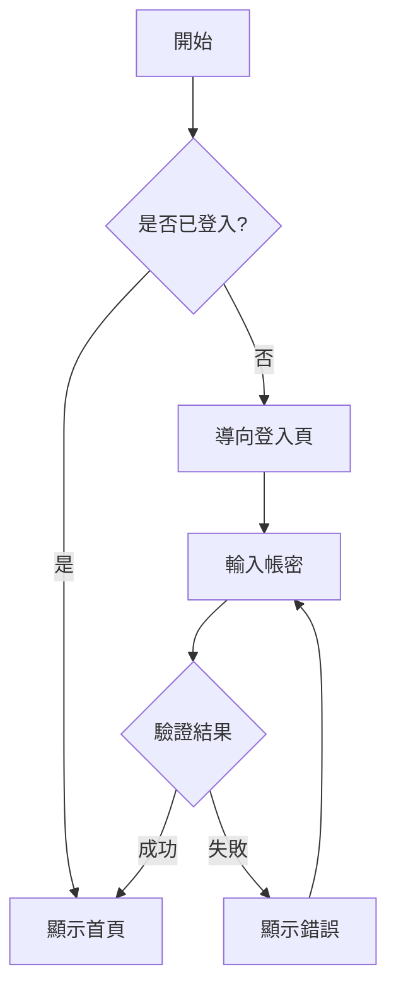

# SA（系統分析）Skill

## 使用時機
進行需求分析、系統分析、Use Case / Activity Diagram 產出時使用。
觸發關鍵字：`/sa`、「系統分析」、「需求分析」、「SA」

> 最後更新：2026-03-14

---

## 執行流程

### Step 1: 確認分析範圍

```
1. 分析目標：[ ] 新功能 / [ ] 功能變更 / [ ] 新模組
2. 涉及模組：HR{DD} — {模組名稱}
3. 業務需求來源：{客戶需求文件 / 口頭需求 / Issue}
```

### Step 2: 讀取現有文件

按順序讀取，確認是否已有相關分析：

1. **客戶需求**：`knowledge/01_Client_Requirements/`
2. **需求分析書**：`knowledge/02_Requirements_Analysis/{DD}_*.md`
3. **系統設計書**：`knowledge/02_System_Design/{DD}_*.md`
4. **API 規格**：`knowledge/04_API_Specifications/{DD}_*.md`
5. **合約規格**：`contracts/{service}_contracts.md`

### Step 3: 產出系統分析

---

## 系統分析書結構

```markdown
# {功能名稱} — 系統分析書

## 1. 概述
- 功能目的
- 業務背景
- 涉及角色

## 2. 功能範圍
- 包含的功能項目
- 不包含的功能項目（Out of Scope）
- 與其他模組的關聯

## 3. 角色與權限

| 角色 | 可執行操作 |
|:---|:---|
| 管理員 | 建立、編輯、刪除、停用 |
| 主管 | 檢視、審核 |
| 一般員工 | 檢視自己的資料 |

## 4. Use Case 圖

### UC-{DD}-{SEQ}: {Use Case 名稱}

**主要參與者**：{角色}
**前置條件**：{條件}
**後置條件**：{條件}

#### 主要流程
1. 使用者...
2. 系統...
3. ...

#### 替代流程
- 3a. 若驗證失敗：系統顯示錯誤訊息
- 3b. 若資源不存在：系統回傳 404

#### 例外流程
- E1. 網路逾時：系統顯示錯誤提示

## 5. Activity Diagram（流程圖）

使用 Mermaid 語法：



## 6. 業務規則

| 規則代碼 | 規則描述 | 影響範圍 |
|:---|:---|:---|
| BR-{DD}-001 | {規則描述} | {影響的 Use Case} |

## 7. 資料需求

| 欄位 | 型別 | 必填 | 說明 |
|:---|:---|:---:|:---|
| id | UUID | ✅ | 系統產生 |
| name | String | ✅ | 長度 1-100 |
| status | Enum | ✅ | ACTIVE / INACTIVE |

## 8. 非功能需求
- 效能：API 回應 < 2 秒
- 安全：需要認證與授權
- 可用性：符合 WCAG 2.1 AA

## 9. 假設與限制
- {假設}
- {限制}

## 10. 開放問題
- [ ] {待確認事項}
```

---

## Use Case 編號規範

```
UC-{DD}-{SEQ}
DD = 模組代碼（01-14）
SEQ = 流水號（001, 002, ...）
```

| 模組 | 前綴 | 範例 |
|:---|:---|:---|
| IAM | UC-01 | UC-01-001: 使用者登入 |
| Organization | UC-02 | UC-02-001: 建立組織 |
| Attendance | UC-03 | UC-03-001: 打卡 |
| ... | ... | ... |

---

## 業務規則編號規範

```
BR-{DD}-{SEQ}
```

範例：
- `BR-01-001`：密碼錯誤 5 次後鎖定帳號 30 分鐘
- `BR-03-001`：遲到超過 30 分鐘視為曠職半天
- `BR-04-001`：薪資計算需扣除請假時數

---

## 分析原則

1. **先確認 Scope** — 明確哪些是這次要做的，哪些不做
2. **角色驅動** — 每個功能都要明確誰可以用
3. **正向 + 反向** — 不只描述成功流程，也要描述失敗/例外場景
4. **可追溯** — Use Case → 業務規則 → API 規格 → 合約 → 測試，每層都要可追溯
5. **不做技術決策** — SA 只描述「做什麼」，不描述「怎麼做」（那是 SD 的事）

---

## 產出物 Checklist

- [ ] 系統分析書（含 Use Case 圖 + Activity Diagram）
- [ ] 業務規則列表
- [ ] 資料需求（欄位清單）
- [ ] 角色權限矩陣
- [ ] 開放問題清單
- [ ] 與既有模組的關聯圖

---

## 文件存放位置

```
knowledge/02_Requirements_Analysis/{DD}_{模組名稱}_需求分析書.md
```

範例：
```
knowledge/02_Requirements_Analysis/01_IAM認證授權_需求分析書.md
knowledge/02_Requirements_Analysis/03_考勤管理_需求分析書.md
```
