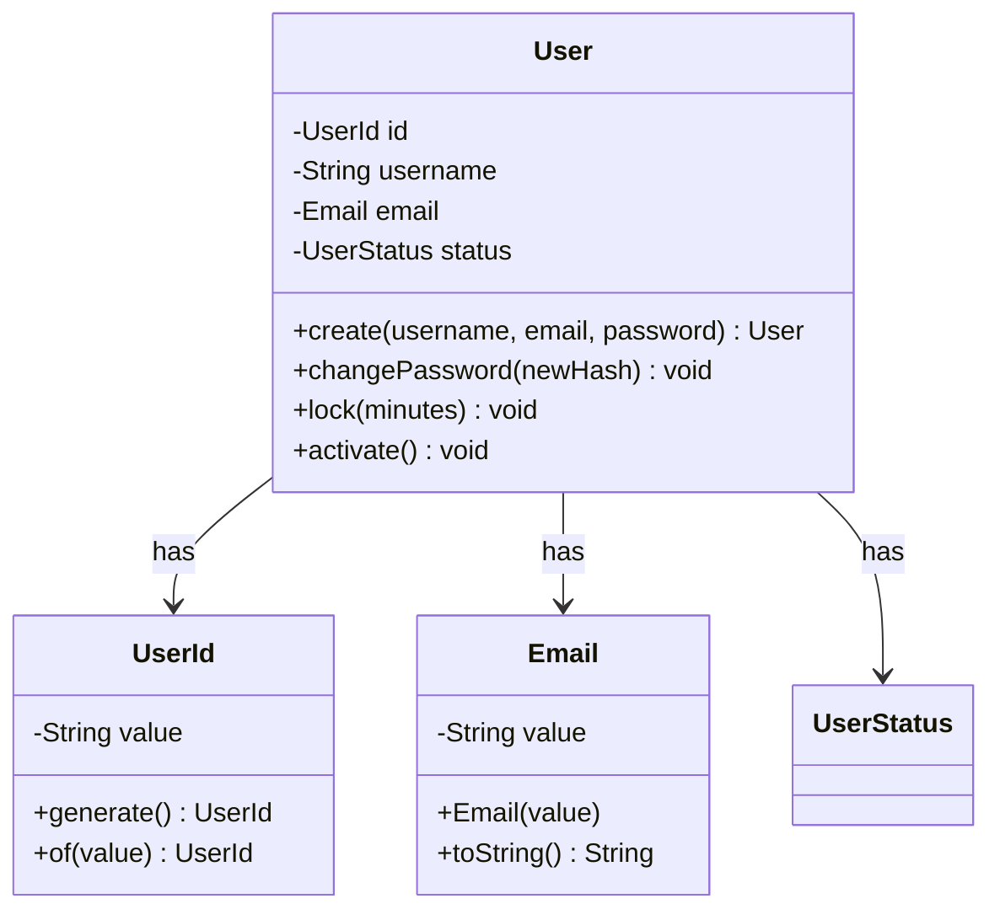
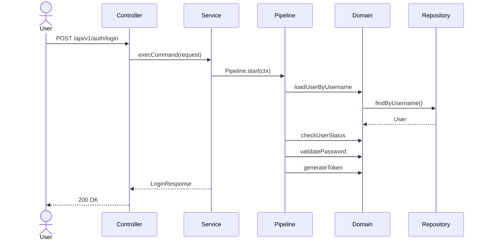
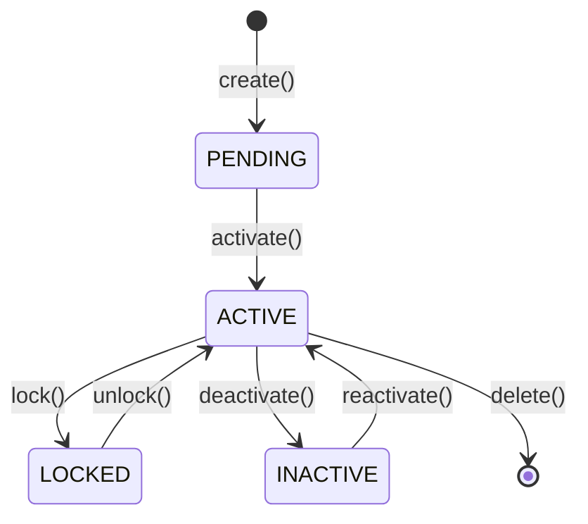
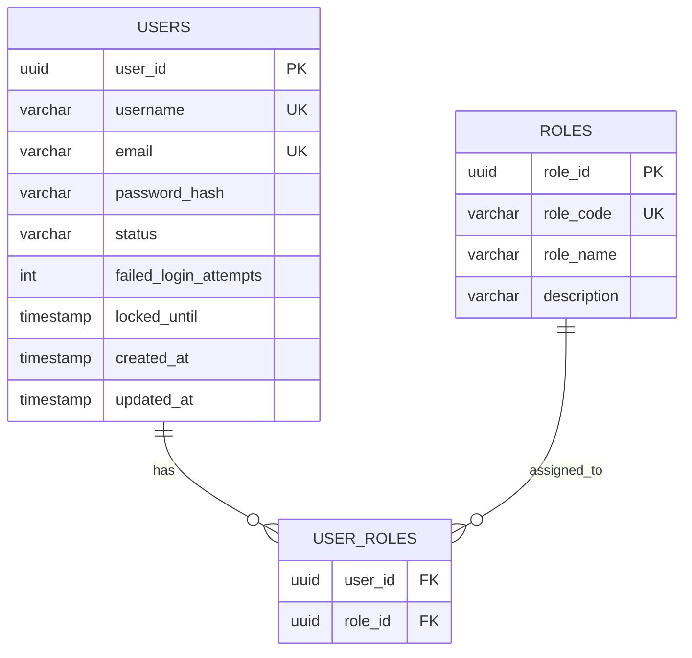

# SD（系統設計）Skill

## 使用時機
進行系統設計、Class Diagram / Sequence Diagram / State Diagram / ERD 產出時使用。
觸發關鍵字：`/sd`、「系統設計」、「SD」、「設計書」

> 最後更新：2026-03-14

---

## 執行流程

### Step 1: 確認設計範圍

```
1. 設計目標：[ ] 新功能設計 / [ ] 設計變更 / [ ] 新模組設計
2. 涉及模組：HR{DD} — {模組名稱}
3. 前置文件：[ ] SA 已完成 / [ ] 需求分析已確認
```

### Step 2: 讀取前置文件

**必須先讀取**：

1. **系統分析書**：`knowledge/02_Requirements_Analysis/{DD}_*.md`
2. **現有設計書**：`knowledge/02_System_Design/{DD}_*.md`
3. **API 規格**：`knowledge/04_API_Specifications/{DD}_*.md`
4. **複雜邏輯規格**：`knowledge/03_Logic_Specifications/*.md`（如有）
5. **框架規範**：
   - `framework/architecture/03_Business_Pipeline.md`
   - `framework/architecture/Fluent-Query-Engine.md`
6. **合約規格**：`contracts/{service}_contracts.md`

### Step 3: 產出系統設計

---

## 系統設計書結構

```markdown
# {功能名稱} — 系統設計書

## 1. 設計概述
- 設計目標
- 架構決策摘要
- 與 SA 的對應關係

## 2. 架構設計

### 2.1 模組架構（DDD 四層）

```
{service}/
├── api/
│   ├── controller/{feature}/
│   │   ├── HR{DD}{Screen}CmdController.java
│   │   └── HR{DD}{Screen}QryController.java
│   ├── request/{feature}/
│   └── response/{feature}/
├── application/service/{feature}/
│   ├── {Verb}{Noun}ServiceImpl.java
│   ├── context/{UseCase}Context.java
│   └── task/
├── domain/
│   ├── model/
│   │   ├── aggregate/
│   │   ├── entity/
│   │   └── valueobject/
│   ├── service/
│   ├── event/
│   └── repository/
└── infrastructure/
    ├── persistence/
    │   ├── repository/
    │   ├── po/
    │   ├── dao/
    │   └── mapper/
    └── external/
```

### 2.2 元件關係圖

描述各元件之間的依賴關係。

## 3. Class Diagram

使用 Mermaid 語法：



## 4. Sequence Diagram



## 5. State Diagram



## 6. ERD（資料庫設計）



## 7. API 設計

| Method | Path | 操作 | Controller 方法 | Service Bean |
|:---|:---|:---|:---|:---|
| POST | /api/v1/{resource} | 建立 | create{Noun}() | create{Noun}ServiceImpl |
| GET | /api/v1/{resource} | 列表 | get{Noun}List() | get{Noun}ListServiceImpl |
| GET | /api/v1/{resource}/{id} | 詳情 | get{Noun}() | get{Noun}ServiceImpl |
| PUT | /api/v1/{resource}/{id} | 更新 | update{Noun}() | update{Noun}ServiceImpl |
| DELETE | /api/v1/{resource}/{id} | 刪除 | delete{Noun}() | delete{Noun}ServiceImpl |
| PUT | /api/v1/{resource}/{id}/deactivate | 停用 | deactivate{Noun}() | deactivate{Noun}ServiceImpl |

## 8. Pipeline 設計

### Pipeline: {Use Case 名稱}

| 步驟 | Task | 類型 | 條件 | 說明 |
|:---:|:---|:---|:---|:---|
| 1 | Load{Entity}Task | Infra | 必要 | 載入資料 |
| 2 | Validate{Business}Task | Domain | 必要 | 業務驗證 |
| 3 | {Verb}{Business}Task | Domain | 條件 | 核心邏輯 |
| 4 | Save{Entity}Task | Infra | 必要 | 儲存結果 |
| 5 | Publish{Event}Task | Integration | 必要 | 發布事件 |

### Context 欄位

| 區塊 | 欄位 | 型別 | 說明 |
|:---|:---|:---|:---|
| 輸入 | request | {Verb}{Noun}Request | 原始請求 |
| 中間 | entity | {Entity} | 載入的實體 |
| 輸出 | result | {Noun}Response | 回應結果 |

## 9. Domain Event 設計

| 事件 | 觸發時機 | 消費者 | 說明 |
|:---|:---|:---|:---|
| {Aggregate}CreatedEvent | 建立成功後 | HR12 通知 | 發送通知 |
| {Aggregate}UpdatedEvent | 更新成功後 | HR14 報表 | 更新 ReadModel |

## 10. 錯誤處理設計

| ErrorCode | HTTP | 觸發條件 | 錯誤訊息 |
|:---|:---:|:---|:---|
| {CODE}_NOT_FOUND | 404 | 資源不存在 | {中文訊息} |
| {CODE}_ALREADY_EXISTS | 409 | 資源已存在 | {中文訊息} |
| {CODE}_INVALID_STATUS | 400 | 狀態不合法 | {中文訊息} |

## 11. 設計決策記錄

| 決策 | 選項 | 決定 | 原因 |
|:---|:---|:---|:---|
| {決策主題} | A: ... / B: ... | A | {原因} |
```

---

## 設計原則

### 架構師三原則
1. **能用「宣告」的，就不要用「程式碼」** — `@QueryFilter` > 手寫查詢
2. **能回傳「結構化物件」的，就不要回傳「基本型別」** — 方便快照測試
3. **Service 只做「編排」，不做「決策」** — if-else 業務邏輯在 Domain/Task 中

### DDD 設計原則
- **Aggregate 邊界要小** — 一個 Aggregate 只管一個一致性邊界
- **Value Object 優先** — 能用 VO 就不要用 primitive
- **Domain Event 解耦** — 跨 Aggregate 通訊用事件，不直接呼叫

### 效能考量
- 列表查詢必須支援分頁（`Pageable`）
- 避免 N+1 查詢
- 大量資料操作使用批次處理

---

## 產出物 Checklist

- [ ] 模組架構圖（DDD 四層）
- [ ] Class Diagram（Aggregate + Entity + VO）
- [ ] Sequence Diagram（主要流程）
- [ ] State Diagram（有狀態變化時）
- [ ] ERD（資料庫設計）
- [ ] API 設計（端點 + 方法 + Service 對應）
- [ ] Pipeline 設計（Task 步驟 + Context 欄位）
- [ ] Domain Event 設計（事件 + 消費者）
- [ ] 錯誤處理設計（ErrorCode + HTTP + 訊息）
- [ ] 設計決策記錄

---

## 文件存放位置

```
knowledge/02_System_Design/{DD}_{模組名稱}系統設計書.md
```

範例：
```
knowledge/02_System_Design/01_IAM認證授權服務系統設計書.md
knowledge/02_System_Design/03_考勤管理服務系統設計書.md
```

---

## 與其他流程的關係

```
SA（需求分析）→ SD（系統設計）→ 合約測試 → TDD 開發 → Code Review → QA
     /sa            /sd         /contract    /tdd       /code-review   /qa
```

SD 產出後，接下來：
1. 更新合約規格 `contracts/{service}_contracts.md`
2. 更新 API 規格 `knowledge/04_API_Specifications/{DD}_*.md`
3. 進入 `/tdd` 開發流程
