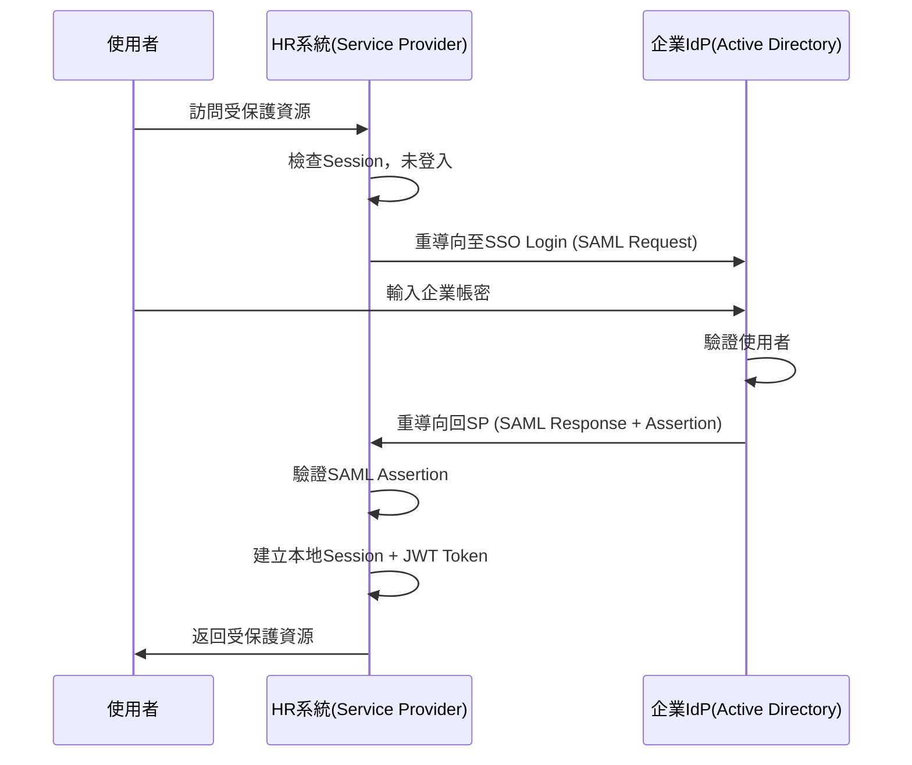
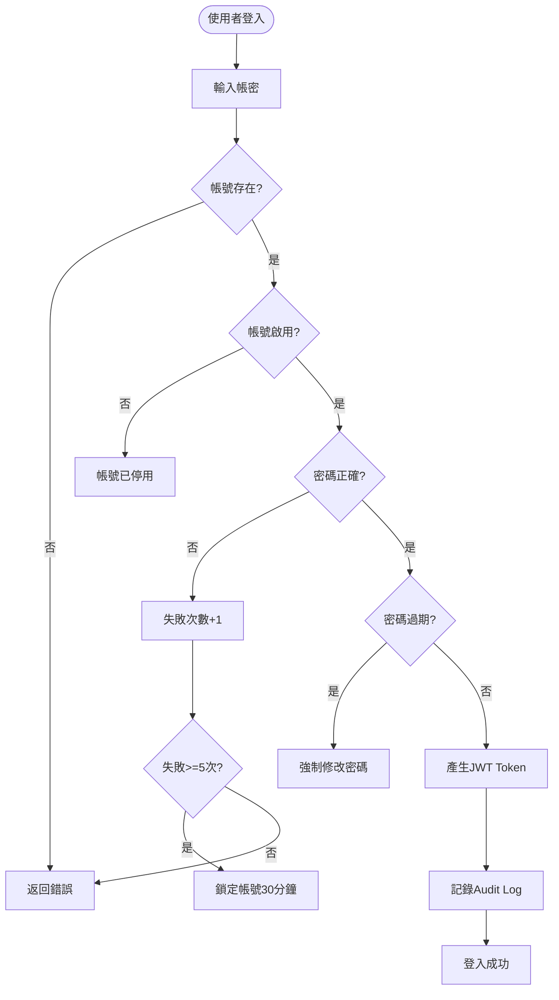
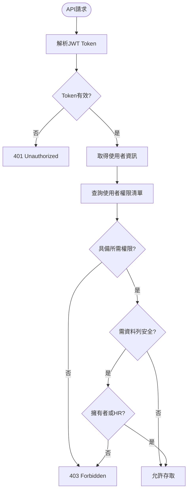
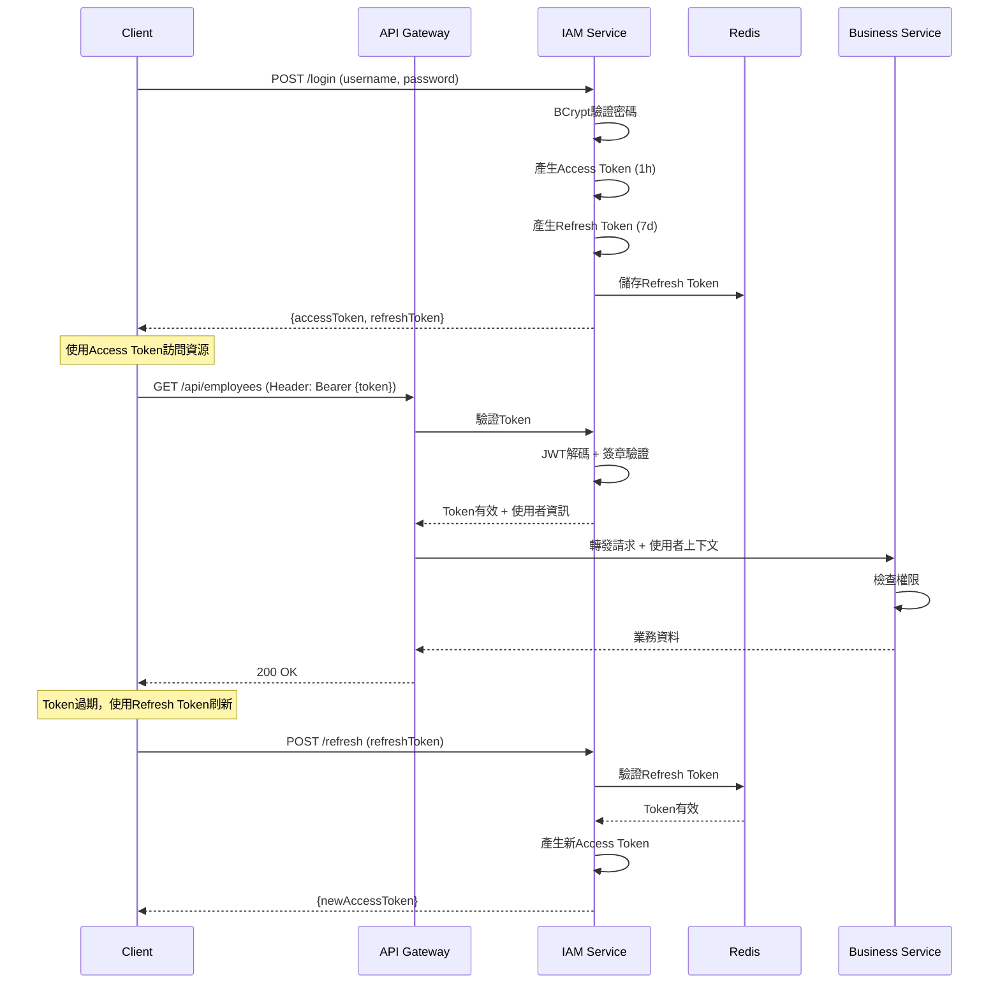

# IAM服務 - PM審查補充文件

**版本:** 1.1  
**日期:** 2025-11-30  
**補充說明:** 根據PM審查報告補充遺漏需求

---

## 📋 本文件補充的PM審查項目

### P1 優先級
- **IAM-004:** Audit Log範圍擴充（所有CRUD操作）

### P2 優先級
- **IAM-002:** 密碼定期更換提醒
- **IAM-003:** SSO單一登入詳細設計

### P3 優先級
- **IAM-001:** BCrypt vs SHA-256說明

### 文件增強
- 業務流程圖：登入驗證、權限檢查
- 循序圖：JWT認證流程
- 事件JSON範例
- 業務案例

---

## 1. Audit Log全面審計 (IAM-004) - P1

### 1.1 新增聚合根

#### AuditLog (審計日誌)
```
AuditLog {
  logId: UUID (PK)
  
  // 操作資訊
  operationType: OperationType
  operationName: String
  resourceType: String (users, roles, employees, payslips...)
  resourceId: UUID
  
  // 使用者資訊
  userId: UUID
  userName: String
  userRole: String
  ipAddress: String
  userAgent: String
  
  // 資料變更
  beforeData: JSON (nullable, 變更前資料)
  afterData: JSON (nullable, 變更後資料)
  changedFields: List<String>
  
  // 時間與結果
  timestamp: DateTime
  isSuccess: Boolean
  errorMessage: String (nullable)
  
  // 安全標記
  isSensitiveData: Boolean (敏感資料存取標記)
  riskLevel: RiskLevel (風險等級)
}

enum OperationType {
  CREATE
  READ
  UPDATE
  DELETE
  LOGIN
  LOGOUT
  PERMISSION_CHANGE
  DATA_EXPORT
  BULK_OPERATION
}

enum RiskLevel {
  LOW      // 一般操作
  MEDIUM   // 敏感資料讀取
  HIGH     // 敏感資料修改、刪除
  CRITICAL // 批次操作、權限變更
}
```

### 1.2 需審計的操作範圍

#### 認證授權相關（已涵蓋）
- ✅ 登入成功/失敗
- ✅ 登出
- ✅ Token刷新
- ✅ 密碼修改

#### 使用者管理（補充）
- ✅ 建立使用者
- ✅ 修改使用者資料
- ✅ 停用/啟用使用者
- ✅ 刪除使用者
- ✅ 重設密碼

#### 角色權限管理（補充）
- ✅ 建立角色
- ✅ 修改角色權限
- ✅ 刪除角色
- ✅ 指派角色給使用者
- ✅ 移除使用者角色

#### 敏感資料存取（新增）
- ✅ 查詢員工薪資資料
- ✅ 查詢員工身分證號
- ✅ 查詢員工銀行帳號
- ✅ 匯出員工資料
- ✅ 批次操作（匯入、批次修改）

### 1.3 AOP攔截實作

```java
@Aspect
@Component
public class AuditLogAspect {
    
    @Around("@annotation(Auditable)")
    public Object auditOperation(ProceedingJoinPoint joinPoint) {
        AuditLog log = new AuditLog();
        
        try {
            // 取得當前使用者
            User currentUser = SecurityContextHolder.getCurrentUser();
            log.setUserId(currentUser.getId());
            log.setUserName(currentUser.getUsername());
            
            // 取得操作資訊
            Auditable annotation = getAnnotation(joinPoint);
            log.setOperationType(annotation.operationType());
            log.setResourceType(annotation.resourceType());
            
            // 紀錄變更前資料（UPDATE/DELETE）
            if (isModifyOperation(annotation)) {
                Object beforeData = fetchBeforeData(joinPoint);
                log.setBeforeData(toJson(beforeData));
            }
            
            // 執行操作
            Object result = joinPoint.proceed();
            
            // 紀錄變更後資料
            log.setAfterData(toJson(result));
            log.setIsSuccess(true);
            
            // 判定風險等級
            log.setRiskLevel(calculateRiskLevel(annotation, currentUser));
            
            return result;
            
        } catch (Exception e) {
            log.setIsSuccess(false);
            log.setErrorMessage(e.getMessage());
            throw e;
        } finally {
            auditLogRepository.save(log);
            
            // 高風險操作發送警示
            if (log.getRiskLevel() == RiskLevel.CRITICAL) {
                notificationService.sendSecurityAlert(log);
            }
        }
    }
}
```

### 1.4 使用範例

```java
@Auditable(
    operationType = OperationType.UPDATE,
    resourceType = "users",
    sensitiveData = true
)
public User updateUser(UUID userId, UserUpdateRequest request) {
    // 更新使用者邏輯
}

@Auditable(
    operationType = OperationType.READ,
    resourceType = "employees",
    sensitiveData = true,
    fields = {"nationalId", "bankAccount"}
)
public Employee getEmployeeWithSensitiveData(UUID employeeId) {
    // 查詢員工敏感資料
}
```

### 1.5 Audit Log查詢API

```
GET /api/v1/audit-logs
查詢審計日誌

Query Parameters:
- userId: 使用者ID
- resourceType: 資源類型
- operationType: 操作類型
- startDate: 開始日期
- endDate: 結束日期
- riskLevel: 風險等級

Response:
[
  {
    "logId": "uuid",
    "operationType": "UPDATE",
    "resourceType": "users",
    "userId": "uuid",
    "userName": "admin",
    "changedFields": ["email", "role"],
    "timestamp": "2025-11-30T10:00:00Z",
    "riskLevel": "HIGH"
  }
]
```

---

## 2. 密碼定期更換提醒 (IAM-002) - P2

### 2.1 User聚合根擴充

```
User {
  // 原有欄位...
  
  // 密碼策略擴充
  passwordLastChangedAt: DateTime
  passwordExpiryDays: Integer (預設90天)
  passwordExpiryDate: DateTime (計算得出)
  isPasswordExpiringSoon: Boolean (30天內到期)
  isPasswordExpired: Boolean
}
```

### 2.2 密碼到期檢查邏輯

```java
public class PasswordExpiryChecker {
    
    @Scheduled(cron = "0 0 8 * * *") // 每日8:00執行
    public void checkPasswordExpiry() {
        List<User> users = userRepository.findAll();
        
        for (User user : users) {
            LocalDate expiryDate = user.getPasswordLastChangedAt()
                .plusDays(user.getPasswordExpiryDays())
                .toLocalDate();
            
            LocalDate today = LocalDate.now();
            long daysUntilExpiry = ChronoUnit.DAYS.between(today, expiryDate);
            
            if (daysUntilExpiry <= 0) {
                // 密碼已過期
                user.setIsPasswordExpired(true);
                publishEvent(new PasswordExpiredEvent(user.getId()));
                
            } else if (daysUntilExpiry <= 30) {
                // 30天內到期，發送提醒
                user.setIsPasswordExpiringSoon(true);
                publishEvent(new PasswordExpiringSoonEvent(
                    user.getId(), 
                    (int) daysUntilExpiry
                ));
            }
        }
    }
}
```

### 2.3 登入時強制修改密碼

```java
public JwtToken login(LoginCredentials credentials) {
    User user = authenticate(credentials);
    
    // 檢查密碼是否過期
    if (user.isPasswordExpired()) {
        throw new PasswordExpiredException(
            "密碼已過期，請重設密碼後再登入"
        );
    }
    
    // 檢查密碼即將到期（30天內）
    if (user.isPasswordExpiringSoon()) {
        JwtToken token = generateToken(user);
        token.setWarningMessage(
            "您的密碼將於 " + user.getPasswordExpiryDate() + " 到期，請盡快修改"
        );
        return token;
    }
    
    return generateToken(user);
}
```

---

## 3. SSO單一登入詳細設計 (IAM-003) - P2

### 3.1 支援的SSO協定

#### 選項1: SAML 2.0（推薦Enterprise）
- 適用場景：企業內部系統整合、Active Directory整合
- 優點：成熟、安全、企業級支援
- 缺點：配置複雜

#### 選項2: OAuth 2.0 + OpenID Connect（推薦Web/Mobile）
- 適用場景：與Google、Microsoft 365、LINE等第三方登入
- 優點：現代化、易於整合
- 缺點：需第三方Provider

### 3.2 SAML 2.0架構設計



### 3.3 實作技術選型

**Spring Security SAML:**
```xml
<dependency>
    <groupId>org.springframework.security</groupId>
    <artifactId>spring-security-saml2-service-provider</artifactId>
</dependency>
```

**配置範例:**
```yaml
spring:
  security:
    saml2:
      relyingparty:
        registration:
          corporate-ad:
            assertingparty:
              metadata-uri: https://corporate-idp.com/metadata
            signing:
              credentials:
                - private-key-location: classpath:saml-key.pem
                  certificate-location: classpath:saml-cert.pem
```

---

## 4. 密碼加密說明 (IAM-001) - P3

### 4.1 BCrypt vs SHA-256比較

| 特性 | BCrypt | SHA-256 |
|:---|:---|:---|
| 類型 | 自適應雜湊函數 | 密碼雜湊函數 |
| 計算成本 | 可調整（慢） | 固定（快） |
| 抗暴力破解 | 優秀 | 較弱 |
| 抗彩虹表 | 內建Salt | 需手動加Salt |
| OWASP推薦 | ✅ 推薦 | ⚠️ 不推薦單獨使用 |
| 客戶需求符合 | ✅ 優於SHA-256 | ✅ 符合最低要求 |

### 4.2 為何選擇BCrypt

1. **自適應成本:** Work Factor可調整，未來可隨硬體進步增強安全性
2. **內建Salt:** 每個密碼自動產生唯一Salt，防禦彩虹表攻擊
3. **業界標準:** OWASP、NIST推薦用於密碼儲存
4. **Spring Security原生支援**

### 4.3 BCrypt強度優於SHA-256證明

```java
// SHA-256 暴力破解速度：每秒數十億次嘗試
// GPU加速可達每秒100億次

// BCrypt Work Factor=10，每秒僅約5,000次嘗試
// Work Factor每增加1，計算時間翻倍

String password = "MyP@ssw0rd";

// SHA-256（不安全）
String sha256Hash = DigestUtils.sha256Hex(password);
// 1秒內可嘗試數十億組密碼

// BCrypt（安全）
String bcryptHash = BCrypt.hashpw(password, BCrypt.gensalt(12));
// Work Factor=12，暴力破解1組密碼需約200ms
// 8位密碼全組合破解需：52^8 * 0.2秒 = 數千年
```

**結論:** BCrypt不僅符合客戶「SHA-256或更強」的要求，且遠超SHA-256安全性。

---

## 5. 業務流程圖

### 5.1 登入驗證流程


### 5.2 權限檢查流程


---

## 6. 循序圖

### 6.1 JWT認證流程


---

## 7. 事件JSON範例

### 7.1 UserCreated 事件
```json
{
  "eventType": "UserCreated",
  "eventId": "uuid-event",
  "timestamp": "2025-11-30T10:00:00Z",
  "aggregateId": "user-uuid",
  "aggregateType": "User",
  "version": 1,
  "payload": {
    "userId": "uuid",
    "username": "zhang.san@company.com",
    "employeeId": "uuid-emp",
    "roles": ["ROLE_EMPLOYEE"],
    "isActive": true,
    "createdBy": "uuid-admin"
  },
  "metadata": {
    "correlationId": "uuid-corr",
    "causationId": "uuid-cause",
    "userId": "uuid-admin",
    "ipAddress": "192.168.1.100"
  }
}
```

### 7.2 PasswordExpiringSoon 事件
```json
{
  "eventType": "PasswordExpiringSoon",
  "eventId": "uuid",
  "timestamp": "2025-11-30T08:00:00Z",
  "payload": {
    "userId": "uuid",
    "username": "zhang.san",
    "daysUntilExpiry": 15,
    "expiryDate": "2025-12-15"
  }
}
```

---

## 8. 業務案例

### 業務案例 UC-IAM-001: 新員工首次登入與密碼修改

**角色:** 新員工張三

**前置條件:**
- HR已建立張三的員工資料
- 系統已自動建立IAM使用者帳號
- 初始密碼為系統產生：Temp@12345

**操作流程:**

1. **收到歡迎通知**
   - 張三收到Email通知：「歡迎加入公司，您的帳號為 zhang.san@company.com」
   - 「初始密碼已發送至您的手機簡訊」

2. **首次登入**
   - 張三訪問 https://hr.company.com
   - 輸入帳號: zhang.san@company.com
   - 輸入密碼: Temp@12345

3. **強制修改密碼**
   - 系統偵測到初始密碼，強制跳轉至修改密碼頁面
   - 張三輸入新密碼: MyNewP@ssw0rd2025
   - 系統驗證密碼強度：
     * ✅ 長度 >= 8位
     * ✅ 包含大小寫字母
     * ✅ 包含數字
     * ✅ 包含特殊符號
     * ✅ 不與舊密碼相同

4. **設定成功**
   - 系統記錄 passwordLastChangedAt = 2025-11-30
   - 計算 passwordExpiryDate = 2026-02-28 (90天後)
   - 自動登入系統

5. **正常使用**
   - 張三可正常訪問系統功能

### 業務案例 UC-IAM-002: 審計追蹤敏感資料存取

**角色:** HR經理李四

**情境:** 李四需要查詢員工王五的完整資料（包含身分證號、銀行帳號）

**Audit Log記錄:**

```json
{
  "logId": "audit-uuid",
  "operationType": "READ",
  "resourceType": "employees",
  "resourceId": "wang-wu-uuid",
  "userId": "li-si-uuid",
  "userName": "li.si@company.com",
  "userRole": "HR_MANAGER",
  "ipAddress": "192.168.1.50",
  "timestamp": "2025-11-30T14:30:00Z",
  "isSensitiveData": true,
  "accessedFields": [
    "nationalId",
    "bankAccount"
  ],
  "riskLevel": "HIGH",
  "isSuccess": true
}
```

**後續處理:**
- 系統每日產生「高風險操作報表」
- 資安人員定期審查
- 發現異常存取立即調查

---

**補充文件結束**

**主文件:** 01_IAM服務需求分析書.md  
**修訂日期:** 2025-11-30  
**修訂人:** SA根據PM審查意見
