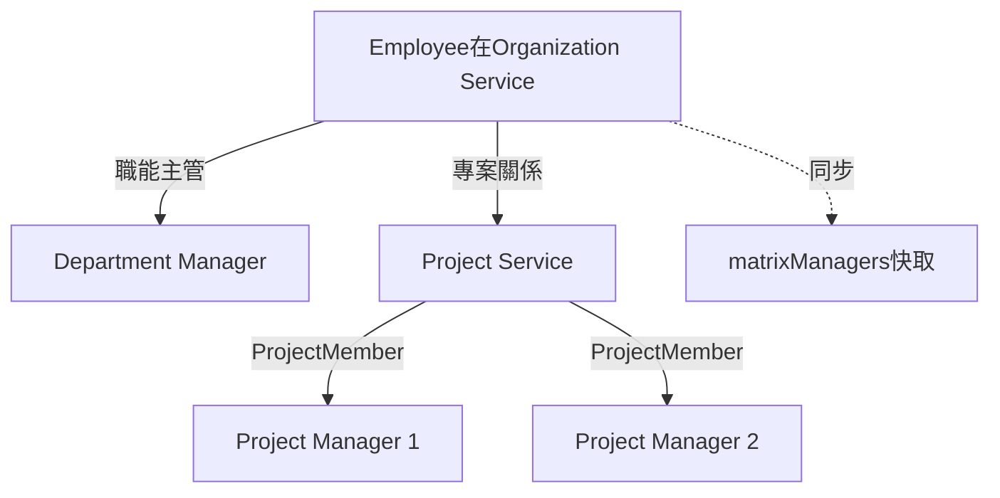
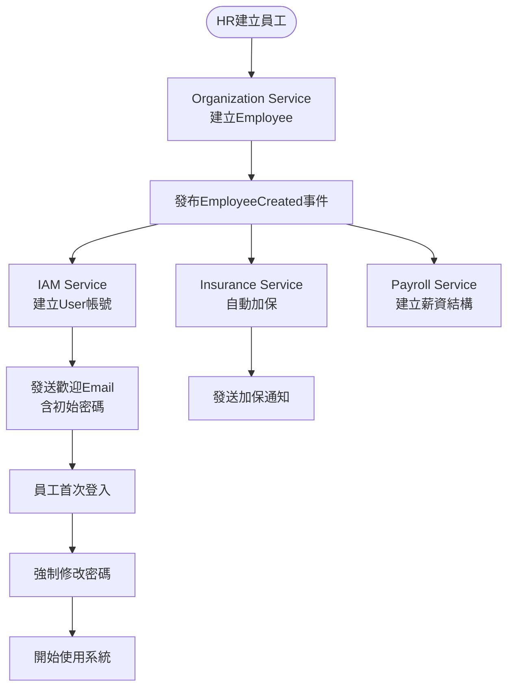
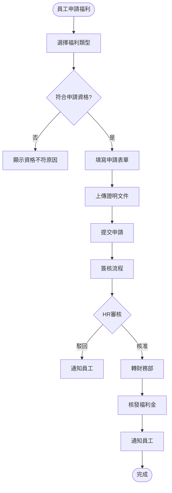
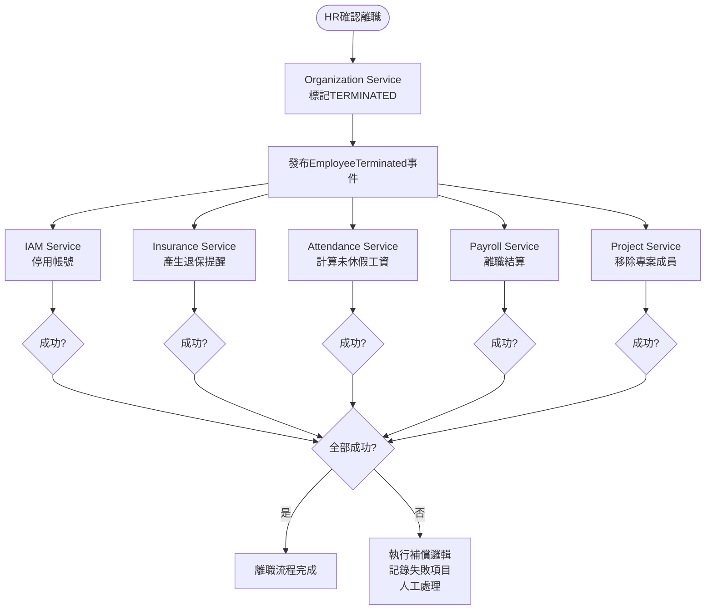
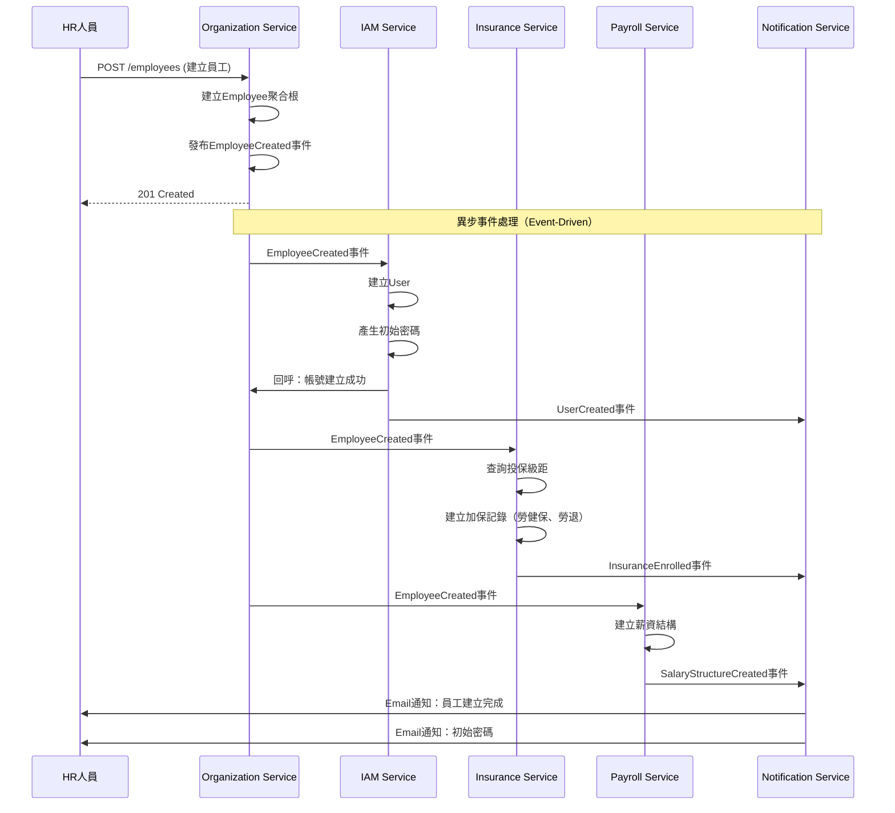

# 組織員工服務 - PM審查補充文件

**版本:** 1.1  
**日期:** 2025-11-30  
**補充說明:** 根據PM審查報告補充遺漏需求

---

## 📋 本文件補充的PM審查項目

### P1 優先級
- **ORG-003:** 矩陣式管理設計
- **ORG-004:** ESS福利申請功能

### P2 優先級
- **ORG-005:** 員工意見反饋/申訴管道

### P3 優先級
- **ORG-001:** 員工照片上傳優化
- **ORG-002:** 合約附件管理整合
- **ORG-006:** 內部公告與政策文件查詢
- **ORG-007:** 員工通訊錄查詢

### 文件增強
- 業務流程圖：員工到職、離職、福利申請
- 循序圖：到職Saga流程、離職Saga流程
- 事件JSON範例
- 業務案例

---

## 1. 矩陣式管理 (ORG-003) - P1

### 1.1 設計方案說明

**矩陣式管理定義:** 員工同時隸屬於職能部門（如：研發部）和專案團隊（如：XX銀行專案），有多個主管。

**架構設計決策:**
- **職能組織關係:** 由 Organization Service 管理（Employee.managerId）
- **專案團隊關係:** 由 Project Service 管理（ProjectMember）

### 1.2 Employee聚合根補充

```
Employee {
  // 原有欄位...
  
  // 職能主管（單一）
  managerId: UUID (FK to Employee, 直屬主管/職能主管)
  
  // 矩陣式管理擴充
  functionalManager: UUID (與managerId相同，語意更清楚)
  matrixManagers: List<MatrixManager> (專案主管清單)
}

MatrixManager {
  projectId: UUID (FK to Project)
  managerId: UUID (FK to Employee, 專案經理)
  role: String (例：Tech Lead, BA...)
  startDate: Date
  endDate: Date (nullable)
}
```

**注意:** matrixManagers作為快取欄位，實際數據來源為ProjectMember，定期同步。

### 1.3 整合設計



**同步機制:**
- Project Service 發布 `ProjectMemberAdded` 事件
- Organization Service 訂閱並更新 Employee.matrixManagers
- Organization Service 發布 `ProjectMemberRemoved` 事件時同步移除

### 1.4 API補充

```
GET /api/v1/employees/{id}/managers
查詢員工所有主管（職能+專案）

Response:
{
  "functionalManager": {
    "type": "FUNCTIONAL",
    "managerId": "uuid",
    "managerName": "李部長",
    "department": "研發部"
  },
  "projectManagers": [
    {
      "type": "PROJECT",
      "managerId": "uuid",
      "managerName": "王PM",
      "projectName": "XX銀行專案",
      "role": "Tech Lead"
    }
  ]
}
```

---

## 2. ESS福利申請 (ORG-004) - P1

### 2.1 新增聚合根

#### BenefitApplication (福利申請)
```
BenefitApplication {
  applicationId: UUID (PK)
  employeeId: UUID (FK)
  
  benefitType: BenefitType
  benefitName: String
  benefitDescription: Text
  
  // 申請金額/數量
  requestedAmount: Decimal (nullable, 依福利類型)
  requestedItems: JSON (nullable, 例如旅遊人數)
  
  // 證明文件
  proofAttachments: List<String> (附件URL清單)
  
  // 申請資訊
  reason: Text
  appliedAt: DateTime
  
  // 審核資訊
  status: ApplicationStatus
  approverId: UUID (nullable)
  approvedAt: DateTime (nullable)
  rejectionReason: String (nullable)
  
  // 核發資訊
  approvedAmount: Decimal (nullable)
  paidDate: Date (nullable)
  isPaid: Boolean
  
  workflowInstanceId: UUID
  createdAt: DateTime
}

enum BenefitType {
  EMPLOYEE_TRAVEL      // 員工旅遊補助
  BIRTHDAY_GIFT        // 生日禮金
  MARRIAGE_SUBSIDY     // 結婚補助
  FUNERAL_SUBSIDY      // 喪葬補助
  BIRTH_SUBSIDY        // 生育補助
  FESTIVAL_BONUS       // 三節獎金
  HEALTH_CHECKUP       // 健康檢查
  EDUCATION_SUBSIDY    // 在職進修補助
  OTHER                // 其他福利
}
```

### 2.2 福利政策設定

#### BenefitPolicy (福利政策)
```
BenefitPolicy {
  policyId: UUID
  organizationId: UUID
  
  benefitType: BenefitType
  benefitName: String
  description: Text
  
  // 給付標準
  isFixedAmount: Boolean
  fixedAmount: Decimal (nullable)
  amountFormula: String (nullable, 例如"月薪*2")
  maxAmount: Decimal (nullable, 上限)
  
  // 申請條件
  eligibilityRules: JSON (資格規則)
  requiredDocuments: List<String>
  
  // 發放設定
  paymentMethod: PaymentMethod (CASH, TRANSFER, VOUCHER)
  paymentTiming: String (例如"審核通過後7日內")
  
  isActive: Boolean
  effectiveDate: Date
}

eligibilityRules範例：
{
  "minServiceMonths": 6,          // 最短年資
  "employmentTypes": ["FULL_TIME"], // 適用雇用類型
  "maxTimesPerYear": 1,           // 年度申請次數上限
  "validMonths": [1,2,12]         // 可申請月份
}
```

### 2.3 福利類型詳細說明

| 福利類型 | 給付標準 | 申請條件 | 證明文件 |
|:---|:---|:---|:---|
| 員工旅遊補助 | 5,000元/人/年 | 年資>=6個月 | 旅遊發票、證明 |
| 生日禮金 | 1,000元 | 在職員工 | 無 |
| 結婚補助 | 12,000元 | 首次結婚 | 結婚證書 |
| 喪葬補助 | 直系親屬30,000元<br/>其他親屬20,000元 | 在職員工 | 訃聞、證明文件 |
| 生育補助 | 第一胎20,000元<br/>第二胎以上30,000元 | 在職員工 | 出生證明 |
| 三節獎金 | 月薪×0.5 ~ 2個月 | 年資>=3個月 | 無 |
| 健康檢查 | 16,000元/2年 | 年資>=1年 | 健檢報告 |

### 2.4 API補充

```
POST /api/v1/benefits/applications
申請福利

GET /api/v1/benefits/policies
查詢可申請的福利清單

GET /api/v1/benefits/applications/me
查詢個人福利申請記錄
```

---

## 3. 員工申訴管道 (ORG-005) - P2

### 3.1 新增實體

#### Complaint (申訴/反饋)
```
Complaint {
  complaintId: UUID
  employeeId: UUID
  
  type: ComplaintType
  title: String
  content: Text
  isAnonymous: Boolean (是否匿名)
  
  category: ComplaintCategory
  priority: Priority (LOW, NORMAL, HIGH, URGENT)
  
  attachments: List<String>
  
  status: ComplaintStatus
  handledBy: UUID (nullable, FK to Employee, 處理人)
  response: Text (nullable, 回覆內容)
  handledAt: DateTime (nullable)
  
  createdAt: DateTime
}

enum ComplaintType {
  FEEDBACK    // 意見反饋
  COMPLAINT   // 投訴申訴
  SUGGESTION  // 建議
}

enum ComplaintCategory {
  SALARY          // 薪資相關
  WORK_ENVIRONMENT // 工作環境
  MANAGEMENT      // 管理制度
  COLLEAGUE       // 同事關係
  HARASSMENT      // 職場騷擾
  OTHER           // 其他
}

enum ComplaintStatus {
  SUBMITTED   // 已提交
  REVIEWING   // 審閱中
  HANDLED     // 已處理
  CLOSED      // 已結案
}
```

### 3.2 隱私保護機制

- 匿名申訴：系統不記錄employeeId，僅記錄UUID
- 加密儲存：敏感內容欄位AES加密
- 存取控管：僅HR高階主管可查看
- 禁止追蹤：不發送任何通知給被申訴對象

---

## 4. 其他補充項目（P3）

### 4.1 員工照片上傳 (ORG-001)

```
POST /api/v1/employees/{id}/photo
Content-Type: multipart/form-data

Request:
  file: (image binary)

業務規則:
- 格式: JPG, PNG
- 大小: <= 2MB
- 解析度: 建議 300x400 pixels
- 儲存: Document Service或雲端儲存（S3）
- 路徑: Employee.photoUrl
```

### 4.2 合約附件管理 (ORG-002)

**整合Document Service:**
```
EmployeeContract {
  // ...
  attachmentUrl: String
  // 實際檔案由Document Service管理
}

流程:
1. 上傳合約PDF → Document Service
2. 取得documentId
3. 儲存至EmployeeContract.attachmentUrl
```

### 4.3 員工通訊錄 (ORG-007)

```
GET /api/v1/employees/directory
查詢員工通訊錄

Query Parameters:
- search: 搜尋關鍵字（姓名、部門、職稱）
- departmentId: 篩選部門
- includePhoto: 是否包含照片

Response:
[
  {
    "employeeNumber": "E001",
    "fullName": "張三",
    "department": "研發部 > 前端組",
    "jobTitle": "前端工程師",
    "companyEmail": "zhang.san@company.com",
    "extension": "8001",
    "photoUrl": "/photos/E001.jpg"
  }
]
```

---

## 5. 業務流程圖

### 5.1 員工到職完整流程


### 5.2 福利申請流程


### 5.3 員工離職Saga流程


---

## 6. 循序圖

### 6.1 員工到職Saga循序圖


---

## 7. 事件JSON範例

### 7.1 EmployeeTerminated 事件（離職）
```json
{
  "eventType": "EmployeeTerminated",
  "eventId": "uuid-event",
  "timestamp": "2025-11-30T17:00:00Z",
  "aggregateId": "employee-uuid",
  "aggregateType": "Employee",
  "version": 3,
  "payload": {
    "employeeId": "uuid-emp",
    "employeeNumber": "E001",
    "fullName": "張三",
    "terminationDate": "2025-12-31",
    "reason": "個人生涯規劃",
    "organizationId": "uuid-org",
    "departmentId": "uuid-dept",
    "lastWorkingDay": "2025-12-30",
    "hasUnpaidLeave": true,
    "unpaidLeaveDays": 3.5,
    "projects": ["proj-uuid-1", "proj-uuid-2"]
  },
  "metadata": {
    "correlationId": "uuid-corr",
    "causationId": "resignation-request-uuid",
    "userId": "hr-manager-uuid",
    "ipAddress": "192.168.1.100"
  }
}
```

### 7.2 BenefitApplicationApproved 事件
```json
{
  "eventType": "BenefitApplicationApproved",
  "eventId": "uuid",
  "timestamp": "2025-11-30T15:00:00Z",
  "payload": {
    "applicationId": "uuid-app",
    "employeeId": "uuid-emp",
    "benefitType": "MARRIAGE_SUBSIDY",
    "approvedAmount": 12000,
    "paymentMethod": "TRANSFER",
    "expectedPaymentDate": "2025-12-07"
  }
}
```

---

##8. 業務案例

### 業務案例 UC-ORG-001: 員工申請結婚補助

**角色:** 員工王小美

**前置條件:**
- 王小美在職1年
- 王小美即將結婚，尚未申請過結婚補助

**操作步驟:**

1. **登入ESS系統**
   - 王小美登入 → 點擊「員工自助服務」→「福利申請」

2. **查看可申請福利**
   - 系統顯示福利清單：
     * ✅ 員工旅遊補助（剩餘1次）
     * ✅ 結婚補助（可申請）
     * ❌ 生育補助（尚未符合條件）

3. **選擇結婚補助**
   - 點擊「結婚補助」
   - 系統顯示福利說明：
     * 給付金額：12,000元
     * 申請條件：首次結婚、在職員工
     * 需檢附：結婚證書影本

4. **填寫申請表**
   - 結婚日期：2025-12-20
   - 配偶姓名：李大衛
   - 上傳結婚證書.pdf

5. **提交審核**
   - 系統驗證通過
   - 提交至簽核流程（直屬主管 → HR → 財務）

6. **審核流程**
   - Day 1: 主管審核通過
   - Day 2: HR審核通過
   - Day 3: 財務部確認撥款

7. **核發福利**
   - Day 7: 12,000元匯入王小美銀行帳戶
   - 王小美收到Email通知：「結婚補助已核發」

**預期結果:**
- 申請狀態：已核發
- 核發金額：12,000元
- 該福利不可再次申請

### 業務案例 UC-ORG-002: 矩陣式管理下的績效考核

**角色:** 工程師張三

**情境:**
- 職能部門：研發部（主管：李部長）
- 專案團隊：XX銀行專案（PM：王經理）
- XX保險專案（PM：陳經理）

**績效考核流程:**

1. **自評階段**
   - 張三填寫自評表

2. **主管評核**
   - 系統查詢張三的所有主管：
     * 職能主管：李部長
     * 專案主管：王經理、陳經理
   
3. **多角度評分**
   - 李部長評分：技術能力、團隊合作
   - 王經理評分：專案貢獻度、客戶溝通
   - 陳經理評分：專案執行力

4. **綜合評等**
   - HR彙總三位主管評分
   - 計算加權平均：
     * 職能主管 40%
     * 專案主管1 30%
     * 專案主管2 30%

5. **結果與薪資調整**
   - 綜合評等：A級
   - 薪資調薪：10%
   - 發放績效獎金

**系統支援:**
- Organization Service提供主管清單
- Performance Service執行考核流程
- Payroll Service執行調薪

---

**補充文件結束**

**主文件:** 02_組織員工服務需求分析書.md  
**修訂日期:** 2025-11-30  
**修訂人:** SA根據PM審查意見
