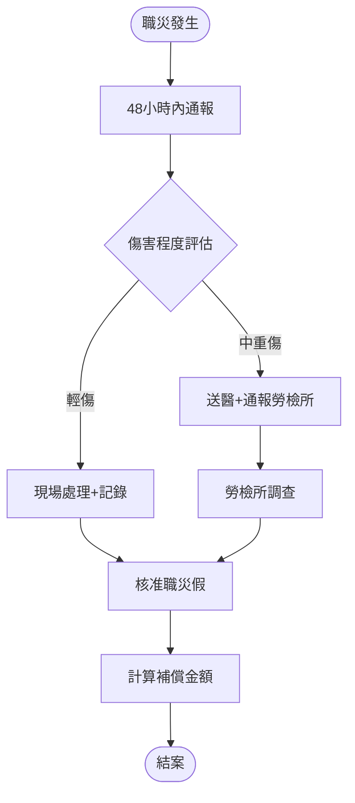
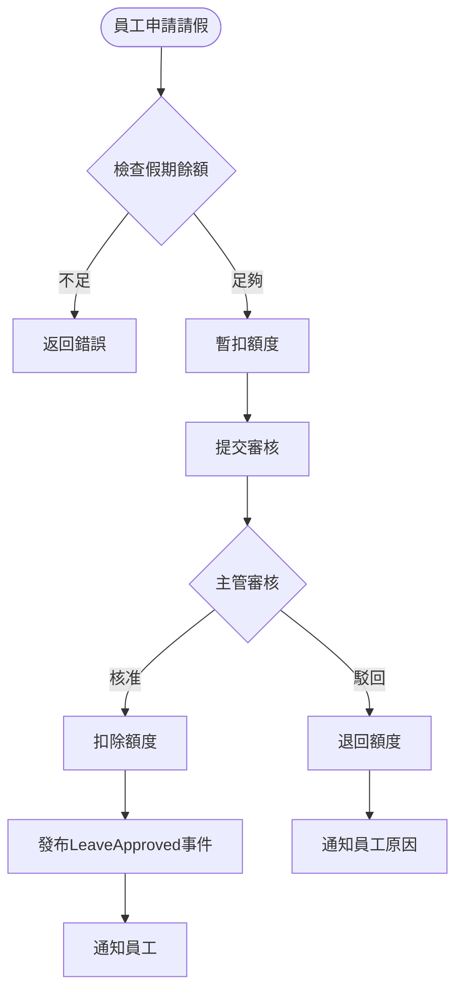
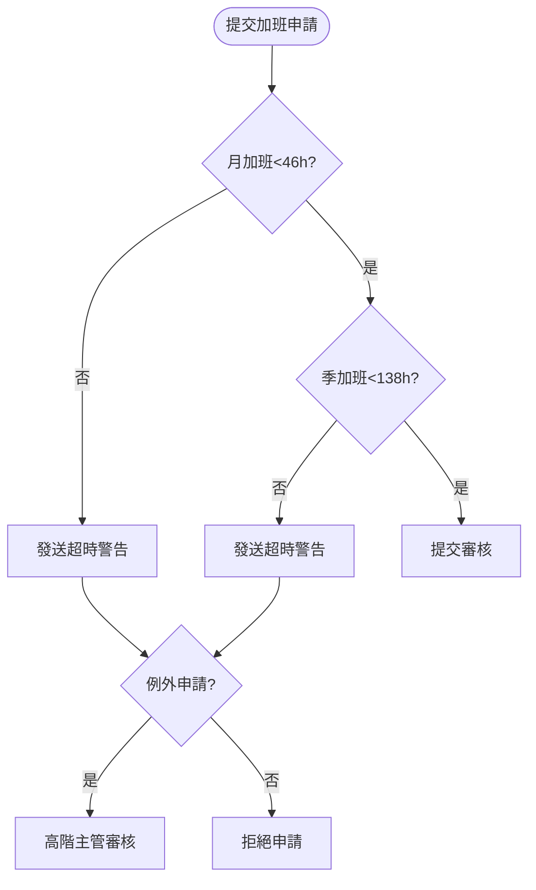
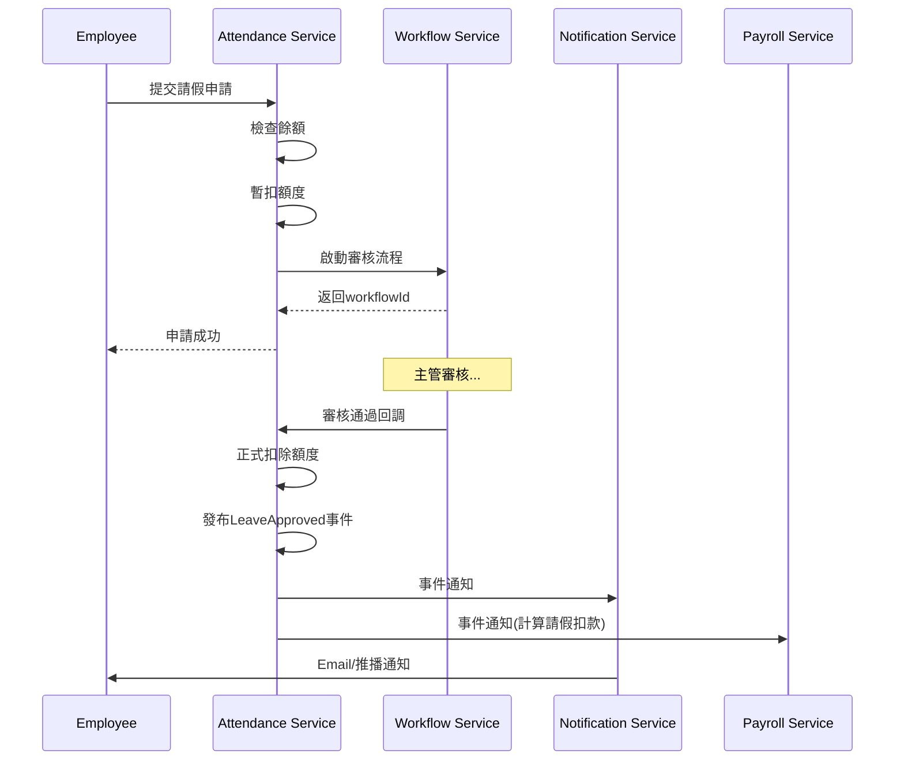

# 考勤管理服務 - PM審查補充文件

**版本:** 1.1  
**日期:** 2025-11-26  
**補充說明:** 根據PM審查報告補充遺漏需求

---

## 📋 本文件補充的PM審查項目

### P0 優先級（法規遵循）
- **ATT-004:** 變形工時管理詳細設計
- **ATT-006:** 職業災害管理完整功能

### P1 優先級
- **ATT-003:** 出差申請功能
- **ATT-005:** 哺乳時間記錄
- **ATT-007:** 加班例外處理機制
- **ATT-001:** 生物辨識打卡
- **ATT-002:** 離線打卡

### 文件增強
- 業務流程圖（Mermaid）
- 循序圖（Mermaid）
- 事件JSON範例
- 業務案例

---

## 1. 變形工時管理 (ATT-004) - P0

### 1.1 聚合根補充

#### FlexTimeSchedule (變形工時排班)
```
FlexTimeSchedule {
  scheduleId: UUID
  employeeId: UUID
  organizationId: UUID
  
  flexType: FlexTimeType (TWO_WEEK, FOUR_WEEK, EIGHT_WEEK)
  startDate: Date
  endDate: Date
  
  weeklySchedules: List<WeeklySchedule>
  
  totalWorkingHours: Decimal
  approvedBy: UUID
  status: ScheduleStatus
}

enum FlexTimeType {
  TWO_WEEK    // 二週變形
  FOUR_WEEK   // 四週變形
  EIGHT_WEEK  // 八週變形
}

WeeklySchedule {
  weekNumber: Integer
  dailyHours: Map<DayOfWeek, Decimal>
  totalHours: Decimal
}
```

### 1.2 變形工時加班認定規則

**二週變形工時（勞基法§30-1）:**
- 二週總工時不超過84小時
- 單日正常工時上限10小時
- 每週至少1天例假日
- **加班認定:** 超過二週84小時或單日10小時

**四週變形工時（勞基法§30）:**
- 四週總工時不超過168小時  
- 單日正常工時上限10小時
- **加班認定:** 超過四週168小時或單日10小時

**八週變形工時（勞基法§30）:**
- 八週總工時不超過336小時
- 單日正常工時上限8小時（可例外10小時，但一週不超過2日）
- **加班認定:** 超過八週336小時

### 1.3 API補充

```
POST /api/v1/attendance/flex-schedules
創建變形工時排班

GET /api/v1/attendance/flex-schedules/{id}/overtime-check
檢查是否超時（加班認定）
```

---

## 2. 職業災害管理 (ATT-006) - P0

### 2.1 聚合根補充

#### OccupationalInjury (職業災害)
```
OccupationalInjury {
  injuryId: UUID
  employeeId: UUID
  
  // 災害資訊
  injuryDate: DateTime
  injuryLocation: String
  injuryDescription: Text
  injuryType: InjuryType (MINOR, MODERATE, SEVERE, FATAL)
  
  // 通報資訊
  reportedBy: UUID
  reportedAt: DateTime
  isReportedToAuthority: Boolean (是否通報勞檢所)
  authorityReportDate: Date
  
  // 醫療資訊
  medicalInstitution: String
  diagnosisResult: Text
  estimatedRecoveryDays: Integer
  
  // 職災假
  injuryLeaves: List<InjuryLeaveRecord>
  totalLeaveDays: Decimal
  
  // 補償
  compensationAmount: Decimal
  compensationPaidDate: Date
  
  status: InjuryStatus
}

enum InjuryType {
  MINOR    // 輕傷：未失能
  MODERATE // 中度：暫時失能
  SEVERE   // 重傷：永久部分失能
  FATAL    // 死亡
}

InjuryLeaveRecord {
  leaveId: UUID
  startDate: Date
  endDate: Date
  days: Decimal
  isFullPay: Boolean (職災假全薪)
}
```

### 2.2 職災處理流程



### 2.3 職災補償計算

**法規依據:** 勞基法§59

```java
public BigDecimal calculateInjuryCompensation(OccupationalInjury injury) {
    BigDecimal dailyWage = employeeSalary.divide(30, 2, ROUND_HALF_UP);
    
    // 醫療費用全額補償
    BigDecimal medicalCost = injury.getMedicalCost();
    
    // 工資補償（原領工資）
    BigDecimal wageLoss = dailyWage.multiply(injury.getTotalLeaveDays());
    
    // 失能補償（視失能等級）
    BigDecimal disabilityComp = calculateDisabilityCompensation(injury);
    
    return medicalCost.add(wageLoss).add(disabilityComp);
}
```

### 2.4 API補充

```
POST /api/v1/attendance/occupational-injuries
通報職業災害

POST /api/v1/attendance/occupational-injuries/{id}/leave
申請職災假（自動核准）

GET /api/v1/attendance/occupational-injuries/{id}/compensation
查詢補償金額
```

---

## 3. 出差申請 (ATT-003) - P1

### 3.1 聚合根補充

#### BusinessTripApplication
```
BusinessTripApplication {
  tripId: UUID
  employeeId: UUID
  
  destination: String
  purpose: String
  startDate: Date
  endDate: Date
  totalDays: Decimal
  
  transport: TransportType (PLANE, TRAIN, CAR, OTHER)
  estimatedExpense: Decimal
  
  status: ApplicationStatus
  workflowInstanceId: UUID
}
```

---

## 4. 其他補充項目（P1-P3）

### 4.1 哺乳時間記錄 (ATT-005)
```
NursingTimeRecord {
  recordId: UUID
  employeeId: UUID
  recordDate: Date
  times: Integer (每日2次)
  minutes: Integer (每次30分鐘)
}
```

**法規:** 勞基法§52，子女未滿1歲

### 4.2 加班例外處理 (ATT-007)
```
OvertimeException {
  exceptionId: UUID
  employeeId: UUID
  reason: ExceptionReason (DISASTER, EMERGENCY)
  overtimeHours: Decimal (可超過46小時)
  approvedBy: UUID (需高階主管)
}
```

### 4.3 生物辨識打卡 (ATT-001)
```
POST /api/v1/attendance/check-in/biometric
Request: {
  "employeeId": "uuid",
  "biometricType": "FACE|FINGERPRINT",
  "biometricData": "base64_encoded_data"
}
```

### 4.4 離線打卡 (ATT-002)
App本地儲存 → 連線後同步 → 衝突檢測與解決

---

## 5. 業務流程圖

### 5.1 請假審核流程


### 5.2 加班時數管控流程


---

## 6. 循序圖

### 6.1 請假申請循序圖


---

## 7. 事件JSON範例

### 7.1 LeaveApproved 事件
```json
{
  "eventType": "LeaveApproved",
  "eventId": "550e8400-e29b-41d4-a716-446655440001",
  "timestamp": "2025-11-26T10:30:00Z",
  "aggregateId": "leave-app-001",
  "aggregateType": "LeaveApplication",
  "version": 1,
  "payload": {
    "applicationId": "uuid-leave-app",
    "employeeId": "uuid-emp-001",
    "employeeName": "張三",
    "leaveType": {
      "code": "ANNUAL",
      "name": "特休假"
    },
    "startDate": "2025-12-01",
    "endDate": "2025-12-02",
    "totalDays": 2,
    "approvedBy": "uuid-manager-001",
    "approvedByName": "李經理",
    "approvedAt": "2025-11-26T10:30:00Z"
  },
  "metadata": {
    "correlationId": "uuid-correlation",
    "causationId": "uuid-causation",
    "userId": "uuid-manager-001",
    "ipAddress": "192.168.1.100"
  }
}
```

### 7.2 OvertimeApproved 事件
```json
{
  "eventType": "OvertimeApproved",
  "eventId": "uuid-event",
  "timestamp": "2025-11-26T18:00:00Z",
  "payload": {
    "overtimeId": "uuid-ot",
    "employeeId": "uuid-emp",
    "overtimeDate": "2025-11-26",
    "hours": 2,
    "overtimeType": "WEEKDAY",
    "compensationType": "PAY"
  }
}
```

---

## 8. 業務邏輯詳述

### 8.1 特休天數自動計算邏輯

**輸入:** 員工到職日、計算基準日  
**輸出:** 特休天數

**詳細邏輯:**
```
STEP 1: 計算年資
  服務年資 = 計算基準日 - 到職日
  整年數 = 服務年資的年份部分
  整月數 = 服務年資的月份部分

STEP 2: 依勞基法規則對映
  IF 整年數 == 0 AND 整月數 >= 6:
    特休天數 = 3 × ((整月數 - 6) / 6)  # 比例計算
  ELSE IF 整年數 == 1:
    特休天數 = 7
  ELSE IF 整年數 == 2:
    特休天數 = 10
  ELSE IF 整年數 >= 3 AND 整年數 < 5:
    特休天數 = 14
  ELSE IF 整年數 >= 5 AND 整年數 < 10:
    特休天數 = 15
  ELSE IF 整年數 >= 10:
    特休天數 = MIN(15 + (整年數 - 10), 30)  # 每年+1天，上限30

STEP 3: 設定到期日
  到期日 = 到職日 + 特休週年 + 1年

STEP 4: 返回特休資訊
```

---

## 9. 操作邏輯步驟

### 9.1 員工申請2天特休的完整操作步驟

**前置條件:**
- 員工張三已登入系統
- 張三到職2年，有10天特休額度，已使用3天，剩餘7天

**操作步驟:**

1. **開啟請假功能**
   - 張三點擊「我的差勤」→「請假申請」
   
2. **選擇假別**
   - 系統顯示假期餘額列表
   - 張三看到：特休假 剩餘7天
   - 選擇「特休假」

3. **選擇日期**
   - 開始日期: 2025-12-01 (全天)
   - 結束日期: 2025-12-02 (全天)
   - 系統自動計算：2天

4. **填寫事由**
   - 請假事由: "家庭事務"
   - (特休不需證明文件)

5. **確認提交**
   - 系統顯示預覽：
     * 申請天數: 2天
     * 暫扣後剩餘: 5天
   - 點擊「提交申請」

6. **系統處理**
   - 檢查餘額（7天 >= 2天，通過）
   - 檢查日期衝突（無衝突）
   - 暫扣額度（7 - 2 = 5天）
   - 提交至簽核流程

7. **等待審核**
   - 系統發送通知給直屬主管李經理
   - 張三可在「申請記錄」查看狀態：待審核

8. **主管審核**
   - 李經理收到待辦通知
   - 李經理點擊「核准」

9. **完成**
   - 系統正式扣除2天特休
   - 張三收到核准通知
   - 最終餘額: 5天

---

## 10. 業務案例

### 業務案例 UC-ATT-001: 變形工時員工加班認定

**角色:** 王五（採用二週變形工時）

**情境:**
- 王五所在部門採用二週變形工時（84小時/2週）
- 第一週排班: 一~五 各9小時，共45小時
- 第二週排班: 一~四 各9小時，五 3小時，共39小時
- 總計: 84小時（符合規定）

**案例:** 王五第一週週五因專案需求加班2小時

**處理:**
1. 系統檢查當日排班: 9小時
2. 實際工時: 9 + 2 = 11小時
3. **判定結果:** 
   - 單日超過10小時上限 → 超過1小時為加班
   - 二週總時數: 84 + 1 = 85小時 → 超過84小時，1小時為加班
4. **加班費計算:** 平日延長工時1小時 × 1.34倍

### 業務案例 UC-ATT-002: 職業災害處理

**角色:** 陳六（生產線作業員）

**情境:** 陳六在作業過程中手部被機器夾傷

**處理流程:**
1. **立即處理 (0小時):**
   - 現場主管送醫急救
   
2. **48小時內通報:**
   - 人資建檔職災記錄
   - 傷害評估: 中度（骨折，需休養2個月）
   - 通報勞檢所（72小時內）

3. **職災假核准:**
   - 陳六申請職災假60天
   - 系統自動核准（職災假無需一般審核）
   - 薪資: 全薪（勞基法§59）

4. **補償計算:**
   - 醫療費用: 50,000元（檢附收據）
   - 工資補償: 月薪50,000 ÷ 30 × 60天 = 100,000元
   - 總補償: 150,000元

5. **後續追蹤:**
   - 每月關懷陳六復原狀況
   - 復工評估
   - 勞檢所調查配合

---

**補充文件結束**

**主文件:** 03_考勤管理服務需求分析書.md  
**修訂日期:** 2025-11-26  
**修訂人:** SA根據PM審查意見
