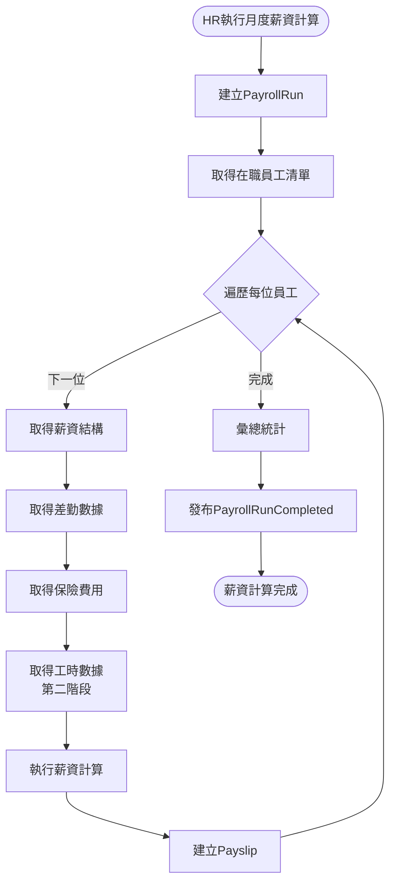
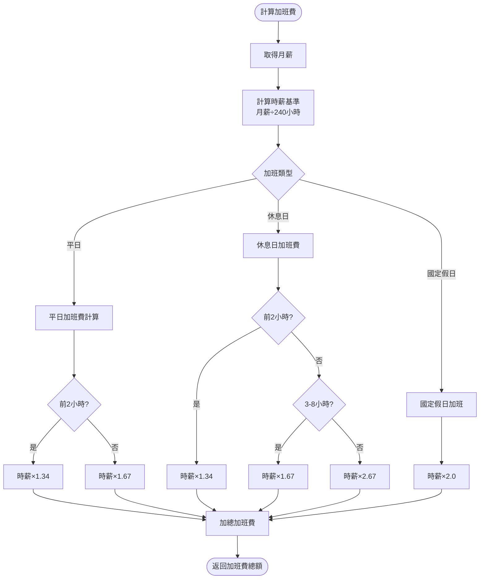
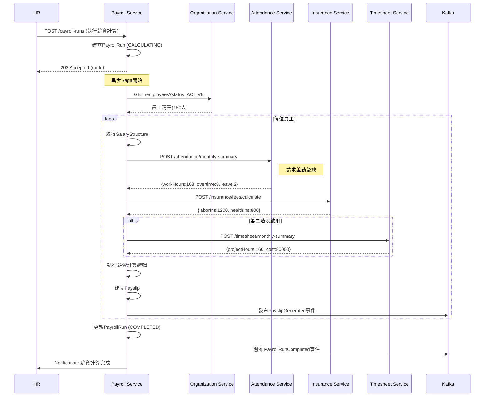

# 薪資管理服務 - PM審查補充文件

**版本:** 1.1  
**日期:** 2025-11-30  
**補充說明:** 補充業務流程圖、循序圖、事件案例等

---

## 📋 補充內容

### 文件增強
- 業務流程圖：薪資計算Saga流程、加班費計算流程
- 循序圖：薪資計算跨服務互動
- 事件JSON範例：PayslipGenerated、PayrollRunCompleted
- 業務邏輯詳述：加班費計算公式、所得稅扣繳邏輯
- 業務案例：完整薪資計算實例

---

## 1. 業務流程圖

### 1.1 月度薪資計算Saga流程


### 1.2 加班費計算詳細流程


---

## 2. 循序圖

### 2.1 薪資計算Saga循序圖（關鍵！）


---

## 3. 事件JSON範例

### 3.1 PayslipGenerated 事件
```json
{
  "eventType": "PayslipGenerated",
  "eventId": "uuid-event",
  "timestamp": "2025-11-30T23:00:00Z",
  "aggregateId": "payslip-uuid",
  "aggregateType": "Payslip",
  "version": 1,
  "payload": {
    "payslipId": "uuid-payslip",
    "payrollRunId": "uuid-run",
    "employeeId": "uuid-emp",
    "employeeName": "張三",
    "payPeriod": "2025-11",
    "payDate": "2025-12-05",
    
    "baseSalary": 50000,
    "allowances": {
      "jobAllowance": 5000,
      "mealAllowance": 2400
    },
    "totalEarnings": 57400,
    
    "overtimePay": {
      "weekdayHours": 8,
      "weekdayPay": 3333,
      "totalOvertimePay": 3333
    },
    
    "deductions": {
      "laborInsurance": 1200,
      "healthInsurance": 800,
      "pension": 3000,
      "incomeTax": 2000
    },
    "totalDeductions": 7000,
    
    "grossWage": 60733,
    "netWage": 53733,
    
    "pdfUrl": "/payslips/2025-11/uuid.pdf"
  },
  "metadata": {
    "correlationId": "payroll-run-uuid",
    "userId": "hr-manager-uuid"
  }
}
```

### 3.2 PayrollRunCompleted 事件
```json
{
  "eventType": "PayrollRunCompleted",
  "eventId": "uuid",
  "timestamp": "2025-11-30T23:30:00Z",
  "payload": {
    "runId": "uuid-run",
    "organizationId": "uuid-org",
    "payPeriod": "2025-11",
    "payDate": "2025-12-05",
    "totalEmployees": 150,
    "totalGrossAmount": 9000000,
    "totalNetAmount": 7500000,
    "completedAt": "2025-11-30T23:30:00Z"
  }
}
```

---

## 4. 業務邏輯詳述

### 4.1 加班費計算完整公式

**時薪基準計算:**
```
月薪制員工時薪 = 月薪 ÷ 240小時
（勞基法：每月工時上限 = 30天 × 8小時 = 240小時）

範例：月薪50,000元
時薪基準 = 50,000 ÷ 240 = 208.33元
```

**平日延長工時（勞基法§24-1）:**
```
前2小時: 時薪 × 1.34倍
第3小時起: 時薪 × 1.67倍

範例：加班3小時
加班費 = (208.33 × 1.34 × 2) + (208.33 × 1.67 × 1)
       = 558.33 + 347.91
       = 906.24元
```

**休息日加班（勞基法§24-2）:**
```
工作時間在2小時以內: 按平日每小時工資額另再加給1又1/3以上
工作2小時後再繼續工作: 按平日每小時工資額另再加給1又2/3以上

前2小時: 時薪 × 1.34
3-8小時: 時薪 × 1.67
9-12小時: 時薪 × 2.67

範例：休息日加班6小時
加班費 = (208.33 × 1.34 × 2) + (208.33 × 1.67 × 4)
       = 558.33 + 1391.64
       = 1949.97元
```

**國定假日加班（勞基法§39）:**
```
加班費 = 時薪 × 2.0

範例：國定假日加班8小時
加班費 = 208.33 × 2.0 × 8 = 3333.28元
```

### 4.2 所得稅扣繳計算（簡化版）

**級距表（2025年）:**
```
月薪資總額          稅率    累進差額
----------------------------------------
0 ~ 84,500         0%      0
84,501 ~ 254,500   5%      4,225
254,501 ~ 508,500  12%     21,975
508,501 ~ 1,016,500 20%    62,575
1,016,501以上      40%     265,175
```

**計算範例:**
```java
public BigDecimal calculateIncomeTax(BigDecimal monthlyIncome) {
    if (monthlyIncome.compareTo(new BigDecimal("84500")) <= 0) {
        return BigDecimal.ZERO;
    } else if (monthlyIncome.compareTo(new BigDecimal("254500")) <= 0) {
        return monthlyIncome.multiply(new BigDecimal("0.05"))
            .subtract(new BigDecimal("4225"));
    } else if (monthlyIncome.compareTo(new BigDecimal("508500")) <= 0) {
        return monthlyIncome.multiply(new BigDecimal("0.12"))
            .subtract(new BigDecimal("21975"));
    }
    // ... 其他級距
}

// 範例：月薪資總額 100,000元
// 所得稅 = 100,000 × 5% - 4,225 = 775元
```

### 4.3 二代健保補充保費計算

**觸發條件:**
```
單次獎金 > 投保金額 × 4倍時，需扣繳補充保費

計費基準 = 獎金 - (投保金額 × 4)
補充保費 = 計費基準 × 2.11%
```

**範例:**
```
投保金額: 48,200元
年終獎金: 250,000元

計費基準 = 250,000 - (48,200 × 4) = 57,200元
補充保費 = 57,200 × 2.11% = 1,207元
```

---

## 5. 操作邏輯

### 5.1 HR執行月度薪資計算步驟

**前置條件:**
- 當月差勤已結算（Attendance Service月度結算完成）
- 所有請假、加班已審核完畢

**操作步驟:**

1. **登入系統**
   - HR經理登入 → 進入「薪資管理」模組

2. **建立薪資計算批次**
   - 點擊「新增薪資計算」
   - 選擇公司：母公司
   - 選擇期間：2025-11-01 ~ 2025-11-30
   - 設定發薪日：2025-12-05
   - 點擊「建立」

3. **執行計算**
   - 系統顯示：將計算150位員工薪資
   - 點擊「執行計算」
   - 系統開始異步處理

4. **等待計算完成**
   - 進度顯示：已處理 50/150
   - 預估完成時間：約10分鐘

5. **檢視計算結果**
   - 計算完成通知
   - 查看統計：
     * 總應發：9,000,000元
     * 總實發：7,500,000元
     * 平均薪資：60,000元

6. **檢查異常**
   - 查看是否有計算異常的員工
   - 若有，檢視錯誤原因並修正

7. **核准薪資**
   - 點擊「核准薪資」
   - 系統鎖定，不可再修改

8. **產生薪轉檔**
   - 選擇銀行：台北富邦
   - 下載薪轉媒體檔
   - 上傳至銀行系統

9. **發送薪資單**
   - 點擊「發送薪資單」
   - 系統Email發送給所有員工

---

## 6. 業務案例

### 業務案例 UC-PAY-001: 月薪制員工完整薪資計算

**角色:** 員工張三

**基本資料:**
- 職稱：前端工程師
- 月薪：50,000元
- 年資：2年（有特休）

**11月份出勤狀況:**
- 正常工時：168小時
- 平日加班：8小時
- 請特休假：2天（16小時）
- 遲到：1次（5分鐘，不扣薪）

**薪資計算明細:**

**1. 應發項目:**
```
底薪：          50,000元
職務加給：       5,000元
伙食津貼：       2,400元（免稅）
全勤獎金：       1,000元（因遲到不給）
---------------------------------
小計：          57,400元
```

**2. 加班費計算:**
```
時薪基準 = 50,000 ÷ 240 = 208.33元

平日加班8小時（前2小時1.34倍，後6小時1.67倍）:
前2小時 = 208.33 × 1.34 × 2 = 558.33元
後6小時 = 208.33 × 1.67 × 6 = 2,087.48元
---------------------------------
加班費小計：    2,645.81元
```

**3. 請假扣款:**
```
特休假2天 = 不扣薪（0元）
```

**4. 保險費用（個人負擔）:**
```
勞保費：        1,200元
健保費：          800元
勞退自提(0%)：     0元
---------------------------------
保險費小計：    2,000元
```

**5. 稅金:**
```
應稅所得 = 50,000 + 5,000 + 2,645.81 = 57,645.81元
（伙食津貼2,400免稅）

所得稅 = 0元（未達84,501起徵點）
補充保費 = 0元（無單次獎金）
---------------------------------
稅金小計：      0元
```

**6. 最終計算:**
```
總應發 = 57,400 + 2,645.81 = 60,045.81元
總扣除 = 2,000 + 0 = 2,000元
---------------------------------
實發薪資：     58,045.81元
（實際銀行轉帳：58,046元）
```

**薪資單摘要:**
```
=========================================
          2025年11月 薪資單
=========================================
姓名：張三              員工編號：E001
部門：研發部            職稱：前端工程師
-----------------------------------------
【應發項目】
底薪                           50,000
職務加給                        5,000
伙食津貼                        2,400
平日加班費 (8.0小時)            2,646
-----------------------------------------
應發合計                       60,046

【扣除項目】
勞保費                          1,200
健保費                            800
-----------------------------------------
扣除合計                        2,000

【實發金額】                   58,046
=========================================
發薪日：2025-12-05
銀行帳號：台北富邦 ***6789
=========================================
```

---

**補充文件結束**

**主文件:** 04_薪資管理服務需求分析書.md  
**修訂日期:** 2025-11-30  
**修訂人:** SA
