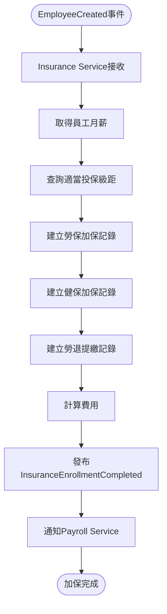
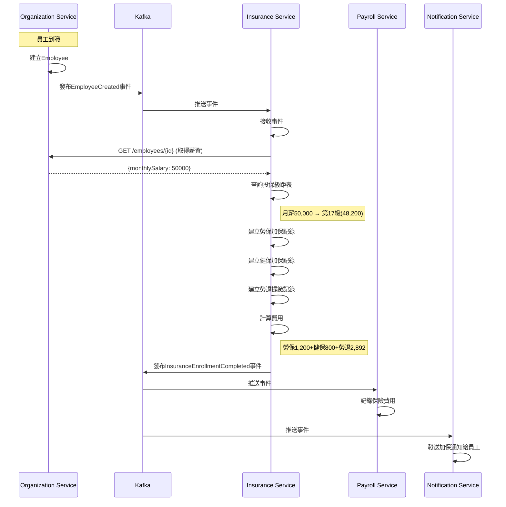

# 保險管理服務 - PM審查補充文件

**版本:** 1.1  
**日期:** 2025-11-30  
**補充說明:** 補充業務流程圖、循序圖、事件案例等

---

## 📋 補充內容

### 文件增強
- 業務流程圖：自動加退保流程、級距調整流程
- 循序圖：員工到職自動加保互動
- 事件JSON範例
- 業務邏輯：投保級距對應邏輯、補充保費計算
- 業務案例：完整加保與補充保費實例

---

## 1. 業務流程圖

### 1.1 員工到職自動加保流程


### 1.2 薪資調整觸發級距調整流程
```mermaid
flowchart TD
    Start([EmployeeSalaryChanged事件]) --> Get[取得新薪資]
    Get --> Current[取得目前投保級距]
    Current --> Find[查詢適當新級距]
    
    Find --> Compare{級距改變?}
    Compare -->|否| Skip[不調整]
    Compare -->|是| Check{差異>=2級?}
    
    Check -->|否| Suggest[建議調整<br/>非強制]
    Check -->|是| Must[必須調整<br/>法規要求]
    
    Suggest --> Notify1[通知HR]
    Must --> Update[更新投保級距]
    Update --> Notify2[通知HR+Payroll]
    
    Skip & Notify1 & Notify2 --> End([完成])
``````

### 1.3 二代健保補充保費觸發流程
```mermaid
flowchart TD
    Start([薪資計算發現獎金]) --> GetLevel[取得投保金額]
    GetLevel --> Calc[計算門檻<br/>投保金額×4]
    
    Calc --> Check{獎金>門檻?}
    Check -->|否| NoFee[無需補充保費]
    Check -->|是| CalcBase[計費基準=<br/>獎金-門檻]
    
    CalcBase --> CalcPremium[補充保費=<br/>基準×2.11%]
    CalcPremium --> Record[記錄補充保費]
    Record --> Payroll[通知Payroll扣除]
    
    NoFee & Payroll --> End([完成])
```

---

## 2. 循序圖

### 2.1 員工到職自動加保循序圖


---

## 3. 事件JSON範例

### 3.1 InsuranceEnrollmentCompleted 事件
```json
{
  "eventType": "InsuranceEnrollmentCompleted",
  "eventId": "uuid-event",
  "timestamp": "2025-11-30T10:30:00Z",
  "aggregateId": "enrollment-uuid",
  "aggregateType": "InsuranceEnrollment",
  "version": 1,
  "payload": {
    "employeeId": "uuid-emp",
    "employeeName": "張三",
    "enrollDate": "2025-12-01",
    
    "insuranceLevel": {
      "level": 17,
      "monthlySalary": 48200
    },
    
    "enrollments": [
      {
        "type": "LABOR",
        "monthlyPremium": 1200,
        "employeePortion": 1200,
        "employerPortion": 4218
      },
      {
        "type": "HEALTH",
        "monthlyPremium": 800,
        "employeePortion": 800,
        "employerPortion": 1600
      },
      {
        "type": "PENSION",
        "contributionRate": 0.06,
        "monthlyAmount": 2892,
        "employerPortion": 2892
      }
    ],
    
    "totalEmployeeFee": 2000,
    "totalEmployerFee": 8710
  },
  "metadata": {
    "correlationId": "uuid-corr",
    "causationId": "employee-created-event-uuid"
  }
}
```

### 3.2 SupplementaryPremiumCalculated 事件
```json
{
  "eventType": "SupplementaryPremiumCalculated",
  "eventId": "uuid",
  "timestamp": "2025-12-01T00:00:00Z",
  "payload": {
    "premiumId": "uuid-premium",
    "employeeId": "uuid-emp",
    "incomeType": "BONUS",
    "incomeAmount": 250000,
    "insuranceLevel": 48200,
    "threshold": 192800,
    "premiumBase": 57200,
    "premiumAmount": 1207,
    "premiumRate": 0.0211
  }
}
```

---

## 4. 業務邏輯詳述

### 4.1 投保級距自動對應邏輯

**勞保投保級距表（2025年）:**
```
級距    月投保金額    適用月薪範圍
----------------------------------
1       27,470      0 ~ 27,600
2       27,600      27,601 ~ 28,800
...
17      48,200      47,101 ~ 50,200
18      50,600      50,201 ~ 52,400
...
33      45,800      最高級距
```

**對應邏輯:**
```java
public InsuranceLevel findAppropriateLevel(BigDecimal monthlySalary) {
    List<InsuranceLevel> levels = levelRepository
        .findByInsuranceTypeOrderByLevelAsc(InsuranceType.LABOR);
    
    // 找到月薪適用的級距
    for (int i = 0; i < levels.size() - 1; i++) {
        InsuranceLevel current = levels.get(i);
        InsuranceLevel next = levels.get(i + 1);
        
        // 月薪落在此級距與下一級距之間
        if (monthlySalary.compareTo(current.getMonthlySalary()) >= 0 
            && monthlySalary.compareTo(next.getMonthlySalary()) < 0) {
            return current;
        }
    }
    
    // 超過最高級距，使用最高級距
    return levels.get(levels.size() - 1);
}

// 範例：月薪50,000元
// → 落在第17級(48,200)與第18級(50,600)之間
// → 應使用第17級(48,200)
```

### 4.2 保險費用精確計算

**勞保費計算:**
```
投保金額：48,200元
勞保費率：11.5%（2025年）

個人負擔：48,200 × 11.5% × 20% = 1,108.6元 → 1,109元（無條件進位）
雇主負擔：48,200 × 11.5% × 70% = 3,880.1元 → 3,881元
政府負擔：48,200 × 11.5% × 10% = 554.3元
```

**健保費計算:**
```
投保金額：48,200元
健保費率：5.17%（2025年）

個人負擔：48,200 × 5.17% × 30% = 747.21元 → 748元
雇主負擔：48,200 × 5.17% × 60% = 1,494.42元 → 1,495元
政府負擔：48,200 × 5.17% × 10% = 249.07元
```

**勞退提繳:**
```
投保金額：48,200元
提繳率：6%（固定）
自提率：0~6%（員工自選）

雇主提繳：48,200 × 6% = 2,892元
個人自提（若選3%）：48,200 × 3% = 1,446元
```

### 4.3 二代健保補充保費完整計算

**法規依據:** 健保法§31

**計算規則:**
```
1. 觸發條件：
   單次獎金 > 投保金額 × 4倍

2. 計費基準：
   獎金 - (投保金額 × 4)

3. 補充保費：
   計費基準 × 2.11%

4. 上限：
   單次補充保費上限 = 10,000,000 × 2.11% = 211,000元
```

**實際案例:**
```
範例1：未達門檻
投保金額：48,200元
年終獎金：150,000元
門檻：48,200 × 4 = 192,800元

150,000 < 192,800 → 無需補充保費

---

範例2：需扣繳補充保費
投保金額：48,200元
年終獎金：250,000元
門檻：192,800元

計費基準 = 250,000 - 192,800 = 57,200元
補充保費 = 57,200 × 2.11% = 1,206.92元 → 1,207元
```

---

## 5. 業務案例

### 業務案例 UC-INS-001: 新進員工自動加保完整流程

**角色:** 新進員工王五

**基本資料:**
- 到職日：2025-12-01
- 職稱：後端工程師
- 月薪：52,000元

**自動加保流程詳解:**

**1. Organization Service建立員工（Day 1）**
```
HR輸入王五資料 → 建立Employee
發布 EmployeeCreated 事件
```

**2. Insurance Service接收事件（Day 1 +5秒）**
```
事件負載：
{
  "employeeId": "uuid-wangwu",
  "monthly​Salary": 52000,
  "hireDate": "2025-12-01"
}
```

**3. 查詢適當投保級距（Day 1 +10秒）**
```
輸入：月薪52,000元

查級距表：
- 第17級：48,200 (月薪47,101~50,200) ❌ 太低
- 第18級：50,600 (月薪50,201~52,400) ✅ 適用
- 第19級：53,000 (月薪52,401~54,600) ❌ 太高

選定：第18級，投保金額50,600元
```

**4. 建立加保記錄（Day 1 +15秒）**
```
勞保加保：
- 加保日期：2025-12-01
- 投保金額：50,600元
- 個人負擔：50,600 × 11.5% × 20% = 1,163.8 → 1,164元
- 雇主負擔：50,600 × 11.5% × 70% = 4,073.3 → 4,074元

健保加保：
- 加保日期：2025-12-01
- 投保金額：50,600元
- 個人負擔：50,600 × 5.17% × 30% = 784.41 → 785元
- 雇主負擔：50,600 × 5.17% × 60% = 1,568.82 → 1,569元

勞退提繳：
- 提繳日期：2025-12-01
- 提繳金額：50,600元
- 雇主提繳：50,600 × 6% = 3,036元
- 個人自提：0元（未選擇自提）
```

**5. 發布事件通知其他服務（Day 1 +20秒）**
```
InsuranceEnrollmentCompleted事件 →
- Payroll Service：記錄保費（個人負擔1,949元）
- Notification Service：Email通知王五加保資訊
```

**6. 產生勞保局申報資料（Day 1結束）**
```
每日批次Job產生當日加保XML檔案
HR於隔日上傳至勞保局e化系統
```

**7. 首月薪資計算時扣除保費（Day 30）**
```
12月薪資：
應發：52,000元
扣除：
- 勞保費：1,164元
- 健保費：785元
- 勞退自提：0元
-----------------
實發：49,051元
```

### 業務案例 UC-INS-002: 年終獎金補充保費計算

**角色:** 員工李經理

**基本資料:**
- 職稱：部門經理
- 月薪：80,000元
- 投保金額：45,800元（最高級距）

**年終獎金發放:**
- 發放時間：2026-01-25
- 年終獎金：300,000元

**補充保費計算:**

**1. 檢查是否需扣繳**
```
投保金額：45,800元
門檻：45,800 × 4 = 183,200元
獎金：300,000元

300,000 > 183,200 → 需扣繳補充保費 ✅
```

**2. 計算計費基準**
```
計費基準 = 獎金 - 門檻
        = 300,000 - 183,200
        = 116,800元
```

**3. 計算補充保費**
```
補充保費 = 計費基準 × 2.11%
        = 116,800 × 0.0211
        = 2,464.48元
        → 無條件進位至整數：2,465元
```

**4. 薪資單呈現**
```
=========================================
          2026年1月 薪資單
=========================================
【應發項目】
底薪                           80,000
年終獎金                      300,000
-----------------------------------------
應發合計                      380,000

【扣除項目】
勞保費                         1,200
健保費                          800
二代健保補充保費                2,465
所得稅                        15,000
-----------------------------------------
扣除合計                       19,465

【實發金額】                  360,535
=========================================
```

**5. 申報與繳納**
```
Insurance Service每月彙總補充保費
於次月底前向健保署申報並繳納
```

---

**補充文件結束**

**主文件:** 05_保險管理服務需求分析書.md  
**修訂日期:** 2025-11-30  
**修訂人:** SA
