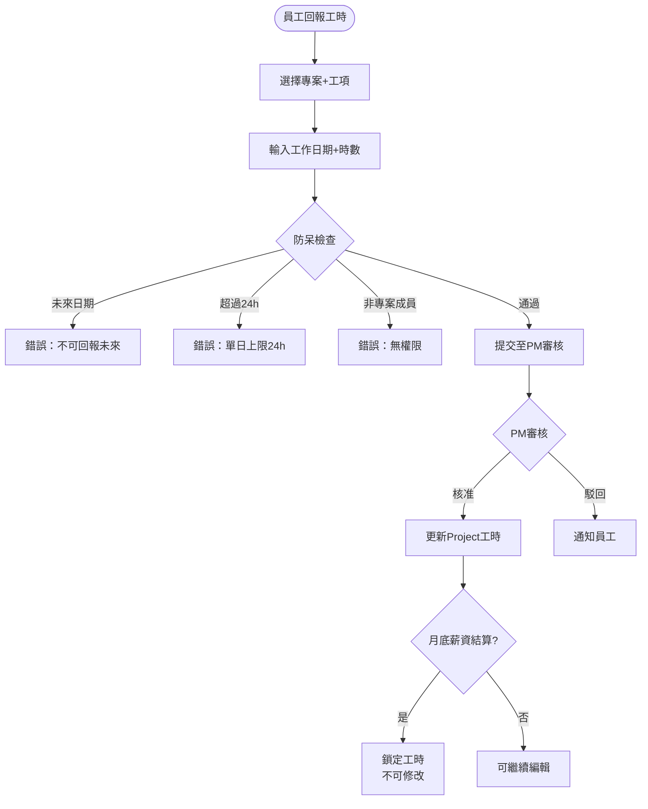
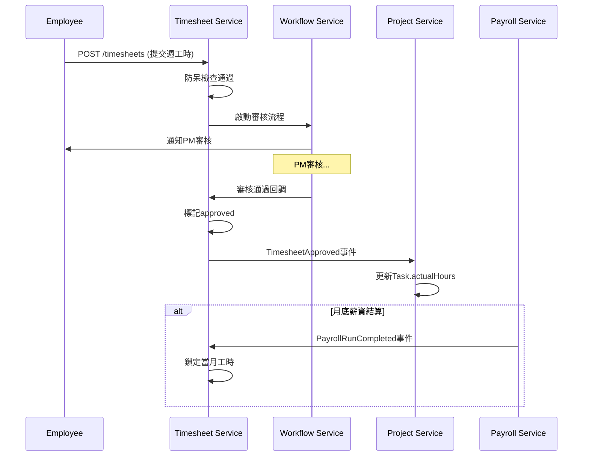
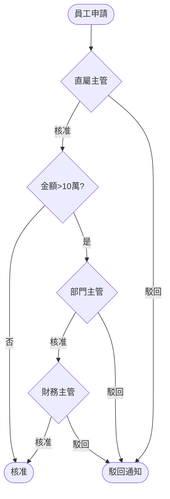
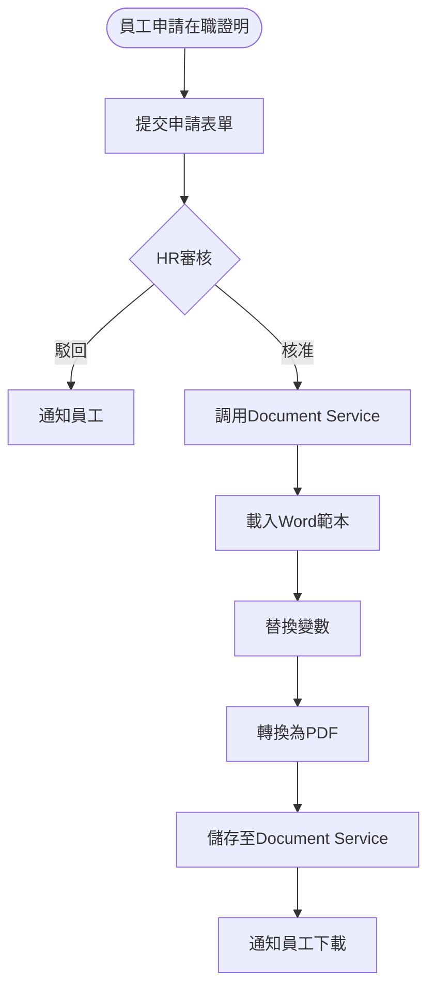
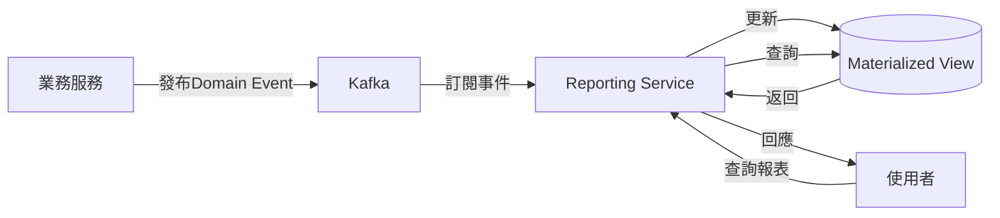
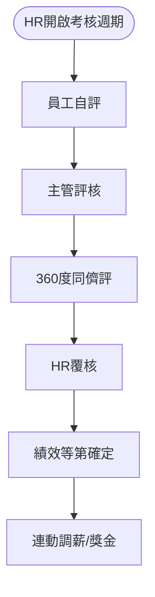

# 工時管理、跨服務整合、支援服務 - PM審查補充文件

**版本:** 1.1  
**日期:** 2025-12-03  
**涵蓋服務:** 工時管理(07)、績效/招募/訓練(08-10)、簽核流程(11)、通知(12)、文件(13)、報表分析(14)

---

## 📋 本文件補充的PM審查項目

### CROSS-001: 通知服務完整設計
### CROSS-002: 資料匯入/匯出功能
### CROSS-003: 簽核流程整合設計

---

## 1. 工時管理服務 (07)

### 1.1 業務流程圖：工時回報與鎖定


### 1.2 循序圖：工時審核與專案成本更新


### 1.3 業務案例：專案人力成本追蹤
**情境:** 追蹤XX銀行專案11月人力成本

```
專案成員工時統計（11月）:
張三 (Tech Lead): 120小時 × 291.67元/h = 35,000元
李四 (Developer): 100小時 × 250元/h = 25,000元
王五 (Developer): 80小時 × 208.33元/h = 16,667元
總計：76,667元

更新Project.actualCost累計：
10月累計：350,000元
11月新增：76,667元
總累計：426,667元
預算使用率：42.67%（總預算1,000,000元）
```

---

## 2. 簽核流程服務 (11) - CROSS-003

### 2.1 完整功能設計

#### 代理人機制
```
UserDelegation {
  delegationId: UUID
  delegator: UUID (委託人)
  delegate: UUID (代理人)
  
  startDate: Date
  endDate: Date
  
  delegationScope: DelegationScope (ALL, SPECIFIC_TYPES)
  approvalTypes: List<String> (若SPECIFIC_TYPES)
  
  isActive: Boolean
}

// 範例：主管出國，指定代理人
delegator: 李經理
delegate: 王副理
startDate: 2025-12-10
endDate: 2025-12-20
delegationScope: ALL
```

#### 催辦提醒機制
```
定時Job每日檢查：
- 待辦超過3天 → 發送第一次提醒
- 待辦超過5天 → 發送第二次提醒+通知上級
- 待辦超過7天 → 升級至更高層主管
```

#### 批次簽核
```
POST /api/v1/workflows/tasks/batch-approve
Request: {
  "taskIds": ["uuid1", "uuid2", "uuid3"],
  "comments": "批次核准"
}

Response: {
  "approved": 3,
  "failed": 0
}
```

#### 可視化流程設計器（未來擴充）
- 拖拉式節點設計
- 支援條件分流（if-else邏輯）
- 支援平行會簽（所有人核准/任一人核准）
- 技術選型建議：使用bpmn.js或自行開發React組件

### 2.2 業務流程圖：多級簽核範例


---

## 3. 通知服務 (12) - CROSS-001

### 3.1 完整架構設計

#### 通知偏好設定
```
UserNotificationPreference {
  userId: UUID
  
  channels: Map<NotificationType, List<Channel>>
  // 範例：
  // LEAVE_APPROVED → [EMAIL, IN_APP]
  // PAYSLIP_GENERATED → [EMAIL]
  // OVERTIME_ALERT → [EMAIL, PUSH, LINE]
  
  quietHours: QuietHours (勿擾時段)
  language: String (zh-TW, en-US)
}

QuietHours {
  enabled: Boolean
  startTime: Time (22:00)
  endTime: Time (08:00)
}
```

#### 企業通訊軟體整合

**Microsoft Teams整合:**
```java
@Service
public class TeamsNotificationService {
    
    public void sendToChannel(String webhookUrl, String message) {
        MessageCard card = MessageCard.builder()
            .title("系統通知")
            .text(message)
            .themeColor("0078D7")
            .build();
            
        restTemplate.postForEntity(webhookUrl, card, Void.class);
    }
}
```

**LINE Notify整合:**
```
POST https://notify-api.line.me/api/notify
Headers:
  Authorization: Bearer {LINE_ACCESS_TOKEN}
Body:
  message=您的請假申請已核准
```

**Slack整合:**
```
POST https://hooks.slack.com/services/{WEBHOOK_PATH}
Body: {
  "text": "系統通知",
  "blocks": [...]
}
```

### 3.2 事件訂閱清單（關鍵）

| 業務事件 | 通知對象 | 渠道 | 優先級 |
|:---|:---|:---|:---|
| LeaveApplied | 主管 | Email+系統 | NORMAL |
| LeaveApproved | 申請人 | Email+推播 | NORMAL |
| OvertimeLimitExceeded | HR+主管 | Email+系統 | HIGH |
| PayslipGenerated | 員工 | Email | NORMAL |
| PasswordExpiringSoon | 使用者 | Email+系統 | NORMAL |
| ProjectBudgetAlert | PM+專案總監 | Email+Teams | URGENT |
| InsuranceEnrollmentCompleted | 員工 | Email | LOW |

### 3.3 通知範本範例

```
【範本：LEAVE_APPROVED】
主旨：請假申請核准通知
內容：
親愛的 {{employeeName}}，

您申請的{{leaveType}}已獲核准：
- 假別：{{leaveTypeName}}
- 期間：{{startDate}} ~ {{endDate}}
- 天數：{{totalDays}}天
- 核准人：{{approverName}}
- 核准時間：{{approvedAt}}

剩餘假期餘額：{{remainingDays}}天

此為系統自動通知，請勿直接回覆。
```

---

## 4. 資料匯入/匯出 (CROSS-002)

### 4.1 批次匯入設計

#### Excel範本格式
```
員工批次匯入範本.xlsx:

Column A: 員工編號* (必填)
Column B: 姓名* (必填)
Column C: 身分證號* (必填，加密儲存)
Column D: Email* (必填)
Column E: 手機
Column F: 部門代碼*
Column G: 職稱*
Column H: 月薪*
Column I: 到職日*
...

備註：
- 標*為必填欄位
- 身分證號格式：A123456789
- Email須唯一
- 部門代碼需先建立
```

#### 匯入API
```
POST /api/v1/employees/import
Content-Type: multipart/form-data

Request:
  file: employees.xlsx
  dryRun: true (預覽模式，不實際匯入)

Response:
{
  "totalRows": 50,
  "validRows": 45,
  "invalidRows": 5,
  "errors": [
    {
      "row": 3,
      "field": "email",
      "error": "Email重複"
    }
  ],
  "preview": [...]
}

若dryRun=false，則實際執行匯入
```

### 4.2 政府申報格式匯出

#### 勞保局加退保申報XML
```xml
<?xml version="1.0" encoding="UTF-8"?>
<enrollment_report>
  <unit_code>12345678</unit_code>
  <report_month>2025-11</report_month>
  <enrollments>
    <enrollment>
      <id_number>A123456789</id_number>
      <name>張三</name>
      <enrollment_date>2025-11-01</enrollment_date>
      <insured_salary>48200</insured_salary>
    </enrollment>
  </enrollments>
</enrollment_report>
```

### 4.3 Excel匯出（通用）
```
GET /api/v1/employees/export?format=xlsx&filters=...

Response Headers:
Content-Type: application/vnd.openxmlformats-officedocument.spreadsheetml.sheet
Content-Disposition: attachment; filename="employees_20251203.xlsx"

Body: (Excel binary)
```

---

## 5. 文件管理服務 (13)

### 5.1 文件分類與權限

```
文件類型與可見性：

EMPLOYEE_CONTRACT (員工合約):
  - 擁有者：該員工+HR
  - 儲存位置：/storage/contracts/{employeeId}/
  
PAYSLIP (薪資單):
  - 擁有者：該員工+財務
  - 加密：AES-256
  - 密碼保護：員工身分證後4碼
  
EMPLOYEE_PHOTO (員工照片):
  - 擁有者：該員工+全公司（通訊錄）
  - 大小限制：2MB
  
POLICY_DOCUMENT (政策文件):
  - 擁有者：HR
  - 可見性：全公司
```

### 5.2 業務流程：產生在職證明


---

## 6. 報表分析服務 (14)

### 6.1 CQRS讀模型更新流程


### 6.2 關鍵報表API

#### 人力盤點報表
```
GET /api/v1/reports/hr/headcount
Response: {
  "asOfDate": "2025-12-03",
  "totalEmployees": 150,
  "byDepartment": [
    {
      "department": "研發部",
      "count": 50,
      "avgSalary": 60000
    }
  ],
  "byEmploymentType": {
    "FULL_TIME": 140,
    "CONTRACT": 8,
    "INTERN": 2
  },
  "newHires": 5,
  "terminations": 2,
  "turnoverRate": "1.33%"
}
```

#### 專案成本分析報表
```
GET /api/v1/reports/project/cost-analysis?projectId={id}
Response: {
  "project": "XX銀行專案",
  "budget": 10000000,
  "actualCost": 3500000,
  "utilizationRate": "35%",
  "profitMargin": "65%",
  "monthlyTrend": [
    {"month": "2025-11", "cost": 350000}
  ],
  "topCostMembers": [
    {"name": "張三", "hours": 120, "cost": 35000}
  ]
}
```

### 6.3 視覺化儀表板範例

**高階主管儀表板配置:**
```json
{
  "dashboardName": "CEO Dashboard",
  "widgets": [
    {
      "type": "KPI_CARD",
      "title": "在職人數",
      "dataSource": "employee_count",
      "value": 150
    },
    {
      "type": "KPI_CARD",
      "title": "本月離職率",
      "dataSource": "turnover_rate",
      "value": "1.33%"
    },
    {
      "type": "LINE_CHART",
      "title": "月度人力成本趨勢",
      "dataSource": "monthly_labor_cost",
      "data": [...]
    },
    {
      "type": "PIE_CHART",
      "title": "部門人數分布",
      "dataSource": "headcount_by_department"
    }
  ]
}
```

---

## 7. 績效/招募/訓練服務 (08-10)

### 7.1 績效考核流程


### 7.2 招募漏斗分析
```
招募漏斗（某職缺）:
應徵者：100人
  ↓ 履歷篩選 (50%淘汰)
面試邀約：50人
  ↓ 面試 (60%淘汰)
Offer發放：20人
  ↓ 接受率 (70%)
到職：14人
  ↓ 試用期通過率 (90%)
留任：12人

招募效率指標：
- Time to Hire: 平均45天
- Cost per Hire: 平均50,000元
- Offer Acceptance Rate: 70%
```

### 7.3 訓練時數追蹤
```
法定訓練時數要求：
- 一般員工：12小時/年
- 管理職：20小時/年
- 新進員工：40小時（首年）

系統追蹤：
張三（一般員工）:
  已完成：8小時
  剩餘：4小時
  狀態：⚠️ 需注意（剩餘4個月）
```

---

## 8. 操作手冊補充

### 8.1 HR月度作業檢查清單
```
每月1日：
☐ 檢查上月考勤是否全部結算
☐ 確認所有請假/加班已審核

每月5日前：
☐ 執行月度薪資計算
☐ 檢查薪資計算異常
☐ 核准薪資
☐ 產生銀行薪轉檔
☐ 發送薪資單Email

每月10日：
☐ 檢查保險加退保申報
☐ 上傳勞保局e化系統

每月底：
☐ 檢查特休到期提醒
☐ 檢查合約到期提醒
☐ 檢查證照到期提醒
```

---

**補充文件結束**

**涵蓋服務:** 07工時管理、08-10績效/招募/訓練、11簽核流程、12通知、13文件、14報表分析  
**修訂日期:** 2025-12-03  
**修訂人:** SA
