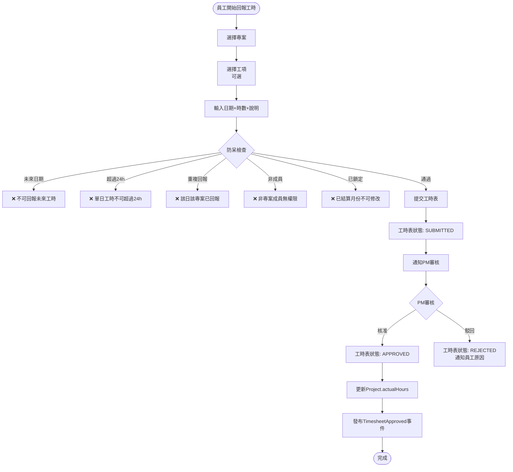
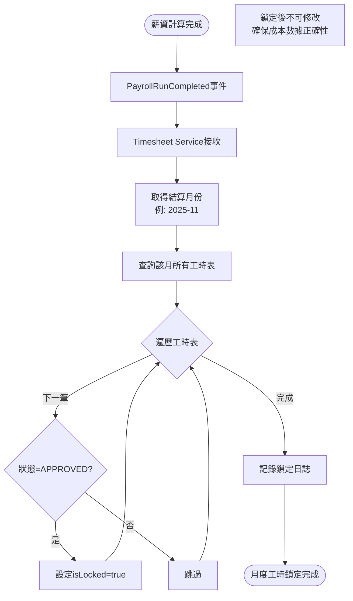
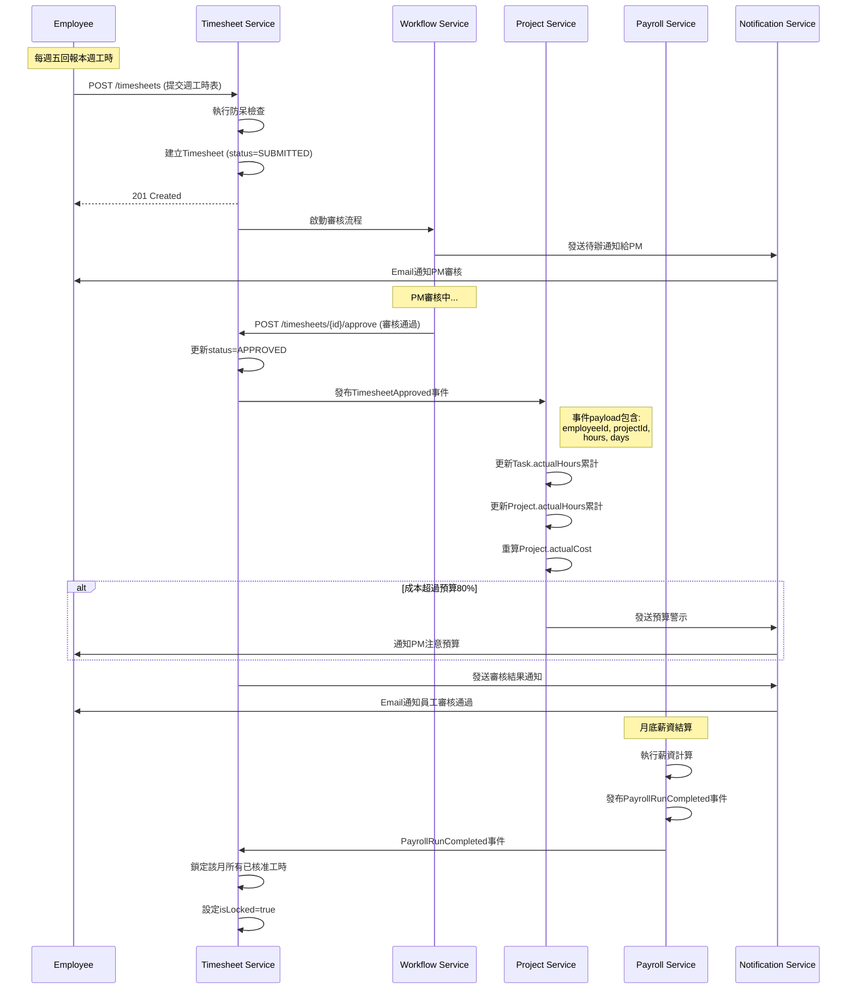

# 工時管理服務 - PM審查補充文件

**版本:** 1.1  
**日期:** 2025-12-03  
**補充說明:** 補充業務流程圖、循序圖、事件案例等

---

## 📋 補充內容

### 文件增強
- 業務流程圖：工時回報與審核流程、工時鎖定機制
- 循序圖：工時審核與專案成本更新
- 事件JSON範例
- 業務邏輯：工時防呆規則
- 業務案例：專案人力成本追蹤

---

## 1. 業務流程圖

### 1.1 週工時回報流程


### 1.2 月度工時鎖定流程


---

## 2. 循序圖

### 2.1 工時審核與成本更新完整循序圖


---

## 3. 事件JSON範例

### 3.1 TimesheetApproved 事件
```json
{
  "eventType": "TimesheetApproved",
  "eventId": "uuid-event",
  "timestamp": "2025-12-03T17:00:00Z",
  "aggregateId": "timesheet-uuid",
  "aggregateType": "Timesheet",
  "version": 1,
  "payload": {
    "timesheetId": "uuid-timesheet",
    "employeeId": "uuid-emp",
    "employeeName": "張三",
    
    "periodStart": "2025-11-25",
    "periodEnd": "2025-12-01",
    
    "entries": [
      {
        "projectId": "uuid-proj-1",
        "projectName": "XX銀行專案",
        "taskId": "uuid-task",
        "taskName": "需求開發",
        "workDate": "2025-11-25",
        "hours": 8,
        "description": "開發使用者登入功能"
      },
      {
        "projectId": "uuid-proj-1",
        "workDate": "2025-11-26",
        "hours": 7,
        "description": "Code Review與測試"
      }
    ],
    
    "totalHours": 40,
    "approvedBy": "uuid-pm",
    "approvedByName": "王經理",
    "approvedAt": "2025-12-03T17:00:00Z"
  },
  "metadata": {
    "correlationId": "uuid-corr",
    "causationId": "timesheet-submit-uuid",
    "userId": "uuid-pm"
  }
}
```

### 3.2 TimesheetLocked 事件
```json
{
  "eventType": "TimesheetLocked",
  "eventId": "uuid",
  "timestamp": "2025-12-05T02:00:00Z",
  "payload": {
    "month": "2025-11",
    "totalTimesheets": 150,
    "lockedTimesheets": 145,
    "skippedTimesheets": 5,
    "reason": "Payroll run completed for 2025-11"
  }
}
```

---

## 4. 業務邏輯詳述

### 4.1 工時防呆規則詳細說明

**規則1：不可回報未來日期**
```java
public void validateWorkDate(LocalDate workDate) {
    LocalDate today = LocalDate.now();
    if (workDate.isAfter(today)) {
        throw new ValidationException(
            "不可回報未來日期的工時，請確認日期: " + workDate
        );
    }
}
```

**規則2：每日工時總和不可超過24小時**
```java
public void validateDailyHours(UUID employeeId, LocalDate date, BigDecimal newHours) {
    // 查詢該員工當日已回報的工時（所有專案加總）
    BigDecimal existingHours = timesheetRepo
        .findByEmployeeAndDate(employeeId, date)
        .stream()
        .map(TimesheetEntry::getHours)
        .reduce(BigDecimal.ZERO, BigDecimal::add);
    
    BigDecimal total = existingHours.add(newHours);
    
    if (total.compareTo(new BigDecimal("24")) > 0) {
        throw new ValidationException(
            String.format("當日工時總和超過24小時 (已回報: %s, 新增: %s, 合計: %s)",
                existingHours, newHours, total)
        );
    }
}
```

**規則3：同一天同一專案不可重複回報**
```java
public void validateDuplicateEntry(UUID employeeId, UUID projectId, LocalDate date) {
    boolean exists = timesheetRepo.existsByEmployeeAndProjectAndDate(
        employeeId, projectId, date
    );
    
    if (exists) {
        throw new ValidationException(
            "該專案在此日期已有工時記錄，請修改現有記錄而非重複新增"
        );
    }
}
```

**規則4：只能回報自己是成員的專案**
```java
public void validateProjectMembership(UUID employeeId, UUID projectId) {
    boolean isMember = projectService.isProjectMember(employeeId, projectId);
    
    if (!isMember) {
        throw new ValidationException(
            "您不是此專案的成員，無法回報工時"
        );
    }
}
```

**規則5：已鎖定月份不可修改**
```java
public void validateNotLocked(LocalDate workDate) {
    YearMonth workMonth = YearMonth.from(workDate);
    
    boolean isLocked = timesheetRepo.isMonthLocked(workMonth);
    
    if (isLocked) {
        throw new ValidationException(
            String.format("%s月份工時已鎖定（薪資已結算），不可修改",
                workMonth)
        );
    }
}
```

---

## 5. 業務案例

### 業務案例 UC-TIME-001: 開發人員週工時回報

**角色:** 前端工程師張三

**本週工作情況（2025-11-25 ~ 12-01）:**
- 專案A: XX銀行核心系統
- 專案B: YY保險後台系統

**週五下午回報工時:**

**步驟1: 選擇專案與填寫工時**
```
專案A工時：
11/25 (一): 8小時 - 開發使用者登入功能
11/26 (二): 7小時 - Code Review與單元測試
11/27 (三): 6小時 - 修正Bug

專案B工時：
11/28 (四): 8小時 - API開發
11/29 (五): 8小時 - 前端整合測試

總計: 37小時
```

**步驟2: 系統防呆檢查**
```
✅ 日期檢查: 都是本週日期
✅ 24小時檢查: 每日不超過8小時
✅ 專案成員: 張三是兩個專案的成員
✅ 重複檢查: 未重複回報
✅ 鎖定檢查: 11月尚未鎖定

通過所有檢查 ✅
```

**步驟3: 提交審核**
```
2025-12-01 16:30:
- 張三提交工時表
- 系統建立Timesheet (status=SUBMITTED)
- 發送Email給兩位專案PM
```

**步驟4: PM審核（次週一）**
```
2025-12-04 10:00:
專案A PM (王經理):
- 查看張三工時明細
- 確認工作內容與實際相符
- 點擊「核准」

專案B PM (李經理):
- 查看張三工時明細  
- 確認工作內容合理
- 點擊「核准」

兩個PM都核准完成
```

**步驟5: 工時生效與成本更新**
```
系統自動處理:

專案A累計:
- 張三本週: 21小時
- 張三11月累計: 120小時
- 張三時薪: 250元/h
- 成本增加: 21h × 250 = 5,250元
- 專案A總成本更新

專案B累計:
- 張三本週: 16小時
- 張三11月累計: 80小時
- 成本增加: 16h × 250 = 4,000元
- 專案B總成本更新
```

**步驟6: 通知**
```
2025-12-04 10:05:
張三收到Email通知:
"您提交的工時表已全部審核通過，感謝您的及時回報。"
```

### 業務案例 UC-TIME-002: 工時鎖定與成本凍結

**情境:** 11月薪資計算完成，工時需鎖定

**時間線:**

**Day 1 (12/1):** HR執行11月薪資計算
```
Payroll Service:
- 計算150位員工薪資
- 使用Timesheet Service提供的11月工時數據
```

**Day 3 (12/3):** HR核准薪資
```
Payroll Service:
- HR核准薪資
- 薪資狀態變為APPROVED
```

**Day 5 (12/5 凌晨2:00):** 自動Job鎖定工時
```
Payroll Service:
- 發布PayrollRunCompleted事件
  {
    "month": "2025-11",
    "status": "APPROVED"
  }

Timesheet Service (訂閱事件):
- 接收事件
- 查詢11月所有工時表
- 將APPROVED狀態的工時表設為isLocked=true
- 結果: 145份工時表已鎖定
```

**Day 5 (12/5 上午):** 員工嘗試修改11月工時
```
張三想修改11/25的工時:
- 進入工時管理頁面
- 點擊編輯11/25工時
- 系統檢查: isLocked=true
- 顯示錯誤: ❌ "11月工時已鎖定（薪資已結算），不可修改"

若確有錯誤需修正:
1. 聯絡HR說明原因
2. HR評估是否需調整薪資
3. 若需要，HR手動調整薪資（不修改工時）
```

**目的:** 確保專案成本數據與已發薪資的一致性

---

## 6. API補充

### 6.1 查詢員工工時統計
```
GET /api/v1/timesheets/statistics/employee
?employeeId={id}&month={month}

Response:
{
  "employeeId": "uuid",
  "employeeName": "張三",
  "month": "2025-11",
  
  "totalHours": 168,
  "billableHours": 160,
  "nonBillableHours": 8,
  
  "byProject": [
    {
      "projectId": "uuid-proj-a",
      "projectName": "XX銀行專案",
      "hours": 120,
      "percentage": "71.4%"
    },
    {
      "projectId": "uuid-proj-b",
      "projectName": "YY保險系統",
      "hours": 40,
      "percentage": "23.8%"
    },
    {
      "projectId": "internal",
      "projectName": "內部教育訓練",
      "hours": 8,
      "percentage": "4.8%",
      "billable": false
    }
  ],
  
  "utilizationRate": "95.2%"
}
```

### 6.2 查詢專案工時統計（供Payroll使用）
```
GET /api/v1/timesheets/statistics/project
?projectId={id}&month={month}

Response:
{
  "projectId": "uuid",
  "projectName": "XX銀行專案",
  "month": "2025-11",
  
  "totalHours": 500,
  "totalCost": 125000,
  
  "byMember": [
    {
      "employeeId": "uuid",
      "employeeName": "張三",
      "hours": 120,
      "hourlyRate": 250,
      "cost": 30000
    },
    {
      "employeeId": "uuid2",
      "employeeName": "李四",
      "hours": 100,
      "hourlyRate": 300,
      "cost": 30000
    }
  ]
}
```

---

**補充文件結束**

**主文件:** 07_工時管理服務需求分析書.md  
**修訂日期:** 2025-12-03  
**修訂人:** SA
