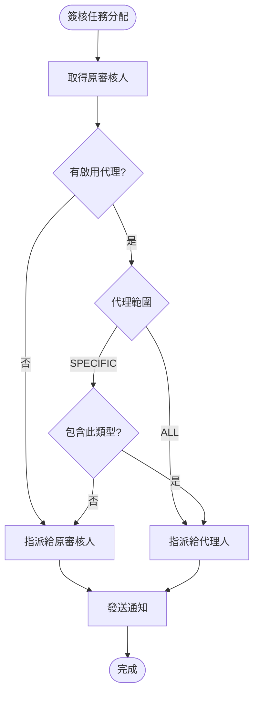
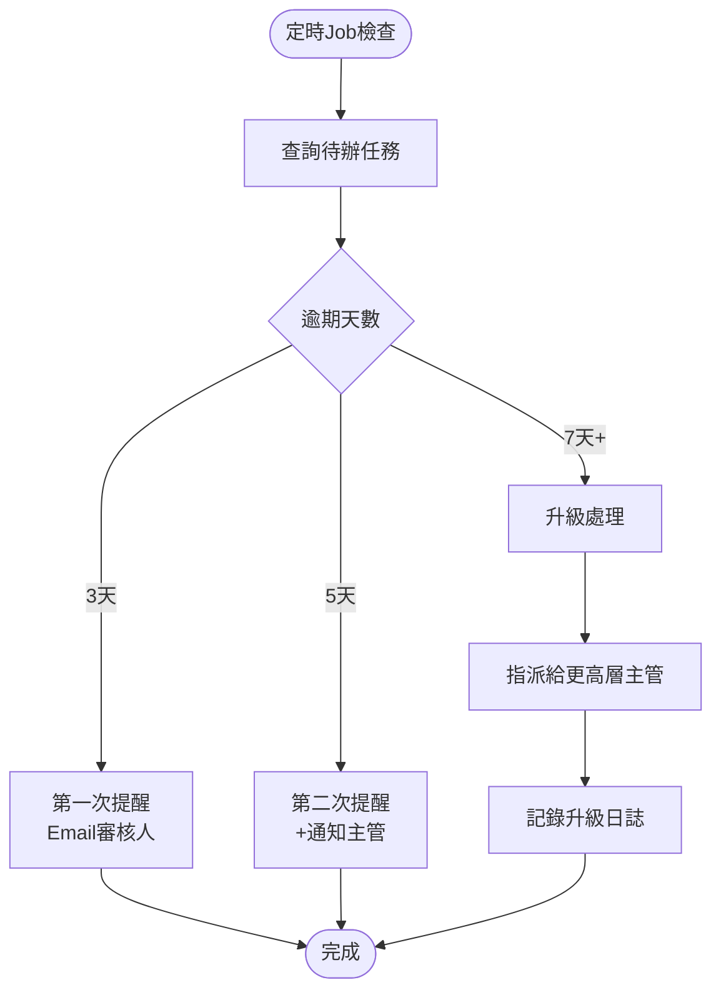

# 簽核流程服務 - PM審查補充文件

**版本:** 1.1  
**日期:** 2025-12-03  
**補充說明:** 根據PM審查報告補充CROSS-003整合設計

---

## 📋 補充的PM審查項目

### CROSS-003: 簽核流程整合設計
- 代理人機制完整設計
- 催辦提醒機制
- 批次簽核功能
- 可視化流程設計器需求

---

## 1. 核心功能補充

### 1.1 代理人機制

#### UserDelegation聚合根
```
UserDelegation {
  delegationId: UUID
  delegator: UUID (委託人)
  delegate: UUID (代理人)
  
  startDate: Date
  endDate: Date
  isActive: Boolean
  
  delegationScope: DelegationScope
  approvalTypes: List<String> (若SPECIFIC_TYPES)
  
  createdAt: DateTime
}

enum DelegationScope {
  ALL              // 所有簽核
  SPECIFIC_TYPES   // 特定類型簽核
}
```

#### 代理邏輯
```java
public UUID getActualApprover(UUID originalApproverId, String approvalType) {
    // 查詢是否有啟用的代理設定
    Optional<UserDelegation> delegation = delegationRepo
        .findActiveByDelegator(originalApproverId, LocalDate.now());
    
    if (delegation.isEmpty()) {
        return originalApproverId; // 無代理，返回原審核人
    }
    
    UserDelegation del = delegation.get();
    
    // 檢查代理範圍
    if (del.getDelegationScope() == DelegationScope.ALL) {
        return del.getDelegate(); // 全部代理
    }
    
    // 檢查是否包含此簽核類型
    if (del.getApprovalTypes().contains(approvalType)) {
        return del.getDelegate();
}
    
    return originalApproverId;
}
```

#### API設計
```
POST /api/v1/workflows/delegations
設定代理人

Request:
{
  "delegator": "uuid-manager",
  "delegate": "uuid-deputy",
  "startDate": "2025-12-10",
  "endDate": "2025-12-20",
  "delegationScope": "ALL",
  "reason": "出國出差"
}

Response 201:
{
  "delegationId": "uuid",
  "status": "ACTIVE"
}
```

### 1.2 催辦提醒機制

#### 定時Job設計
```java
@Scheduled(cron = "0 0 9 * * *") // 每日9:00執行
public void sendPendingTaskReminders() {
    LocalDate today = LocalDate.now();
    
    // 查詢所有待辦任務
    List<WorkflowTask> pendingTasks = taskRepo.findByStatus(TaskStatus.PENDING);
    
    for (WorkflowTask task : pendingTasks) {
        long daysOverdue = ChronoUnit.DAYS.between(task.getCreatedAt().toLocalDate(), today);
        
        if (daysOverdue == 3) {
            // 第一次提醒
            sendReminder(task, ReminderLevel.NORMAL);
            
        } else if (daysOverdue == 5) {
            // 第二次提醒 + 通知上級
            sendReminder(task, ReminderLevel.HIGH);
            notifySupervisor(task);
            
        } else if (daysOverdue >= 7) {
            // 升級至更高層主管
            escalateToHigherLevel(task);
        }
    }
}
```

#### 提醒層級定義
```
NORMAL (3天):
- Email給審核人
- 系統待辦閃爍提示

HIGH (5天):
- Email給審核人（加急標記）
- Email給審核人的直屬主管
- 系統彈窗提醒

URGENT (7天+):
- Email給審核人、直屬主管、部門主管
- 系統強制提醒（登入時彈窗）
- 自動升級至更高層審核
```

### 1.3 批次簽核功能

```
POST /api/v1/workflows/tasks/batch-approve
批次核准多個待辦

Request:
{
  "taskIds": [
    "uuid-task-1",
    "uuid-task-2",
    "uuid-task-3"
  ],
  "decision": "APPROVED",
  "comments": "批次核准員工請假申請"
}

Response 200:
{
  "total": 3,
  "succeeded": 3,
  "failed": 0,
  "results": [
    {
      "taskId": "uuid-task-1",
      "success": true
    },
    {
      "taskId": "uuid-task-2",
      "success": true
    },
    {
      "taskId": "uuid-task-3",
      "success": true
    }
  ],
  "processedAt": "2025-12-03T14:00:00Z"
}
```

**業務規則:**
- 只能批次處理相同類型的簽核
- 每筆仍需通過權限檢查
- 若部分失敗，已成功的不回滾

### 1.4 可視化流程設計器（需求定義）

#### 功能需求
```
【基本功能】
1. 拖拉式節點編輯
   - 開始節點（Start）
   - 審核節點（Approval）
   - 條件判斷節點（Gateway）
   - 結束節點（End）

2. 連線設定
   - 拖拉連線
   - 設定條件（if-else邏輯）

3. 節點配置
   - 審核人設定（角色/特定人員/部門主管）
   - 審核條件（金額、類型等）
   - 超時設定

【進階功能】
4. 平行會簽
   - 所有人都核准（AND）
   - 任一人核准即可（OR）
   - N人中M人核准

5. 流程範本
   - 預設範本（請假、加班、採購等）
   - 自訂範本儲存

6. 流程測試
   - 模擬執行
   - 驗證邏輯正確性
```

#### 技術選型建議
```
選項1: bpmn.js（開源BPMN 2.0引擎）
優點：
- 標準BPMN格式
- 社群成熟
- 功能完整
缺點：
- 學習曲線較陡
- 客製化複雜

選項2: 自行開發React Flow組件
優點：
- 完全客製化
- 易於整合現有系統
- UI/UX可控
缺點：
- 需自行實作引擎邏輯
- 開發成本較高

建議：第一階段使用簡化配置表單，第二/三階段再導入可視化設計器
```

---

## 2. 業務流程圖

### 2.1 代理人機制運作流程


### 2.2 催辦升級流程


---

## 3. 業務案例

### 業務案例 UC-WF-001: 主管出國設定代理人

**情境:** 李經理12/10~12/20出國，指定王副理代理

**12/9 (出國前一天):**
```
李經理操作：
1. 登入系統 → 進入「個人設定」→「代理人設定」
2. 填寫：
   - 代理人：王副理
   - 開始日期：2025-12-10
   - 結束日期：2025-12-20
   - 代理範圍：所有簽核
   - 原因：出國出差
3. 提交

系統處理：
- 建立UserDelegation記錄
- isActive=true（12/10自動啟用）
- 發送Email通知王副理
```

**12/11 (代理期間):**
```
員工張三申請特休假：
- Organization Service發起簽核流程
- Workflow Service查詢審核人：李經理
- 檢查代理設定：啟用中（12/10~12/20）
- 實際指派：王副理

王副理收到待辦通知：
"代理李經理審核張三的請假申請"

王副理審核：
- 查看申請內容
- 點擊「核准（代理）」
- 系統記錄：由王副理代理李經理核准
```

**12/21 (返國後):**
```
系統自動處理：
- UserDelegation.isActive=false（超過endDate）
- 新的簽核任務恢復指派給李經理
```

### 業務案例 UC-WF-002: 批次簽核員工請假

**情境:** HR經理收到15筆員工請假待辦

**傳統方式（逐筆審核）:**
```
點開第1筆 → 查看 → 核准 → 關閉
點開第2筆 → 查看 → 核准 → 關閉
...
預計時間：15分鐘
```

**批次簽核方式:**
```
1. 進入「我的待辦」
2. 篩選：假別=特休假
3. 勾選：checkbox全選15筆
4. 點擊「批次核准」
5. 輸入意見：「批次核准員工特休申請」
6. 確認

系統處理：
- 遍歷15筆任務
- 逐筆執行審核邏輯
- 成功：15筆
- 失敗：0筆
- 發送15封核准通知給員工

預計時間：1分鐘
效率提升：15倍
```

---

**補充文件結束**

**主文件:** 11_簽核流程服務需求分析書.md  
**修訂日期:** 2025-12-03  
**修訂人:** SA
