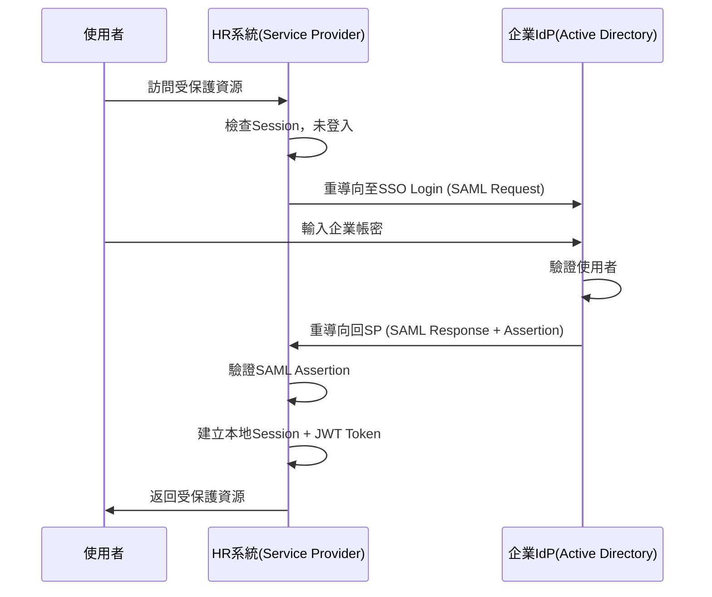
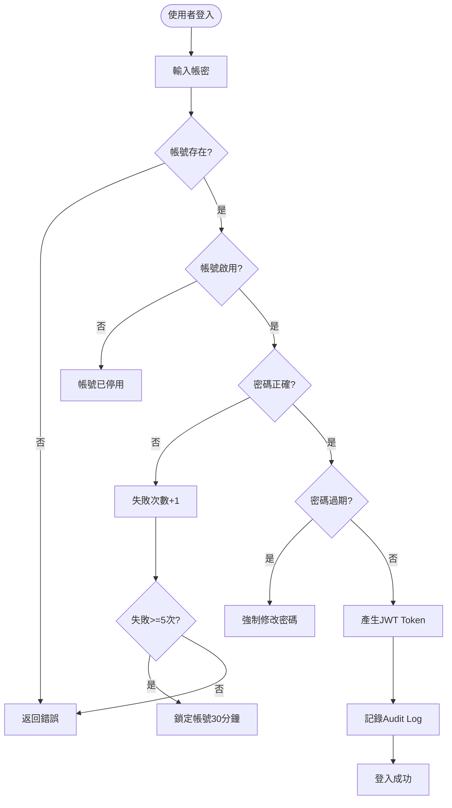
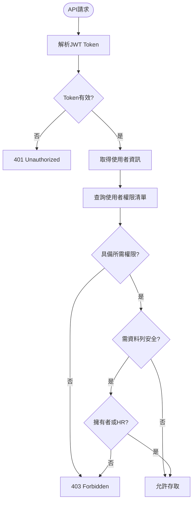
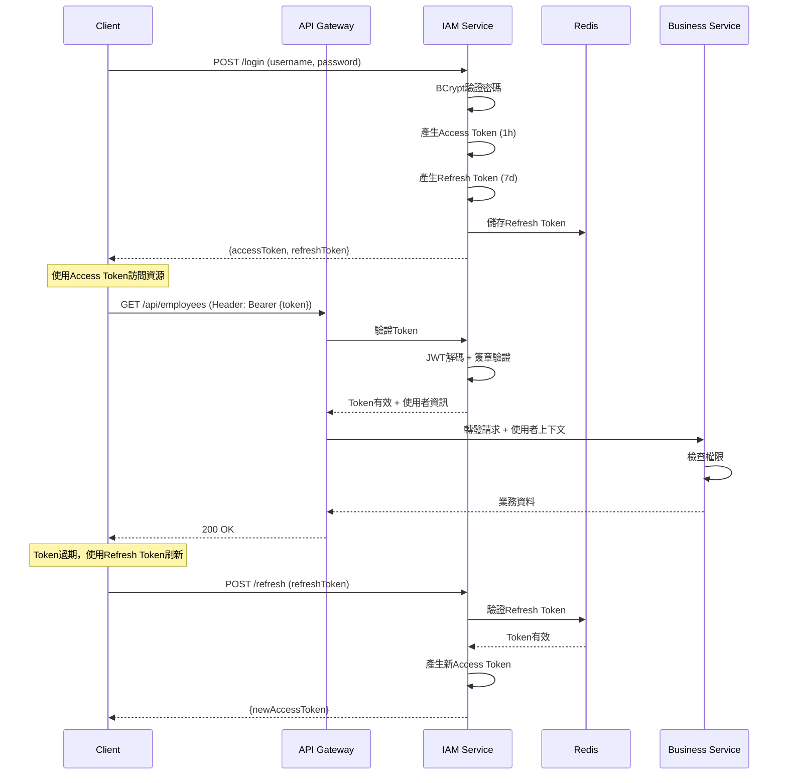

# IAM服務(Identity & Access Management Service) 需求分析書

**版本:** 1.0  
**日期:** 2025-11-24  
**所屬領域:** 通用領域 (Generic Domain)  
**導入階段:** 第一階段（核心基礎服務）

---

## 1. 服務定位與職責

### 1.1 服務概述
IAM服務是整個HR與專案管理系統的**基礎安全服務**，負責所有使用者的身份認證與授權管理。作為系統的安全守門員，所有其他微服務都依賴IAM服務來驗證使用者身份與權限。

### 1.2 核心職責
- **使用者認證 (Authentication):** 驗證使用者身份，核發安全Token
- **授權管理 (Authorization):** 管理角色與權限，控制資源存取
- **使用者生命週期管理:** 帳號建立、停用、密碼管理
- **單一登入 (SSO):** 支援企業內部統一身份認證
- **安全審計:** 記錄所有認證與授權操作
- **多租戶隔離:** 支援母子公司資料邏輯隔離

### 1.3 服務邊界
**屬於IAM服務:**
- 使用者帳號管理（登入帳號、密碼、狀態）
- 角色權限定義與指派
- Token核發與驗證
- 登入日誌

**不屬於IAM服務:**
- 員工個人資料（由Organization Service管理）
- 業務層級的權限邏輯（如「主管可查看部屬資料」由各業務服務自行實作）

---

## 2. 限界上下文定義

### 2.1 上下文名稱
**IAM Context (身份與存取管理上下文)**

### 2.2 通用語言 (Ubiquitous Language)
| 術語 | 定義 | 範例 |
|:---|:---|:---|
| User (使用者) | 系統登入帳號，對應一個員工 | john.doe@company.com |
| Role (角色) | 一組權限的集合 | 人資專員、部門主管、PM |
| Permission (權限) | 對特定資源的操作許可 | attendance:leave:approve |
| Token | 認證憑證，用於後續API呼叫 | JWT Token |
| Principal | 當前認證的使用者主體 | 含userId, roles, permissions |
| Tenant (租戶) | 公司組織單位（母公司或子公司） | 母公司、子公司A |

### 2.3 上下文對映關係
- **User (IAM) ↔ Employee (Organization):** 一對一關係，User.employeeId關聯
- **Tenant (IAM) ↔ Organization (Organization):** 一對一關係，支援多租戶資料隔離

---

## 3. 領域模型設計

### 3.1 聚合根 (Aggregate Root)

#### 聚合根1: User (使用者)
**職責:** 管理使用者帳號、密碼、狀態

**屬性:**
```
User {
  userId: UUID (PK)
  username: String (unique, 登入帳號)
  passwordHash: String (BCrypt加密)
  email: String
  employeeId: UUID (FK to Organization.Employee)
  tenantId: UUID (所屬租戶)
  status: UserStatus (ACTIVE, INACTIVE, LOCKED)
  lastLoginAt: DateTime
  passwordChangedAt: DateTime
  failedLoginAttempts: Integer
  createdAt: DateTime
  updatedAt: DateTime
}

enum UserStatus {
  ACTIVE       // 啟用
  INACTIVE     // 停用
  LOCKED       // 鎖定（多次失敗登入）
}
```

**不變性規則 (Invariants):**
- username必須唯一且不可為空
- 密碼必須符合強度規則（至少8字元、含大小寫字母、數字）
- 連續失敗登入5次後自動鎖定帳號
- INACTIVE或LOCKED狀態的使用者不可登入

**領域行為:**
- `authenticate(password)`: 驗證密碼
- `changePassword(oldPassword, newPassword)`: 修改密碼
- `resetPassword(newPassword)`: 重置密碼（由管理員執行）
- `lock()`: 鎖定帳號
- `unlock()`: 解鎖帳號
- `deactivate()`: 停用帳號
- `recordLoginSuccess()`: 記錄登入成功
- `recordLoginFailure()`: 記錄登入失敗

#### 聚合根2: Role (角色)
**職責:** 定義角色與其包含的權限

**屬性:**
```
Role {
  roleId: UUID (PK)
  roleName: String (unique)
  displayName: String
  description: String
  tenantId: UUID (nullable, null代表系統預設角色)
  isSystemRole: Boolean (系統預設角色不可刪除)
  permissions: Set<Permission>
  createdAt: DateTime
  updatedAt: DateTime
}
```

**不變性規則:**
- roleName在同一tenant內必須唯一
- 系統預設角色(isSystemRole=true)不可刪除與修改權限

**領域行為:**
- `grantPermission(permission)`: 授予權限
- `revokePermission(permission)`: 撤銷權限
- `hasPermission(permission)`: 檢查是否擁有權限

### 3.2 實體 (Entity)

#### 實體1: Permission (權限)
```
Permission {
  permissionId: UUID (PK)
  resource: String (資源名稱, 如 attendance)
  action: String (操作, 如 read, write, approve)
  permissionCode: String (unique, 格式: resource:action)
  description: String
}
```

**範例權限碼:**
- `attendance:leave:approve` - 審核請假
- `payroll:salary:read` - 查看薪資
- `employee:profile:write` - 編輯員工資料
- `project:task:assign` - 指派工項

#### 實體2: UserRole (使用者角色關聯)
```
UserRole {
  userRoleId: UUID (PK)
  userId: UUID (FK)
  roleId: UUID (FK)
  assignedAt: DateTime
  assignedBy: UUID (FK to User)
}
```

#### 實體3: RefreshToken (刷新Token)
```
RefreshToken {
  tokenId: UUID (PK)
  userId: UUID (FK)
  token: String (unique)
  expiresAt: DateTime
  createdAt: DateTime
}
```

### 3.3 值對象 (Value Object)

#### 值對象1: JwtToken
```
JwtToken {
  accessToken: String (JWT格式)
  refreshToken: String
  expiresIn: Integer (秒數)
  tokenType: String (Bearer)
}
```

#### 值對象2: LoginCredentials
```
LoginCredentials {
  username: String
  password: String
  tenantId: UUID
}
```

---

## 4. 領域事件定義

### 4.1 事件清單

| 事件名稱 | 觸發時機 | 事件負載 | 訂閱服務 |
|:---|:---|:---|:---|
| `UserCreated` | 新增使用者帳號 | userId, username, employeeId, tenantId | Organization Service |
| `UserDeactivated` | 停用使用者帳號 | userId, employeeId, deactivatedAt | 所有服務 |
| `UserPasswordChanged` | 使用者修改密碼 | userId, changedAt | Notification Service |
| `UserLoggedIn` | 使用者登入成功 | userId, loginAt, ipAddress | - (僅記錄) |
| `UserLoginFailed` | 使用者登入失敗 | username, failedAt, ipAddress, reason | - (僅記錄) |
| `UserLocked` | 帳號被鎖定 | userId, lockedAt, reason | Notification Service |
| `RoleCreated` | 新增角色 | roleId, roleName, tenantId | - |
| `RolePermissionChanged` | 角色權限變更 | roleId, addedPermissions, removedPermissions | - (快取失效) |
| `UserRoleAssigned` | 指派角色給使用者 | userId, roleId, assignedAt | - (快取失效) |

### 4.2 事件Schema範例

```json
{
  "eventType": "UserCreated",
  "eventId": "uuid",
  "timestamp": "2025-11-24T10:00:00Z",
  "payload": {
    "userId": "uuid",
    "username": "john.doe@company.com",
    "employeeId": "uuid",
    "tenantId": "uuid",
    "roles": ["EMPLOYEE"]
  }
}
```

---

## 5. API設計

### 5.1 認證相關API

#### 5.1.1 使用者登入
```
POST /api/v1/auth/login
Content-Type: application/json

Request:
{
  "username": "john.doe@company.com",
  "password": "SecureP@ss123",
  "tenantId": "uuid" (optional, 若為null則為母公司)
}

Response 200:
{
  "accessToken": "eyJhbGciOiJIUzI1NiIsInR5cCI6IkpXVCJ9...",
  "refreshToken": "uuid",
  "expiresIn": 3600,
  "tokenType": "Bearer",
  "user": {
    "userId": "uuid",
    "username": "john.doe@company.com",
    "employeeId": "uuid",
    "roles": ["EMPLOYEE", "PM"]
  }
}

Response 401 Unauthorized:
{
  "error": "INVALID_CREDENTIALS",
  "message": "使用者名稱或密碼錯誤"
}

Response 423 Locked:
{
  "error": "ACCOUNT_LOCKED",
  "message": "帳號已被鎖定，請聯絡系統管理員"
}
```

**業務規則:**
- 連續失敗5次登入後鎖定帳號30分鐘
- AccessToken有效期：1小時
- RefreshToken有效期：7天

#### 5.1.2 刷新Token
```
POST /api/v1/auth/refresh
Content-Type: application/json

Request:
{
  "refreshToken": "uuid"
}

Response 200:
{
  "accessToken": "new_jwt_token",
  "expiresIn": 3600
}

Response 401:
{
  "error": "INVALID_REFRESH_TOKEN",
  "message": "Refresh token無效或已過期"
}
```

#### 5.1.3 登出
```
POST /api/v1/auth/logout
Authorization: Bearer {accessToken}

Response 204 No Content
```

**業務邏輯:** 刪除RefreshToken，AccessToken自然過期

#### 5.1.4 驗證Token (供其他微服務呼叫)
```
POST /api/v1/auth/verify
Content-Type: application/json

Request:
{
  "token": "jwt_token"
}

Response 200:
{
  "valid": true,
  "principal": {
    "userId": "uuid",
    "username": "john.doe@company.com",
    "employeeId": "uuid",
    "tenantId": "uuid",
    "roles": ["EMPLOYEE", "PM"],
    "permissions": [
      "attendance:leave:approve",
      "project:task:assign"
    ]
  }
}

Response 401:
{
  "valid": false,
  "error": "TOKEN_EXPIRED"
}
```

### 5.2 使用者管理API

#### 5.2.1 建立使用者
```
POST /api/v1/users
Authorization: Bearer {accessToken}
Required Permission: user:create

Request:
{
  "username": "jane.smith@company.com",
  "email": "jane.smith@company.com",
  "employeeId": "uuid",
  "tenantId": "uuid",
  "initialPassword": "TempP@ss123",
  "roles": ["EMPLOYEE"]
}

Response 201:
{
  "userId": "uuid",
  "username": "jane.smith@company.com",
  "status": "ACTIVE",
  "createdAt": "2025-11-24T10:00:00Z"
}
```

**業務規則:**
- 當Organization Service建立新員工後，會呼叫此API建立對應帳號
- 初始密碼為臨時密碼，首次登入後強制修改
- username通常為員工email

#### 5.2.2 查詢使用者
```
GET /api/v1/users/{userId}
Authorization: Bearer {accessToken}
Required Permission: user:read

Response 200:
{
  "userId": "uuid",
  "username": "john.doe@company.com",
  "email": "john.doe@company.com",
  "employeeId": "uuid",
  "tenantId": "uuid",
  "status": "ACTIVE",
  "roles": [
    {
      "roleId": "uuid",
      "roleName": "PM",
      "displayName": "專案經理"
    }
  ],
  "lastLoginAt": "2025-11-24T09:00:00Z",
  "createdAt": "2025-01-01T00:00:00Z"
}
```

#### 5.2.3 停用使用者
```
PUT /api/v1/users/{userId}/deactivate
Authorization: Bearer {accessToken}
Required Permission: user:deactivate

Response 200:
{
  "userId": "uuid",
  "status": "INACTIVE",
  "deactivatedAt": "2025-11-24T10:00:00Z"
}
```

**觸發場景:** 員工離職時，Organization Service會同步呼叫此API

#### 5.2.4 修改密碼
```
PUT /api/v1/users/me/password
Authorization: Bearer {accessToken}

Request:
{
  "oldPassword": "OldP@ss123",
  "newPassword": "NewP@ss456"
}

Response 200:
{
  "message": "密碼修改成功"
}

Response 400:
{
  "error": "WEAK_PASSWORD",
  "message": "密碼強度不足，需包含大小寫字母、數字，至少8字元"
}
```

#### 5.2.5 重置密碼 (管理員功能)
```
PUT /api/v1/users/{userId}/reset-password
Authorization: Bearer {accessToken}
Required Permission: user:reset-password

Request:
{
  "newPassword": "TempP@ss789",
  "requireChangeOnLogin": true
}

Response 200:
{
  "message": "密碼已重置"
}
```

### 5.3 角色管理API

#### 5.3.1 建立角色
```
POST /api/v1/roles
Authorization: Bearer {accessToken}
Required Permission: role:create

Request:
{
  "roleName": "DEPT_MANAGER",
  "displayName": "部門主管",
  "description": "部門主管角色，可審核部門員工假勤",
  "tenantId": "uuid",
  "permissions": [
    "attendance:leave:approve",
    "attendance:overtime:approve",
    "employee:profile:read"
  ]
}

Response 201:
{
  "roleId": "uuid",
  "roleName": "DEPT_MANAGER",
  "displayName": "部門主管",
  "createdAt": "2025-11-24T10:00:00Z"
}
```

#### 5.3.2 查詢所有角色
```
GET /api/v1/roles?tenantId={tenantId}
Authorization: Bearer {accessToken}
Required Permission: role:read

Response 200:
[
  {
    "roleId": "uuid",
    "roleName": "EMPLOYEE",
    "displayName": "一般員工",
    "isSystemRole": true,
    "permissionCount": 15
  },
  {
    "roleId": "uuid",
    "roleName": "DEPT_MANAGER",
    "displayName": "部門主管",
    "isSystemRole": false,
    "permissionCount": 25
  }
]
```

#### 5.3.3 為角色授予權限
```
POST /api/v1/roles/{roleId}/permissions
Authorization: Bearer {accessToken}
Required Permission: role:manage-permission

Request:
{
  "permissions": [
    "project:view:all",
    "project:cost:read"
  ]
}

Response 200:
{
  "roleId": "uuid",
  "addedPermissions": 2,
  "totalPermissions": 27
}
```

**業務邏輯:** 發布 `RolePermissionChanged` 事件，觸發權限快取失效

#### 5.3.4 指派角色給使用者
```
POST /api/v1/users/{userId}/roles
Authorization: Bearer {accessToken}
Required Permission: user:assign-role

Request:
{
  "roleIds": ["uuid1", "uuid2"]
}

Response 200:
{
  "userId": "uuid",
  "roles": [
    {
      "roleId": "uuid1",
      "roleName": "EMPLOYEE"
    },
    {
      "roleId": "uuid2",
      "roleName": "PM"
    }
  ]
}
```

### 5.4 權限管理API

#### 5.4.1 查詢所有權限
```
GET /api/v1/permissions
Authorization: Bearer {accessToken}
Required Permission: permission:read

Response 200:
[
  {
    "permissionId": "uuid",
    "permissionCode": "attendance:leave:approve",
    "resource": "attendance",
    "action": "leave:approve",
    "description": "審核請假申請"
  },
  {
    "permissionId": "uuid",
    "permissionCode": "payroll:salary:read",
    "resource": "payroll",
    "action": "salary:read",
    "description": "查看薪資資料"
  }
]
```

#### 5.4.2 檢查使用者權限
```
GET /api/v1/users/me/permissions/check?permission=attendance:leave:approve
Authorization: Bearer {accessToken}

Response 200:
{
  "hasPermission": true
}
```

---

## 6. 資料模型設計

### 6.1 資料庫Schema (PostgreSQL)

```sql
-- 使用者表
CREATE TABLE users (
    user_id UUID PRIMARY KEY DEFAULT gen_random_uuid(),
    username VARCHAR(255) UNIQUE NOT NULL,
    password_hash VARCHAR(255) NOT NULL,
    email VARCHAR(255) NOT NULL,
    employee_id UUID NOT NULL,
    tenant_id UUID NOT NULL,
    status VARCHAR(20) NOT NULL DEFAULT 'ACTIVE',
    last_login_at TIMESTAMP,
    password_changed_at TIMESTAMP,
    failed_login_attempts INTEGER DEFAULT 0,
    locked_until TIMESTAMP,
    created_at TIMESTAMP DEFAULT CURRENT_TIMESTAMP,
    updated_at TIMESTAMP DEFAULT CURRENT_TIMESTAMP,
    
    CONSTRAINT chk_status CHECK (status IN ('ACTIVE', 'INACTIVE', 'LOCKED'))
);

CREATE INDEX idx_users_username ON users(username);
CREATE INDEX idx_users_employee_id ON users(employee_id);
CREATE INDEX idx_users_tenant_id ON users(tenant_id);

-- 角色表
CREATE TABLE roles (
    role_id UUID PRIMARY KEY DEFAULT gen_random_uuid(),
    role_name VARCHAR(100) NOT NULL,
    display_name VARCHAR(255) NOT NULL,
    description TEXT,
    tenant_id UUID,
    is_system_role BOOLEAN DEFAULT FALSE,
    created_at TIMESTAMP DEFAULT CURRENT_TIMESTAMP,
    updated_at TIMESTAMP DEFAULT CURRENT_TIMESTAMP,
    
    UNIQUE(role_name, tenant_id)
);

CREATE INDEX idx_roles_tenant_id ON roles(tenant_id);

-- 權限表
CREATE TABLE permissions (
    permission_id UUID PRIMARY KEY DEFAULT gen_random_uuid(),
    permission_code VARCHAR(255) UNIQUE NOT NULL,
    resource VARCHAR(100) NOT NULL,
    action VARCHAR(100) NOT NULL,
    description TEXT,
    created_at TIMESTAMP DEFAULT CURRENT_TIMESTAMP
);

CREATE INDEX idx_permissions_code ON permissions(permission_code);

-- 角色權限關聯表
CREATE TABLE role_permissions (
    role_permission_id UUID PRIMARY KEY DEFAULT gen_random_uuid(),
    role_id UUID NOT NULL REFERENCES roles(role_id) ON DELETE CASCADE,
    permission_id UUID NOT NULL REFERENCES permissions(permission_id) ON DELETE CASCADE,
    created_at TIMESTAMP DEFAULT CURRENT_TIMESTAMP,
    
    UNIQUE(role_id, permission_id)
);

CREATE INDEX idx_role_permissions_role_id ON role_permissions(role_id);

-- 使用者角色關聯表
CREATE TABLE user_roles (
    user_role_id UUID PRIMARY KEY DEFAULT gen_random_uuid(),
    user_id UUID NOT NULL REFERENCES users(user_id) ON DELETE CASCADE,
    role_id UUID NOT NULL REFERENCES roles(role_id) ON DELETE CASCADE,
    assigned_at TIMESTAMP DEFAULT CURRENT_TIMESTAMP,
    assigned_by UUID REFERENCES users(user_id),
    
    UNIQUE(user_id, role_id)
);

CREATE INDEX idx_user_roles_user_id ON user_roles(user_id);

-- Refresh Token表
CREATE TABLE refresh_tokens (
    token_id UUID PRIMARY KEY DEFAULT gen_random_uuid(),
    user_id UUID NOT NULL REFERENCES users(user_id) ON DELETE CASCADE,
    token VARCHAR(512) UNIQUE NOT NULL,
    expires_at TIMESTAMP NOT NULL,
    created_at TIMESTAMP DEFAULT CURRENT_TIMESTAMP
);

CREATE INDEX idx_refresh_tokens_user_id ON refresh_tokens(user_id);
CREATE INDEX idx_refresh_tokens_token ON refresh_tokens(token);
CREATE INDEX idx_refresh_tokens_expires_at ON refresh_tokens(expires_at);

-- 登入日誌表 (審計用)
CREATE TABLE login_logs (
    log_id UUID PRIMARY KEY DEFAULT gen_random_uuid(),
    user_id UUID REFERENCES users(user_id),
    username VARCHAR(255) NOT NULL,
    login_at TIMESTAMP DEFAULT CURRENT_TIMESTAMP,
    ip_address VARCHAR(50),
    user_agent TEXT,
    success BOOLEAN NOT NULL,
    failure_reason VARCHAR(255)
);

CREATE INDEX idx_login_logs_user_id ON login_logs(user_id);
CREATE INDEX idx_login_logs_login_at ON login_logs(login_at);
```

### 6.2 資料字典

| 表名 | 說明 | 預估資料量 |
|:---|:---|:---|
| users | 使用者帳號 | 200人 (第一年) |
| roles | 角色定義 | 20-30個角色 |
| permissions | 權限定義 | 100-150個權限 |
| role_permissions | 角色權限關聯 | 500-1000筆 |
| user_roles | 使用者角色關聯 | 300-500筆 |
| refresh_tokens | Refresh Token | 200-500筆 (活躍使用者) |
| login_logs | 登入日誌 | 月增10000筆 (需定期歸檔) |

---

## 7. 與其他服務整合

### 7.1 同步整合 (REST API)

#### 7.1.1 被呼叫：所有微服務 → IAM Service
**場景:** 驗證API請求的Token

```
所有微服務的API請求流程：
1. 接收到帶有Authorization header的請求
2. 呼叫 IAM Service的 /api/v1/auth/verify 驗證Token
3. 取得Principal資訊（userId, roles, permissions）
4. 執行業務邏輯與權限檢查
```

**優化方案:**
- API Gateway統一驗證Token，減少重複呼叫
- IAM Service提供Java SDK，其他服務可本地驗證JWT簽章（無狀態驗證）

#### 7.1.2 主動呼叫：IAM Service → Organization Service
**場景:** 建立使用者時，驗證employeeId是否存在

```
POST IAM:/api/v1/users
  → GET Organization:/api/v1/employees/{employeeId}
  ← 返回Employee資訊
  ← 建立User
```

### 7.2 異步整合 (Event-Driven)

#### 7.2.1 發布事件

| 事件 | 訂閱服務 | 業務場景 |
|:---|:---|:---|
| `UserCreated` | Organization Service | 同步使用者建立狀態 |
| `UserDeactivated` | All Services | 清理該使用者的業務資料權限 |
| `UserLocked` | Notification Service | 發送帳號鎖定通知給使用者 |

#### 7.2.2 訂閱事件

| 事件 | 發布服務 | IAM Service處理邏輯 |
|:---|:---|:---|
| `EmployeeCreated` | Organization Service | **自動建立對應User帳號**（username=員工email, 初始密碼） |
| `EmployeeTerminated` | Organization Service | **自動停用User帳號** (`deactivate()`) |
| `EmployeeEmailChanged` | Organization Service | 同步更新User.username與email |

**重要:** IAM Service必須訂閱Organization Service的員工事件，確保帳號與員工狀態同步

---

## 8. RBAC權限模型設計

### 8.1 預設系統角色

| 角色代碼 | 顯示名稱 | 說明 | 關鍵權限 |
|:---|:---|:---|:---|
| `SYSTEM_ADMIN` | 系統管理員 | 最高權限 | user:*, role:*, permission:* |
| `HR_ADMIN` | 人資管理員 | 人資全功能 | employee:*, payroll:*, insurance:* |
| `HR_STAFF` | 人資專員 | 人資部分功能 | employee:read, attendance:manage |
| `FINANCE_ADMIN` | 財務管理員 | 財務全功能 | payroll:*, insurance:*, report:finance:* |
| `DEPT_MANAGER` | 部門主管 | 部門管理 | attendance:approve, performance:review |
| `PM` | 專案經理 | 專案管理 | project:*, timesheet:approve, task:* |
| `EMPLOYEE` | 一般員工 | 基本功能 | attendance:self:*, payroll:self:read |

### 8.2 權限命名規範

**格式:** `{resource}:{sub-resource}:{action}` 或 `{resource}:{action}`

**範例:**
- `employee:profile:read` - 讀取員工資料
- `employee:profile:write` - 編輯員工資料
- `attendance:leave:apply` - 申請請假
- `attendance:leave:approve` - 審核請假
- `payroll:salary:read` - 查看薪資
- `payroll:salary:calculate` - 執行薪資計算
- `project:task:assign` - 指派工項
- `report:hr:export` - 匯出HR報表

### 8.3 資料列層級安全 (Row-Level Security)

**場景:** 員工只能查看自己的薪資、不能查看他人薪資

**實作方式:**
1. IAM Service提供權限檢查API: `hasPermission(userId, permission)`
2. 業務服務在API層檢查權限
3. 如果權限是 `payroll:salary:read` 但沒有 `payroll:salary:read:all`，則限制只能查詢自己的資料

**範例邏輯 (Payroll Service):**
```java
@GetMapping("/api/v1/payslips")
public List<Payslip> getPayslips(@RequestParam String employeeId) {
    Principal principal = SecurityContext.getPrincipal();
    
    // 檢查是否有查看所有人薪資的權限
    if (!principal.hasPermission("payroll:salary:read:all")) {
        // 只能查看自己的薪資
        if (!employeeId.equals(principal.getEmployeeId())) {
            throw new ForbiddenException("無權查看他人薪資");
        }
    }
    
    return payslipRepository.findByEmployeeId(employeeId);
}
```

---

## 9. 安全性設計

### 9.1 密碼安全

#### 9.1.1 密碼強度規則
- 最少8字元
- 必須包含大寫字母
- 必須包含小寫字母
- 必須包含數字
- 建議包含特殊符號

#### 9.1.2 密碼儲存
- 使用BCrypt演算法加密（work factor = 12）
- 不儲存明文密碼

#### 9.1.3 密碼政策
- 首次登入強制修改初始密碼
- 密碼90天到期提醒（可設定）
- 新密碼不可與近3次密碼相同
- 管理員可強制重置密碼

### 9.2 JWT Token設計

#### 9.2.1 Token結構
```json
{
  "header": {
    "alg": "HS256",
    "typ": "JWT"
  },
  "payload": {
    "sub": "user-uuid",
    "username": "john.doe@company.com",
    "employeeId": "employee-uuid",
    "tenantId": "tenant-uuid",
    "roles": ["EMPLOYEE", "PM"],
    "permissions": ["attendance:leave:apply", "project:task:assign"],
    "iat": 1700000000,
    "exp": 1700003600
  },
  "signature": "..."
}
```

#### 9.2.2 Token有效期
- **Access Token:** 1小時
- **Refresh Token:** 7天（可設定）

#### 9.2.3 Token簽章
- 使用HS256演算法
- Secret Key儲存於環境變數，不寫入程式碼

### 9.3 防暴力破解

#### 9.3.1 登入失敗鎖定機制
- 5次失敗登入 → 鎖定30分鐘
- 記錄IP地址與失敗原因
- 管理員可手動解鎖

#### 9.3.2 驗證碼 (可選)
- 連續失敗3次後要求輸入圖形驗證碼
- 防止自動化攻擊

### 9.4 會話管理

#### 9.4.1 單點登出
- 登出時刪除Refresh Token
- Access Token自然過期（無狀態）

#### 9.4.2 多裝置管理 (可選)
- 記錄使用者的所有活躍會話
- 使用者可主動登出其他裝置

### 9.5 審計日誌

**記錄內容:**
- 所有登入嘗試（成功/失敗）
- 密碼修改
- 角色權限變更
- 管理員操作

**日誌保留:** 至少1年

---

## 10. 非功能需求

### 10.1 效能需求

| 指標 | 目標 | 測試條件 |
|:---|:---|:---|
| 登入API回應時間 | <500ms | 100併發使用者 |
| Token驗證API回應時間 | <100ms | 1000 req/s |
| 角色權限查詢 | <200ms | 快取命中率>90% |
| 系統同時在線使用者 | 500人 | 壓力測試 |

### 10.2 可靠性需求

| 指標 | 目標 |
|:---|:---|
| 服務可用性 | >99.9% (月停機時間<44分鐘) |
| 資料備份 | 每日全量備份 |
| 災難復原 | RTO<4小時, RPO<24小時 |

**高可用策略:**
- 至少部署2個實例（主備）
- 資料庫Master-Slave架構
- Refresh Token存於資料庫，可跨實例共享

### 10.3 安全性需求

| 需求 | 實作方式 |
|:---|:---|
| 傳輸加密 | TLS 1.3 |
| 密碼加密 | BCrypt (work factor 12) |
| Token簽章 | JWT HS256 |
| 防SQL Injection | 使用ORM + Prepared Statement |
| 防XSS | 輸入驗證 + 輸出編碼 |
| Audit Log | 所有認證授權操作記錄 |
| 定期弱掃 | 季度執行 |

### 10.4 擴充性需求

- **水平擴充:** IAM Service為無狀態服務，可輕易擴充實例
- **權限數量:** 支援至少500個權限定義
- **角色數量:** 支援至少100個自訂角色
- **使用者數量:** 支援至少1000個使用者

---

## 11. 技術選型

### 11.1 後端技術棧

| 技術元件 | 選型 | 說明 |
|:---|:---|:---|
| 框架 | Spring Boot 3.2+ | 最新LTS版本 |
| 安全框架 | Spring Security 6.2+ | 認證授權核心 |
| JWT實作 | java-jwt (Auth0) | JWT產生與驗證 |
| 資料庫 | PostgreSQL 15+ | 主資料庫 |
| ORM | Spring Data JPA | 資料存取 |
| 快取 | Redis 7+ | 權限快取、Token黑名單 |
| 訊息佇列 | Kafka | 事件發布訂閱 |
| API文件 | Springdoc OpenAPI 3 | Swagger UI |

### 11.2 快取策略

**快取內容:**
- 使用者權限集合（key: `user:{userId}:permissions`, TTL: 30分鐘）
- 角色權限對映（key: `role:{roleId}:permissions`, TTL: 1小時）

**快取失效:**
- 權限變更時發布事件，觸發快取刪除
- 使用Redis Pub/Sub通知所有實例

### 11.3 資料庫優化

- `users.username` 建立唯一索引
- `login_logs` 按月分區表（避免單表過大）
- `refresh_tokens` 定期清理過期Token（每日凌晨執行）

---

## 12. 部署架構

### 12.1 部署拓撲

```
                    [Load Balancer]
                           |
            +--------------+--------------+
            |                             |
      [IAM Service                  [IAM Service
       Instance 1]                   Instance 2]
            |                             |
            +-------------+---------------+
                          |
                  [PostgreSQL Master]
                          |
                  [PostgreSQL Slave]
                          
      [Redis Cluster] ←--→ [Kafka Cluster]
```

### 12.2 環境配置

**開發環境:**
- 單實例
- H2記憶體資料庫(測試用) / PostgreSQL

**測試環境:**
- 單實例
- PostgreSQL
- Redis單節點

**生產環境:**
- 2個實例（高可用）
- PostgreSQL Master-Slave
- Redis Cluster 3節點
- Kafka Cluster

---

## 13. 測試策略

### 13.1 單元測試

**覆蓋率目標:** >80%

**重點測試:**
- User聚合根的領域邏輯（`authenticate()`, `changePassword()`, `lock()`）
- 密碼強度驗證
- JWT Token產生與驗證
- 權限檢查邏輯

### 13.2 整合測試

**測試場景:**
- 登入流程（含失敗鎖定）
- Token刷新流程
- 角色權限指派與驗證
- 事件發布與訂閱

**工具:** Testcontainers (PostgreSQL, Kafka)

### 13.3 安全測試

- SQL Injection測試
- XSS測試
- 暴力破解測試
- Token偽造測試

### 13.4 效能測試

**工具:** JMeter / Gatling

**測試場景:**
- 登入API: 100併發 for 5分鐘
- Token驗證API: 1000 req/s for 10分鐘

---

## 14. 數據初始化

### 14.1 預設權限清單

系統啟動時自動建立150+權限，涵蓋所有微服務：

**Attendance相關:**
- `attendance:record:read`
- `attendance:record:write`
- `attendance:leave:apply`
- `attendance:leave:approve`
- `attendance:overtime:apply`
- `attendance:overtime:approve`

**Payroll相關:**
- `payroll:salary:read`
- `payroll:salary:read:all`
- `payroll:salary:calculate`
- `payroll:payslip:generate`

**... (其他省略)**

### 14.2 預設角色與權限對映

```yaml
SYSTEM_ADMIN:
  - user:*
  - role:*
  - permission:*

EMPLOYEE:
  - attendance:record:read:self
  - attendance:leave:apply
  - attendance:overtime:apply
  - payroll:payslip:read:self
  - employee:profile:read:self

DEPT_MANAGER:
  - EMPLOYEE (繼承)
  - attendance:leave:approve
  - attendance:overtime:approve
  - employee:profile:read:dept
  - performance:review:write

PM:
  - EMPLOYEE (繼承)
  - project:read
  - project:write
  - task:assign
  - timesheet:approve
```

---

## 15. 監控與告警

### 15.1 監控指標

**業務指標:**
- 登入成功率
- 登入失敗率
- Token刷新成功率
- 鎖定帳號數量

**技術指標:**
- API回應時間 (P50, P95, P99)
- 錯誤率
- QPS (每秒查詢數)
- 資料庫連線池使用率
- Redis快取命中率

### 15.2 告警規則

| 告警項目 | 閾值 | 處理 |
|:---|:---|:---|
| 登入失敗率 | >20% | 可能遭受攻擊，發送告警 |
| API回應時間 | P95>1秒 | 檢查效能瓶頸 |
| 資料庫連線池 | 使用率>80% | 擴充連線數或實例 |
| 服務健康檢查失敗 | 連續3次 | 自動重啟 / 切換備援 |

### 15.3 日誌管理

**日誌層級:**
- INFO: 正常業務操作（登入成功、角色變更）
- WARN: 異常但可處理（登入失敗、Token過期）
- ERROR: 系統錯誤（資料庫連線失敗、未預期例外）

**日誌收集:** ELK Stack (Elasticsearch + Logstash + Kibana)

---

## 16. 未來擴充

### 16.1 第二階段功能

- **多因素認證 (MFA):** 支援OTP、簡訊驗證碼
- **社交登入:** 支援Google、Microsoft SSO
- **細緻化權限:** 欄位層級權限控制
- **臨時授權:** 限時權限授予（如代理主管）

### 16.2 第三階段功能

- **登入風險評估:** 異地登入、新裝置登入告警
- **會話錄影:** 記錄使用者操作軌跡
- **零信任架構:** 持續驗證使用者權限

---

## 附錄A: API權限對照表

| API Endpoint | HTTP方法 | 所需權限 |
|:---|:---|:---|
| /api/v1/auth/login | POST | (公開) |
| /api/v1/auth/refresh | POST | (公開) |
| /api/v1/auth/logout | POST | (已認證即可) |
| /api/v1/users | POST | user:create |
| /api/v1/users/{id} | GET | user:read |
| /api/v1/users/{id} | PUT | user:update |
| /api/v1/users/{id}/deactivate | PUT | user:deactivate |
| /api/v1/users/me/password | PUT | (已認證即可) |
| /api/v1/users/{id}/reset-password | PUT | user:reset-password |
| /api/v1/roles | POST | role:create |
| /api/v1/roles | GET | role:read |
| /api/v1/roles/{id}/permissions | POST | role:manage-permission |
| /api/v1/users/{id}/roles | POST | user:assign-role |

---

**文件結束**


# PM審查補充

# IAM服務 - PM審查補充文件

**版本:** 1.1
**日期:** 2025-11-30
**補充說明:** 根據PM審查報告補充遺漏需求

---

## 📋 本文件補充的PM審查項目

### P1 優先級
- **IAM-004:** Audit Log範圍擴充（所有CRUD操作）

### P2 優先級
- **IAM-002:** 密碼定期更換提醒
- **IAM-003:** SSO單一登入詳細設計

### P3 優先級
- **IAM-001:** BCrypt vs SHA-256說明

### 文件增強
- 業務流程圖：登入驗證、權限檢查
- 循序圖：JWT認證流程
- 事件JSON範例
- 業務案例

---

## 1. Audit Log全面審計 (IAM-004) - P1

### 1.1 新增聚合根

#### AuditLog (審計日誌)
```
AuditLog {
  logId: UUID (PK)

  // 操作資訊
  operationType: OperationType
  operationName: String
  resourceType: String (users, roles, employees, payslips...)
  resourceId: UUID

  // 使用者資訊
  userId: UUID
  userName: String
  userRole: String
  ipAddress: String
  userAgent: String

  // 資料變更
  beforeData: JSON (nullable, 變更前資料)
  afterData: JSON (nullable, 變更後資料)
  changedFields: List<String>

  // 時間與結果
  timestamp: DateTime
  isSuccess: Boolean
  errorMessage: String (nullable)

  // 安全標記
  isSensitiveData: Boolean (敏感資料存取標記)
  riskLevel: RiskLevel (風險等級)
}

enum OperationType {
  CREATE
  READ
  UPDATE
  DELETE
  LOGIN
  LOGOUT
  PERMISSION_CHANGE
  DATA_EXPORT
  BULK_OPERATION
}

enum RiskLevel {
  LOW      // 一般操作
  MEDIUM   // 敏感資料讀取
  HIGH     // 敏感資料修改、刪除
  CRITICAL // 批次操作、權限變更
}
```

### 1.2 需審計的操作範圍

#### 認證授權相關（已涵蓋）
- ✅ 登入成功/失敗
- ✅ 登出
- ✅ Token刷新
- ✅ 密碼修改

#### 使用者管理（補充）
- ✅ 建立使用者
- ✅ 修改使用者資料
- ✅ 停用/啟用使用者
- ✅ 刪除使用者
- ✅ 重設密碼

#### 角色權限管理（補充）
- ✅ 建立角色
- ✅ 修改角色權限
- ✅ 刪除角色
- ✅ 指派角色給使用者
- ✅ 移除使用者角色

#### 敏感資料存取（新增）
- ✅ 查詢員工薪資資料
- ✅ 查詢員工身分證號
- ✅ 查詢員工銀行帳號
- ✅ 匯出員工資料
- ✅ 批次操作（匯入、批次修改）

### 1.3 AOP攔截實作

```java
@Aspect
@Component
public class AuditLogAspect {

    @Around("@annotation(Auditable)")
    public Object auditOperation(ProceedingJoinPoint joinPoint) {
        AuditLog log = new AuditLog();

        try {
            // 取得當前使用者
            User currentUser = SecurityContextHolder.getCurrentUser();
            log.setUserId(currentUser.getId());
            log.setUserName(currentUser.getUsername());

            // 取得操作資訊
            Auditable annotation = getAnnotation(joinPoint);
            log.setOperationType(annotation.operationType());
            log.setResourceType(annotation.resourceType());

            // 紀錄變更前資料（UPDATE/DELETE）
            if (isModifyOperation(annotation)) {
                Object beforeData = fetchBeforeData(joinPoint);
                log.setBeforeData(toJson(beforeData));
            }

            // 執行操作
            Object result = joinPoint.proceed();

            // 紀錄變更後資料
            log.setAfterData(toJson(result));
            log.setIsSuccess(true);

            // 判定風險等級
            log.setRiskLevel(calculateRiskLevel(annotation, currentUser));

            return result;

        } catch (Exception e) {
            log.setIsSuccess(false);
            log.setErrorMessage(e.getMessage());
            throw e;
        } finally {
            auditLogRepository.save(log);

            // 高風險操作發送警示
            if (log.getRiskLevel() == RiskLevel.CRITICAL) {
                notificationService.sendSecurityAlert(log);
            }
        }
    }
}
```

### 1.4 使用範例

```java
@Auditable(
    operationType = OperationType.UPDATE,
    resourceType = "users",
    sensitiveData = true
)
public User updateUser(UUID userId, UserUpdateRequest request) {
    // 更新使用者邏輯
}

@Auditable(
    operationType = OperationType.READ,
    resourceType = "employees",
    sensitiveData = true,
    fields = {"nationalId", "bankAccount"}
)
public Employee getEmployeeWithSensitiveData(UUID employeeId) {
    // 查詢員工敏感資料
}
```

### 1.5 Audit Log查詢API

```
GET /api/v1/audit-logs
查詢審計日誌

Query Parameters:
- userId: 使用者ID
- resourceType: 資源類型
- operationType: 操作類型
- startDate: 開始日期
- endDate: 結束日期
- riskLevel: 風險等級

Response:
[
  {
    "logId": "uuid",
    "operationType": "UPDATE",
    "resourceType": "users",
    "userId": "uuid",
    "userName": "admin",
    "changedFields": ["email", "role"],
    "timestamp": "2025-11-30T10:00:00Z",
    "riskLevel": "HIGH"
  }
]
```

---

## 2. 密碼定期更換提醒 (IAM-002) - P2

### 2.1 User聚合根擴充

```
User {
  // 原有欄位...

  // 密碼策略擴充
  passwordLastChangedAt: DateTime
  passwordExpiryDays: Integer (預設90天)
  passwordExpiryDate: DateTime (計算得出)
  isPasswordExpiringSoon: Boolean (30天內到期)
  isPasswordExpired: Boolean
}
```

### 2.2 密碼到期檢查邏輯

```java
public class PasswordExpiryChecker {

    @Scheduled(cron = "0 0 8 * * *") // 每日8:00執行
    public void checkPasswordExpiry() {
        List<User> users = userRepository.findAll();

        for (User user : users) {
            LocalDate expiryDate = user.getPasswordLastChangedAt()
                .plusDays(user.getPasswordExpiryDays())
                .toLocalDate();

            LocalDate today = LocalDate.now();
            long daysUntilExpiry = ChronoUnit.DAYS.between(today, expiryDate);

            if (daysUntilExpiry <= 0) {
                // 密碼已過期
                user.setIsPasswordExpired(true);
                publishEvent(new PasswordExpiredEvent(user.getId()));

            } else if (daysUntilExpiry <= 30) {
                // 30天內到期，發送提醒
                user.setIsPasswordExpiringSoon(true);
                publishEvent(new PasswordExpiringSoonEvent(
                    user.getId(),
                    (int) daysUntilExpiry
                ));
            }
        }
    }
}
```

### 2.3 登入時強制修改密碼

```java
public JwtToken login(LoginCredentials credentials) {
    User user = authenticate(credentials);

    // 檢查密碼是否過期
    if (user.isPasswordExpired()) {
        throw new PasswordExpiredException(
            "密碼已過期，請重設密碼後再登入"
        );
    }

    // 檢查密碼即將到期（30天內）
    if (user.isPasswordExpiringSoon()) {
        JwtToken token = generateToken(user);
        token.setWarningMessage(
            "您的密碼將於 " + user.getPasswordExpiryDate() + " 到期，請盡快修改"
        );
        return token;
    }

    return generateToken(user);
}
```

---

## 3. SSO單一登入詳細設計 (IAM-003) - P2

### 3.1 支援的SSO協定

#### 選項1: SAML 2.0（推薦Enterprise）
- 適用場景：企業內部系統整合、Active Directory整合
- 優點：成熟、安全、企業級支援
- 缺點：配置複雜

#### 選項2: OAuth 2.0 + OpenID Connect（推薦Web/Mobile）
- 適用場景：與Google、Microsoft 365、LINE等第三方登入
- 優點：現代化、易於整合
- 缺點：需第三方Provider

### 3.2 SAML 2.0架構設計



### 3.3 實作技術選型

**Spring Security SAML:**
```xml
<dependency>
    <groupId>org.springframework.security</groupId>
    <artifactId>spring-security-saml2-service-provider</artifactId>
</dependency>
```

**配置範例:**
```yaml
spring:
  security:
    saml2:
      relyingparty:
        registration:
          corporate-ad:
            assertingparty:
              metadata-uri: https://corporate-idp.com/metadata
            signing:
              credentials:
                - private-key-location: classpath:saml-key.pem
                  certificate-location: classpath:saml-cert.pem
```

---

## 4. 密碼加密說明 (IAM-001) - P3

### 4.1 BCrypt vs SHA-256比較

| 特性 | BCrypt | SHA-256 |
|:---|:---|:---|
| 類型 | 自適應雜湊函數 | 密碼雜湊函數 |
| 計算成本 | 可調整（慢） | 固定（快） |
| 抗暴力破解 | 優秀 | 較弱 |
| 抗彩虹表 | 內建Salt | 需手動加Salt |
| OWASP推薦 | ✅ 推薦 | ⚠️ 不推薦單獨使用 |
| 客戶需求符合 | ✅ 優於SHA-256 | ✅ 符合最低要求 |

### 4.2 為何選擇BCrypt

1. **自適應成本:** Work Factor可調整，未來可隨硬體進步增強安全性
2. **內建Salt:** 每個密碼自動產生唯一Salt，防禦彩虹表攻擊
3. **業界標準:** OWASP、NIST推薦用於密碼儲存
4. **Spring Security原生支援**

### 4.3 BCrypt強度優於SHA-256證明

```java
// SHA-256 暴力破解速度：每秒數十億次嘗試
// GPU加速可達每秒100億次

// BCrypt Work Factor=10，每秒僅約5,000次嘗試
// Work Factor每增加1，計算時間翻倍

String password = "MyP@ssw0rd";

// SHA-256（不安全）
String sha256Hash = DigestUtils.sha256Hex(password);
// 1秒內可嘗試數十億組密碼

// BCrypt（安全）
String bcryptHash = BCrypt.hashpw(password, BCrypt.gensalt(12));
// Work Factor=12，暴力破解1組密碼需約200ms
// 8位密碼全組合破解需：52^8 * 0.2秒 = 數千年
```

**結論:** BCrypt不僅符合客戶「SHA-256或更強」的要求，且遠超SHA-256安全性。

---

## 5. 業務流程圖

### 5.1 登入驗證流程


### 5.2 權限檢查流程


---

## 6. 循序圖

### 6.1 JWT認證流程


---

## 7. 事件JSON範例

### 7.1 UserCreated 事件
```json
{
  "eventType": "UserCreated",
  "eventId": "uuid-event",
  "timestamp": "2025-11-30T10:00:00Z",
  "aggregateId": "user-uuid",
  "aggregateType": "User",
  "version": 1,
  "payload": {
    "userId": "uuid",
    "username": "zhang.san@company.com",
    "employeeId": "uuid-emp",
    "roles": ["ROLE_EMPLOYEE"],
    "isActive": true,
    "createdBy": "uuid-admin"
  },
  "metadata": {
    "correlationId": "uuid-corr",
    "causationId": "uuid-cause",
    "userId": "uuid-admin",
    "ipAddress": "192.168.1.100"
  }
}
```

### 7.2 PasswordExpiringSoon 事件
```json
{
  "eventType": "PasswordExpiringSoon",
  "eventId": "uuid",
  "timestamp": "2025-11-30T08:00:00Z",
  "payload": {
    "userId": "uuid",
    "username": "zhang.san",
    "daysUntilExpiry": 15,
    "expiryDate": "2025-12-15"
  }
}
```

---

## 8. 業務案例

### 業務案例 UC-IAM-001: 新員工首次登入與密碼修改

**角色:** 新員工張三

**前置條件:**
- HR已建立張三的員工資料
- 系統已自動建立IAM使用者帳號
- 初始密碼為系統產生：Temp@12345

**操作流程:**

1. **收到歡迎通知**
   - 張三收到Email通知：「歡迎加入公司，您的帳號為 zhang.san@company.com」
   - 「初始密碼已發送至您的手機簡訊」

2. **首次登入**
   - 張三訪問 https://hr.company.com
   - 輸入帳號: zhang.san@company.com
   - 輸入密碼: Temp@12345

3. **強制修改密碼**
   - 系統偵測到初始密碼，強制跳轉至修改密碼頁面
   - 張三輸入新密碼: MyNewP@ssw0rd2025
   - 系統驗證密碼強度：
     * ✅ 長度 >= 8位
     * ✅ 包含大小寫字母
     * ✅ 包含數字
     * ✅ 包含特殊符號
     * ✅ 不與舊密碼相同

4. **設定成功**
   - 系統記錄 passwordLastChangedAt = 2025-11-30
   - 計算 passwordExpiryDate = 2026-02-28 (90天後)
   - 自動登入系統

5. **正常使用**
   - 張三可正常訪問系統功能

### 業務案例 UC-IAM-002: 審計追蹤敏感資料存取

**角色:** HR經理李四

**情境:** 李四需要查詢員工王五的完整資料（包含身分證號、銀行帳號）

**Audit Log記錄:**

```json
{
  "logId": "audit-uuid",
  "operationType": "READ",
  "resourceType": "employees",
  "resourceId": "wang-wu-uuid",
  "userId": "li-si-uuid",
  "userName": "li.si@company.com",
  "userRole": "HR_MANAGER",
  "ipAddress": "192.168.1.50",
  "timestamp": "2025-11-30T14:30:00Z",
  "isSensitiveData": true,
  "accessedFields": [
    "nationalId",
    "bankAccount"
  ],
  "riskLevel": "HIGH",
  "isSuccess": true
}
```

**後續處理:**
- 系統每日產生「高風險操作報表」
- 資安人員定期審查
- 發現異常存取立即調查

---

**補充文件結束**

**主文件:** 01_IAM服務需求分析書.md
**修訂日期:** 2025-11-30
**修訂人:** SA根據PM審查意見
