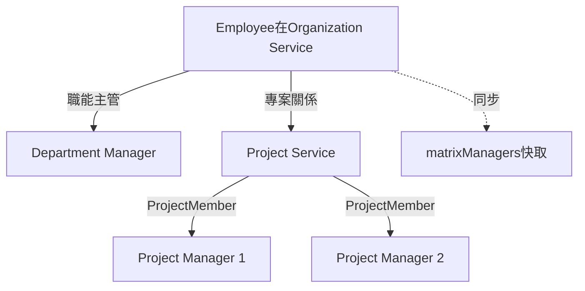
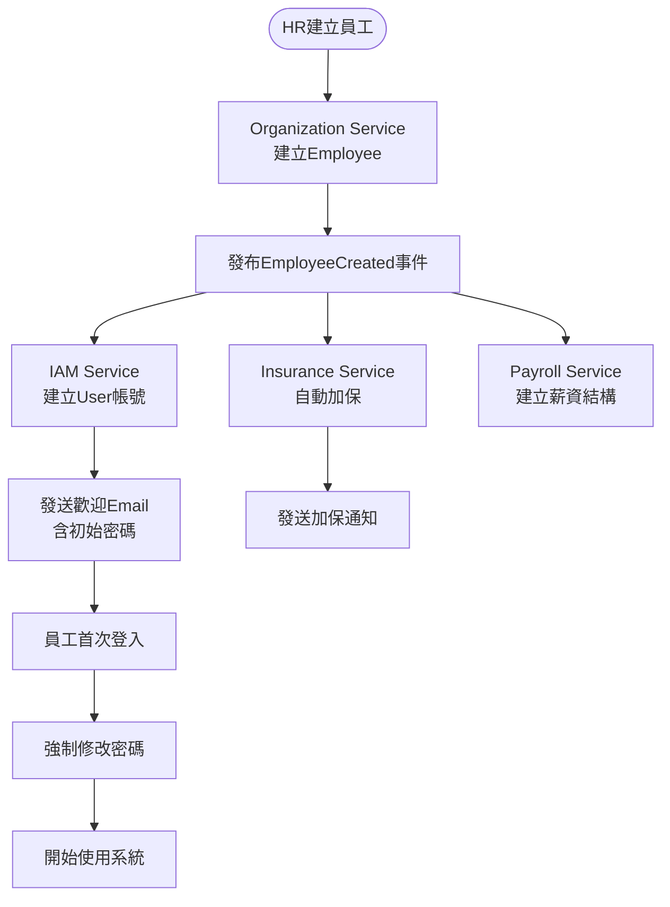
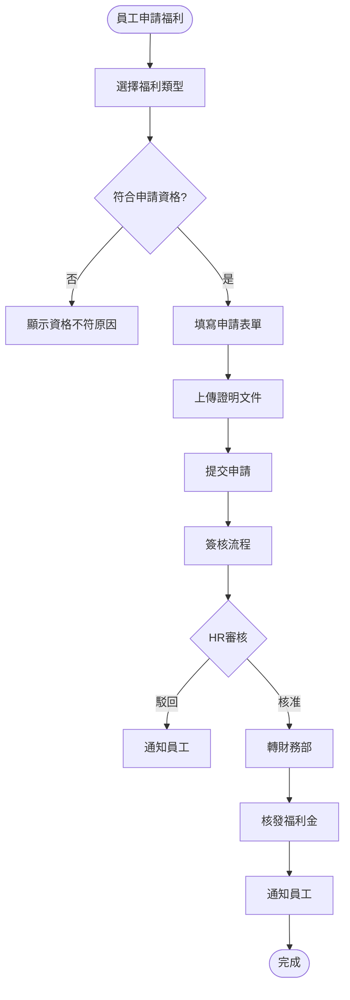
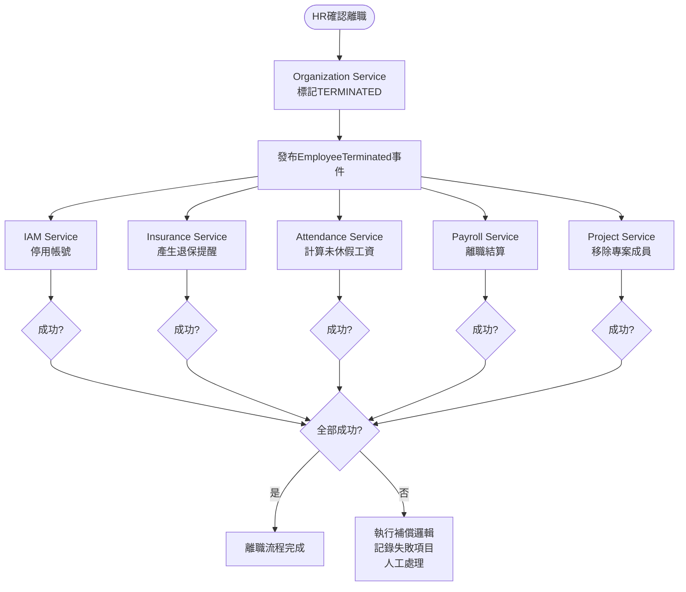
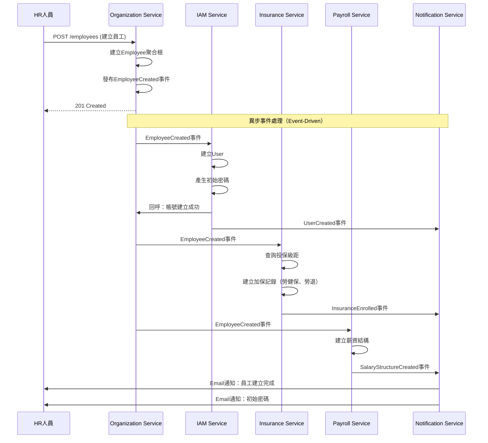

# 組織員工服務(Organization & Employee Service) 需求分析書

**版本:** 1.0  
**日期:** 2025-11-24  
**所屬領域:** 支撐領域 (Supporting Domain)  
**導入階段:** 第一階段（核心基礎服務）

---

## 1. 服務定位與職責

### 1.1 服務概述
組織員工服務是HR系統的**核心主數據服務**，負責管理集團組織架構與員工全生命週期資料。這是整個系統的**資料源頭**，所有其他微服務都依賴本服務提供的組織與員工資料。

### 1.2 核心職責
- **組織架構管理:** 母子公司、多層級部門架構維護
- **員工主檔管理:** 員工基本資料、聯絡方式、學經歷
- **員工生命週期:** 到職、試用、轉正、調薪、升遷、調動、離職全流程
- **合約管理:** 員工合約類型、期限、附件管理
- **ESS員工自助服務:** 個人資料變更、證明文件申請
- **數據同步:** 發布員工異動事件供其他服務訂閱

### 1.3 服務邊界
**屬於本服務:**
- 組織架構（公司、部門、團隊）
- 員工個人資料（姓名、身分證號、聯絡方式、銀行帳戶）
- 員工人事歷程（到職、離職、調薪、升遷、調動記錄）
- 員工合約資料

**不屬於本服務:**
- 使用者帳號與權限（IAM Service）
- 考勤打卡資料（Attendance Service）
- 薪資計算（Payroll Service）
- 績效考核（Performance Service）

---

## 2. 限界上下文定義

### 2.1 上下文名稱
**Organization & Employee Context (組織員工上下文)**

### 2.2 通用語言 (Ubiquitous Language)

| 術語 | 定義 | 範例 |
|:---|:---|:---|
| Organization | 公司組織（母公司或子公司） | XX母公司、XX子公司A |
| Department | 部門，可多層級 | 研發部 > 前端組 > React團隊 |
| Employee | 員工，系統核心實體 | 張三，員工編號 E001 |
| EmploymentType | 雇用類型 | 正職、約聘、兼職、實習生 |
| EmploymentStatus | 在職狀態 | 在職、試用、留停、離職 |
| Contract | 員工合約 | 不定期契約、定期契約 |
| Onboarding | 到職流程 | 新人報到、設備申請、教育訓練 |
| Termination | 離職流程 | 離職申請、交接、結算 |
| Transfer | 調動 | 部門調動、職務調動 |
| Promotion | 升遷 | 職等晉升、職稱變更 |
| SalaryAdjustment | 調薪 | 年度調薪、晉升調薪 |

---

## 3. 領域模型設計

### 3.1 聚合根 (Aggregate Root)

#### 聚合根1: Organization (組織/公司)
**職責:** 代表一個法人公司（母公司或子公司），作為最上層的組織單位

**屬性:**
```
Organization {
  organizationId: UUID (PK)
  organizationCode: String (unique, 公司代號)
  organizationName: String
  organizationType: OrganizationType (PARENT, SUBSIDIARY)
  parentOrganizationId: UUID (nullable, FK自關聯)
  taxId: String (統一編號)
  address: String
  phoneNumber: String
  establishedDate: Date
  status: OrganizationStatus (ACTIVE, INACTIVE)
  createdAt: DateTime
  updatedAt: DateTime
}

enum OrganizationType {
  PARENT       // 母公司
  SUBSIDIARY   // 子公司
}

enum OrganizationStatus {
  ACTIVE
  INACTIVE
}
```

**領域行為:**
- `addDepartment(department)`: 新增部門
- `deactivate()`: 停用公司（需檢查是否有在職員工）

#### 聚合根2: Department (部門)
**職責:** 代表組織內的部門，支援多層級結構（至少5層）

**屬性:**
```
Department {
  departmentId: UUID (PK)
  departmentCode: String (unique within organization)
  departmentName: String
  organizationId: UUID (FK)
  parentDepartmentId: UUID (nullable, FK自關聯)
  level: Integer (層級，1=一級部門，2=二級部門...)
  managerId: UUID (nullable, FK to Employee, 部門主管)
  displayOrder: Integer
  status: DepartmentStatus
  createdAt: DateTime
  updatedAt: DateTime
}

enum DepartmentStatus {
  ACTIVE
  INACTIVE
}
```

**不變性規則:**
- 部門層級不可超過5層
- 停用部門前需檢查子部門與員工

**領域行為:**
- `addSubDepartment(subDepartment)`: 新增子部門
- `assignManager(employeeId)`: 指派部門主管
- `deactivate()`: 停用部門
- `getAncestors()`: 取得所有上層部門清單
- `getDescendants()`: 取得所有下層部門清單

#### 聚合根3: Employee (員工) - **核心聚合根**
**職責:** 員工主檔，包含完整的個人資料與人事歷程

**屬性:**
```
Employee {
  employeeId: UUID (PK)
  employeeNumber: String (unique, 員工編號)
  
  // 基本資料
  firstName: String
  lastName: String
  fullName: String
  nationalId: String (加密, 身分證號)
  dateOfBirth: Date
  gender: Gender
  maritalStatus: MaritalStatus
  
  // 聯絡方式
  personalEmail: String
  companyEmail: String (unique)
  mobilePhone: String
  homePhone: String
  address: Address (值對象)
  
  // 緊急聯絡人
  emergencyContact: EmergencyContact (值對象)
  
  // 組織關係
  organizationId: UUID (FK)
  departmentId: UUID (FK)
  managerId: UUID (nullable, FK to Employee, 直屬主管)
  
  // 職務資訊
  jobTitle: String (職稱)
  jobLevel: String (職等)
  employmentType: EmploymentType
  employmentStatus: EmploymentStatus
  
  // 到離職資訊
  hireDate: Date (到職日)
  probationEndDate: Date (試用期結束日)
  terminationDate: Date (nullable, 離職日)
  terminationReason: String (nullable, 離職原因)
  
  // 銀行資訊
  bankAccount: BankAccount (值對象)
  
  // 學經歷
  educations: List<Education> (實體集合)
  workExperiences: List<WorkExperience> (實體集合)
  
  // 照片
  photoUrl: String
  
  // 審計
  createdAt: DateTime
  updatedAt: DateTime
}

enum Gender {
  MALE, FEMALE, OTHER
}

enum MaritalStatus {
  SINGLE, MARRIED, DIVORCED, WIDOWED
}

enum EmploymentType {
  FULL_TIME      // 正職
  CONTRACT       // 約聘
  PART_TIME      // 兼職
  INTERN         // 實習生
}

enum EmploymentStatus {
  PROBATION             // 試用期
  ACTIVE                // 在職
  PARENTAL_LEAVE        // 育嬰留停
  UNPAID_LEAVE          // 留職停薪
  TERMINATED            // 離職
}
```

**不變性規則:**
- employeeNumber必須唯一且不可變更
- companyEmail必須唯一
- nationalId必須加密儲存
- 離職日期不可早於到職日期
- 試用期結束日必須晚於到職日

**領域行為:**
- `onboard(hireDate, probationMonths)`: 到職
- `completeProbation()`: 通過試用期轉正
- `terminate(terminationDate, reason)`: 離職
- `transferDepartment(newDepartmentId, effectiveDate)`: 部門調動
- `promote(newJobTitle, newJobLevel, effectiveDate)`: 升遷
- `adjustSalary(newSalary, effectiveDate, reason)`: 調薪
- `updatePersonalInfo(info)`: 更新個人資料
- `isActive()`: 是否在職
- `getManager()`: 取得直屬主管
- `getSubordinates()`: 取得直接部屬

#### 聚合根4: EmployeeContract (員工合約)
**職責:** 管理員工的勞動合約

**屬性:**
```
EmployeeContract {
  contractId: UUID (PK)
  employeeId: UUID (FK)
  contractType: ContractType
  contractNumber: String
  startDate: Date
  endDate: Date (nullable for 不定期)
  workingHours: Decimal (每週工時)
  trialPeriodMonths: Integer
  attachmentUrl: String (合約PDF檔案路徑)
  status: ContractStatus
  createdAt: DateTime
  updatedAt: DateTime
}

enum ContractType {
  INDEFINITE     // 不定期契約
  FIXED_TERM     // 定期契約
}

enum ContractStatus {
  ACTIVE
  EXPIRED
  TERMINATED
}
```

**領域行為:**
- `renew(newEndDate)`: 續約
- `terminate(terminationDate)`: 終止合約
- `checkExpiration()`: 檢查合約是否到期（返回到期前30天提醒）

### 3.2 實體 (Entity)

#### 實體1: EmployeeHistory (員工人事歷程)
```
EmployeeHistory {
  historyId: UUID (PK)
  employeeId: UUID (FK)
  eventType: HistoryEventType
  effectiveDate: Date
  oldValue: JSON (變更前資料)
  newValue: JSON (變更後資料)
  reason: String
  approvedBy: UUID (FK to Employee)
  createdAt: DateTime
}

enum HistoryEventType {
  ONBOARDING          // 到職
  PROBATION_PASSED    // 試用期轉正
  DEPARTMENT_TRANSFER // 部門調動
  JOB_CHANGE          // 職務異動
  PROMOTION           // 升遷
  SALARY_ADJUSTMENT   // 調薪
  TERMINATION         // 離職
  REHIRE              // 復職
}
```

#### 實體2: Education (學歷)
```
Education {
  educationId: UUID (PK)
  employeeId: UUID (FK)
  degree: String (學位：高中、學士、碩士、博士)
  school: String
  major: String
  startDate: Date
  endDate: Date
  isHighestDegree: Boolean
}
```

#### 實體3: WorkExperience (工作經歷)
```
WorkExperience {
  experienceId: UUID (PK)
  employeeId: UUID (FK)
  company: String
  jobTitle: String
  startDate: Date
  endDate: Date (nullable if current)
  description: Text
}
```

#### 實體4: EmployeeCertificateRequest (證明文件申請)
```
EmployeeCertificateRequest {
  requestId: UUID (PK)
  employeeId: UUID (FK)
  certificateType: CertificateType
  purpose: String
  quantity: Integer
  requestDate: DateTime
  status: RequestStatus
  processedBy: UUID (nullable, FK to Employee)
  processedAt: DateTime (nullable)
  documentUrl: String (nullable, 產生的PDF路徑)
}

enum CertificateType {
  EMPLOYMENT_CERTIFICATE    // 在職證明
  SALARY_CERTIFICATE        // 薪資證明
  TAX_WITHHOLDING          // 扣繳憑單
}

enum RequestStatus {
  PENDING
  APPROVED
  REJECTED
  COMPLETED
}
```

### 3.3 值對象 (Value Object)

#### 值對象1: Address (地址)
```
Address {
  postalCode: String
  city: String
  district: String
  street: String
  fullAddress: String
}
```

#### 值對象2: EmergencyContact (緊急聯絡人)
```
EmergencyContact {
  name: String
  relationship: String
  phoneNumber: String
}
```

#### 值對象3: BankAccount (銀行帳戶)
```
BankAccount {
  bankCode: String (銀行代碼)
  bankName: String
  branchCode: String (分行代碼)
  accountNumber: String (加密)
  accountName: String
}
```

---

## 4. 領域事件定義

### 4.1 員工生命週期事件

| 事件名稱 | 觸發時機 | 事件負載 | 訂閱服務 |
|:---|:---|:---|:---|
| `EmployeeCreated` | 新員工到職 | employeeId, employeeNumber, email, organizationId, departmentId, hireDate | IAM, Insurance, Payroll |
| `EmployeeProbationPassed` | 試用期轉正 | employeeId, passedDate | Payroll (可能影響待遇) |
| `EmployeeTerminated` | 員工離職 | employeeId, terminationDate, reason | IAM, Attendance, Insurance, Payroll, Project |
| `EmployeeDepartmentChanged` | 部門調動 | employeeId, oldDepartmentId, newDepartmentId, effectiveDate | Attendance, Payroll |
| `EmployeeJobChanged` | 職務異動 | employeeId, oldJobTitle, newJobTitle, effectiveDate | Payroll |
| `EmployeePromoted` | 員工升遷 | employeeId, oldJobLevel, newJobLevel, effectiveDate | Payroll, Performance |
| `EmployeeSalaryChanged` | 調薪 | employeeId, oldSalary, newSalary, effectiveDate, reason | Payroll, Insurance |

### 4.2 組織架構事件

| 事件名稱 | 觸發時機 | 事件負載 | 訂閱服務 |
|:---|:---|:---|:---|
| `DepartmentCreated` | 新增部門 | departmentId, departmentName, organizationId, parentDepartmentId | - |
| `Department ManagerChanged` | 主管異動 | departmentId, oldManagerId, newManagerId | Attendance (審核路徑) |

### 4.3 ESS自助服務事件

| 事件名稱 | 觸發時機 | 事件負載 | 訂閱服務 |
|:---|:---|:---|:---|
| `EmployeeEmailChanged` | Email變更 | employeeId, oldEmail, newEmail | IAM (同步使用者名稱) |
| `CertificateRequested` | 證明文件申請 | requestId, employeeId, certificateType | Notification |
| `CertificateCompleted` | 證明文件完成 | requestId, documentUrl | Notification |

### 4.4 合約事件

| 事件名稱 | 觸發時機 | 事件負載 | 訂閱服務 |
|:---|:---|:---|:---|
| `ContractExpiring` | 合約即將到期 | contractId, employeeId, expiryDate | Notification |
| `ContractRenewed` | 合約續約 | contractId, newEndDate | - |

---

## 5. API設計

### 5.1 組織架構API

#### 5.1.1 建立公司
```
POST /api/v1/organizations
Authorization: Bearer {token}
Required Permission: organization:create

Request:
{
  "organizationCode": "SUB_A",
  "organizationName": "子公司A",
  "organizationType": "SUBSIDIARY",
  "parentOrganizationId": "uuid",
  "taxId": "12345678",
  "address": "台北市信義區...",
  "phoneNumber": "02-12345678"
}

Response 201:
{
  "organizationId": "uuid",
  "organizationCode": "SUB_A",
  "organizationName": "子公司A",
  "createdAt": "2025-11-24T10:00:00Z"
}
```

#### 5.1.2 建立部門
```
POST /api/v1/departments
Authorization: Bearer {token}
Required Permission: department:create

Request:
{
  "departmentCode": "RD-FE",
  "departmentName": "前端開發組",
  "organizationId": "uuid",
  "parentDepartmentId": "uuid",
  "managerId": "uuid"
}

Response 201:
{
  "departmentId": "uuid",
  "departmentCode": "RD-FE",
  "departmentName": "前端開發組",
  "level": 2,
  "createdAt": "2025-11-24T10:00:00Z"
}
```

#### 5.1.3 查詢組織樹（含部門）
```
GET /api/v1/organizations/{organizationId}/tree
Authorization: Bearer {token}
Required Permission: organization:read

Response 200:
{
  "organizationId": "uuid",
  "organizationName": "母公司",
  "departments": [
    {
      "departmentId": "uuid",
      "departmentName": "研發部",
      "level": 1,
      "managerId": "uuid",
      "managerName": "張經理",
      "employeeCount": 50,
      "subDepartments": [
        {
          "departmentId": "uuid",
          "departmentName": "前端組",
          "level": 2,
          "employeeCount": 15
        }
      ]
    }
  ]
}
```

### 5.2 員工管理API

#### 5.2.1 建立員工（到職）
```
POST /api/v1/employees
Authorization: Bearer {token}
Required Permission: employee:create

Request:
{
  "employeeNumber": "E0001",
  "firstName": "三",
  "lastName": "張",
  "nationalId": "A123456789",
  "dateOfBirth": "1990-01-01",
  "gender": "MALE",
  "personalEmail": "zhang.san@gmail.com",
  "companyEmail": "zhang.san@company.com",
  "mobilePhone": "0912345678",
  "address": {
    "city": "台北市",
    "district": "信義區",
    "street": "信義路五段7號",
    "postalCode": "110"
  },
  "emergencyContact": {
    "name": "張太太",
    "relationship": "配偶",
    "phoneNumber": "0987654321"
  },
  "organizationId": "uuid",
  "departmentId": "uuid",
  "managerId": "uuid",
  "jobTitle": "前端工程師",
  "jobLevel": "P3",
  "employmentType": "FULL_TIME",
  "hireDate": "2025-01-01",
  "probationMonths": 3,
  "bankAccount": {
    "bankCode": "012",
    "bankName": "台北富邦銀行",
    "accountNumber": "123456789",
    "accountName": "張三"
  }
}

Response 201:
{
  "employeeId": "uuid",
  "employeeNumber": "E0001",
  "fullName": "張三",
  "status": "PROBATION",
  "hireDate": "2025-01-01",
  "probationEndDate": "2025-04-01",
  "createdAt": "2025-11-24T10:00:00Z"
}
```

**後續動作:**
- 發布 `EmployeeCreated` 事件
- Insurance Service自動觸發加保提醒
- IAM Service自動建立使用者帳號
- Payroll Service建立薪資主檔

#### 5.2.2 查詢員工詳情
```
GET /api/v1/employees/{employeeId}
Authorization: Bearer {token}
Required Permission: employee:read (or employee:read:self if own data)

Response 200:
{
  "employeeId": "uuid",
  "employeeNumber": "E0001",
  "fullName": "張三",
  "nationalId": "A12***6789" (部分遮罩),
  "dateOfBirth": "1990-01-01",
  "gender": "MALE",
  "companyEmail": "zhang.san@company.com",
  "mobilePhone": "0912345678",
  "organization": {
    "organizationId": "uuid",
    "organizationName": "母公司"
  },
  "department": {
    "departmentId": "uuid",
    "departmentName": "前端組"
  },
  "manager": {
    "employeeId": "uuid",
    "fullName": "李經理"
  },
  "jobTitle": "前端工程師",
  "jobLevel": "P3",
  "employmentType": "FULL_TIME",
  "employmentStatus": "ACTIVE",
  "hireDate": "2025-01-01",
  "bankAccount": {
    "bankName": "台北富邦銀行",
    "accountNumber": "***6789" (部分遮罩)
  }
}
```

#### 5.2.3 更新員工資料
```
PUT /api/v1/employees/{employeeId}
Authorization: Bearer {token}
Required Permission: employee:update

Request:
{
  "mobilePhone": "0912222222",
  "address": {
    "city": "新北市",
    "district": "板橋區",
    ...
  }
}

Response 200:
{
  "employeeId": "uuid",
  "updatedFields": ["mobilePhone", "address"],
  "updatedAt": "2025-11-24T10:00:00Z"
}
```

#### 5.2.4 員工部門調動
```
POST /api/v1/employees/{employeeId}/transfer
Authorization: Bearer {token}
Required Permission: employee:transfer

Request:
{
  "newDepartmentId": "uuid",
  "newManagerId": "uuid",
  "effectiveDate": "2025-12-01",
  "reason": "組織調整"
}

Response 200:
{
  "employeeId": "uuid",
  "oldDepartment": "前端組",
  "newDepartment": "後端組",
  "effectiveDate": "2025-12-01"
}
```

**後續動作:**
- 發布 `EmployeeDepartmentChanged` 事件
- Attendance Service更新審核路徑（新主管審核）
- 記錄至EmployeeHistory

#### 5.2.5 員工升遷
```
POST /api/v1/employees/{employeeId}/promote
Authorization: Bearer {token}
Required Permission: employee:promote

Request:
{
  "newJobTitle": "資深前端工程師",
  "newJobLevel": "P4",
  "effectiveDate": "2026-01-01",
  "reason": "年度績效優異"
}

Response 200:
{
  "employeeId": "uuid",
  "oldJobTitle": "前端工程師",
  "newJobTitle": "資深前端工程師",
  "oldJobLevel": "P3",
  "newJobLevel": "P4",
  "effectiveDate": "2026-01-01"
}
```

**後續動作:**
- 發布 `EmployeePromoted` 事件
- 通常伴隨調薪，需HR手動執行調薪API

#### 5.2.6 員工調薪
```
POST /api/v1/employees/{employeeId}/adjust-salary
Authorization: Bearer {token}
Required Permission: employee:adjust-salary

Request:
{
  "newMonthlySalary": 55000,
  "effectiveDate": "2026-01-01",
  "reason": "晉升調薪"
}

Response 200:
{
  "employeeId": "uuid",
  "adjustmentDate": "2026-01-01",
  "message": "調薪記錄已建立"
}
```

**後續動作:**
- 發布 `EmployeeSalaryChanged` 事件
- Payroll Service更新薪資結構
- Insurance Service檢查是否需調整投保級距
- 記錄至EmployeeHistory

#### 5.2.7 員工離職
```
POST /api/v1/employees/{employeeId}/terminate
Authorization: Bearer {token}
Required Permission: employee:terminate

Request:
{
  "terminationDate": "2025-12-31",
  "reason": "個人生涯規劃"
}

Response 200:
{
  "employeeId": "uuid",
  "terminationDate": "2025-12-31",
  "status": "TERMINATED"
}
```

**後續動作:**
- 發布 `EmployeeTerminated` 事件（**關鍵事件**）
- IAM Service停用使用者帳號
- Insurance Service產生退保提醒
- Attendance Service計算未休假工資
- Payroll Service執行離職結算
- Project Service移除專案成員
- 記錄至EmployeeHistory

#### 5.2.8 查詢員工人事歷程
```
GET /api/v1/employees/{employeeId}/history
Authorization: Bearer {token}
Required Permission: employee:read

Response 200:
[
  {
    "historyId": "uuid",
    "eventType": "ONBOARDING",
    "effectiveDate": "2025-01-01",
    "description": "到職，職稱：前端工程師"
  },
  {
    "historyId": "uuid",
    "eventType": "PROBATION_PASSED",
    "effectiveDate": "2025-04-01",
    "description": "試用期轉正"
  },
  {
    "historyId": "uuid",
    "eventType": "SALARY_ADJUSTMENT",
    "effectiveDate": "2025-07-01",
    "oldValue": {"monthlySalary": 50000},
    "newValue": {"monthlySalary": 53000},
    "reason": "年度調薪"
  }
]
```

### 5.3 ESS員工自助服務API

#### 5.3.1 員工查詢個人資料
```
GET /api/v1/employees/me
Authorization: Bearer {token}

Response 200:
{
  (與 GET /api/v1/employees/{employeeId} 相同)
}
```

#### 5.3.2 員工申請資料變更
```
POST /api/v1/employees/me/change-requests
Authorization: Bearer {token}

Request:
{
  "changeType": "CONTACT_INFO",
  "changes": {
    "mobilePhone": "0911111111",
    "address": {
      "city": "台中市",
      ...
    }
  },
  "reason": "搬家"
}

Response 201:
{
  "requestId": "uuid",
  "status": "PENDING_APPROVAL",
  "submittedAt": "2025-11-24T10:00:00Z"
}
```

**業務邏輯:**
- 提交至Workflow Service審核
- 審核通過後更新員工資料

#### 5.3.3 申請證明文件
```
POST /api/v1/employees/me/certificate-requests
Authorization: Bearer {token}

Request:
{
  "certificateType": "EMPLOYMENT_CERTIFICATE",
  "purpose": "申請房貸",
  "quantity": 2
}

Response 201:
{
  "requestId": "uuid",
  "status": "PENDING",
  "requestDate": "2025-11-24T10:00:00Z"
}
```

**後續流程:**
1. 發布 `CertificateRequested` 事件
2. Notification Service發送通知給HR
3. HR審核通過後，系統自動產生PDF（調用Document Service）
4. 發布 `CertificateCompleted` 事件
5. 員工可下載文件

#### 5.3.4 查詢證明文件申請狀態
```
GET /api/v1/employees/me/certificate-requests
Authorization: Bearer {token}

Response 200:
[
  {
    "requestId": "uuid",
    "certificateType": "EMPLOYMENT_CERTIFICATE",
    "status": "COMPLETED",
    "requestDate": "2025-11-20T10:00:00Z",
    "processedAt": "2025-11-21T14:00:00Z",
    "documentUrl": "/api/v1/documents/xxx.pdf"
  }
]
```

### 5.4 合約管理API

#### 5.4.1 建立員工合約
```
POST /api/v1/employees/{employeeId}/contracts
Authorization: Bearer {token}
Required Permission: contract:create

Request:
{
  "contractType": "INDEFINITE",
  "contractNumber": "C-2025-001",
  "startDate": "2025-01-01",
  "endDate": null,
  "workingHours": 40,
  "trialPeriodMonths": 3,
  "attachmentUrl": "/documents/contracts/C-2025-001.pdf"
}

Response 201:
{
  "contractId": "uuid",
  "contractNumber": "C-2025-001",
  "status": "ACTIVE"
}
```

#### 5.4.2 查詢即將到期合約
```
GET /api/v1/contracts/expiring?days=30
Authorization: Bearer {token}
Required Permission: contract:read

Response 200:
[
  {
    "contractId": "uuid",
    "employeeId": "uuid",
    "employeeName": "李四",
    "contractType": "FIXED_TERM",
    "endDate": "2025-12-31",
    "daysUntilExpiry": 25
  }
]
```

**自動提醒:**
- 定期Job每日檢查，合約到期前30天發布 `ContractExpiring` 事件
- Notification Service發送提醒給HR

---

## 6. 資料模型設計

### 6.1 資料庫Schema (PostgreSQL)

```sql
-- 組織/公司表
CREATE TABLE organizations (
    organization_id UUID PRIMARY KEY DEFAULT gen_random_uuid(),
    organization_code VARCHAR(50) UNIQUE NOT NULL,
    organization_name VARCHAR(255) NOT NULL,
    organization_type VARCHAR(20) NOT NULL,
    parent_organization_id UUID REFERENCES organizations(organization_id),
    tax_id VARCHAR(20),
    address TEXT,
    phone_number VARCHAR(50),
    established_date DATE,
    status VARCHAR(20) DEFAULT 'ACTIVE',
    created_at TIMESTAMP DEFAULT CURRENT_TIMESTAMP,
    updated_at TIMESTAMP DEFAULT CURRENT_TIMESTAMP,
    
    CONSTRAINT chk_org_type CHECK (organization_type IN ('PARENT', 'SUBSIDIARY')),
    CONSTRAINT chk_org_status CHECK (status IN ('ACTIVE', 'INACTIVE'))
);

-- 部門表
CREATE TABLE departments (
    department_id UUID PRIMARY KEY DEFAULT gen_random_uuid(),
    department_code VARCHAR(50) NOT NULL,
    department_name VARCHAR(255) NOT NULL,
    organization_id UUID NOT NULL REFERENCES organizations(organization_id),
    parent_department_id UUID REFERENCES departments(department_id),
    level INTEGER NOT NULL DEFAULT 1,
    manager_id UUID REFERENCES employees(employee_id),
    display_order INTEGER DEFAULT 0,
    status VARCHAR(20) DEFAULT 'ACTIVE',
    created_at TIMESTAMP DEFAULT CURRENT_TIMESTAMP,
    updated_at TIMESTAMP DEFAULT CURRENT_TIMESTAMP,
    
    UNIQUE(department_code, organization_id),
    CONSTRAINT chk_dept_status CHECK (status IN ('ACTIVE', 'INACTIVE')),
    CONSTRAINT chk_dept_level CHECK (level >= 1 AND level <= 5)
);

CREATE INDEX idx_departments_org_id ON departments(organization_id);
CREATE INDEX idx_departments_parent_id ON departments(parent_department_id);

-- 員工表 (核心表)
CREATE TABLE employees (
    employee_id UUID PRIMARY KEY DEFAULT gen_random_uuid(),
    employee_number VARCHAR(50) UNIQUE NOT NULL,
    
    -- 基本資料
    first_name VARCHAR(100) NOT NULL,
    last_name VARCHAR(100) NOT NULL,
    full_name VARCHAR(255) NOT NULL,
    national_id VARCHAR(255) NOT NULL, -- 加密欄位
    date_of_birth DATE NOT NULL,
    gender VARCHAR(10) NOT NULL,
    marital_status VARCHAR(20),
    
    -- 聯絡方式
    personal_email VARCHAR(255),
    company_email VARCHAR(255) UNIQUE NOT NULL,
    mobile_phone VARCHAR(50),
    home_phone VARCHAR(50),
    
    -- 地址(JSON)
    address JSONB,
    
    -- 緊急聯絡人(JSON)
    emergency_contact JSONB,
    
    -- 組織關係
    organization_id UUID NOT NULL REFERENCES organizations(organization_id),
    department_id UUID NOT NULL REFERENCES departments(department_id),
    manager_id UUID REFERENCES employees(employee_id),
    
    -- 職務資訊
    job_title VARCHAR(255) NOT NULL,
    job_level VARCHAR(50),
    employment_type VARCHAR(20) NOT NULL,
    employment_status VARCHAR(20) NOT NULL DEFAULT 'PROBATION',
    
    -- 到離職資訊
    hire_date DATE NOT NULL,
    probation_end_date DATE,
    termination_date DATE,
    termination_reason TEXT,
    
    -- 銀行資訊(JSON,加密)
    bank_account JSONB,
    
    -- 照片
    photo_url VARCHAR(500),
    
    created_at TIMESTAMP DEFAULT CURRENT_TIMESTAMP,
    updated_at TIMESTAMP DEFAULT CURRENT_TIMESTAMP,
    
    CONSTRAINT chk_gender CHECK (gender IN ('MALE', 'FEMALE', 'OTHER')),
    CONSTRAINT chk_marital CHECK (marital_status IN ('SINGLE', 'MARRIED', 'DIVORCED', 'WIDOWED')),
    CONSTRAINT chk_emp_type CHECK (employment_type IN ('FULL_TIME', 'CONTRACT', 'PART_TIME', 'INTERN')),
    CONSTRAINT chk_emp_status CHECK (employment_status IN ('PROBATION', 'ACTIVE', 'PARENTAL_LEAVE', 'UNPAID_LEAVE', 'TERMINATED'))
);

CREATE INDEX idx_employees_number ON employees(employee_number);
CREATE INDEX idx_employees_org_id ON employees(organization_id);
CREATE INDEX idx_employees_dept_id ON employees(department_id);
CREATE INDEX idx_employees_manager_id ON employees(manager_id);
CREATE INDEX idx_employees_email ON employees(company_email);
CREATE INDEX idx_employees_status ON employees(employment_status);

-- 員工人事歷程表
CREATE TABLE employee_history (
    history_id UUID PRIMARY KEY DEFAULT gen_random_uuid(),
    employee_id UUID NOT NULL REFERENCES employees(employee_id),
    event_type VARCHAR(50) NOT NULL,
    effective_date DATE NOT NULL,
    old_value JSONB,
    new_value JSONB,
    reason TEXT,
    approved_by UUID REFERENCES employees(employee_id),
    created_at TIMESTAMP DEFAULT CURRENT_TIMESTAMP,
    
    CONSTRAINT chk_event_type CHECK (event_type IN (
        'ONBOARDING', 'PROBATION_PASSED', 'DEPARTMENT_TRANSFER', 
        'JOB_CHANGE', 'PROMOTION', 'SALARY_ADJUSTMENT', 
        'TERMINATION', 'REHIRE'
    ))
);

CREATE INDEX idx_emp_history_emp_id ON employee_history(employee_id);
CREATE INDEX idx_emp_history_event ON employee_history(event_type);

-- 學歷表
CREATE TABLE educations (
    education_id UUID PRIMARY KEY DEFAULT gen_random_uuid(),
    employee_id UUID NOT NULL REFERENCES employees(employee_id),
    degree VARCHAR(100) NOT NULL,
    school VARCHAR(255) NOT NULL,
    major VARCHAR(255),
    start_date DATE,
    end_date DATE,
    is_highest_degree BOOLEAN DEFAULT FALSE,
    created_at TIMESTAMP DEFAULT CURRENT_TIMESTAMP
);

CREATE INDEX idx_educations_emp_id ON educations(employee_id);

-- 工作經歷表
CREATE TABLE work_experiences (
    experience_id UUID PRIMARY KEY DEFAULT gen_random_uuid(),
    employee_id UUID NOT NULL REFERENCES employees(employee_id),
    company VARCHAR(255) NOT NULL,
    job_title VARCHAR(255) NOT NULL,
    start_date DATE NOT NULL,
    end_date DATE,
    description TEXT,
    created_at TIMESTAMP DEFAULT CURRENT_TIMESTAMP
);

CREATE INDEX idx_work_exp_emp_id ON work_experiences(employee_id);

-- 員工合約表
CREATE TABLE employee_contracts (
    contract_id UUID PRIMARY KEY DEFAULT gen_random_uuid(),
    employee_id UUID NOT NULL REFERENCES employees(employee_id),
    contract_type VARCHAR(20) NOT NULL,
    contract_number VARCHAR(100) UNIQUE NOT NULL,
    start_date DATE NOT NULL,
    end_date DATE,
    working_hours DECIMAL(5,2) NOT NULL,
    trial_period_months INTEGER DEFAULT 3,
    attachment_url VARCHAR(500),
    status VARCHAR(20) DEFAULT 'ACTIVE',
    created_at TIMESTAMP DEFAULT CURRENT_TIMESTAMP,
    updated_at TIMESTAMP DEFAULT CURRENT_TIMESTAMP,
    
    CONSTRAINT chk_contract_type CHECK (contract_type IN ('INDEFINITE', 'FIXED_TERM')),
    CONSTRAINT chk_contract_status CHECK (status IN ('ACTIVE', 'EXPIRED', 'TERMINATED'))
);

CREATE INDEX idx_contracts_emp_id ON employee_contracts(employee_id);
CREATE INDEX idx_contracts_end_date ON employee_contracts(end_date);

-- 證明文件申請表
CREATE TABLE employee_certificate_requests (
    request_id UUID PRIMARY KEY DEFAULT gen_random_uuid(),
    employee_id UUID NOT NULL REFERENCES employees(employee_id),
    certificate_type VARCHAR(50) NOT NULL,
    purpose TEXT,
    quantity INTEGER DEFAULT 1,
    request_date TIMESTAMP DEFAULT CURRENT_TIMESTAMP,
    status VARCHAR(20) DEFAULT 'PENDING',
    processed_by UUID REFERENCES employees(employee_id),
    processed_at TIMESTAMP,
    document_url VARCHAR(500),
    
    CONSTRAINT chk_cert_type CHECK (certificate_type IN ('EMPLOYMENT_CERTIFICATE', 'SALARY_CERTIFICATE', 'TAX_WITHHOLDING')),
    CONSTRAINT chk_cert_status CHECK (status IN ('PENDING', 'APPROVED', 'REJECTED', 'COMPLETED'))
);

CREATE INDEX idx_cert_req_emp_id ON employee_certificate_requests(employee_id);
CREATE INDEX idx_cert_req_status ON employee_certificate_requests(status);
```

### 6.2 敏感資料加密

**需加密欄位:**
- `employees.national_id` - 身分證號（AES-256）
- `employees.bank_account` - 銀行帳號（AES-256）

**加密實作:**
- 使用PostgreSQL `pgcrypto` extension
- 或Application層加密（Spring Encryption）
- 加密金鑰儲存於環境變數或Key Management Service

---

## 7. 與其他服務整合

### 7.1 同步整合 (REST API)

#### 7.1.1 被呼叫：所有服務 → Organization Service

| 呼叫服務 | API | 場景 |
|:---|:---|:---|
| Payroll | GET /api/v1/employees/{id} | 取得員工基本資料計算薪資 |
| Attendance | GET /api/v1/employees/{id}/manager | 取得員工主管（審核路徑） |
| Project | GET /api/v1/employees?departmentId={id} | 取得部門員工清單指派專案 |
| IAM | GET /api/v1/employees/{id} | 建立使用者帳號時驗證員工存在 |

**效能優化:**
- 提供批次查詢API: `POST /api/v1/employees/batch`
- 其他服務可使用快取（TTL 1小時）減少呼叫

#### 7.1.2 主動呼叫：Organization Service → 其他服務

| 目標服務 | 場景 | 說明 |
|:---|:---|:---|
| IAM Service | 員工到職 | 呼叫 `POST /api/v1/users` 建立使用者帳號 |
| Document Service | 產生證明文件 | 呼叫文件產生API |

**設計決策:**
- 員工到職時「同步」建立IAM使用者（確保立即可登入）
- 若IAM Service呼叫失敗，則員工建立失敗（原子性）

### 7.2 異步整合 (Event-Driven)

#### 7.2.1 發布事件

**核心事件:**
- `EmployeeCreated` → IAM, Insurance, Payroll
- `EmployeeTerminated` → IAM, Attendance, Insurance, Payroll, Project
- `EmployeeSalaryChanged` → Payroll, Insurance
- `EmployeeDepartmentChanged` → Attendance, Payroll

**事件格式範例:**
```json
{
  "eventType": "EmployeeTerminated",
  "eventId": "uuid",
  "timestamp": "2025-11-24T10:00:00Z",
  "payload": {
    "employeeId": "uuid",
    "employeeNumber": "E0001",
    "fullName": "張三",
    "terminationDate": "2025-12-31",
    "reason": "個人生涯規劃",
    "organizationId": "uuid",
    "departmentId": "uuid"
  }
}
```

#### 7.2.2 訂閱事件

**目前不訂閱其他服務事件** （Organization Service為資料源頭）

---

## 8. 非功能需求

### 8.1 效能需求

| 指標 | 目標 |
|:---|:---|
| 員工查詢API回應時間 | <200ms |
| 批次匯入員工資料 | 1000筆<5分鐘 |
| 組織樹查詢(含5層部門) | <500ms |
| 系統支援員工數 | 1000人 |

### 8.2 可靠性需求

- 服務可用性: >99.9%
- 資料備份: 每日全量備份
- 員工資料變更需有完整Audit Trail（EmployeeHistory）

### 8.3 安全性需求

- 身分證號、銀行帳號必須加密儲存
- 敏感資料查詢需權限控管
- 所有資料變更記錄操作者與時間
- API需經過IAM Service認證授權

### 8.4 資料一致性

**關鍵:**離職流程必須確保跨服務一致性

**實作方式:**
1. Organization Service發布 `EmployeeTerminated` 事件
2. 各服務訂閱並處理（Eventual Consistency）
3. 若Insurance Service退保失敗，不應阻斷離職流程（容錯）
4. 使用補償機制處理異常情況

---

## 9. 技術選型

| 元件 | 選型 |
|:---|:---|
| 框架 | Spring Boot 3.2+ |
| 資料庫 | PostgreSQL 15+ |
| ORM | Spring Data JPA |
| 快取 | Redis (組織樹、部門員工清單) |
| 訊息佇列 | Kafka |
| 加密 | Jasypt / pgcrypto |

---

## 10. 測試策略

### 10.1 單元測試

**重點測試:**
- Employee聚合根領域邏輯（`terminate()`, `promote()`, `transferDepartment()`）
- 部門層級計算（`getAncestors()`, `getDescendants()`）
- 資料驗證（身分證格式、Email格式、日期邏輯）

### 10.2 整合測試

**測試場景:**
- 員工到職流程（建立employee → 發布事件 → IAM建立user）
- 員工離職流程（離職 → 發布事件 → 檢查其他服務接收）
- 部門調動（更新department → 檢查manager變更 → 發布事件）

---

## 11. 數據初始化

### 11.1 預設組織架構

```
母公司
├── 研發部
│   ├── 前端組
│   └── 後端組
├── 業務部
├── 人資行政部
└── 財務部

子公司A
├── 業務部
└── 營運部
```

### 11.2 測試員工資料

- 建立10-20筆測試員工
- 涵蓋不同狀態（試用、在職、離職）
- 涵蓋不同雇用類型（正職、兼職）

---

## 12. 監控與告警

### 12.1 業務指標

- 每日新增員工數
- 每日離職員工數
- 在職員工總數
- 證明文件申請處理時長

### 12.2 技術指標

- API回應時間
- 資料庫查詢效能
- 事件發布成功率

---

**文件結束**


# PM審查補充

# 組織員工服務 - PM審查補充文件

**版本:** 1.1
**日期:** 2025-11-30
**補充說明:** 根據PM審查報告補充遺漏需求

---

## 📋 本文件補充的PM審查項目

### P1 優先級
- **ORG-003:** 矩陣式管理設計
- **ORG-004:** ESS福利申請功能

### P2 優先級
- **ORG-005:** 員工意見反饋/申訴管道

### P3 優先級
- **ORG-001:** 員工照片上傳優化
- **ORG-002:** 合約附件管理整合
- **ORG-006:** 內部公告與政策文件查詢
- **ORG-007:** 員工通訊錄查詢

### 文件增強
- 業務流程圖：員工到職、離職、福利申請
- 循序圖：到職Saga流程、離職Saga流程
- 事件JSON範例
- 業務案例

---

## 1. 矩陣式管理 (ORG-003) - P1

### 1.1 設計方案說明

**矩陣式管理定義:** 員工同時隸屬於職能部門（如：研發部）和專案團隊（如：XX銀行專案），有多個主管。

**架構設計決策:**
- **職能組織關係:** 由 Organization Service 管理（Employee.managerId）
- **專案團隊關係:** 由 Project Service 管理（ProjectMember）

### 1.2 Employee聚合根補充

```
Employee {
  // 原有欄位...

  // 職能主管（單一）
  managerId: UUID (FK to Employee, 直屬主管/職能主管)

  // 矩陣式管理擴充
  functionalManager: UUID (與managerId相同，語意更清楚)
  matrixManagers: List<MatrixManager> (專案主管清單)
}

MatrixManager {
  projectId: UUID (FK to Project)
  managerId: UUID (FK to Employee, 專案經理)
  role: String (例：Tech Lead, BA...)
  startDate: Date
  endDate: Date (nullable)
}
```

**注意:** matrixManagers作為快取欄位，實際數據來源為ProjectMember，定期同步。

### 1.3 整合設計



**同步機制:**
- Project Service 發布 `ProjectMemberAdded` 事件
- Organization Service 訂閱並更新 Employee.matrixManagers
- Organization Service 發布 `ProjectMemberRemoved` 事件時同步移除

### 1.4 API補充

```
GET /api/v1/employees/{id}/managers
查詢員工所有主管（職能+專案）

Response:
{
  "functionalManager": {
    "type": "FUNCTIONAL",
    "managerId": "uuid",
    "managerName": "李部長",
    "department": "研發部"
  },
  "projectManagers": [
    {
      "type": "PROJECT",
      "managerId": "uuid",
      "managerName": "王PM",
      "projectName": "XX銀行專案",
      "role": "Tech Lead"
    }
  ]
}
```

---

## 2. ESS福利申請 (ORG-004) - P1

### 2.1 新增聚合根

#### BenefitApplication (福利申請)
```
BenefitApplication {
  applicationId: UUID (PK)
  employeeId: UUID (FK)

  benefitType: BenefitType
  benefitName: String
  benefitDescription: Text

  // 申請金額/數量
  requestedAmount: Decimal (nullable, 依福利類型)
  requestedItems: JSON (nullable, 例如旅遊人數)

  // 證明文件
  proofAttachments: List<String> (附件URL清單)

  // 申請資訊
  reason: Text
  appliedAt: DateTime

  // 審核資訊
  status: ApplicationStatus
  approverId: UUID (nullable)
  approvedAt: DateTime (nullable)
  rejectionReason: String (nullable)

  // 核發資訊
  approvedAmount: Decimal (nullable)
  paidDate: Date (nullable)
  isPaid: Boolean

  workflowInstanceId: UUID
  createdAt: DateTime
}

enum BenefitType {
  EMPLOYEE_TRAVEL      // 員工旅遊補助
  BIRTHDAY_GIFT        // 生日禮金
  MARRIAGE_SUBSIDY     // 結婚補助
  FUNERAL_SUBSIDY      // 喪葬補助
  BIRTH_SUBSIDY        // 生育補助
  FESTIVAL_BONUS       // 三節獎金
  HEALTH_CHECKUP       // 健康檢查
  EDUCATION_SUBSIDY    // 在職進修補助
  OTHER                // 其他福利
}
```

### 2.2 福利政策設定

#### BenefitPolicy (福利政策)
```
BenefitPolicy {
  policyId: UUID
  organizationId: UUID

  benefitType: BenefitType
  benefitName: String
  description: Text

  // 給付標準
  isFixedAmount: Boolean
  fixedAmount: Decimal (nullable)
  amountFormula: String (nullable, 例如"月薪*2")
  maxAmount: Decimal (nullable, 上限)

  // 申請條件
  eligibilityRules: JSON (資格規則)
  requiredDocuments: List<String>

  // 發放設定
  paymentMethod: PaymentMethod (CASH, TRANSFER, VOUCHER)
  paymentTiming: String (例如"審核通過後7日內")

  isActive: Boolean
  effectiveDate: Date
}

eligibilityRules範例：
{
  "minServiceMonths": 6,          // 最短年資
  "employmentTypes": ["FULL_TIME"], // 適用雇用類型
  "maxTimesPerYear": 1,           // 年度申請次數上限
  "validMonths": [1,2,12]         // 可申請月份
}
```

### 2.3 福利類型詳細說明

| 福利類型 | 給付標準 | 申請條件 | 證明文件 |
|:---|:---|:---|:---|
| 員工旅遊補助 | 5,000元/人/年 | 年資>=6個月 | 旅遊發票、證明 |
| 生日禮金 | 1,000元 | 在職員工 | 無 |
| 結婚補助 | 12,000元 | 首次結婚 | 結婚證書 |
| 喪葬補助 | 直系親屬30,000元<br/>其他親屬20,000元 | 在職員工 | 訃聞、證明文件 |
| 生育補助 | 第一胎20,000元<br/>第二胎以上30,000元 | 在職員工 | 出生證明 |
| 三節獎金 | 月薪×0.5 ~ 2個月 | 年資>=3個月 | 無 |
| 健康檢查 | 16,000元/2年 | 年資>=1年 | 健檢報告 |

### 2.4 API補充

```
POST /api/v1/benefits/applications
申請福利

GET /api/v1/benefits/policies
查詢可申請的福利清單

GET /api/v1/benefits/applications/me
查詢個人福利申請記錄
```

---

## 3. 員工申訴管道 (ORG-005) - P2

### 3.1 新增實體

#### Complaint (申訴/反饋)
```
Complaint {
  complaintId: UUID
  employeeId: UUID

  type: ComplaintType
  title: String
  content: Text
  isAnonymous: Boolean (是否匿名)

  category: ComplaintCategory
  priority: Priority (LOW, NORMAL, HIGH, URGENT)

  attachments: List<String>

  status: ComplaintStatus
  handledBy: UUID (nullable, FK to Employee, 處理人)
  response: Text (nullable, 回覆內容)
  handledAt: DateTime (nullable)

  createdAt: DateTime
}

enum ComplaintType {
  FEEDBACK    // 意見反饋
  COMPLAINT   // 投訴申訴
  SUGGESTION  // 建議
}

enum ComplaintCategory {
  SALARY          // 薪資相關
  WORK_ENVIRONMENT // 工作環境
  MANAGEMENT      // 管理制度
  COLLEAGUE       // 同事關係
  HARASSMENT      // 職場騷擾
  OTHER           // 其他
}

enum ComplaintStatus {
  SUBMITTED   // 已提交
  REVIEWING   // 審閱中
  HANDLED     // 已處理
  CLOSED      // 已結案
}
```

### 3.2 隱私保護機制

- 匿名申訴：系統不記錄employeeId，僅記錄UUID
- 加密儲存：敏感內容欄位AES加密
- 存取控管：僅HR高階主管可查看
- 禁止追蹤：不發送任何通知給被申訴對象

---

## 4. 其他補充項目（P3）

### 4.1 員工照片上傳 (ORG-001)

```
POST /api/v1/employees/{id}/photo
Content-Type: multipart/form-data

Request:
  file: (image binary)

業務規則:
- 格式: JPG, PNG
- 大小: <= 2MB
- 解析度: 建議 300x400 pixels
- 儲存: Document Service或雲端儲存（S3）
- 路徑: Employee.photoUrl
```

### 4.2 合約附件管理 (ORG-002)

**整合Document Service:**
```
EmployeeContract {
  // ...
  attachmentUrl: String
  // 實際檔案由Document Service管理
}

流程:
1. 上傳合約PDF → Document Service
2. 取得documentId
3. 儲存至EmployeeContract.attachmentUrl
```

### 4.3 員工通訊錄 (ORG-007)

```
GET /api/v1/employees/directory
查詢員工通訊錄

Query Parameters:
- search: 搜尋關鍵字（姓名、部門、職稱）
- departmentId: 篩選部門
- includePhoto: 是否包含照片

Response:
[
  {
    "employeeNumber": "E001",
    "fullName": "張三",
    "department": "研發部 > 前端組",
    "jobTitle": "前端工程師",
    "companyEmail": "zhang.san@company.com",
    "extension": "8001",
    "photoUrl": "/photos/E001.jpg"
  }
]
```

---

## 5. 業務流程圖

### 5.1 員工到職完整流程


### 5.2 福利申請流程


### 5.3 員工離職Saga流程


---

## 6. 循序圖

### 6.1 員工到職Saga循序圖


---

## 7. 事件JSON範例

### 7.1 EmployeeTerminated 事件（離職）
```json
{
  "eventType": "EmployeeTerminated",
  "eventId": "uuid-event",
  "timestamp": "2025-11-30T17:00:00Z",
  "aggregateId": "employee-uuid",
  "aggregateType": "Employee",
  "version": 3,
  "payload": {
    "employeeId": "uuid-emp",
    "employeeNumber": "E001",
    "fullName": "張三",
    "terminationDate": "2025-12-31",
    "reason": "個人生涯規劃",
    "organizationId": "uuid-org",
    "departmentId": "uuid-dept",
    "lastWorkingDay": "2025-12-30",
    "hasUnpaidLeave": true,
    "unpaidLeaveDays": 3.5,
    "projects": ["proj-uuid-1", "proj-uuid-2"]
  },
  "metadata": {
    "correlationId": "uuid-corr",
    "causationId": "resignation-request-uuid",
    "userId": "hr-manager-uuid",
    "ipAddress": "192.168.1.100"
  }
}
```

### 7.2 BenefitApplicationApproved 事件
```json
{
  "eventType": "BenefitApplicationApproved",
  "eventId": "uuid",
  "timestamp": "2025-11-30T15:00:00Z",
  "payload": {
    "applicationId": "uuid-app",
    "employeeId": "uuid-emp",
    "benefitType": "MARRIAGE_SUBSIDY",
    "approvedAmount": 12000,
    "paymentMethod": "TRANSFER",
    "expectedPaymentDate": "2025-12-07"
  }
}
```

---

##8. 業務案例

### 業務案例 UC-ORG-001: 員工申請結婚補助

**角色:** 員工王小美

**前置條件:**
- 王小美在職1年
- 王小美即將結婚，尚未申請過結婚補助

**操作步驟:**

1. **登入ESS系統**
   - 王小美登入 → 點擊「員工自助服務」→「福利申請」

2. **查看可申請福利**
   - 系統顯示福利清單：
     * ✅ 員工旅遊補助（剩餘1次）
     * ✅ 結婚補助（可申請）
     * ❌ 生育補助（尚未符合條件）

3. **選擇結婚補助**
   - 點擊「結婚補助」
   - 系統顯示福利說明：
     * 給付金額：12,000元
     * 申請條件：首次結婚、在職員工
     * 需檢附：結婚證書影本

4. **填寫申請表**
   - 結婚日期：2025-12-20
   - 配偶姓名：李大衛
   - 上傳結婚證書.pdf

5. **提交審核**
   - 系統驗證通過
   - 提交至簽核流程（直屬主管 → HR → 財務）

6. **審核流程**
   - Day 1: 主管審核通過
   - Day 2: HR審核通過
   - Day 3: 財務部確認撥款

7. **核發福利**
   - Day 7: 12,000元匯入王小美銀行帳戶
   - 王小美收到Email通知：「結婚補助已核發」

**預期結果:**
- 申請狀態：已核發
- 核發金額：12,000元
- 該福利不可再次申請

### 業務案例 UC-ORG-002: 矩陣式管理下的績效考核

**角色:** 工程師張三

**情境:**
- 職能部門：研發部（主管：李部長）
- 專案團隊：XX銀行專案（PM：王經理）
- XX保險專案（PM：陳經理）

**績效考核流程:**

1. **自評階段**
   - 張三填寫自評表

2. **主管評核**
   - 系統查詢張三的所有主管：
     * 職能主管：李部長
     * 專案主管：王經理、陳經理

3. **多角度評分**
   - 李部長評分：技術能力、團隊合作
   - 王經理評分：專案貢獻度、客戶溝通
   - 陳經理評分：專案執行力

4. **綜合評等**
   - HR彙總三位主管評分
   - 計算加權平均：
     * 職能主管 40%
     * 專案主管1 30%
     * 專案主管2 30%

5. **結果與薪資調整**
   - 綜合評等：A級
   - 薪資調薪：10%
   - 發放績效獎金

**系統支援:**
- Organization Service提供主管清單
- Performance Service執行考核流程
- Payroll Service執行調薪

---

**補充文件結束**

**主文件:** 02_組織員工服務需求分析書.md
**修訂日期:** 2025-11-30
**修訂人:** SA根據PM審查意見
