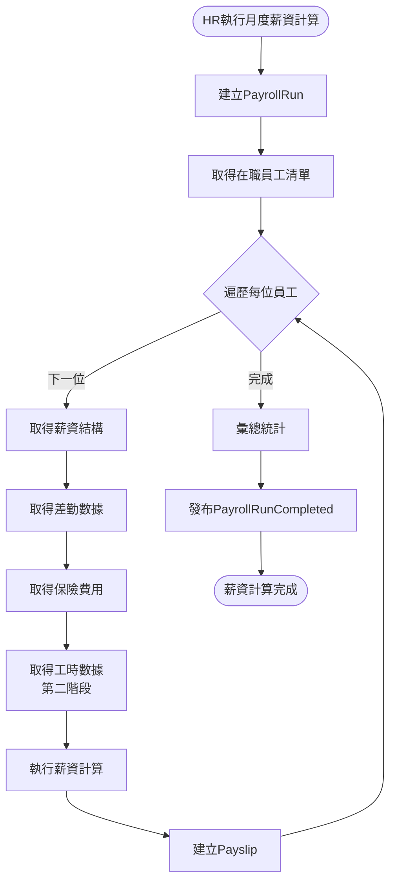
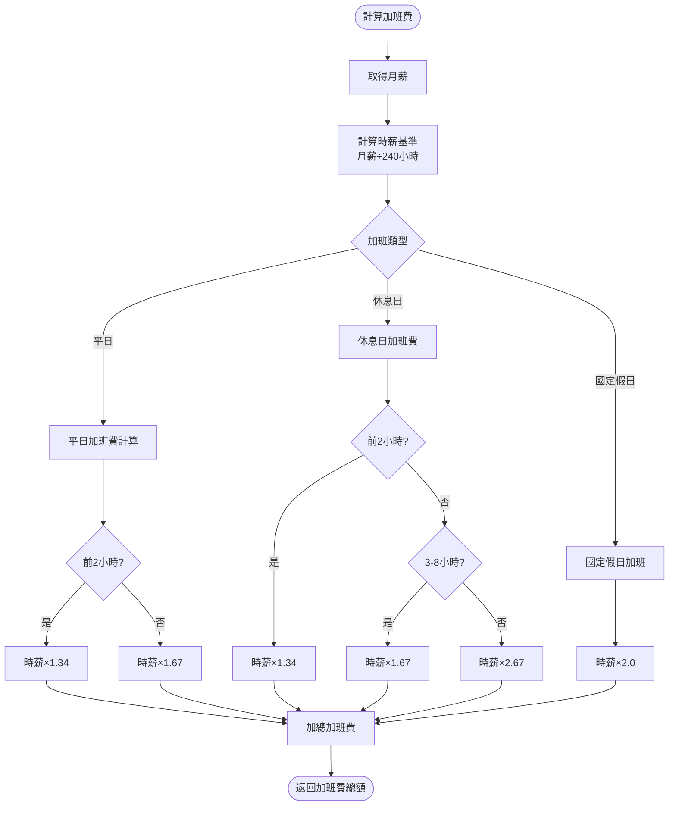
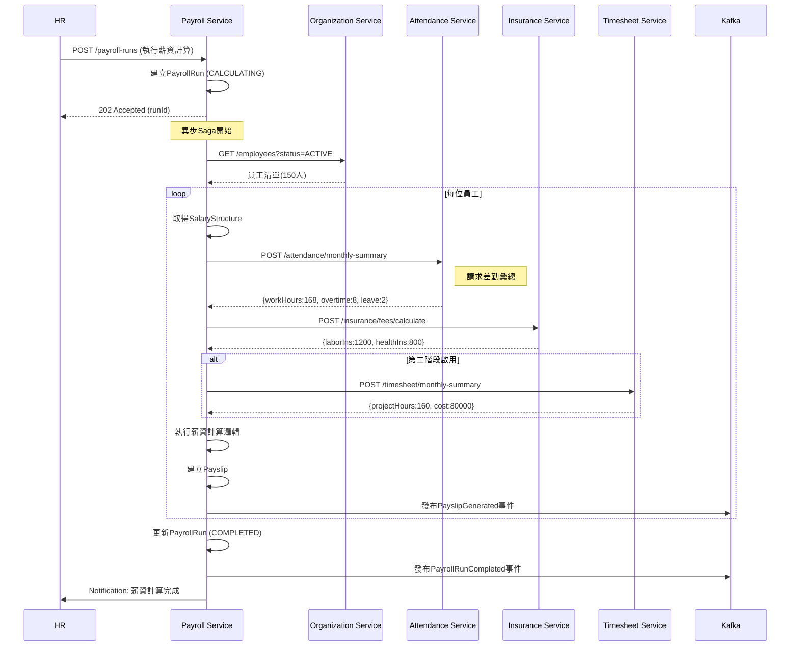

# 薪資管理服務(Payroll Service) 需求分析書

**版本:** 1.0  
**日期:** 2025-11-24  
**所屬領域:** 核心領域 (Core Domain)  
**導入階段:** 第一階段（核心基礎服務）

---

## 1. 服務定位與職責

### 1.1 服務概述
薪資管理服務是HR系統的**核心業務服務**，負責複雜的薪資計算邏輯。這是軟體公司專案成本核算的關鍵環節，必須整合差勤、保險、工時等多方數據，確保薪資計算的準確性與合規性。

### 1.2 核心職責
- **薪資結構管理:** 支援時薪制/月薪制、多領薪週期（日/週/半月/月領）
- **薪資項目設定:** 彈性設定20+種薪資項目（底薪、津貼、獎金、扣項）
- **自動化薪資運算:** 整合差勤、保險、工時數據，自動計算薪資
- **加班費計算:** 依勞基法計算平日/休息日/假日加班費
- **所得稅扣繳:** 自動計算所得稅、二代健保補充保費
- **薪資單管理:** 產生加密電子薪資單、Email發送
- **銀行薪轉:** 產生銀行薪轉媒體檔
- **專案成本核算:** 整合工時數據，計算專案人力成本（第二階段）

### 1.3 服務邊界
**屬於本服務:**
- 薪資結構定義
- 薪資計算引擎
- 薪資單產生
- 薪資歷史記錄

**不屬於本服務:**
- 差勤資料（Attendance Service提供）
- 保險費用計算（Insurance Service提供）
- 工時資料（Timesheet Service提供，第二階段）
- 員工基本資料（Organization Service）

---

## 2. 限界上下文定義

### 2.1 上下文名稱
**Payroll Context (薪資上下文)**

### 2.2 通用語言

| 術語 | 定義 | 範例 |
|:---|:---|:---|
| SalaryStructure | 薪資結構，員工的薪資組成 | 底薪50000+職務加給5000 |
| PayrollRun | 薪資計算批次，一次薪資計算作業 | 2025年11月月薪計算 |
| Payslip | 薪資單，個人薪資明細 | 張三11月薪資單 |
| PayrollItem | 薪資項目 | 底薪、全勤獎金、勞保費 |
| GrossWage | 應發薪資（稅前） | 60000元 |
| NetWage | 實發薪資（稅後） | 52000元 |
| Deduction | 扣項 | 勞保費、健保費、所得稅 |
| OvertimePay | 加班費 | 平日加班、休息日加班 |
| PayrollCycle | 領薪週期 | 日領、週領、月領 |

---

## 3. 領域模型設計

### 3.1 聚合根

#### 聚合根1: SalaryStructure (薪資結構)
**職責:** 定義員工的薪資組成與計算規則

**屬性:**
```
SalaryStructure {
  structureId: UUID (PK)
  employeeId: UUID (FK)
  
  // 薪資制度
  payrollSystem: PayrollSystem
  payrollCycle: PayrollCycle
  
  // 時薪制
  hourlyRate: Decimal (nullable, 時薪)
  
  // 月薪制
  monthlySalary: Decimal (nullable, 月薪)
  calculatedHourlyRate: Decimal (月薪÷法定工時，用於加班費計算)
  
  // 薪資項目
  salaryItems: List<SalaryItem>
  
  effectiveDate: Date
  endDate: Date (nullable)
  isActive: Boolean
  
  createdAt: DateTime
  updatedAt: DateTime
}

enum PayrollSystem {
  HOURLY   // 時薪制
  MONTHLY  // 月薪制
}

enum PayrollCycle {
  DAILY        // 日領
  WEEKLY       // 週領
  BI_WEEKLY    // 半月領
  MONTHLY      // 月領
}

SalaryItem {
  itemId: UUID
  itemCode: String (BASIC_SALARY, JOB_ALLOWANCE, MEAL_ALLOWANCE...)
  itemName: String
  itemType: ItemType (EARNING, DEDUCTION)
  amount: Decimal
  isFixedAmount: Boolean
  isTaxable: Boolean (是否計入所得稅)
  isInsurable: Boolean (是否計入勞健保投保薪資)
}

enum ItemType {
  EARNING    // 收入項
  DEDUCTION  // 扣除項
}
```

**不變性規則:**
- payrollSystem為HOURLY時，hourlyRate必填
- payrollSystem為MONTHLY時，monthlySalary必填
- 時薪制不可選擇日領以外的週期（業務規則可調整）

**領域行為:**
- `calculateMonthlyGross()`: 計算月應發薪資
- `addSalaryItem(item)`: 新增薪資項目
- `removeSalaryItem(itemCode)`: 移除薪資項目

#### 聚合根2: PayrollRun (薪資計算批次) - **核心聚合根**
**職責:** 執行一次薪資計算作業

**屬性:**
```
PayrollRun {
  runId: UUID (PK)
  organizationId: UUID
  
  // 計算範圍
  payPeriodStart: Date
  payPeriodEnd: Date
  payDate: Date (發薪日)
  
  // 狀態
  status: PayrollRunStatus
  
  // 統計
  totalEmployees: Integer
  processedEmployees: Integer
  totalGrossAmount: Decimal
  totalNetAmount: Decimal
  
  // 執行資訊
  executedBy: UUID (FK to User)
  executedAt: DateTime
  completedAt: DateTime
  
  createdAt: DateTime
}

enum PayrollRunStatus {
  DRAFT         // 草稿
  CALCULATING   // 計算中
  COMPLETED     // 已完成
  APPROVED      // 已核准
  PAID          // 已發放
  CANCELLED     // 已取消
}
```

**領域行為:**
- `execute()`: 執行薪資計算
- `approve(approverId)`: 核准薪資
- `cancel()`: 取消薪資計算
- `recalculate()`: 重新計算

#### 聚合根3: Payslip (薪資單)
**職責:** 個人薪資明細

**屬性:**
```
Payslip {
  payslipId: UUID (PK)
  payrollRunId: UUID (FK)
  employeeId: UUID (FK)
  
  payPeriodStart: Date
  payPeriodEnd: Date
  payDate: Date
  
  // 基本薪資
  baseSalary: Decimal
  
  // 收入項目
  earnings: List<PayslipItem>
  totalEarnings: Decimal
  
  // 扣除項目
  deductions: List<PayslipItem>
  totalDeductions: Decimal
  
  // 加班費
  overtimePay: OvertimePayDetail
  totalOvertimePay: Decimal
  
  // 請假扣款
  leaveDeduction: Decimal
  
  // 保險費用
  laborInsurance: Decimal (勞保個人負擔)
  healthInsurance: Decimal (健保個人負擔)
  pensionSelfContribution: Decimal (勞退自提)
  
  // 稅金
  incomeTax: Decimal
  supplementaryPremium: Decimal (二代健保補充保費)
  
  // 專案成本（第二階段）
  projectCost: Decimal (nullable, 該員工本月專案人力成本)
  
  // 計算結果
  grossWage: Decimal (應發)
  netWage: Decimal (實發)
  
  // 銀行帳戶
  bankAccount: BankAccount
  
  // 狀態
  status: PayslipStatus
  pdfUrl: String (nullable, 加密PDF路徑)
  emailSentAt: DateTime (nullable)
  
  createdAt: DateTime
}

PayslipItem {
  itemCode: String
  itemName: String
  amount: Decimal
}

OvertimePayDetail {
  weekdayHours: Decimal
  weekdayPay: Decimal
  restDayHours: Decimal
  restDayPay: Decimal
  holidayHours: Decimal
  holidayPay: Decimal
}

enum PayslipStatus {
  DRAFT
  FINALIZED
  SENT
}
```

**領域行為:**
- `calculate(attendanceData, insuranceData, timesheetData)`: 執行薪資計算
- `generatePDF()`: 產生PDF薪資單
- `sendEmail()`: Email發送薪資單

---

## 4. 薪資計算引擎設計

### 4.1 計算流程（Saga模式）

```
PayrollCalculationSaga:

1. PayrollRun.execute()
   ↓
2. 獲取員工清單（Organization Service）
   ↓
3. 對每位員工：
   a. 獲取薪資結構 (SalaryStructure)
   b. 獲取差勤數據 (Attendance Service) → 加班時數、請假天數
   c. 獲取保險數據 (Insurance Service) → 勞健保費用、勞退
   d. 獲取工時數據 (Timesheet Service, 第二階段) → 專案工時
   e. 執行計算邏輯
   f. 產生Payslip
   ↓
4. 彙總統計
   ↓
5. 發布 PayrollRunCompleted 事件
```

### 4.2 薪資計算公式

#### 4.2.1 月薪制員工
```
應發薪資 (Gross) = 
  底薪 
  + 固定津貼（職務加給、伙食津貼等）
  + 績效獎金
  + 加班費
  - 請假扣款

扣除項 (Deductions) = 
  勞保費（個人負擔）
  + 健保費（個人負擔）
  + 勞退自提
  + 所得稅
  + 二代健保補充保費

實發薪資 (Net) = 應發薪資 - 扣除項
```

#### 4.2.2 時薪制員工
```
應發薪資 = 
  時薪 × 實際工時
  + 加班費
  + 津貼

扣除項 = (同上)

實發薪資 = 應發薪資 - 扣除項
```

### 4.3 加班費計算（依勞基法）

```
時薪基準 = 
  月薪制: 月薪 ÷ 240小時（每月平均工時）
  時薪制: 時薪

平日加班費（前2小時）= 時薪基準 × 1.34
平日加班費（第3小時起）= 時薪基準 × 1.67

休息日加班費（前2小時）= 時薪基準 × 1.34
休息日加班費（第3-8小時）= 時薪基準 × 1.67
休息日加班費（第9-12小時）= 時薪基準 × 2.67

國定假日加班費 = 時薪基準 × 2.0
```

### 4.4 請假扣款計算

```
病假（30天內）= 半薪
事假 = 全扣
特休 = 不扣薪

日薪基準 = 月薪 ÷ 30

請假扣款 = 
  事假天數 × 日薪基準
  + 病假天數 × (日薪基準 × 0.5)
```

### 4.5 所得稅扣繳（簡化版）

```
月薪資總額 < 84,501: 免扣繳
月薪資總額 84,501-254,500: 5%
... (依財政部公告稅率表)
```

### 4.6 二代健保補充保費（2.11%）

```
若單次獎金超過當月投保金額4倍:
  補充保費 = (獎金 - 投保金額 × 4) × 2.11%
```

---

## 5. 領域事件定義

| 事件名稱 | 觸發時機 | 事件負載 | 訂閱服務 |
|:---|:---|:---|:---|
| `SalaryStructureCreated` | 建立薪資結構 | employeeId, monthlySalary | Insurance |
| `SalaryStructureChanged` | 薪資調整 | employeeId, oldSalary, newSalary | Insurance |
| `PayrollRunStarted` | 開始薪資計算 | runId, payPeriod | - |
| `PayrollRunCompleted` | 薪資計算完成 | runId, totalEmployees, totalAmount | Notification |
| `PayslipGenerated` | 產生薪資單 | payslipId, employeeId, netWage | Notification, Document |
| `PayrollApproved` | 薪資核准 | runId, approvedBy | - |
| `PayrollPaid` | 薪資已發放 | runId, paidDate | - |

---

## 6. API設計

### 6.1 薪資結構API

#### 6.1.1 建立/更新員工薪資結構
```
POST /api/v1/salary-structures
Authorization: Bearer {token}
Required Permission: payroll:salary:manage

Request:
{
  "employeeId": "uuid",
  "payrollSystem": "MONTHLY",
  "payrollCycle": "MONTHLY",
  "monthlySalary": 50000,
  "salaryItems": [
    {
      "itemCode": "JOB_ALLOWANCE",
      "itemName": "職務加給",
      "itemType": "EARNING",
      "amount": 5000,
      "isFixedAmount": true,
      "isTaxable": true,
      "isInsurable": true
    },
    {
      "itemCode": "MEAL_ALLOWANCE",
      "itemName": "伙食津貼",
      "itemType": "EARNING",
      "amount": 2400,
      "isFixedAmount": true,
      "isTaxable": false,
      "isInsurable": false
    }
  ],
  "effectiveDate": "2025-01-01"
}

Response 201:
{
  "structureId": "uuid",
  "employeeId": "uuid",
  "monthlySalary": 50000,
  "calculatedHourlyRate": 208.33,
  "totalMonthlyGross": 57400
}
```

#### 6.1.2 查詢員工薪資結構
```
GET /api/v1/salary-structures?employeeId={id}&effectiveDate={date}
Authorization: Bearer {token}
Required Permission: payroll:salary:read

Response 200:
{
  "structureId": "uuid",
  "payrollSystem": "MONTHLY",
  "payrollCycle": "MONTHLY",
  "monthlySalary": 50000,
  "salaryItems": [...],
  "totalMonthlyGross": 57400,
  "effectiveDate": "2025-01-01"
}
```

### 6.2 薪資計算API

#### 6.2.1 建立薪資計算批次
```
POST /api/v1/payroll-runs
Authorization: Bearer {token}
Required Permission: payroll:run:create

Request:
{
  "organizationId": "uuid",
  "payPeriodStart": "2025-11-01",
  "payPeriodEnd": "2025-11-30",
  "payDate": "2025-12-05"
}

Response 201:
{
  "runId": "uuid",
  "status": "DRAFT",
  "payPeriodStart": "2025-11-01",
  "payPeriodEnd": "2025-11-30",
  "payDate": "2025-12-05"
}
```

#### 6.2.2 執行薪資計算
```
POST /api/v1/payroll-runs/{runId}/execute
Authorization: Bearer {token}
Required Permission: payroll:run:execute

Response 202 Accepted:
{
  "runId": "uuid",
  "status": "CALCULATING",
  "message": "薪資計算已啟動，請稍後查詢結果"
}
```

**業務邏輯（異步處理）:**
1. 查詢組織內所有在職員工
2. 對每位員工執行薪資計算Saga
3. 產生Payslip
4. 更新PayrollRun統計
5. 發布 `PayrollRunCompleted` 事件

#### 6.2.3 查詢薪資計算狀態
```
GET /api/v1/payroll-runs/{runId}
Authorization: Bearer {token}
Required Permission: payroll:run:read

Response 200:
{
  "runId": "uuid",
  "status": "COMPLETED",
  "payPeriodStart": "2025-11-01",
  "payPeriodEnd": "2025-11-30",
  "totalEmployees": 150,
  "processedEmployees": 150,
  "totalGrossAmount": 8500000,
  "totalNetAmount": 7200000,
  "completedAt": "2025-12-01T10:30:00Z"
}
```

#### 6.2.4 核准薪資
```
PUT /api/v1/payroll-runs/{runId}/approve
Authorization: Bearer {token}
Required Permission: payroll:run:approve

Response 200:
{
  "runId": "uuid",
  "status": "APPROVED",
  "approvedBy": "財務經理",
  "approvedAt": "2025-12-02T09:00:00Z"
}
```

### 6.3 薪資單API

#### 6.3.1 查詢員工薪資單
```
GET /api/v1/payslips?employeeId={id}&year={year}&month={month}
Authorization: Bearer {token}
Required Permission: payroll:payslip:read (or payroll:payslip:read:self)

Response 200:
{
  "payslipId": "uuid",
  "payPeriod": "2025-11",
  "baseSalary": 50000,
  "earnings": [
    {"itemName": "職務加給", "amount": 5000},
    {"itemName": "伙食津貼", "amount": 2400}
  ],
  "totalEarnings": 57400,
  "overtimePay": {
    "weekdayHours": 8,
    "weekdayPay": 3200,
    "totalOvertimePay": 3200
  },
  "deductions": [
    {"itemName": "勞保費", "amount": 1200},
    {"itemName": "健保費", "amount": 800},
    {"itemName": "所得稅", "amount": 2000}
  ],
  "totalDeductions": 4000,
  "grossWage": 60600,
  "netWage": 56600,
  "pdfUrl": "/api/v1/documents/payslips/xxx.pdf"
}
```

**權限控管:**
- 一般員工只能查看自己的薪資單（`payroll:payslip:read:self`）
- HR/財務可查看所有人（`payroll:payslip:read:all`）

#### 6.3.2 下載薪資單PDF
```
GET /api/v1/payslips/{payslipId}/pdf
Authorization: Bearer {token}

Response 200:
Content-Type: application/pdf
Content-Disposition: attachment; filename="payslip_2025-11.pdf"

(加密PDF檔案)
```

**業務邏輯:**
- PDF需密碼保護（密碼=員工身分證後4碼）
- 記錄下載日誌

#### 6.3.3 Email發送薪資單
```
POST /api/v1/payroll-runs/{runId}/send-payslips
Authorization: Bearer {token}
Required Permission: payroll:payslip:send

Response 202:
{
  "message": "薪資單發送作業已啟動",
  "totalRecipients": 150
}
```

**業務邏輯（異步）:**
- 查詢該批次所有Payslip
- 產生PDF
- 調用Notification Service發送Email
- 更新emailSentAt

### 6.4 薪轉檔案API

#### 6.4.1 產生銀行薪轉媒體檔
```
POST /api/v1/payroll-runs/{runId}/bank-transfer-file
Authorization: Bearer {token}
Required Permission: payroll:bank-file:generate

Request:
{
  "bankCode": "012", (台北富邦)
  "format": "TXT"
}

Response 200:
{
  "fileUrl": "/api/v1/downloads/bank-transfer-202511.txt",
  "totalRecords": 150,
  "totalAmount": 7200000,
  "generatedAt": "2025-12-02T10:00:00Z"
}
```

**業務邏輯:**
- 依銀行格式規範產生媒體檔
- 支援主要銀行（富邦、台銀、國泰等）

---

## 7. 資料模型設計

### 7.1 資料庫Schema

```sql
-- 薪資結構表
CREATE TABLE salary_structures (
    structure_id UUID PRIMARY KEY DEFAULT gen_random_uuid(),
    employee_id UUID NOT NULL,
    
    payroll_system VARCHAR(20) NOT NULL,
    payroll_cycle VARCHAR(20) NOT NULL,
    
    hourly_rate DECIMAL(10,2),
    monthly_salary DECIMAL(10,2),
    calculated_hourly_rate DECIMAL(10,2),
    
    salary_items JSONB NOT NULL,
    
    effective_date DATE NOT NULL,
    end_date DATE,
    is_active BOOLEAN DEFAULT TRUE,
    
    created_at TIMESTAMP DEFAULT CURRENT_TIMESTAMP,
    updated_at TIMESTAMP DEFAULT CURRENT_TIMESTAMP,
    
    CONSTRAINT chk_payroll_system CHECK (payroll_system IN ('HOURLY', 'MONTHLY')),
    CONSTRAINT chk_payroll_cycle CHECK (payroll_cycle IN ('DAILY', 'WEEKLY', 'BI_WEEKLY', 'MONTHLY'))
);

CREATE INDEX idx_salary_struct_emp ON salary_structures(employee_id, effective_date);

-- 薪資計算批次表
CREATE TABLE payroll_runs (
    run_id UUID PRIMARY KEY DEFAULT gen_random_uuid(),
    organization_id UUID NOT NULL,
    
    pay_period_start DATE NOT NULL,
    pay_period_end DATE NOT NULL,
    pay_date DATE NOT NULL,
    
    status VARCHAR(20) DEFAULT 'DRAFT',
    
    total_employees INTEGER DEFAULT 0,
    processed_employees INTEGER DEFAULT 0,
    total_gross_amount DECIMAL(15,2) DEFAULT 0,
    total_net_amount DECIMAL(15,2) DEFAULT 0,
    
    executed_by UUID,
    executed_at TIMESTAMP,
    completed_at TIMESTAMP,
    
    created_at TIMESTAMP DEFAULT CURRENT_TIMESTAMP,
    
    CONSTRAINT chk_run_status CHECK (status IN ('DRAFT', 'CALCULATING', 'COMPLETED', 'APPROVED', 'PAID', 'CANCELLED'))
);

CREATE INDEX idx_payroll_runs_org ON payroll_runs(organization_id, pay_period_start);

-- 薪資單表
CREATE TABLE payslips (
    payslip_id UUID PRIMARY KEY DEFAULT gen_random_uuid(),
    payroll_run_id UUID NOT NULL REFERENCES payroll_runs(run_id),
    employee_id UUID NOT NULL,
    
    pay_period_start DATE NOT NULL,
    pay_period_end DATE NOT NULL,
    pay_date DATE NOT NULL,
    
    base_salary DECIMAL(10,2) NOT NULL,
    
    earnings JSONB,
    total_earnings DECIMAL(10,2) NOT NULL,
    
    deductions JSONB,
    total_deductions DECIMAL(10,2) NOT NULL,
    
    overtime_pay JSONB,
    total_overtime_pay DECIMAL(10,2) DEFAULT 0,
    
    leave_deduction DECIMAL(10,2) DEFAULT 0,
    
    labor_insurance DECIMAL(10,2) DEFAULT 0,
    health_insurance DECIMAL(10,2) DEFAULT 0,
    pension_self_contribution DECIMAL(10,2) DEFAULT 0,
    
    income_tax DECIMAL(10,2) DEFAULT 0,
    supplementary_premium DECIMAL(10,2) DEFAULT 0,
    
    project_cost DECIMAL(10,2), -- 第二階段
    
    gross_wage DECIMAL(10,2) NOT NULL,
    net_wage DECIMAL(10,2) NOT NULL,
    
    bank_account JSONB,
    
    status VARCHAR(20) DEFAULT 'DRAFT',
    pdf_url VARCHAR(500),
    email_sent_at TIMESTAMP,
    
    created_at TIMESTAMP DEFAULT CURRENT_TIMESTAMP,
    
    CONSTRAINT chk_payslip_status CHECK (status IN ('DRAFT', 'FINALIZED', 'SENT'))
);

CREATE INDEX idx_payslips_run ON payslips(payroll_run_id);
CREATE INDEX idx_payslips_emp ON payslips(employee_id, pay_period_start);

-- 薪資計算歷程表（Audit Log）
CREATE TABLE payroll_audit_logs (
    log_id UUID PRIMARY KEY DEFAULT gen_random_uuid(),
    payslip_id UUID NOT NULL REFERENCES payslips(payslip_id),
    
    calculation_details JSONB NOT NULL, -- 完整計算過程JSON
    data_sources JSONB, -- 來源數據（差勤、保險等）
    
    calculated_at TIMESTAMP DEFAULT CURRENT_TIMESTAMP,
    calculated_by UUID
);
```

---

## 8. 與其他服務整合

### 8.1 同步整合

| 呼叫服務 | API | 場景 |
|:---|:---|:---|
| Organization Service | GET /api/v1/employees | 取得在職員工清單 |
| Attendance Service | POST /api/v1/attendance/monthly-summary | 取得月度差勤彙總 |
| Insurance Service | POST /api/v1/insurance/fees/calculate | 取得保險費用 |
| Timesheet Service | POST /api/v1/timesheet/monthly-summary | 取得月度工時（第二階段） |

### 8.2 異步整合（Saga）

**薪資計算Saga流程:**
```
1. PayrollRun.execute()
2. For each employee:
   a. Query SalaryStructure
   b. Request AttendanceMonthClosed data (Event or API)
   c. Request InsuranceFees (API call)
   d. Request TimesheetData (Event or API, Phase 2)
   e. Calculate payslip
   f. Publish PayslipGenerated event
3. PayrollRunCompleted event
```

**補償邏輯:**
- 若某員工計算失敗，記錄錯誤，繼續處理其他員工
- HR可針對失敗員工單獨重新計算

---

## 9. 非功能需求

### 9.1 效能需求

| 指標 | 目標 |
|:---|:---|
| 薪資計算（200人） | <10分鐘 |
| 薪資單PDF產生 | <3秒/份 |
| 薪資查詢API | <200ms |

### 9.2 準確性需求

- **薪資計算準確率:** >99.9%
- **加班費計算符合勞基法:** 100%
- **所得稅扣繳符合財政部規定:** 100%

### 9.3 安全性需求

- 薪資資料加密儲存（AES-256）
- 薪資單PDF密碼保護
- 完整Audit Log（計算歷程可追溯）
- 權限嚴格控管（RLS row-level security）

---

## 10. 技術選型

| 元件 | 選型 |
|:---|:---|
| 框架 | Spring Boot 3.2+ |
| 資料庫 | PostgreSQL 15+ |
| Saga協調 | Spring State Machine / Axon Framework |
| PDF產生 | iText / Apache PDFBox |
| 快取 | Redis (薪資結構) |
| 訊息佇列 | Kafka |

---

## 11. 測試策略

### 11.1 單元測試

**重點測試:**
- 加班費計算邏輯（各種情境）
- 請假扣款計算
- 稅金計算
- 銀行媒體檔格式

### 11.2 整合測試

**測試場景:**
- 完整薪資計算流程（模擬差勤、保險數據）
- Saga失敗補償
- 併發薪資計算

### 11.3 平行測試（上線前）

- 新舊系統同步計算3個月
- 比對計算結果差異
- 差異<0.01%才能上線

---

**文件結束**


# PM審查補充

# 薪資管理服務 - PM審查補充文件

**版本:** 1.1
**日期:** 2025-11-30
**補充說明:** 補充業務流程圖、循序圖、事件案例等

---

## 📋 補充內容

### 文件增強
- 業務流程圖：薪資計算Saga流程、加班費計算流程
- 循序圖：薪資計算跨服務互動
- 事件JSON範例：PayslipGenerated、PayrollRunCompleted
- 業務邏輯詳述：加班費計算公式、所得稅扣繳邏輯
- 業務案例：完整薪資計算實例

---

## 1. 業務流程圖

### 1.1 月度薪資計算Saga流程


### 1.2 加班費計算詳細流程


---

## 2. 循序圖

### 2.1 薪資計算Saga循序圖（關鍵！）


---

## 3. 事件JSON範例

### 3.1 PayslipGenerated 事件
```json
{
  "eventType": "PayslipGenerated",
  "eventId": "uuid-event",
  "timestamp": "2025-11-30T23:00:00Z",
  "aggregateId": "payslip-uuid",
  "aggregateType": "Payslip",
  "version": 1,
  "payload": {
    "payslipId": "uuid-payslip",
    "payrollRunId": "uuid-run",
    "employeeId": "uuid-emp",
    "employeeName": "張三",
    "payPeriod": "2025-11",
    "payDate": "2025-12-05",

    "baseSalary": 50000,
    "allowances": {
      "jobAllowance": 5000,
      "mealAllowance": 2400
    },
    "totalEarnings": 57400,

    "overtimePay": {
      "weekdayHours": 8,
      "weekdayPay": 3333,
      "totalOvertimePay": 3333
    },

    "deductions": {
      "laborInsurance": 1200,
      "healthInsurance": 800,
      "pension": 3000,
      "incomeTax": 2000
    },
    "totalDeductions": 7000,

    "grossWage": 60733,
    "netWage": 53733,

    "pdfUrl": "/payslips/2025-11/uuid.pdf"
  },
  "metadata": {
    "correlationId": "payroll-run-uuid",
    "userId": "hr-manager-uuid"
  }
}
```

### 3.2 PayrollRunCompleted 事件
```json
{
  "eventType": "PayrollRunCompleted",
  "eventId": "uuid",
  "timestamp": "2025-11-30T23:30:00Z",
  "payload": {
    "runId": "uuid-run",
    "organizationId": "uuid-org",
    "payPeriod": "2025-11",
    "payDate": "2025-12-05",
    "totalEmployees": 150,
    "totalGrossAmount": 9000000,
    "totalNetAmount": 7500000,
    "completedAt": "2025-11-30T23:30:00Z"
  }
}
```

---

## 4. 業務邏輯詳述

### 4.1 加班費計算完整公式

**時薪基準計算:**
```
月薪制員工時薪 = 月薪 ÷ 240小時
（勞基法：每月工時上限 = 30天 × 8小時 = 240小時）

範例：月薪50,000元
時薪基準 = 50,000 ÷ 240 = 208.33元
```

**平日延長工時（勞基法§24-1）:**
```
前2小時: 時薪 × 1.34倍
第3小時起: 時薪 × 1.67倍

範例：加班3小時
加班費 = (208.33 × 1.34 × 2) + (208.33 × 1.67 × 1)
       = 558.33 + 347.91
       = 906.24元
```

**休息日加班（勞基法§24-2）:**
```
工作時間在2小時以內: 按平日每小時工資額另再加給1又1/3以上
工作2小時後再繼續工作: 按平日每小時工資額另再加給1又2/3以上

前2小時: 時薪 × 1.34
3-8小時: 時薪 × 1.67
9-12小時: 時薪 × 2.67

範例：休息日加班6小時
加班費 = (208.33 × 1.34 × 2) + (208.33 × 1.67 × 4)
       = 558.33 + 1391.64
       = 1949.97元
```

**國定假日加班（勞基法§39）:**
```
加班費 = 時薪 × 2.0

範例：國定假日加班8小時
加班費 = 208.33 × 2.0 × 8 = 3333.28元
```

### 4.2 所得稅扣繳計算（簡化版）

**級距表（2025年）:**
```
月薪資總額          稅率    累進差額
----------------------------------------
0 ~ 84,500         0%      0
84,501 ~ 254,500   5%      4,225
254,501 ~ 508,500  12%     21,975
508,501 ~ 1,016,500 20%    62,575
1,016,501以上      40%     265,175
```

**計算範例:**
```java
public BigDecimal calculateIncomeTax(BigDecimal monthlyIncome) {
    if (monthlyIncome.compareTo(new BigDecimal("84500")) <= 0) {
        return BigDecimal.ZERO;
    } else if (monthlyIncome.compareTo(new BigDecimal("254500")) <= 0) {
        return monthlyIncome.multiply(new BigDecimal("0.05"))
            .subtract(new BigDecimal("4225"));
    } else if (monthlyIncome.compareTo(new BigDecimal("508500")) <= 0) {
        return monthlyIncome.multiply(new BigDecimal("0.12"))
            .subtract(new BigDecimal("21975"));
    }
    // ... 其他級距
}

// 範例：月薪資總額 100,000元
// 所得稅 = 100,000 × 5% - 4,225 = 775元
```

### 4.3 二代健保補充保費計算

**觸發條件:**
```
單次獎金 > 投保金額 × 4倍時，需扣繳補充保費

計費基準 = 獎金 - (投保金額 × 4)
補充保費 = 計費基準 × 2.11%
```

**範例:**
```
投保金額: 48,200元
年終獎金: 250,000元

計費基準 = 250,000 - (48,200 × 4) = 57,200元
補充保費 = 57,200 × 2.11% = 1,207元
```

---

## 5. 操作邏輯

### 5.1 HR執行月度薪資計算步驟

**前置條件:**
- 當月差勤已結算（Attendance Service月度結算完成）
- 所有請假、加班已審核完畢

**操作步驟:**

1. **登入系統**
   - HR經理登入 → 進入「薪資管理」模組

2. **建立薪資計算批次**
   - 點擊「新增薪資計算」
   - 選擇公司：母公司
   - 選擇期間：2025-11-01 ~ 2025-11-30
   - 設定發薪日：2025-12-05
   - 點擊「建立」

3. **執行計算**
   - 系統顯示：將計算150位員工薪資
   - 點擊「執行計算」
   - 系統開始異步處理

4. **等待計算完成**
   - 進度顯示：已處理 50/150
   - 預估完成時間：約10分鐘

5. **檢視計算結果**
   - 計算完成通知
   - 查看統計：
     * 總應發：9,000,000元
     * 總實發：7,500,000元
     * 平均薪資：60,000元

6. **檢查異常**
   - 查看是否有計算異常的員工
   - 若有，檢視錯誤原因並修正

7. **核准薪資**
   - 點擊「核准薪資」
   - 系統鎖定，不可再修改

8. **產生薪轉檔**
   - 選擇銀行：台北富邦
   - 下載薪轉媒體檔
   - 上傳至銀行系統

9. **發送薪資單**
   - 點擊「發送薪資單」
   - 系統Email發送給所有員工

---

## 6. 業務案例

### 業務案例 UC-PAY-001: 月薪制員工完整薪資計算

**角色:** 員工張三

**基本資料:**
- 職稱：前端工程師
- 月薪：50,000元
- 年資：2年（有特休）

**11月份出勤狀況:**
- 正常工時：168小時
- 平日加班：8小時
- 請特休假：2天（16小時）
- 遲到：1次（5分鐘，不扣薪）

**薪資計算明細:**

**1. 應發項目:**
```
底薪：          50,000元
職務加給：       5,000元
伙食津貼：       2,400元（免稅）
全勤獎金：       1,000元（因遲到不給）
---------------------------------
小計：          57,400元
```

**2. 加班費計算:**
```
時薪基準 = 50,000 ÷ 240 = 208.33元

平日加班8小時（前2小時1.34倍，後6小時1.67倍）:
前2小時 = 208.33 × 1.34 × 2 = 558.33元
後6小時 = 208.33 × 1.67 × 6 = 2,087.48元
---------------------------------
加班費小計：    2,645.81元
```

**3. 請假扣款:**
```
特休假2天 = 不扣薪（0元）
```

**4. 保險費用（個人負擔）:**
```
勞保費：        1,200元
健保費：          800元
勞退自提(0%)：     0元
---------------------------------
保險費小計：    2,000元
```

**5. 稅金:**
```
應稅所得 = 50,000 + 5,000 + 2,645.81 = 57,645.81元
（伙食津貼2,400免稅）

所得稅 = 0元（未達84,501起徵點）
補充保費 = 0元（無單次獎金）
---------------------------------
稅金小計：      0元
```

**6. 最終計算:**
```
總應發 = 57,400 + 2,645.81 = 60,045.81元
總扣除 = 2,000 + 0 = 2,000元
---------------------------------
實發薪資：     58,045.81元
（實際銀行轉帳：58,046元）
```

**薪資單摘要:**
```
=========================================
          2025年11月 薪資單
=========================================
姓名：張三              員工編號：E001
部門：研發部            職稱：前端工程師
-----------------------------------------
【應發項目】
底薪                           50,000
職務加給                        5,000
伙食津貼                        2,400
平日加班費 (8.0小時)            2,646
-----------------------------------------
應發合計                       60,046

【扣除項目】
勞保費                          1,200
健保費                            800
-----------------------------------------
扣除合計                        2,000

【實發金額】                   58,046
=========================================
發薪日：2025-12-05
銀行帳號：台北富邦 ***6789
=========================================
```

---

**補充文件結束**

**主文件:** 04_薪資管理服務需求分析書.md
**修訂日期:** 2025-11-30
**修訂人:** SA
