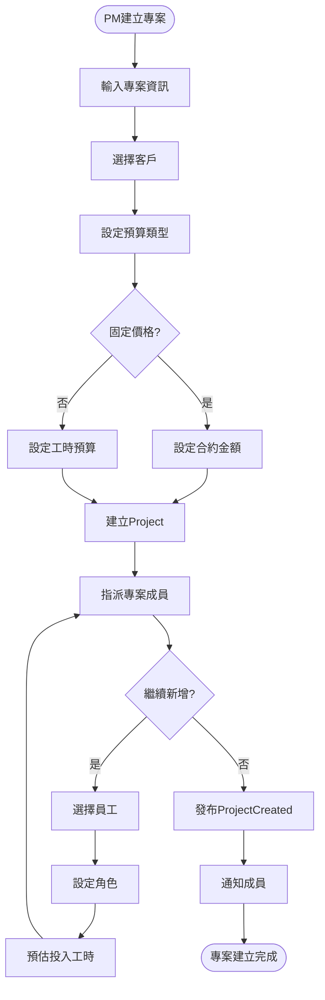
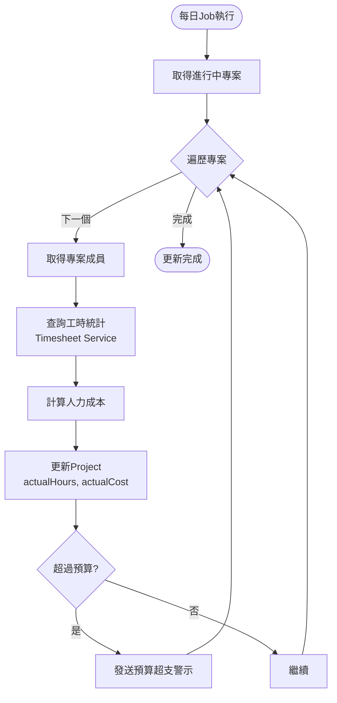
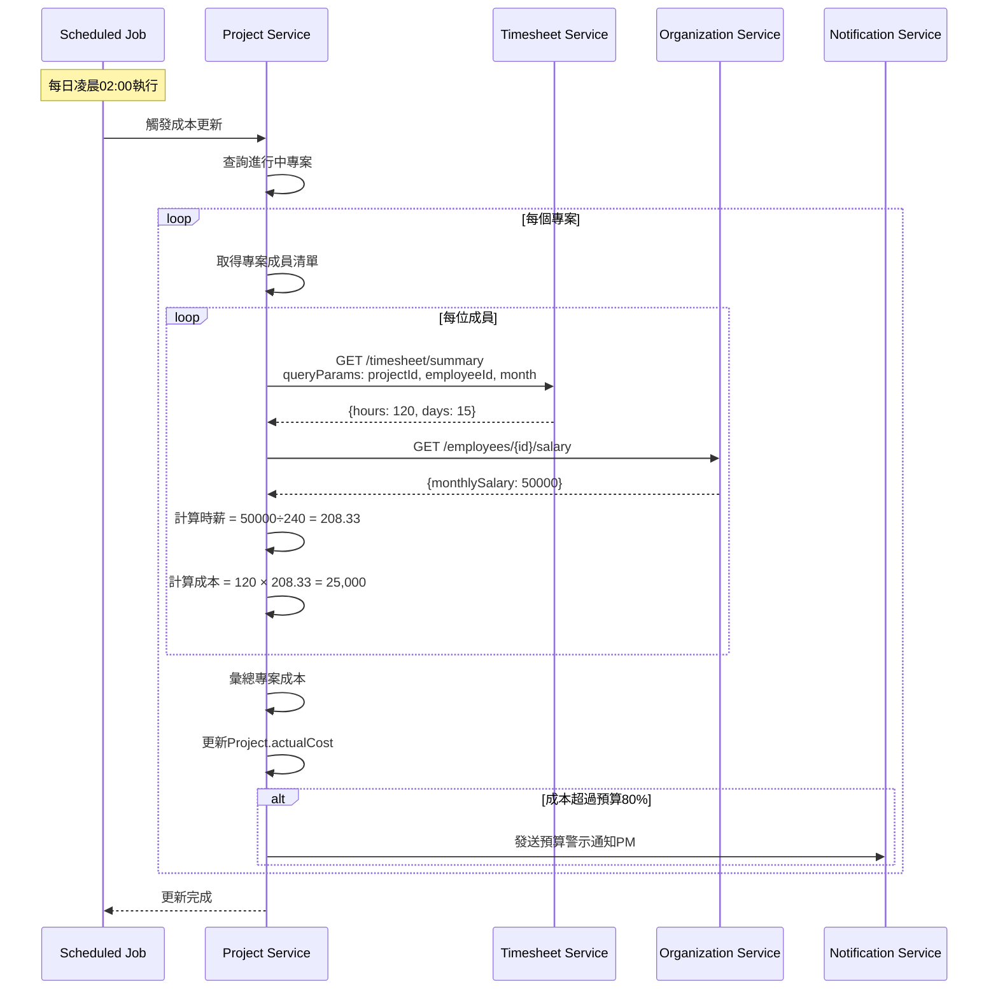

# 專案管理服務(Project Management Service) 需求分析書

**版本:** 1.0
**日期:** 2025-11-24
**所屬領域:** 核心領域 (Core Domain) - 專案成本管理
**導入階段:** 第二階段（專案管理核心）

---

## 1. 服務概述與職責

### 1.1 核心職責
- 客戶資料管理
- 專案建立與維護（類型、預算、時程）
- 多層級工項管理（WBS, 5層）
- 專案成員與角色指派
- 專案狀態追蹤
- 專案成本分析（與工時服務協作）

### 1.2 服務邊界
**屬於:** 專案資料、客戶資料、工項定義、成員指派
**不屬於:** 工時回報(Timesheet Service)、成本計算(需整合工時+薪資)

---

## 2. 領域模型

### 2.1 聚合根

#### Customer (客戶)
```
Customer {
  customerId: UUID (PK)
  customerCode: String (unique)
  customerName: String
  taxId: String
  industry: String

  contacts: List<CustomerContact>

  address: String
  phoneNumber: String
  email: String

  status: CustomerStatus (ACTIVE, INACTIVE)
  createdAt: DateTime
}

CustomerContact {
  contactId: UUID
  name: String
  title: String
  email: String
  phoneNumber: String
  isPrimary: Boolean
}
```

#### Project (專案)
```
Project {
  projectId: UUID (PK)
  projectCode: String (unique)
  projectName: String

  customerId: UUID (FK)

  projectType: ProjectType (DEVELOPMENT, MAINTENANCE, CONSULTING)

  // 時程
  plannedStartDate: Date
  plannedEndDate: Date
  actualStartDate: Date (nullable)
  actualEndDate: Date (nullable)

  // 預算
  budgetType: BudgetType (FIXED_PRICE, TIME_AND_MATERIAL)
  budgetAmount: Decimal (nullable, 金額預算)
  budgetHours: Decimal (nullable, 工時預算)

  // 專案成員
  projectManager: UUID (FK to Employee)
  members: List<ProjectMember>

  // 狀態
  status: ProjectStatus (PLANNING, IN_PROGRESS, COMPLETED, ON_HOLD, CANCELLED)

  // 成本統計（定期更新）
  actualHours: Decimal (實際投入工時)
  actualCost: Decimal (實際人力成本)

  description: Text
  createdAt: DateTime
  updatedAt: DateTime
}

enum ProjectType {
  DEVELOPMENT   // 新開發
  MAINTENANCE   // 維護
  CONSULTING    // 顧問
}

enum BudgetType {
  FIXED_PRICE         // 固定價格
  TIME_AND_MATERIAL   // 實報實銷（工時計費）
}

enum ProjectStatus {
  PLANNING      // 規劃中
  IN_PROGRESS   // 進行中
  COMPLETED     // 已結案
  ON_HOLD       // 暫停
  CANCELLED     // 已取消
}

ProjectMember {
  memberId: UUID
  employeeId: UUID (FK)
  role: String (Developer, QA, BA...)
  allocatedHours: Decimal (nullable, 預計投入工時)
  joinDate: Date
  leaveDate: Date (nullable)
}
```

#### Task (工項/WBS)
```
Task {
  taskId: UUID (PK)
  projectId: UUID (FK)
  parentTaskId: UUID (nullable, FK自關聯)

  taskCode: String
  taskName: String
  description: Text

  level: Integer (層級, 1-5)

  // 時程
  plannedStartDate: Date
  plannedEndDate: Date
  actualStartDate: Date (nullable)
  actualEndDate: Date (nullable)

  // 工時
  estimatedHours: Decimal
  actualHours: Decimal (自動累計)

  // 負責人
  assigneeId: UUID (nullable, FK to Employee)

  // 狀態
  status: TaskStatus (NOT_STARTED, IN_PROGRESS, COMPLETED, BLOCKED)
  progress: Integer (0-100)

  displayOrder: Integer
  createdAt: DateTime
  updatedAt: DateTime
}

enum TaskStatus {
  NOT_STARTED
  IN_PROGRESS
  COMPLETED
  BLOCKED
}
```

---

## 3. 核心業務邏輯

### 3.1 專案成本計算
```
專案實際成本 = Σ (每位成員投入工時 × 該成員時薪)

需整合:
1. Timesheet Service → 取得每位成員的工時明細
2. Payroll Service (或 Organization) → 取得成員時薪

獲利率 = (合約金額 - 實際成本) / 合約金額 × 100%
```

### 3.2 專案進度計算
```
專案整體進度 = Σ (Task.progress × Task.estimatedHours) / Σ Task.estimatedHours

燃盡圖：
- X軸：時間
- Y軸：剩餘工時
- 理想線：線性遞減
- 實際線：實際剩餘工時
```

---

## 4. 領域事件

| 事件 | 觸發時機 | 訂閱服務 |
|:---|:---|:---|
| `ProjectCreated` | 建立專案 | - |
| `ProjectMemberAdded` | 新增成員 | Timesheet |
| `ProjectCompleted` | 專案結案 | Reporting |
| `TaskAssigned` | 指派工項 | Notification |
| `TaskCompleted` | 完成工項 | - |

---

## 5. 核心API

### 5.1 專案管理API

#### 建立專案
```
POST /api/v1/projects
Request:
{
  "projectCode": "PRJ-2025-001",
  "projectName": "XX銀行核心系統開發",
  "customerId": "uuid",
  "projectType": "DEVELOPMENT",
  "plannedStartDate": "2025-01-01",
  "plannedEndDate": "2025-12-31",
  "budgetType": "FIXED_PRICE",
  "budgetAmount": 10000000,
  "projectManager": "uuid",
  "members": [
    {
      "employeeId": "uuid",
      "role": "Tech Lead",
      "allocatedHours": 1000
    }
  ]
}

Response 201:
{
  "projectId": "uuid",
  "projectCode": "PRJ-2025-001",
  "status": "PLANNING"
}
```

#### 查詢專案詳情（含成本）
```
GET /api/v1/projects/{id}
Response 200:
{
  "projectId": "uuid",
  "projectName": "XX銀行核心系統開發",
  "customer": {...},
  "status": "IN_PROGRESS",
  "budget": {
    "budgetAmount": 10000000,
    "budgetHours": null
  },
  "actual": {
    "actualHours": 2500,
    "actualCost": 1800000,
    "costUtilization": "18%"
  },
  " progress": 35,
  "members": [...]
}
```

### 5.2 工項管理API

#### 建立工項（WBS）
```
POST /api/v1/projects/{projectId}/tasks
Request:
{
  "parentTaskId": null,
  "taskCode": "TASK-001",
  "taskName": "需求分析",
  "estimatedHours": 200,
  "assigneeId": "uuid",
  "plannedStartDate": "2025-01-01",
  "plannedEndDate": "2025-01-31"
}

Response 201:
{
  "taskId": "uuid",
  "level": 1,
  "status": "NOT_STARTED"
}
```

#### 查詢專案WBS樹
```
GET /api/v1/projects/{projectId}/tasks/tree
Response 200:
[
  {
    "taskId": "uuid",
    "taskName": "需求分析",
    "level": 1,
    "estimatedHours": 200,
    "actualHours": 50,
    "progress": 25,
    "subtasks": [...]
  }
]
```

---

## 6. 與其他服務整合

### 6.1 同步整合
- Organization Service → 查詢員工資訊
- Timesheet Service → 查詢專案工時統計

### 6.2 異步整合
- 訂閱 `TimesheetApproved` (Timesheet) → 更新Task.actualHours

---

## 7. 非功能需求

| 需求 | 目標 |
|:---|:---|
| 支援專案數量 | 100個同時進行 |
| WBS層級 | 5層 |
| 專案成本查詢 | <500ms |

---

**文件結束**


# PM審查補充

# 專案管理服務 - PM審查補充文件

**版本:** 1.1  
**日期:** 2025-11-30  
**補充說明:** 補充業務流程圖、循序圖、事件案例等

---

## 📋 補充內容

### 文件增強
- 業務流程圖：專案建立流程、專案成本更新流程
- 循序圖：專案成本計算跨服務互動
- 事件JSON範例
- 業務邏輯：專案成本計算公式、獲利率分析
- 業務案例：完整專案管理與成本核算

---

## 1. 業務流程圖

### 1.1 專案建立與成員指派流程


### 1.2 專案成本定期更新流程


---

## 2. 循序圖

### 2.1 專案成本計算循序圖


---

## 3. 事件JSON範例

### 3.1 ProjectCreated 事件
```json
{
  "eventType": "ProjectCreated",
  "eventId": "uuid-event",
  "timestamp": "2025-11-30T14:00:00Z",
  "aggregateId": "project-uuid",
  "aggregateType": "Project",
  "version": 1,
  "payload": {
    "projectId": "uuid-proj",
    "projectCode": "PRJ-2025-001",
    "projectName": "XX銀行核心系統開發",
    "customerId": "uuid-customer",
    "customerName": "XX銀行股份有限公司",
    
    "projectType": "DEVELOPMENT",
    "budgetType": "FIXED_PRICE",
    "budgetAmount": 10000000,
    
    "plannedStartDate": "2025-12-01",
    "plannedEndDate": "2026-11-30",
    "duration": 12,
    
    "projectManager": {
      "employeeId": "uuid-pm",
      "employeeName": "王經理"
    },
    
    "members": [
      {
        "employeeId": "uuid-emp1",
        "employeeName": "張三",
        "role": "Tech Lead",
        "allocatedHours": 1000
      },
      {
        "employeeId": "uuid-emp2",
        "employeeName": "李四",
        "role": "Developer",
        "allocatedHours": 800
      }
    ],
    
    "totalAllocatedHours": 1800
  },
  "metadata": {
    "userId": "uuid-pm",
    "ipAddress": "192.168.1.100"
  }
}
```

### 3.2 ProjectBudgetAlert 事件
```json
{
  "eventType": "ProjectBudgetAlert",
  "eventId": "uuid",
  "timestamp": "2025-12-15T02:00:00Z",
  "payload": {
    "projectId": "uuid-proj",
    "projectName": "XX銀行核心系統開發",
    "budgetAmount": 10000000,
    "actualCost": 8500000,
    "utilizationRate": 0.85,
    "alertLevel": "HIGH",
    "message": "專案成本已達預算85%，請注意控管"
  }
}
```

---

## 4. 業務邏輯詳述

### 4.1 專案人力成本計算公式

**基本公式:**
```
專案總成本 = Σ (每位成員投入工時 × 該成員時薪)

成員時薪 = 月薪 ÷ 240小時（月平均工時）
```

**詳細計算範例:**
```
專案：XX銀行核心系統開發
期間：2025-12 ~ 2026-11 (12個月)

成員1：張三 (Tech Lead)
- 月薪：70,000元
- 時薪：70,000 ÷ 240 = 291.67元
- 累計投入工時：1,200小時
- 人力成本：1,200 × 291.67 = 350,004元

成員2：李四 (Sr. Developer)
- 月薪：60,000元
- 時薪：60,000 ÷ 240 = 250元
- 累計投入工時：1,000小時
- 人力成本：1,000 × 250 = 250,000元

成員3：王五 (Jr. Developer)
- 月薪：45,000元
- 時薪：45,000 ÷ 240 = 187.5元
- 累計投入工時：800小時
- 人力成本：800 × 187.5 = 150,000元

-----------------------------------
專案總人力成本：750,004元
```

### 4.2 專案獲利率分析

**固定價格專案:**
```
合約金額：10,000,000元
實際成本：8,500,000元

毛利 = 合約金額 - 實際成本
    = 10,000,000 - 8,500,000
    = 1,500,000元

獲利率 = 毛利 ÷ 合約金額 × 100%
      = 1,500,000 ÷ 10,000,000 × 100%
      = 15%
```

**工時計費專案:**
```
預算工時：1,000小時
計費單價：1,500元/小時
預算金額：1,500,000元

實際投入工時：900小時
實際成本：450,000元（平均時薪500元）

營收 = 900 × 1,500 = 1,350,000元
毛利 = 1,350,000 - 450,000 = 900,000元
獲利率 = 900,000 ÷ 1,350,000 × 100% = 66.67%
```

### 4.3 工時稼動率計算

**定義:**
```
稼動率 = 計費工時 ÷ 總工時 × 100%

計費工時 = 專案工時（排除內部專案、訓練、請假等）
總工時 = 當月實際工作時數
```

**範例：研發部11月稼動率:**
```
研發部總人數：50人
可用工時：50人 × 22天 × 8小時 = 8,800小時

專案工時統計：
- 客戶專案A：2,000小時
- 客戶專案B：1,500小時
- 內部專案：800小時（不計費）
- 教育訓練：500小時（不計費）
- 請假：200小時
- 待命：3,800小時

計費工時 = 2,000 + 1,500 = 3,500小時
稼動率 = 3,500 ÷ 8,800 × 100% = 39.77%

（稼動率偏低，需增加專案承接或優化人力配置）
```

---

## 5. 操作邏輯

### 5.1 PM建立新專案完整步驟

**前置條件:**
- PM已登入系統
- 已取得客戶合約

**操作步驟:**

1. **進入專案管理模組**
   - 登入 → 點擊「專案管理」→「建立新專案」

2. **選擇客戶**
   - 點擊「選擇客戶」
   - 搜尋：XX銀行
   - 選擇：XX銀行股份有限公司

3. **填寫專案基本資訊**
   - 專案代號：PRJ-2025-001（自動產生）
   - 專案名稱：XX銀行核心系統開發
   - 專案類型：新開發
   - 專案經理：王經理（自動帶入當前使用者）

4. **設定時程**
   - 預計開始：2025-12-01
   - 預計結束：2026-11-30
   - 專案期程：12個月（自動計算）

5. **設定預算**
   - 預算類型：固定價格
   - 合約金額：10,000,000元
   - 工時預算：（不填，系統自動計算參考值：約4,000小時）

6. **指派專案成員**
   - 點擊「新增成員」
   
   成員1：
   - 員工：張三（搜尋）
   - 角色：Tech Lead
   - 預估工時：1,200小時
   
   成員2：
   - 員工：李四
   - 角色：Sr. Developer  
   - 預估工時：1,000小時
   
   ... （繼續新增其他成員）

7. **檢視預覽**
   - 系統顯示專案摘要：
     * 成員數：5人
     * 總預估工時：3,500小時
     * 預估成本：約2,500,000元
     * 預估獲利率：75%

8. **確認建立**
   - 點擊「建立專案」
   - 系統建立資料並發布事件
   - 通知所有成員

9. **建立完成**
   - 跳轉至專案詳情頁
   - 專案狀態：規劃中

---

## 6. 業務案例

### 業務案例 UC-PROJ-001: 專案全生命週期管理

**專案資訊:**
- 專案：XX銀行核心系統開發
- 客戶：XX銀行股份有限公司
- PM：王經理
- 期間：2025-12-01 ~ 2026-11-30 (12個月)
- 合約金額：10,000,000元（固定價格）

**階段1：專案啟動（2025-12）**

**1.1 建立專案**
```
2025-12-01:
- PM王經理建立專案
- 指派5位成員
- 發布ProjectCreated事件
- 所有成員收到通知
```

**1.2 初期人力配置**
```
張三 (Tech Lead): 
- 月薪：70,000元
- 時薪：291.67元
- 預估投入：100小時/月

李四 (Sr. Developer):
- 月薪：60,000元
- 時薪：250元
- 預估投入：140小時/月

王五、陳六、趙七 (Developers):
- 平均月薪：50,000元
- 平均時薪：208.33元
- 各預估投入：120小時/月
```

**階段2：執行期間（2026-01 ~ 2026-10）**

**2.1 工時回報**
```
每週：
- 成員回報專案工時
- PM審核工時
- 系統累計專案總工時
```

**2.2 成本追蹤（每月更新）**
```
2026-01月底成本統計：
- 張三：100h × 291.67 = 29,167元
- 李四：140h × 250 = 35,000元
- 其他3人：360h × 208.33 = 74,999元
----------------------------------
1月成本小計：139,166元
累計成本：139,166元
成本使用率：1.39%

狀態：正常 ✅
```

**2.3 預算警示（2026-08）**
```
2026-08月底：
累計投入工時：3,200小時
累計成本：8,000,000元
成本使用率：80%

系統觸發預算警示：
- 發送Email給PM王經理
- 發送訊息給專案總監
- 建議動作：
  * 檢視剩餘需求範圍
  * 評估是否需追加預算
  * 或調整人力配置
```

**階段3：專案結案（2026-11）**

**3.1 最終成本統計**
```
專案期間：12個月
累計工時：3,800小時

成員成本明細：
- 張三：1,200h × 291.67 = 350,004元
- 李四：1,000h × 250 = 250,000元
- 王五：800h × 208.33 = 166,664元
- 陳六：900h × 208.33 = 187,497元
- 趙七：900h × 208.33 = 187,497元
----------------------------------
總人力成本：1,141,662元

（實際成本遠低於預算，因工時控管得宜）
```

**3.2 專案獲利分析**
```
合約金額：   10,000,000元
人力成本：   -1,141,662元
其他成本：     -200,000元（差旅、設備等）
----------------------------------
毛利：        8,658,338元
獲利率：      86.58%

評價：專案獲利優異 🎉
```

**3.3 專案結案報告**
```
專案成果：
✅ 按時交付（符合合約期程）
✅ 功能完整（100%需求實現）
✅ 客戶滿意度：95分
✅ 超高獲利率：86.58%

經驗總結：
1. 人力配置得宜
2. 工時控管嚴謹
3. 需求變更管控良好
4. 技術債務少

後續行動：
- 列為標竿專案
- 分享經驗至其他團隊
```

---

**補充文件結束**

**主文件:** 06_專案管理服務需求分析書.md  
**修訂日期:** 2025-11-30  
**修訂人:** SA
