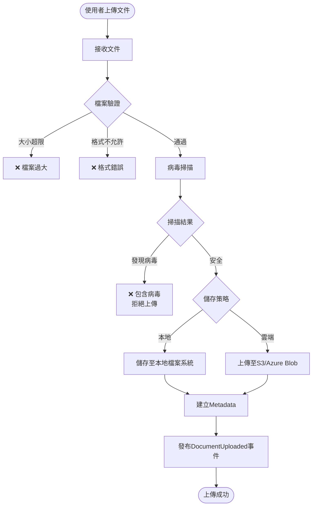
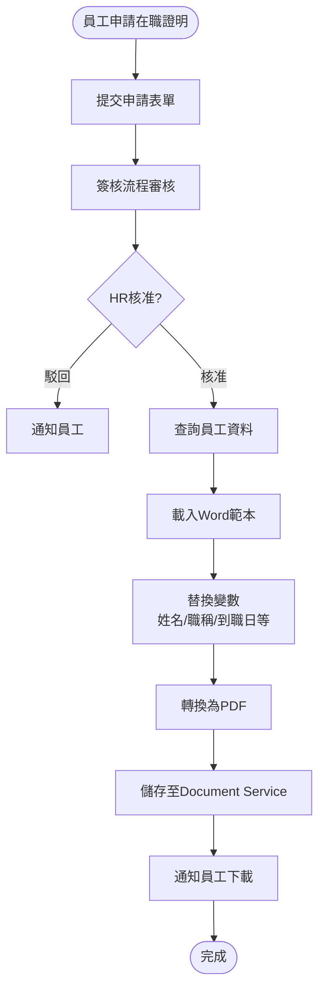
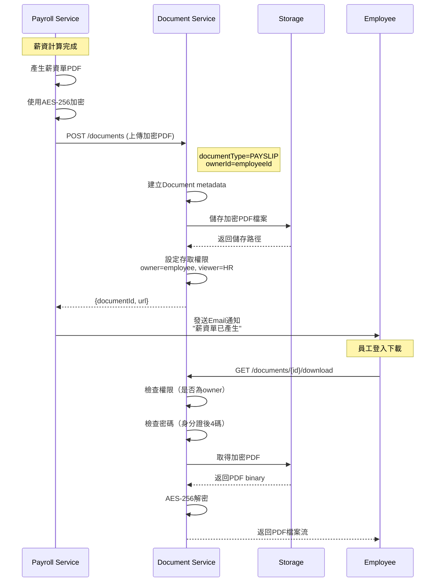

# 文件管理服務(Document Service) 需求分析書

**版本:** 1.0
**所屬領域:** 通用領域 (Generic Domain)
**導入階段:** 第二階段

---

## 1. 服務概述

### 1.1 核心職責
- 文件上傳/下載（員工合約、履歷、證照、薪資單等）
- 文件版本控管
- 文件範本管理（在職證明、薪資證明、扣繳憑單）
- 薪資單加密儲存與查閱
- 文件存取權限控制

---

## 2. 領域模型

### 2.1 聚合根

#### Document (文件)
```
Document {
  documentId: UUID
  documentType: DocumentType
  businessType: String (employee, payroll, recruitment...)
  businessId: UUID

  fileName: String
  fileSize: Long
  mimeType: String
  storagePath: String

  // 加密（薪資單）
  isEncrypted: Boolean
  encryptionKey: String (nullable)

  // 權限
  ownerId: UUID (FK to Employee)
  visibility: Visibility (PRIVATE, DEPARTMENT, PUBLIC)

  version: Integer

  uploadedBy: UUID (FK to Employee)
  uploadedAt: DateTime
}

enum DocumentType {
  EMPLOYEE_CONTRACT    // 員工合約
  EMPLOYEE_RESUME      // 履歷
  EMPLOYEE_PHOTO       // 照片
  CERTIFICATE          // 證照
  PAYSLIP              // 薪資單
  GENERATED_DOCUMENT   // 系統產生文件（在職證明等）
}

enum Visibility {
  PRIVATE      // 僅本人與HR可見
  DEPARTMENT   // 部門可見
  PUBLIC       // 全公司可見
}
```

#### DocumentTemplate (文件範本)
```
DocumentTemplate {
  templateId: UUID
  templateCode: String (unique)
  templateName: String
  templateType: TemplateType (EMPLOYMENT_CERT, SALARY_CERT...)

  templateContent: Text (Word/PDF範本，含變數)

  variables: List<TemplateVariable> (可用變數清單)

  isActive: Boolean
}

TemplateVariable {
  variableName: String (如 {{employeeName}})
  description: String
}
```

---

## 3. 核心API

### 3.1 文件上傳
```
POST /api/v1/documents/upload
Content-Type: multipart/form-data

Request:
  file: (binary)
  documentType: "EMPLOYEE_CONTRACT"
  businessType: "employee"
  businessId: "uuid"
  visibility: "PRIVATE"

Response 201:
{
  "documentId": "uuid",
  "fileName": "contract.pdf",
  "fileSize": 204800,
  "storagePath": "/storage/contracts/uuid.pdf",
  "uploadedAt": "2025-11-24T10:00:00Z"
}
```

### 3.2 文件下載
```
GET /api/v1/documents/{id}/download
Authorization: Bearer {token}

Response 200:
Content-Type: application/pdf
Content-Disposition: attachment; filename="contract.pdf"

(檔案串流)
```

**權限檢查:**
- 檢查使用者是否為ownerId
- 或具有 `document:read:all` 權限（HR）
- 薪資單需額外驗證密碼

### 3.3 產生文件（從範本）
```
POST /api/v1/documents/generate
Request:
{
  "templateCode": "EMPLOYMENT_CERTIFICATE",
  "variables": {
    "employeeName": "張三",
    "employeeNumber": "E001",
    "department": "研發部",
    "jobTitle": "前端工程師",
    "hireDate": "2025-01-01",
    "issueDate": "2025-11-24"
  }
}

Response 201:
{
  "documentId": "uuid",
  "fileName": "employment_certificate_E001.pdf",
  "downloadUrl": "/api/v1/documents/uuid/download"
}
```

**業務邏輯:**
1. 載入範本
2. 替換變數
3. 產生PDF
4. 儲存文件
5. 返回下載連結

---

## 4. 儲存策略

### 4.1 本地檔案系統
```
/storage
  /contracts      (合約)
  /resumes        (履歷)
  /payslips       (薪資單，加密)
  /certificates   (證照)
  /generated      (系統產生文件)
```

### 4.2 雲端儲存（可選）
- AWS S3
- Azure Blob Storage
- Google Cloud Storage

**建議:** 第一期本地儲存，第二期評估雲端

---

## 5. 安全性

### 5.1 薪資單加密
- AES-256加密
- 密碼保護（員工身分證後4碼）

### 5.2 病毒掃描
- 上傳前掃描（ClamAV）
- 拒絕可執行檔案(.exe, .sh, .bat)

### 5.3 檔案大小限制
- 單檔上限: 10MB
- 圖片: 2MB

---

**文件結束**


# PM審查補充

# 文件管理服務 - PM審查補充文件

**版本:** 1.1  
**日期:** 2025-12-03  
**補充說明:** 補充業務流程圖、循序圖、事件案例等

---

## 📋 補充內容

### 文件增強
- 業務流程圖：文件上傳與存取、在職證明產生流程
- 循序圖：薪資單加密儲存與下載
- 業務邏輯：文件分類與權限控管
- 業務案例：員工申請在職證明完整流程

---

## 1. 業務流程圖

### 1.1 文件上傳與病毒掃描流程


### 1.2 在職證明產生流程


---

## 2. 循序圖

### 2.1 薪資單加密儲存與下載


---

## 3. 文件分類與權限設計

### 3.1 文件類型定義
```
enum DocumentType {
  EMPLOYEE_CONTRACT      // 員工合約
  PAYSLIP               // 薪資單
  EMPLOYEE_PHOTO        // 員工照片
  RESUME                // 履歷
  CERTIFICATE           // 證照
  EMPLOYMENT_CERT       // 在職證明
  POLICY_DOCUMENT       // 政策文件
  TRAINING_MATERIAL     // 訓練教材
  PROJECT_DOCUMENT      // 專案文件
  OTHER                 // 其他
}
```

### 3.2 權限矩陣

| 文件類型 | 擁有者 | 可查看 | 可下載 | 可刪除 | 加密 | 密碼保護 |
|:---|:---|:---|:---|:---|:---|:---|
| EMPLOYEE_CONTRACT | 員工+HR | 員工+HR | 員工+HR | HR | ❌ | ❌ |
| PAYSLIP | 員工 | 員工+財務 | 員工+財務 | ❌ | ✅ AES-256 | ✅ 身分證後4碼 |
| EMPLOYEE_PHOTO | 員工 | 全公司 | 全公司 | 員工+HR | ❌ | ❌ |
| RESUME | 應徵者 | HR | HR | HR | ❌ | ❌ |
| EMPLOYMENT_CERT | 員工 | 員工 | 員工 | HR | ❌ | ❌ |
| POLICY_DOCUMENT | HR | 全公司 | 全公司 | HR | ❌ | ❌ |
| PROJECT_DOCUMENT | 專案成員 | 專案成員+PM | 專案成員 | PM | ❌ | ❌ |

### 3.3 權限檢查邏輯
```java
public boolean canAccess(UUID userId, Document document, AccessType accessType) {
    // 1. 檢查是否為擁有者
    if (document.getOwnerId().equals(userId)) {
        return true;
    }
    
    // 2. 檢查特定類型權限
    switch (document.getDocumentType()) {
        case PAYSLIP:
            // 薪資單：只有員工本人+財務可查看
            return isFinanceUser(userId);
            
        case EMPLOYEE_PHOTO:
            // 員工照片：全公司可查看
            return true;
            
        case POLICY_DOCUMENT:
            // 政策文件：全公司可查看
            return true;
            
        case PROJECT_DOCUMENT:
            // 專案文件：專案成員可查看
            return isProjectMember(userId, document.getRelatedEntityId());
            
        default:
            return false;
    }
}
```

---

## 4. 文件範本引擎

### 4.1 在職證明範本
```
檔名：employment_certificate_template.docx

內容：
┌─────────────────────────────────────┐
│          在 職 證 明 書                │
├─────────────────────────────────────┤
│                                     │
│  茲證明 {{employeeName}} 君，         │
│  身分證字號：{{nationalId}}            │
│                                     │
│  自 {{hireDate}} 起至今在本公司任職，  │
│  現任職務為 {{jobTitle}}。             │
│  所屬部門：{{department}}              │
│                                     │
│  特此證明。                            │
│                                     │
│  此證明書僅供 {{purpose}} 使用。       │
│                                     │
│  {{companyName}}                    │
│  人力資源部                            │
│  {{issueDate}}                      │
│                                     │
│               (公司大小章)             │
└─────────────────────────────────────┘
```

### 4.2 範本渲染引擎
```java
public byte[] generateEmploymentCertificate(UUID employeeId, String purpose) {
    // 1. 查詢員工資料
    Employee employee = employeeService.getEmployee(employeeId);
    
    // 2. 準備變數
    Map<String, String> variables = new HashMap<>();
    variables.put("employeeName", employee.getFullName());
    variables.put("nationalId", maskNationalId(employee.getNationalId()));
    variables.put("hireDate", formatDate(employee.getHireDate()));
    variables.put("jobTitle", employee.getJobTitle());
    variables.put("department", employee.getDepartmentName());
    variables.put("purpose", purpose);
    variables.put("companyName", "OO科技股份有限公司");
    variables.put("issueDate", formatDate(LocalDate.now()));
    
    // 3. 載入Word範本
    XWPFDocument template = loadTemplate("employment_certificate_template.docx");
    
    // 4. 替換變數
    replaceVariables(template, variables);
    
    // 5. 轉換為PDF
    byte[] pdfBytes = convertToPdf(template);
    
    return pdfBytes;
}
```

---

## 5. 儲存策略

### 5.1 本地儲存（Phase 1）
```
目錄結構：
/storage/
  /contracts/{employeeId}/
    contract_20251201.pdf
  /payslips/{year}/{month}/
    {employeeId}_202511.pdf
  /photos/
    {employeeId}.jpg
  /certificates/
    {employeeId}_{certType}_{yyyy}.pdf
  /policies/
    policy_vacation_v1.pdf
```

### 5.2 雲端儲存（Phase 2）
```
AWS S3 Bucket結構：
hr-documents-prod/
  contracts/
    {employeeId}/
  payslips/
    {year}/{month}/{employeeId}.pdf
  photos/
    {employeeId}.jpg
    
設定：
- 啟用版本控管
- 設定Lifecycle Policy（舊版本自動歸檔）
- 啟用Server-Side Encryption (SSE-S3)
```

---

## 6. 業務案例

### 業務案例 UC-DOC-001: 員工申請在職證明

**角色:** 員工王五

**需求:** 申請房貸需要在職證明

**完整流程:**

**Day 1 (12/1 週一):**
```
10:00 王五登入系統
- 進入「員工自助服務」→「證明文件申請」
- 選擇「在職證明」
- 填寫用途：「申請房屋貸款」
- 提交申請

系統處理：
- 建立CertificateRequest (status=PENDING)
- 啟動簽核流程
- 發送Email通知HR
```

**Day 1 (12/1 下午):**
```
14:00 HR審核
- HR查看申請：王五申請在職證明，用途：房貸
- 檢查：王五在職中 ✅、無異常紀錄 ✅
- 點擊「核准」

系統自動產生證明：
1. 查詢王五資料：
   - 姓名：王五
   - 身分證：A123456789
   - 到職日：2023-05-01
   - 職稱：後端工程師
   - 部門：研發部

2. 載入Word範本
3. 替換變數
4. 轉換為PDF
5. 儲存至Document Service
   - documentType: EMPLOYMENT_CERT
   - ownerId: 王五
   - filePath: /certificates/wangwu_employment_20251201.pdf

6. 發送Email通知王五
```

**Day 1 (12/1 晚上):**
```
20:00 王五收到Email
- 主旨：「在職證明已核發」
- 內容：「您申請的在職證明已核發，請登入系統下載。」

20:05 王五下載
- 登入系統 → 「證明文件申請」→「已核准」
- 點擊「下載」
- 系統檢查權限：王五是owner ✅
- 下載PDF檔案
- 檔名：在職證明_王五_20251201.pdf

王五打開PDF：
- 顯示完整資訊
- 有公司大小章（電子章）
- 可用於房貸申請
```

### 業務案例 UC-DOC-002: 薪資單加密下載

**情境:** 張三下載11月薪資單

**流程:**

**Step 1: 薪資單產生（後台）**
```
Payroll Service計算完成:
- 產生張三11月薪資單PDF
- 使用AES-256加密（密鑰：系統密鑰）
- 上傳至Document Service
- documentType: PAYSLIP
- encryptionMethod: AES-256
- passwordProtected: true
- password: 張三身分證後4碼
```

**Step 2: 張三嘗試下載**
```
12/5 張三登入系統:
- 進入「薪資查詢」→「薪資單下載」
- 看到11月薪資單：
  * 發薪月份：2025-11
  * 狀態：已核發
  * 下載次數：0

點擊「下載」:
- 系統提示：「請輸入密碼」
- 預設說明：「預設密碼為您的身分證後4碼」

張三輸入：6789
- 系統驗證：正確 ✅
- Document Service解密PDF
- 下載成功

PDF內容：
- 顯示完整薪資明細
- 總應發、總扣除、實發等
- 可列印
```

---

**補充文件結束**

**主文件:** 13_文件管理服務需求分析書.md  
**修訂日期:** 2025-12-03  
**修訂人:** SA
