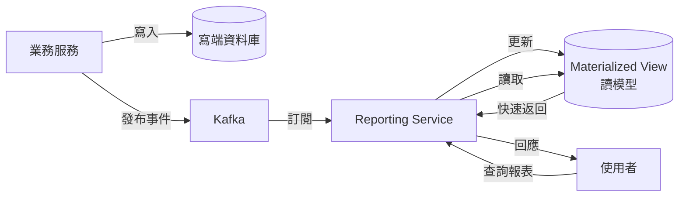
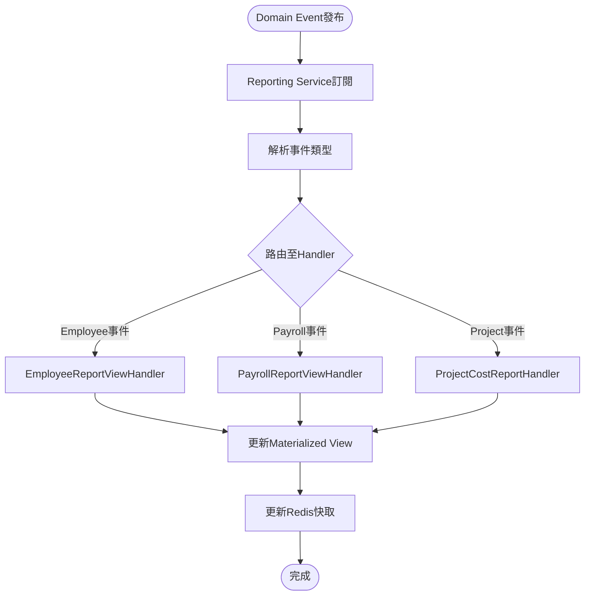

# 報表分析服務(Reporting & Analytics Service) 需求分析書

**版本:** 1.0
**所屬領域:** 通用領域 (Generic Domain)
**導入階段:** 第二階段

---

## 1. 服務概述

### 1.1 核心職責
- CQRS讀模型設計
- 人力資源報表（員工花名冊、差勤統計、離職率）
- 專案管理報表（成本分析、稼動率、獲利率）
- 財務薪資報表（薪資總表、人力成本）
- 客製化儀表板（拖拉式圖表、鑽取功能）
- 資料匯出（Excel/CSV/PDF）

---

## 2. CQRS架構設計

### 2.1 讀模型設計

**核心概念:** Reporting Service維護去正規化的ReadModel，加速查詢

```
寫端（各微服務） → 發布Domain Event
  ↓
Reporting Service訂閱Event → 更新ReadModel
  ↓
查詢API讀取ReadModel → 返回報表數據
```

###2.2 去正規化資料模型範例

#### EmployeeReportView (員工報表視圖)
```sql
CREATE MATERIALIZED VIEW employee_report_view AS
SELECT
  e.employee_id,
  e.employee_number,
  e.full_name,
  e.hire_date,
  e.employment_status,
  o.organization_name,
  d.department_name,
  m.full_name AS manager_name,
  s.monthly_salary,
  s.payroll_system
FROM employees e
JOIN organizations o ON e.organization_id = o.organization_id
JOIN departments d ON e.department_id = d.department_id
LEFT JOIN employees m ON e.manager_id = m.employee_id
LEFT JOIN salary_structures s ON e.employee_id = s.employee_id AND s.is_active = TRUE;
```

#### ProjectCostReportView (專案成本報表視圖)
```sql
CREATE TABLE project_cost_snapshots (
  snapshot_id UUID PRIMARY KEY,
  project_id UUID,
  month DATE,

  total_hours DECIMAL,
  total_cost DECIMAL,
  budget_amount DECIMAL,
  budget_utilization DECIMAL,

  employee_costs JSONB, -- [{employeeId, hours, cost}]

  updated_at TIMESTAMP
);
```

**更新機制:** 訂閱 `TimesheetApproved`, `PayrollRunCompleted` 事件，定期重算

---

## 3. 核心報表API

### 3.1 人力資源報表

#### 員工花名冊
```
GET /api/v1/reports/hr/employee-roster
?organizationId={id}&status=ACTIVE

Response 200:
[
  {
    "employeeNumber": "E001",
    "fullName": "張三",
    "department": "研發部",
    "jobTitle": "前端工程師",
    "hireDate": "2025-01-01",
    "serviceYears": 0.9
  }
]
```

#### 差勤統計報表
```
GET /api/v1/reports/hr/attendance-summary
?organizationId={id}&month=2025-11

Response 200:
{
  "month": "2025-11",
  "totalEmployees": 150,
  "averageWorkingHours": 168,
  "totalOvertimeHours": 1200,
  "totalLeaveHours": 500,
  "byDepartment": [...]
}
```

### 3.2 專案管理報表

#### 專案成本分析
```
GET /api/v1/reports/project/cost-analysis
?projectId={id}&startMonth=2025-01&endMonth=2025-11

Response 200:
{
  "projectId": "uuid",
  "projectName": "XX銀行專案",
  "period": "2025-01 ~ 2025-11",
  "budget": {
    "budgetAmount": 10000000,
    "budgetHours": null
  },
  "actual": {
    "totalHours": 5000,
    "totalCost": 3500000,
    "costUtilization": "35%"
  },
  "monthlyTrend": [
    {
      "month": "2025-01",
      "hours": 400,
      "cost": 280000
    }
  ],
  "profitMargin": "65%"
}
```

#### 稼動率分析
```
GET /api/v1/reports/project/utilization-rate
?departmentId={id}&month=2025-11

Response 200:
{
  "department": "研發部",
  "month": "2025-11",
  "totalEmployees": 50,
  "totalAvailableHours": 8400,
  "billableHours": 6720,
  "utilizationRate": "80%",
  "byEmployee": [...]
}
```

計算公式：
```
稼動率 = 計費工時 / 總工時 × 100%
計費工時 = 專案工時（排除內部專案、訓練等）
```

### 3.3 財務薪資報表

#### 人力成本分析
```
GET /api/v1/reports/finance/labor-cost
?organizationId={id}&year=2025

Response 200:
{
  "year": 2025,
  "totalLaborCost": 72000000,
  "byMonth": [
    {
      "month": "2025-01",
      "grossWage": 6000000,
      "laborInsurance": 500000,
      "healthInsurance": 300000,
      "pension": 360000,
      "totalCost": 7160000
    }
  ],
  "byDepartment": [...]
}
```

---

## 4. 客製化儀表板

### 4.1 Dashboard配置API

#### 建立儀表板
```
POST /api/v1/dashboards
Request:
{
  "dashboardName": "高階主管儀表板",
  "widgets": [
    {
      "widgetType": "KPI_CARD",
      "title": "在職人數",
      "dataSource": "employee_count",
      "position": {"x": 0, "y": 0, "w": 3, "h": 2}
    },
    {
      "widgetType": "LINE_CHART",
      "title": "月度人力成本趨勢",
      "dataSource": "monthly_labor_cost",
      "position": {"x": 3, "y": 0, "w": 9, "h": 4}
    }
  ]
}

Response 201:
{
  "dashboardId": "uuid"
}
```

### 4.2 關鍵指標

| 指標 | 計算方式 | 數據來源 |
|:---|:---|:---|
| 在職人數 | COUNT(status=ACTIVE) | Organization |
| 離職率 | 離職人數/期初人數×100% | Organization |
| 平均薪資 | SUM(netWage)/COUNT | Payroll |
| 人均產值 | 專案收入/員工數 | Project + Payroll |
| 專案獲利率 | (收入-成本)/收入 | Project + Timesheet + Payroll |

---

## 5. 資料匯出

### 5.1 Excel匯出
```
POST /api/v1/reports/export/excel
Request:
{
  "reportType": "EMPLOYEE_ROSTER",
  "filters": {
    "organizationId": "uuid",
    "status": "ACTIVE"
  }
}

Response 200:
{
  "fileUrl": "/downloads/employee-roster-202511.xlsx",
  "expiresAt": "2025-11-25T10:00:00Z"
}
```

### 5.2 政府申報格式
```
POST /api/v1/reports/export/government
Request:
{
  "formatType": "LABOR_BUREAU_ENROLLMENT",
  "month": "2025-11"
}

Response 200:
{
  "fileUrl": "/downloads/labor-enrollment-202511.xml"
}
```

---

## 6. 技術選型

| 元件 | 選型 |
|:---|:---|
| 讀模型資料庫 | PostgreSQL Materialized View / Elasticsearch |
| 圖表庫 | Apache ECharts (前端) |
| Excel產生 | Apache POI |
| PDF產生 | iText |
| BI工具（可選） | Apache Superset / Metabase |

---

## 7. 效能優化

### 7.1 Materialized View定期刷新
```sql
REFRESH MATERIALIZED VIEW CONCURRENTLY employee_report_view;
```

執行頻率: 每小時

### 7.2 預計算快照
- 專案成本快照：每日凌晨計算前一日
- 部門人力成本快照：每月結算後計算

---

**文件結束**


# PM審查補充

# 報表分析服務 - PM審查補充文件

**版本:** 1.1  
**日期:** 2025-12-03  
**補充說明:** 補充業務流程圖、循序圖、事件案例等

---

## 📋 補充內容

### 文件增強
- 業務流程圖：CQRS讀模型更新流程
- 循序圖：報表查詢與ReadModel互動
- 業務邏輯：去正規化視圖設計
- 業務案例：高階主管儀表板實例

---

## 1. CQRS架構設計

### 1.1 讀模型更新流程


### 1.2 事件驅動ReadModel更新


---

## 2. 去正規化視圖設計

### 2.1 員工報表視圖
```sql
CREATE MATERIALIZED VIEW employee_report_view AS
SELECT 
  e.employee_id,
  e.employee_number,
  e.full_name,
  e.national_id_masked,
  e.email,
  e.hire_date,
  e.employment_status,
  e.employment_type,
  
  -- 組織資訊（去正規化）
  o.organization_name,
  d.department_name,
  d.department_path,  -- 完整部門路徑
  
  -- 主管資訊
  m.full_name AS manager_name,
  m.email AS manager_email,
  
  -- 薪資資訊
  s.payroll_system,
  s.monthly_salary,
  
  -- 計算欄位
  EXTRACT(YEAR FROM AGE(CURRENT_DATE, e.hire_date)) AS service_years,
  CASE 
    WHEN e.employment_status = 'ACTIVE' THEN 1
    ELSE 0
  END AS is_active_flag,
  
  -- 更新時間
  e.updated_at AS last_updated
  
FROM employees e
LEFT JOIN organizations o ON e.organization_id = o.organization_id
LEFT JOIN departments d ON e.department_id = d.department_id
LEFT JOIN employees m ON e.manager_id = m.employee_id
LEFT JOIN salary_structures s ON e.employee_id = s.employee_id AND s.is_active = TRUE;

-- 建立索引加速查詢
CREATE INDEX idx_emp_report_dept ON employee_report_view(department_name);
CREATE INDEX idx_emp_report_status ON employee_report_view(employment_status);
CREATE INDEX idx_emp_report_hire ON employee_report_view(hire_date);
```

### 2.2 專案成本快照表
```sql
CREATE TABLE project_cost_snapshots (
    snapshot_id UUID PRIMARY KEY DEFAULT gen_random_uuid(),
    project_id UUID NOT NULL,
    snapshot_date DATE NOT NULL,
    
    -- 專案基本資訊
    project_name VARCHAR(255),
    project_code VARCHAR(50),
    customer_name VARCHAR(255),
    
    -- 預算資訊
    budget_type VARCHAR(20),
    budget_amount DECIMAL(15,2),
    budget_hours DECIMAL(10,2),
    
    -- 累計成本（截至snapshot_date）
    total_hours DECIMAL(10,2),
    total_cost DECIMAL(15,2),
    
    -- 使用率
    cost_utilization_rate DECIMAL(5,4),  -- 成本使用率
    hour_utilization_rate DECIMAL(5,4),  -- 工時使用率
    
    -- 成員成本明細（JSONB）
    member_costs JSONB,
    /* 範例：
    [
      {
        "employeeId": "uuid",
        "employeeName": "張三",
        "hours": 120,
        "hourlyRate": 250,
        "cost": 30000
      }
    ]
    */
    
    -- 月度趨勢（JSONB）
    monthly_trend JSONB,
    /* 範例：
    {
      "2025-01": {"hours": 100, "cost": 25000},
      "2025-02": {"hours": 120, "cost": 30000}
    }
    */
    
    created_at TIMESTAMP DEFAULT CURRENT_TIMESTAMP,
    
    UNIQUE(project_id, snapshot_date)
);

-- 每日Job更新昨日快照
CREATE OR REPLACE FUNCTION refresh_project_cost_snapshot()
RETURNS void AS $$
DECLARE
  target_date DATE := CURRENT_DATE - INTERVAL '1 day';
BEGIN
  -- 為所有進行中專案建立/更新快照
  INSERT INTO project_cost_snapshots (
    project_id, snapshot_date, project_name,
    total_hours, total_cost, member_costs
  )
  SELECT 
    p.project_id,
    target_date,
    p.project_name,
    -- 計算累計工時與成本...
  FROM projects p
  WHERE p.status = 'ACTIVE'
  ON CONFLICT (project_id, snapshot_date)
  DO UPDATE SET
    total_hours = EXCLUDED.total_hours,
    total_cost = EXCLUDED.total_cost;
END;
$$ LANGUAGE plpgsql;
```

---

## 3. 關鍵報表API

### 3.1 人力盤點報表
```
GET /api/v1/reports/hr/headcount
?asOfDate=2025-12-03&organizationId={id}

Response:
{
  "asOfDate": "2025-12-03",
  "organizationName": "OO科技股份有限公司",
  
  "summary": {
    "totalEmployees": 150,
    "activeEmployees": 145,
    "onLeaveEmployees": 3,
    "terminatedThisMonth": 2,
    "newHiresThisMonth": 5
  },
  
  "byDepartment": [
    {
      "departmentName": "研發部",
      "headcount": 50,
      "percentage": "33.3%",
      "avgSalary": 60000,
      "avgServiceYears": 3.5
    },
    {
      "departmentName": "業務部",
      "headcount": 30,
      "percentage": "20%",
      "avgSalary": 55000,
      "avgServiceYears": 4.2
    }
  ],
  
  "byEmploymentType": {
    "FULL_TIME": 140,
    "CONTRACT": 8,
    "INTERN": 2
  },
  
  "turnoverRate": {
    "monthly": "1.33%",
    "quarterly": "4.0%",
    "yearly": "15%"
  }
}
```

### 3.2 部門人力成本分析
```
GET /api/v1/reports/finance/labor-cost-by-department
?year=2025&organizationId={id}

Response:
{
  "year": 2025,
  "organizationName": "OO科技",
  "totalLaborCost": 72000000,
  
  "departments": [
    {
      "departmentName": "研發部",
      "headcount": 50,
      "totalSalary": 36000000,
      "totalInsurance": 5400000,
      "totalCost": 41400000,
      "percentage": "57.5%",
      "avgCostPerEmployee": 828000
    },
    {
      "departmentName": "業務部",
      "headcount": 30,
      "totalSalary": 18000000,
      "totalInsurance": 2700000,
      "totalCost": 20700000,
      "percentage": "28.75%",
      "avgCostPerEmployee": 690000
    }
  ],
  
  "monthlyTrend": [
    {
      "month": "2025-01",
      "totalCost": 6000000,
      "salaryPortion": 5000000,
      "insurancePortion": 1000000
    }
  ]
}
```

---

## 4. 客製化儀表板

### 4.1 高階主管儀表板配置
```json
{
  "dashboardId": "exec-dashboard-001",
  "dashboardName": "CEO Dashboard",
  "owner": "uuid-ceo",
  "isPublic": false,
  
  "layout": {
    "columns": 12,
    "rowHeight": 60
  },
  
  "widgets": [
    {
      "widgetId": "w1",
      "type": "KPI_CARD",
      "title": "在職人數",
      "dataSource": "employee_count",
      "refreshInterval": 3600,
      "position": {"x": 0, "y": 0, "w": 3, "h": 2},
      "style": {
        "icon": "users",
        "color": "#0078D7"
      }
    },
    {
      "widgetId": "w2",
      "type": "KPI_CARD",
      "title": "本月離職率",
      "dataSource": "monthly_turnover_rate",
      "refreshInterval": 3600,
      "position": {"x": 3, "y": 0, "w": 3, "h": 2},
      "threshold": {
        "warning": 2.0,
        "danger": 5.0
      }
    },
    {
      "widgetId": "w3",
      "type": "LINE_CHART",
      "title": "月度人力成本趨勢",
      "dataSource": "monthly_labor_cost",
      "refreshInterval": 86400,
      "position": {"x": 0, "y": 2, "w": 6, "h": 4},
      "chartConfig": {
        "xAxis": "month",
        "yAxis": "cost",
        "period": "last_12_months"
      }
    },
    {
      "widgetId": "w4",
      "type": "PIE_CHART",
      "title": "部門人數分布",
      "dataSource": "headcount_by_department",
      "refreshInterval": 3600,
      "position": {"x": 6, "y": 2, "w": 3, "h": 4}
    },
    {
      "widgetId": "w5",
      "type": "TABLE",
      "title": "Top 10專案成本",
      "dataSource": "top_projects_by_cost",
      "refreshInterval": 3600,
      "position": {"x": 0, "y": 6, "w": 9, "h": 4},
      "columns": [
        {"field": "projectName", "label": "專案名稱"},
        {"field": "customer", "label": "客戶"},
        {"field": "cost", "label": "成本", "format": "currency"},
        {"field": "budget", "label": "預算", "format": "currency"},
        {"field": "utilizationRate", "label": "使用率", "format": "percent"}
      ]
    }
  ]
}
```

---

## 5. 業務案例

### 業務案例 UC-RPT-001: CEO查看經營儀表板

**情境:** CEO每日早上查看經營數據

**8:30 AM - 登入系統**
```
CEO登入 → 進入「經營儀表板」

即時顯示（快取數據，<100ms載入）:

┌─────────────────────────────────────┐
│  CEO經營儀表板                        │
├─────────────────────────────────────┤
│                                     │
│  ┌─────────┐  ┌─────────┐          │
│  │在職人數   │  │離職率    │          │
│  │  150人   │  │  1.33%  │          │
│  │  ↑+5    │  │  ↓正常   │          │
│  └─────────┘  └─────────┘          │
│                                     │
│  ┌──────────────────────────────┐  │
│  │ 月度人力成本趨勢               │  │
│  │ [折線圖顯示12個月趨勢]         │  │
│  └──────────────────────────────┘  │
│                                     │
│  ┌────────────┐  ┌────────────┐    │
│  │部門人數分布  │  │專案成本TOP10│    │
│  │[圓餅圖]     │  │[表格]       │    │
│  └────────────┘  └────────────┘    │
└─────────────────────────────────────┘
```

**關鍵指標解讀:**
```
在職人數：150人
- 較上月+5人
- 趨勢：穩定成長 ✅

離職率：1.33%
- 行業平均：2-3%
- 評價：優於行業水準 ✅

人力成本：
- 本月：600萬
- 年度累計：6,600萬
- 預算控制：良好 ✅

部門分布：
- 研發部：33.3% (50人)
- 業務部：20% (30人)
- 其他：46.7%

專案成本警示：
- XX銀行專案：成本使用率85% ⚠️
- 需關注成本控管
```

**8:35 AM - 鑽取分析**
```
CEO點擊「XX銀行專案」:
→ 跳轉至專案成本詳細分析頁面

顯示：
- 月度成本趨勢圖
- 成員工時分布
- 預算vs實際對比
- 獲利率預估：15%（原預期25%）

CEO判斷：
- 需與PM討論成本超支原因
- 評估是否需追加預算或調整範圍
```

---

**補充文件結束**

**主文件:** 14_報表分析服務需求分析書.md  
**修訂日期:** 2025-12-03  
**修訂人:** SA
