# 薪資管理服務系統設計書

**版本:** 1.0
**日期:** 2025-12-07
**Domain代號:** 04 (PAY)
**目標:** 提供工程師完整的系統實作規格，供PM建立工項清單

---

## 目錄

1. [服務概述](#1-服務概述)
2. [UI設計](#2-ui設計)
3. [UX流程設計](#3-ux流程設計)
4. [畫面事件說明](#4-畫面事件說明)
5. [Data Flow設計](#5-data-flow設計)
6. [資料庫設計](#6-資料庫設計)
7. [Domain設計](#7-domain設計)
8. [領域事件設計](#8-領域事件設計)
9. [API設計](#9-api設計)
10. [工項清單摘要](#10-工項清單摘要)

---

## 1. 服務概述

### 1.1 服務定位
薪資管理服務是HR系統的**核心業務服務**，負責複雜的薪資計算邏輯。這是整個HR系統中計算最複雜的服務，必須整合差勤、保險、工時等多方數據，確保薪資計算的準確性與合規性。

### 1.2 核心功能
- ✅ **薪資結構管理:** 支援時薪制/月薪制、多領薪週期（日/週/半月/月領）
- ✅ **薪資項目設定:** 彈性設定20+種薪資項目（底薪、津貼、獎金、扣項）
- ✅ **自動化薪資運算:** 整合差勤、保險、工時數據，自動計算薪資
- ✅ **加班費計算:** 依勞基法計算平日/休息日/假日加班費
- ✅ **所得稅扣繳:** 自動計算所得稅、二代健保補充保費
- ✅ **薪資單管理:** 產生加密電子薪資單、Email發送
- ✅ **銀行薪轉:** 產生銀行薪轉媒體檔
- ✅ **專案成本核算:** 整合工時數據，計算專案人力成本（第二階段整合）

> [!IMPORTANT]
> **法規參數配置與異動稽核**
> 本服務涉及勞基法、健保等法規計算，費率與級距需可依年度配置。
> 詳細設計請參考: [法規參數管理與異動稽核設計規格書](logic_spec/regulatory_parameters_and_audit.md)
>
> 關鍵要點:
> - 法規生效日 = 薪資月份 (非發薪月份)
> - 例: 2026/1/1生效 → 適用2026年1月薪資 (2月發放)
> - 所有薪資調整需留有稽核記錄 (salary_change_history表)

### 1.3 技術架構
- **前端:** ReactJS + Redux + Ant Design
- **後端:** Spring Boot 3.1.x + MyBatis
- **資料庫:** PostgreSQL 15.x
- **事件匯流排:** Kafka
- **排程任務:** Quartz Scheduler
- **PDF生成:** iText / OpenPDF

### 1.4 服務邊界

| 屬於本服務 | 不屬於本服務 |
|:---|:---|
| 薪資結構定義 | 差勤資料 (Attendance Service提供) |
| 薪資計算引擎 | 保險費用計算 (Insurance Service提供) |
| 薪資單產生 | 工時資料 (Timesheet Service提供) |
| 薪資歷史記錄 | 員工基本資料 (Organization Service) |
| 銀行薪轉檔案 | |

### 1.5 Saga模式整合

薪資計算需整合多個服務數據，採用Saga模式：

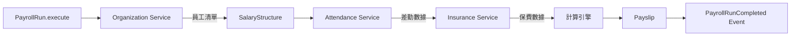

---

## 2. UI設計

### 2.1 頁面清單

| 頁面代碼 | 頁面名稱 | 路由 | 權限要求 |
|:---|:---|:---|:---:|
| `HR04-P01` | 薪資結構設定頁面 | `/admin/payroll/structures` | payroll:structure:manage |
| `HR04-P02` | 薪資項目設定頁面 | `/admin/payroll/items` | payroll:item:manage |
| `HR04-P03` | 薪資計算批次頁面 | `/admin/payroll/runs` | payroll:run:manage |
| `HR04-P04` | 薪資計算明細頁面 | `/admin/payroll/runs/:id` | payroll:run:read |
| `HR04-P05` | 薪資核准頁面 | `/admin/payroll/approval` | payroll:run:approve |
| `HR04-P06` | 我的薪資單頁面 (ESS) | `/profile/payslips` | - |
| `HR04-P07` | 員工薪資查詢頁面 | `/admin/payroll/employees` | payroll:payslip:read:all |
| `HR04-P08` | 薪轉檔案產生頁面 | `/admin/payroll/bank-transfer` | payroll:bank:manage |
| `HR04-M01` | 薪資結構編輯對話框 | (Modal) | payroll:structure:manage |
| `HR04-M02` | 薪資項目編輯對話框 | (Modal) | payroll:item:manage |

### 2.2 UI線稿 (Mermaid)

#### 2.2.1 薪資結構設定頁面 (HR04-P01)

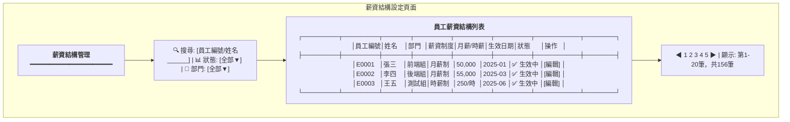

#### 2.2.2 薪資計算批次頁面 (HR04-P03)

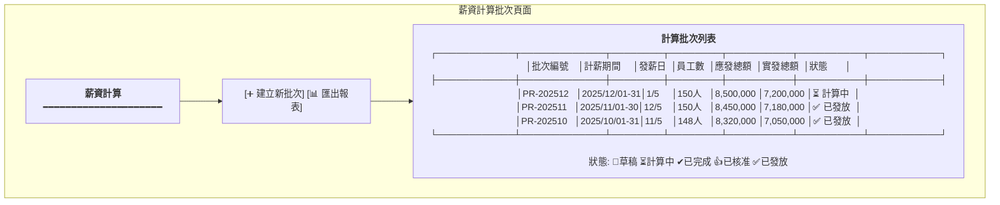

#### 2.2.3 薪資計算明細頁面 (HR04-P04)

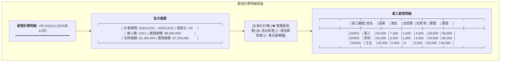

#### 2.2.4 我的薪資單頁面 - ESS (HR04-P06)

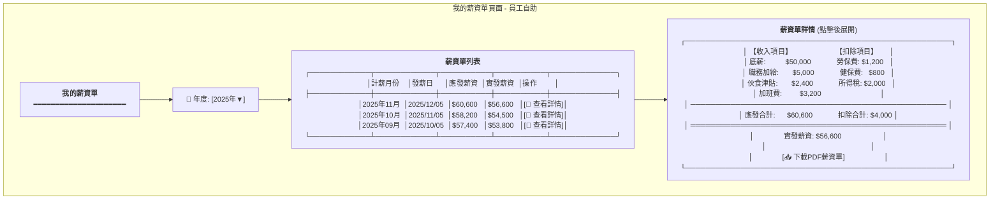

---

## 3. UX流程設計

### 3.1 薪資計算執行流程 (Saga Pattern)

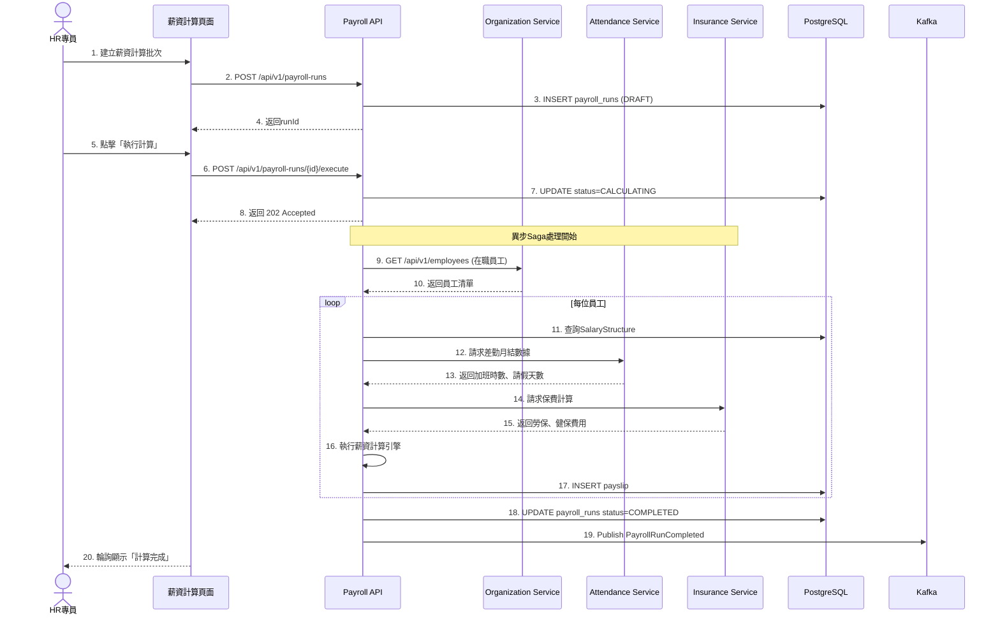

### 3.2 薪資核准與發放流程

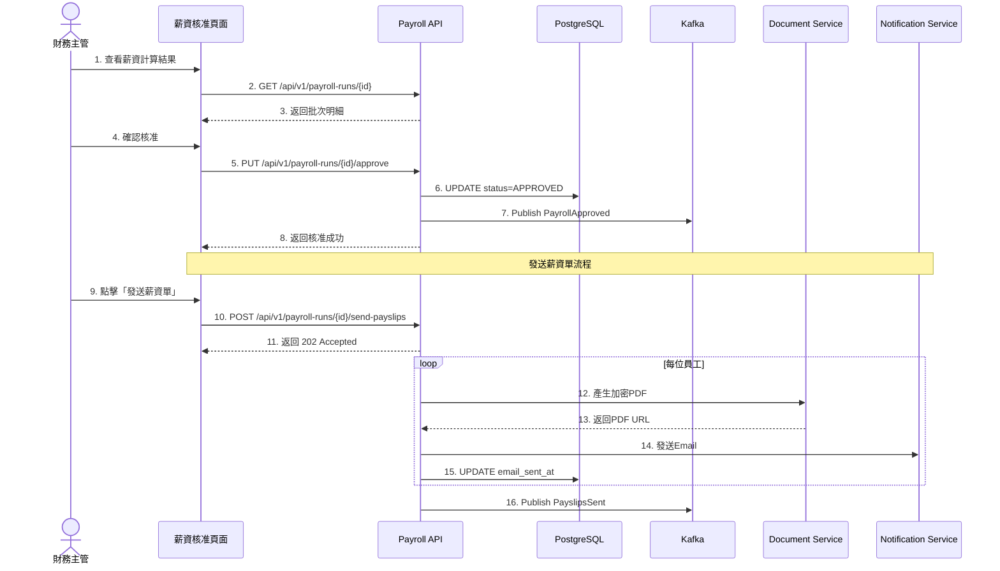

### 3.3 加班費計算邏輯流程

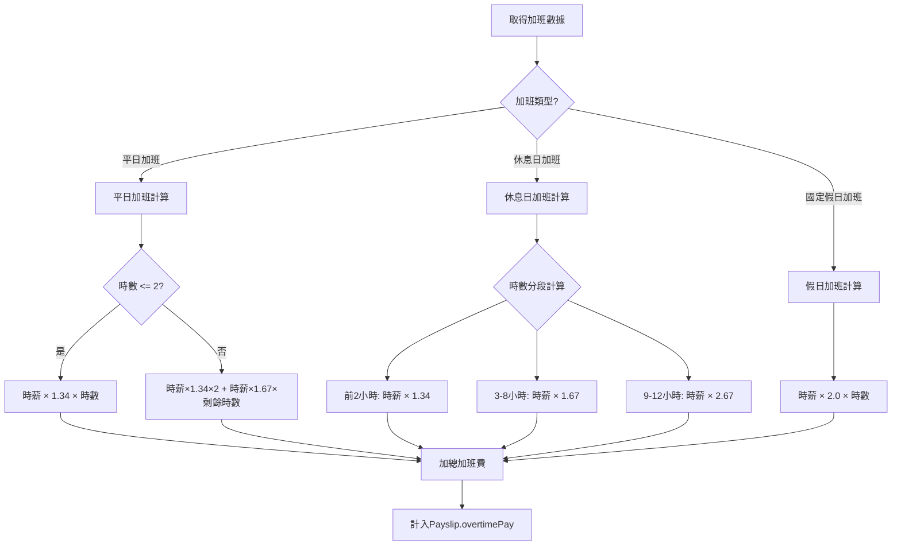

---

## 4. 畫面事件說明

### 4.1 薪資結構設定頁面事件 (HR04-P01)

| 事件ID | 觸發元素 | 事件類型 | 事件處理 | 後端API |
|:---|:---|:---|:---|:---|
| `E-PAY-01` | 搜尋框 | onChange (debounce 500ms) | 重新查詢員工薪資結構 | GET /api/v1/salary-structures |
| `E-PAY-02` | 編輯按鈕 | onClick | 開啟薪資結構編輯對話框 | GET /api/v1/salary-structures/{id} |
| `E-PAY-03` | 儲存按鈕 | onClick | 儲存薪資結構 | PUT /api/v1/salary-structures/{id} |
| `E-PAY-04` | 新增項目按鈕 | onClick | 新增薪資項目列 | - |
| `E-PAY-05` | 刪除項目按鈕 | onClick | 移除薪資項目列 | - |

### 4.2 薪資計算批次頁面事件 (HR04-P03)

| 事件ID | 觸發元素 | 事件類型 | 事件處理 | 後端API |
|:---|:---|:---|:---|:---|
| `E-RUN-01` | 建立新批次按鈕 | onClick | 開啟建立批次對話框 | - |
| `E-RUN-02` | 確認建立按鈕 | onClick | 建立薪資計算批次 | POST /api/v1/payroll-runs |
| `E-RUN-03` | 批次列點擊 | onClick | 跳轉至批次明細頁 | - |
| `E-RUN-04` | 執行計算按鈕 | onClick | 執行薪資計算 | POST /api/v1/payroll-runs/{id}/execute |
| `E-RUN-05` | 送出核准按鈕 | onClick | 送交核准 | PUT /api/v1/payroll-runs/{id}/submit |
| `E-RUN-06` | 核准按鈕 | onClick | 核准薪資 | PUT /api/v1/payroll-runs/{id}/approve |
| `E-RUN-07` | 發送薪資單按鈕 | onClick | 發送所有薪資單 | POST /api/v1/payroll-runs/{id}/send-payslips |
| `E-RUN-08` | 產生薪轉檔按鈕 | onClick | 產生銀行媒體檔 | POST /api/v1/payroll-runs/{id}/bank-transfer-file |

### 4.3 我的薪資單頁面事件 (HR04-P06)

| 事件ID | 觸發元素 | 事件類型 | 事件處理 | 後端API |
|:---|:---|:---|:---|:---|
| `E-SLIP-01` | 年度選擇器 | onChange | 重新載入該年度薪資單 | GET /api/v1/payslips?year={year} |
| `E-SLIP-02` | 查看詳情按鈕 | onClick | 展開薪資單詳情 | GET /api/v1/payslips/{id} |
| `E-SLIP-03` | 下載PDF按鈕 | onClick | 下載加密PDF | GET /api/v1/payslips/{id}/pdf |

**E-SLIP-03 詳細流程:**
```typescript
const handleDownloadPDF = async (payslipId: string) => {
  try {
    // 1. 請求PDF (需密碼驗證)
    const response = await payrollService.downloadPayslipPDF(payslipId);

    // 2. 建立Blob並下載
    const blob = new Blob([response.data], { type: 'application/pdf' });
    const url = window.URL.createObjectURL(blob);

    const link = document.createElement('a');
    link.href = url;
    link.download = `薪資單_${payslipId}.pdf`;
    link.click();

    // 3. 提示密碼
    message.info('PDF密碼為您的身分證字號後4碼');

  } catch (error) {
    message.error('下載失敗，請稍後重試');
  }
};
```

---

*(文件持續，下一部分包含Data Flow設計、資料庫設計、Domain設計、完整API規格等)*


# Continued: 04_薪資管理服務系統設計書_part2.md

## 5. Data Flow設計

### 5.1 前端狀態管理 (Redux)

#### 5.1.1 State結構

```typescript
interface PayrollState {
  // 薪資結構
  salaryStructures: {
    list: SalaryStructure[];
    current: SalaryStructure | null;
    loading: boolean;
  };

  // 薪資計算批次
  payrollRuns: {
    list: PayrollRun[];
    current: PayrollRunDetail | null;
    status: PayrollRunStatus;
    loading: boolean;
    calculating: boolean;
  };

  // 薪資單明細
  payslips: {
    list: Payslip[];
    currentBatchPayslips: Payslip[];
    myPayslips: Payslip[];  // ESS用
    selectedPayslip: PayslipDetail | null;
    loading: boolean;
  };

  // 薪資項目設定
  payrollItems: {
    earnings: PayrollItem[];
    deductions: PayrollItem[];
    loading: boolean;
  };
}

interface PayrollRunDetail {
  runId: string;
  status: PayrollRunStatus;
  payPeriod: {
    start: string;
    end: string;
  };
  payDate: string;
  statistics: {
    totalEmployees: number;
    processedEmployees: number;
    totalGrossAmount: number;
    totalNetAmount: number;
    totalDeductions: number;
  };
  payslips: PayslipSummary[];
}

interface PayslipDetail {
  payslipId: string;
  employeeId: string;
  employeeName: string;
  payPeriod: string;
  payDate: string;

  // 收入項
  baseSalary: number;
  earnings: {
    itemName: string;
    amount: number;
  }[];
  totalEarnings: number;

  // 加班費
  overtimePay: {
    weekdayHours: number;
    weekdayPay: number;
    restDayHours: number;
    restDayPay: number;
    holidayHours: number;
    holidayPay: number;
    total: number;
  };

  // 扣除項
  deductions: {
    itemName: string;
    amount: number;
  }[];
  laborInsurance: number;
  healthInsurance: number;
  pensionSelfContribution: number;
  incomeTax: number;
  supplementaryPremium: number;
  totalDeductions: number;

  // 結果
  grossWage: number;
  netWage: number;

  pdfUrl: string;
}
```

#### 5.1.2 Redux Actions

```typescript
// 薪資計算批次Actions
export const payrollRunActions = {
  fetchPayrollRuns: createAsyncThunk(
    'payroll/fetchRuns',
    async (params: { year?: number }) => {
      const response = await payrollService.getPayrollRuns(params);
      return response;
    }
  ),

  createPayrollRun: createAsyncThunk(
    'payroll/createRun',
    async (data: CreatePayrollRunRequest) => {
      const response = await payrollService.createPayrollRun(data);
      return response;
    }
  ),

  executePayrollRun: createAsyncThunk(
    'payroll/executeRun',
    async (runId: string) => {
      const response = await payrollService.executePayrollRun(runId);
      return response;
    }
  ),

  approvePayrollRun: createAsyncThunk(
    'payroll/approveRun',
    async (runId: string) => {
      const response = await payrollService.approvePayrollRun(runId);
      return response;
    }
  ),

  sendPayslips: createAsyncThunk(
    'payroll/sendPayslips',
    async (runId: string, { dispatch }) => {
      const response = await payrollService.sendPayslips(runId);
      // 開始輪詢狀態
      dispatch(pollPayslipSendStatus(runId));
      return response;
    }
  ),
};

// 薪資單Actions
export const payslipActions = {
  fetchMyPayslips: createAsyncThunk(
    'payslip/fetchMine',
    async (year: number) => {
      const response = await payslipService.getMyPayslips(year);
      return response;
    }
  ),

  fetchPayslipDetail: createAsyncThunk(
    'payslip/fetchDetail',
    async (payslipId: string) => {
      const response = await payslipService.getPayslipDetail(payslipId);
      return response;
    }
  ),

  downloadPayslipPDF: createAsyncThunk(
    'payslip/downloadPDF',
    async (payslipId: string) => {
      const response = await payslipService.downloadPDF(payslipId);
      return response;
    }
  ),
};
```

### 5.2 前後端資料流

#### 5.2.1 薪資計算Saga資料流

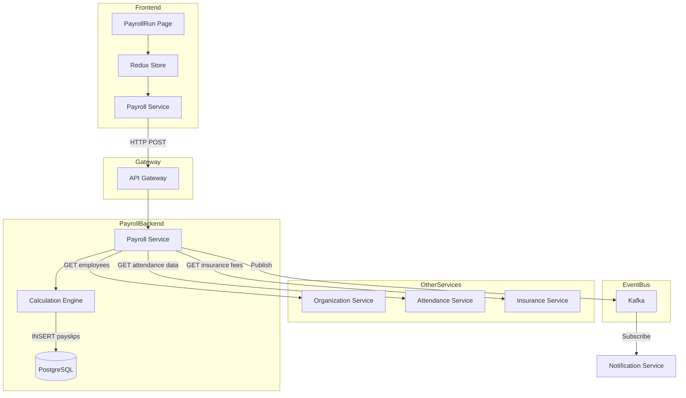

#### 5.2.2 薪資計算引擎處理流程

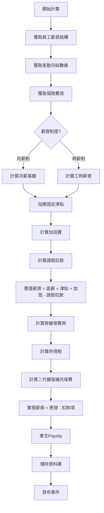

### 5.3 服務間資料流

#### 5.3.1 薪資計算完成事件流

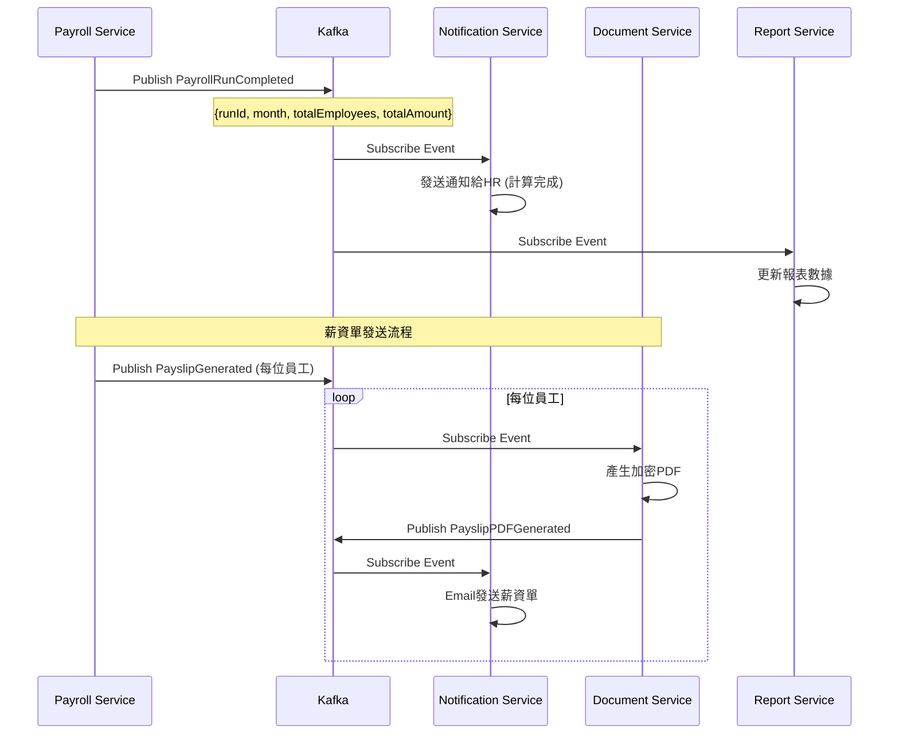

---

## 6. 資料庫設計

### 6.1 ER Diagram

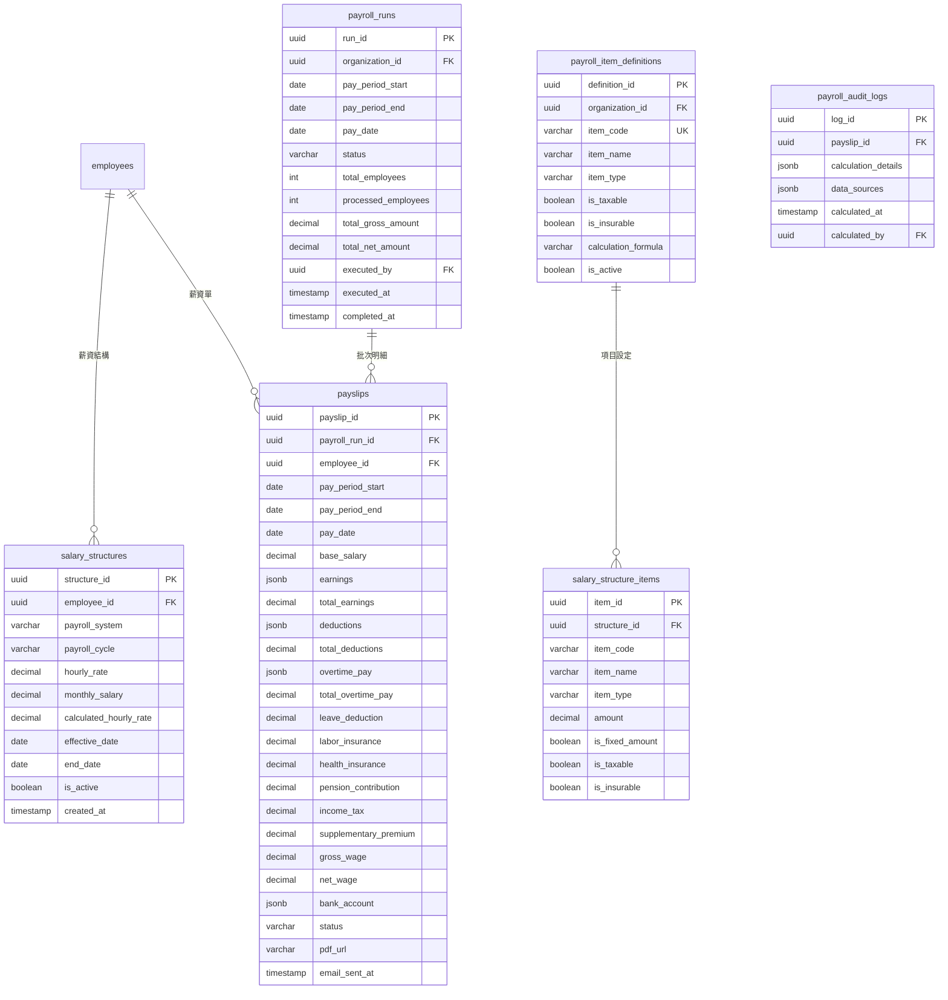

### 6.2 DDL Script

```sql
-- 薪資項目定義表 (組織級設定)
CREATE TABLE payroll_item_definitions (
    definition_id UUID PRIMARY KEY DEFAULT gen_random_uuid(),
    organization_id UUID NOT NULL,
    item_code VARCHAR(50) NOT NULL,
    item_name VARCHAR(100) NOT NULL,
    item_type VARCHAR(20) NOT NULL CHECK (item_type IN ('EARNING', 'DEDUCTION')),
    is_taxable BOOLEAN DEFAULT TRUE,
    is_insurable BOOLEAN DEFAULT TRUE,
    calculation_formula TEXT,
    description TEXT,
    display_order INTEGER DEFAULT 0,
    is_active BOOLEAN DEFAULT TRUE,
    created_at TIMESTAMP DEFAULT CURRENT_TIMESTAMP,

    CONSTRAINT uk_item_code_org UNIQUE (organization_id, item_code)
);

CREATE INDEX idx_item_def_org ON payroll_item_definitions(organization_id);

COMMENT ON TABLE payroll_item_definitions IS '薪資項目定義表 (組織級)';
COMMENT ON COLUMN payroll_item_definitions.item_code IS '項目代碼: BASIC_SALARY, JOB_ALLOWANCE, MEAL_ALLOWANCE等';
COMMENT ON COLUMN payroll_item_definitions.item_type IS 'EARNING收入項, DEDUCTION扣除項';

-- 薪資結構表
CREATE TABLE salary_structures (
    structure_id UUID PRIMARY KEY DEFAULT gen_random_uuid(),
    employee_id UUID NOT NULL,

    payroll_system VARCHAR(20) NOT NULL CHECK (payroll_system IN ('HOURLY', 'MONTHLY')),
    payroll_cycle VARCHAR(20) NOT NULL CHECK (payroll_cycle IN ('DAILY', 'WEEKLY', 'BI_WEEKLY', 'MONTHLY')),

    hourly_rate DECIMAL(10,2),
    monthly_salary DECIMAL(12,2),
    calculated_hourly_rate DECIMAL(10,4),

    effective_date DATE NOT NULL,
    end_date DATE,
    is_active BOOLEAN DEFAULT TRUE,

    created_at TIMESTAMP DEFAULT CURRENT_TIMESTAMP,
    updated_at TIMESTAMP DEFAULT CURRENT_TIMESTAMP,
    created_by UUID,

    CONSTRAINT chk_salary_rate CHECK (
        (payroll_system = 'HOURLY' AND hourly_rate IS NOT NULL) OR
        (payroll_system = 'MONTHLY' AND monthly_salary IS NOT NULL)
    )
);

CREATE INDEX idx_salary_struct_emp ON salary_structures(employee_id, effective_date);
CREATE INDEX idx_salary_struct_active ON salary_structures(is_active) WHERE is_active = TRUE;

COMMENT ON TABLE salary_structures IS '員工薪資結構表';
COMMENT ON COLUMN salary_structures.calculated_hourly_rate IS '月薪÷240，用於加班費計算';

-- 薪資結構項目表
CREATE TABLE salary_structure_items (
    item_id UUID PRIMARY KEY DEFAULT gen_random_uuid(),
    structure_id UUID NOT NULL REFERENCES salary_structures(structure_id) ON DELETE CASCADE,
    item_code VARCHAR(50) NOT NULL,
    item_name VARCHAR(100) NOT NULL,
    item_type VARCHAR(20) NOT NULL CHECK (item_type IN ('EARNING', 'DEDUCTION')),
    amount DECIMAL(12,2) NOT NULL,
    is_fixed_amount BOOLEAN DEFAULT TRUE,
    is_taxable BOOLEAN DEFAULT TRUE,
    is_insurable BOOLEAN DEFAULT TRUE,
    display_order INTEGER DEFAULT 0
);

CREATE INDEX idx_struct_items ON salary_structure_items(structure_id);

COMMENT ON TABLE salary_structure_items IS '薪資結構明細項目表';

-- 薪資計算批次表
CREATE TABLE payroll_runs (
    run_id UUID PRIMARY KEY DEFAULT gen_random_uuid(),
    organization_id UUID NOT NULL,

    pay_period_start DATE NOT NULL,
    pay_period_end DATE NOT NULL,
    pay_date DATE NOT NULL,

    status VARCHAR(20) NOT NULL DEFAULT 'DRAFT'
        CHECK (status IN ('DRAFT', 'CALCULATING', 'COMPLETED', 'SUBMITTED', 'APPROVED', 'PAID', 'CANCELLED')),

    total_employees INTEGER DEFAULT 0,
    processed_employees INTEGER DEFAULT 0,
    failed_employees INTEGER DEFAULT 0,
    total_gross_amount DECIMAL(15,2) DEFAULT 0,
    total_net_amount DECIMAL(15,2) DEFAULT 0,
    total_deductions DECIMAL(15,2) DEFAULT 0,

    executed_by UUID,
    executed_at TIMESTAMP,
    completed_at TIMESTAMP,

    submitted_by UUID,
    submitted_at TIMESTAMP,

    approved_by UUID,
    approved_at TIMESTAMP,
    rejection_reason TEXT,

    paid_at TIMESTAMP,
    bank_file_url VARCHAR(500),

    created_at TIMESTAMP DEFAULT CURRENT_TIMESTAMP,
    created_by UUID,

    CONSTRAINT chk_pay_period CHECK (pay_period_end >= pay_period_start),
    CONSTRAINT uk_payroll_run_period UNIQUE (organization_id, pay_period_start, pay_period_end)
);

CREATE INDEX idx_payroll_runs_org ON payroll_runs(organization_id, pay_period_start);
CREATE INDEX idx_payroll_runs_status ON payroll_runs(status);

COMMENT ON TABLE payroll_runs IS '薪資計算批次表';
COMMENT ON COLUMN payroll_runs.status IS 'DRAFT草稿, CALCULATING計算中, COMPLETED完成, SUBMITTED送審, APPROVED核准, PAID已發放, CANCELLED取消';

-- 薪資單表
CREATE TABLE payslips (
    payslip_id UUID PRIMARY KEY DEFAULT gen_random_uuid(),
    payroll_run_id UUID NOT NULL REFERENCES payroll_runs(run_id),
    employee_id UUID NOT NULL,
    employee_number VARCHAR(50) NOT NULL,
    employee_name VARCHAR(100) NOT NULL,
    department_name VARCHAR(100),

    pay_period_start DATE NOT NULL,
    pay_period_end DATE NOT NULL,
    pay_date DATE NOT NULL,

    -- 薪資制度
    payroll_system VARCHAR(20) NOT NULL,

    -- 基本薪資
    base_salary DECIMAL(12,2) NOT NULL,
    hourly_rate DECIMAL(10,2),
    work_hours DECIMAL(6,2),

    -- 收入項目 (JSONB)
    earnings JSONB DEFAULT '[]',
    total_earnings DECIMAL(12,2) NOT NULL DEFAULT 0,

    -- 加班費明細 (JSONB)
    overtime_pay JSONB DEFAULT '{}',
    total_overtime_pay DECIMAL(12,2) DEFAULT 0,

    -- 請假扣款
    leave_deduction DECIMAL(12,2) DEFAULT 0,

    -- 應發薪資
    gross_wage DECIMAL(12,2) NOT NULL,

    -- 保險費用
    labor_insurance DECIMAL(10,2) DEFAULT 0,
    health_insurance DECIMAL(10,2) DEFAULT 0,
    pension_self_contribution DECIMAL(10,2) DEFAULT 0,

    -- 稅金
    income_tax DECIMAL(10,2) DEFAULT 0,
    supplementary_premium DECIMAL(10,2) DEFAULT 0,

    -- 其他扣除項 (JSONB)
    deductions JSONB DEFAULT '[]',
    total_deductions DECIMAL(12,2) NOT NULL DEFAULT 0,

    -- 實發薪資
    net_wage DECIMAL(12,2) NOT NULL,

    -- 銀行帳戶
    bank_account JSONB,

    -- 專案成本 (第二階段)
    project_cost_allocation JSONB,

    -- 狀態
    status VARCHAR(20) DEFAULT 'DRAFT' CHECK (status IN ('DRAFT', 'FINALIZED', 'SENT')),
    pdf_url VARCHAR(500),
    email_sent_at TIMESTAMP,

    -- 錯誤資訊 (若計算失敗)
    has_error BOOLEAN DEFAULT FALSE,
    error_message TEXT,

    created_at TIMESTAMP DEFAULT CURRENT_TIMESTAMP,

    CONSTRAINT uk_payslip_emp_period UNIQUE (employee_id, pay_period_start, pay_period_end)
);

CREATE INDEX idx_payslips_run ON payslips(payroll_run_id);
CREATE INDEX idx_payslips_emp ON payslips(employee_id, pay_period_start);
CREATE INDEX idx_payslips_status ON payslips(status);

COMMENT ON TABLE payslips IS '薪資單明細表';
COMMENT ON COLUMN payslips.earnings IS 'JSON: [{itemCode, itemName, amount}]';
COMMENT ON COLUMN payslips.overtime_pay IS 'JSON: {weekdayHours, weekdayPay, restDayHours, restDayPay, holidayHours, holidayPay}';

-- 薪資計算歷程表 (Audit)
CREATE TABLE payroll_audit_logs (
    log_id UUID PRIMARY KEY DEFAULT gen_random_uuid(),
    payslip_id UUID NOT NULL REFERENCES payslips(payslip_id),

    -- 計算過程完整記錄
    calculation_details JSONB NOT NULL,

    -- 來源數據快照
    data_sources JSONB,

    calculated_at TIMESTAMP DEFAULT CURRENT_TIMESTAMP,
    calculated_by UUID
);

CREATE INDEX idx_audit_payslip ON payroll_audit_logs(payslip_id);

COMMENT ON TABLE payroll_audit_logs IS '薪資計算稽核歷程表';
COMMENT ON COLUMN payroll_audit_logs.calculation_details IS '完整計算步驟與公式';
COMMENT ON COLUMN payroll_audit_logs.data_sources IS '差勤/保險等來源數據快照';

-- 所得稅扣繳表 (依財政部公告)
CREATE TABLE income_tax_brackets (
    bracket_id UUID PRIMARY KEY DEFAULT gen_random_uuid(),
    year INTEGER NOT NULL,
    min_salary DECIMAL(12,2) NOT NULL,
    max_salary DECIMAL(12,2),
    tax_rate DECIMAL(5,4) NOT NULL,
    deduction_amount DECIMAL(10,2) DEFAULT 0,
    is_active BOOLEAN DEFAULT TRUE,

    CONSTRAINT uk_tax_bracket UNIQUE (year, min_salary)
);

COMMENT ON TABLE income_tax_brackets IS '所得稅扣繳級距表';
```

### 6.3 資料字典

| 表名 | 欄位 | 類型 | 說明 |
|:---|:---|:---|:---|
| `salary_structures` | payroll_system | ENUM | 薪資制度: HOURLY時薪制, MONTHLY月薪制 |
| `salary_structures` | payroll_cycle | ENUM | 領薪週期: DAILY/WEEKLY/BI_WEEKLY/MONTHLY |
| `salary_structure_items` | item_type | ENUM | EARNING收入項, DEDUCTION扣除項 |
| `payroll_runs` | status | ENUM | 批次狀態: DRAFT/CALCULATING/COMPLETED/SUBMITTED/APPROVED/PAID/CANCELLED |
| `payslips` | status | ENUM | 薪資單狀態: DRAFT/FINALIZED/SENT |

### 6.4 初始化資料

```sql
-- 初始化常用薪資項目定義
INSERT INTO payroll_item_definitions (organization_id, item_code, item_name, item_type, is_taxable, is_insurable, display_order) VALUES
-- 收入項
('00000000-0000-0000-0000-000000000001', 'BASIC_SALARY', '底薪', 'EARNING', TRUE, TRUE, 1),
('00000000-0000-0000-0000-000000000001', 'JOB_ALLOWANCE', '職務加給', 'EARNING', TRUE, TRUE, 2),
('00000000-0000-0000-0000-000000000001', 'MEAL_ALLOWANCE', '伙食津貼', 'EARNING', FALSE, FALSE, 3),
('00000000-0000-0000-0000-000000000001', 'TRANSPORT_ALLOWANCE', '交通津貼', 'EARNING', TRUE, TRUE, 4),
('00000000-0000-0000-0000-000000000001', 'HOUSING_ALLOWANCE', '住房津貼', 'EARNING', TRUE, TRUE, 5),
('00000000-0000-0000-0000-000000000001', 'PERFORMANCE_BONUS', '績效獎金', 'EARNING', TRUE, FALSE, 6),
('00000000-0000-0000-0000-000000000001', 'ATTENDANCE_BONUS', '全勤獎金', 'EARNING', TRUE, FALSE, 7),
('00000000-0000-0000-0000-000000000001', 'OVERTIME_PAY', '加班費', 'EARNING', TRUE, FALSE, 8),
-- 扣除項 (系統自動計算)
('00000000-0000-0000-0000-000000000001', 'LABOR_INSURANCE', '勞保費', 'DEDUCTION', FALSE, FALSE, 101),
('00000000-0000-0000-0000-000000000001', 'HEALTH_INSURANCE', '健保費', 'DEDUCTION', FALSE, FALSE, 102),
('00000000-0000-0000-0000-000000000001', 'PENSION_CONTRIBUTION', '勞退自提', 'DEDUCTION', FALSE, FALSE, 103),
('00000000-0000-0000-0000-000000000001', 'INCOME_TAX', '所得稅', 'DEDUCTION', FALSE, FALSE, 104),
('00000000-0000-0000-0000-000000000001', 'SUPPLEMENTARY_PREMIUM', '二代健保', 'DEDUCTION', FALSE, FALSE, 105);

-- 初始化所得稅級距 (2025年度，示例)
INSERT INTO income_tax_brackets (year, min_salary, max_salary, tax_rate) VALUES
(2025, 0, 84500, 0),
(2025, 84501, 254500, 0.05),
(2025, 254501, 511000, 0.12),
(2025, 511001, 1020000, 0.20),
(2025, 1020001, NULL, 0.30);
```

---

*(文件持續，下一部分包含Domain設計、領域事件設計、完整API規格等)*


# Continued: 04_薪資管理服務系統設計書_part3.md

## 7. Domain設計

### 7.1 聚合根 (Aggregate Root)

#### 7.1.1 SalaryStructure聚合根 (薪資結構)

**職責:** 定義員工的薪資組成與計算規則

**Java實作:**
```java
@Entity
@Table(name = "salary_structures")
public class SalaryStructure {
    @EmbeddedId
    private StructureId id;

    @Column(name = "employee_id", nullable = false)
    private UUID employeeId;

    @Enumerated(EnumType.STRING)
    @Column(name = "payroll_system", nullable = false)
    private PayrollSystem payrollSystem;

    @Enumerated(EnumType.STRING)
    @Column(name = "payroll_cycle", nullable = false)
    private PayrollCycle payrollCycle;

    @Column(name = "hourly_rate")
    private BigDecimal hourlyRate;

    @Column(name = "monthly_salary")
    private BigDecimal monthlySalary;

    @Column(name = "calculated_hourly_rate")
    private BigDecimal calculatedHourlyRate;

    @OneToMany(cascade = CascadeType.ALL, orphanRemoval = true)
    @JoinColumn(name = "structure_id")
    private List<SalaryItem> salaryItems = new ArrayList<>();

    @Column(name = "effective_date", nullable = false)
    private LocalDate effectiveDate;

    @Column(name = "end_date")
    private LocalDate endDate;

    @Column(name = "is_active")
    private boolean isActive;

    // 每月平均工時常數
    private static final BigDecimal MONTHLY_WORK_HOURS = new BigDecimal("240");

    // ========== Factory Method ==========

    /**
     * 建立月薪制薪資結構
     */
    public static SalaryStructure createMonthly(
            UUID employeeId,
            BigDecimal monthlySalary,
            PayrollCycle cycle,
            LocalDate effectiveDate) {

        SalaryStructure structure = new SalaryStructure();
        structure.id = StructureId.generate();
        structure.employeeId = employeeId;
        structure.payrollSystem = PayrollSystem.MONTHLY;
        structure.payrollCycle = cycle;
        structure.monthlySalary = monthlySalary;
        structure.calculatedHourlyRate = monthlySalary.divide(
            MONTHLY_WORK_HOURS, 4, RoundingMode.HALF_UP);
        structure.effectiveDate = effectiveDate;
        structure.isActive = true;

        // 發布事件
        DomainEventPublisher.publish(new SalaryStructureCreatedEvent(
            structure.id.getValue(),
            employeeId,
            monthlySalary
        ));

        return structure;
    }

    /**
     * 建立時薪制薪資結構
     */
    public static SalaryStructure createHourly(
            UUID employeeId,
            BigDecimal hourlyRate,
            LocalDate effectiveDate) {

        SalaryStructure structure = new SalaryStructure();
        structure.id = StructureId.generate();
        structure.employeeId = employeeId;
        structure.payrollSystem = PayrollSystem.HOURLY;
        structure.payrollCycle = PayrollCycle.DAILY;
        structure.hourlyRate = hourlyRate;
        structure.effectiveDate = effectiveDate;
        structure.isActive = true;

        return structure;
    }

    // ========== Domain行為 ==========

    /**
     * 新增薪資項目
     */
    public void addSalaryItem(SalaryItem item) {
        this.salaryItems.add(item);
    }

    /**
     * 調整月薪
     */
    public void adjustMonthlySalary(BigDecimal newSalary, LocalDate effectiveDate) {
        if (this.payrollSystem != PayrollSystem.MONTHLY) {
            throw new DomainException("只有月薪制員工可調整月薪");
        }

        BigDecimal oldSalary = this.monthlySalary;
        this.monthlySalary = newSalary;
        this.calculatedHourlyRate = newSalary.divide(
            MONTHLY_WORK_HOURS, 4, RoundingMode.HALF_UP);

        DomainEventPublisher.publish(new SalaryStructureChangedEvent(
            this.employeeId,
            oldSalary,
            newSalary,
            effectiveDate
        ));
    }

    /**
     * 計算月應發薪資 (固定項目)
     */
    public BigDecimal calculateMonthlyGross() {
        BigDecimal base = this.payrollSystem == PayrollSystem.MONTHLY
            ? this.monthlySalary
            : BigDecimal.ZERO;

        BigDecimal earningsTotal = this.salaryItems.stream()
            .filter(item -> item.getItemType() == ItemType.EARNING)
            .filter(SalaryItem::isFixedAmount)
            .map(SalaryItem::getAmount)
            .reduce(BigDecimal.ZERO, BigDecimal::add);

        return base.add(earningsTotal);
    }

    /**
     * 取得加班費時薪基準
     */
    public BigDecimal getOvertimeHourlyRate() {
        if (this.payrollSystem == PayrollSystem.HOURLY) {
            return this.hourlyRate;
        }
        return this.calculatedHourlyRate;
    }

    /**
     * 計算投保薪資 (勞健保計算用)
     */
    public BigDecimal calculateInsurableSalary() {
        BigDecimal base = this.payrollSystem == PayrollSystem.MONTHLY
            ? this.monthlySalary
            : this.hourlyRate.multiply(new BigDecimal("240"));

        BigDecimal insurableAllowances = this.salaryItems.stream()
            .filter(item -> item.getItemType() == ItemType.EARNING)
            .filter(SalaryItem::isInsurable)
            .map(SalaryItem::getAmount)
            .reduce(BigDecimal.ZERO, BigDecimal::add);

        return base.add(insurableAllowances);
    }
}

// 薪資項目實體
@Entity
@Table(name = "salary_structure_items")
public class SalaryItem {
    @Id
    private UUID itemId;

    @Column(name = "item_code", nullable = false)
    private String itemCode;

    @Column(name = "item_name", nullable = false)
    private String itemName;

    @Enumerated(EnumType.STRING)
    @Column(name = "item_type", nullable = false)
    private ItemType itemType;

    @Column(name = "amount", nullable = false)
    private BigDecimal amount;

    @Column(name = "is_fixed_amount")
    private boolean isFixedAmount;

    @Column(name = "is_taxable")
    private boolean isTaxable;

    @Column(name = "is_insurable")
    private boolean isInsurable;
}

// 枚舉定義
public enum PayrollSystem { HOURLY, MONTHLY }
public enum PayrollCycle { DAILY, WEEKLY, BI_WEEKLY, MONTHLY }
public enum ItemType { EARNING, DEDUCTION }
```

#### 7.1.2 PayrollRun聚合根 (薪資計算批次) - 核心聚合根

**職責:** 執行一次薪資計算作業，管理批次生命週期

**Java實作:**
```java
@Entity
@Table(name = "payroll_runs")
public class PayrollRun {
    @EmbeddedId
    private RunId id;

    @Column(name = "organization_id", nullable = false)
    private UUID organizationId;

    @Embedded
    private PayPeriod payPeriod;

    @Column(name = "pay_date", nullable = false)
    private LocalDate payDate;

    @Enumerated(EnumType.STRING)
    @Column(name = "status", nullable = false)
    private PayrollRunStatus status;

    @Embedded
    private PayrollStatistics statistics;

    @Column(name = "executed_by")
    private UUID executedBy;

    @Column(name = "executed_at")
    private LocalDateTime executedAt;

    @Column(name = "completed_at")
    private LocalDateTime completedAt;

    @Column(name = "approved_by")
    private UUID approvedBy;

    @Column(name = "approved_at")
    private LocalDateTime approvedAt;

    // ========== Factory Method ==========

    /**
     * 建立薪資計算批次
     */
    public static PayrollRun create(
            UUID organizationId,
            LocalDate periodStart,
            LocalDate periodEnd,
            LocalDate payDate) {

        PayrollRun run = new PayrollRun();
        run.id = RunId.generate();
        run.organizationId = organizationId;
        run.payPeriod = new PayPeriod(periodStart, periodEnd);
        run.payDate = payDate;
        run.status = PayrollRunStatus.DRAFT;
        run.statistics = new PayrollStatistics();

        return run;
    }

    // ========== Domain行為 ==========

    /**
     * 開始執行薪資計算
     */
    public void startExecution(UUID executorId, int totalEmployees) {
        if (this.status != PayrollRunStatus.DRAFT) {
            throw new DomainException("只有草稿狀態的批次可以執行");
        }

        this.status = PayrollRunStatus.CALCULATING;
        this.executedBy = executorId;
        this.executedAt = LocalDateTime.now();
        this.statistics = new PayrollStatistics(totalEmployees);

        DomainEventPublisher.publish(new PayrollRunStartedEvent(
            this.id.getValue(),
            this.payPeriod.getStart(),
            this.payPeriod.getEnd(),
            totalEmployees
        ));
    }

    /**
     * 完成薪資計算
     */
    public void complete(PayrollStatistics finalStats) {
        if (this.status != PayrollRunStatus.CALCULATING) {
            throw new DomainException("只有計算中的批次可以完成");
        }

        this.status = PayrollRunStatus.COMPLETED;
        this.completedAt = LocalDateTime.now();
        this.statistics = finalStats;

        DomainEventPublisher.publish(new PayrollRunCompletedEvent(
            this.id.getValue(),
            this.payPeriod.getStart().toString() + " ~ " + this.payPeriod.getEnd().toString(),
            finalStats.getTotalEmployees(),
            finalStats.getProcessedEmployees(),
            finalStats.getTotalGrossAmount(),
            finalStats.getTotalNetAmount()
        ));
    }

    /**
     * 送審
     */
    public void submit(UUID submitterId) {
        if (this.status != PayrollRunStatus.COMPLETED) {
            throw new DomainException("只有已完成的批次可以送審");
        }

        this.status = PayrollRunStatus.SUBMITTED;
    }

    /**
     * 核准
     */
    public void approve(UUID approverId) {
        if (this.status != PayrollRunStatus.SUBMITTED) {
            throw new DomainException("只有送審中的批次可以核准");
        }

        this.status = PayrollRunStatus.APPROVED;
        this.approvedBy = approverId;
        this.approvedAt = LocalDateTime.now();

        DomainEventPublisher.publish(new PayrollApprovedEvent(
            this.id.getValue(),
            approverId
        ));
    }

    /**
     * 標記為已發放
     */
    public void markAsPaid(String bankFileUrl) {
        if (this.status != PayrollRunStatus.APPROVED) {
            throw new DomainException("只有已核准的批次可以標記為已發放");
        }

        this.status = PayrollRunStatus.PAID;

        DomainEventPublisher.publish(new PayrollPaidEvent(
            this.id.getValue(),
            this.payDate,
            this.statistics.getTotalNetAmount()
        ));
    }

    /**
     * 取消
     */
    public void cancel() {
        if (this.status == PayrollRunStatus.PAID) {
            throw new DomainException("已發放的批次無法取消");
        }

        this.status = PayrollRunStatus.CANCELLED;
    }
}

// 值對象: 計薪期間
@Embeddable
public class PayPeriod {
    @Column(name = "pay_period_start")
    private LocalDate start;

    @Column(name = "pay_period_end")
    private LocalDate end;

    public int getDays() {
        return (int) ChronoUnit.DAYS.between(start, end) + 1;
    }
}

// 值對象: 統計數據
@Embeddable
public class PayrollStatistics {
    @Column(name = "total_employees")
    private int totalEmployees;

    @Column(name = "processed_employees")
    private int processedEmployees;

    @Column(name = "failed_employees")
    private int failedEmployees;

    @Column(name = "total_gross_amount")
    private BigDecimal totalGrossAmount;

    @Column(name = "total_net_amount")
    private BigDecimal totalNetAmount;

    @Column(name = "total_deductions")
    private BigDecimal totalDeductions;
}

public enum PayrollRunStatus {
    DRAFT,       // 草稿
    CALCULATING, // 計算中
    COMPLETED,   // 已完成
    SUBMITTED,   // 送審中
    APPROVED,    // 已核准
    PAID,        // 已發放
    CANCELLED    // 已取消
}
```

#### 7.1.3 Payslip聚合根 (薪資單)

**職責:** 個人薪資明細，包含完整的薪資計算結果

**Java實作:**
```java
@Entity
@Table(name = "payslips")
public class Payslip {
    @EmbeddedId
    private PayslipId id;

    @Column(name = "payroll_run_id", nullable = false)
    private UUID payrollRunId;

    @Column(name = "employee_id", nullable = false)
    private UUID employeeId;

    @Column(name = "employee_number")
    private String employeeNumber;

    @Column(name = "employee_name")
    private String employeeName;

    @Embedded
    private PayPeriod payPeriod;

    @Column(name = "pay_date")
    private LocalDate payDate;

    // 薪資結構快照
    @Enumerated(EnumType.STRING)
    @Column(name = "payroll_system")
    private PayrollSystem payrollSystem;

    @Column(name = "base_salary")
    private BigDecimal baseSalary;

    // 收入項目
    @Type(JsonType.class)
    @Column(name = "earnings", columnDefinition = "jsonb")
    private List<PayslipItem> earnings;

    @Column(name = "total_earnings")
    private BigDecimal totalEarnings;

    // 加班費明細
    @Embedded
    private OvertimePayDetail overtimePay;

    @Column(name = "total_overtime_pay")
    private BigDecimal totalOvertimePay;

    // 請假扣款
    @Column(name = "leave_deduction")
    private BigDecimal leaveDeduction;

    // 應發薪資
    @Column(name = "gross_wage")
    private BigDecimal grossWage;

    // 保險費用
    @Embedded
    private InsuranceDeductions insuranceDeductions;

    // 稅金
    @Column(name = "income_tax")
    private BigDecimal incomeTax;

    @Column(name = "supplementary_premium")
    private BigDecimal supplementaryPremium;

    // 其他扣除項
    @Type(JsonType.class)
    @Column(name = "deductions", columnDefinition = "jsonb")
    private List<PayslipItem> deductions;

    @Column(name = "total_deductions")
    private BigDecimal totalDeductions;

    // 實發薪資
    @Column(name = "net_wage")
    private BigDecimal netWage;

    // 銀行帳戶
    @Embedded
    private BankAccount bankAccount;

    // 狀態
    @Enumerated(EnumType.STRING)
    @Column(name = "status")
    private PayslipStatus status;

    @Column(name = "pdf_url")
    private String pdfUrl;

    @Column(name = "email_sent_at")
    private LocalDateTime emailSentAt;

    // ========== Factory Method ==========

    /**
     * 計算並建立薪資單
     */
    public static Payslip calculate(
            UUID runId,
            Employee employee,
            SalaryStructure structure,
            AttendanceMonthlyData attendanceData,
            InsuranceFees insuranceFees,
            IncomeTaxCalculator taxCalculator) {

        Payslip payslip = new Payslip();
        payslip.id = PayslipId.generate();
        payslip.payrollRunId = runId;
        payslip.employeeId = employee.getId();
        payslip.employeeNumber = employee.getEmployeeNumber();
        payslip.employeeName = employee.getName();
        payslip.payrollSystem = structure.getPayrollSystem();
        payslip.status = PayslipStatus.DRAFT;

        // 1. 計算基本薪資
        payslip.baseSalary = structure.getMonthlySalary();

        // 2. 計算固定收入項目
        payslip.earnings = structure.getSalaryItems().stream()
            .filter(item -> item.getItemType() == ItemType.EARNING)
            .map(item -> new PayslipItem(item.getItemCode(), item.getItemName(), item.getAmount()))
            .collect(Collectors.toList());

        payslip.totalEarnings = payslip.baseSalary.add(
            payslip.earnings.stream()
                .map(PayslipItem::getAmount)
                .reduce(BigDecimal.ZERO, BigDecimal::add)
        );

        // 3. 計算加班費
        payslip.overtimePay = calculateOvertimePay(
            structure.getOvertimeHourlyRate(),
            attendanceData.getOvertimeDetail()
        );
        payslip.totalOvertimePay = payslip.overtimePay.getTotal();

        // 4. 計算請假扣款
        payslip.leaveDeduction = calculateLeaveDeduction(
            structure.getMonthlySalary(),
            attendanceData.getLeaveDetail()
        );

        // 5. 應發薪資
        payslip.grossWage = payslip.totalEarnings
            .add(payslip.totalOvertimePay)
            .subtract(payslip.leaveDeduction);

        // 6. 保險費用
        payslip.insuranceDeductions = new InsuranceDeductions(
            insuranceFees.getLaborInsurance(),
            insuranceFees.getHealthInsurance(),
            insuranceFees.getPensionSelfContribution()
        );

        // 7. 所得稅
        payslip.incomeTax = taxCalculator.calculate(payslip.grossWage);

        // 8. 二代健保補充保費 (獎金超過投保金額4倍)
        payslip.supplementaryPremium = calculateSupplementaryPremium(
            payslip.totalOvertimePay,
            insuranceFees.getInsuredSalary()
        );

        // 9. 總扣除
        payslip.totalDeductions = payslip.insuranceDeductions.getTotal()
            .add(payslip.incomeTax)
            .add(payslip.supplementaryPremium);

        // 10. 實發薪資
        payslip.netWage = payslip.grossWage.subtract(payslip.totalDeductions);

        // 11. 銀行帳戶
        payslip.bankAccount = employee.getBankAccount();

        // 發布事件
        DomainEventPublisher.publish(new PayslipGeneratedEvent(
            payslip.id.getValue(),
            payslip.employeeId,
            payslip.grossWage,
            payslip.netWage
        ));

        return payslip;
    }

    /**
     * 計算加班費 (依勞基法)
     */
    private static OvertimePayDetail calculateOvertimePay(
            BigDecimal hourlyRate,
            OvertimeData overtime) {

        // 平日加班
        BigDecimal weekdayPay = BigDecimal.ZERO;
        if (overtime.getWeekdayHours().compareTo(BigDecimal.ZERO) > 0) {
            BigDecimal first2Hours = overtime.getWeekdayHours().min(new BigDecimal("2"));
            BigDecimal remaining = overtime.getWeekdayHours().subtract(first2Hours).max(BigDecimal.ZERO);

            weekdayPay = hourlyRate.multiply(new BigDecimal("1.34")).multiply(first2Hours)
                .add(hourlyRate.multiply(new BigDecimal("1.67")).multiply(remaining));
        }

        // 休息日加班
        BigDecimal restDayPay = BigDecimal.ZERO;
        if (overtime.getRestDayHours().compareTo(BigDecimal.ZERO) > 0) {
            // 簡化計算 (實際需分段)
            restDayPay = hourlyRate.multiply(new BigDecimal("1.67")).multiply(overtime.getRestDayHours());
        }

        // 假日加班
        BigDecimal holidayPay = hourlyRate.multiply(new BigDecimal("2.0")).multiply(overtime.getHolidayHours());

        return new OvertimePayDetail(
            overtime.getWeekdayHours(), weekdayPay,
            overtime.getRestDayHours(), restDayPay,
            overtime.getHolidayHours(), holidayPay
        );
    }

    /**
     * 定稿薪資單
     */
    public void finalize() {
        this.status = PayslipStatus.FINALIZED;
    }

    /**
     * 標記已發送
     */
    public void markAsSent() {
        this.status = PayslipStatus.SENT;
        this.emailSentAt = LocalDateTime.now();
    }

    /**
     * 設定PDF URL
     */
    public void setPdfUrl(String url) {
        this.pdfUrl = url;
    }
}

// 值對象
@Embeddable
public class OvertimePayDetail {
    private BigDecimal weekdayHours;
    private BigDecimal weekdayPay;
    private BigDecimal restDayHours;
    private BigDecimal restDayPay;
    private BigDecimal holidayHours;
    private BigDecimal holidayPay;

    public BigDecimal getTotal() {
        return weekdayPay.add(restDayPay).add(holidayPay);
    }
}

@Embeddable
public class InsuranceDeductions {
    @Column(name = "labor_insurance")
    private BigDecimal laborInsurance;

    @Column(name = "health_insurance")
    private BigDecimal healthInsurance;

    @Column(name = "pension_self_contribution")
    private BigDecimal pensionSelfContribution;

    public BigDecimal getTotal() {
        return laborInsurance.add(healthInsurance).add(pensionSelfContribution);
    }
}

public class PayslipItem {
    private String itemCode;
    private String itemName;
    private BigDecimal amount;
}

public enum PayslipStatus { DRAFT, FINALIZED, SENT }
```

### 7.2 薪資計算引擎 (Domain Service)

**職責:** 協調薪資計算Saga流程

```java
@Service
public class PayrollCalculationDomainService {

    private final ISalaryStructureRepository salaryStructureRepo;
    private final IPayrollRunRepository payrollRunRepo;
    private final IPayslipRepository payslipRepo;
    private final OrganizationServiceClient orgClient;
    private final AttendanceServiceClient attClient;
    private final InsuranceServiceClient insClient;
    private final IncomeTaxCalculator taxCalculator;

    /**
     * 執行薪資計算Saga
     */
    @Transactional
    public PayrollRunResult execute(UUID runId) {
        PayrollRun run = payrollRunRepo.findById(runId);

        // 1. 獲取員工清單
        List<Employee> employees = orgClient.getActiveEmployees(run.getOrganizationId());
        run.startExecution(SecurityContext.getCurrentUserId(), employees.size());

        PayrollStatistics stats = new PayrollStatistics(employees.size());
        List<Payslip> payslips = new ArrayList<>();

        // 2. 對每位員工計算薪資
        for (Employee employee : employees) {
            try {
                // 2.1 獲取薪資結構
                SalaryStructure structure = salaryStructureRepo
                    .findByEmployeeAndEffectiveDate(employee.getId(), run.getPayPeriod().getEnd());

                if (structure == null) {
                    stats.incrementFailed();
                    continue;
                }

                // 2.2 獲取差勤數據
                AttendanceMonthlyData attendance = attClient.getMonthlyData(
                    employee.getId(),
                    run.getPayPeriod().getStart(),
                    run.getPayPeriod().getEnd()
                );

                // 2.3 獲取保險費用
                InsuranceFees insurance = insClient.calculateFees(
                    employee.getId(),
                    structure.calculateInsurableSalary()
                );

                // 2.4 計算薪資單
                Payslip payslip = Payslip.calculate(
                    runId, employee, structure, attendance, insurance, taxCalculator
                );

                payslips.add(payslip);
                stats.addPayslip(payslip);
                stats.incrementProcessed();

            } catch (Exception e) {
                log.error("計算員工 {} 薪資失敗: {}", employee.getId(), e.getMessage());
                stats.incrementFailed();
            }
        }

        // 3. 儲存所有薪資單
        payslipRepo.saveAll(payslips);

        // 4. 完成批次
        run.complete(stats);
        payrollRunRepo.save(run);

        return new PayrollRunResult(run, payslips.size(), stats.getFailedEmployees());
    }
}
```

### 7.3 Repository介面

```java
public interface ISalaryStructureRepository {
    SalaryStructure findById(StructureId id);
    SalaryStructure findByEmployeeId(UUID employeeId);
    SalaryStructure findByEmployeeAndEffectiveDate(UUID employeeId, LocalDate date);
    List<SalaryStructure> findByOrganization(UUID orgId);
    void save(SalaryStructure structure);
}

public interface IPayrollRunRepository {
    PayrollRun findById(RunId id);
    List<PayrollRun> findByOrganization(UUID orgId, int year);
    PayrollRun findByOrganizationAndPeriod(UUID orgId, LocalDate start, LocalDate end);
    void save(PayrollRun run);
}

public interface IPayslipRepository {
    Payslip findById(PayslipId id);
    List<Payslip> findByPayrollRun(UUID runId);
    List<Payslip> findByEmployeeId(UUID employeeId);
    List<Payslip> findByEmployeeAndYear(UUID employeeId, int year);
    void save(Payslip payslip);
    void saveAll(List<Payslip> payslips);
}
```

---

## 8. 領域事件設計

### 8.1 事件清單

| 事件名稱 | 觸發時機 | 發布服務 | 訂閱服務 |
|:---|:---|:---|:---|
| `SalaryStructureCreated` | 建立薪資結構 | Payroll | Insurance |
| `SalaryStructureChanged` | 薪資調整 | Payroll | Insurance |
| `PayrollRunStarted` | 開始薪資計算 | Payroll | - |
| `PayrollRunCompleted` | 薪資計算完成 | Payroll | Notification, Report |
| `PayslipGenerated` | 產生薪資單 | Payroll | Notification, Document |
| `PayrollApproved` | 薪資核准 | Payroll | - |
| `PayrollPaid` | 薪資已發放 | Payroll | Report |
| `PayslipSent` | 薪資單已寄送 | Payroll | - |

### 8.2 事件Schema與範例

#### 8.2.1 PayrollRunCompletedEvent

```json
{
  "eventId": "evt-pay-001",
  "eventType": "PayrollRunCompleted",
  "timestamp": "2025-12-01T10:30:00Z",
  "payload": {
    "runId": "run-202512",
    "organizationId": "org-001",
    "payPeriod": "2025-11-01 ~ 2025-11-30",
    "payDate": "2025-12-05",
    "statistics": {
      "totalEmployees": 150,
      "processedEmployees": 148,
      "failedEmployees": 2,
      "totalGrossAmount": 8500000,
      "totalNetAmount": 7200000,
      "totalDeductions": 1300000
    }
  }
}
```

#### 8.2.2 PayslipGeneratedEvent

```json
{
  "eventId": "evt-slip-001",
  "eventType": "PayslipGenerated",
  "timestamp": "2025-12-01T10:25:00Z",
  "payload": {
    "payslipId": "slip-001",
    "payrollRunId": "run-202512",
    "employeeId": "emp-001",
    "employeeName": "張三",
    "payPeriod": "2025-11",
    "grossWage": 60600,
    "netWage": 56600,
    "bankAccount": {
      "bankCode": "012",
      "accountNumber": "****5678"
    }
  }
}
```

---

## 9. API設計

### 9.1 API總覽

| 模組 | API數量 | 說明 |
|:---|:---:|:---|
| 薪資結構管理 | 5 | CRUD + 查詢 |
| 薪資計算批次 | 8 | 建立、執行、核准、發放等 |
| 薪資單管理 | 4 | 查詢、下載PDF、發送Email |
| 薪轉檔案 | 2 | 產生、下載銀行媒體檔 |
| **合計** | **19** | |

### 9.2 Controller命名對照 (符合命名規範)

| Controller | 說明 |
|:---|:---|
| `HR04SalaryStructureCmdController` | 薪資結構Command操作 |
| `HR04SalaryStructureQryController` | 薪資結構Query操作 |
| `HR04PayrollRunCmdController` | 薪資計算批次Command操作 |
| `HR04PayrollRunQryController` | 薪資計算批次Query操作 |
| `HR04PayslipCmdController` | 薪資單Command操作 |
| `HR04PayslipQryController` | 薪資單Query操作 |
| `HR04BankTransferCmdController` | 薪轉檔案Command操作 |

### 9.3 薪資結構API

#### 9.3.1 建立薪資結構

**端點:** `POST /api/v1/salary-structures`

**Controller:** `HR04SalaryStructureCmdController`

**權限:** `payroll:structure:manage`

**Request:**
```json
{
  "employeeId": "emp-001",
  "payrollSystem": "MONTHLY",
  "payrollCycle": "MONTHLY",
  "monthlySalary": 50000,
  "salaryItems": [
    {
      "itemCode": "JOB_ALLOWANCE",
      "itemName": "職務加給",
      "itemType": "EARNING",
      "amount": 5000,
      "isFixedAmount": true,
      "isTaxable": true,
      "isInsurable": true
    },
    {
      "itemCode": "MEAL_ALLOWANCE",
      "itemName": "伙食津貼",
      "itemType": "EARNING",
      "amount": 2400,
      "isFixedAmount": true,
      "isTaxable": false,
      "isInsurable": false
    }
  ],
  "effectiveDate": "2025-01-01"
}
```

**Response 201:**
```json
{
  "structureId": "struct-001",
  "employeeId": "emp-001",
  "monthlySalary": 50000,
  "calculatedHourlyRate": 208.33,
  "totalMonthlyGross": 57400,
  "effectiveDate": "2025-01-01"
}
```

### 9.4 薪資計算批次API

#### 9.4.1 建立薪資計算批次

**端點:** `POST /api/v1/payroll-runs`

**Controller:** `HR04PayrollRunCmdController`

**權限:** `payroll:run:create`

**Request:**
```json
{
  "organizationId": "org-001",
  "payPeriodStart": "2025-11-01",
  "payPeriodEnd": "2025-11-30",
  "payDate": "2025-12-05"
}
```

**Response 201:**
```json
{
  "runId": "run-202512",
  "status": "DRAFT",
  "payPeriodStart": "2025-11-01",
  "payPeriodEnd": "2025-11-30",
  "payDate": "2025-12-05"
}
```

#### 9.4.2 執行薪資計算

**端點:** `POST /api/v1/payroll-runs/{runId}/execute`

**Controller:** `HR04PayrollRunCmdController`

**權限:** `payroll:run:execute`

**Response 202 Accepted:**
```json
{
  "runId": "run-202512",
  "status": "CALCULATING",
  "message": "薪資計算已啟動，請稍後查詢結果"
}
```

#### 9.4.3 核准薪資

**端點:** `PUT /api/v1/payroll-runs/{runId}/approve`

**Controller:** `HR04PayrollRunCmdController`

**權限:** `payroll:run:approve`

**Response 200:**
```json
{
  "runId": "run-202512",
  "status": "APPROVED",
  "approvedBy": "財務經理",
  "approvedAt": "2025-12-02T09:00:00Z"
}
```

### 9.5 薪資單API

#### 9.5.1 查詢我的薪資單 (ESS)

**端點:** `GET /api/v1/payslips/my?year={year}`

**Controller:** `HR04PayslipQryController`

**權限:** `payroll:payslip:read:self`

**Response 200:**
```json
{
  "employeeId": "emp-001",
  "year": 2025,
  "payslips": [
    {
      "payslipId": "slip-001",
      "payPeriod": "2025-11",
      "payDate": "2025-12-05",
      "grossWage": 60600,
      "netWage": 56600,
      "status": "SENT"
    }
  ]
}
```

#### 9.5.2 查詢薪資單詳情

**端點:** `GET /api/v1/payslips/{payslipId}`

**Controller:** `HR04PayslipQryController`

**Response 200:**
```json
{
  "payslipId": "slip-001",
  "employeeNumber": "E0001",
  "employeeName": "張三",
  "payPeriod": "2025-11",
  "payDate": "2025-12-05",
  "baseSalary": 50000,
  "earnings": [
    {"itemName": "職務加給", "amount": 5000},
    {"itemName": "伙食津貼", "amount": 2400}
  ],
  "totalEarnings": 57400,
  "overtimePay": {
    "weekdayHours": 8,
    "weekdayPay": 3200,
    "restDayHours": 0,
    "restDayPay": 0,
    "holidayHours": 0,
    "holidayPay": 0,
    "total": 3200
  },
  "leaveDeduction": 0,
  "grossWage": 60600,
  "deductions": {
    "laborInsurance": 1200,
    "healthInsurance": 800,
    "pensionSelfContribution": 0,
    "incomeTax": 2000,
    "supplementaryPremium": 0
  },
  "totalDeductions": 4000,
  "netWage": 56600,
  "pdfUrl": "/api/v1/payslips/slip-001/pdf"
}
```

#### 9.5.3 下載薪資單PDF

**端點:** `GET /api/v1/payslips/{payslipId}/pdf`

**Controller:** `HR04PayslipQryController`

**Response 200:**
```
Content-Type: application/pdf
Content-Disposition: attachment; filename="payslip_202511.pdf"

(加密PDF檔案，密碼為身分證後4碼)
```

---

## 10. 工項清單摘要

### 前端開發工項
1. HR04-P01 薪資結構設定頁面
2. HR04-P02 薪資項目設定頁面
3. HR04-P03 薪資計算批次頁面
4. HR04-P04 薪資計算明細頁面
5. HR04-P05 薪資核准頁面
6. HR04-P06 我的薪資單頁面 (ESS)
7. HR04-P07 員工薪資查詢頁面
8. HR04-P08 薪轉檔案產生頁面
9. HR04-M01 薪資結構編輯Modal
10. HR04-M02 薪資項目編輯Modal

### 後端開發工項
1. SalaryStructure聚合根與Repository
2. PayrollRun聚合根與Repository
3. Payslip聚合根與Repository
4. PayrollCalculationDomainService (Saga引擎)
5. OvertimePayCalculator (加班費計算器)
6. IncomeTaxCalculator (所得稅計算器)
7. 薪資結構API (5端點)
8. 薪資計算批次API (8端點)
9. 薪資單API (4端點)
10. 薪轉檔案API (2端點)
11. PDF生成服務 (加密薪資單)
12. 與Organization/Attendance/Insurance服務整合

### 資料庫開發工項
1. 建立6個資料表DDL
2. 建立索引與約束
3. 初始化薪資項目定義
4. 初始化所得稅級距

---

**文件完成日期:** 2025-12-07
**版本:** 1.0
