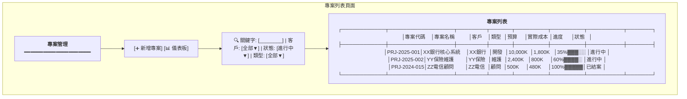
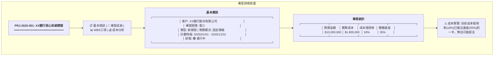
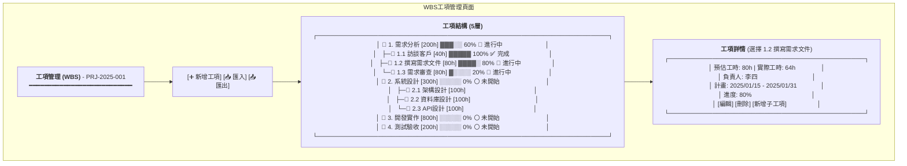
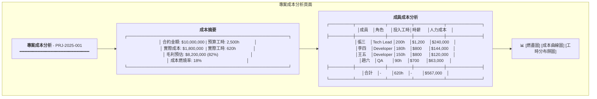
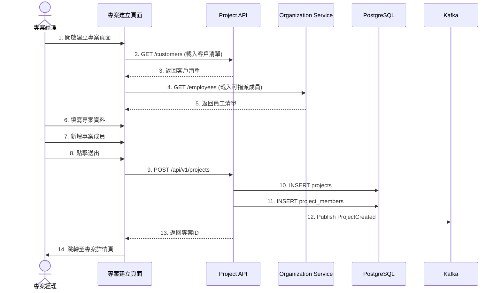
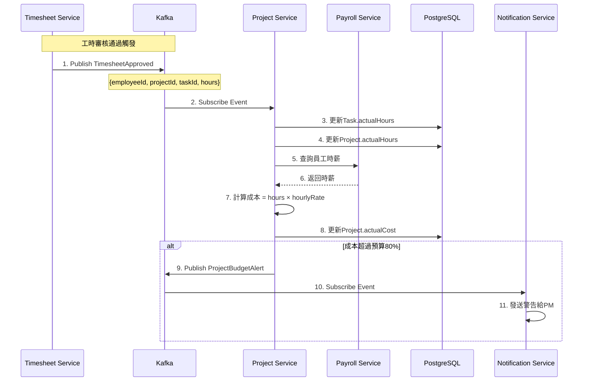
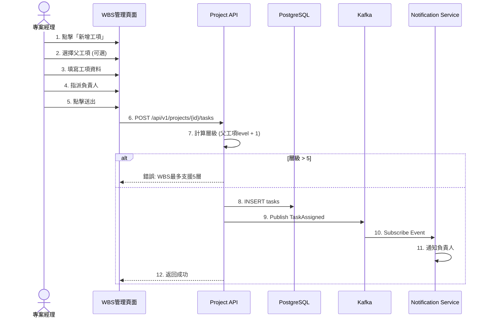
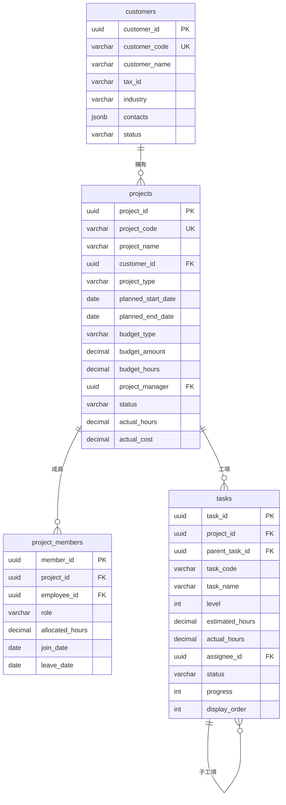

# 專案管理服務系統設計書

**版本:** 1.0  
**日期:** 2025-12-07  
**Domain代號:** 06 (PRJ)  
**導入階段:** 第二階段（專案管理核心）
**目標:** 提供工程師完整的系統實作規格，供PM建立工項清單

---

## 目錄

1. [服務概述](#1-服務概述)
2. [UI設計](#2-ui設計)
3. [UX流程設計](#3-ux流程設計)
4. [畫面事件說明](#4-畫面事件說明)
5. [Data Flow設計](#5-data-flow設計)
6. [資料庫設計](#6-資料庫設計)
7. [Domain設計](#7-domain設計)
8. [領域事件設計](#8-領域事件設計)
9. [API設計](#9-api設計)
10. [工項清單摘要](#10-工項清單摘要)

---

## 1. 服務概述

### 1.1 服務定位
專案管理服務負責客戶管理、專案建立與維護、多層級工項管理(WBS)及專案成本追蹤。這是軟體公司專案成本核算的關鍵服務，需與工時服務緊密整合。

### 1.2 核心功能
- ✅ **客戶資料管理:** 客戶基本資料、聯絡人管理
- ✅ **專案管理:** 類型、預算、時程管理
- ✅ **WBS工項管理:** 支援5層級工項結構
- ✅ **專案成員管理:** 角色指派、工時分配
- ✅ **專案狀態追蹤:** 進度、成本監控
- ✅ **專案成本分析:** 與工時整合計算人力成本

### 1.3 技術架構
- **前端:** ReactJS + Redux + Ant Design
- **後端:** Spring Boot 3.1.x + MyBatis
- **資料庫:** PostgreSQL 15.x
- **事件匯流排:** Kafka

### 1.4 服務邊界

| 屬於本服務 | 不屬於本服務 |
|:---|:---|
| 客戶資料管理 | 工時回報 (Timesheet Service) |
| 專案資料管理 | 成本計算細節 (需整合工時+薪資) |
| 工項(WBS)定義 | |
| 成員指派 | |
| 進度追蹤 | |

### 1.5 專案類型與預算模式

| 專案類型 | 說明 |
|:---|:---|
| DEVELOPMENT | 新開發專案 |
| MAINTENANCE | 維護專案 |
| CONSULTING | 顧問專案 |

| 預算模式 | 說明 |
|:---|:---|
| FIXED_PRICE | 固定價格，追蹤成本是否超支 |
| TIME_AND_MATERIAL | 實報實銷，追蹤工時計費 |

---

## 2. UI設計

### 2.1 頁面清單

| 頁面代碼 | 頁面名稱 | 路由 | 權限要求 |
|:---|:---|:---|:---:|
| `HR06-P01` | 客戶管理頁面 | `/admin/projects/customers` | customer:manage |
| `HR06-P02` | 專案列表頁面 | `/admin/projects` | project:read |
| `HR06-P03` | 專案詳情頁面 | `/admin/projects/:id` | project:read |
| `HR06-P04` | 專案建立/編輯頁面 | `/admin/projects/edit/:id?` | project:manage |
| `HR06-P05` | WBS工項管理頁面 | `/admin/projects/:id/tasks` | project:task:manage |
| `HR06-P06` | 專案成本分析頁面 | `/admin/projects/:id/cost` | project:cost:read |
| `HR06-P07` | 專案儀表板 | `/admin/projects/dashboard` | project:read |
| `HR06-P08` | 我參與的專案 (ESS) | `/profile/projects` | - |
| `HR06-M01` | 客戶編輯對話框 | (Modal) | customer:manage |
| `HR06-M02` | 新增成員對話框 | (Modal) | project:member:manage |
| `HR06-M03` | 工項編輯對話框 | (Modal) | project:task:manage |

### 2.2 UI線稿 (Mermaid)

#### 2.2.1 專案列表頁面 (HR06-P02)



#### 2.2.2 專案詳情頁面 (HR06-P03)



#### 2.2.3 WBS工項管理頁面 (HR06-P05)



#### 2.2.4 專案成本分析頁面 (HR06-P06)



---

## 3. UX流程設計

### 3.1 專案建立流程



### 3.2 專案成本更新流程 (Event-Driven)



### 3.3 WBS工項建立流程



---

## 4. 畫面事件說明

### 4.1 專案列表頁面事件 (HR06-P02)

| 事件ID | 觸發元素 | 事件類型 | 事件處理 | 後端API |
|:---|:---|:---|:---|:---|
| `E-PRJ-01` | 搜尋框 | onChange | 篩選專案 | GET /api/v1/projects |
| `E-PRJ-02` | 新增專案按鈕 | onClick | 跳轉建立頁面 | - |
| `E-PRJ-03` | 專案列點擊 | onClick | 跳轉專案詳情 | - |

### 4.2 WBS工項頁面事件 (HR06-P05)

| 事件ID | 觸發元素 | 事件類型 | 事件處理 | 後端API |
|:---|:---|:---|:---|:---|
| `E-WBS-01` | 新增工項按鈕 | onClick | 開啟新增工項對話框 | - |
| `E-WBS-02` | 工項節點點擊 | onClick | 顯示工項詳情 | - |
| `E-WBS-03` | 工項展開/收合 | onClick | 切換子工項顯示 | - |
| `E-WBS-04` | 確認新增工項 | onClick | 建立工項 | POST /api/v1/projects/{id}/tasks |
| `E-WBS-05` | 更新進度 | onChange | 更新工項進度 | PUT /api/v1/tasks/{id}/progress |
| `E-WBS-06` | 拖曳排序 | onDrop | 調整工項順序 | PUT /api/v1/tasks/reorder |

---

## 5. Data Flow設計

### 5.1 前端State結構

```typescript
interface ProjectState {
  // 客戶
  customers: {
    list: Customer[];
    loading: boolean;
  };
  
  // 專案列表
  projects: {
    list: ProjectSummary[];
    filters: ProjectFilters;
    loading: boolean;
  };
  
  // 專案詳情
  currentProject: {
    data: ProjectDetail | null;
    members: ProjectMember[];
    loading: boolean;
  };
  
  // WBS工項
  tasks: {
    tree: TaskNode[];
    selectedTask: TaskDetail | null;
    loading: boolean;
  };
  
  // 成本分析
  costAnalysis: {
    summary: CostSummary | null;
    memberCosts: MemberCost[];
    loading: boolean;
  };
  
  // 我的專案 (ESS)
  myProjects: {
    list: MyProjectItem[];
    loading: boolean;
  };
}

interface TaskNode {
  taskId: string;
  taskCode: string;
  taskName: string;
  level: number;
  estimatedHours: number;
  actualHours: number;
  progress: number;
  status: TaskStatus;
  assignee: { id: string; name: string };
  children: TaskNode[];
}
```

---

## 6. 資料庫設計

### 6.1 ER Diagram



### 6.2 DDL Script

```sql
-- 客戶表
CREATE TABLE customers (
    customer_id UUID PRIMARY KEY DEFAULT gen_random_uuid(),
    customer_code VARCHAR(50) NOT NULL UNIQUE,
    customer_name VARCHAR(255) NOT NULL,
    tax_id VARCHAR(20),
    industry VARCHAR(100),
    contacts JSONB DEFAULT '[]',
    address TEXT,
    phone_number VARCHAR(50),
    email VARCHAR(255),
    status VARCHAR(20) DEFAULT 'ACTIVE' CHECK (status IN ('ACTIVE', 'INACTIVE')),
    created_at TIMESTAMP DEFAULT CURRENT_TIMESTAMP,
    updated_at TIMESTAMP DEFAULT CURRENT_TIMESTAMP
);

CREATE INDEX idx_customer_name ON customers(customer_name);

-- 專案表
CREATE TABLE projects (
    project_id UUID PRIMARY KEY DEFAULT gen_random_uuid(),
    project_code VARCHAR(50) NOT NULL UNIQUE,
    project_name VARCHAR(255) NOT NULL,
    customer_id UUID NOT NULL REFERENCES customers(customer_id),
    project_type VARCHAR(20) NOT NULL CHECK (project_type IN ('DEVELOPMENT', 'MAINTENANCE', 'CONSULTING')),
    planned_start_date DATE NOT NULL,
    planned_end_date DATE NOT NULL,
    actual_start_date DATE,
    actual_end_date DATE,
    budget_type VARCHAR(30) NOT NULL CHECK (budget_type IN ('FIXED_PRICE', 'TIME_AND_MATERIAL')),
    budget_amount DECIMAL(15,2),
    budget_hours DECIMAL(10,2),
    project_manager UUID NOT NULL,
    status VARCHAR(20) DEFAULT 'PLANNING' 
        CHECK (status IN ('PLANNING', 'IN_PROGRESS', 'COMPLETED', 'ON_HOLD', 'CANCELLED')),
    actual_hours DECIMAL(10,2) DEFAULT 0,
    actual_cost DECIMAL(15,2) DEFAULT 0,
    description TEXT,
    created_at TIMESTAMP DEFAULT CURRENT_TIMESTAMP,
    updated_at TIMESTAMP DEFAULT CURRENT_TIMESTAMP,
    
    CONSTRAINT chk_project_dates CHECK (planned_end_date >= planned_start_date)
);

CREATE INDEX idx_project_customer ON projects(customer_id);
CREATE INDEX idx_project_status ON projects(status);
CREATE INDEX idx_project_pm ON projects(project_manager);

-- 專案成員表
CREATE TABLE project_members (
    member_id UUID PRIMARY KEY DEFAULT gen_random_uuid(),
    project_id UUID NOT NULL REFERENCES projects(project_id) ON DELETE CASCADE,
    employee_id UUID NOT NULL,
    role VARCHAR(100) NOT NULL,
    allocated_hours DECIMAL(10,2),
    hourly_rate DECIMAL(10,2),
    join_date DATE NOT NULL,
    leave_date DATE,
    created_at TIMESTAMP DEFAULT CURRENT_TIMESTAMP,
    
    CONSTRAINT uk_project_member UNIQUE (project_id, employee_id)
);

CREATE INDEX idx_member_project ON project_members(project_id);
CREATE INDEX idx_member_employee ON project_members(employee_id);

-- 工項表 (WBS)
CREATE TABLE tasks (
    task_id UUID PRIMARY KEY DEFAULT gen_random_uuid(),
    project_id UUID NOT NULL REFERENCES projects(project_id) ON DELETE CASCADE,
    parent_task_id UUID REFERENCES tasks(task_id),
    task_code VARCHAR(50) NOT NULL,
    task_name VARCHAR(255) NOT NULL,
    description TEXT,
    level INTEGER NOT NULL CHECK (level BETWEEN 1 AND 5),
    planned_start_date DATE,
    planned_end_date DATE,
    actual_start_date DATE,
    actual_end_date DATE,
    estimated_hours DECIMAL(10,2) NOT NULL DEFAULT 0,
    actual_hours DECIMAL(10,2) DEFAULT 0,
    assignee_id UUID,
    status VARCHAR(20) DEFAULT 'NOT_STARTED' 
        CHECK (status IN ('NOT_STARTED', 'IN_PROGRESS', 'COMPLETED', 'BLOCKED')),
    progress INTEGER DEFAULT 0 CHECK (progress BETWEEN 0 AND 100),
    display_order INTEGER DEFAULT 0,
    created_at TIMESTAMP DEFAULT CURRENT_TIMESTAMP,
    updated_at TIMESTAMP DEFAULT CURRENT_TIMESTAMP,
    
    CONSTRAINT uk_task_code UNIQUE (project_id, task_code)
);

CREATE INDEX idx_task_project ON tasks(project_id);
CREATE INDEX idx_task_parent ON tasks(parent_task_id);
CREATE INDEX idx_task_assignee ON tasks(assignee_id);

-- 專案成本快照表 (歷史記錄)
CREATE TABLE project_cost_snapshots (
    snapshot_id UUID PRIMARY KEY DEFAULT gen_random_uuid(),
    project_id UUID NOT NULL REFERENCES projects(project_id),
    snapshot_date DATE NOT NULL,
    total_hours DECIMAL(10,2) NOT NULL,
    total_cost DECIMAL(15,2) NOT NULL,
    budget_utilization DECIMAL(5,2),
    created_at TIMESTAMP DEFAULT CURRENT_TIMESTAMP,
    
    CONSTRAINT uk_snapshot UNIQUE (project_id, snapshot_date)
);
```

---

## 7. Domain設計

### 7.1 聚合根

#### Project聚合根

```java
@Entity
@Table(name = "projects")
public class Project {
    @EmbeddedId
    private ProjectId id;
    
    @Column(name = "project_code", unique = true, nullable = false)
    private String projectCode;
    
    @Column(name = "project_name", nullable = false)
    private String projectName;
    
    @Column(name = "customer_id", nullable = false)
    private UUID customerId;
    
    @Enumerated(EnumType.STRING)
    @Column(name = "project_type", nullable = false)
    private ProjectType projectType;
    
    @Embedded
    private ProjectSchedule schedule;
    
    @Embedded
    private ProjectBudget budget;
    
    @Column(name = "project_manager", nullable = false)
    private UUID projectManager;
    
    @OneToMany(cascade = CascadeType.ALL, orphanRemoval = true)
    @JoinColumn(name = "project_id")
    private List<ProjectMember> members = new ArrayList<>();
    
    @Enumerated(EnumType.STRING)
    @Column(name = "status", nullable = false)
    private ProjectStatus status;
    
    @Column(name = "actual_hours")
    private BigDecimal actualHours = BigDecimal.ZERO;
    
    @Column(name = "actual_cost")
    private BigDecimal actualCost = BigDecimal.ZERO;
    
    // ========== Factory Method ==========
    
    public static Project create(CreateProjectCommand cmd) {
        Project project = new Project();
        project.id = ProjectId.generate();
        project.projectCode = cmd.getProjectCode();
        project.projectName = cmd.getProjectName();
        project.customerId = cmd.getCustomerId();
        project.projectType = cmd.getProjectType();
        project.schedule = new ProjectSchedule(
            cmd.getPlannedStartDate(), 
            cmd.getPlannedEndDate()
        );
        project.budget = new ProjectBudget(
            cmd.getBudgetType(),
            cmd.getBudgetAmount(),
            cmd.getBudgetHours()
        );
        project.projectManager = cmd.getProjectManager();
        project.status = ProjectStatus.PLANNING;
        
        // 新增成員
        cmd.getMembers().forEach(m -> 
            project.addMember(m.getEmployeeId(), m.getRole(), m.getAllocatedHours())
        );
        
        DomainEventPublisher.publish(new ProjectCreatedEvent(
            project.id.getValue(),
            project.projectCode,
            project.projectName
        ));
        
        return project;
    }
    
    // ========== Domain行為 ==========
    
    /**
     * 新增成員
     */
    public void addMember(UUID employeeId, String role, BigDecimal allocatedHours) {
        if (this.members.stream().anyMatch(m -> m.getEmployeeId().equals(employeeId))) {
            throw new DomainException("該成員已在專案中");
        }
        
        ProjectMember member = new ProjectMember(employeeId, role, allocatedHours);
        this.members.add(member);
        
        DomainEventPublisher.publish(new ProjectMemberAddedEvent(
            this.id.getValue(),
            employeeId,
            role
        ));
    }
    
    /**
     * 開始專案
     */
    public void start() {
        if (this.status != ProjectStatus.PLANNING) {
            throw new DomainException("只有規劃中的專案可以開始");
        }
        this.status = ProjectStatus.IN_PROGRESS;
        this.schedule.setActualStartDate(LocalDate.now());
    }
    
    /**
     * 更新成本 (被工時事件觸發)
     */
    public void updateCost(BigDecimal additionalHours, BigDecimal additionalCost) {
        this.actualHours = this.actualHours.add(additionalHours);
        this.actualCost = this.actualCost.add(additionalCost);
        
        // 檢查預算警告
        if (this.budget.getBudgetAmount() != null) {
            BigDecimal utilization = this.actualCost
                .divide(this.budget.getBudgetAmount(), 4, RoundingMode.HALF_UP)
                .multiply(new BigDecimal("100"));
            
            if (utilization.compareTo(new BigDecimal("80")) >= 0) {
                DomainEventPublisher.publish(new ProjectBudgetAlertEvent(
                    this.id.getValue(),
                    this.projectCode,
                    utilization
                ));
            }
        }
    }
    
    /**
     * 結案
     */
    public void complete() {
        if (this.status != ProjectStatus.IN_PROGRESS) {
            throw new DomainException("只有進行中的專案可以結案");
        }
        this.status = ProjectStatus.COMPLETED;
        this.schedule.setActualEndDate(LocalDate.now());
        
        DomainEventPublisher.publish(new ProjectCompletedEvent(
            this.id.getValue(),
            this.actualHours,
            this.actualCost
        ));
    }
    
    /**
     * 計算進度
     */
    public int calculateProgress(List<Task> tasks) {
        if (tasks.isEmpty()) return 0;
        
        BigDecimal totalWeightedProgress = tasks.stream()
            .map(t -> t.getEstimatedHours().multiply(new BigDecimal(t.getProgress())))
            .reduce(BigDecimal.ZERO, BigDecimal::add);
        
        BigDecimal totalEstimatedHours = tasks.stream()
            .map(Task::getEstimatedHours)
            .reduce(BigDecimal.ZERO, BigDecimal::add);
        
        if (totalEstimatedHours.compareTo(BigDecimal.ZERO) == 0) return 0;
        
        return totalWeightedProgress
            .divide(totalEstimatedHours, 0, RoundingMode.HALF_UP)
            .intValue();
    }
}

// 值對象
@Embeddable
public class ProjectBudget {
    @Enumerated(EnumType.STRING)
    @Column(name = "budget_type")
    private BudgetType budgetType;
    
    @Column(name = "budget_amount")
    private BigDecimal budgetAmount;
    
    @Column(name = "budget_hours")
    private BigDecimal budgetHours;
}
```

#### Task聚合根 (WBS工項)

```java
@Entity
@Table(name = "tasks")
public class Task {
    @EmbeddedId
    private TaskId id;
    
    @Column(name = "project_id", nullable = false)
    private UUID projectId;
    
    @Column(name = "parent_task_id")
    private UUID parentTaskId;
    
    @Column(name = "task_code", nullable = false)
    private String taskCode;
    
    @Column(name = "task_name", nullable = false)
    private String taskName;
    
    @Column(name = "level", nullable = false)
    private int level;
    
    @Column(name = "estimated_hours")
    private BigDecimal estimatedHours;
    
    @Column(name = "actual_hours")
    private BigDecimal actualHours = BigDecimal.ZERO;
    
    @Column(name = "assignee_id")
    private UUID assigneeId;
    
    @Enumerated(EnumType.STRING)
    @Column(name = "status")
    private TaskStatus status;
    
    @Column(name = "progress")
    private int progress = 0;
    
    private static final int MAX_LEVEL = 5;
    
    /**
     * 建立工項
     */
    public static Task create(
            UUID projectId,
            UUID parentTaskId,
            int parentLevel,
            CreateTaskCommand cmd) {
        
        int newLevel = parentTaskId == null ? 1 : parentLevel + 1;
        
        if (newLevel > MAX_LEVEL) {
            throw new DomainException("WBS最多支援" + MAX_LEVEL + "層");
        }
        
        Task task = new Task();
        task.id = TaskId.generate();
        task.projectId = projectId;
        task.parentTaskId = parentTaskId;
        task.taskCode = cmd.getTaskCode();
        task.taskName = cmd.getTaskName();
        task.level = newLevel;
        task.estimatedHours = cmd.getEstimatedHours();
        task.assigneeId = cmd.getAssigneeId();
        task.status = TaskStatus.NOT_STARTED;
        
        if (cmd.getAssigneeId() != null) {
            DomainEventPublisher.publish(new TaskAssignedEvent(
                task.id.getValue(),
                projectId,
                cmd.getAssigneeId(),
                task.taskName
            ));
        }
        
        return task;
    }
    
    /**
     * 更新進度
     */
    public void updateProgress(int newProgress) {
        if (newProgress < 0 || newProgress > 100) {
            throw new DomainException("進度必須在0-100之間");
        }
        
        this.progress = newProgress;
        
        if (newProgress == 100 && this.status != TaskStatus.COMPLETED) {
            this.status = TaskStatus.COMPLETED;
            DomainEventPublisher.publish(new TaskCompletedEvent(
                this.id.getValue(), this.projectId
            ));
        } else if (newProgress > 0 && this.status == TaskStatus.NOT_STARTED) {
            this.status = TaskStatus.IN_PROGRESS;
        }
    }
    
    /**
     * 累加實際工時
     */
    public void addActualHours(BigDecimal hours) {
        this.actualHours = this.actualHours.add(hours);
    }
}
```

---

## 8. 領域事件設計

| 事件名稱 | 觸發時機 | 發布服務 | 訂閱服務 |
|:---|:---|:---|:---|
| `ProjectCreated` | 建立專案 | Project | - |
| `ProjectMemberAdded` | 新增成員 | Project | Timesheet |
| `ProjectCompleted` | 專案結案 | Project | Reporting |
| `ProjectBudgetAlert` | 預算超過80% | Project | Notification |
| `TaskAssigned` | 指派工項 | Project | Notification |
| `TaskCompleted` | 完成工項 | Project | - |

---

## 9. API設計

### 9.1 Controller命名對照

| Controller | 說明 |
|:---|:---|
| `HR06CustomerCmdController` | 客戶Command操作 |
| `HR06CustomerQryController` | 客戶Query操作 |
| `HR06ProjectCmdController` | 專案Command操作 |
| `HR06ProjectQryController` | 專案Query操作 |
| `HR06TaskCmdController` | 工項Command操作 |
| `HR06TaskQryController` | 工項Query操作 |
| `HR06CostQryController` | 成本分析Query操作 |

### 9.2 API總覽 (18個端點)

| 端點 | 方法 | 說明 |
|:---|:---:|:---|
| `/api/v1/customers` | POST | 建立客戶 |
| `/api/v1/customers` | GET | 查詢客戶列表 |
| `/api/v1/customers/{id}` | GET | 查詢客戶詳情 |
| `/api/v1/projects` | POST | 建立專案 |
| `/api/v1/projects` | GET | 查詢專案列表 |
| `/api/v1/projects/{id}` | GET | 查詢專案詳情 |
| `/api/v1/projects/{id}` | PUT | 更新專案 |
| `/api/v1/projects/{id}/start` | PUT | 開始專案 |
| `/api/v1/projects/{id}/complete` | PUT | 結案 |
| `/api/v1/projects/{id}/members` | POST | 新增成員 |
| `/api/v1/projects/{id}/tasks` | POST | 建立工項 |
| `/api/v1/projects/{id}/tasks/tree` | GET | 查詢WBS樹 |
| `/api/v1/tasks/{id}` | PUT | 更新工項 |
| `/api/v1/tasks/{id}/progress` | PUT | 更新進度 |
| `/api/v1/projects/{id}/cost` | GET | 查詢成本分析 |
| `/api/v1/projects/my` | GET | 我參與的專案 (ESS) |

---

## 10. 工項清單摘要

### 前端開發工項
1. HR06-P01 客戶管理頁面
2. HR06-P02 專案列表頁面
3. HR06-P03 專案詳情頁面
4. HR06-P05 WBS工項管理頁面 (樹狀結構)
5. HR06-P06 專案成本分析頁面 (含圖表)
6. HR06-P08 我參與的專案 (ESS)

### 後端開發工項
1. Customer聚合根與Repository
2. Project聚合根與Repository
3. Task聚合根與Repository (樹狀查詢)
4. ProjectCostCalculationService
5. 客戶管理API (3端點)
6. 專案管理API (8端點)
7. 工項管理API (4端點)
8. 成本分析API (2端點)
9. 訂閱TimesheetApproved事件更新成本

### 資料庫開發工項
1. 建立5個資料表DDL
2. 建立索引
3. 初始化測試客戶與專案資料

---

**文件完成日期:** 2025-12-07  
**版本:** 1.0
