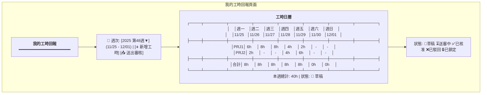
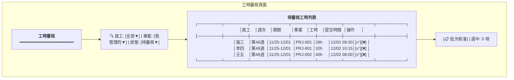
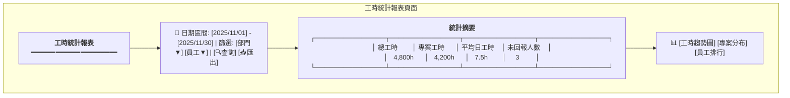
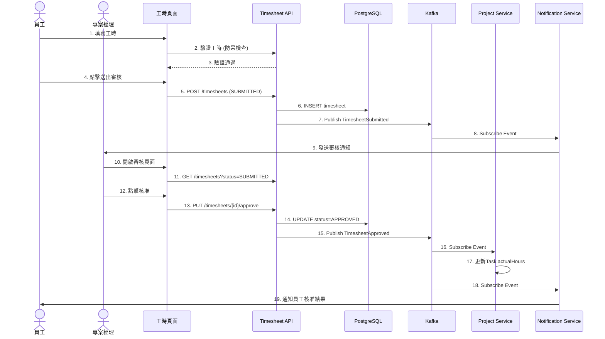
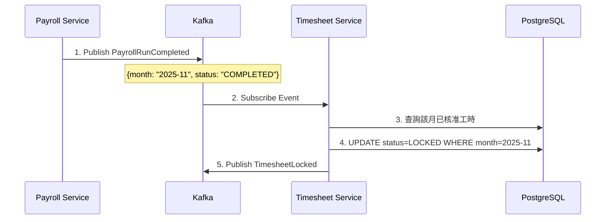
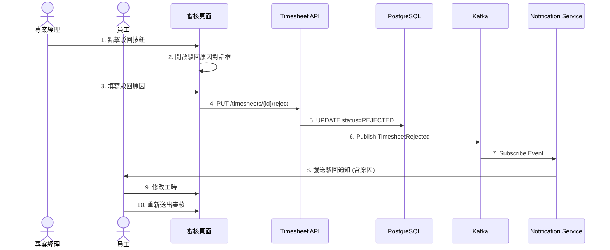
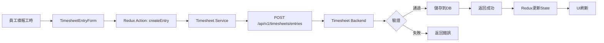
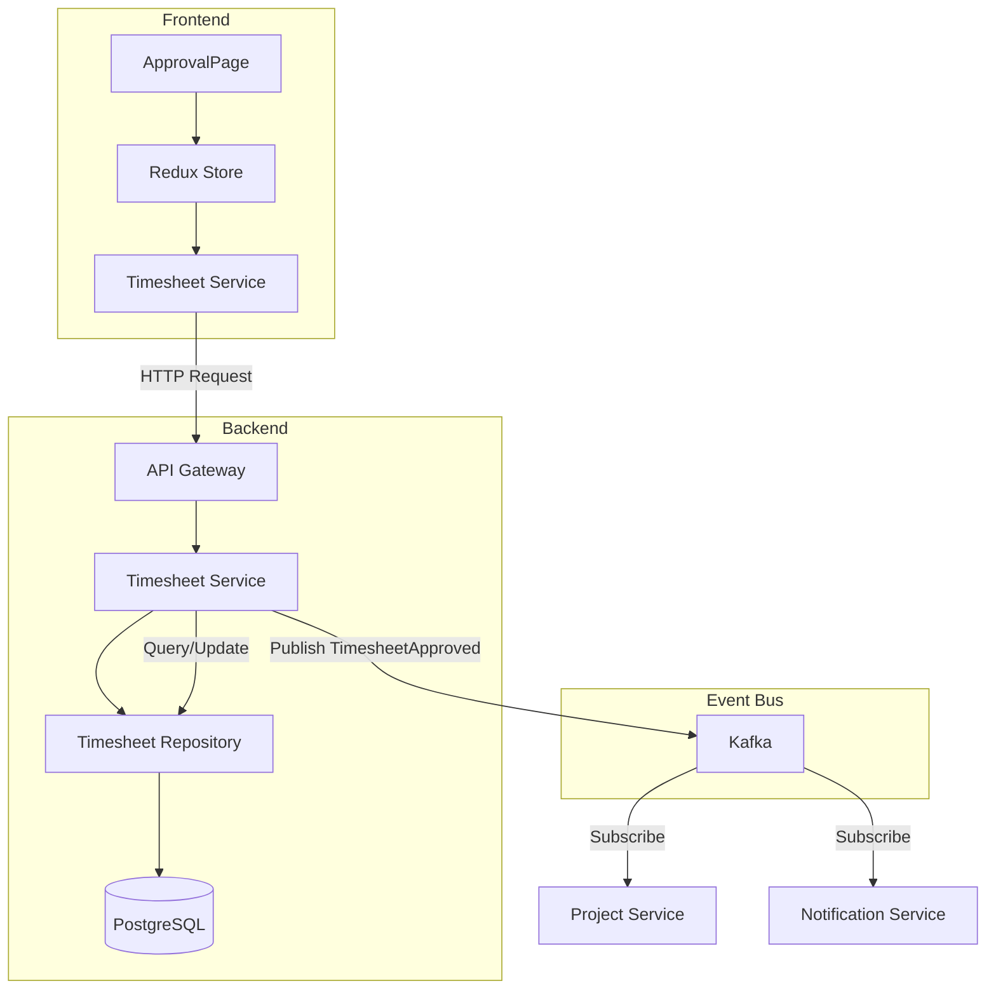
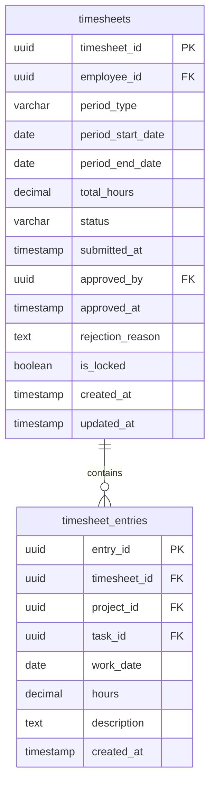

# 工時管理服務系統設計書

**版本:** 1.1
**日期:** 2025-12-26
**Domain代號:** 07 (TSH)
**導入階段:** 第二階段（專案管理核心）
**目標:** 提供工程師完整的系統實作規格，供PM建立工項清單

---

## 目錄

1. [服務概述](#1-服務概述)
2. [UI設計](#2-ui設計)
3. [UX流程設計](#3-ux流程設計)
4. [畫面事件說明](#4-畫面事件說明)
5. [Data Flow設計](#5-data-flow設計)
6. [資料庫設計](#6-資料庫設計)
7. [Domain設計](#7-domain設計)
8. [領域事件設計](#8-領域事件設計)
9. [API設計](#9-api設計)
10. [工項清單摘要](#10-工項清單摘要)

---

## 1. 服務概述

### 1.1 服務定位
工時管理服務負責員工工時回報、PM審核及工時統計分析。這是專案成本核算的關鍵數據來源，需與專案服務和薪資服務緊密整合。

### 1.2 核心功能
- ✅ **工時回報:** 日報/週報模式
- ✅ **工時審核:** PM審核工作流程
- ✅ **工時防呆:** 超時檢查、日期驗證、重複檢查
- ✅ **工時統計:** 個人/專案/部門統計
- ✅ **工時鎖定:** 薪資結算後自動鎖定

### 1.3 技術架構
- **前端:** ReactJS + Redux + Ant Design
- **後端:** Spring Boot 3.1.x + MyBatis
- **資料庫:** PostgreSQL 15.x
- **事件匯流排:** Kafka

### 1.4 服務邊界

| 屬於本服務 | 不屬於本服務 |
|:---|:---|
| 工時回報管理 | 專案定義 (Project Service) |
| 工時審核流程 | 成本計算細節 (需整合薪資) |
| 工時統計分析 | 員工基本資料 (Organization Service) |
| 工時鎖定機制 | |

---

## 2. UI設計

### 2.1 頁面清單

| 頁面代碼 | 頁面名稱 | 路由 | 權限要求 |
|:---|:---|:---|:---:|
| `HR07-P01` | 我的工時回報頁面 | `/profile/timesheets` | - |
| `HR07-P02` | 工時審核頁面 | `/admin/timesheets/approval` | timesheet:approve |
| `HR07-P03` | 工時統計報表頁面 | `/admin/timesheets/reports` | timesheet:report:read |
| `HR07-P04` | 專案工時查詢頁面 | `/admin/timesheets/by-project` | timesheet:read:all |
| `HR07-M01` | 工時填報對話框 | (Modal) | - |
| `HR07-M02` | 駁回原因對話框 | (Modal) | timesheet:approve |

### 2.2 UI線稿 (Mermaid)

#### 2.2.1 我的工時回報頁面 (HR07-P01)



#### 2.2.2 工時審核頁面 (HR07-P02)



#### 2.2.3 工時統計報表頁面 (HR07-P03)



---

## 3. UX流程設計

### 3.1 工時回報與審核流程



### 3.2 工時鎖定流程 (Event-Driven)



### 3.3 工時駁回流程



---

## 4. 畫面事件說明

### 4.1 我的工時回報頁面事件 (HR07-P01)

| 事件ID | 觸發元素 | 事件類型 | 事件處理 | 後端API |
|:---|:---|:---|:---|:---|
| `E-TSH-01` | 週次選擇器 | onChange | 載入指定週次工時資料 | GET /api/v1/timesheets/my?week={week} |
| `E-TSH-02` | 新增工時按鈕 | onClick | 開啟工時填報對話框 (HR07-M01) | - |
| `E-TSH-03` | 儲存工時按鈕 | onClick | 儲存工時明細 | POST /api/v1/timesheets/entries |
| `E-TSH-04` | 送出審核按鈕 | onClick | 提交整週工時 | PUT /api/v1/timesheets/{id}/submit |
| `E-TSH-05` | 工時格點擊 | onClick | 開啟編輯對話框 | GET /api/v1/timesheets/entries/{id} |
| `E-TSH-06` | 刪除工時按鈕 | onClick | 確認後刪除工時明細 | DELETE /api/v1/timesheets/entries/{id} |
| `E-TSH-07` | 專案下拉選單 | onChange | 載入可選擇的任務清單 | GET /api/v1/projects/{id}/tasks |

**E-TSH-03 詳細流程:**
```typescript
const handleSaveEntry = async (values: TimesheetEntryFormData) => {
  try {
    // 1. 前端驗證
    if (values.hours > 24 || values.hours <= 0) {
      message.error('工時必須在0-24小時之間');
      return;
    }

    // 2. 檢查日期是否為未來日期
    if (dayjs(values.workDate).isAfter(dayjs(), 'day')) {
      message.error('不可回報未來日期的工時');
      return;
    }

    // 3. 呼叫API儲存
    await timesheetService.createEntry({
      timesheetId: currentTimesheet.id,
      projectId: values.projectId,
      taskId: values.taskId,
      workDate: values.workDate,
      hours: values.hours,
      description: values.description
    });

    // 4. 刷新列表
    await fetchTimesheetData();
    message.success('工時已儲存');
    closeModal();

  } catch (error) {
    if (error.code === 'DUPLICATE_ENTRY') {
      message.error('同日同專案已有工時記錄');
    } else if (error.code === 'EXCEED_DAILY_LIMIT') {
      message.error('單日工時不可超過24小時');
    } else {
      message.error('儲存失敗: ' + error.message);
    }
  }
};
```

### 4.2 工時審核頁面事件 (HR07-P02)

| 事件ID | 觸發元素 | 事件類型 | 事件處理 | 後端API |
|:---|:---|:---|:---|:---|
| `E-TSHA-01` | 員工篩選器 | onChange | 篩選待審核列表 | GET /api/v1/timesheets/pending-approval?employeeId={id} |
| `E-TSHA-02` | 專案篩選器 | onChange | 篩選待審核列表 | GET /api/v1/timesheets/pending-approval?projectId={id} |
| `E-TSHA-03` | 核准按鈕 | onClick | 核准單筆工時 | PUT /api/v1/timesheets/{id}/approve |
| `E-TSHA-04` | 駁回按鈕 | onClick | 開啟駁回原因對話框 | - |
| `E-TSHA-05` | 確認駁回 | onClick | 駁回工時 | PUT /api/v1/timesheets/{id}/reject |
| `E-TSHA-06` | 批次選擇核取框 | onChange | 更新批次選中狀態 | - |
| `E-TSHA-07` | 批次核准按鈕 | onClick | 批次核准工時 | PUT /api/v1/timesheets/batch-approve |
| `E-TSHA-08` | 查看詳情連結 | onClick | 展開工時明細 | GET /api/v1/timesheets/{id}/entries |

**E-TSHA-03 詳細流程:**
```typescript
const handleApprove = async (timesheetId: string) => {
  try {
    // 1. 呼叫核准API
    await timesheetService.approve(timesheetId);

    // 2. 顯示成功訊息
    message.success('工時已核准');

    // 3. 刷新待審核列表
    await fetchPendingApprovals();

  } catch (error) {
    message.error('核准失敗: ' + error.message);
  }
};
```

### 4.3 工時統計報表頁面事件 (HR07-P03)

| 事件ID | 觸發元素 | 事件類型 | 事件處理 | 後端API |
|:---|:---|:---|:---|:---|
| `E-TSHR-01` | 日期區間選擇 | onChange | 更新查詢條件 | - |
| `E-TSHR-02` | 查詢按鈕 | onClick | 查詢統計資料 | GET /api/v1/timesheets/summary |
| `E-TSHR-03` | 匯出按鈕 | onClick | 匯出Excel報表 | GET /api/v1/timesheets/export |
| `E-TSHR-04` | 圖表切換Tab | onClick | 切換圖表類型 | - |

---

## 5. Data Flow設計

### 5.1 前端狀態管理 (Redux)

#### 5.1.1 State結構

```typescript
interface TimesheetState {
  // 我的工時
  myTimesheet: {
    currentWeek: string;  // 格式: "2025-W48"
    timesheet: Timesheet | null;
    entries: TimesheetEntry[];
    loading: boolean;
    error: string | null;
  };

  // 待審核列表
  pendingApprovals: {
    list: TimesheetSummary[];
    filters: {
      employeeId: string | null;
      projectId: string | null;
      status: string;
    };
    selectedIds: string[];
    loading: boolean;
    total: number;
    page: number;
    pageSize: number;
  };

  // 統計報表
  reports: {
    summary: ReportSummary | null;
    chartData: ChartData[];
    filters: {
      startDate: string;
      endDate: string;
      departmentId: string | null;
      employeeId: string | null;
    };
    loading: boolean;
  };
}

interface Timesheet {
  timesheetId: string;
  employeeId: string;
  periodType: 'DAILY' | 'WEEKLY';
  periodStartDate: string;
  periodEndDate: string;
  totalHours: number;
  status: TimesheetStatus;
  submittedAt: string | null;
  approvedBy: string | null;
  approvedAt: string | null;
  rejectionReason: string | null;
}

interface TimesheetEntry {
  entryId: string;
  projectId: string;
  projectName: string;
  taskId: string | null;
  taskName: string | null;
  workDate: string;
  hours: number;
  description: string;
}

type TimesheetStatus = 'DRAFT' | 'SUBMITTED' | 'APPROVED' | 'REJECTED' | 'LOCKED';
```

#### 5.1.2 Redux Actions

```typescript
// 我的工時 Actions
export const myTimesheetActions = {
  fetchMyTimesheet: createAsyncThunk(
    'timesheet/fetchMyTimesheet',
    async (week: string) => {
      const response = await timesheetService.getMyTimesheet(week);
      return response;
    }
  ),

  createEntry: createAsyncThunk(
    'timesheet/createEntry',
    async (entry: CreateEntryRequest) => {
      const response = await timesheetService.createEntry(entry);
      return response;
    }
  ),

  submitTimesheet: createAsyncThunk(
    'timesheet/submit',
    async (timesheetId: string) => {
      await timesheetService.submit(timesheetId);
      return timesheetId;
    }
  ),
};

// 審核 Actions
export const approvalActions = {
  fetchPendingApprovals: createAsyncThunk(
    'timesheet/fetchPendingApprovals',
    async (params: ApprovalQueryParams) => {
      const response = await timesheetService.getPendingApprovals(params);
      return response;
    }
  ),

  approve: createAsyncThunk(
    'timesheet/approve',
    async (timesheetId: string) => {
      await timesheetService.approve(timesheetId);
      return timesheetId;
    }
  ),

  reject: createAsyncThunk(
    'timesheet/reject',
    async ({ timesheetId, reason }: { timesheetId: string; reason: string }) => {
      await timesheetService.reject(timesheetId, reason);
      return timesheetId;
    }
  ),

  batchApprove: createAsyncThunk(
    'timesheet/batchApprove',
    async (timesheetIds: string[]) => {
      await timesheetService.batchApprove(timesheetIds);
      return timesheetIds;
    }
  ),
};
```

### 5.2 前後端資料流

#### 5.2.1 工時填報資料流



#### 5.2.2 工時審核資料流



---

## 6. 資料庫設計

### 6.1 ER Diagram



### 6.2 DDL Script

```sql
-- 工時表
CREATE TABLE timesheets (
    timesheet_id UUID PRIMARY KEY DEFAULT gen_random_uuid(),
    employee_id UUID NOT NULL,
    period_type VARCHAR(20) NOT NULL CHECK (period_type IN ('DAILY', 'WEEKLY')),
    period_start_date DATE NOT NULL,
    period_end_date DATE NOT NULL,
    total_hours DECIMAL(6,2) DEFAULT 0,
    status VARCHAR(20) NOT NULL DEFAULT 'DRAFT'
        CHECK (status IN ('DRAFT', 'SUBMITTED', 'APPROVED', 'REJECTED', 'LOCKED')),
    submitted_at TIMESTAMP,
    approved_by UUID,
    approved_at TIMESTAMP,
    rejection_reason TEXT,
    is_locked BOOLEAN DEFAULT FALSE,
    created_at TIMESTAMP DEFAULT CURRENT_TIMESTAMP,
    updated_at TIMESTAMP DEFAULT CURRENT_TIMESTAMP,

    CONSTRAINT uk_timesheet_period UNIQUE (employee_id, period_start_date, period_end_date)
);

CREATE INDEX idx_timesheet_employee ON timesheets(employee_id);
CREATE INDEX idx_timesheet_status ON timesheets(status);
CREATE INDEX idx_timesheet_period ON timesheets(period_start_date, period_end_date);
CREATE INDEX idx_timesheet_approved_by ON timesheets(approved_by);

COMMENT ON TABLE timesheets IS '工時表頭';
COMMENT ON COLUMN timesheets.period_type IS '週期類型: DAILY-日報, WEEKLY-週報';
COMMENT ON COLUMN timesheets.status IS '狀態: DRAFT/SUBMITTED/APPROVED/REJECTED/LOCKED';

-- 工時明細表
CREATE TABLE timesheet_entries (
    entry_id UUID PRIMARY KEY DEFAULT gen_random_uuid(),
    timesheet_id UUID NOT NULL REFERENCES timesheets(timesheet_id) ON DELETE CASCADE,
    project_id UUID NOT NULL,
    task_id UUID,
    work_date DATE NOT NULL,
    hours DECIMAL(4,2) NOT NULL CHECK (hours > 0 AND hours <= 24),
    description TEXT,
    created_at TIMESTAMP DEFAULT CURRENT_TIMESTAMP,

    CONSTRAINT uk_entry UNIQUE (timesheet_id, project_id, work_date)
);

CREATE INDEX idx_entry_timesheet ON timesheet_entries(timesheet_id);
CREATE INDEX idx_entry_project ON timesheet_entries(project_id);
CREATE INDEX idx_entry_task ON timesheet_entries(task_id);
CREATE INDEX idx_entry_date ON timesheet_entries(work_date);

COMMENT ON TABLE timesheet_entries IS '工時明細';
COMMENT ON COLUMN timesheet_entries.hours IS '工作時數 (最大24小時)';

-- 工時統計快照表 (用於報表加速)
CREATE TABLE timesheet_summaries (
    summary_id UUID PRIMARY KEY DEFAULT gen_random_uuid(),
    employee_id UUID NOT NULL,
    project_id UUID NOT NULL,
    summary_month DATE NOT NULL,
    total_hours DECIMAL(8,2) NOT NULL,
    approved_hours DECIMAL(8,2) DEFAULT 0,
    pending_hours DECIMAL(8,2) DEFAULT 0,
    created_at TIMESTAMP DEFAULT CURRENT_TIMESTAMP,
    updated_at TIMESTAMP DEFAULT CURRENT_TIMESTAMP,

    CONSTRAINT uk_summary UNIQUE (employee_id, project_id, summary_month)
);

CREATE INDEX idx_summary_employee ON timesheet_summaries(employee_id);
CREATE INDEX idx_summary_project ON timesheet_summaries(project_id);
CREATE INDEX idx_summary_month ON timesheet_summaries(summary_month);
```

### 6.3 資料字典

| 表名 | 說明 | 預估資料量 | 成長速度 | 保留策略 |
|:---|:---|:---:|:---|:---|
| `timesheets` | 工時表頭 | 10,000 | 月增800筆 | 永久保留 |
| `timesheet_entries` | 工時明細 | 100,000 | 月增8,000筆 | 永久保留 |
| `timesheet_summaries` | 工時統計快照 | 5,000 | 月增400筆 | 永久保留 |

---

## 7. Domain設計

### 7.1 Timesheet聚合根

```java
@Entity
@Table(name = "timesheets")
public class Timesheet {
    @EmbeddedId
    private TimesheetId id;

    @Column(name = "employee_id", nullable = false)
    private UUID employeeId;

    @Enumerated(EnumType.STRING)
    @Column(name = "period_type")
    private TimesheetPeriod periodType;

    @Column(name = "period_start_date")
    private LocalDate periodStartDate;

    @Column(name = "period_end_date")
    private LocalDate periodEndDate;

    @OneToMany(cascade = CascadeType.ALL, orphanRemoval = true)
    @JoinColumn(name = "timesheet_id")
    private List<TimesheetEntry> entries = new ArrayList<>();

    @Column(name = "total_hours")
    private BigDecimal totalHours = BigDecimal.ZERO;

    @Enumerated(EnumType.STRING)
    @Column(name = "status")
    private TimesheetStatus status;

    @Column(name = "submitted_at")
    private LocalDateTime submittedAt;

    @Column(name = "approved_by")
    private UUID approvedBy;

    @Column(name = "approved_at")
    private LocalDateTime approvedAt;

    @Column(name = "rejection_reason")
    private String rejectionReason;

    @Column(name = "is_locked")
    private boolean isLocked;

    // ========== Factory Method ==========

    public static Timesheet create(UUID employeeId, LocalDate weekStartDate) {
        Timesheet ts = new Timesheet();
        ts.id = TimesheetId.generate();
        ts.employeeId = employeeId;
        ts.periodType = TimesheetPeriod.WEEKLY;
        ts.periodStartDate = weekStartDate;
        ts.periodEndDate = weekStartDate.plusDays(6);
        ts.status = TimesheetStatus.DRAFT;
        ts.isLocked = false;
        return ts;
    }

    // ========== Domain行為 ==========

    /**
     * 新增工時明細
     */
    public void addEntry(TimesheetEntry entry) {
        // 防呆: 工時表已鎖定
        if (this.isLocked) {
            throw new DomainException("工時表已鎖定，無法修改");
        }

        // 防呆: 只有草稿或駁回狀態可以新增
        if (this.status != TimesheetStatus.DRAFT &&
            this.status != TimesheetStatus.REJECTED) {
            throw new DomainException("目前狀態不允許新增工時");
        }

        // 防呆: 不可回報未來日期
        if (entry.getWorkDate().isAfter(LocalDate.now())) {
            throw new DomainException("不可回報未來日期的工時");
        }

        // 防呆: 日期必須在週期內
        if (entry.getWorkDate().isBefore(this.periodStartDate) ||
            entry.getWorkDate().isAfter(this.periodEndDate)) {
            throw new DomainException("工作日期必須在週期範圍內");
        }

        // 防呆: 同日同專案不可重複
        boolean duplicate = this.entries.stream()
            .anyMatch(e -> e.getWorkDate().equals(entry.getWorkDate())
                && e.getProjectId().equals(entry.getProjectId()));
        if (duplicate) {
            throw new DomainException("同日同專案不可重複回報");
        }

        // 防呆: 每日不超過24小時
        BigDecimal dayTotal = this.entries.stream()
            .filter(e -> e.getWorkDate().equals(entry.getWorkDate()))
            .map(TimesheetEntry::getHours)
            .reduce(BigDecimal.ZERO, BigDecimal::add);

        if (dayTotal.add(entry.getHours()).compareTo(new BigDecimal("24")) > 0) {
            throw new DomainException("單日工時不可超過24小時");
        }

        this.entries.add(entry);
        recalculateTotal();
    }

    /**
     * 刪除工時明細
     */
    public void removeEntry(UUID entryId) {
        if (this.isLocked) {
            throw new DomainException("工時表已鎖定，無法修改");
        }

        if (this.status != TimesheetStatus.DRAFT &&
            this.status != TimesheetStatus.REJECTED) {
            throw new DomainException("目前狀態不允許刪除工時");
        }

        this.entries.removeIf(e -> e.getId().equals(entryId));
        recalculateTotal();
    }

    /**
     * 提交審核
     */
    public void submit() {
        if (this.status != TimesheetStatus.DRAFT &&
            this.status != TimesheetStatus.REJECTED) {
            throw new DomainException("只有草稿或已駁回狀態可以提交");
        }

        if (this.entries.isEmpty()) {
            throw new DomainException("至少需要一筆工時記錄");
        }

        this.status = TimesheetStatus.SUBMITTED;
        this.submittedAt = LocalDateTime.now();
        this.rejectionReason = null; // 清除之前的駁回原因

        DomainEventPublisher.publish(new TimesheetSubmittedEvent(
            this.id.getValue(),
            this.employeeId,
            this.totalHours,
            this.periodStartDate,
            this.periodEndDate
        ));
    }

    /**
     * 核准
     */
    public void approve(UUID approverId) {
        if (this.status != TimesheetStatus.SUBMITTED) {
            throw new DomainException("只有已提交狀態可以核准");
        }

        this.status = TimesheetStatus.APPROVED;
        this.approvedBy = approverId;
        this.approvedAt = LocalDateTime.now();

        // 彙整各專案工時
        Map<UUID, BigDecimal> projectHours = this.entries.stream()
            .collect(Collectors.groupingBy(
                TimesheetEntry::getProjectId,
                Collectors.reducing(BigDecimal.ZERO, TimesheetEntry::getHours, BigDecimal::add)
            ));

        DomainEventPublisher.publish(new TimesheetApprovedEvent(
            this.id.getValue(),
            this.employeeId,
            projectHours
        ));
    }

    /**
     * 駁回
     */
    public void reject(UUID approverId, String reason) {
        if (this.status != TimesheetStatus.SUBMITTED) {
            throw new DomainException("只有已提交狀態可以駁回");
        }

        Objects.requireNonNull(reason, "駁回原因不可為空");

        this.status = TimesheetStatus.REJECTED;
        this.approvedBy = approverId;
        this.approvedAt = LocalDateTime.now();
        this.rejectionReason = reason;

        DomainEventPublisher.publish(new TimesheetRejectedEvent(
            this.id.getValue(),
            this.employeeId,
            reason
        ));
    }

    /**
     * 鎖定 (薪資結算後)
     */
    public void lock() {
        if (this.status != TimesheetStatus.APPROVED) {
            throw new DomainException("只有已核准狀態可以鎖定");
        }
        this.status = TimesheetStatus.LOCKED;
        this.isLocked = true;

        DomainEventPublisher.publish(new TimesheetLockedEvent(
            this.id.getValue(),
            this.employeeId
        ));
    }

    private void recalculateTotal() {
        this.totalHours = this.entries.stream()
            .map(TimesheetEntry::getHours)
            .reduce(BigDecimal.ZERO, BigDecimal::add);
    }
}
```

### 7.2 TimesheetEntry實體

```java
@Entity
@Table(name = "timesheet_entries")
public class TimesheetEntry {
    @EmbeddedId
    private EntryId id;

    @Column(name = "project_id", nullable = false)
    private UUID projectId;

    @Column(name = "task_id")
    private UUID taskId;

    @Column(name = "work_date", nullable = false)
    private LocalDate workDate;

    @Column(name = "hours", nullable = false)
    private BigDecimal hours;

    @Column(name = "description")
    private String description;

    public static TimesheetEntry create(UUID projectId, UUID taskId,
            LocalDate workDate, BigDecimal hours, String description) {

        if (hours.compareTo(BigDecimal.ZERO) <= 0) {
            throw new DomainException("工時必須大於0");
        }

        if (hours.compareTo(new BigDecimal("24")) > 0) {
            throw new DomainException("單筆工時不可超過24小時");
        }

        TimesheetEntry entry = new TimesheetEntry();
        entry.id = EntryId.generate();
        entry.projectId = projectId;
        entry.taskId = taskId;
        entry.workDate = workDate;
        entry.hours = hours;
        entry.description = description;
        return entry;
    }
}
```

### 7.3 值對象

```java
public enum TimesheetStatus {
    DRAFT("草稿", true),
    SUBMITTED("已提交", false),
    APPROVED("已核准", false),
    REJECTED("已駁回", true),
    LOCKED("已鎖定", false);

    private final String displayName;
    private final boolean editable;

    TimesheetStatus(String displayName, boolean editable) {
        this.displayName = displayName;
        this.editable = editable;
    }

    public boolean isEditable() {
        return editable;
    }
}

public enum TimesheetPeriod {
    DAILY("日報"),
    WEEKLY("週報");

    private final String displayName;

    TimesheetPeriod(String displayName) {
        this.displayName = displayName;
    }
}
```

---

## 8. 領域事件設計

### 8.1 事件清單

| 事件名稱 | 觸發時機 | 發布服務 | 訂閱服務 |
|:---|:---|:---|:---|
| `TimesheetCreatedEvent` | 建立工時表 | Timesheet | - |
| `TimesheetSubmittedEvent` | 提交工時 | Timesheet | Workflow, Notification |
| `TimesheetApprovedEvent` | 核准工時 | Timesheet | Project, Payroll, Notification |
| `TimesheetRejectedEvent` | 駁回工時 | Timesheet | Notification |
| `TimesheetLockedEvent` | 鎖定工時 | Timesheet | - |

### 8.2 事件Schema

#### TimesheetSubmittedEvent

```json
{
  "eventId": "uuid",
  "eventType": "TimesheetSubmittedEvent",
  "occurredAt": "2025-12-02T09:30:00Z",
  "aggregateId": "timesheet-uuid",
  "aggregateType": "Timesheet",
  "payload": {
    "timesheetId": "uuid",
    "employeeId": "uuid",
    "totalHours": 40.0,
    "periodStartDate": "2025-11-25",
    "periodEndDate": "2025-12-01"
  }
}
```

#### TimesheetApprovedEvent

```json
{
  "eventId": "uuid",
  "eventType": "TimesheetApprovedEvent",
  "occurredAt": "2025-12-03T14:00:00Z",
  "aggregateId": "timesheet-uuid",
  "aggregateType": "Timesheet",
  "payload": {
    "timesheetId": "uuid",
    "employeeId": "uuid",
    "approvedBy": "manager-uuid",
    "projectHours": {
      "project-uuid-1": 28.0,
      "project-uuid-2": 12.0
    }
  }
}
```

#### TimesheetRejectedEvent

```json
{
  "eventId": "uuid",
  "eventType": "TimesheetRejectedEvent",
  "occurredAt": "2025-12-03T14:00:00Z",
  "aggregateId": "timesheet-uuid",
  "aggregateType": "Timesheet",
  "payload": {
    "timesheetId": "uuid",
    "employeeId": "uuid",
    "rejectedBy": "manager-uuid",
    "reason": "工時與差勤記錄不符，請確認"
  }
}
```

---

## 9. API設計

### 9.1 Controller命名對照

| Controller | 說明 |
|:---|:---|
| `HR07TimesheetCmdController` | 工時Command操作 |
| `HR07TimesheetQryController` | 工時Query操作 |
| `HR07ApprovalCmdController` | 審核Command操作 |
| `HR07ApprovalQryController` | 審核Query操作 |
| `HR07ReportQryController` | 報表Query操作 |

### 9.2 API總覽 (14個端點)

| 端點 | 方法 | Controller | 說明 |
|:---|:---:|:---|:---|
| `/api/v1/timesheets` | POST | HR07TimesheetCmdController | 建立工時表 |
| `/api/v1/timesheets/{id}/entries` | POST | HR07TimesheetCmdController | 新增工時明細 |
| `/api/v1/timesheets/{id}/entries/{entryId}` | PUT | HR07TimesheetCmdController | 更新工時明細 |
| `/api/v1/timesheets/{id}/entries/{entryId}` | DELETE | HR07TimesheetCmdController | 刪除工時明細 |
| `/api/v1/timesheets/{id}/submit` | PUT | HR07TimesheetCmdController | 提交審核 |
| `/api/v1/timesheets/{id}/approve` | PUT | HR07ApprovalCmdController | 核准 |
| `/api/v1/timesheets/{id}/reject` | PUT | HR07ApprovalCmdController | 駁回 |
| `/api/v1/timesheets/batch-approve` | PUT | HR07ApprovalCmdController | 批次核准 |
| `/api/v1/timesheets/my` | GET | HR07TimesheetQryController | 我的工時 |
| `/api/v1/timesheets/{id}/entries` | GET | HR07TimesheetQryController | 工時明細 |
| `/api/v1/timesheets/pending-approval` | GET | HR07ApprovalQryController | 待審核列表 |
| `/api/v1/timesheets/summary` | GET | HR07ReportQryController | 個人統計 |
| `/api/v1/timesheets/project-summary` | GET | HR07ReportQryController | 專案統計 |
| `/api/v1/timesheets/unreported` | GET | HR07ReportQryController | 未回報員工 |

### 9.3 API詳細規格

#### 9.3.1 新增工時明細

**請求:**
```http
POST /api/v1/timesheets/{timesheetId}/entries
Content-Type: application/json
Authorization: Bearer {accessToken}

{
  "projectId": "project-uuid",
  "taskId": "task-uuid",
  "workDate": "2025-11-25",
  "hours": 8.0,
  "description": "完成需求分析文件"
}
```

**成功回應:**
```json
{
  "code": "SUCCESS",
  "message": "工時已新增",
  "data": {
    "entryId": "entry-uuid"
  }
}
```

#### 9.3.2 提交審核

**請求:**
```http
PUT /api/v1/timesheets/{timesheetId}/submit
Authorization: Bearer {accessToken}
```

**成功回應:**
```json
{
  "code": "SUCCESS",
  "message": "工時已提交審核"
}
```

#### 9.3.3 駁回工時

**請求:**
```http
PUT /api/v1/timesheets/{timesheetId}/reject
Content-Type: application/json
Authorization: Bearer {accessToken}

{
  "reason": "工時與差勤記錄不符，請確認11/26是否有請假"
}
```

**成功回應:**
```json
{
  "code": "SUCCESS",
  "message": "工時已駁回"
}
```

---

## 10. 工項清單摘要

### 前端開發工項

| 工項編號 | 工項名稱 | 估計工時 | 優先順序 |
|:---|:---|:---:|:---:|
| FE-07-01 | HR07-P01 我的工時回報頁面 (週曆視圖) | 24h | P0 |
| FE-07-02 | HR07-P02 工時審核頁面 | 16h | P0 |
| FE-07-03 | HR07-P03 工時統計報表頁面 | 16h | P1 |
| FE-07-04 | HR07-P04 專案工時查詢頁面 | 8h | P1 |
| FE-07-05 | HR07-M01 工時填報對話框 | 8h | P0 |
| FE-07-06 | HR07-M02 駁回原因對話框 | 4h | P0 |
| FE-07-07 | Redux Timesheet模組 | 8h | P0 |
| FE-07-08 | TimesheetViewModelFactory | 4h | P0 |
| FE-07-09 | 工時日曆元件 | 16h | P0 |
| **小計** | | **104h** | |

### 後端開發工項

| 工項編號 | 工項名稱 | 估計工時 | 優先順序 |
|:---|:---|:---:|:---:|
| BE-07-01 | Timesheet聚合根與Repository | 16h | P0 |
| BE-07-02 | TimesheetEntry實體 | 8h | P0 |
| BE-07-03 | 工時防呆驗證Service | 8h | P0 |
| BE-07-04 | 工時統計Service | 8h | P1 |
| BE-07-05 | 工時填報API (5端點) | 16h | P0 |
| BE-07-06 | 工時審核API (4端點) | 12h | P0 |
| BE-07-07 | 工時報表API (3端點) | 8h | P1 |
| BE-07-08 | 訂閱PayrollRunCompleted事件鎖定工時 | 4h | P0 |
| BE-07-09 | 領域事件發布 | 4h | P0 |
| BE-07-10 | Swagger文件 | 2h | P1 |
| **小計** | | **86h** | |

### 資料庫開發工項

| 工項編號 | 工項名稱 | 估計工時 | 優先順序 |
|:---|:---|:---:|:---:|
| DB-07-01 | 建立3個資料表DDL | 2h | P0 |
| DB-07-02 | 建立索引 | 1h | P0 |
| DB-07-03 | 初始化測試資料 | 1h | P1 |
| **小計** | | **4h** | |

### 測試開發工項

| 工項編號 | 工項名稱 | 估計工時 | 優先順序 |
|:---|:---|:---:|:---:|
| TE-07-01 | Timesheet聚合根單元測試 | 8h | P0 |
| TE-07-02 | 工時防呆邏輯測試 | 8h | P0 |
| TE-07-03 | 工時API整合測試 | 8h | P0 |
| TE-07-04 | 前端Factory測試 | 4h | P0 |
| TE-07-05 | 前端Component測試 | 8h | P1 |
| **小計** | | **36h** | |

### 總計

| 類別 | 工時 |
|:---|:---:|
| 前端開發 | 104h |
| 後端開發 | 86h |
| 資料庫開發 | 4h |
| 測試開發 | 36h |
| **合計** | **230h** |

---

**文件完成日期:** 2025-12-26
**版本:** 1.1
