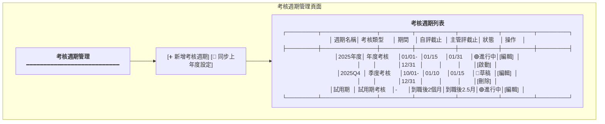
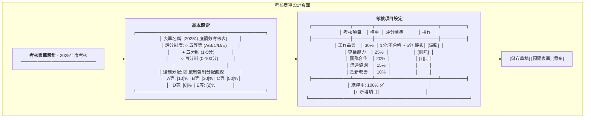
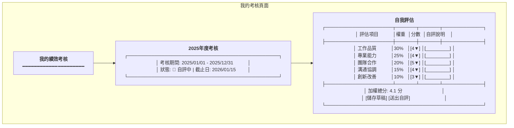
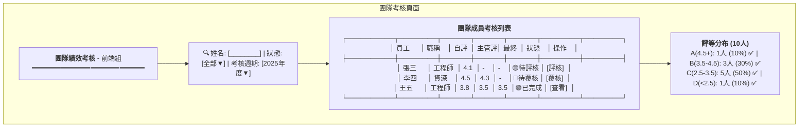
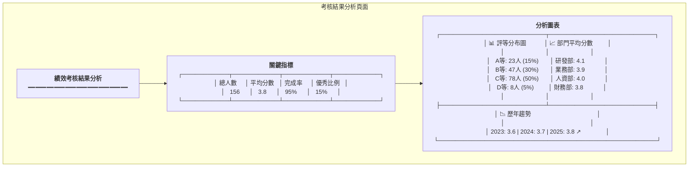
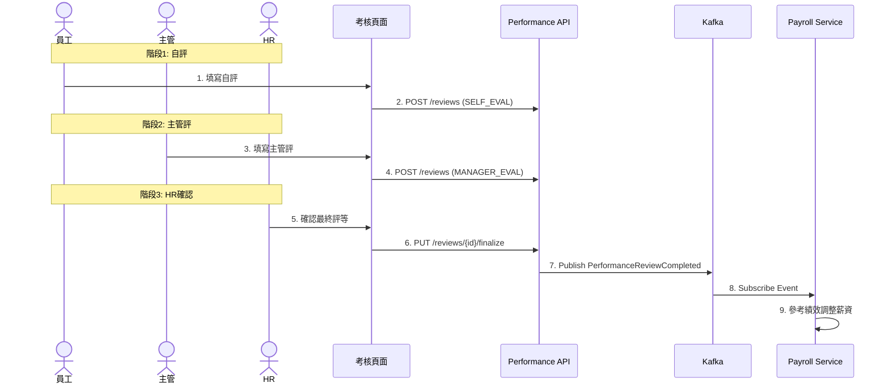
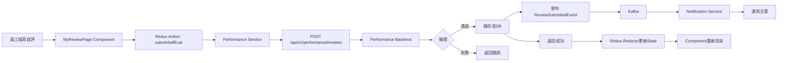
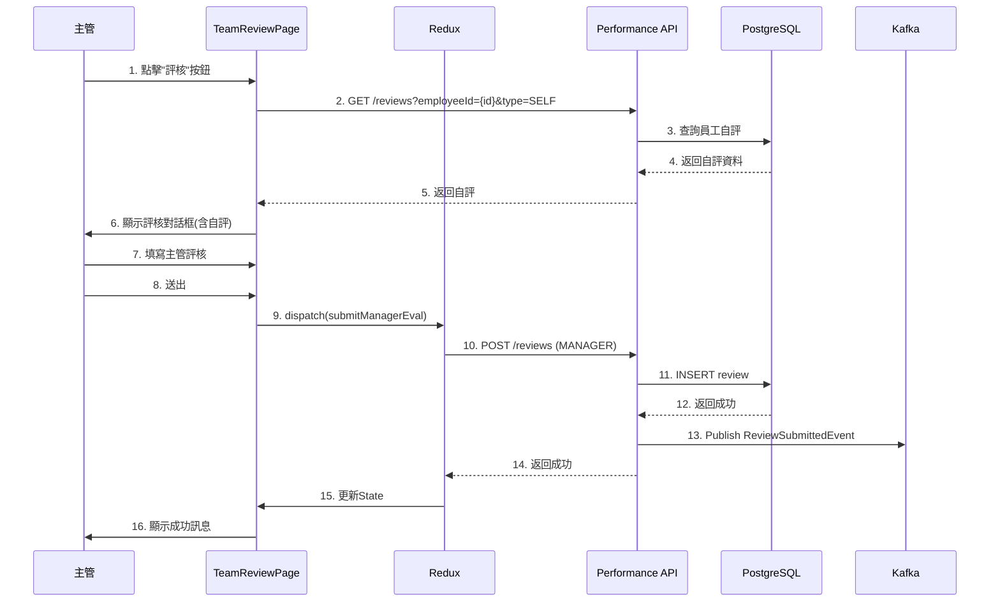
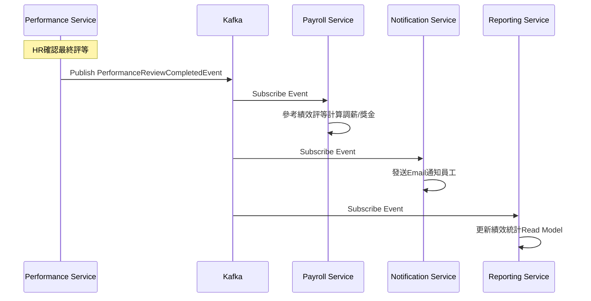

# 績效管理服務系統設計書

**版本:** 1.0
**日期:** 2025-12-07
**Domain代號:** 08 (PFM)
**導入階段:** 第三階段（進階人資功能）

---

## 目錄

1. [服務概述](#1-服務概述)
2. [UI設計](#2-ui設計)
3. [UX流程設計](#3-ux流程設計)
4. [畫面事件說明](#4-畫面事件說明)
5. [Data Flow設計](#5-data-flow設計)
6. [資料庫設計](#6-資料庫設計)
7. [Domain設計](#7-domain設計)
8. [領域事件設計](#8-領域事件設計)
9. [API設計](#9-api設計)
10. [工項清單摘要](#10-工項清單摘要)

---

## 1. 服務概述

### 1.1 核心功能
- ✅ **考核週期管理:** 試用期/季度/年度考核
- ✅ **考核表單設計:** KPI、360度評估
- ✅ **考核流程:** 自評→主管評→覆核→HR確認
- ✅ **績效評等:** A/B/C/D等級，強制分配曲線
- ✅ **績效與薪資連動:** 調薪、獎金參考

### 1.2 服務邊界

| 屬於本服務 | 不屬於本服務 |
|:---|:---|
| 考核週期管理 | 薪資調整執行 (Payroll) |
| 考核表單管理 | 員工主管關係 (Organization) |
| 考核流程處理 | |

---

## 2. UI設計

### 2.1 頁面清單

| 頁面代碼 | 頁面名稱 | 路由 |
|:---|:---|:---|
| `HR08-P01` | 考核週期管理頁面 | `/admin/performance/cycles` |
| `HR08-P02` | 考核表單設計頁面 | `/admin/performance/templates` |
| `HR08-P03` | 我的考核頁面 (ESS) | `/profile/performance` |
| `HR08-P04` | 團隊考核頁面 | `/admin/performance/team` |
| `HR08-P05` | 考核結果分析頁面 | `/admin/performance/reports` |

### 2.2 UI線稿

#### 2.2.1 考核週期管理頁面 (HR08-P01)



**頁面元素說明:**
- **工具列**
  - 新增考核週期按鈕: 開啟新增對話框
  - 同步上年度設定: 複製上年度考核表單設定

- **考核週期表格**
  - 週期名稱: 可點擊查看詳情
  - 考核類型: 試用期/季度/年度
  - 狀態: 草稿/進行中/已完成
  - 操作: 編輯/啟動/刪除

#### 2.2.2 考核表單設計頁面 (HR08-P02)



#### 2.2.3 我的考核頁面 (HR08-P03)



#### 2.2.4 團隊考核頁面 (HR08-P04)



#### 2.2.5 考核結果分析頁面 (HR08-P05)



---

## 3. UX流程設計

### 3.1 考核流程



---

## 4. 畫面事件說明

### 4.1 考核週期管理頁面事件 (HR08-P01)

| 事件ID | 觸發元素 | 事件類型 | 事件處理 | 後端API |
|:---|:---|:---|:---|:---|
| `E-PFM-01` | 新增考核週期按鈕 | onClick | 開啟新增對話框 | - |
| `E-PFM-02` | 同步上年度設定按鈕 | onClick | 複製上年度表單設定 | GET /api/v1/performance/cycles/{lastYearId}/template |
| `E-PFM-03` | 編輯按鈕 | onClick | 開啟編輯對話框 | GET /api/v1/performance/cycles/{id} |
| `E-PFM-04` | 啟動按鈕 | onClick | 啟動考核週期 | PUT /api/v1/performance/cycles/{id}/start |
| `E-PFM-05` | 刪除按鈕 | onClick | 確認後刪除週期 | DELETE /api/v1/performance/cycles/{id} |
| `E-PFM-06` | 新增週期確認 | onClick | 建立考核週期 | POST /api/v1/performance/cycles |

**E-PFM-04 詳細流程:**
```typescript
const handleStartCycle = async (cycleId: string) => {
  try {
    Modal.confirm({
      title: '確認啟動考核週期',
      content: '啟動後將通知所有員工開始自評，確定要啟動嗎？',
      onOk: async () => {
        await performanceService.startCycle(cycleId);
        message.success('考核週期已啟動');

        // 重新載入列表
        await fetchCycles();
      }
    });
  } catch (error) {
    message.error('啟動失敗: ' + error.message);
  }
};
```

### 4.2 考核表單設計頁面事件 (HR08-P02)

| 事件ID | 觸發元素 | 事件類型 | 事件處理 | 後端API |
|:---|:---|:---|:---|:---|
| `E-FORM-01` | 評分制度選擇 | onChange | 更新表單設定 | - |
| `E-FORM-02` | 強制分配勾選 | onChange | 顯示/隱藏分配比例設定 | - |
| `E-FORM-03` | 新增項目按鈕 | onClick | 在表格末端新增一列 | - |
| `E-FORM-04` | 編輯項目按鈕 | onClick | 編輯考核項目 | - |
| `E-FORM-05` | 刪除項目按鈕 | onClick | 刪除考核項目 | - |
| `E-FORM-06` | 上移/下移按鈕 | onClick | 調整項目順序 | - |
| `E-FORM-07` | 儲存草稿按鈕 | onClick | 儲存表單設定 | PUT /api/v1/performance/cycles/{id}/template |
| `E-FORM-08` | 預覽表單按鈕 | onClick | 開啟預覽對話框 | - |
| `E-FORM-09` | 發布按鈕 | onClick | 發布考核表單 | PUT /api/v1/performance/cycles/{id}/publish |

**E-FORM-07 詳細流程:**
```typescript
const handleSaveTemplate = async () => {
  try {
    // 驗證總權重是否為100%
    const totalWeight = items.reduce((sum, item) => sum + item.weight, 0);
    if (totalWeight !== 100) {
      message.error('總權重必須為100%');
      return;
    }

    // 儲存表單設定
    await performanceService.saveTemplate(cycleId, {
      formName: formConfig.formName,
      scoringSystem: formConfig.scoringSystem,
      forcedDistribution: formConfig.forcedDistribution,
      distributionRules: formConfig.distributionRules,
      evaluationItems: items
    });

    message.success('表單設定已儲存');
  } catch (error) {
    message.error('儲存失敗: ' + error.message);
  }
};
```

### 4.3 我的考核頁面事件 (HR08-P03)

| 事件ID | 觸發元素 | 事件類型 | 事件處理 | 後端API |
|:---|:---|:---|:---|:---|
| `E-SELF-01` | 評分下拉選擇 | onChange | 更新分數並重算總分 | - |
| `E-SELF-02` | 自評說明輸入 | onChange | 更新說明文字 | - |
| `E-SELF-03` | 儲存草稿按鈕 | onClick | 儲存至LocalStorage | - |
| `E-SELF-04` | 送出自評按鈕 | onClick | 提交自評 | POST /api/v1/performance/reviews |

**E-SELF-04 詳細流程:**
```typescript
const handleSubmitSelfEval = async () => {
  try {
    // 驗證所有項目都已評分
    const hasEmpty = evaluationItems.some(item => !item.score);
    if (hasEmpty) {
      message.error('請完成所有評估項目');
      return;
    }

    Modal.confirm({
      title: '確認送出自評',
      content: '送出後將無法修改，確定要送出嗎？',
      onOk: async () => {
        await performanceService.submitReview({
          cycleId,
          employeeId: currentUser.employeeId,
          reviewType: 'SELF',
          evaluationItems,
          overallScore: calculateOverallScore()
        });

        message.success('自評已送出');
        navigate('/profile/performance');
      }
    });
  } catch (error) {
    message.error('送出失敗: ' + error.message);
  }
};

const calculateOverallScore = () => {
  return evaluationItems.reduce((sum, item) =>
    sum + (item.weight / 100) * item.score, 0
  ).toFixed(1);
};
```

### 4.4 團隊考核頁面事件 (HR08-P04)

| 事件ID | 觸發元素 | 事件類型 | 事件處理 | 後端API |
|:---|:---|:---|:---|:---|
| `E-TEAM-01` | 姓名搜尋框 | onChange (debounce 300ms) | 過濾團隊成員列表 | - |
| `E-TEAM-02` | 狀態篩選器 | onChange | 過濾團隊成員列表 | - |
| `E-TEAM-03` | 考核週期篩選器 | onChange | 切換考核週期並重新查詢 | GET /api/v1/performance/team?cycleId={id} |
| `E-TEAM-04` | 評核按鈕 | onClick | 開啟主管評核對話框 | - |
| `E-TEAM-05` | 覆核按鈕 | onClick | 開啟覆核對話框 | - |
| `E-TEAM-06` | 查看按鈕 | onClick | 查看完整考核結果 | GET /api/v1/performance/reviews/{id} |
| `E-TEAM-07` | 主管評核確認 | onClick | 提交主管評核 | POST /api/v1/performance/reviews (MANAGER) |
| `E-TEAM-08` | 覆核確認 | onClick | 確認最終評等 | PUT /api/v1/performance/reviews/{id}/finalize |

**E-TEAM-07 詳細流程:**
```typescript
const handleManagerEval = async (employeeId: string) => {
  try {
    // 先載入員工自評
    const selfEval = await performanceService.getReview(cycleId, employeeId, 'SELF');

    // 開啟評核對話框
    setEvalModalData({
      employee: employees.find(e => e.employeeId === employeeId),
      selfEval,
      visible: true
    });
  } catch (error) {
    message.error('載入自評資料失敗');
  }
};

const handleSubmitManagerEval = async (values: ManagerEvalForm) => {
  try {
    await performanceService.submitReview({
      cycleId,
      employeeId: values.employeeId,
      reviewerId: currentUser.employeeId,
      reviewType: 'MANAGER',
      evaluationItems: values.evaluationItems,
      overallScore: calculateOverallScore(values.evaluationItems),
      comments: values.comments
    });

    message.success('主管評核已完成');
    await fetchTeamReviews();
    setEvalModalData({ visible: false });
  } catch (error) {
    message.error('送出失敗: ' + error.message);
  }
};
```

### 4.5 考核結果分析頁面事件 (HR08-P05)

| 事件ID | 觸發元素 | 事件類型 | 事件處理 | 後端API |
|:---|:---|:---|:---|:---|
| `E-REPORT-01` | 頁面載入 | onMount | 載入分析資料 | GET /api/v1/performance/reports/distribution |
| `E-REPORT-02` | 考核週期篩選 | onChange | 切換週期並重新載入 | GET /api/v1/performance/reports/distribution?cycleId={id} |
| `E-REPORT-03` | 匯出報表按鈕 | onClick | 下載Excel報表 | GET /api/v1/performance/reports/export |

---

## 5. Data Flow設計

### 5.1 前端狀態管理 (Redux)

#### 5.1.1 State結構

```typescript
interface PerformanceState {
  // 考核週期
  cycles: {
    list: PerformanceCycle[];
    currentCycle: PerformanceCycle | null;
    loading: boolean;
  };

  // 考核表單模板
  templates: {
    currentTemplate: EvaluationTemplate | null;
    previewData: EvaluationItem[];
    loading: boolean;
  };

  // 我的考核
  myReviews: {
    cycles: PerformanceCycle[];
    currentReview: PerformanceReview | null;
    selfEvalDraft: EvaluationItem[];
    loading: boolean;
  };

  // 團隊考核
  teamReviews: {
    list: TeamReviewItem[];
    distributionStats: DistributionStats;
    filters: {
      search: string;
      status: ReviewStatus;
      cycleId: string;
    };
    loading: boolean;
  };

  // 分析報表
  analytics: {
    kpis: PerformanceKPIs;
    distribution: RatingDistribution;
    departmentAvg: DepartmentAverages[];
    trends: YearlyTrend[];
    loading: boolean;
  };
}
```

#### 5.1.2 Redux Actions

```typescript
// 考核週期Actions
export const cycleActions = {
  fetchCycles: createAsyncThunk(
    'performance/fetchCycles',
    async () => {
      const response = await performanceService.getCycles();
      return response;
    }
  ),

  createCycle: createAsyncThunk(
    'performance/createCycle',
    async (data: CreateCycleRequest) => {
      const response = await performanceService.createCycle(data);
      return response;
    }
  ),

  startCycle: createAsyncThunk(
    'performance/startCycle',
    async (cycleId: string) => {
      await performanceService.startCycle(cycleId);
      return cycleId;
    }
  ),
};

// 考核評估Actions
export const reviewActions = {
  fetchMyReviews: createAsyncThunk(
    'performance/fetchMyReviews',
    async () => {
      const response = await performanceService.getMyReviews();
      return response;
    }
  ),

  submitSelfEval: createAsyncThunk(
    'performance/submitSelfEval',
    async (data: SubmitReviewRequest) => {
      const response = await performanceService.submitReview(data);
      return response;
    }
  ),

  fetchTeamReviews: createAsyncThunk(
    'performance/fetchTeamReviews',
    async (params: TeamReviewQueryParams) => {
      const response = await performanceService.getTeamReviews(params);
      return response;
    }
  ),

  submitManagerEval: createAsyncThunk(
    'performance/submitManagerEval',
    async (data: SubmitReviewRequest) => {
      const response = await performanceService.submitReview(data);
      return response;
    }
  ),

  finalizeReview: createAsyncThunk(
    'performance/finalizeReview',
    async ({reviewId, finalRating}: {reviewId: string, finalRating: string}) => {
      await performanceService.finalizeReview(reviewId, finalRating);
      return reviewId;
    }
  ),
};

// 分析報表Actions
export const analyticsActions = {
  fetchDistribution: createAsyncThunk(
    'performance/fetchDistribution',
    async (cycleId: string) => {
      const response = await performanceService.getDistribution(cycleId);
      return response;
    }
  ),
};
```

### 5.2 前後端資料流

#### 5.2.1 自評提交流程



#### 5.2.2 主管評核流程



### 5.3 服務間資料流

#### 5.3.1 考核完成事件流



---

## 6. 資料庫設計

```sql
-- 考核週期表
CREATE TABLE performance_cycles (
    cycle_id UUID PRIMARY KEY DEFAULT gen_random_uuid(),
    cycle_name VARCHAR(100) NOT NULL,
    cycle_type VARCHAR(20) NOT NULL CHECK (cycle_type IN ('PROBATION', 'QUARTERLY', 'ANNUAL')),
    start_date DATE NOT NULL,
    end_date DATE NOT NULL,
    self_eval_deadline DATE,
    manager_eval_deadline DATE,
    status VARCHAR(20) DEFAULT 'DRAFT' CHECK (status IN ('DRAFT', 'IN_PROGRESS', 'COMPLETED')),
    created_at TIMESTAMP DEFAULT CURRENT_TIMESTAMP
);

-- 考核記錄表
CREATE TABLE performance_reviews (
    review_id UUID PRIMARY KEY DEFAULT gen_random_uuid(),
    cycle_id UUID NOT NULL REFERENCES performance_cycles(cycle_id),
    employee_id UUID NOT NULL,
    reviewer_id UUID NOT NULL,
    review_type VARCHAR(20) NOT NULL CHECK (review_type IN ('SELF', 'MANAGER', 'PEER')),
    evaluation_items JSONB NOT NULL,
    overall_score DECIMAL(3,1),
    overall_rating VARCHAR(10),
    comments TEXT,
    status VARCHAR(20) DEFAULT 'DRAFT' CHECK (status IN ('DRAFT', 'SUBMITTED', 'FINALIZED')),
    submitted_at TIMESTAMP,
    created_at TIMESTAMP DEFAULT CURRENT_TIMESTAMP,
    
    CONSTRAINT uk_review UNIQUE (cycle_id, employee_id, reviewer_id, review_type)
);

CREATE INDEX idx_review_cycle ON performance_reviews(cycle_id);
CREATE INDEX idx_review_employee ON performance_reviews(employee_id);
```

---

## 5. Domain設計

```java
@Entity
public class PerformanceReview {
    @EmbeddedId
    private ReviewId id;
    
    private UUID cycleId;
    private UUID employeeId;
    private UUID reviewerId;
    
    @Enumerated(EnumType.STRING)
    private ReviewType reviewType;
    
    @Type(JsonType.class)
    @Column(columnDefinition = "jsonb")
    private List<EvaluationItem> evaluationItems;
    
    private BigDecimal overallScore;
    private String overallRating;
    
    /**
     * 計算加權總分
     */
    public BigDecimal calculateOverallScore() {
        return evaluationItems.stream()
            .map(item -> item.getWeight().multiply(new BigDecimal(item.getScore())))
            .reduce(BigDecimal.ZERO, BigDecimal::add);
    }
    
    /**
     * 提交
     */
    public void submit() {
        this.overallScore = calculateOverallScore();
        this.overallRating = determineRating(this.overallScore);
        this.status = ReviewStatus.SUBMITTED;
    }
    
    private String determineRating(BigDecimal score) {
        if (score.compareTo(new BigDecimal("4.5")) >= 0) return "A";
        if (score.compareTo(new BigDecimal("3.5")) >= 0) return "B";
        if (score.compareTo(new BigDecimal("2.5")) >= 0) return "C";
        return "D";
    }
}
```

---

## 8. 領域事件設計

### 8.1 事件清單

| 事件名稱 | 觸發時機 | 訂閱服務 | 業務影響 |
|:---|:---|:---|:---|
| `PerformanceCycleStarted` | HR啟動考核週期 | Notification | 通知所有員工開始自評 |
| `PerformanceReviewSubmitted` | 員工/主管提交考核 | Notification | 通知下一階段評核者 |
| `PerformanceReviewCompleted` | HR確認最終評等 | Payroll, Notification, Reporting | 觸發調薪/獎金計算、通知員工、更新統計 |

### 8.2 事件Schema

#### 8.2.1 PerformanceCycleStartedEvent

```json
{
  "eventId": "uuid",
  "eventType": "PerformanceCycleStarted",
  "aggregateId": "cycle-id",
  "aggregateType": "PerformanceCycle",
  "occurredAt": "2025-12-07T10:00:00Z",
  "payload": {
    "cycleId": "uuid",
    "cycleName": "2025年度考核",
    "cycleType": "ANNUAL",
    "startDate": "2025-01-01",
    "endDate": "2025-12-31",
    "selfEvalDeadline": "2026-01-15",
    "managerEvalDeadline": "2026-01-31",
    "affectedEmployeeIds": ["emp-uuid-1", "emp-uuid-2", "..."],
    "totalEmployees": 156
  },
  "metadata": {
    "userId": "hr-user-id",
    "userName": "HR Admin",
    "source": "Performance Service",
    "version": "1.0"
  }
}
```

#### 8.2.2 PerformanceReviewSubmittedEvent

```json
{
  "eventId": "uuid",
  "eventType": "PerformanceReviewSubmitted",
  "aggregateId": "review-id",
  "aggregateType": "PerformanceReview",
  "occurredAt": "2025-12-07T14:30:00Z",
  "payload": {
    "reviewId": "uuid",
    "cycleId": "cycle-uuid",
    "cycleName": "2025年度考核",
    "employeeId": "emp-uuid",
    "employeeName": "張三",
    "reviewerId": "reviewer-uuid",
    "reviewerName": "李組長",
    "reviewType": "SELF | MANAGER | PEER",
    "overallScore": 4.1,
    "overallRating": "B",
    "submittedAt": "2025-12-07T14:30:00Z",
    "nextStep": "MANAGER_EVAL | HR_REVIEW | COMPLETED"
  },
  "metadata": {
    "userId": "user-id",
    "userName": "User Name",
    "source": "Performance Service",
    "version": "1.0"
  }
}
```

#### 8.2.3 PerformanceReviewCompletedEvent

```json
{
  "eventId": "uuid",
  "eventType": "PerformanceReviewCompleted",
  "aggregateId": "review-id",
  "aggregateType": "PerformanceReview",
  "occurredAt": "2025-12-07T16:00:00Z",
  "payload": {
    "reviewId": "uuid",
    "cycleId": "cycle-uuid",
    "cycleName": "2025年度考核",
    "employeeId": "emp-uuid",
    "employeeName": "張三",
    "employeeNumber": "E0001",
    "departmentId": "dept-uuid",
    "departmentName": "前端組",
    "selfEvalScore": 4.1,
    "managerEvalScore": 3.9,
    "finalScore": 3.9,
    "finalRating": "B",
    "evaluationPeriod": {
      "startDate": "2025-01-01",
      "endDate": "2025-12-31"
    },
    "completedAt": "2025-12-07T16:00:00Z",
    "reviewSummary": {
      "strengths": ["技術能力強", "團隊合作佳"],
      "improvements": ["溝通技巧需加強"]
    }
  },
  "metadata": {
    "userId": "hr-user-id",
    "userName": "HR Admin",
    "source": "Performance Service",
    "version": "1.0"
  }
}
```

### 8.3 事件處理範例

#### 8.3.1 Notification Service 處理 PerformanceCycleStartedEvent

```java
@Service
public class PerformanceCycleEventListener {
    @Autowired
    private NotificationService notificationService;

    @KafkaListener(topics = "performance.cycle.started")
    public void handleCycleStarted(PerformanceCycleStartedEvent event) {
        // 批次發送Email通知所有員工
        event.getPayload().getAffectedEmployeeIds().forEach(employeeId -> {
            notificationService.send(
                NotificationRequest.builder()
                    .recipientId(employeeId)
                    .channel(NotificationChannel.EMAIL)
                    .template("PERFORMANCE_CYCLE_STARTED")
                    .data(Map.of(
                        "cycleName", event.getPayload().getCycleName(),
                        "deadline", event.getPayload().getSelfEvalDeadline()
                    ))
                    .build()
            );
        });
    }
}
```

#### 8.3.2 Payroll Service 處理 PerformanceReviewCompletedEvent

```java
@Service
public class PerformanceEventListener {
    @Autowired
    private SalaryAdjustmentService salaryAdjustmentService;

    @KafkaListener(topics = "performance.review.completed")
    public void handleReviewCompleted(PerformanceReviewCompletedEvent event) {
        var payload = event.getPayload();

        // 根據績效評等計算調薪建議
        BigDecimal adjustmentRate = calculateAdjustmentRate(payload.getFinalRating());

        salaryAdjustmentService.createSuggestion(
            SalaryAdjustmentSuggestion.builder()
                .employeeId(payload.getEmployeeId())
                .performanceRating(payload.getFinalRating())
                .performanceScore(payload.getFinalScore())
                .suggestedAdjustmentRate(adjustmentRate)
                .effectiveDate(payload.getEvaluationPeriod().getEndDate().plusMonths(1))
                .reason("依據 " + payload.getCycleName() + " 績效評等")
                .build()
        );
    }

    private BigDecimal calculateAdjustmentRate(String rating) {
        return switch (rating) {
            case "A" -> new BigDecimal("0.10");  // 10% 調薪
            case "B" -> new BigDecimal("0.05");  // 5% 調薪
            case "C" -> new BigDecimal("0.02");  // 2% 調薪
            case "D" -> BigDecimal.ZERO;         // 不調薪
            default -> BigDecimal.ZERO;
        };
    }
}
```

---

## 7. API設計 (8個端點)

| 端點 | 方法 | Controller |
|:---|:---:|:---|
| `/api/v1/performance/cycles` | POST | HR08CycleCmdController |
| `/api/v1/performance/cycles/{id}/start` | PUT | HR08CycleCmdController |
| `/api/v1/performance/reviews` | POST | HR08ReviewCmdController |
| `/api/v1/performance/reviews/{id}/submit` | PUT | HR08ReviewCmdController |
| `/api/v1/performance/reviews/{id}/finalize` | PUT | HR08ReviewCmdController |
| `/api/v1/performance/my` | GET | HR08ReviewQryController |
| `/api/v1/performance/team` | GET | HR08ReviewQryController |
| `/api/v1/performance/reports/distribution` | GET | HR08ReportQryController |

---

## 10. 工項清單摘要

### 10.1 前端開發工項 (總計: 80小時)

| 工項ID | 工項名稱 | 類別 | 工時(小時) | 負責模組 | 說明 |
|:---|:---|:---|---:|:---|:---|
| **F-PFM-01** | **考核週期管理頁面 (HR08-P01)** | **頁面開發** | **16** | **features/performance** | |
| F-PFM-01-01 | CycleListComponent | 元件 | 4 | components/ | 考核週期列表表格 |
| F-PFM-01-02 | CreateCycleModal | 元件 | 4 | components/ | 新增考核週期對話框 |
| F-PFM-01-03 | useCycleManagement | Hook | 3 | hooks/ | 週期管理邏輯 |
| F-PFM-01-04 | CycleViewModelFactory | Factory | 2 | factory/ | DTO轉換 |
| F-PFM-01-05 | 單元測試 | 測試 | 3 | __tests__/ | Factory + Component測試 |
| **F-PFM-02** | **考核表單設計頁面 (HR08-P02)** | **頁面開發** | **18** | **features/performance** | |
| F-PFM-02-01 | TemplateEditorComponent | 元件 | 5 | components/ | 表單編輯器 |
| F-PFM-02-02 | EvaluationItemEditor | 元件 | 4 | components/ | 考核項目編輯器 |
| F-PFM-02-03 | DistributionRuleEditor | 元件 | 3 | components/ | 強制分配編輯器 |
| F-PFM-02-04 | useTemplateEditor | Hook | 3 | hooks/ | 表單編輯邏輯 |
| F-PFM-02-05 | 單元測試 | 測試 | 3 | __tests__/ | 複雜業務邏輯測試 |
| **F-PFM-03** | **我的考核頁面 (HR08-P03)** | **頁面開發** | **14** | **features/performance** | |
| F-PFM-03-01 | SelfEvalFormComponent | 元件 | 5 | components/ | 自評表單 |
| F-PFM-03-02 | EvaluationItemRow | 元件 | 3 | components/ | 評估項目列 |
| F-PFM-03-03 | useSelfEvaluation | Hook | 3 | hooks/ | 自評邏輯 |
| F-PFM-03-04 | 單元測試 | 測試 | 3 | __tests__/ | 評分計算測試 |
| **F-PFM-04** | **團隊考核頁面 (HR08-P04)** | **頁面開發** | **16** | **features/performance** | |
| F-PFM-04-01 | TeamReviewListComponent | 元件 | 4 | components/ | 團隊考核列表 |
| F-PFM-04-02 | ManagerEvalModal | 元件 | 5 | components/ | 主管評核對話框 |
| F-PFM-04-03 | DistributionChart | 元件 | 3 | components/ | 評等分布圖表 |
| F-PFM-04-04 | useTeamReview | Hook | 2 | hooks/ | 團隊考核邏輯 |
| F-PFM-04-05 | 單元測試 | 測試 | 2 | __tests__/ | 元件測試 |
| **F-PFM-05** | **考核結果分析頁面 (HR08-P05)** | **頁面開發** | **12** | **features/performance** | |
| F-PFM-05-01 | AnalyticsDashboard | 元件 | 4 | components/ | 分析儀表板 |
| F-PFM-05-02 | RatingDistributionChart | 元件 | 3 | components/ | 評等分布圖 |
| F-PFM-05-03 | TrendChart | 元件 | 3 | components/ | 趨勢圖 |
| F-PFM-05-04 | 單元測試 | 測試 | 2 | __tests__/ | 圖表測試 |
| **F-PFM-06** | **API & Redux整合** | **整合** | **4** | **features/performance** | |
| F-PFM-06-01 | PerformanceApi | API | 2 | api/ | API呼叫封裝 |
| F-PFM-06-02 | performanceSlice | Redux | 2 | store/ | State管理 |

**前端小計:** 80小時

### 10.2 後端開發工項 (總計: 64小時)

| 工項ID | 工項名稱 | 類別 | 工時(小時) | 負責模組 | 說明 |
|:---|:---|:---|---:|:---|:---|
| **B-PFM-01** | **Domain層開發** | **領域模型** | **20** | **domain** | |
| B-PFM-01-01 | PerformanceCycle聚合根 | 聚合根 | 4 | domain/model | 考核週期 |
| B-PFM-01-02 | PerformanceReview聚合根 | 聚合根 | 6 | domain/model | 考核記錄(含評分計算) |
| B-PFM-01-03 | EvaluationItem值對象 | 值對象 | 2 | domain/model | 評估項目 |
| B-PFM-01-04 | 領域事件定義 | 事件 | 3 | domain/event | 3個領域事件 |
| B-PFM-01-05 | Domain單元測試 | 測試 | 5 | domain/ | 100%覆蓋率 |
| **B-PFM-02** | **Repository層開發** | **持久化** | **12** | **infrastructure** | |
| B-PFM-02-01 | IPerformanceCycleRepository | 介面 | 1 | domain/repository | Repository介面 |
| B-PFM-02-02 | PerformanceCycleRepositoryImpl | 實作 | 3 | infrastructure/repository | MyBatis實作 |
| B-PFM-02-03 | IPerformanceReviewRepository | 介面 | 1 | domain/repository | Repository介面 |
| B-PFM-02-04 | PerformanceReviewRepositoryImpl | 實作 | 4 | infrastructure/repository | 含複雜查詢 |
| B-PFM-02-05 | Repository測試 | 測試 | 3 | infrastructure/ | 整合測試 |
| **B-PFM-03** | **Application層開發** | **應用服務** | **18** | **application** | |
| B-PFM-03-01 | CreateCycleServiceImpl | Command | 2 | application/service | 建立週期 |
| B-PFM-03-02 | StartCycleServiceImpl | Command | 2 | application/service | 啟動週期(發事件) |
| B-PFM-03-03 | SubmitReviewServiceImpl | Command | 3 | application/service | 提交考核 |
| B-PFM-03-04 | FinalizeReviewServiceImpl | Command | 3 | application/service | 確認最終評等 |
| B-PFM-03-05 | GetMyReviewsServiceImpl | Query | 2 | application/service | 查詢我的考核 |
| B-PFM-03-06 | GetTeamReviewsServiceImpl | Query | 2 | application/service | 查詢團隊考核 |
| B-PFM-03-07 | GetDistributionServiceImpl | Query | 2 | application/service | 查詢分析報表 |
| B-PFM-03-08 | Service測試 | 測試 | 2 | application/ | 服務測試 |
| **B-PFM-04** | **Interface層開發** | **API** | **10** | **interface** | |
| B-PFM-04-01 | HR08CycleCmdController | Controller | 2 | interface/api | 週期Command |
| B-PFM-04-02 | HR08ReviewCmdController | Controller | 2 | interface/api | 考核Command |
| B-PFM-04-03 | HR08ReviewQryController | Controller | 2 | interface/api | 考核Query |
| B-PFM-04-04 | HR08ReportQryController | Controller | 1 | interface/api | 報表Query |
| B-PFM-04-05 | Request/Response DTO | DTO | 2 | interface/api | 8個端點DTO |
| B-PFM-04-06 | API測試 | 測試 | 1 | interface/ | 整合測試 |
| **B-PFM-05** | **事件處理開發** | **事件驅動** | **4** | **infrastructure** | |
| B-PFM-05-01 | EventPublisher整合 | 發布 | 2 | infrastructure/event | Kafka發布 |
| B-PFM-05-02 | 事件序列化測試 | 測試 | 2 | infrastructure/ | 確保Schema正確 |

**後端小計:** 64小時

### 10.3 工項總覽

| 類別 | 前端工時 | 後端工時 | 小計 |
|:---|---:|---:|---:|
| 頁面開發 | 76 | - | 76 |
| API整合 | 4 | - | 4 |
| Domain層 | - | 20 | 20 |
| Repository層 | - | 12 | 12 |
| Application層 | - | 18 | 18 |
| Interface層 | - | 10 | 10 |
| 事件處理 | - | 4 | 4 |
| **總計** | **80** | **64** | **144** |

### 10.4 人力配置建議

- **前端工程師:** 1人，預計2週完成 (80小時)
- **後端工程師:** 1人，預計1.5週完成 (64小時)
- **總開發週期:** 2週 (含測試與整合)

### 10.5 開發優先順序

1. **Phase 1 (Week 1):**
   - 後端: Domain層 + Repository層 + 基礎API (40小時)
   - 前端: 我的考核頁面 (HR08-P03) 先行開發 (14小時)

2. **Phase 2 (Week 2):**
   - 後端: 剩餘Application層 + 事件處理 (24小時)
   - 前端: 週期管理 + 表單設計 + 團隊考核 (66小時)

3. **Phase 3 (整合測試):**
   - 端到端測試
   - 效能測試 (強制分配計算)

---

**文件完成日期:** 2025-12-26
