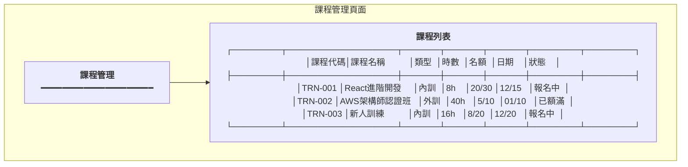
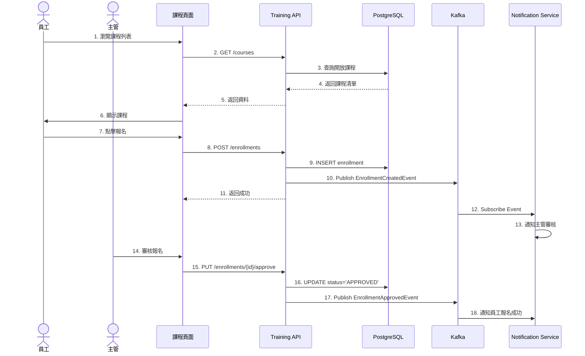
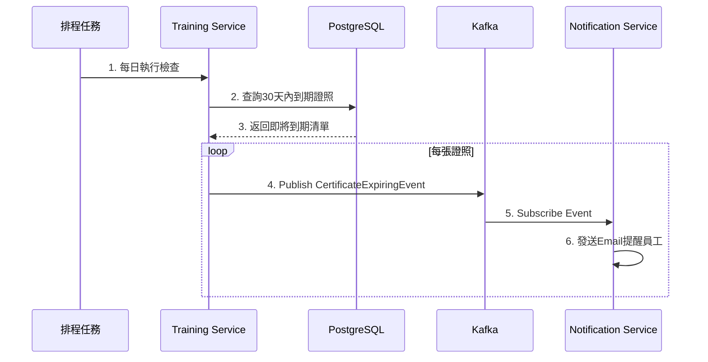

# 訓練管理服務系統設計書

**版本:** 1.0
**日期:** 2025-12-07
**Domain代號:** 10 (TRN)
**導入階段:** 第三階段（進階人資功能)

---

## 目錄

1. [服務概述](#1-服務概述)
2. [UI設計](#2-ui設計)
3. [UX流程設計](#3-ux流程設計)
4. [畫面事件說明](#4-畫面事件說明)
5. [Data Flow設計](#5-data-flow設計)
6. [資料庫設計](#6-資料庫設計)
7. [Domain設計](#7-domain設計)
8. [領域事件設計](#8-領域事件設計)
9. [API設計](#9-api設計)
10. [工項清單摘要](#10-工項清單摘要)

---

## 1. 服務概述

### 1.1 核心功能
- ✅ **訓練計畫管理:** 年度計畫、預算控管
- ✅ **課程管理:** 內訓/外訓、線上/線下
- ✅ **報名審核:** 課程報名與審核
- ✅ **訓練時數追蹤:** 法定時數合規
- ✅ **證照管理:** 證照登錄、到期提醒

---

## 2. UI設計

### 2.1 頁面清單

| 頁面代碼 | 頁面名稱 | 路由 |
|:---|:---|:---|
| `HR10-P01` | 課程管理頁面 | `/admin/training/courses` |
| `HR10-P02` | 課程報名頁面 | `/admin/training/enrollments` |
| `HR10-P03` | 我的訓練 (ESS) | `/profile/training` |
| `HR10-P04` | 證照管理頁面 | `/admin/training/certificates` |
| `HR10-P05` | 我的證照 (ESS) | `/profile/certificates` |
| `HR10-P06` | 訓練時數統計 | `/admin/training/reports` |

### 2.2 UI線稿

#### 2.2.1 課程管理頁面 (HR10-P01)



---

## 3. UX流程設計

### 3.1 課程報名流程



### 3.2 證照到期提醒流程



---

## 4. 畫面事件說明

### 4.1 課程管理頁面事件 (HR10-P01)

| 事件ID | 觸發元素 | 事件類型 | 事件處理 | 後端API |
|:---|:---|:---|:---|:---|
| `E-CRS-01` | 新增課程按鈕 | onClick | 開啟新增課程對話框 | - |
| `E-CRS-02` | 編輯按鈕 | onClick | 開啟編輯對話框 | GET /api/v1/training/courses/{id} |
| `E-CRS-03` | 關閉課程按鈕 | onClick | 關閉課程報名 | PUT /api/v1/training/courses/{id}/close |
| `E-CRS-04` | 新增課程確認 | onClick | 建立課程 | POST /api/v1/training/courses |

### 4.2 課程報名頁面事件 (HR10-P02)

| 事件ID | 觸發元素 | 事件類型 | 事件處理 | 後端API |
|:---|:---|:---|:---|:---|
| `E-ENR-01` | 報名按鈕 | onClick | 建立報名 | POST /api/v1/training/enrollments |
| `E-ENR-02` | 審核按鈕 | onClick | 審核報名 | PUT /api/v1/training/enrollments/{id}/approve |
| `E-ENR-03` | 拒絕按鈕 | onClick | 拒絕報名 | PUT /api/v1/training/enrollments/{id}/reject |
| `E-ENR-04` | 取消報名按鈕 | onClick | 取消報名 | PUT /api/v1/training/enrollments/{id}/cancel |

### 4.3 我的證照頁面事件 (HR10-P05)

| 事件ID | 觸發元素 | 事件類型 | 事件處理 | 後端API |
|:---|:---|:---|:---|:---|
| `E-CERT-01` | 新增證照按鈕 | onClick | 開啟新增證照對話框 | - |
| `E-CERT-02` | 上傳附件 | onChange | 上傳證照檔案 | POST /api/v1/training/certificates/upload |
| `E-CERT-03` | 新增證照確認 | onClick | 建立證照記錄 | POST /api/v1/training/certificates |

---

## 5. Data Flow設計

### 5.1 前端狀態管理 (Redux)

#### 5.1.1 State結構

```typescript
interface TrainingState {
  // 課程管理
  courses: {
    list: TrainingCourse[];
    currentCourse: TrainingCourse | null;
    filters: {
      type: CourseType;
      status: CourseStatus;
    };
    loading: boolean;
  };

  // 報名管理
  enrollments: {
    list: Enrollment[];
    myEnrollments: Enrollment[];
    pendingApprovals: Enrollment[];
    loading: boolean;
  };

  // 證照管理
  certificates: {
    list: Certificate[];
    expiringCertificates: Certificate[];
    loading: boolean;
  };

  // 訓練時數統計
  statistics: {
    myHours: TrainingHours;
    requiredHours: number;
    loading: boolean;
  };
}
```

#### 5.1.2 Redux Actions

```typescript
export const courseActions = {
  fetchCourses: createAsyncThunk('training/fetchCourses', async () => {
    const response = await trainingService.getCourses();
    return response;
  }),

  createCourse: createAsyncThunk('training/createCourse', async (data: CreateCourseRequest) => {
    const response = await trainingService.createCourse(data);
    return response;
  }),
};

export const enrollmentActions = {
  enrollCourse: createAsyncThunk('training/enroll', async (courseId: string) => {
    await trainingService.enroll(courseId);
    return courseId;
  }),

  approveEnrollment: createAsyncThunk('training/approveEnrollment', async (enrollmentId: string) => {
    await trainingService.approveEnrollment(enrollmentId);
    return enrollmentId;
  }),

  completeTraining: createAsyncThunk('training/complete', async ({enrollmentId, hours}: {enrollmentId: string, hours: number}) => {
    await trainingService.completeTraining(enrollmentId, hours);
    return { enrollmentId, hours };
  }),
};

export const certificateActions = {
  addCertificate: createAsyncThunk('training/addCertificate', async (data: AddCertificateRequest) => {
    const response = await trainingService.addCertificate(data);
    return response;
  }),

  fetchExpiringCertificates: createAsyncThunk('training/fetchExpiringCertificates', async () => {
    const response = await trainingService.getExpiringCertificates();
    return response;
  }),
};
```

---

## 6. 資料庫設計

```sql
-- 課程表
CREATE TABLE training_courses (
    course_id UUID PRIMARY KEY DEFAULT gen_random_uuid(),
    course_code VARCHAR(50) NOT NULL UNIQUE,
    course_name VARCHAR(255) NOT NULL,
    course_type VARCHAR(20) CHECK (course_type IN ('INTERNAL', 'EXTERNAL')),
    delivery_mode VARCHAR(20) CHECK (delivery_mode IN ('ONLINE', 'OFFLINE', 'HYBRID')),
    instructor VARCHAR(100),
    duration_hours DECIMAL(5,1) NOT NULL,
    max_participants INTEGER,
    start_date DATE,
    end_date DATE,
    location VARCHAR(255),
    cost DECIMAL(10,2) DEFAULT 0,
    status VARCHAR(20) DEFAULT 'DRAFT' CHECK (status IN ('DRAFT', 'OPEN', 'CLOSED', 'COMPLETED', 'CANCELLED')),
    created_at TIMESTAMP DEFAULT CURRENT_TIMESTAMP
);

-- 報名表
CREATE TABLE training_enrollments (
    enrollment_id UUID PRIMARY KEY DEFAULT gen_random_uuid(),
    course_id UUID NOT NULL REFERENCES training_courses(course_id),
    employee_id UUID NOT NULL,
    status VARCHAR(20) DEFAULT 'REGISTERED' CHECK (status IN ('REGISTERED', 'APPROVED', 'ATTENDED', 'COMPLETED', 'CANCELLED', 'NO_SHOW')),
    attendance BOOLEAN DEFAULT FALSE,
    completed_hours DECIMAL(5,1),
    score DECIMAL(5,2),
    created_at TIMESTAMP DEFAULT CURRENT_TIMESTAMP,
    
    CONSTRAINT uk_enrollment UNIQUE (course_id, employee_id)
);

-- 證照表
CREATE TABLE certificates (
    certificate_id UUID PRIMARY KEY DEFAULT gen_random_uuid(),
    employee_id UUID NOT NULL,
    certificate_name VARCHAR(255) NOT NULL,
    issuing_organization VARCHAR(255),
    certificate_number VARCHAR(100),
    issue_date DATE NOT NULL,
    expiry_date DATE,
    attachment_url VARCHAR(500),
    is_verified BOOLEAN DEFAULT FALSE,
    created_at TIMESTAMP DEFAULT CURRENT_TIMESTAMP
);

CREATE INDEX idx_cert_employee ON certificates(employee_id);
CREATE INDEX idx_cert_expiry ON certificates(expiry_date);
```

---

## 4. Domain設計

```java
@Entity
public class TrainingEnrollment {
    @EmbeddedId
    private EnrollmentId id;
    private UUID courseId;
    private UUID employeeId;
    
    @Enumerated(EnumType.STRING)
    private EnrollmentStatus status;
    
    private boolean attendance;
    private BigDecimal completedHours;
    
    /**
     * 確認出席
     */
    public void confirmAttendance(BigDecimal hours) {
        this.attendance = true;
        this.completedHours = hours;
        this.status = EnrollmentStatus.ATTENDED;
    }
    
    /**
     * 完成訓練
     */
    public void complete() {
        if (!this.attendance) {
            throw new DomainException("未出席無法完成");
        }
        this.status = EnrollmentStatus.COMPLETED;
        
        DomainEventPublisher.publish(new TrainingCompletedEvent(
            this.employeeId, this.courseId, this.completedHours
        ));
    }
}
```

---

## 8. 領域事件設計

### 8.1 事件清單

| 事件名稱 | 觸發時機 | 訂閱服務 | 業務影響 |
|:---|:---|:---|:---|
| `EnrollmentCreatedEvent` | 員工報名課程 | Notification | 通知主管審核 |
| `EnrollmentApprovedEvent` | 主管審核通過 | Notification | 通知員工報名成功 |
| `TrainingCompletedEvent` | 員工完成訓練 | Reporting | 更新訓練時數統計 |
| `CertificateExpiringEvent` | 證照即將到期 | Notification | 提醒員工更新證照 |

### 8.2 事件Schema

#### 8.2.1 EnrollmentCreatedEvent

```json
{
  "eventId": "uuid",
  "eventType": "EnrollmentCreated",
  "aggregateId": "enrollment-id",
  "aggregateType": "TrainingEnrollment",
  "occurredAt": "2025-12-07T10:00:00Z",
  "payload": {
    "enrollmentId": "uuid",
    "courseId": "course-uuid",
    "courseName": "React進階開發",
    "employeeId": "emp-uuid",
    "employeeName": "張三",
    "managerId": "mgr-uuid",
    "managerName": "李組長",
    "trainingHours": 8,
    "cost": 5000,
    "reason": "提升前端技術能力"
  },
  "metadata": {
    "userId": "emp-uuid",
    "userName": "張三",
    "source": "Training Service",
    "version": "1.0"
  }
}
```

#### 8.2.2 TrainingCompletedEvent

```json
{
  "eventId": "uuid",
  "eventType": "TrainingCompleted",
  "aggregateId": "enrollment-id",
  "aggregateType": "TrainingEnrollment",
  "occurredAt": "2025-12-15T17:00:00Z",
  "payload": {
    "enrollmentId": "uuid",
    "employeeId": "emp-uuid",
    "employeeName": "張三",
    "courseId": "course-uuid",
    "courseName": "React進階開發",
    "completedHours": 8,
    "completedDate": "2025-12-15",
    "score": 85,
    "passed": true
  },
  "metadata": {
    "userId": "trainer-uuid",
    "userName": "講師",
    "source": "Training Service",
    "version": "1.0"
  }
}
```

#### 8.2.3 CertificateExpiringEvent

```json
{
  "eventId": "uuid",
  "eventType": "CertificateExpiring",
  "aggregateId": "certificate-id",
  "aggregateType": "Certificate",
  "occurredAt": "2025-12-07T08:00:00Z",
  "payload": {
    "certificateId": "uuid",
    "employeeId": "emp-uuid",
    "employeeName": "張三",
    "employeeEmail": "zhang@company.com",
    "certificateName": "AWS架構師證照",
    "issuingOrganization": "Amazon",
    "issueDate": "2022-12-15",
    "expiryDate": "2026-01-15",
    "daysUntilExpiry": 30,
    "isRequired": true
  },
  "metadata": {
    "userId": "system",
    "userName": "System Scheduler",
    "source": "Training Service",
    "version": "1.0"
  }
}
```

---

## 9. API設計 (10個端點)

| 端點 | 方法 | Controller |
|:---|:---:|:---|
| `/api/v1/training/courses` | POST | HR10CourseCmdController |
| `/api/v1/training/courses` | GET | HR10CourseQryController |
| `/api/v1/training/enrollments` | POST | HR10EnrollmentCmdController |
| `/api/v1/training/enrollments/{id}/approve` | PUT | HR10EnrollmentCmdController |
| `/api/v1/training/enrollments/{id}/complete` | PUT | HR10EnrollmentCmdController |
| `/api/v1/training/my` | GET | HR10EnrollmentQryController |
| `/api/v1/training/certificates` | POST | HR10CertificateCmdController |
| `/api/v1/training/certificates` | GET | HR10CertificateQryController |
| `/api/v1/training/certificates/expiring` | GET | HR10CertificateQryController |
| `/api/v1/training/my/hours` | GET | HR10ReportQryController |

---

## 10. 工項清單摘要

### 10.1 前端開發工項 (總計: 64小時)

| 工項ID | 工項名稱 | 類別 | 工時(小時) | 負責模組 | 說明 |
|:---|:---|:---|---:|:---|:---|
| **F-TRN-01** | **課程管理頁面 (HR10-P01)** | **頁面開發** | **12** | **features/training** | |
| F-TRN-01-01 | CourseListComponent | 元件 | 3 | components/ | 課程列表表格 |
| F-TRN-01-02 | CreateCourseModal | 元件 | 4 | components/ | 新增課程對話框 |
| F-TRN-01-03 | useCourseManagement | Hook | 3 | hooks/ | 課程管理邏輯 |
| F-TRN-01-04 | 單元測試 | 測試 | 2 | __tests__/ | 元件測試 |
| **F-TRN-02** | **課程報名頁面 (HR10-P02)** | **頁面開發** | **14** | **features/training** | |
| F-TRN-02-01 | EnrollmentListComponent | 元件 | 4 | components/ | 報名列表 |
| F-TRN-02-02 | ApprovalModal | 元件 | 4 | components/ | 審核對話框 |
| F-TRN-02-03 | useEnrollment | Hook | 3 | hooks/ | 報名邏輯 |
| F-TRN-02-04 | 單元測試 | 測試 | 3 | __tests__/ | Hook測試 |
| **F-TRN-03** | **我的訓練頁面 (HR10-P03)** | **頁面開發** | **10** | **features/training** | |
| F-TRN-03-01 | MyTrainingComponent | 元件 | 4 | components/ | 我的訓練頁面 |
| F-TRN-03-02 | TrainingHistoryList | 元件 | 3 | components/ | 訓練歷程列表 |
| F-TRN-03-03 | 單元測試 | 測試 | 3 | __tests__/ | 元件測試 |
| **F-TRN-04** | **證照管理頁面 (HR10-P04/P05)** | **頁面開發** | **14** | **features/training** | |
| F-TRN-04-01 | CertificateListComponent | 元件 | 4 | components/ | 證照列表 |
| F-TRN-04-02 | AddCertificateModal | 元件 | 4 | components/ | 新增證照對話框 |
| F-TRN-04-03 | ExpiringAlert | 元件 | 2 | components/ | 到期提醒元件 |
| F-TRN-04-04 | useCertificate | Hook | 2 | hooks/ | 證照管理邏輯 |
| F-TRN-04-05 | 單元測試 | 測試 | 2 | __tests__/ | 元件測試 |
| **F-TRN-05** | **訓練時數統計頁面 (HR10-P06)** | **頁面開發** | **10** | **features/training** | |
| F-TRN-05-01 | TrainingStatistics | 元件 | 4 | components/ | 時數統計頁面 |
| F-TRN-05-02 | HoursChart | 元件 | 3 | components/ | 時數圖表 |
| F-TRN-05-03 | 單元測試 | 測試 | 3 | __tests__/ | 圖表測試 |
| **F-TRN-06** | **API & Redux整合** | **整合** | **4** | **features/training** | |
| F-TRN-06-01 | TrainingApi | API | 2 | api/ | API呼叫封裝 |
| F-TRN-06-02 | trainingSlice | Redux | 2 | store/ | State管理 |

**前端小計:** 64小時

### 10.2 後端開發工項 (總計: 56小時)

| 工項ID | 工項名稱 | 類別 | 工時(小時) | 負責模組 | 說明 |
|:---|:---|:---|---:|:---|:---|
| **B-TRN-01** | **Domain層開發** | **領域模型** | **18** | **domain** | |
| B-TRN-01-01 | TrainingCourse聚合根 | 聚合根 | 4 | domain/model | 課程管理 |
| B-TRN-01-02 | TrainingEnrollment聚合根 | 聚合根 | 5 | domain/model | 報名管理(含狀態) |
| B-TRN-01-03 | Certificate聚合根 | 聚合根 | 3 | domain/model | 證照管理 |
| B-TRN-01-04 | 領域事件定義 | 事件 | 3 | domain/event | 4個領域事件 |
| B-TRN-01-05 | Domain單元測試 | 測試 | 3 | domain/ | 100%覆蓋率 |
| **B-TRN-02** | **Repository層開發** | **持久化** | **12** | **infrastructure** | |
| B-TRN-02-01 | ITrainingCourseRepository | 介面 | 1 | domain/repository | Repository介面 |
| B-TRN-02-02 | TrainingCourseRepositoryImpl | 實作 | 3 | infrastructure/repository | MyBatis實作 |
| B-TRN-02-03 | IEnrollmentRepository | 介面 | 1 | domain/repository | Repository介面 |
| B-TRN-02-04 | EnrollmentRepositoryImpl | 實作 | 3 | infrastructure/repository | 含審核查詢 |
| B-TRN-02-05 | ICertificateRepository | 介面 | 1 | domain/repository | Repository介面 |
| B-TRN-02-06 | CertificateRepositoryImpl | 實作 | 2 | infrastructure/repository | 含到期查詢 |
| B-TRN-02-07 | Repository測試 | 測試 | 1 | infrastructure/ | 整合測試 |
| **B-TRN-03** | **Application層開發** | **應用服務** | **16** | **application** | |
| B-TRN-03-01 | CreateCourseServiceImpl | Command | 2 | application/service | 建立課程 |
| B-TRN-03-02 | EnrollCourseServiceImpl | Command | 2 | application/service | 報名課程 |
| B-TRN-03-03 | ApproveEnrollmentServiceImpl | Command | 2 | application/service | 審核報名 |
| B-TRN-03-04 | CompleteTrainingServiceImpl | Command | 2 | application/service | 完成訓練(發事件) |
| B-TRN-03-05 | AddCertificateServiceImpl | Command | 2 | application/service | 新增證照 |
| B-TRN-03-06 | GetMyTrainingsServiceImpl | Query | 2 | application/service | 查詢我的訓練 |
| B-TRN-03-07 | GetExpiringCertificatesServiceImpl | Query | 2 | application/service | 查詢到期證照 |
| B-TRN-03-08 | Service測試 | 測試 | 2 | application/ | 服務測試 |
| **B-TRN-04** | **Interface層開發** | **API** | **8** | **interface** | |
| B-TRN-04-01 | HR10CourseCmdController | Controller | 2 | interface/api | 課程Command |
| B-TRN-04-02 | HR10EnrollmentCmdController | Controller | 2 | interface/api | 報名Command |
| B-TRN-04-03 | HR10CertificateCmdController | Controller | 1 | interface/api | 證照Command |
| B-TRN-04-04 | HR10*QryController | Controller | 2 | interface/api | Query Controllers |
| B-TRN-04-05 | Request/Response DTO | DTO | 1 | interface/api | 10個端點DTO |
| **B-TRN-05** | **排程任務開發** | **排程** | **2** | **infrastructure** | |
| B-TRN-05-01 | CertificateExpiryScheduler | 排程 | 2 | infrastructure/scheduler | 每日檢查到期證照 |

**後端小計:** 56小時

### 10.3 工項總覽

| 類別 | 前端工時 | 後端工時 | 小計 |
|:---|---:|---:|---:|
| 頁面開發 | 60 | - | 60 |
| API整合 | 4 | - | 4 |
| Domain層 | - | 18 | 18 |
| Repository層 | - | 12 | 12 |
| Application層 | - | 16 | 16 |
| Interface層 | - | 8 | 8 |
| 排程任務 | - | 2 | 2 |
| **總計** | **64** | **56** | **120** |

### 10.4 人力配置建議

- **前端工程師:** 1人，預計1.5週完成 (64小時)
- **後端工程師:** 1人，預計1.5週完成 (56小時)
- **總開發週期:** 2週 (含測試與整合)

### 10.5 開發優先順序

1. **Phase 1 (Week 1):**
   - 後端: Domain層 + Repository層 + 基礎API (30小時)
   - 前端: 課程管理 + 課程報名 (26小時)

2. **Phase 2 (Week 2):**
   - 後端: Application層 + Interface層 + 排程任務 (26小時)
   - 前端: 證照管理 + 訓練時數統計 + 整合測試 (38小時)

### 10.6 技術挑戰與風險

| 挑戰項目 | 風險等級 | 解決方案 |
|:---|:---:|:---|
| 證照到期排程 | 低 | 使用Spring Scheduler |
| 訓練時數統計 | 中 | 考慮使用Read Model (CQRS) |
| 外訓課程同步 | 低 | 手動匯入，未來考慮API整合 |

---

**文件完成日期:** 2025-12-26
