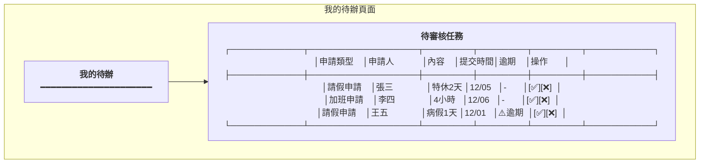
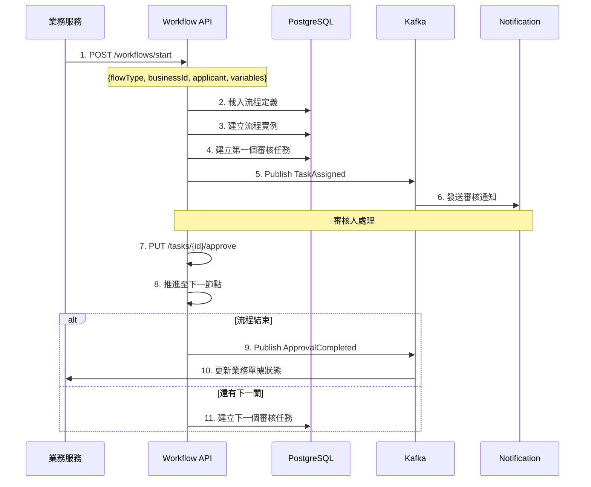
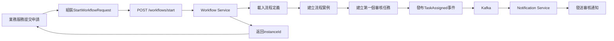
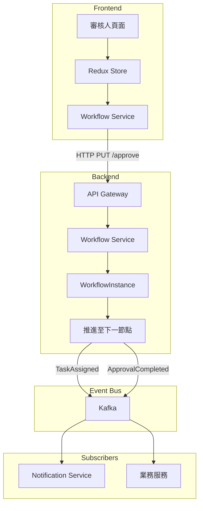

# 簽核流程服務系統設計書

**版本:** 1.0
**日期:** 2025-12-07
**Domain代號:** 11 (WKF)
**導入階段:** 第一階段(核心基礎服務)
**目標:** 提供工程師完整的系統實作規格,供PM建立工項清單

---

## 目錄

1. [服務概述](#1-服務概述)
2. [UI設計](#2-ui設計)
3. [UX流程設計](#3-ux流程設計)
4. [畫面事件說明](#4-畫面事件說明)
5. [Data Flow設計](#5-data-flow設計)
6. [資料庫設計](#6-資料庫設計)
7. [Domain設計](#7-domain設計)
8. [領域事件設計](#8-領域事件設計)
9. [API設計](#9-api設計)
10. [工項清單摘要](#10-工項清單摘要)

---

## 1. 服務概述

### 1.1 核心功能
- ✅ **流程定義:** 可視化流程設計
- ✅ **流程引擎:** 多級簽核、條件分流、平行會簽
- ✅ **代理人機制:** 請假/出差代理
- ✅ **逾時提醒:** 自動催辦

### 1.2 節點類型

| 節點類型 | 說明 |
|:---|:---|
| START | 開始節點 |
| APPROVAL | 審核節點 (單人/多人) |
| CONDITION | 條件分流 (依金額/天數等) |
| PARALLEL | 平行會簽 (需全部通過) |
| END | 結束節點 |

---

## 2. UI設計

| 頁面代碼 | 頁面名稱 | 路由 |
|:---|:---|:---|
| `HR11-P01` | 流程定義管理頁面 | `/admin/workflows/definitions` |
| `HR11-P02` | 流程設計器 | `/admin/workflows/designer/:id` |
| `HR11-P03` | 我的待辦頁面 | `/profile/tasks` |
| `HR11-P04` | 我的申請頁面 | `/profile/applications` |
| `HR11-P05` | 代理人設定頁面 | `/profile/delegation` |

### 2.1 UI線稿

#### 我的待辦頁面 (HR11-P03)



---

## 3. UX流程設計

### 3.1 審核流程執行



---

## 4. 畫面事件說明

### 4.1 我的待辦頁面事件 (HR11-P03)

| 事件ID | 觸發元素 | 事件類型 | 事件處理 | 後端API |
|:---|:---|:---|:---|:---|
| `E-WKF-01` | 頁面載入 | onMount | 載入待審核任務列表 | GET /api/v1/workflows/tasks/pending |
| `E-WKF-02` | Tab切換 | onChange | 切換任務類型篩選 | - (本地篩選) |
| `E-WKF-03` | 核准按鈕 | onClick | 開啟核准確認對話框 | - |
| `E-WKF-04` | 核准確認 | onClick | 執行核准操作 | PUT /api/v1/workflows/tasks/{id}/approve |
| `E-WKF-05` | 駁回按鈕 | onClick | 開啟駁回原因對話框 | - |
| `E-WKF-06` | 駁回確認 | onClick | 執行駁回操作 | PUT /api/v1/workflows/tasks/{id}/reject |
| `E-WKF-07` | 查看詳情 | onClick | 開啟業務單據詳情Modal | - |

**E-WKF-04 詳細流程:**
```typescript
const handleApprove = async (taskId: string) => {
  try {
    // 1. 確認操作
    const confirmed = await Modal.confirm({
      title: '確認核准',
      content: '確定要核准此申請嗎？'
    });

    if (!confirmed) return;

    // 2. 呼叫API
    setLoading(true);
    const response = await workflowService.approveTask(taskId);

    // 3. 更新Redux狀態
    dispatch(removeTask(taskId));
    dispatch(refreshPendingCount());

    // 4. 顯示結果
    message.success('核准成功！');

    // 5. 重新載入待辦列表
    dispatch(loadPendingTasks());

  } catch (error) {
    message.error('核准失敗: ' + error.message);
  } finally {
    setLoading(false);
  }
};
```

### 4.2 我的申請頁面事件 (HR11-P04)

| 事件ID | 觸發元素 | 事件類型 | 事件處理 | 後端API |
|:---|:---|:---|:---|:---|
| `E-APP-01` | 頁面載入 | onMount | 載入我的申請列表 | GET /api/v1/workflows/my/applications |
| `E-APP-02` | 狀態篩選 | onChange | 篩選申請狀態 | - (本地篩選) |
| `E-APP-03` | 查看進度 | onClick | 開啟流程進度Modal | GET /api/v1/workflows/instances/{id} |
| `E-APP-04` | 取消申請 | onClick | 取消審核中的申請 | DELETE /api/v1/workflows/instances/{id} |

### 4.3 代理人設定頁面事件 (HR11-P05)

| 事件ID | 觸發元素 | 事件類型 | 事件處理 | 後端API |
|:---|:---|:---|:---|:---|
| `E-DEL-01` | 頁面載入 | onMount | 載入代理人設定 | GET /api/v1/workflows/delegations |
| `E-DEL-02` | 新增代理人 | onClick | 開啟新增對話框 | - |
| `E-DEL-03` | 送出設定 | onClick | 建立代理人設定 | POST /api/v1/workflows/delegations |
| `E-DEL-04` | 刪除代理人 | onClick | 刪除代理人設定 | DELETE /api/v1/workflows/delegations/{id} |

### 4.4 流程設計器事件 (HR11-P02)

| 事件ID | 觸發元素 | 事件類型 | 事件處理 | 後端API |
|:---|:---|:---|:---|:---|
| `E-DSN-01` | 新增節點 | onClick | 在畫布上新增節點 | - |
| `E-DSN-02` | 連接節點 | onConnect | 建立節點間的連線 | - |
| `E-DSN-03` | 設定節點 | onClick | 開啟節點屬性設定 | - |
| `E-DSN-04` | 儲存流程 | onClick | 儲存流程定義 | POST /api/v1/workflows/definitions |
| `E-DSN-05` | 發布流程 | onClick | 發布流程為正式版本 | PUT /api/v1/workflows/definitions/{id}/publish |

---

## 5. Data Flow設計

### 5.1 前端狀態管理 (Redux)

#### 5.1.1 State結構

```typescript
interface WorkflowState {
  // 待辦任務
  tasks: {
    pendingTasks: ApprovalTask[];
    loading: boolean;
    totalCount: number;
  };

  // 我的申請
  myApplications: {
    applications: WorkflowInstance[];
    loading: boolean;
    filters: {
      status?: InstanceStatus;
      businessType?: string;
    };
  };

  // 代理人設定
  delegations: {
    list: Delegation[];
    loading: boolean;
  };

  // 流程定義 (管理員)
  definitions: {
    list: WorkflowDefinition[];
    selectedDefinition: WorkflowDefinition | null;
    loading: boolean;
  };

  // 流程實例詳情
  instanceDetail: {
    instance: WorkflowInstance | null;
    tasks: ApprovalTask[];
    timeline: WorkflowTimeline[];
    loading: boolean;
  };
}

interface ApprovalTask {
  taskId: string;
  instanceId: string;
  nodeId: string;
  businessType: string;
  businessId: string;
  applicant: {
    employeeId: string;
    fullName: string;
  };
  summary: string;
  assigneeId: string;
  status: TaskStatus;
  dueDate: string | null;
  isOverdue: boolean;
  createdAt: string;
}

interface WorkflowInstance {
  instanceId: string;
  definitionId: string;
  businessType: string;
  businessId: string;
  applicantId: string;
  currentNode: string;
  status: InstanceStatus;
  startedAt: string;
  completedAt: string | null;
}
```

#### 5.1.2 Redux Actions

```typescript
// 待辦任務Actions
export const taskActions = {
  loadPendingTasks: createAsyncThunk(
    'workflow/loadPendingTasks',
    async (employeeId: string) => {
      const response = await workflowService.getPendingTasks(employeeId);
      return response;
    }
  ),

  approveTask: createAsyncThunk(
    'workflow/approveTask',
    async (taskId: string) => {
      await workflowService.approveTask(taskId);
      return taskId;
    }
  ),

  rejectTask: createAsyncThunk(
    'workflow/rejectTask',
    async ({ taskId, reason }: { taskId: string; reason: string }) => {
      await workflowService.rejectTask(taskId, reason);
      return taskId;
    }
  ),
};

// 代理人Actions
export const delegationActions = {
  loadDelegations: createAsyncThunk(
    'workflow/loadDelegations',
    async (employeeId: string) => {
      const response = await workflowService.getDelegations(employeeId);
      return response;
    }
  ),

  createDelegation: createAsyncThunk(
    'workflow/createDelegation',
    async (request: CreateDelegationRequest) => {
      const response = await workflowService.createDelegation(request);
      return response;
    }
  ),
};
```

### 5.2 前後端資料流

#### 5.2.1 業務服務啟動流程



#### 5.2.2 審核流程推進



### 5.3 業務整合範例

```typescript
// Attendance Service 整合 Workflow
class CreateLeaveApplicationServiceImpl implements CommandApiService {
  @Autowired
  private WorkflowClient workflowClient;

  public CreateLeaveResponse execCommand(CreateLeaveRequest req) {
    // 1. 建立請假申請
    LeaveApplication leave = LeaveApplication.create(req);
    leaveRepository.save(leave);

    // 2. 啟動審核流程
    StartWorkflowRequest wfReq = new StartWorkflowRequest();
    wfReq.setFlowType("LEAVE_APPROVAL");
    wfReq.setBusinessId(leave.getId());
    wfReq.setApplicant(req.getEmployeeId());
    wfReq.setVariables(Map.of(
      "leaveType", leave.getLeaveType(),
      "totalDays", leave.getTotalDays()
    ));

    WorkflowInstance instance = workflowClient.startWorkflow(wfReq);

    // 3. 記錄workflow instance ID
    leave.setWorkflowInstanceId(instance.getInstanceId());
    leaveRepository.save(leave);

    return new CreateLeaveResponse(leave.getId(), instance.getInstanceId());
  }
}
```

---

## 6. 資料庫設計

```sql
-- 流程定義表
CREATE TABLE workflow_definitions (
    definition_id UUID PRIMARY KEY DEFAULT gen_random_uuid(),
    flow_name VARCHAR(100) NOT NULL,
    flow_type VARCHAR(50) NOT NULL UNIQUE,
    nodes JSONB NOT NULL,
    edges JSONB NOT NULL,
    is_active BOOLEAN DEFAULT TRUE,
    version INTEGER DEFAULT 1,
    created_at TIMESTAMP DEFAULT CURRENT_TIMESTAMP
);

-- 流程實例表
CREATE TABLE workflow_instances (
    instance_id UUID PRIMARY KEY DEFAULT gen_random_uuid(),
    definition_id UUID NOT NULL REFERENCES workflow_definitions(definition_id),
    business_type VARCHAR(50) NOT NULL,
    business_id UUID NOT NULL,
    applicant_id UUID NOT NULL,
    current_node VARCHAR(100),
    status VARCHAR(20) DEFAULT 'RUNNING' CHECK (status IN ('RUNNING', 'COMPLETED', 'REJECTED', 'CANCELLED')),
    started_at TIMESTAMP DEFAULT CURRENT_TIMESTAMP,
    completed_at TIMESTAMP,
    
    CONSTRAINT uk_instance UNIQUE (business_type, business_id)
);

CREATE INDEX idx_instance_status ON workflow_instances(status);
CREATE INDEX idx_instance_applicant ON workflow_instances(applicant_id);

-- 審核任務表
CREATE TABLE approval_tasks (
    task_id UUID PRIMARY KEY DEFAULT gen_random_uuid(),
    instance_id UUID NOT NULL REFERENCES workflow_instances(instance_id),
    node_id VARCHAR(100) NOT NULL,
    assignee_id UUID NOT NULL,
    delegated_to UUID,
    status VARCHAR(20) DEFAULT 'PENDING' CHECK (status IN ('PENDING', 'APPROVED', 'REJECTED')),
    comments TEXT,
    due_date TIMESTAMP,
    is_overdue BOOLEAN DEFAULT FALSE,
    created_at TIMESTAMP DEFAULT CURRENT_TIMESTAMP,
    completed_at TIMESTAMP
);

CREATE INDEX idx_task_assignee ON approval_tasks(assignee_id, status);
CREATE INDEX idx_task_instance ON approval_tasks(instance_id);

-- 代理人設定表
CREATE TABLE delegations (
    delegation_id UUID PRIMARY KEY DEFAULT gen_random_uuid(),
    delegator_id UUID NOT NULL,
    delegatee_id UUID NOT NULL,
    start_date DATE NOT NULL,
    end_date DATE NOT NULL,
    is_active BOOLEAN DEFAULT TRUE,
    created_at TIMESTAMP DEFAULT CURRENT_TIMESTAMP,
    
    CONSTRAINT uk_delegation UNIQUE (delegator_id, start_date, end_date)
);
```

---

## 7. Domain設計

### 7.1 WorkflowInstance聚合根 (流程實例)

**職責:** 管理流程實例生命週期與狀態推進

**Java實作:**
```java
@Entity
@Table(name = "workflow_instances")
public class WorkflowInstance {
    @EmbeddedId
    private InstanceId id;
    private UUID definitionId;
    private String businessType;
    private UUID businessId;
    private UUID applicantId;
    private String currentNode;
    
    @Enumerated(EnumType.STRING)
    private InstanceStatus status;
    
    /**
     * 推進到下一節點
     */
    public void advanceToNode(String nextNode) {
        this.currentNode = nextNode;
        
        if ("END".equals(nextNode)) {
            this.status = InstanceStatus.COMPLETED;
            DomainEventPublisher.publish(new ApprovalCompletedEvent(
                this.businessType,
                this.businessId
            ));
        }
    }
    
    /**
     * 駁回
     */
    public void reject(String reason) {
        this.status = InstanceStatus.REJECTED;
        DomainEventPublisher.publish(new ApprovalRejectedEvent(
            this.businessType,
            this.businessId,
            reason
        ));
    }
}
```

### 7.2 ApprovalTask聚合根 (審核任務)

**職責:** 管理審核任務的指派與處理

**Java實作:**
```java
@Entity
@Table(name = "approval_tasks")
public class ApprovalTask {
    @EmbeddedId
    private TaskId id;

    @Column(name = "instance_id", nullable = false)
    private UUID instanceId;

    @Column(name = "node_id", nullable = false)
    private String nodeId;

    @Column(name = "assignee_id", nullable = false)
    private UUID assigneeId;

    @Column(name = "delegated_to")
    private UUID delegatedTo;

    @Enumerated(EnumType.STRING)
    @Column(name = "status", nullable = false)
    private TaskStatus status;

    @Column(name = "comments")
    private String comments;

    @Column(name = "due_date")
    private LocalDateTime dueDate;

    @Column(name = "is_overdue")
    private boolean isOverdue;

    // ========== Factory Method ==========

    /**
     * 建立審核任務
     */
    public static ApprovalTask create(
            UUID instanceId,
            String nodeId,
            UUID assigneeId,
            Integer dueDays) {

        ApprovalTask task = new ApprovalTask();
        task.id = TaskId.generate();
        task.instanceId = instanceId;
        task.nodeId = nodeId;
        task.assigneeId = assigneeId;
        task.status = TaskStatus.PENDING;

        if (dueDays != null && dueDays > 0) {
            task.dueDate = LocalDateTime.now().plusDays(dueDays);
        }

        // 發布任務指派事件
        DomainEventPublisher.publish(new TaskAssignedEvent(
            task.id.getValue(),
            task.instanceId,
            task.assigneeId
        ));

        return task;
    }

    /**
     * 核准任務
     */
    public void approve(UUID approverId, String comments) {
        if (this.status != TaskStatus.PENDING) {
            throw new DomainException("只能核准待處理的任務");
        }

        this.status = TaskStatus.APPROVED;
        this.comments = comments;

        DomainEventPublisher.publish(new TaskApprovedEvent(
            this.id.getValue(),
            this.instanceId,
            approverId
        ));
    }

    /**
     * 駁回任務
     */
    public void reject(UUID approverId, String reason) {
        if (this.status != TaskStatus.PENDING) {
            throw new DomainException("只能駁回待處理的任務");
        }

        Objects.requireNonNull(reason, "駁回必須提供原因");

        this.status = TaskStatus.REJECTED;
        this.comments = reason;

        DomainEventPublisher.publish(new TaskRejectedEvent(
            this.id.getValue(),
            this.instanceId,
            approverId,
            reason
        ));
    }

    /**
     * 檢查並標記逾期
     */
    public void checkOverdue() {
        if (this.dueDate != null &&
            LocalDateTime.now().isAfter(this.dueDate) &&
            this.status == TaskStatus.PENDING) {

            this.isOverdue = true;

            DomainEventPublisher.publish(new TaskOverdueEvent(
                this.id.getValue(),
                this.instanceId,
                this.assigneeId
            ));
        }
    }
}
```

### 7.3 Delegation實體 (代理人設定)

```java
@Entity
@Table(name = "delegations")
public class Delegation {
    @EmbeddedId
    private DelegationId id;

    @Column(name = "delegator_id", nullable = false)
    private UUID delegatorId;

    @Column(name = "delegatee_id", nullable = false)
    private UUID delegateeId;

    @Column(name = "start_date", nullable = false)
    private LocalDate startDate;

    @Column(name = "end_date", nullable = false)
    private LocalDate endDate;

    @Column(name = "is_active")
    private boolean isActive;

    /**
     * 檢查是否在生效期間
     */
    public boolean isEffective(LocalDate date) {
        return isActive &&
               !date.isBefore(startDate) &&
               !date.isAfter(endDate);
    }

    /**
     * 檢查並停用過期的代理設定
     */
    public void checkExpiry() {
        if (LocalDate.now().isAfter(this.endDate)) {
            this.isActive = false;
        }
    }
}
```

---

## 8. 領域事件設計

### 8.1 事件總覽

| 事件名稱 | 觸發時機 | 訂閱服務 | 重要性 |
|:---|:---|:---|:---:|
| `TaskAssignedEvent` | 任務指派給審核人 | Notification | ⭐⭐⭐ |
| `TaskApprovedEvent` | 任務核准 | Workflow內部 | ⭐⭐ |
| `TaskRejectedEvent` | 任務駁回 | Workflow內部 | ⭐⭐ |
| `ApprovalCompletedEvent` | 流程核准完成 | 業務服務 (Attendance等) | ⭐⭐⭐⭐⭐ |
| `ApprovalRejectedEvent` | 流程駁回 | Notification, 業務服務 | ⭐⭐⭐⭐ |
| `TaskOverdueEvent` | 任務逾期 | Notification | ⭐⭐ |

### 8.2 事件Schema

#### 8.2.1 TaskAssignedEvent

```json
{
  "eventId": "evt-wkf-001",
  "eventType": "TaskAssigned",
  "timestamp": "2025-12-06T10:00:00Z",
  "payload": {
    "taskId": "550e8400-e29b-41d4-a716-446655440000",
    "instanceId": "550e8400-e29b-41d4-a716-446655440001",
    "businessType": "LEAVE_APPLICATION",
    "businessId": "app-leave-001",
    "applicant": {
      "employeeId": "emp-001",
      "fullName": "張三"
    },
    "assignee": {
      "employeeId": "mgr-001",
      "fullName": "李經理"
    },
    "taskSummary": "員工張三申請特休假2天",
    "dueDate": "2025-12-08T10:00:00Z",
    "businessUrl": "/attendance/leave/applications/app-leave-001"
  }
}
```

**訂閱者處理:**
- **Notification Service:** 發送審核通知給李經理 (Email + 系統內通知)

#### 8.2.2 ApprovalCompletedEvent (關鍵事件)

```json
{
  "eventId": "evt-wkf-002",
  "eventType": "ApprovalCompleted",
  "timestamp": "2025-12-06T15:30:00Z",
  "payload": {
    "instanceId": "550e8400-e29b-41d4-a716-446655440001",
    "businessType": "LEAVE_APPLICATION",
    "businessId": "app-leave-001",
    "applicantId": "emp-001",
    "finalApprover": {
      "employeeId": "mgr-002",
      "fullName": "王總監"
    },
    "approvalPath": [
      {
        "nodeId": "node-1",
        "approver": "李經理",
        "approvedAt": "2025-12-06T11:00:00Z"
      },
      {
        "nodeId": "node-2",
        "approver": "王總監",
        "approvedAt": "2025-12-06T15:30:00Z"
      }
    ],
    "totalDuration": "5.5h"
  }
}
```

**訂閱者處理:**
- **Attendance Service:** 將請假申請狀態更新為 `APPROVED`
- **Notification Service:** 通知申請人審核通過

#### 8.2.3 ApprovalRejectedEvent

```json
{
  "eventId": "evt-wkf-003",
  "eventType": "ApprovalRejected",
  "timestamp": "2025-12-06T12:00:00Z",
  "payload": {
    "instanceId": "550e8400-e29b-41d4-a716-446655440002",
    "businessType": "OVERTIME_APPLICATION",
    "businessId": "ot-002",
    "applicantId": "emp-003",
    "rejectedBy": {
      "employeeId": "mgr-001",
      "fullName": "李經理"
    },
    "rejectedAt": "2025-12-06T12:00:00Z",
    "rejectionReason": "加班時數已達本月上限",
    "nodeId": "node-1"
  }
}
```

**訂閱者處理:**
- **Overtime Service:** 將加班申請狀態更新為 `REJECTED`
- **Notification Service:** 通知申請人駁回原因

#### 8.2.4 TaskOverdueEvent

```json
{
  "eventId": "evt-wkf-004",
  "eventType": "TaskOverdue",
  "timestamp": "2025-12-08T10:00:00Z",
  "payload": {
    "taskId": "550e8400-e29b-41d4-a716-446655440003",
    "instanceId": "550e8400-e29b-41d4-a716-446655440004",
    "businessType": "LEAVE_APPLICATION",
    "businessId": "app-leave-005",
    "assignee": {
      "employeeId": "mgr-001",
      "fullName": "李經理"
    },
    "dueDate": "2025-12-08T10:00:00Z",
    "overdueHours": 2,
    "applicant": {
      "employeeId": "emp-005",
      "fullName": "趙六"
    }
  }
}
```

**訂閱者處理:**
- **Notification Service:** 發送逾期提醒給審核人及其主管

---

## 9. API設計 (10個端點)

| 端點 | 方法 | Controller |
|:---|:---:|:---|
| `/api/v1/workflows/definitions` | POST | HR11DefinitionCmdController |
| `/api/v1/workflows/definitions` | GET | HR11DefinitionQryController |
| `/api/v1/workflows/start` | POST | HR11InstanceCmdController |
| `/api/v1/workflows/instances/{id}` | GET | HR11InstanceQryController |
| `/api/v1/workflows/tasks/pending` | GET | HR11TaskQryController |
| `/api/v1/workflows/tasks/{id}/approve` | PUT | HR11TaskCmdController |
| `/api/v1/workflows/tasks/{id}/reject` | PUT | HR11TaskCmdController |
| `/api/v1/workflows/my/applications` | GET | HR11InstanceQryController |
| `/api/v1/workflows/delegations` | POST | HR11DelegationCmdController |
| `/api/v1/workflows/delegations` | GET | HR11DelegationQryController |

---

## 10. 工項清單摘要

### 10.1 前端開發工項

| 工項編號 | 工項名稱 | 說明 | 預估工時 (人天) |
|:---|:---|:---|---:|
| FE-WKF-01 | HR11-P01 流程定義管理頁面 | 流程列表、啟用/停用 | 2 |
| FE-WKF-02 | HR11-P02 流程設計器 | 可視化流程設計器 (React Flow) | 8 |
| FE-WKF-03 | HR11-P03 我的待辦頁面 | 待審核任務列表、核准/駁回 | 3 |
| FE-WKF-04 | HR11-P04 我的申請頁面 | 申請進度追蹤 | 2 |
| FE-WKF-05 | HR11-P05 代理人設定頁面 | 代理人CRUD | 2 |
| FE-WKF-06 | 流程進度Modal | 顯示審核時間軸 | 1 |
| FE-WKF-07 | Redux狀態管理 | Workflow State、Actions | 2 |
| FE-WKF-08 | API Service層 | WorkflowService、API封裝 | 1 |
| FE-WKF-09 | Factory層 | ViewModel轉換 | 1 |
| FE-WKF-10 | 單元測試 | Factory、Component測試 | 2 |
| **小計** | | | **24人天** |

### 10.2 後端開發工項

| 工項編號 | 工項名稱 | 說明 | 預估工時 (人天) |
|:---|:---|:---|---:|
| BE-WKF-01 | WorkflowInstance聚合根 | 流程實例Domain邏輯 | 3 |
| BE-WKF-02 | ApprovalTask聚合根 | 審核任務Domain邏輯 | 3 |
| BE-WKF-03 | Delegation實體 | 代理人設定 | 1 |
| BE-WKF-04 | Repository層 | Instance、Task、Delegation Repository | 2 |
| BE-WKF-05 | 流程定義管理API | 建立/查詢/發布流程定義 (2端點) | 2 |
| BE-WKF-06 | 流程啟動API | 啟動流程、查詢實例 (2端點) | 3 |
| BE-WKF-07 | 任務審核API | 核准/駁回/查詢待辦 (3端點) | 3 |
| BE-WKF-08 | 代理人API | 代理人CRUD (2端點) | 1 |
| BE-WKF-09 | 我的申請API | 查詢我的申請 (1端點) | 1 |
| BE-WKF-10 | 流程引擎Service | 節點推進、條件分流、平行會簽邏輯 | 5 |
| BE-WKF-11 | 事件發布 | 6個領域事件 | 2 |
| BE-WKF-12 | 逾期檢查Job | Quartz定時任務 | 1 |
| BE-WKF-13 | 單元測試 | Domain層100%覆蓋率 | 3 |
| BE-WKF-14 | 整合測試 | API端點測試 | 2 |
| **小計** | | | **32人天** |

### 10.3 測試工項

| 工項編號 | 工項名稱 | 說明 | 預估工時 (人天) |
|:---|:---|:---|---:|
| TEST-WKF-01 | Domain單元測試 | WorkflowInstance、ApprovalTask | 2 |
| TEST-WKF-02 | API整合測試 | 10個端點 | 2 |
| TEST-WKF-03 | 流程引擎測試 | 多級簽核、條件分流、平行會簽 | 3 |
| TEST-WKF-04 | 事件發布測試 | 6個事件Schema驗證 | 1 |
| TEST-WKF-05 | E2E測試 | 完整審核流程 | 2 |
| **小計** | | | **10人天** |

### 10.4 文件工項

| 工項編號 | 工項名稱 | 預估工時 (人天) |
|:---|:---|---:|
| DOC-WKF-01 | API文件 (Swagger) | 1 |
| DOC-WKF-02 | 流程設計器使用手冊 | 1 |
| DOC-WKF-03 | 業務整合指南 | 1 |
| **小計** | | **3人天** |

### 10.5 總工時估計

| 類別 | 工時 (人天) |
|:---|---:|
| 前端開發 | 24 |
| 後端開發 | 32 |
| 測試 | 10 |
| 文件 | 3 |
| **總計** | **69人天** |

**備註:**
- 流程設計器為技術難點,建議使用成熟的第三方庫 (React Flow、bpmn-js)
- 流程引擎需支援動態載入流程定義,避免硬編碼
- 建議分兩階段實作:
  - **階段一:** 基礎審核流程 (單人審核、多級審核) - 40人天
  - **階段二:** 進階功能 (條件分流、平行會簽、可視化設計器) - 29人天

---

**文件完成日期:** 2025-12-26
