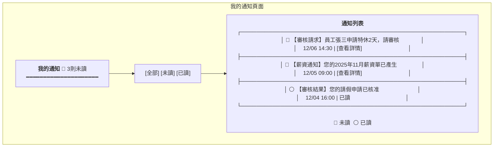
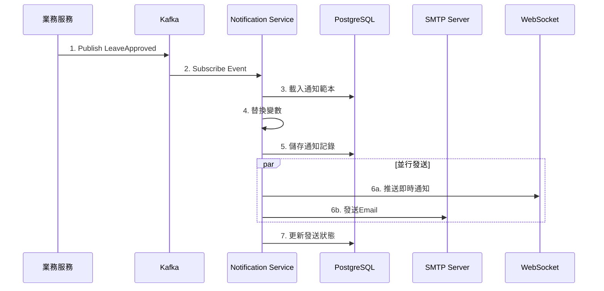

# 通知服務系統設計書

**版本:** 1.0
**日期:** 2025-12-07
**Domain代號:** 12 (NTF)
**導入階段:** 第一階段(核心基礎服務)
**目標:** 提供工程師完整的系統實作規格,供PM建立工項清單

---

## 目錄

1. [服務概述](#1-服務概述)
2. [UI設計](#2-ui設計)
3. [Event-Driven架構](#3-event-driven架構)
4. [資料庫設計](#4-資料庫設計)
5. [自動提醒Job](#5-自動提醒job)
6. [API設計](#6-api設計)
7. [Domain設計](#7-domain設計)
8. [領域事件設計](#8-領域事件設計)
9. [事件訂閱實作範例](#9-事件訂閱實作範例)
10. [工項清單摘要](#10-工項清單摘要)

---

## 1. 服務概述

### 1.1 核心功能
- ✅ **多渠道通知:** Email、系統訊息、推播、Teams/LINE
- ✅ **通知範本:** 變數替換、多語系
- ✅ **事件訂閱:** 訂閱所有業務事件發送通知
- ✅ **自動提醒Job:** 生日、合約到期、證照到期
- ✅ **通知偏好:** 使用者個人設定

### 1.2 通知渠道

| 渠道 | 技術 | 說明 |
|:---|:---|:---|
| IN_APP | WebSocket | 即時系統內通知 |
| EMAIL | Spring Mail + SMTP | HTML郵件 |
| PUSH | Firebase FCM | iOS/Android推播 |
| TEAMS | Webhook | Microsoft Teams整合 |
| LINE | LINE Notify API | LINE整合 |

---

## 2. UI設計

| 頁面代碼 | 頁面名稱 | 路由 |
|:---|:---|:---|
| `HR12-P01` | 通知範本管理頁面 | `/admin/notifications/templates` |
| `HR12-P02` | 我的通知頁面 | `/profile/notifications` |
| `HR12-P03` | 通知偏好設定頁面 | `/profile/notification-settings` |

### 2.1 UI線稿

#### 我的通知頁面 (HR12-P02)



---

## 3. Event-Driven架構 (事件驅動)

### 3.1 事件訂閱對照表

| 業務事件 | 通知對象 | 範本代碼 | 渠道 |
|:---|:---|:---|:---|
| `LeaveApplied` | 直屬主管 | LEAVE_APPROVAL_REQUEST | IN_APP, EMAIL |
| `LeaveApproved` | 申請人 | LEAVE_APPROVED | IN_APP, EMAIL |
| `LeaveRejected` | 申請人 | LEAVE_REJECTED | IN_APP, EMAIL |
| `PayslipGenerated` | 員工 | PAYSLIP_READY | IN_APP, EMAIL |
| `TaskAssigned` | 審核人 | APPROVAL_REQUEST | IN_APP, EMAIL |
| `CertificateExpiring` | 員工 | CERTIFICATE_EXPIRY | IN_APP, EMAIL |
| `ContractExpiring` | HR | CONTRACT_EXPIRY | IN_APP, EMAIL |

### 3.2 事件處理流程



---

## 4. 資料庫設計

```sql
-- 通知範本表
CREATE TABLE notification_templates (
    template_id UUID PRIMARY KEY DEFAULT gen_random_uuid(),
    template_code VARCHAR(100) NOT NULL UNIQUE,
    template_name VARCHAR(255) NOT NULL,
    subject VARCHAR(500),
    body TEXT NOT NULL,
    default_channels JSONB DEFAULT '["IN_APP"]',
    is_active BOOLEAN DEFAULT TRUE,
    created_at TIMESTAMP DEFAULT CURRENT_TIMESTAMP
);

-- 通知記錄表
CREATE TABLE notifications (
    notification_id UUID PRIMARY KEY DEFAULT gen_random_uuid(),
    recipient_id UUID NOT NULL,
    title VARCHAR(500) NOT NULL,
    content TEXT NOT NULL,
    notification_type VARCHAR(30) NOT NULL 
        CHECK (notification_type IN ('APPROVAL_REQUEST', 'APPROVAL_RESULT', 'REMINDER', 'ANNOUNCEMENT', 'ALERT')),
    channels JSONB DEFAULT '["IN_APP"]',
    priority VARCHAR(20) DEFAULT 'NORMAL' CHECK (priority IN ('LOW', 'NORMAL', 'HIGH', 'URGENT')),
    status VARCHAR(20) DEFAULT 'PENDING' CHECK (status IN ('PENDING', 'SENT', 'FAILED', 'READ')),
    sent_at TIMESTAMP,
    read_at TIMESTAMP,
    related_business_type VARCHAR(50),
    related_business_id UUID,
    created_at TIMESTAMP DEFAULT CURRENT_TIMESTAMP
);

CREATE INDEX idx_notification_recipient ON notifications(recipient_id, status);
CREATE INDEX idx_notification_created ON notifications(created_at DESC);

-- 通知偏好設定表
CREATE TABLE notification_preferences (
    preference_id UUID PRIMARY KEY DEFAULT gen_random_uuid(),
    employee_id UUID NOT NULL UNIQUE,
    email_enabled BOOLEAN DEFAULT TRUE,
    push_enabled BOOLEAN DEFAULT TRUE,
    in_app_enabled BOOLEAN DEFAULT TRUE,
    quiet_hours_start TIME,
    quiet_hours_end TIME,
    updated_at TIMESTAMP DEFAULT CURRENT_TIMESTAMP
);
```

---

## 5. 自動提醒Job

| Job名稱 | 執行頻率 | 觸發事件 |
|:---|:---|:---|
| `BirthdayReminderJob` | 每日08:00 | 發送當日生日祝福 |
| `ContractExpiryJob` | 每日09:00 | 合約30天內到期提醒HR |
| `CertificateExpiryJob` | 每週一 | 證照30天內到期提醒員工 |
| `AnnualLeaveExpiryJob` | 每週一 | 特休30天內到期提醒 |
| `TimesheetReminderJob` | 每日18:00 | 未回報工時提醒 |

---

## 6. API設計 (8個端點)

| 端點 | 方法 | Controller |
|:---|:---:|:---|
| `/api/v1/notifications/send` | POST | HR12NotificationCmdController |
| `/api/v1/notifications/me` | GET | HR12NotificationQryController |
| `/api/v1/notifications/{id}/read` | PUT | HR12NotificationCmdController |
| `/api/v1/notifications/read-all` | PUT | HR12NotificationCmdController |
| `/api/v1/notifications/unread-count` | GET | HR12NotificationQryController |
| `/api/v1/notifications/templates` | POST | HR12TemplateCmdController |
| `/api/v1/notifications/templates` | GET | HR12TemplateQryController |
| `/api/v1/notifications/preferences` | PUT | HR12PreferenceCmdController |

---

## 7. Domain設計

### 7.1 Notification聚合根 (通知)

**職責:** 管理通知的建立、發送與狀態追蹤

**Java實作:**
```java
@Entity
@Table(name = "notifications")
public class Notification {
    @EmbeddedId
    private NotificationId id;

    @Column(name = "recipient_id", nullable = false)
    private UUID recipientId;

    @Column(name = "title", nullable = false, length = 500)
    private String title;

    @Column(name = "content", nullable = false, columnDefinition = "TEXT")
    private String content;

    @Enumerated(EnumType.STRING)
    @Column(name = "notification_type", nullable = false)
    private NotificationType notificationType;

    @Convert(converter = ChannelListConverter.class)
    @Column(name = "channels", columnDefinition = "JSONB")
    private List<NotificationChannel> channels;

    @Enumerated(EnumType.STRING)
    @Column(name = "priority", nullable = false)
    private Priority priority;

    @Enumerated(EnumType.STRING)
    @Column(name = "status", nullable = false)
    private NotificationStatus status;

    @Column(name = "sent_at")
    private LocalDateTime sentAt;

    @Column(name = "read_at")
    private LocalDateTime readAt;

    @Column(name = "related_business_type", length = 50)
    private String relatedBusinessType;

    @Column(name = "related_business_id")
    private UUID relatedBusinessId;

    // ========== Factory Method ==========

    /**
     * 建立通知
     */
    public static Notification create(
            UUID recipientId,
            String title,
            String content,
            NotificationType type,
            List<NotificationChannel> channels,
            Priority priority) {

        Notification notification = new Notification();
        notification.id = NotificationId.generate();
        notification.recipientId = recipientId;
        notification.title = Objects.requireNonNull(title, "標題不可為空");
        notification.content = Objects.requireNonNull(content, "內容不可為空");
        notification.notificationType = type;
        notification.channels = channels != null ? channels : List.of(NotificationChannel.IN_APP);
        notification.priority = priority != null ? priority : Priority.NORMAL;
        notification.status = NotificationStatus.PENDING;

        // 發布通知建立事件
        DomainEventPublisher.publish(new NotificationCreatedEvent(
            notification.id.getValue(),
            notification.recipientId,
            notification.channels
        ));

        return notification;
    }

    /**
     * 標記為已發送
     */
    public void markAsSent() {
        if (this.status != NotificationStatus.PENDING) {
            throw new DomainException("只有待發送的通知可以標記為已發送");
        }

        this.status = NotificationStatus.SENT;
        this.sentAt = LocalDateTime.now();
    }

    /**
     * 標記發送失敗
     */
    public void markAsFailed(String errorMessage) {
        this.status = NotificationStatus.FAILED;
        // 記錄錯誤日誌
        DomainEventPublisher.publish(new NotificationFailedEvent(
            this.id.getValue(),
            this.recipientId,
            errorMessage
        ));
    }

    /**
     * 標記為已讀
     */
    public void markAsRead() {
        if (this.status != NotificationStatus.SENT) {
            throw new DomainException("只有已發送的通知可以標記為已讀");
        }

        this.status = NotificationStatus.READ;
        this.readAt = LocalDateTime.now();

        DomainEventPublisher.publish(new NotificationReadEvent(
            this.id.getValue(),
            this.recipientId
        ));
    }

    /**
     * 設定業務關聯
     */
    public void setBusinessRelation(String businessType, UUID businessId) {
        this.relatedBusinessType = businessType;
        this.relatedBusinessId = businessId;
    }

    /**
     * 檢查是否未讀
     */
    public boolean isUnread() {
        return this.status == NotificationStatus.SENT;
    }
}

// 值對象
public enum NotificationType {
    APPROVAL_REQUEST,    // 審核請求
    APPROVAL_RESULT,     // 審核結果
    REMINDER,            // 提醒
    ANNOUNCEMENT,        // 公告
    ALERT                // 警示
}

public enum NotificationChannel {
    IN_APP,   // 系統內通知
    EMAIL,    // Email
    PUSH,     // 推播
    TEAMS,    // Microsoft Teams
    LINE      // LINE
}

public enum Priority {
    LOW,
    NORMAL,
    HIGH,
    URGENT
}

public enum NotificationStatus {
    PENDING,   // 待發送
    SENT,      // 已發送
    FAILED,    // 發送失敗
    READ       // 已讀
}
```

### 7.2 NotificationTemplate實體 (通知範本)

```java
@Entity
@Table(name = "notification_templates")
public class NotificationTemplate {
    @EmbeddedId
    private TemplateId id;

    @Column(name = "template_code", nullable = false, unique = true, length = 100)
    private String templateCode;

    @Column(name = "template_name", nullable = false, length = 255)
    private String templateName;

    @Column(name = "subject", length = 500)
    private String subject;

    @Column(name = "body", nullable = false, columnDefinition = "TEXT")
    private String body;

    @Convert(converter = ChannelListConverter.class)
    @Column(name = "default_channels", columnDefinition = "JSONB")
    private List<NotificationChannel> defaultChannels;

    @Column(name = "is_active")
    private boolean isActive;

    /**
     * 替換變數
     */
    public String renderContent(Map<String, Object> variables) {
        String rendered = this.body;

        for (Map.Entry<String, Object> entry : variables.entrySet()) {
            String placeholder = "{{" + entry.getKey() + "}}";
            rendered = rendered.replace(placeholder, String.valueOf(entry.getValue()));
        }

        return rendered;
    }

    /**
     * 替換主旨變數
     */
    public String renderSubject(Map<String, Object> variables) {
        if (this.subject == null) return null;

        String rendered = this.subject;
        for (Map.Entry<String, Object> entry : variables.entrySet()) {
            String placeholder = "{{" + entry.getKey() + "}}";
            rendered = rendered.replace(placeholder, String.valueOf(entry.getValue()));
        }

        return rendered;
    }
}
```

### 7.3 NotificationPreference實體 (通知偏好)

```java
@Entity
@Table(name = "notification_preferences")
public class NotificationPreference {
    @EmbeddedId
    private PreferenceId id;

    @Column(name = "employee_id", nullable = false, unique = true)
    private UUID employeeId;

    @Column(name = "email_enabled")
    private boolean emailEnabled;

    @Column(name = "push_enabled")
    private boolean pushEnabled;

    @Column(name = "in_app_enabled")
    private boolean inAppEnabled;

    @Column(name = "quiet_hours_start")
    private LocalTime quietHoursStart;

    @Column(name = "quiet_hours_end")
    private LocalTime quietHoursEnd;

    /**
     * 過濾通知渠道
     */
    public List<NotificationChannel> filterChannels(List<NotificationChannel> requestedChannels) {
        List<NotificationChannel> filtered = new ArrayList<>();

        for (NotificationChannel channel : requestedChannels) {
            if (isChannelEnabled(channel)) {
                filtered.add(channel);
            }
        }

        // 至少保留系統內通知
        if (filtered.isEmpty()) {
            filtered.add(NotificationChannel.IN_APP);
        }

        return filtered;
    }

    private boolean isChannelEnabled(NotificationChannel channel) {
        return switch (channel) {
            case EMAIL -> emailEnabled;
            case PUSH -> pushEnabled;
            case IN_APP -> inAppEnabled;
            default -> true; // TEAMS, LINE 預設開啟
        };
    }

    /**
     * 檢查是否在靜音時段
     */
    public boolean isInQuietHours() {
        if (quietHoursStart == null || quietHoursEnd == null) {
            return false;
        }

        LocalTime now = LocalTime.now();
        return !now.isBefore(quietHoursStart) && !now.isAfter(quietHoursEnd);
    }
}
```

---

## 8. 領域事件設計

### 8.1 事件總覽

| 事件名稱 | 觸發時機 | 訂閱服務 | 重要性 |
|:---|:---|:---|:---:|
| `NotificationCreatedEvent` | 通知建立 | Notification內部 | ⭐⭐ |
| `NotificationSentEvent` | 通知發送成功 | Notification內部 | ⭐⭐ |
| `NotificationFailedEvent` | 通知發送失敗 | Monitoring | ⭐⭐⭐ |
| `NotificationReadEvent` | 通知已讀 | Notification內部 | ⭐ |

**注意:** Notification Service主要作為**事件訂閱者**,訂閱其他業務服務的事件,較少發布自己的領域事件。

### 8.2 訂閱的業務事件

Notification Service訂閱以下業務事件並發送通知:

| 業務事件 | 來源服務 | 通知對象 | 範本代碼 |
|:---|:---|:---|:---|
| `LeaveAppliedEvent` | Attendance | 直屬主管 | LEAVE_APPROVAL_REQUEST |
| `LeaveApprovedEvent` | Attendance | 申請人 | LEAVE_APPROVED |
| `LeaveRejectedEvent` | Attendance | 申請人 | LEAVE_REJECTED |
| `PayslipGeneratedEvent` | Payroll | 員工 | PAYSLIP_READY |
| `TaskAssignedEvent` | Workflow | 審核人 | APPROVAL_REQUEST |
| `EmployeeCreatedEvent` | Organization | 新員工 | WELCOME_MESSAGE |
| `ContractExpiringEvent` | Organization | HR | CONTRACT_EXPIRY |
| `CertificateExpiringEvent` | Training | 員工 | CERTIFICATE_EXPIRY |

### 8.3 事件Schema

#### 8.3.1 NotificationCreatedEvent

```json
{
  "eventId": "evt-ntf-001",
  "eventType": "NotificationCreated",
  "timestamp": "2025-12-06T10:00:00Z",
  "payload": {
    "notificationId": "550e8400-e29b-41d4-a716-446655440000",
    "recipientId": "emp-001",
    "channels": ["IN_APP", "EMAIL"],
    "priority": "NORMAL"
  }
}
```

#### 8.3.2 NotificationFailedEvent (關鍵事件)

```json
{
  "eventId": "evt-ntf-002",
  "eventType": "NotificationFailed",
  "timestamp": "2025-12-06T10:05:00Z",
  "payload": {
    "notificationId": "550e8400-e29b-41d4-a716-446655440001",
    "recipientId": "emp-002",
    "channel": "EMAIL",
    "errorCode": "SMTP_CONNECTION_FAILED",
    "errorMessage": "SMTP伺服器連線逾時",
    "retryCount": 3,
    "willRetry": false
  }
}
```

**訂閱者處理:**
- **Monitoring Service:** 記錄錯誤日誌、發送告警

---

## 9. 事件訂閱實作範例

### 9.1 訂閱LeaveApprovedEvent發送通知

```java
@Service
@Slf4j
public class LeaveEventListener {
    @Autowired
    private INotificationTemplateRepository templateRepository;

    @Autowired
    private NotificationSender notificationSender;

    @Autowired
    private INotificationPreferenceRepository preferenceRepository;

    @KafkaListener(topics = "leave.approved")
    public void handleLeaveApproved(LeaveApprovedEvent event) {
        try {
            // 1. 載入通知範本
            NotificationTemplate template = templateRepository
                .findByTemplateCode("LEAVE_APPROVED");

            // 2. 準備變數
            Map<String, Object> variables = Map.of(
                "employeeName", event.getEmployeeName(),
                "leaveType", event.getLeaveTypeName(),
                "startDate", event.getStartDate(),
                "endDate", event.getEndDate(),
                "totalDays", event.getTotalDays()
            );

            // 3. 渲染內容
            String title = "請假申請已核准";
            String content = template.renderContent(variables);

            // 4. 檢查用戶偏好
            NotificationPreference preference = preferenceRepository
                .findByEmployeeId(event.getEmployeeId());

            List<NotificationChannel> channels = preference.filterChannels(
                List.of(NotificationChannel.IN_APP, NotificationChannel.EMAIL)
            );

            // 5. 建立通知
            Notification notification = Notification.create(
                event.getEmployeeId(),
                title,
                content,
                NotificationType.APPROVAL_RESULT,
                channels,
                Priority.NORMAL
            );

            notification.setBusinessRelation("LEAVE_APPLICATION", event.getApplicationId());

            notificationRepository.save(notification);

            // 6. 發送通知
            notificationSender.send(notification);

            log.info("Successfully sent leave approved notification to employee: {}", 
                event.getEmployeeId());

        } catch (Exception e) {
            log.error("Failed to send leave approved notification", e);
        }
    }
}
```

### 9.2 多渠道發送Service

```java
@Service
public class NotificationSender {
    @Autowired
    private EmailSender emailSender;

    @Autowired
    private WebSocketSender webSocketSender;

    @Autowired
    private PushNotificationSender pushSender;

    @Autowired
    private INotificationRepository notificationRepository;

    public void send(Notification notification) {
        boolean allSuccess = true;

        for (NotificationChannel channel : notification.getChannels()) {
            try {
                switch (channel) {
                    case IN_APP -> sendInApp(notification);
                    case EMAIL -> sendEmail(notification);
                    case PUSH -> sendPush(notification);
                    case TEAMS -> sendTeams(notification);
                    case LINE -> sendLine(notification);
                }
            } catch (Exception e) {
                log.error("Failed to send via {}: {}", channel, e.getMessage());
                allSuccess = false;
            }
        }

        if (allSuccess) {
            notification.markAsSent();
        } else {
            notification.markAsFailed("部分渠道發送失敗");
        }

        notificationRepository.save(notification);
    }

    private void sendInApp(Notification notification) {
        // WebSocket 即時推送
        webSocketSender.sendToUser(
            notification.getRecipientId(),
            notification
        );
    }

    private void sendEmail(Notification notification) {
        emailSender.send(
            notification.getRecipientId(),
            notification.getTitle(),
            notification.getContent()
        );
    }

    private void sendPush(Notification notification) {
        pushSender.send(
            notification.getRecipientId(),
            notification.getTitle(),
            notification.getContent()
        );
    }
}
```

---

## 10. 工項清單摘要

### 10.1 前端開發工項

| 工項編號 | 工項名稱 | 說明 | 預估工時 (人天) |
|:---|:---|:---|---:|
| FE-NTF-01 | HR12-P01 通知範本管理頁面 | 範本CRUD | 2 |
| FE-NTF-02 | HR12-P02 我的通知頁面 | 通知列表、已讀/未讀 | 3 |
| FE-NTF-03 | HR12-P03 通知偏好設定頁面 | 偏好設定CRUD | 2 |
| FE-NTF-04 | 通知中心Widget | 頂部通知鈴鐺、下拉列表 | 2 |
| FE-NTF-05 | WebSocket整合 | 即時通知推送 | 2 |
| FE-NTF-06 | Redux狀態管理 | Notification State、Actions | 1 |
| FE-NTF-07 | API Service層 | NotificationService、API封裝 | 1 |
| FE-NTF-08 | Factory層 | ViewModel轉換 | 1 |
| FE-NTF-09 | 單元測試 | Factory、Component測試 | 1 |
| **小計** | | | **15人天** |

### 10.2 後端開發工項

| 工項編號 | 工項名稱 | 說明 | 預估工時 (人天) |
|:---|:---|:---|---:|
| BE-NTF-01 | Notification聚合根 | 通知Domain邏輯 | 2 |
| BE-NTF-02 | NotificationTemplate實體 | 範本管理、變數替換 | 2 |
| BE-NTF-03 | NotificationPreference實體 | 偏好設定邏輯 | 1 |
| BE-NTF-04 | Repository層 | 3個Repository | 1 |
| BE-NTF-05 | 通知API | 查詢/已讀API (5端點) | 2 |
| BE-NTF-06 | 範本管理API | 範本CRUD (2端點) | 1 |
| BE-NTF-07 | 偏好設定API | 偏好CRUD (1端點) | 1 |
| BE-NTF-08 | 多渠道發送Service | Email/Push/Teams/LINE整合 | 5 |
| BE-NTF-09 | 事件訂閱Listener | 訂閱8個業務事件 | 4 |
| BE-NTF-10 | WebSocket支援 | STOMP協定即時推送 | 3 |
| BE-NTF-11 | 自動提醒Job | 5個定時任務 (生日、合約到期等) | 3 |
| BE-NTF-12 | Email範本引擎 | Thymeleaf HTML範本 | 2 |
| BE-NTF-13 | 單元測試 | Domain層100%覆蓋率 | 2 |
| BE-NTF-14 | 整合測試 | API端點測試 | 2 |
| **小計** | | | **31人天** |

### 10.3 第三方整合工項

| 工項編號 | 工項名稱 | 說明 | 預估工時 (人天) |
|:---|:---|:---|---:|
| INT-NTF-01 | SMTP Email整合 | Spring Mail設定 | 1 |
| INT-NTF-02 | Firebase FCM整合 | iOS/Android推播 | 3 |
| INT-NTF-03 | Microsoft Teams Webhook | Teams通知 | 2 |
| INT-NTF-04 | LINE Notify API | LINE通知 | 2 |
| **小計** | | | **8人天** |

### 10.4 測試工項

| 工項編號 | 工項名稱 | 說明 | 預估工時 (人天) |
|:---|:---|:---|---:|
| TEST-NTF-01 | Domain單元測試 | Notification、Template、Preference | 2 |
| TEST-NTF-02 | API整合測試 | 8個端點 | 1 |
| TEST-NTF-03 | 事件訂閱測試 | 8個Listener | 2 |
| TEST-NTF-04 | 多渠道發送測試 | Mock第三方服務 | 2 |
| TEST-NTF-05 | E2E測試 | 完整通知流程 | 2 |
| **小計** | | | **9人天** |

### 10.5 文件工項

| 工項編號 | 工項名稱 | 預估工時 (人天) |
|:---|:---|---:|
| DOC-NTF-01 | API文件 (Swagger) | 1 |
| DOC-NTF-02 | 通知範本開發指南 | 1 |
| DOC-NTF-03 | 第三方整合文件 | 1 |
| **小計** | | **3人天** |

### 10.6 總工時估計

| 類別 | 工時 (人天) |
|:---|---:|
| 前端開發 | 15 |
| 後端開發 | 31 |
| 第三方整合 | 8 |
| 測試 | 9 |
| 文件 | 3 |
| **總計** | **66人天** |

**備註:**
- Email範本建議使用Thymeleaf,支援HTML格式與變數替換
- WebSocket連線管理需考慮斷線重連機制
- 第三方服務整合建議實作重試機制與降級策略
- 建議分兩階段實作:
  - **階段一:** 基礎通知 (系統內通知 + Email) - 35人天
  - **階段二:** 進階功能 (Push + Teams + LINE + 自動提醒) - 31人天

---

**文件完成日期:** 2025-12-26
