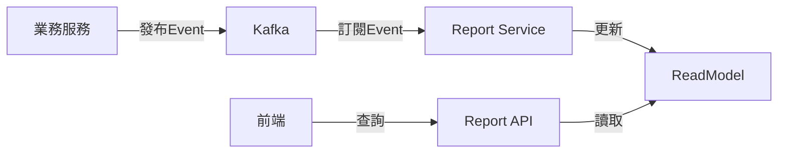
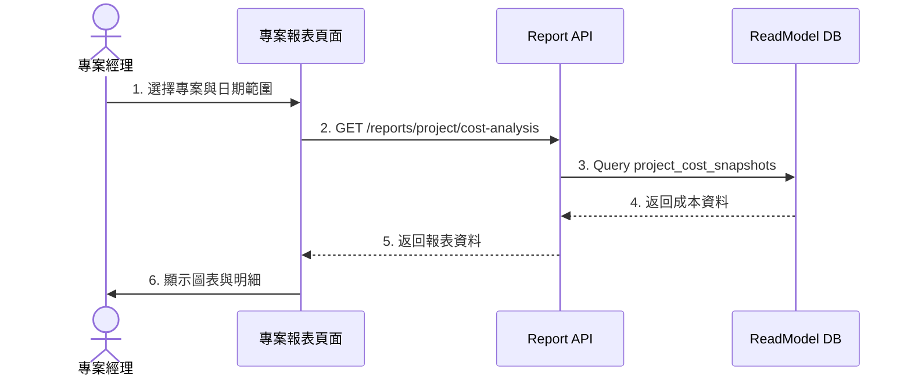
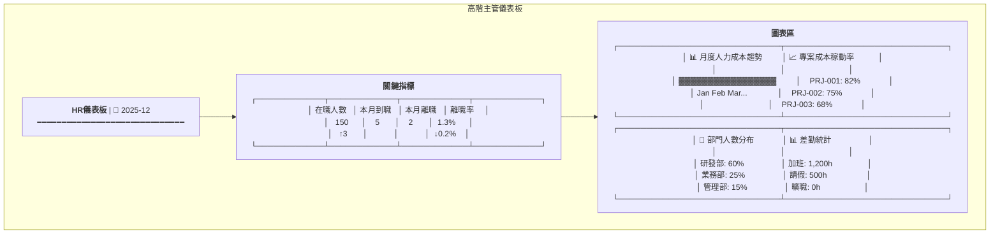

# 報表分析服務系統設計書

**版本:** 1.0
**日期:** 2025-12-07
**Domain代號:** 14 (RPT)
**導入階段:** 第二階段
**目標:** 提供工程師完整的系統實作規格,供PM建立工項清單

---

## 目錄

1. [服務概述](#1-服務概述)
2. [UI設計](#2-ui設計)
3. [UX流程設計](#3-ux流程設計)
4. [畫面事件說明](#4-畫面事件說明)
5. [Data Flow設計](#5-data-flow設計)
6. [ReadModel設計](#6-readmodel設計)
7. [Domain設計](#7-domain設計)
8. [事件訂閱](#8-事件訂閱)
9. [API設計](#9-api設計)
10. [關鍵指標計算](#10-關鍵指標計算)
11. [技術選型](#11-技術選型)
12. [工項清單摘要](#12-工項清單摘要)

---

## 1. 服務概述

### 1.1 核心功能
- ✅ **CQRS讀模型:** 去正規化加速查詢
- ✅ **人力資源報表:** 員工花名冊、差勤統計、離職率
- ✅ **專案管理報表:** 成本分析、稼動率、獲利率
- ✅ **財務薪資報表:** 薪資總表、人力成本
- ✅ **客製化儀表板:** 拖拉式圖表
- ✅ **資料匯出:** Excel/CSV/PDF

### 1.2 CQRS架構



---

## 2. UI設計

(已有內容)

---

## 3. UX流程設計

### 3.1 查詢專案成本報表流程



---

## 4. 畫面事件說明

### 4.1 儀表板頁面事件 (HR14-P04)

| 事件ID | 觸發元素 | 事件類型 | 事件處理 | 後端API |
|:---|:---|:---|:---|:---|
| `E-RPT-01` | 頁面載入 | onMount | 載入儀表板資料 | GET /api/v1/dashboards/{id} |
| `E-RPT-02` | 日期選擇器 | onChange | 更新報表期間 | - (重新query) |
| `E-RPT-03` | 匯出Excel | onClick | 下載Excel報表 | POST /api/v1/reports/export/excel |
| `E-RPT-04` | 匯出PDF | onClick | 下載PDF報表 | POST /api/v1/reports/export/pdf |

---

## 5. Data Flow設計

### 5.1 State結構

```typescript
interface ReportState {
  dashboard: {
    widgets: DashboardWidget[];
    kpis: KeyPerformanceIndicator[];
    loading: boolean;
  };
  reports: {
    hrReport: HRReportData | null;
    projectReport: ProjectReportData | null;
    financeReport: FinanceReportData | null;
    loading: boolean;
  };
}
```

### 5.2 Redux Actions

```typescript
export const reportActions = {
  loadDashboard: createAsyncThunk(
    'report/loadDashboard',
    async (dashboardId: string) => {
      return await reportService.getDashboard(dashboardId);
    }
  ),
  exportExcel: createAsyncThunk(
    'report/exportExcel',
    async (request: ExportRequest) => {
      return await reportService.exportExcel(request);
    }
  ),
};
```

---

## 6. ReadModel設計

(已有內容)

---

## 7. Domain設計

### 7.1 Dashboard聚合根

```java
@Entity
@Table(name = "dashboards")
public class Dashboard {
    @EmbeddedId
    private DashboardId id;

    private String dashboardName;
    private UUID ownerId;

    @Convert(converter = WidgetListConverter.class)
    @Column(columnDefinition = "JSONB")
    private List<DashboardWidget> widgets;

    private boolean isDefault;

    public void addWidget(DashboardWidget widget) {
        if (this.widgets == null) {
            this.widgets = new ArrayList<>();
        }
        this.widgets.add(widget);
    }

    public void removeWidget(String widgetId) {
        this.widgets.removeIf(w -> w.getWidgetId().equals(widgetId));
    }
}
```

---

## 8. 事件訂閱

(已有內容)

---

## 9. API設計

(已有內容)

---

## 10. 關鍵指標計算

| 頁面代碼 | 頁面名稱 | 路由 |
|:---|:---|:---|
| `HR14-P01` | HR報表頁面 | `/admin/reports/hr` |
| `HR14-P02` | 專案報表頁面 | `/admin/reports/project` |
| `HR14-P03` | 財務報表頁面 | `/admin/reports/finance` |
| `HR14-P04` | 儀表板頁面 | `/admin/reports/dashboard` |
| `HR14-P05` | 儀表板設計器 | `/admin/reports/dashboard/designer` |

### 2.1 UI線稿

#### 儀表板頁面 (HR14-P04)



---

## 3. ReadModel設計

### 3.1 Materialized Views

```sql
-- 員工報表視圖
CREATE MATERIALIZED VIEW employee_report_view AS
SELECT 
    e.employee_id,
    e.employee_number,
    e.full_name,
    e.hire_date,
    e.employment_status,
    o.organization_name,
    d.department_name,
    j.job_title,
    m.full_name AS manager_name,
    s.monthly_salary,
    s.payroll_system,
    DATE_PART('year', AGE(CURRENT_DATE, e.hire_date)) AS service_years
FROM employees e
LEFT JOIN organizations o ON e.organization_id = o.organization_id
LEFT JOIN departments d ON e.department_id = d.department_id
LEFT JOIN job_titles j ON e.job_title_id = j.job_title_id
LEFT JOIN employees m ON e.manager_id = m.employee_id
LEFT JOIN salary_structures s ON e.employee_id = s.employee_id AND s.is_active = TRUE;

-- 專案成本快照表
CREATE TABLE project_cost_snapshots (
    snapshot_id UUID PRIMARY KEY DEFAULT gen_random_uuid(),
    project_id UUID NOT NULL,
    snapshot_date DATE NOT NULL,
    total_hours DECIMAL(10,2) NOT NULL,
    total_cost DECIMAL(15,2) NOT NULL,
    budget_amount DECIMAL(15,2),
    budget_utilization DECIMAL(5,2),
    employee_costs JSONB,
    created_at TIMESTAMP DEFAULT CURRENT_TIMESTAMP,
    
    CONSTRAINT uk_snapshot UNIQUE (project_id, snapshot_date)
);

-- 月度HR統計表
CREATE TABLE monthly_hr_stats (
    stat_id UUID PRIMARY KEY DEFAULT gen_random_uuid(),
    organization_id UUID NOT NULL,
    stat_month DATE NOT NULL,
    total_employees INTEGER,
    new_hires INTEGER,
    terminations INTEGER,
    turnover_rate DECIMAL(5,2),
    total_overtime_hours DECIMAL(10,2),
    total_leave_hours DECIMAL(10,2),
    total_labor_cost DECIMAL(15,2),
    created_at TIMESTAMP DEFAULT CURRENT_TIMESTAMP,
    
    CONSTRAINT uk_monthly_stat UNIQUE (organization_id, stat_month)
);

-- 儀表板配置表
CREATE TABLE dashboards (
    dashboard_id UUID PRIMARY KEY DEFAULT gen_random_uuid(),
    dashboard_name VARCHAR(255) NOT NULL,
    owner_id UUID NOT NULL,
    widgets JSONB NOT NULL DEFAULT '[]',
    is_default BOOLEAN DEFAULT FALSE,
    created_at TIMESTAMP DEFAULT CURRENT_TIMESTAMP
);
```

### 3.2 定期刷新Job

| Job名稱 | 執行頻率 | 功能 |
|:---|:---|:---|
| `RefreshEmployeeViewJob` | 每小時 | 刷新員工報表視圖 |
| `CalculateProjectCostJob` | 每日凌晨 | 計算專案成本快照 |
| `CalculateMonthlyStatsJob` | 每月1日 | 計算月度HR統計 |

---

## 4. 事件訂閱

| 業務事件 | 更新ReadModel |
|:---|:---|
| `EmployeeCreated` | 刷新employee_report_view |
| `TimesheetApproved` | 更新project_cost_snapshots |
| `PayrollRunCompleted` | 更新monthly_hr_stats |
| `EmployeeTerminated` | 刷新employee_report_view, 更新離職率 |

---

## 5. API設計 (12個端點)

| 端點 | 方法 | Controller | 說明 |
|:---|:---:|:---|:---|
| `/api/v1/reports/hr/employee-roster` | GET | HR14HrQryController | 員工花名冊 |
| `/api/v1/reports/hr/attendance-summary` | GET | HR14HrQryController | 差勤統計 |
| `/api/v1/reports/hr/turnover` | GET | HR14HrQryController | 離職率分析 |
| `/api/v1/reports/project/cost-analysis` | GET | HR14ProjectQryController | 專案成本分析 |
| `/api/v1/reports/project/utilization-rate` | GET | HR14ProjectQryController | 稼動率分析 |
| `/api/v1/reports/finance/labor-cost` | GET | HR14FinanceQryController | 人力成本分析 |
| `/api/v1/reports/finance/payroll-summary` | GET | HR14FinanceQryController | 薪資總表 |
| `/api/v1/reports/export/excel` | POST | HR14ExportCmdController | 匯出Excel |
| `/api/v1/reports/export/pdf` | POST | HR14ExportCmdController | 匯出PDF |
| `/api/v1/dashboards` | POST | HR14DashboardCmdController | 建立儀表板 |
| `/api/v1/dashboards` | GET | HR14DashboardQryController | 查詢儀表板 |
| `/api/v1/dashboards/{id}/widgets` | PUT | HR14DashboardCmdController | 更新Widget |

---

## 6. 關鍵指標計算

| 指標 | 計算公式 |
|:---|:---|
| 離職率 | 離職人數 / 期初人數 × 100% |
| 稼動率 | 計費工時 / 總可用工時 × 100% |
| 專案獲利率 | (合約金額 - 實際成本) / 合約金額 × 100% |
| 人均成本 | 總人力成本 / 員工人數 |

---

## 7. 技術選型

| 元件 | 選型 |
|:---|:---|
| 讀模型資料庫 | PostgreSQL Materialized View |
| 圖表庫 | Apache ECharts (前端) |
| Excel產生 | Apache POI |
| PDF產生 | iText / OpenPDF |

---

## 12. 工項清單摘要

### 12.1 前端開發工項

| 工項編號 | 工項名稱 | 預估工時 (人天) |
|:---|:---|---:|
| FE-RPT-01 | HR14-P01~P05 五個報表頁面 | 8 |
| FE-RPT-02 | 儀表板設計器 | 5 |
| FE-RPT-03 | ECharts圖表元件 | 3 |
| FE-RPT-04 | Redux狀態管理 | 2 |
| FE-RPT-05 | 單元測試 | 2 |
| **小計** | | **20人天** |

### 12.2 後端開發工項

| 工項編號 | 工項名稱 | 預估工時 (人天) |
|:---|:---|---:|
| BE-RPT-01 | Dashboard聚合根 | 2 |
| BE-RPT-02 | ReadModel設計與Job | 5 |
| BE-RPT-03 | API實作(12端點) | 6 |
| BE-RPT-04 | 事件訂閱Listener(4個) | 2 |
| BE-RPT-05 | Excel/PDF匯出 | 3 |
| BE-RPT-06 | 定時刷新Job | 2 |
| BE-RPT-07 | 單元測試 | 2 |
| **小計** | | **22人天** |

### 12.3 總工時: **42人天**

**備註:**
- 建議使用PostgreSQL Materialized View提升查詢效能
- ECharts圖表元件可重用
- 建議分兩階段:
  - **階段一:** 基礎報表(HR/專案/財務) - 25人天
  - **階段二:** 客製化儀表板 - 17人天

---

**文件完成日期:** 2025-12-26
