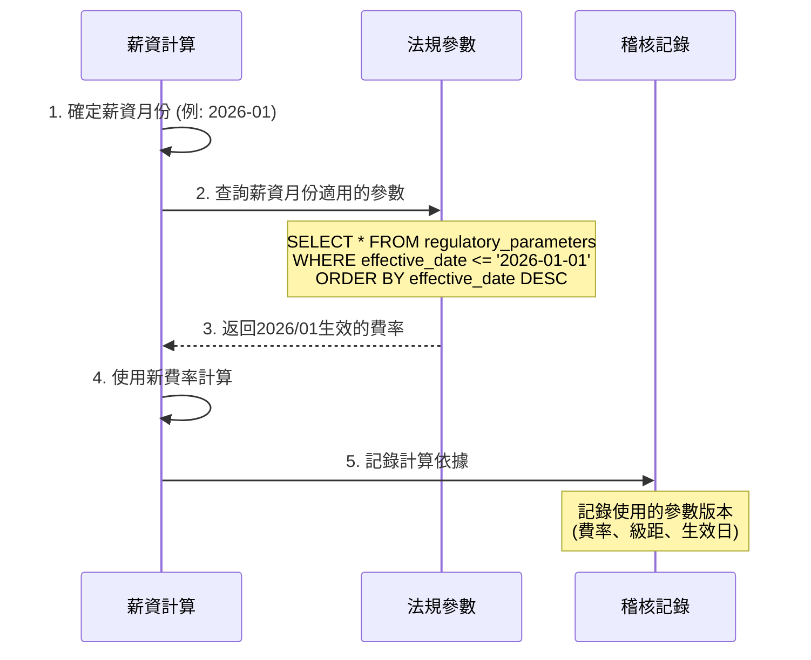
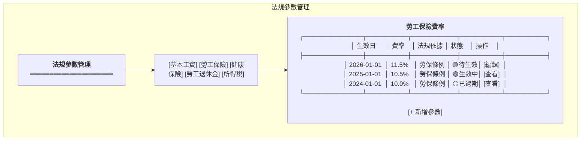
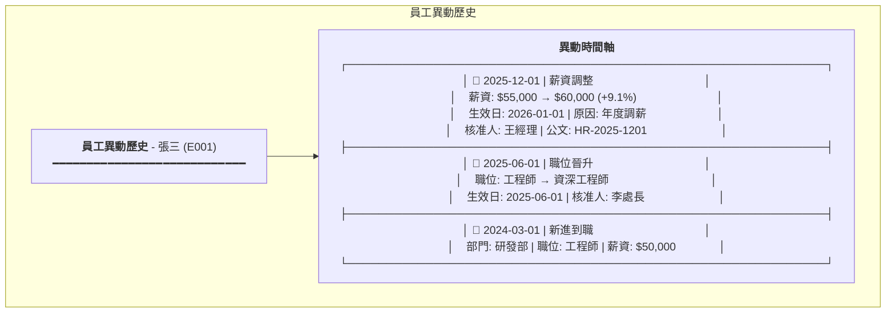

# 法規參數管理與異動稽核設計規格書

**版本:** 1.0  
**日期:** 2025-12-07  
**適用範圍:** 全系統

---

## 1. 設計目的

### 1.1 核心需求
1. **法規參數可配置:** 最低薪資、保險費率、級距表等可依年度/生效日設定
2. **生效日邏輯:** 2026/1月生效 = 適用於2026年1月薪資 (2月發放)
3. **異動稽核:** 所有關鍵異動留有記錄，可追蹤確認

### 1.2 適用項目

| 類別 | 可配置參數 |
|:---|:---|
| **基本工資** | 最低基本工資、最低時薪 |
| **勞工保險** | 費率、級距表、負擔比例 |
| **健康保險** | 費率、級距表、眷屬平均數、補充保費率 |
| **勞工退休金** | 提繳費率、級距表 |
| **所得稅** | 免稅額、扣繳級距、特別扣除額 |

---

## 2. 生效日邏輯設計

### 2.1 薪資週期與生效日對應

```
┌─────────────────────────────────────────────────────────────────┐
│                      薪資週期時間軸                              │
├─────────────────────────────────────────────────────────────────┤
│                                                                 │
│   ┌──────────┐    ┌──────────┐    ┌──────────┐                 │
│   │ 2025/12  │    │ 2026/01  │    │ 2026/02  │                 │
│   │  薪資月  │    │  薪資月  │    │  薪資月  │                 │
│   │          │    │ ★新法規 │    │          │                 │
│   └────┬─────┘    └────┬─────┘    └────┬─────┘                 │
│        │               │               │                        │
│        │               │               │                        │
│   ┌────▼─────┐    ┌────▼─────┐    ┌────▼─────┐                 │
│   │ 2026/01  │    │ 2026/02  │    │ 2026/03  │                 │
│   │  發薪日  │    │  發薪日  │    │  發薪日  │                 │
│   │ (舊費率) │    │ (新費率) │    │ (新費率) │                 │
│   └──────────┘    └──────────┘    └──────────┘                 │
│                                                                 │
│   生效日 = 2026/01/01                                           │
│   適用範圍 = 2026年1月「薪資月」(2月發放)                        │
└─────────────────────────────────────────────────────────────────┘
```

### 2.2 計算邏輯

```typescript
/**
 * 取得適用的法規參數
 * @param parameterType 參數類型 (LABOR_INSURANCE, HEALTH_INSURANCE, etc.)
 * @param salaryMonth 薪資月份 (非發薪月份)
 * @returns 適用的法規參數
 */
function getApplicableParameter(
  parameterType: ParameterType,
  salaryMonth: Date  // 例如: 2026-01-01 (薪資月)
): RegulatoryParameter {
  // 查詢生效日 <= 薪資月份的最新參數
  return db.query(`
    SELECT * FROM regulatory_parameters 
    WHERE parameter_type = $1 
      AND effective_date <= $2 
    ORDER BY effective_date DESC 
    LIMIT 1
  `, [parameterType, salaryMonth]);
}

// 範例: 計算2026年1月薪資 (2月發放)
const salaryMonth = new Date('2026-01-01');
const laborInsuranceRate = getApplicableParameter('LABOR_INSURANCE', salaryMonth);
// 如果2026/01/01有新費率生效，則套用新費率
```

---

## 3. 法規參數資料模型

### 3.1 DDL設計

```sql
-- ================================================================
-- 法規參數主表 (支援多年度、多版本)
-- ================================================================
CREATE TABLE regulatory_parameters (
    parameter_id UUID PRIMARY KEY DEFAULT gen_random_uuid(),
    
    -- 參數識別
    parameter_type VARCHAR(50) NOT NULL,  -- MINIMUM_WAGE, LABOR_INSURANCE_RATE, etc.
    parameter_code VARCHAR(100) NOT NULL, -- 細項代碼
    
    -- 生效控制 (關鍵!)
    effective_date DATE NOT NULL,         -- 生效日 (非發薪日)
    expiry_date DATE,                     -- 失效日 (nullable = 無限期)
    
    -- 參數值 (支援多種類型)
    value_decimal DECIMAL(15,6),          -- 數值型 (費率、金額)
    value_json JSONB,                     -- 複雜型 (級距表)
    
    -- 法規依據
    legal_basis VARCHAR(500),             -- 法條/公告文號
    announcement_date DATE,               -- 公告日期
    
    -- 審核
    status VARCHAR(20) DEFAULT 'ACTIVE' CHECK (status IN ('DRAFT', 'ACTIVE', 'EXPIRED')),
    created_by UUID NOT NULL,
    created_at TIMESTAMP DEFAULT CURRENT_TIMESTAMP,
    approved_by UUID,
    approved_at TIMESTAMP,
    
    -- 唯一約束: 同一參數同一生效日只能有一筆
    CONSTRAINT uk_param_effective UNIQUE (parameter_type, parameter_code, effective_date)
);

CREATE INDEX idx_param_type_date ON regulatory_parameters(parameter_type, effective_date DESC);

-- ================================================================
-- 保險級距表 (獨立表，方便查詢)
-- ================================================================
CREATE TABLE insurance_brackets (
    bracket_id UUID PRIMARY KEY DEFAULT gen_random_uuid(),
    bracket_type VARCHAR(30) NOT NULL,    -- LABOR, HEALTH, PENSION
    effective_date DATE NOT NULL,
    level_number INTEGER NOT NULL,
    min_salary DECIMAL(12,2) NOT NULL,
    max_salary DECIMAL(12,2),
    insured_salary DECIMAL(12,2) NOT NULL,
    created_at TIMESTAMP DEFAULT CURRENT_TIMESTAMP,
    
    CONSTRAINT uk_bracket UNIQUE (bracket_type, effective_date, level_number)
);

CREATE INDEX idx_bracket_effective ON insurance_brackets(bracket_type, effective_date DESC);
```

### 3.2 參數類型定義

```typescript
enum ParameterType {
  // 基本工資
  MINIMUM_WAGE = 'MINIMUM_WAGE',
  MINIMUM_HOURLY_WAGE = 'MINIMUM_HOURLY_WAGE',
  
  // 勞工保險
  LABOR_INSURANCE_RATE = 'LABOR_INSURANCE_RATE',
  EMPLOYMENT_INSURANCE_RATE = 'EMPLOYMENT_INSURANCE_RATE',
  LABOR_INSURANCE_EMPLOYER_RATIO = 'LABOR_INSURANCE_EMPLOYER_RATIO',
  LABOR_INSURANCE_EMPLOYEE_RATIO = 'LABOR_INSURANCE_EMPLOYEE_RATIO',
  LABOR_INSURANCE_MAX_SALARY = 'LABOR_INSURANCE_MAX_SALARY',
  
  // 健康保險
  HEALTH_INSURANCE_RATE = 'HEALTH_INSURANCE_RATE',
  HEALTH_INSURANCE_MAX_SALARY = 'HEALTH_INSURANCE_MAX_SALARY',
  HEALTH_INSURANCE_AVG_DEPENDENTS = 'HEALTH_INSURANCE_AVG_DEPENDENTS',
  SUPPLEMENTARY_PREMIUM_RATE = 'SUPPLEMENTARY_PREMIUM_RATE',
  
  // 勞工退休金
  PENSION_EMPLOYER_RATE = 'PENSION_EMPLOYER_RATE',
  PENSION_MAX_SALARY = 'PENSION_MAX_SALARY',
  
  // 所得稅
  PERSONAL_EXEMPTION = 'PERSONAL_EXEMPTION',
  STANDARD_DEDUCTION = 'STANDARD_DEDUCTION',
  SALARY_DEDUCTION = 'SALARY_DEDUCTION',
}
```

### 3.3 初始資料範例

```sql
-- 2025年基本工資
INSERT INTO regulatory_parameters 
(parameter_type, parameter_code, effective_date, value_decimal, legal_basis) VALUES
('MINIMUM_WAGE', 'MONTHLY', '2025-01-01', 27470, '勞動部113年9月公告'),
('MINIMUM_HOURLY_WAGE', 'HOURLY', '2025-01-01', 183, '勞動部113年9月公告');

-- 2026年基本工資 (假設調整)
INSERT INTO regulatory_parameters 
(parameter_type, parameter_code, effective_date, value_decimal, legal_basis) VALUES
('MINIMUM_WAGE', 'MONTHLY', '2026-01-01', 28590, '勞動部114年9月公告'),
('MINIMUM_HOURLY_WAGE', 'HOURLY', '2026-01-01', 190, '勞動部114年9月公告');

-- 2025年勞保費率
INSERT INTO regulatory_parameters 
(parameter_type, parameter_code, effective_date, value_decimal, legal_basis) VALUES
('LABOR_INSURANCE_RATE', 'ORDINARY', '2025-01-01', 0.1050, '勞保條例'),
('EMPLOYMENT_INSURANCE_RATE', 'STANDARD', '2025-01-01', 0.0100, '就業保險法');

-- 2025年健保費率
INSERT INTO regulatory_parameters 
(parameter_type, parameter_code, effective_date, value_decimal, legal_basis) VALUES
('HEALTH_INSURANCE_RATE', 'STANDARD', '2025-01-01', 0.0517, '衛福部公告'),
('SUPPLEMENTARY_PREMIUM_RATE', 'STANDARD', '2025-01-01', 0.0211, '衛福部公告');
```

---

## 4. 異動稽核設計

### 4.1 需稽核的項目清單

| 類別 | 稽核項目 | 重要性 |
|:---|:---|:---:|
| **員工資料** | 到職、離職、復職 | 高 |
| | 薪資調整 (調薪、降薪) | 高 |
| | 職位異動 (晉升、調動) | 高 |
| | 部門調動 | 中 |
| | 個人資料變更 | 中 |
| **組織資料** | 組織建立/停用 | 高 |
| | 部門建立/停用/合併 | 高 |
| | 主管變更 | 中 |
| **薪資資料** | 薪資結構變更 | 高 |
| | 加項/扣項調整 | 高 |
| | 薪資單修正 | 高 |
| **保險資料** | 投保級距調整 | 高 |
| | 加退保記錄 | 高 |
| **法規參數** | 費率調整 | 高 |
| | 級距表更新 | 高 |

### 4.2 稽核記錄資料模型

```sql
-- ================================================================
-- 異動稽核記錄表 (統一稽核)
-- ================================================================
CREATE TABLE audit_logs (
    audit_id UUID PRIMARY KEY DEFAULT gen_random_uuid(),
    
    -- 操作資訊
    action_type VARCHAR(30) NOT NULL,     -- CREATE, UPDATE, DELETE, APPROVE
    entity_type VARCHAR(50) NOT NULL,     -- EMPLOYEE, SALARY, ORGANIZATION, etc.
    entity_id UUID NOT NULL,              -- 被操作的實體ID
    entity_name VARCHAR(255),             -- 可讀名稱 (如員工姓名)
    
    -- 變更內容 (關鍵!)
    changes JSONB NOT NULL,               -- 變更前後對比
    /*
    changes 結構範例:
    {
      "salary": { "before": 50000, "after": 55000 },
      "jobTitle": { "before": "工程師", "after": "資深工程師" }
    }
    */
    
    -- 生效控制
    effective_date DATE,                  -- 生效日 (如調薪生效日)
    
    -- 操作者資訊
    operated_by UUID NOT NULL,
    operated_by_name VARCHAR(100),
    operated_at TIMESTAMP DEFAULT CURRENT_TIMESTAMP,
    
    -- 來源
    source_ip VARCHAR(45),
    user_agent VARCHAR(500),
    request_id UUID,                      -- 關聯的API請求
    
    -- 備註
    reason TEXT,                          -- 異動原因
    attachments JSONB                     -- 附件 (如調薪公文)
);

CREATE INDEX idx_audit_entity ON audit_logs(entity_type, entity_id);
CREATE INDEX idx_audit_time ON audit_logs(operated_at DESC);
CREATE INDEX idx_audit_operator ON audit_logs(operated_by);

-- ================================================================
-- 薪資異動專用記錄表 (詳細追蹤)
-- ================================================================
CREATE TABLE salary_change_history (
    history_id UUID PRIMARY KEY DEFAULT gen_random_uuid(),
    employee_id UUID NOT NULL,
    
    -- 異動類型
    change_type VARCHAR(30) NOT NULL,     -- HIRE, PROMOTION, ADJUSTMENT, DEMOTION, ANNUAL_REVIEW
    
    -- 薪資變更
    previous_salary DECIMAL(12,2),
    new_salary DECIMAL(12,2) NOT NULL,
    change_amount DECIMAL(12,2),
    change_percentage DECIMAL(5,2),
    
    -- 生效日 (關鍵!)
    effective_date DATE NOT NULL,         -- 此為薪資月份，非發薪月份
    
    -- 核准資訊
    approved_by UUID,
    approved_at TIMESTAMP,
    approval_document VARCHAR(500),       -- 公文/簽呈編號
    
    -- 稽核
    created_by UUID NOT NULL,
    created_at TIMESTAMP DEFAULT CURRENT_TIMESTAMP,
    reason TEXT
);

CREATE INDEX idx_salary_history_emp ON salary_change_history(employee_id);
CREATE INDEX idx_salary_history_date ON salary_change_history(effective_date);

-- ================================================================
-- 組織異動記錄表
-- ================================================================
CREATE TABLE organization_change_history (
    history_id UUID PRIMARY KEY DEFAULT gen_random_uuid(),
    
    -- 異動對象
    entity_type VARCHAR(30) NOT NULL,     -- ORGANIZATION, DEPARTMENT
    entity_id UUID NOT NULL,
    
    -- 異動類型
    change_type VARCHAR(30) NOT NULL,     -- CREATE, RENAME, MERGE, SPLIT, DEACTIVATE
    
    -- 變更內容
    changes JSONB NOT NULL,
    
    -- 生效日
    effective_date DATE NOT NULL,
    
    -- 稽核
    created_by UUID NOT NULL,
    created_at TIMESTAMP DEFAULT CURRENT_TIMESTAMP,
    reason TEXT,
    approval_document VARCHAR(500)
);
```

### 4.3 稽核實作 (Java切面)

```java
@Aspect
@Component
public class AuditLogAspect {
    
    @Autowired
    private AuditLogRepository auditLogRepository;
    
    @Autowired
    private SecurityContextService securityContext;
    
    /**
     * 攔截所有標註 @Auditable 的方法
     */
    @Around("@annotation(auditable)")
    public Object auditAction(ProceedingJoinPoint joinPoint, Auditable auditable) throws Throwable {
        // 取得操作前狀態
        Object beforeState = getEntityState(joinPoint, auditable);
        
        // 執行實際操作
        Object result = joinPoint.proceed();
        
        // 取得操作後狀態
        Object afterState = getEntityState(joinPoint, auditable);
        
        // 記錄稽核日誌
        AuditLog log = AuditLog.builder()
            .actionType(auditable.action())
            .entityType(auditable.entityType())
            .entityId(extractEntityId(result))
            .changes(calculateChanges(beforeState, afterState))
            .operatedBy(securityContext.getCurrentUserId())
            .operatedByName(securityContext.getCurrentUserName())
            .sourceIp(securityContext.getClientIp())
            .build();
        
        auditLogRepository.save(log);
        
        return result;
    }
    
    private JsonNode calculateChanges(Object before, Object after) {
        ObjectMapper mapper = new ObjectMapper();
        Map<String, ChangeDetail> changes = new HashMap<>();
        
        // 比較每個欄位
        for (Field field : after.getClass().getDeclaredFields()) {
            if (field.isAnnotationPresent(AuditField.class)) {
                Object beforeValue = getFieldValue(before, field);
                Object afterValue = getFieldValue(after, field);
                
                if (!Objects.equals(beforeValue, afterValue)) {
                    changes.put(field.getName(), new ChangeDetail(beforeValue, afterValue));
                }
            }
        }
        
        return mapper.valueToTree(changes);
    }
}

// 使用範例
@Service
public class EmployeeSalaryService {
    
    @Auditable(action = "UPDATE", entityType = "EMPLOYEE_SALARY")
    public Employee adjustSalary(UUID employeeId, SalaryAdjustmentCommand command) {
        Employee employee = employeeRepository.findById(employeeId);
        
        // 記錄薪資異動歷史
        SalaryChangeHistory history = SalaryChangeHistory.builder()
            .employeeId(employeeId)
            .changeType(command.getChangeType())
            .previousSalary(employee.getCurrentSalary())
            .newSalary(command.getNewSalary())
            .effectiveDate(command.getEffectiveDate()) // 關鍵: 生效日
            .reason(command.getReason())
            .build();
        
        salaryHistoryRepository.save(history);
        
        // 更新員工薪資
        employee.adjustSalary(command.getNewSalary(), command.getEffectiveDate());
        
        return employeeRepository.save(employee);
    }
}
```

---

## 5. 薪資計算時的參數套用

### 5.1 計算流程



### 5.2 薪資單記錄計算依據

```sql
-- 薪資單加入計算參數快照
ALTER TABLE payslips ADD COLUMN calculation_params JSONB;

/*
calculation_params 範例:
{
  "salaryMonth": "2026-01",
  "payDate": "2026-02-05",
  "parameters": {
    "laborInsuranceRate": { "value": 0.115, "effectiveDate": "2026-01-01" },
    "healthInsuranceRate": { "value": 0.0517, "effectiveDate": "2025-01-01" },
    "pensionRate": { "value": 0.06, "effectiveDate": "2025-01-01" }
  },
  "brackets": {
    "laborInsurance": { "level": 15, "insuredSalary": 53000 },
    "healthInsurance": { "level": 20, "insuredSalary": 66800 },
    "pension": { "level": 35, "contributionWage": 66800 }
  }
}
*/
```

---

## 6. API設計

### 6.1 法規參數管理API

| 端點 | 方法 | 說明 |
|:---|:---:|:---|
| `/api/v1/admin/parameters` | POST | 新增法規參數 |
| `/api/v1/admin/parameters` | GET | 查詢參數列表 |
| `/api/v1/admin/parameters/{type}/effective` | GET | 查詢特定日期生效的參數 |
| `/api/v1/admin/parameters/{id}/approve` | PUT | 核准參數生效 |
| `/api/v1/admin/brackets/{type}` | POST | 上傳級距表 |
| `/api/v1/admin/brackets/{type}/effective` | GET | 查詢特定日期生效的級距表 |

### 6.2 稽核記錄查詢API

| 端點 | 方法 | 說明 |
|:---|:---:|:---|
| `/api/v1/admin/audit/logs` | GET | 查詢稽核記錄 (支援篩選) |
| `/api/v1/admin/audit/entity/{type}/{id}` | GET | 查詢特定實體的異動歷史 |
| `/api/v1/admin/audit/salary-changes` | GET | 查詢薪資異動記錄 |
| `/api/v1/admin/audit/export` | POST | 匯出稽核報表 |

---

## 7. UI設計

### 7.1 法規參數管理頁面



### 7.2 異動歷史查詢頁面



---

## 8. 注意事項

> [!IMPORTANT]
> **生效日判定邏輯**
> - 法規參數的 `effective_date` 是指「薪資月份」而非「發薪日」
> - 例: 2026/01/01 生效 = 適用於 2026年1月薪資 (通常2月5日發放)
> - 系統計算時應以 `薪資月份` 查詢適用參數

> [!WARNING]
> **費率更新時機**
> - 每年9-10月關注勞動部/衛福部公告
> - 新費率通常於隔年1月1日生效
> - 需提前設定，確保系統正確套用

> [!CAUTION]
> **稽核記錄不可刪除**
> - `audit_logs` 表應設為僅允許 INSERT
> - 不可 UPDATE 或 DELETE
> - 建議使用 Database Trigger 保護

---

**文件結束**
