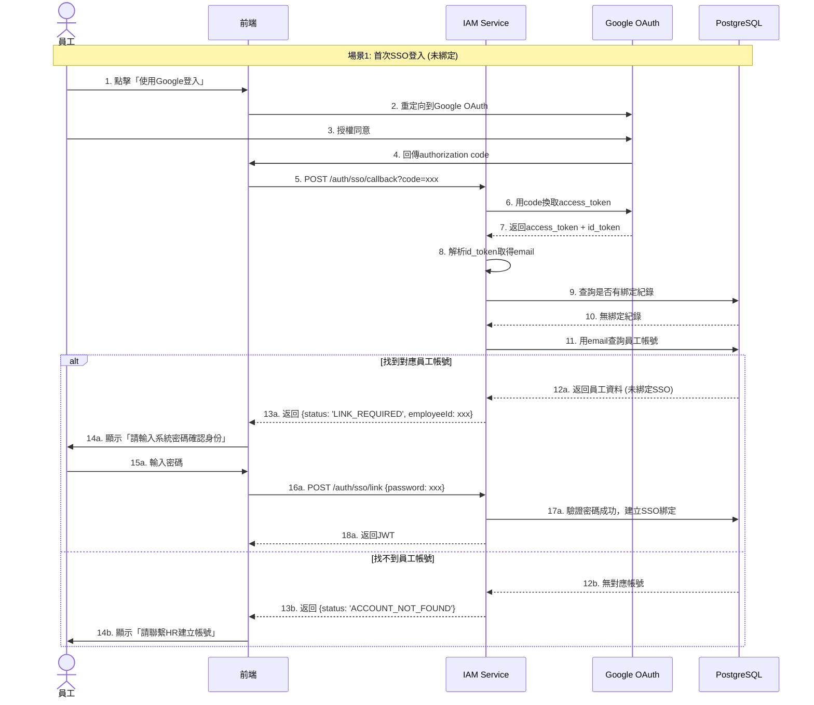
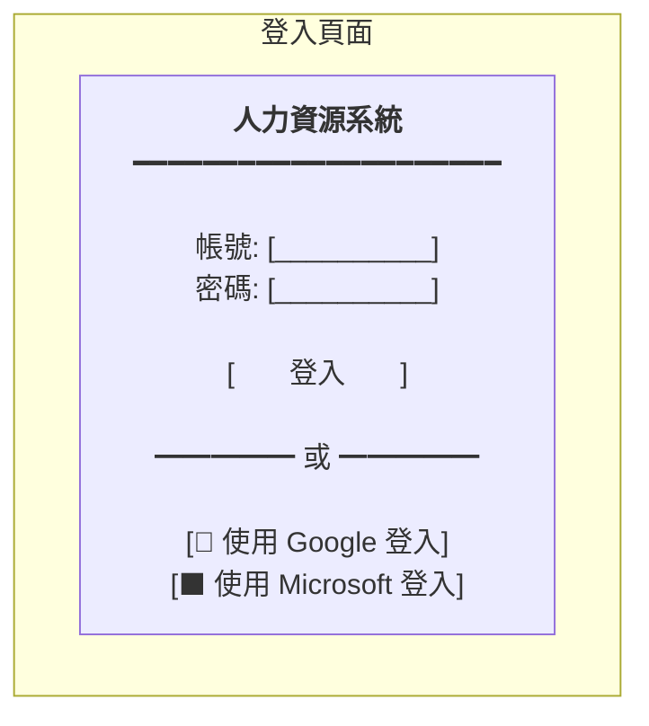
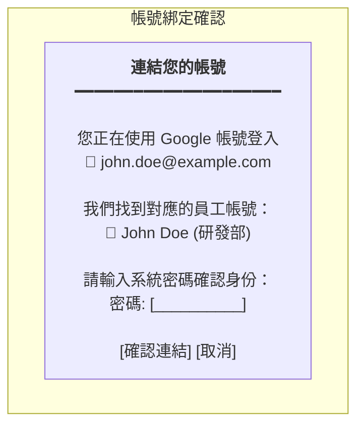

# SSO帳號連結流程設計

**版本:** 1.0  
**日期:** 2025-12-07  
**適用服務:** IAM服務 (01)

---

## 1. SSO概述

### 1.1 支援的SSO提供者

| 提供者 | 協定 | 用途 |
|:---|:---|:---|
| Google | OAuth 2.0 / OIDC | 一般員工登入 |
| Microsoft Entra ID | OAuth 2.0 / OIDC | 企業整合 (Office 365) |
| SAML 2.0 | SAML | 企業SSO整合 |

### 1.2 帳號連結策略

| 策略 | 說明 | 適用場景 |
|:---|:---|:---|
| **自動建立 (Auto-Create)** | SSO首次登入時自動建立系統帳號 | 不建議 (需HR審核) |
| **連結既有帳號 (Link Existing)** | SSO登入後連結已存在的員工帳號 | ✅ 建議採用 |
| **僅SSO登入 (SSO Only)** | 不允許本地密碼，僅SSO認證 | 企業安全要求 |

**建議採用:** 連結既有帳號 (Link Existing) - 員工帳號由HR建立，員工可自行綁定SSO

---

## 2. 帳號連結流程

### 2.1 流程圖



### 2.2 狀態碼定義

| 狀態碼 | 說明 | 前端動作 |
|:---|:---|:---|
| `SUCCESS` | SSO登入成功 (已綁定) | 導向首頁 |
| `LINK_REQUIRED` | 需綁定既有帳號 | 顯示密碼驗證表單 |
| `ACCOUNT_NOT_FOUND` | 無對應員工帳號 | 顯示聯繫HR訊息 |
| `ALREADY_LINKED` | 此SSO已綁定其他帳號 | 顯示錯誤訊息 |
| `EMAIL_MISMATCH` | SSO email與員工email不符 | 顯示錯誤訊息 |

---

## 3. API設計

### 3.1 SSO登入回調

```http
POST /api/v1/auth/sso/callback
Content-Type: application/json

{
  "provider": "GOOGLE",
  "code": "4/0AX4XfWh...",
  "redirectUri": "https://hr.example.com/auth/callback"
}
```

**Response (需綁定):**
```json
{
  "status": "LINK_REQUIRED",
  "ssoProfile": {
    "provider": "GOOGLE",
    "email": "john.doe@example.com",
    "name": "John Doe",
    "pictureUrl": "https://..."
  },
  "matchedEmployee": {
    "employeeId": "uuid",
    "employeeName": "John Doe",
    "email": "john.doe@example.com"
  },
  "linkToken": "eyJhbGciOiJIUzI1NiIs..." // 臨時token，10分鐘有效
}
```

### 3.2 確認帳號連結

```http
POST /api/v1/auth/sso/link
Content-Type: application/json
Authorization: Bearer {linkToken}

{
  "password": "user_password"
}
```

**Response (成功):**
```json
{
  "status": "SUCCESS",
  "accessToken": "eyJhbGciOiJIUzI1NiIs...",
  "refreshToken": "eyJhbGciOiJIUzI1NiIs...",
  "user": {
    "userId": "uuid",
    "employeeId": "uuid",
    "email": "john.doe@example.com",
    "ssoProviders": ["GOOGLE"]
  }
}
```

### 3.3 解除SSO綁定

```http
DELETE /api/v1/auth/sso/{provider}
Authorization: Bearer {accessToken}
```

---

## 4. 資料模型

### 4.1 DDL

```sql
-- SSO綁定記錄表
CREATE TABLE user_sso_links (
    link_id UUID PRIMARY KEY DEFAULT gen_random_uuid(),
    user_id UUID NOT NULL REFERENCES users(user_id),
    sso_provider VARCHAR(30) NOT NULL CHECK (sso_provider IN ('GOOGLE', 'MICROSOFT', 'SAML')),
    sso_subject_id VARCHAR(255) NOT NULL, -- SSO提供者的唯一識別碼 (sub claim)
    sso_email VARCHAR(255) NOT NULL,
    sso_name VARCHAR(255),
    sso_picture_url VARCHAR(500),
    linked_at TIMESTAMP DEFAULT CURRENT_TIMESTAMP,
    last_login_at TIMESTAMP,
    
    CONSTRAINT uk_sso_link UNIQUE (sso_provider, sso_subject_id),
    CONSTRAINT uk_user_provider UNIQUE (user_id, sso_provider)
);

CREATE INDEX idx_sso_email ON user_sso_links(sso_email);
```

---

## 5. 安全考量

### 5.1 Email驗證策略

```typescript
enum EmailMatchStrategy {
  EXACT_MATCH = 'EXACT_MATCH',           // Email必須完全相同
  DOMAIN_MATCH = 'DOMAIN_MATCH',         // 只驗證域名相同
  VERIFIED_ONLY = 'VERIFIED_ONLY'        // 只接受已驗證的email
}

function validateSsoEmail(
  ssoEmail: string, 
  employeeEmail: string,
  strategy: EmailMatchStrategy
): boolean {
  switch (strategy) {
    case EmailMatchStrategy.EXACT_MATCH:
      return ssoEmail.toLowerCase() === employeeEmail.toLowerCase();
    
    case EmailMatchStrategy.DOMAIN_MATCH:
      return ssoEmail.split('@')[1] === employeeEmail.split('@')[1];
    
    case EmailMatchStrategy.VERIFIED_ONLY:
      // 需檢查SSO提供者的email_verified claim
      return true;
  }
}
```

### 5.2 防護措施

| 風險 | 防護措施 |
|:---|:---|
| 帳號劫持 | 綁定時需驗證密碼 |
| Session劫持 | linkToken短效期 (10分鐘) |
| 重複綁定 | 一個SSO帳號只能綁定一個系統帳號 |
| 暴力破解 | 密碼驗證失敗次數限制 |

---

## 6. 組織設定

### 6.1 租戶SSO配置

```sql
CREATE TABLE tenant_sso_configs (
    config_id UUID PRIMARY KEY DEFAULT gen_random_uuid(),
    tenant_id UUID NOT NULL REFERENCES tenants(tenant_id),
    sso_provider VARCHAR(30) NOT NULL,
    client_id VARCHAR(255) NOT NULL,
    client_secret VARCHAR(255) NOT NULL, -- 加密儲存
    allowed_domains JSONB DEFAULT '[]',  -- 允許的email域名
    auto_create_enabled BOOLEAN DEFAULT FALSE,
    email_match_strategy VARCHAR(30) DEFAULT 'EXACT_MATCH',
    is_enabled BOOLEAN DEFAULT TRUE,
    created_at TIMESTAMP DEFAULT CURRENT_TIMESTAMP,
    
    CONSTRAINT uk_tenant_sso UNIQUE (tenant_id, sso_provider)
);

-- 範例配置
INSERT INTO tenant_sso_configs VALUES (
  gen_random_uuid(),
  'tenant-uuid',
  'GOOGLE',
  'xxxx.apps.googleusercontent.com',
  'encrypted_secret',
  '["example.com", "example.com.tw"]',
  false,
  'EXACT_MATCH',
  true,
  NOW()
);
```

---

## 7. 前端整合

### 7.1 登入頁面UI



### 7.2 帳號綁定確認UI



---

**文件結束**
