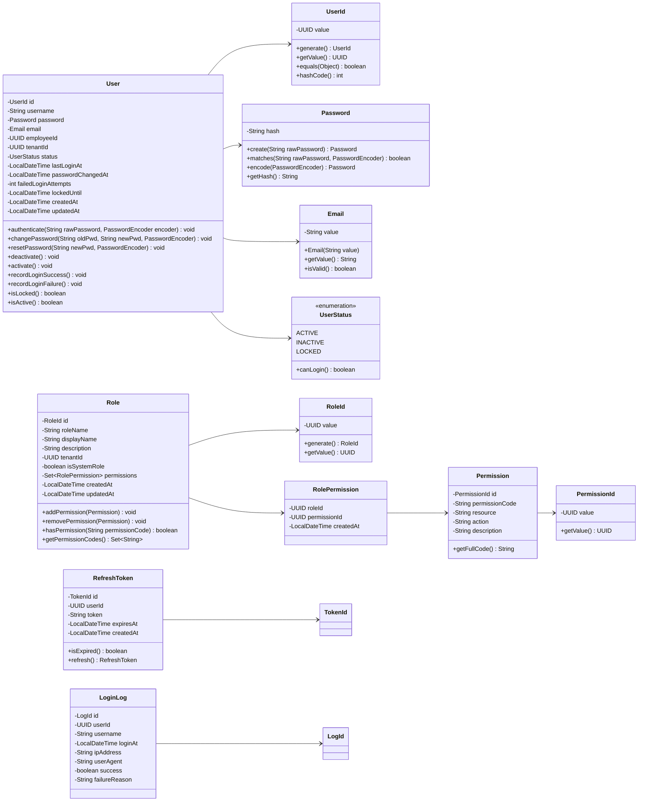

# 系統設計書命名規範合規性檢查與UML類別圖

**版本:** 1.0  
**日期:** 2025-12-06  
**目的:** 根據命名原則檢查設計書,並提供UML類別圖

---

## 1. 命名規範合規性檢查

### 1.1 IAM服務 (Domain代號: 01)

#### 1.1.1 前端頁面代碼更新

| 原頁面代碼 | 新頁面代碼 | 頁面名稱 |
|:---|:---|:---|
| `IAM-P01` | `HR01-P01` | 登入頁面 |
| `IAM-P02` | `HR01-P02` | 使用者管理頁面 |
| `IAM-P03` | `HR01-P03` | 角色權限管理頁面 |
| `IAM-P04` | `HR01-P04` | 密碼修改頁面 |
| `IAM-P05` | `HR01-M01` | 使用者新增/編輯對話框 (Modal) |
| `IAM-P06` | `HR01-M02` | 角色新增/編輯對話框 (Modal) |

#### 1.1.2 Controller命名更新

| 原命名 | 符合規範命名 | 說明 |
|:---|:---|:---|
| `AuthController` | `HR01AuthCmdController` | 認證Command操作 |
| `UserController` | `HR01UserCmdController` | 使用者管理Command操作 |
| - | `HR01UserQryController` | 使用者管理Query操作 |
| `RoleController` | `HR01RoleCmdController` | 角色管理Command操作 |
| - | `HR01RoleQryController` | 角色管理Query操作 |
| - | `HR01PermissionQryController` | 權限管理Query操作 |

#### 1.1.3 API端點與Service對應

| API端點 | HTTP方法 | Controller | Service類別 |
|:---|:---|:---|:---|
| `/api/v1/auth/login` | POST | `HR01AuthCmdController` | `LoginServiceImpl` |
| `/api/v1/auth/logout` | POST | `HR01AuthCmdController` | `LogoutServiceImpl` |
| `/api/v1/auth/refresh` | POST | `HR01AuthCmdController` | `RefreshTokenServiceImpl` |
| `/api/v1/users` | GET | `HR01UserQryController` | `GetUserListServiceImpl` |
| `/api/v1/users/{id}` | GET | `HR01UserQryController` | `GetUserServiceImpl` |
| `/api/v1/users` | POST | `HR01UserCmdController` | `CreateUserServiceImpl` |
| `/api/v1/users/{id}` | PUT | `HR01UserCmdController` | `UpdateUserServiceImpl` |
| `/api/v1/users/{id}/deactivate` | PUT | `HR01UserCmdController` | `DeactivateUserServiceImpl` |
| `/api/v1/users/{id}/reset-password` | PUT | `HR01UserCmdController` | `ResetPasswordServiceImpl` |
| `/api/v1/roles` | GET | `HR01RoleQryController` | `GetRoleListServiceImpl` |
| `/api/v1/roles/{id}` | GET | `HR01RoleQryController` | `GetRoleServiceImpl` |
| `/api/v1/roles` | POST | `HR01RoleCmdController` | `CreateRoleServiceImpl` |
| `/api/v1/roles/{id}` | PUT | `HR01RoleCmdController` | `UpdateRoleServiceImpl` |
| `/api/v1/roles/{id}/permissions` | PUT | `HR01RoleCmdController` | `UpdateRolePermissionsServiceImpl` |

#### 1.1.4 Domain Service命名

| 原命名 | 符合規範命名 | 職責 |
|:---|:---|:---|
| - | `UserAuthenticationDomainService` | 使用者認證邏輯 |
| - | `PasswordValidationDomainService` | 密碼強度驗證 |
| - | `AccountLockingDomainService` | 帳號鎖定邏輯 |
| - | `TokenGenerationDomainService` | JWT Token生成 |
| - | `PermissionCheckDomainService` | 權限檢查邏輯 |

---

### 1.2 組織員工服務 (Domain代號: 02)

#### 1.2.1 前端頁面代碼更新

| 原頁面代碼 | 新頁面代碼 | 頁面名稱 |
|:---|:---|:---|
| `ORG-P01` | `HR02-P01` | 組織架構圖頁面 |
| `ORG-P02` | `HR02-P02` | 部門管理頁面 |
| `ORG-P03` | `HR02-P03` | 員工列表頁面 |
| `ORG-P04` | `HR02-P04` | 員工詳細資料頁面 |
| `ORG-P05` | `HR02-P05` | 員工新增頁面 |
| `ORG-P06` | `HR02-P06` | 員工編輯頁面 |
| `ORG-P07` | `HR02-P07` | 員工人事歷程頁面 |
| `ORG-P08` | `HR02-P08` | 我的資料頁面(ESS) |
| `ORG-P09` | `HR02-P09` | 證明文件申請頁面(ESS) |

#### 1.2.2 Controller命名更新

| 原命名 | 符合規範命名 | 說明 |
|:---|:---|:---|
| `OrganizationController` | `HR02OrganizationCmdController` | 組織管理Command操作 |
| - | `HR02OrganizationQryController` | 組織管理Query操作 |
| `DepartmentController` | `HR02DepartmentCmdController` | 部門管理Command操作 |
| - | `HR02DepartmentQryController` | 部門管理Query操作 |
| `EmployeeController` | `HR02EmployeeCmdController` | 員工管理Command操作 |
| - | `HR02EmployeeQryController` | 員工管理Query操作 |
| `EmployeeESSController` | `HR02EssCmdController` | ESS自助Command操作 |
| - | `HR02EssQryController` | ESS自助Query操作 |
| `ContractController` | `HR02ContractCmdController` | 合約管理Command操作 |
| - | `HR02ContractQryController` | 合約管理Query操作 |

#### 1.2.3 API端點與Service對應

| API端點 | HTTP方法 | Controller | Service類別 |
|:---|:---|:---|:---|
| `/api/v1/organizations` | POST | `HR02OrganizationCmdController` | `CreateOrganizationServiceImpl` |
| `/api/v1/organizations/{id}/tree` | GET | `HR02OrganizationQryController` | `GetOrganizationTreeServiceImpl` |
| `/api/v1/departments` | POST | `HR02DepartmentCmdController` | `CreateDepartmentServiceImpl` |
| `/api/v1/departments/{id}` | PUT | `HR02DepartmentCmdController` | `UpdateDepartmentServiceImpl` |
| `/api/v1/departments/{id}/manager` | PUT | `HR02DepartmentCmdController` | `AssignDepartmentManagerServiceImpl` |
| `/api/v1/employees` | GET | `HR02EmployeeQryController` | `GetEmployeeListServiceImpl` |
| `/api/v1/employees/{id}` | GET | `HR02EmployeeQryController` | `GetEmployeeServiceImpl` |
| `/api/v1/employees` | POST | `HR02EmployeeCmdController` | `CreateEmployeeServiceImpl` |
| `/api/v1/employees/{id}` | PUT | `HR02EmployeeCmdController` | `UpdateEmployeeServiceImpl` |
| `/api/v1/employees/{id}/transfer` | POST | `HR02EmployeeCmdController` | `TransferEmployeeServiceImpl` |
| `/api/v1/employees/{id}/promote` | POST | `HR02EmployeeCmdController` | `PromoteEmployeeServiceImpl` |
| `/api/v1/employees/{id}/terminate` | POST | `HR02EmployeeCmdController` | `TerminateEmployeeServiceImpl` |
| `/api/v1/employees/me` | GET | `HR02EssQryController` | `GetMyProfileServiceImpl` |
| `/api/v1/employees/me/certificates` | POST | `HR02EssCmdController` | `RequestCertificateServiceImpl` |

#### 1.2.4 Domain Service命名

| 符合規範命名 | 職責 |
|:---|:---|
| `EmployeeOnboardingDomainService` | 員工到職業務邏輯 |
| `EmployeeTerminationDomainService` | 員工離職業務邏輯 |
| `DepartmentTransferDomainService` | 部門調動業務邏輯 |
| `EmployeePromotionDomainService` | 員工升遷業務邏輯 |
| `SalaryAdjustmentDomainService` | 調薪業務邏輯 |
| `ContractRenewalDomainService` | 合約續約邏輯 |
| `CertificateGenerationDomainService` | 證明文件生成 |

---

## 2. UML類別圖

### 2.1 IAM服務 - 整體架構類別圖

```mermaid
classDiagram
    direction TB
    
    %% Controller Layer
    class HR01AuthCmdController {
        +login(LoginRequest) ResponseEntity
        +logout(LogoutRequest) ResponseEntity
        +refreshToken(RefreshTokenRequest) ResponseEntity
    }
    
    class HR01UserCmdController {
        +createUser(CreateUserRequest) ResponseEntity
        +updateUser(String, UpdateUserRequest) ResponseEntity
        +deactivateUser(String) ResponseEntity
        +resetPassword(String) ResponseEntity
    }
    
    class HR01UserQryController {
        +getUserList(UserQueryRequest) ResponseEntity
        +getUser(String) ResponseEntity
    }
    
    class HR01RoleCmdController {
        +createRole(CreateRoleRequest) ResponseEntity
        +updateRole(String, UpdateRoleRequest) ResponseEntity
        +updatePermissions(String, UpdatePermissionsRequest) ResponseEntity
    }
    
    class HR01RoleQryController {
        +getRoleList(RoleQueryRequest) ResponseEntity
        +getRole(String) ResponseEntity
    }
    
    %% Application Service Layer
    class LoginServiceImpl {
        +callApi(LoginRequest, JWTModel) LoginResponse
    }
    
    class CreateUserServiceImpl {
        +callApi(CreateUserRequest, JWTModel) CreateUserResponse
    }
    
    class GetUserListServiceImpl {
        +callApi(UserQueryRequest, JWTModel) Page~UserListResponse~
    }
    
    %% Domain Service Layer
    class UserAuthenticationDomainService {
        +authenticate(String, String) User
        +validateCredentials(User, String) boolean
    }
    
    class AccountLockingDomainService {
        +recordFailureAndCheckLock(User) boolean
        +checkAndUnlock(User) boolean
    }
    
    class PasswordValidationDomainService {
        +validate(String) boolean
        +checkHistory(User, String) boolean
    }
    
    class TokenGenerationDomainService {
        +generateAccessToken(User) String
        +generateRefreshToken(User) String
        +validateToken(String) boolean
    }
    
    %% Domain Layer - Aggregates
    class User {
        -UserId id
        -String username
        -Password password
        -Email email
        -UUID employeeId
        -UUID tenantId
        -UserStatus status
        -int failedLoginAttempts
        -LocalDateTime lockedUntil
        +authenticate(String, PasswordEncoder) void
        +changePassword(String, String, PasswordEncoder) void
        +resetPassword(String, PasswordEncoder) void
        +deactivate() void
        +activate() void
        +isLocked() boolean
    }
    
    class Role {
        -RoleId id
        -String roleName
        -String displayName
        -String description
        -UUID tenantId
        -boolean isSystemRole
        -List~Permission~ permissions
        +addPermission(Permission) void
        +removePermission(Permission) void
        +hasPermission(String) boolean
    }
    
    class Permission {
        -PermissionId id
        -String permissionCode
        -String resource
        -String action
        -String description
    }
    
    %% Value Objects
    class Password {
        -String hash
        +matches(String, PasswordEncoder) boolean
        +encode(PasswordEncoder) Password
    }
    
    class Email {
        -String value
        +getValue() String
    }
    
    class UserId {
        -UUID value
        +generate() UserId
        +getValue() UUID
    }
    
    %% Repository Interfaces
    class IUserRepository {
        <<interface>>
        +findById(UserId) User
        +findByUsername(String) User
        +save(User) void
        +existsByUsername(String) boolean
    }
    
    class IRoleRepository {
        <<interface>>
        +findById(RoleId) Role
        +findByTenantId(UUID) List~Role~
        +save(Role) void
    }
    
    %% Domain Events
    class UserCreatedEvent {
        -UUID userId
        -String username
        -String email
        -UUID tenantId
    }
    
    class UserDeactivatedEvent {
        -UUID userId
        -LocalDateTime deactivatedAt
    }
    
    class UserLockedEvent {
        -UUID userId
        -LocalDateTime lockedAt
        -String reason
    }
    
    %% Relationships
    HR01AuthCmdController --> LoginServiceImpl
    HR01UserCmdController --> CreateUserServiceImpl
    HR01UserQryController --> GetUserListServiceImpl
    
    LoginServiceImpl --> UserAuthenticationDomainService
    LoginServiceImpl --> TokenGenerationDomainService
    CreateUserServiceImpl --> PasswordValidationDomainService
    
    UserAuthenticationDomainService --> IUserRepository
    UserAuthenticationDomainService --> AccountLockingDomainService
    
    User --> Password
    User --> Email
    User --> UserId
    User ..> UserCreatedEvent : publishes
    User ..> UserDeactivatedEvent : publishes
    User ..> UserLockedEvent : publishes
    
    Role --> Permission
    Role --> RoleId
    
    IUserRepository ..> User : manages
    IRoleRepository ..> Role : manages
```



---

### 2.2 組織員工服務 - 整體架構類別圖

```mermaid
classDiagram
    direction TB
    
    %% Controller Layer
    class HR02OrganizationCmdController {
        +createOrganization(CreateOrgRequest) ResponseEntity
        +updateOrganization(String, UpdateOrgRequest) ResponseEntity
    }
    
    class HR02OrganizationQryController {
        +getOrganizationTree(String) ResponseEntity
        +getOrganizationList() ResponseEntity
    }
    
    class HR02DepartmentCmdController {
        +createDepartment(CreateDeptRequest) ResponseEntity
        +updateDepartment(String, UpdateDeptRequest) ResponseEntity
        +assignManager(String, AssignManagerRequest) ResponseEntity
        +deactivateDepartment(String) ResponseEntity
    }
    
    class HR02EmployeeCmdController {
        +createEmployee(CreateEmployeeRequest) ResponseEntity
        +updateEmployee(String, UpdateEmployeeRequest) ResponseEntity
        +transferEmployee(String, TransferRequest) ResponseEntity
        +promoteEmployee(String, PromoteRequest) ResponseEntity
        +terminateEmployee(String, TerminateRequest) ResponseEntity
    }
    
    class HR02EmployeeQryController {
        +getEmployeeList(EmployeeQueryRequest) ResponseEntity
        +getEmployee(String) ResponseEntity
        +getEmployeeHistory(String) ResponseEntity
    }
    
    %% Application Service Layer
    class CreateEmployeeServiceImpl {
        +callApi(CreateEmployeeRequest, JWTModel) CreateEmployeeResponse
    }
    
    class TerminateEmployeeServiceImpl {
        +callApi(TerminateRequest, JWTModel, String) TerminateResponse
    }
    
    class GetEmployeeListServiceImpl {
        +callApi(EmployeeQueryRequest, JWTModel) Page~EmployeeListResponse~
    }
    
    %% Domain Service Layer
    class EmployeeOnboardingDomainService {
        +executeOnboarding(OnboardingCommand) Employee
        -validateDepartment(UUID) Department
        -validateManager(UUID) Employee
    }
    
    class EmployeeTerminationDomainService {
        +executeTermination(Employee, LocalDate, String) void
        -calculateFinalSettlement(Employee) BigDecimal
    }
    
    class DepartmentTransferDomainService {
        +executeTransfer(Employee, UUID, UUID, LocalDate) void
        -validateTransferRules(Employee, Department) void
    }
    
    class EmployeePromotionDomainService {
        +executePromotion(Employee, String, String, LocalDate) void
        -validatePromotionRules(Employee, String) void
    }
    
    %% Domain Layer - Aggregates
    class Organization {
        -OrganizationId id
        -String organizationCode
        -String organizationName
        -OrganizationType organizationType
        -UUID parentOrganizationId
        -String taxId
        -OrganizationStatus status
        +addDepartment(Department) void
        +deactivate() void
    }
    
    class Department {
        -DepartmentId id
        -String departmentCode
        -String departmentName
        -UUID organizationId
        -UUID parentDepartmentId
        -Integer level
        -UUID managerId
        -DepartmentStatus status
        +addSubDepartment(Department) void
        +assignManager(UUID) void
        +deactivate() void
        +getAncestors() List~Department~
    }
    
    class Employee {
        -EmployeeId id
        -String employeeNumber
        -String fullName
        -NationalId nationalId
        -Email companyEmail
        -UUID organizationId
        -UUID departmentId
        -UUID managerId
        -String jobTitle
        -String jobLevel
        -EmploymentType employmentType
        -EmploymentStatus employmentStatus
        -LocalDate hireDate
        -LocalDate terminationDate
        -BankAccount bankAccount
        +onboard(OnboardingCommand)$ Employee
        +completeProbation() void
        +transferDepartment(UUID, UUID, LocalDate, String) void
        +promote(String, String, LocalDate, String) void
        +terminate(LocalDate, String) void
        +updatePersonalInfo(UpdateInfoCommand) void
        +isActive() boolean
    }
    
    class EmployeeContract {
        -ContractId id
        -UUID employeeId
        -ContractType contractType
        -String contractNumber
        -LocalDate startDate
        -LocalDate endDate
        -ContractStatus status
        +renew(LocalDate) void
        +terminate(LocalDate) void
        +isExpiringSoon(int) boolean
    }
    
    %% Value Objects
    class Address {
        -String postalCode
        -String city
        -String district
        -String street
        +getFullAddress() String
    }
    
    class EmergencyContact {
        -String name
        -String relationship
        -String phoneNumber
    }
    
    class BankAccount {
        -String bankCode
        -String bankName
        -String accountNumber
        +getMaskedAccountNumber() String
    }
    
    class NationalId {
        -String value
        +getMaskedValue() String
    }
    
    %% Repository Interfaces
    class IOrganizationRepository {
        <<interface>>
        +findById(OrganizationId) Organization
        +findAll() List~Organization~
        +save(Organization) void
    }
    
    class IDepartmentRepository {
        <<interface>>
        +findById(DepartmentId) Department
        +findByOrganizationId(UUID) List~Department~
        +findSubDepartments(UUID) List~Department~
        +save(Department) void
    }
    
    class IEmployeeRepository {
        <<interface>>
        +findById(EmployeeId) Employee
        +findByEmployeeNumber(String) Employee
        +findByDepartmentId(UUID) List~Employee~
        +save(Employee) void
        +existsByEmployeeNumber(String) boolean
    }
    
    %% Domain Events
    class EmployeeCreatedEvent {
        -UUID employeeId
        -String employeeNumber
        -String companyEmail
        -UUID departmentId
        -LocalDate hireDate
    }
    
    class EmployeeTerminatedEvent {
        -UUID employeeId
        -String employeeNumber
        -LocalDate terminationDate
        -String reason
    }
    
    class EmployeeDepartmentChangedEvent {
        -UUID employeeId
        -UUID oldDepartmentId
        -UUID newDepartmentId
        -LocalDate effectiveDate
    }
    
    class EmployeePromotedEvent {
        -UUID employeeId
        -String oldJobTitle
        -String newJobTitle
        -String oldJobLevel
        -String newJobLevel
    }
    
    %% Relationships
    HR02EmployeeCmdController --> CreateEmployeeServiceImpl
    HR02EmployeeCmdController --> TerminateEmployeeServiceImpl
    HR02EmployeeQryController --> GetEmployeeListServiceImpl
    
    CreateEmployeeServiceImpl --> EmployeeOnboardingDomainService
    TerminateEmployeeServiceImpl --> EmployeeTerminationDomainService
    
    EmployeeOnboardingDomainService --> IEmployeeRepository
    EmployeeOnboardingDomainService --> IDepartmentRepository
    EmployeeTerminationDomainService --> IEmployeeRepository
    
    Organization --> OrganizationId
    Department --> DepartmentId
    Employee --> EmployeeId
    Employee --> NationalId
    Employee --> BankAccount
    Employee --> Address
    Employee --> EmergencyContact
    
    Employee ..> EmployeeCreatedEvent : publishes
    Employee ..> EmployeeTerminatedEvent : publishes
    Employee ..> EmployeeDepartmentChangedEvent : publishes
    Employee ..> EmployeePromotedEvent : publishes
    
    EmployeeContract --> ContractId
    
    IOrganizationRepository ..> Organization : manages
    IDepartmentRepository ..> Department : manages
    IEmployeeRepository ..> Employee : manages
```



---

### 2.3 IAM服務 - Domain Layer詳細類別圖



---

### 2.4 組織員工服務 - Domain Layer詳細類別圖

```mermaid
classDiagram
    direction TB
    
    %% Organization Aggregate
    class Organization {
        -OrganizationId id
        -String organizationCode
        -String organizationName
        -OrganizationType type
        -UUID parentOrganizationId
        -String taxId
        -String address
        -String phoneNumber
        -LocalDate establishedDate
        -OrganizationStatus status
        +deactivate() void
        +hasActiveEmployees() boolean
    }
    
    class OrganizationType {
        <<enumeration>>
        PARENT
        SUBSIDIARY
    }
    
    class OrganizationStatus {
        <<enumeration>>
        ACTIVE
        INACTIVE
    }
    
    %% Department Aggregate
    class Department {
        -DepartmentId id
        -String departmentCode
        -String departmentName
        -UUID organizationId
        -UUID parentDepartmentId
        -Integer level
        -UUID managerId
        -Integer displayOrder
        -DepartmentStatus status
        +addSubDepartment(Department) void
        +assignManager(UUID employeeId) void
        +deactivate() void
        +validateLevelConstraint() void
    }
    
    class DepartmentStatus {
        <<enumeration>>
        ACTIVE
        INACTIVE
    }
    
    %% Employee Aggregate (Core)
    class Employee {
        -EmployeeId id
        -String employeeNumber
        -String firstName
        -String lastName
        -String fullName
        -NationalId nationalId
        -LocalDate dateOfBirth
        -Gender gender
        -MaritalStatus maritalStatus
        -String personalEmail
        -Email companyEmail
        -String mobilePhone
        -Address address
        -EmergencyContact emergencyContact
        -UUID organizationId
        -UUID departmentId
        -UUID managerId
        -String jobTitle
        -String jobLevel
        -EmploymentType employmentType
        -EmploymentStatus employmentStatus
        -LocalDate hireDate
        -LocalDate probationEndDate
        -LocalDate terminationDate
        -String terminationReason
        -BankAccount bankAccount
        -String photoUrl
        +onboard(OnboardingCommand)$ Employee
        +completeProbation() void
        +transferDepartment(UUID, UUID, LocalDate, String) void
        +promote(String, String, LocalDate, String) void
        +adjustSalary() void
        +terminate(LocalDate, String) void
        +updatePersonalInfo(UpdateCommand) void
        +isActive() boolean
    }
    
    class EmploymentType {
        <<enumeration>>
        FULL_TIME
        CONTRACT
        PART_TIME
        INTERN
    }
    
    class EmploymentStatus {
        <<enumeration>>
        PROBATION
        ACTIVE
        PARENTAL_LEAVE
        UNPAID_LEAVE
        TERMINATED
    }
    
    class Gender {
        <<enumeration>>
        MALE
        FEMALE
        OTHER
    }
    
    class MaritalStatus {
        <<enumeration>>
        SINGLE
        MARRIED
        DIVORCED
        WIDOWED
    }
    
    %% EmployeeContract Aggregate
    class EmployeeContract {
        -ContractId id
        -UUID employeeId
        -ContractType contractType
        -String contractNumber
        -LocalDate startDate
        -LocalDate endDate
        -BigDecimal workingHours
        -Integer trialPeriodMonths
        -String attachmentUrl
        -ContractStatus status
        +renew(LocalDate newEndDate) void
        +terminate(LocalDate) void
        +isExpiringSoon(int days) boolean
    }
    
    class ContractType {
        <<enumeration>>
        INDEFINITE
        FIXED_TERM
    }
    
    class ContractStatus {
        <<enumeration>>
        ACTIVE
        EXPIRED
        TERMINATED
    }
    
    %% Value Objects
    class Address {
        -String postalCode
        -String city
        -String district
        -String street
        +getFullAddress() String
    }
    
    class EmergencyContact {
        -String name
        -String relationship
        -String phoneNumber
    }
    
    class BankAccount {
        -String bankCode
        -String bankName
        -String branchCode
        -String accountNumber
        -String accountName
        +getMaskedAccountNumber() String
    }
    
    class NationalId {
        -String value
        +isValid() boolean
        +getMaskedValue() String
    }
    
    %% Entities
    class EmployeeHistory {
        -HistoryId id
        -UUID employeeId
        -HistoryEventType eventType
        -LocalDate effectiveDate
        -JSON oldValue
        -JSON newValue
        -String reason
        -UUID approvedBy
    }
    
    class HistoryEventType {
        <<enumeration>>
        ONBOARDING
        PROBATION_PASSED
        DEPARTMENT_TRANSFER
        JOB_CHANGE
        PROMOTION
        SALARY_ADJUSTMENT
        TERMINATION
        REHIRE
    }
    
    class Education {
        -EducationId id
        -UUID employeeId
        -String degree
        -String school
        -String major
        -LocalDate startDate
        -LocalDate endDate
        -boolean isHighestDegree
    }
    
    class WorkExperience {
        -ExperienceId id
        -UUID employeeId
        -String company
        -String jobTitle
        -LocalDate startDate
        -LocalDate endDate
        -String description
    }
    
    %% Relationships
    Organization --> OrganizationType
    Organization --> OrganizationStatus
    
    Department --> DepartmentStatus
    
    Employee --> EmploymentType
    Employee --> EmploymentStatus
    Employee --> Gender
    Employee --> MaritalStatus
    Employee --> NationalId
    Employee --> Address
    Employee --> EmergencyContact
    Employee --> BankAccount
    Employee "1" --> "*" EmployeeHistory
    Employee "1" --> "*" Education
    Employee "1" --> "*" WorkExperience
    
    EmployeeContract --> ContractType
    EmployeeContract --> ContractStatus
    
    EmployeeHistory --> HistoryEventType
```



---

## 3. 專案資料夾結構 (符合命名規範)

### 3.1 IAM服務專案結構

```
com.company.hrms.iam/
├── api/
│   ├── controller/
│   │   ├── auth/
│   │   │   └── HR01AuthCmdController.java
│   │   ├── user/
│   │   │   ├── HR01UserCmdController.java
│   │   │   └── HR01UserQryController.java
│   │   ├── role/
│   │   │   ├── HR01RoleCmdController.java
│   │   │   └── HR01RoleQryController.java
│   │   └── permission/
│   │       └── HR01PermissionQryController.java
│   ├── request/
│   │   ├── auth/
│   │   │   ├── LoginRequest.java
│   │   │   ├── LogoutRequest.java
│   │   │   └── RefreshTokenRequest.java
│   │   ├── user/
│   │   │   ├── CreateUserRequest.java
│   │   │   ├── UpdateUserRequest.java
│   │   │   └── UserQueryRequest.java
│   │   └── role/
│   │       ├── CreateRoleRequest.java
│   │       └── UpdateRolePermissionsRequest.java
│   └── response/
│       ├── auth/
│       │   ├── LoginResponse.java
│       │   └── JwtTokenResponse.java
│       ├── user/
│       │   ├── UserDetailResponse.java
│       │   └── UserListResponse.java
│       └── role/
│           ├── RoleDetailResponse.java
│           └── RoleListResponse.java
│
├── application/
│   └── service/
│       ├── auth/
│       │   ├── LoginServiceImpl.java
│       │   ├── LogoutServiceImpl.java
│       │   └── RefreshTokenServiceImpl.java
│       ├── user/
│       │   ├── CreateUserServiceImpl.java
│       │   ├── UpdateUserServiceImpl.java
│       │   ├── DeactivateUserServiceImpl.java
│       │   ├── GetUserServiceImpl.java
│       │   └── GetUserListServiceImpl.java
│       └── role/
│           ├── CreateRoleServiceImpl.java
│           ├── UpdateRoleServiceImpl.java
│           ├── GetRoleServiceImpl.java
│           └── GetRoleListServiceImpl.java
│
├── domain/
│   ├── model/
│   │   ├── aggregate/
│   │   │   ├── User.java
│   │   │   └── Role.java
│   │   ├── entity/
│   │   │   ├── Permission.java
│   │   │   ├── RefreshToken.java
│   │   │   └── LoginLog.java
│   │   └── valueobject/
│   │       ├── UserId.java
│   │       ├── Password.java
│   │       ├── Email.java
│   │       └── RoleId.java
│   ├── repository/
│   │   ├── IUserRepository.java
│   │   ├── IRoleRepository.java
│   │   └── IPermissionRepository.java
│   ├── service/
│   │   ├── UserAuthenticationDomainService.java
│   │   ├── PasswordValidationDomainService.java
│   │   ├── AccountLockingDomainService.java
│   │   └── TokenGenerationDomainService.java
│   └── event/
│       ├── UserCreatedEvent.java
│       ├── UserDeactivatedEvent.java
│       └── UserLockedEvent.java
│
└── infrastructure/
    ├── repository/
    │   ├── UserRepositoryImpl.java
    │   └── RoleRepositoryImpl.java
    ├── dao/
    │   ├── UserDAO.java
    │   └── RoleDAO.java
    ├── mapper/
    │   ├── UserMapper.java
    │   └── RoleMapper.java
    └── po/
        ├── UserPO.java
        └── RolePO.java
```

---

## 4. 命名規範合規性總結

### 4.1 檢查項目與結果

| 檢查項目 | IAM服務 | 組織員工服務 | 狀態 |
|:---|:---:|:---:|:---:|
| 頁面代碼 (HR{DD}-P{NN}) | 需更新 | 需更新 | ⚠️ |
| Controller命名 (HR{DD}{Screen}{Type}Controller) | 需更新 | 需更新 | ⚠️ |
| Query/Command Controller拆分 | 需拆分 | 需拆分 | ⚠️ |
| Application Service命名 | ✅ 符合 | ✅ 符合 | ✅ |
| Domain Service命名 (以事件/業務命名) | 需新增 | 需新增 | ⚠️ |
| Repository介面 (I{名詞}Repository) | ✅ 符合 | ✅ 符合 | ✅ |
| Value Object命名 | ✅ 符合 | ✅ 符合 | ✅ |
| Domain Event命名 ({Aggregate}{PastVerb}Event) | ✅ 符合 | ✅ 符合 | ✅ |
| 資料夾依服務分類 | 需調整 | 需調整 | ⚠️ |

### 4.2 建議更新優先順序

1. **優先級1 - Controller命名與拆分**
   - 將所有Controller更新為HR{DD}格式
   - 拆分Query與Command Controller

2. **優先級2 - 頁面代碼更新**
   - 將IAM-P01改為HR01-P01格式
   - 將ORG-P01改為HR02-P01格式

3. **優先級3 - Domain Service補充**
   - 新增明確的Domain Service類別
   - 以業務事件/動作命名

4. **優先級4 - 資料夾結構調整**
   - 依功能模組分類子資料夾

---

**文件完成日期:** 2025-12-06  
**版本:** 1.0
