# 企業級人資暨專案管理系統 (HRMS) - 系統架構總覽

本文件旨在提供系統的**宏觀技術架構**與**核心模組分佈**的視覺化說明。本專案採用 **DDD (領域驅動設計)**、**CQRS (讀寫分離)** 與 **Microservices (微服務架構)**，並透過 **Kafka 事件總線** 達成模組間的非同步解耦。

## 1. 系統整體架構圖 (System Architecture Diagram)

下圖展示了系統從前端至後端資料庫的完整拓樸，以及 14 個微服務叢集的分佈與溝通機制。

```mermaid
%%{init: {'theme': 'base', 'themeVariables': { 'fontSize': '16px', 'fontFamily': 'sans-serif', 'primaryTextColor': '#111111', 'lineColor': '#333333'}}}%%
graph TD
    %% 定義樣式
    classDef frontend fill:#E3F2FD,stroke:#1565C0,stroke-width:2px,color:#000
    classDef gateway fill:#FFF3E0,stroke:#EF6C00,stroke-width:2px,color:#000
    classDef service fill:#E8F5E9,stroke:#2E7D32,stroke-width:2px,color:#000
    classDef db fill:#FCE4EC,stroke:#C2185B,stroke-width:2px,color:#000
    classDef eventbus fill:#F3E5F5,stroke:#7B1FA2,stroke-width:2px,stroke-dasharray: 5 5,color:#000
    classDef ext fill:#ECEFF1,stroke:#455A64,stroke-width:1px,color:#000

    %% 前端層
    subgraph Frontend Layer ["使用者介面層 (React + Vite)"]
        UI_Admin["HR / 系統管理員入口"]:::frontend
        UI_Manager["主管簽核入口"]:::frontend
        UI_Employee["員工自助服務 (ESS)"]:::frontend
    end

    %% API 閘道層 (若有部署) / Load Balancer
    subgraph Gateway Layer ["API 閘道 / 負載均衡"]
        APIGateway["API Gateway / Cloud Run Ingress<br/>(Authentication / Routing / Rate Limiting)"]:::gateway
    end

    %% 微服務層 (14個模組)
    subgraph Microservices Layer ["微服務架構層 (Spring Boot + Java 21)"]
        
        %% 核心模組
        subgraph Core Domain ["核心領域 (Core)"]
            IAM["[01] IAM (身分認證與權限)"]:::service
            ORG["[02] Organization (組織與員工)"]:::service
        end
        
        %% 人資模組
        subgraph HR Domain ["人力資源 (HR)"]
            ATT["[03] Attendance (考勤與差假)"]:::service
            PAY["[04] Payroll (薪資與結算)"]:::service
            INS["[05] Insurance (勞健保與退休金)"]:::service
        end
        
        %% 專案與績效模組
        subgraph PM & Performance ["專案與績效"]
            PRJ["[06] Project (專案成本與WBS)"]:::service
            TMS["[07] Timesheet (工時報表)"]:::service
            PFM["[08] Performance (績效考核)"]:::service
        end
        
        %% 招募與發展模組
        subgraph Talent Domain ["人才發展與招募"]
            RCT["[09] Recruitment (招募與面試)"]:::service
            TRN["[10] Training (教育訓練與證照)"]:::service
        end
        
        %% 支援模組
        subgraph Support Domain ["共通支援服務"]
            WFL["[11] Workflow (流程引擎與簽核)"]:::service
            NTF["[12] Notification (系統通知/Email)"]:::service
            DOC["[13] Document (文件庫與檔案)"]:::service
            RPT["[14] Reporting (報表與戰情室)"]:::service
        end
    end

    %% 事件總線
    subgraph Event Infrastructure ["非同步通訊事件總線"]
        Kafka[("Apache Kafka (Event Bus)
        -----------------------
        Domain Events (e.g., EmployeeCreated, 
        PayrollCalculated, LeaveApproved)")]:::eventbus
    end

    %% 資料層
    subgraph Data Infrastructure ["基礎資料層 (Database-Per-Service)"]
        DB_PG[(Cloud SQL / PostgreSQL<br/>獨立 Schema 解析)]:::db
        Redis[(Redis Cache<br/>Session/字典快取)]:::db
        Storage[(S3 / GCS<br/>物件儲存)]:::db
    end
    
    %% 外部系統
    subgraph External Systems ["外部服務介接"]
        EmailService["Email Server / SendGrid"]:::ext
        BankAPI["銀行撥薪系統 API"]:::ext
        TaxAPI["國稅局申報系統"]:::ext
    end

    %% 連線關係
    UI_Admin -->|HTTPS / JWT| APIGateway
    UI_Manager -->|HTTPS / JWT| APIGateway
    UI_Employee -->|HTTPS / JWT| APIGateway

    APIGateway -->|REST API| IAM
    APIGateway -->|REST API| ORG
    APIGateway -->|REST API| ATT
    APIGateway -->|REST API| PAY
    APIGateway -.->|API Routing| SupportDomain 

    %% 資料庫關聯
    IAM & ORG & ATT & PAY & PRJ & RCT -->|JDBC / QueryDSL| DB_PG
    IAM & ORG -->|Session / Token| Redis
    DOC -->|上傳/下載| Storage

    %% Kafka 發布與訂閱
    ORG -->|Publish: 員工異動事件| Kafka
    ATT -->|Publish: 請假/考勤事件| Kafka
    PRJ -->|Publish: 專案預算事件| Kafka
    
    Kafka -.->|Subscribe| IAM
    Kafka -.->|Subscribe| PAY
    Kafka -.->|Subscribe| NTF
    Kafka -.->|Subscribe| RPT
    
    %% 外部系統關聯
    NTF -->|SMTP| EmailService
    PAY -.->|生成媒體檔| BankAPI
    PAY -.->|申報| TaxAPI

```

## 2. 關於圖表中的架構設計亮點（面試必說）：

1. **微服務獨立性化 (Database-per-service)**：每個微服務只能存取自己專屬的 Schema，服務之間不能跨資料庫 Join 表。必須透過 API 呼叫或「領域事件 (Domain Events)」來進行資料同步，達到完全的低耦合。
2. **CQRS 控制流 (Command & Query Responsibility Segregation)**：
   - 使用者發起的更新（Command）會進入 `CommandApiService` 處理商業邏輯並發送 Kafka Event。
   - 報表或總覽畫面（Query）會直接從 `QueryApiService` 透過 QueryDSL 語法撈取 View/投影資料，極大化提升讀取效能。
3. **事件驅動 (Event-Driven Architecture)**：例如 `ORG (組織模組)` 新增員工時，不需要直接 Calling `IAM (權限模組)`，而是發出 `EmployeeCreatedEvent`，由 `IAM` 和 `PAY` 模組各自 Subscribe (訂閱) 後非同步建立登入帳號及薪資結構，避免單點故障造成系統連鎖崩潰 (Cascading Failure)。
