# 企業級人資暨專案管理系統 (HRMS) - 系統分析與架構設計說明書

本文件為 HRMS (Human Resources and Project Management System) 之核心設計文件，旨在提供開發團隊、維運團隊與系統利益關係人（Stakeholders）一份具體的系統總覽與架構規範。

## 一、 專案預期目標 (Project Objectives)
1. **整合化管理**：屏除企業過去各自獨立的考勤、薪資、招募與專案系統，建立統一的 Single-Source-of-Truth 人資入口。
2. **高可用性與擴展性**：採用微服務 (Microservices) 架構，確保在特定模組高併發或發生故障時，不影響全系統運行。
3. **符合法規與靈活的考勤計薪**：內建台灣勞基法計薪引擎，處理日新月異的變形工時與特殊休假日規則。
4. **提升招募與人才培育效率**：串接內部教育訓練、招募面試與績效考核流程，建立完整的人才生命週期管理。

## 二、 系統需求與核心功能模組 (System Requirements & Modules)

系統共分為 14 個獨立微服務，依照領域驅動設計 (DDD) 的 Bounded Context 劃分：

*   **基礎核心領域 (Core Domain)**
    *   【01-IAM】：身分認證 (JWT/OAuth)、權限控制 (RBAC/ABAC)、組織登入隔離。
    *   【02-ORG】：組織樹建立、部門管理、職稱與員工基礎資料建立。
*   **人力資源領域 (HR Domain)**
    *   【03-ATT】：考勤打卡、請假簽核、加班申請、特休排休、遲到早退判定。
    *   【04-PAY】：薪資結構與級距、每月薪資結算 (SAGA 交易)、獎金發放、媒體檔產出。
    *   【05-INS】：勞保、健保、勞退的加退保管理與級距自動對應與試算。
*   **專案與績效領域 (PM & Performance Domain)**
    *   【06-PRJ】：專案生命週期、WBS 架構、工作包指派。
    *   【07-TMS】：專案人力成本投入追蹤、每週/週工時 (Timesheet) 填寫與多階簽核。
    *   【08-PFM】：OKR 與 KPI 設定、季度考核與 360 度評估評等。
*   **招募與人才發展領域 (Talent Domain)**
    *   【09-RCT】：人才招募全流程、需求提報、面試排程規劃與錄取管理。
    *   【10-TRN】：企業內部教育訓練課程管理、證照管理與上課報名簽辦。
*   **基礎設施與支援領域 (Support Domain)**
    *   【11-WFL】：視覺化表單與多層級動態簽核工作流引擎。
    *   【12-NTF】：系統事件通知，支援站內信、Email。
    *   【13-DOC】：企業內部文件知識庫、夾檔上傳。
    *   【14-RPT】：資料倉儲與主管戰情室 (Dashboard)，多維度資料交叉分析。

## 三、 雲端硬體與網路部署規劃 (Infrastructure & Networking)

本系統專為雲原生 (Cloud-Native) 環境設計，以 GCP (Google Cloud Platform) 作為基準部署架構範例。

### 1. 網路拓撲與資安分層 (Network Topology & Security)
*   **【Tier 1】對外防護與負載均衡層 (Edge Layer)**：
    *   WAF (Web Application Firewall) 防範 DDoS 與惡意 Request。
    *   Cloud Load Balancer / API Gateway：統一 HTTPS 入口，處理 SSL 憑證卸載 (SSL Offloading)，執行 JWT 驗證，並基於 Path-based Routing 導向對應的微服務。
*   **【Tier 2】應用程式層 (Application Layer)**：
    *   部署在 Cloud Run (Serverless) 或 GKE (Google Kubernetes Engine) 的私有子網 (Private Subnet)。
    *   各微服務之間透過 VPC 網域溝通，無對外的 Public IP。
*   **【Tier 3】資料持久層 (Data Layer)**：
    *   完全處於內部網路 (Private IP only)，禁止外部直連。
    *   透過 Cloud SQL Auth Proxy 建立安全通道連線。

### 2. 硬體與資源配置建議 (Hardware Requirements)
*(以下為以 GCP 為基準之 500 人企業規模估算)*
*   **後端運算實例 (Application Nodes)**：每個微服務建議配置 $0.5 \sim 1 \text{ vCPU}, 1\text{GB} \sim 2\text{GB RAM}$。高併發之考勤模組支援水平擴展。
*   **主資料庫 (Cloud SQL for PostgreSQL)**：建議採用 High Availability (HA) 主從備援架構，$4 \text{ vCPU}, 16\text{GB RAM}$，初期配置 $100\text{GB SSD}$。
*   **記憶體快取 (Redis / Memorystore)**：用於分散式 Session、權限樹狀快取、重試計數防護。建議配置 Standard Tier, $1\text{GB} \sim 2\text{GB}$ 容量。
*   **訊息佇列 (Apache Kafka)**：建議由 Confluent Cloud 或自建多節點 Cluster，用以處理跨微服務的 Domain Event 吞吐量。

---

## 四、 系統整體架構圖 (System Architecture Diagram)

下圖展示系統自展示層 (Presentation) 經負載均衡，再進入微服務治理層，最終與基礎設施層的完整溝通拓撲，以及事件總線 (Event Bus) 之分佈。

```mermaid
%%{init: {'theme': 'base', 'themeVariables': { 'fontSize': '16px', 'fontFamily': 'sans-serif', 'primaryTextColor': '#111111', 'lineColor': '#333333'}}}%%
graph TD
    %% 定義樣式
    classDef frontend fill:#E3F2FD,stroke:#1565C0,stroke-width:2px,color:#000
    classDef gateway fill:#FFF3E0,stroke:#EF6C00,stroke-width:2px,color:#000
    classDef service fill:#E8F5E9,stroke:#2E7D32,stroke-width:2px,color:#000
    classDef db fill:#FCE4EC,stroke:#C2185B,stroke-width:2px,color:#000
    classDef eventbus fill:#F3E5F5,stroke:#7B1FA2,stroke-width:2px,stroke-dasharray: 5 5,color:#000
    classDef ext fill:#ECEFF1,stroke:#455A64,stroke-width:1px,color:#000

    %% 前端層
    subgraph Frontend Layer ["使用者介面層 (React + Vite)"]
        UI_Admin["HR / 系統管理員入口"]:::frontend
        UI_Manager["主管簽核入口"]:::frontend
        UI_Employee["員工自助服務 (ESS)"]:::frontend
    end

    %% API 閘道層 (若有部署) / Load Balancer
    subgraph Gateway Layer ["API 閘道 / 負載均衡"]
        APIGateway["API Gateway / Cloud Run Ingress<br/>(Authentication / Routing / Rate Limiting)"]:::gateway
    end

    %% 微服務層 (14個模組)
    subgraph Microservices Layer ["微服務架構層 (Spring Boot + Java 21)"]
        
        %% 核心模組
        subgraph Core Domain ["核心領域 (Core)"]
            IAM["[01] IAM (身分認證與權限)"]:::service
            ORG["[02] Organization (組織與員工)"]:::service
        end
        
        %% 人資模組
        subgraph HR Domain ["人力資源 (HR)"]
            ATT["[03] Attendance (考勤與差假)"]:::service
            PAY["[04] Payroll (薪資與結算)"]:::service
            INS["[05] Insurance (勞健保與退休金)"]:::service
        end
        
        %% 專案與績效模組
        subgraph PM & Performance ["專案與績效"]
            PRJ["[06] Project (專案成本與WBS)"]:::service
            TMS["[07] Timesheet (工時報表)"]:::service
            PFM["[08] Performance (績效考核)"]:::service
        end
        
        %% 招募與發展模組
        subgraph Talent Domain ["人才發展與招募"]
            RCT["[09] Recruitment (招募與面試)"]:::service
            TRN["[10] Training (教育訓練與證照)"]:::service
        end
        
        %% 支援模組
        subgraph Support Domain ["共通支援服務"]
            WFL["[11] Workflow (流程引擎與簽核)"]:::service
            NTF["[12] Notification (系統通知/Email)"]:::service
            DOC["[13] Document (文件庫與檔案)"]:::service
            RPT["[14] Reporting (報表與戰情室)"]:::service
        end
    end

    %% 事件總線
    subgraph Event Infrastructure ["非同步通訊事件總線"]
        Kafka[("Apache Kafka (Event Bus)
        -----------------------
        Domain Events (e.g., EmployeeCreated, 
        PayrollCalculated, LeaveApproved)")]:::eventbus
    end

    %% 資料層
    subgraph Data Infrastructure ["基礎資料層 (Database-Per-Service)"]
        DB_PG[(Cloud SQL / PostgreSQL<br/>獨立 Schema 解析)]:::db
        Redis[(Redis Cache<br/>Session/字典快取)]:::db
        Storage[(S3 / GCS<br/>物件儲存)]:::db
    end
    
    %% 外部系統
    subgraph External Systems ["外部服務介接"]
        EmailService["Email Server / SendGrid"]:::ext
        BankAPI["銀行撥薪系統 API"]:::ext
        TaxAPI["國稅局申報系統"]:::ext
    end

    %% 連線關係
    UI_Admin -->|HTTPS / JWT| APIGateway
    UI_Manager -->|HTTPS / JWT| APIGateway
    UI_Employee -->|HTTPS / JWT| APIGateway

    APIGateway -->|REST API| IAM
    APIGateway -->|REST API| ORG
    APIGateway -->|REST API| ATT
    APIGateway -->|REST API| PAY
    APIGateway -.->|REST API| WFL
    APIGateway -.->|REST API| NTF
    APIGateway -.->|REST API| DOC
    APIGateway -.->|REST API| RPT

    %% 資料庫關聯
    IAM & ORG & ATT & PAY & PRJ & RCT -->|JDBC / QueryDSL| DB_PG
    IAM & ORG -->|Session / Token| Redis
    DOC -->|上傳/下載| Storage

    %% Kafka 發布與訂閱
    ORG -->|Publish: 員工異動事件| Kafka
    ATT -->|Publish: 請假/考勤事件| Kafka
    PRJ -->|Publish: 專案預算事件| Kafka
    
    Kafka -.->|Subscribe| IAM
    Kafka -.->|Subscribe| PAY
    Kafka -.->|Subscribe| NTF
    Kafka -.->|Subscribe| RPT
    
    %% 外部系統關聯
    NTF -->|SMTP| EmailService
    PAY -.->|生成媒體檔| BankAPI
    PAY -.->|申報| TaxAPI

```

## 五、 核心架構設計原則 (Architecture Philosophy)

1. **獨立資料庫與防腐層 (Database-per-service & Anti-corruption Layer)**：
   每個微服務皆持有專屬之隔離性 PostgreSQL Schema，服務之間禁止跨庫 JOIN 表，杜絕系統死鎖與連鎖失效危機。各模組邊界由限界上下文 (Bounded Context) 嚴密定義。
2. **CQRS 控制流設計 (Command & Query Responsibility Segregation)**：
   - 更新性業務 (Command)：進入 `CommandApiService` 處理商業封裝規則並由資料層拋出事件。
   - 讀取性業務 (Query)：經由 `QueryApiService` 透過 QueryDSL/MyBatis 語系與 Read-Model 資料表互動，實現極致的讀取與分頁效能。
3. **最終一致性之非同步驅動 (Event-Driven Architecture & Eventual Consistency)**：
   所有微服務建立之關鍵實體狀態變化 (如：`LeaveApprovedEvent`, `EmployeeTerminatedEvent`) 皆需拋送至 Kafka 主題通道。下游系統 (如：薪資結算) 透過訂閱通道自行運算更新，達成服務的完全非同步解耦設計。
