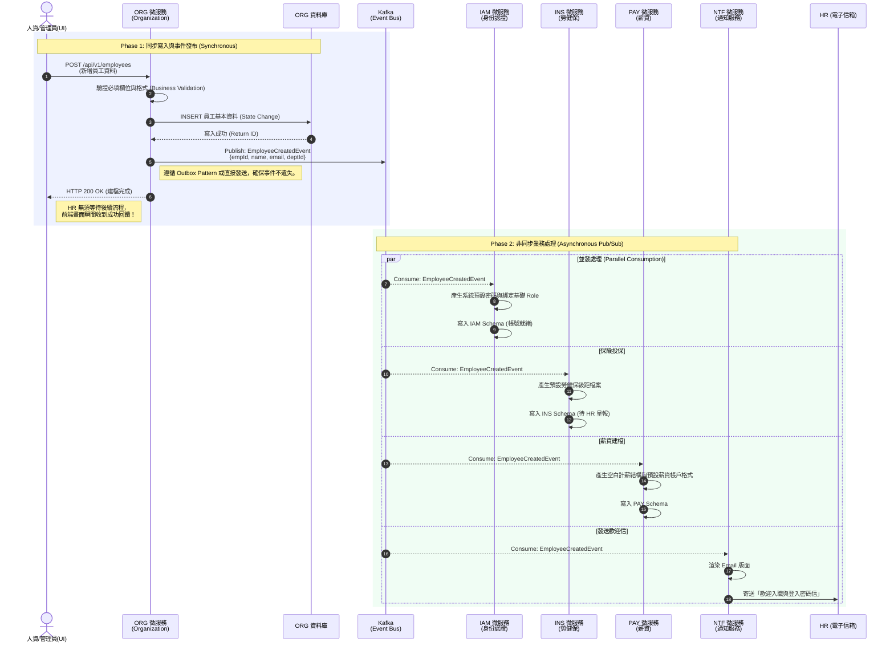

# 核心業務循序圖 (Core Sequence Diagrams)

本文件匯整了 HRMS 系統中最核心的系統循序圖 (Sequence Diagram)。透過這些循序圖，您可以清楚向面試官展示**事件驅動架構 (Event-Driven Architecture)** 如何解決傳統單體架構的強耦合問題，並達成單點故障隔離。

## 1. 新進員工入職流程 (Employee Onboarding Flow)

這是最能展示微服務特性的經典場景。當 HR 建立一筆新員工資料時，系統**不會**讓 Organization (組織模組) 依序同步呼叫 IAM、Payroll、Insurance 等服務，而是採取「發布 / 訂閱 (Pub/Sub)」模式非同步處理，大幅縮短了 HR 的等待時間。

### 💡 面試展現重點 (Interview Talking Points)

當面試官請您介紹這個流程時，您可以強調以下三個技術決策：

1. **為什麼不用 REST/Feign Client 同步呼叫？（解決系統耦合）**
   > 「如果使用同步呼叫 (Synchronous Call)，當 IAM 或 Payroll 某一個服務掛掉時，ORG 的新增操作就會跟著失敗並回滾；不僅如此，只要增加一個新模組（例如：之後要加上資產管理模組發配電腦），ORG 的程式碼又要被修改。
   >
   > 改用 Kafka 事件驅動後，ORG 只要『廣播』員工建立了，後續誰要處理完全不關 ORG 的事，符合 **單一職責原則 (SRP)** 與 **開閉原則 (OCP)**。」
   
2. **解決高併發下的效能瓶頸（提升使用者體驗）**
   > 「建立帳號、配置保險、計算薪資結構再加上寄送 Email，整個流程走完可能需要 3 到 5 秒。
   > 如果採用同步處理，HR 的畫面會卡住 (Spinning) 長達 5 秒；甚至如果剛好發送 Email 的 SMTP Server 超時，整個流程都會報錯。
   >
   > 導入非同步處理後，ORG 寫入資料跟把 Event 放進 Kafka 只需不到 50 毫秒 (ms)，畫面瞬間回傳成功。剩下的爛攤子...阿不是，剩下的業務邏輯交由背景服務自己慢慢處理 (Eventual Consistency, 最終一致性)。」

3. **如何保證事件不遺失？（資料一致性探討，如果面試官追問）**
   > 「在分散式系統中，為了避免資料庫寫入成功但是 Kafka 掛掉導致事件漏發。我們在架構設計上可以導入 **Outbox Pattern (發件箱模式)**，將領域事件先寫入關聯式資料庫的 `outbox_events` 表，與業務操作同屬一個 Transaction，再由排程或 Debezium (CDC) 非同步把 Event 送上 Kafka，達成 **At-Least-Once (至少一次)** 投遞保證。」
