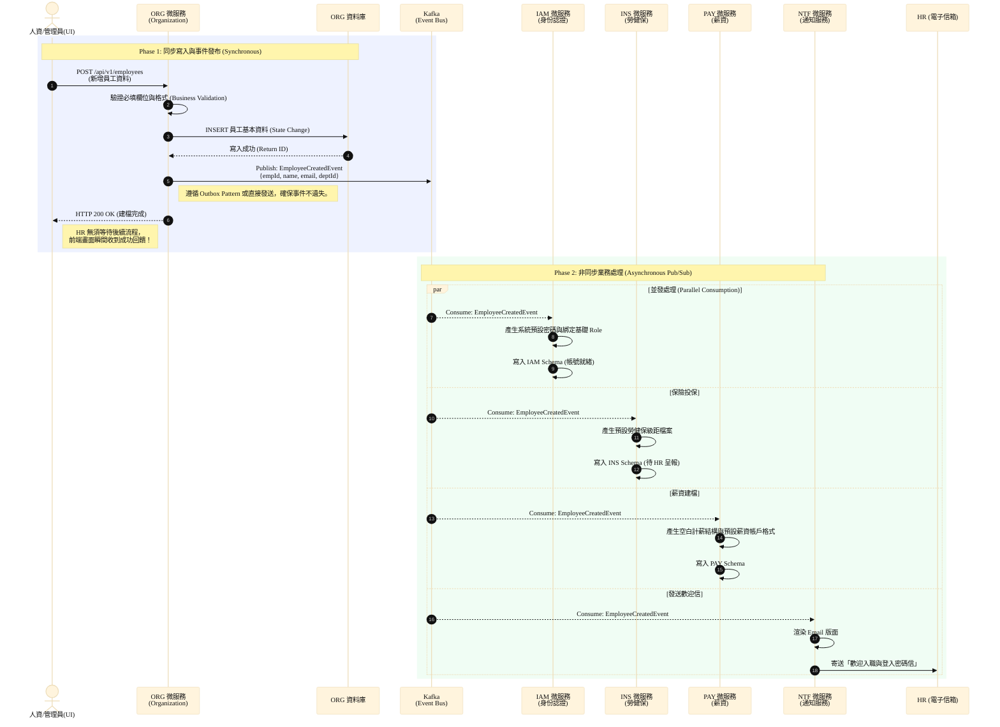

# 核心業務循序圖 (Core Sequence Diagrams)

本文件匯整了 HRMS 系統中最核心的系統循序圖 (Sequence Diagram)。透過這些循序圖，展示了本專案在**事件驅動架構 (Event-Driven Architecture)** 下的運作機制，說明如何解決傳統單體架構的強耦合問題，並達成微服務間的非同步協作與單點故障隔離。

## 一、 新進員工入職流程 (Employee Onboarding Flow)

此流程為展示微服務特性的經典場景。當人資 (HR) 建立一筆新員工資料時，系統**不會**讓 Organization (組織模組) 依序同步呼叫 IAM (權限)、Payroll (薪資)、Insurance (保險) 等服務，而是採取「發布 / 訂閱 (Pub/Sub)」模式進行非同步處理，大幅縮短了寫入資料的等待時間，並提高系統容錯率。

### 流程設計要點 (Architecture Design Points)

此設計涵蓋了以下三個重要技術決策：

1. **避免微服務間同步呼叫（解決系統耦合）**
   如果使用同步呼叫 (Synchronous REST Call)，當 IAM 或 Payroll 某一個服務無回應時，ORG 模組的新增操作就會跟著失敗並回滾。此外，未來若需增加新模組（例如資產管理模組發配電腦），ORG 的程式碼勢必面臨修改。
   改用 Kafka 事件驅動後，ORG 僅負責『廣播』員工建檔完成，後續處理不影響 ORG 的主流程，完全符合**單一職責原則 (SRP)** 與**開閉原則 (OCP)**。
   
2. **解決高併發下的效能瓶頸（提升使用者體驗）**
   建立帳號、配置保險、計算薪資結構乃至寄送 Email，整體流程可能耗時 3 至 5 秒。採用非同步處理後，ORG 寫入資料與將 Event 放進 Kafka 只需不到 50 毫秒 (ms)，使用端可瞬間收到成功回饋。其餘業務邏輯交由背景服務獨立且平行地處理，達到**最終一致性 (Eventual Consistency)**。

3. **分散式交易的事件不遺失保證（資料一致性）**
   為了避免資料庫寫入成功，但 Kafka 服務異常導致事件漏發。在架構設計上採用 **Outbox Pattern (發件箱模式)**，將領域事件先寫入關聯式資料庫的 `outbox_events` 表，與業務操作同屬一個 Transaction，再由系統排程或 Debezium (CDC) 非同步將 Event 推送至 Kafka，以達成 **At-Least-Once (至少一次)** 投遞保證。
