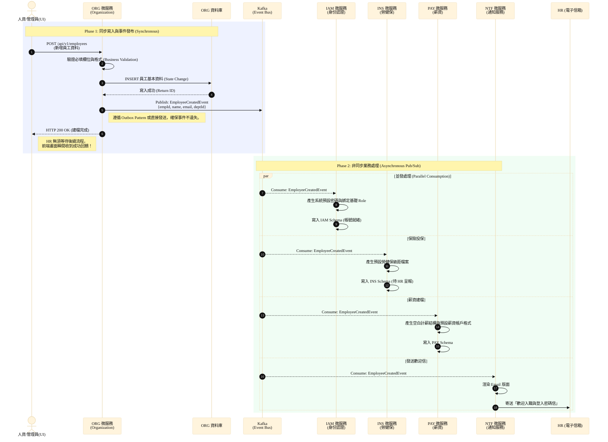
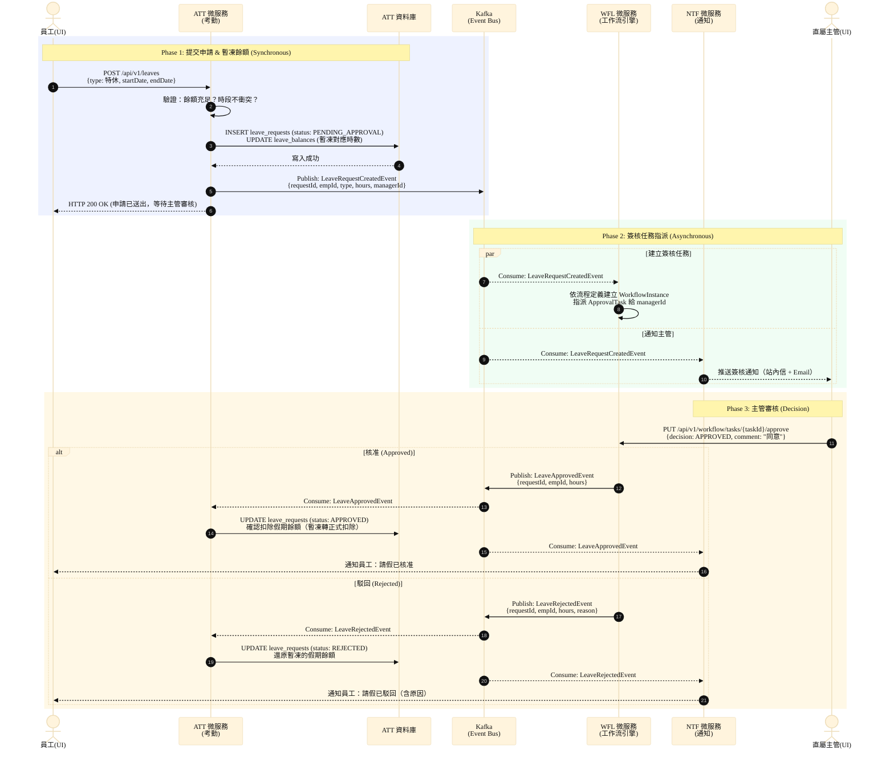
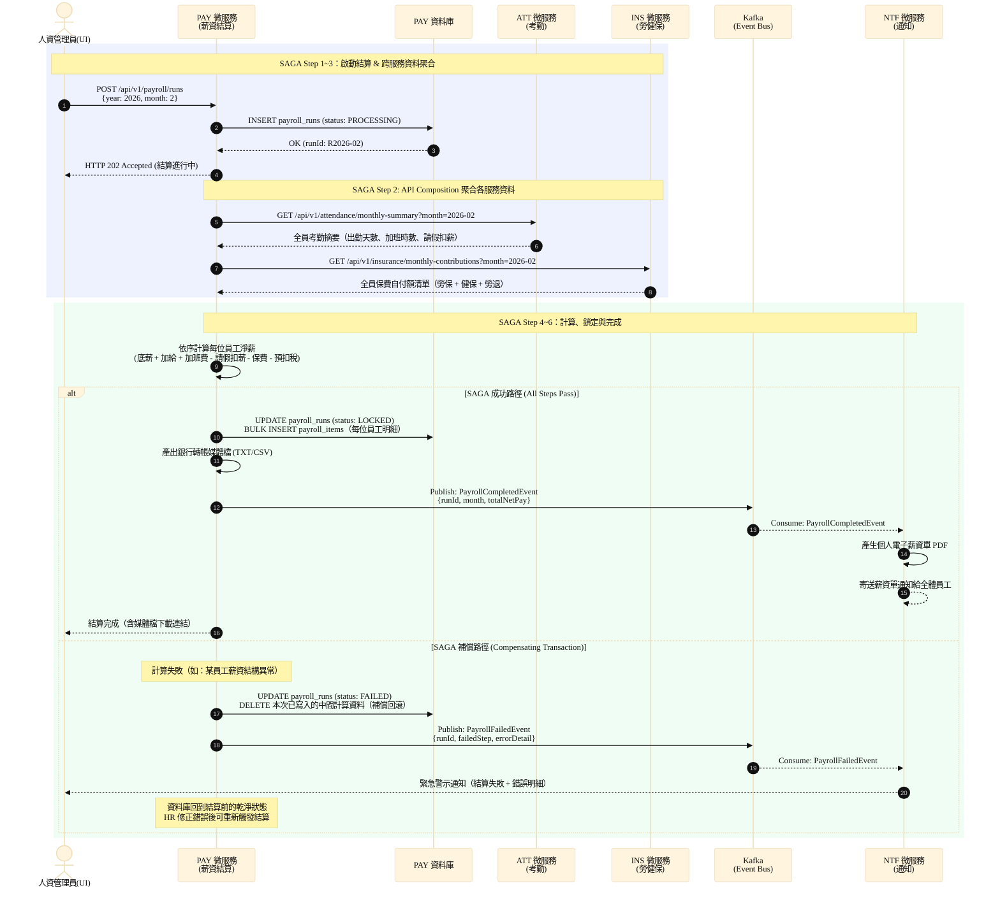
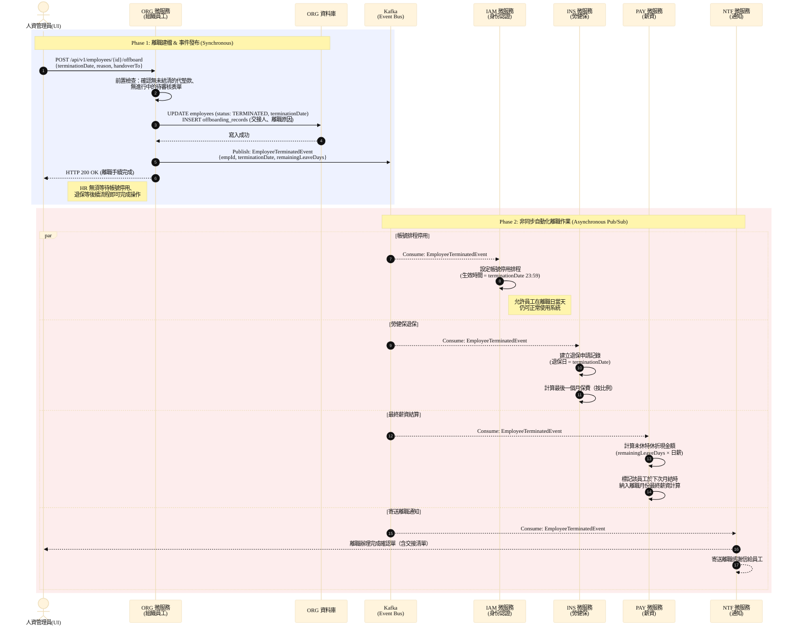

# 核心業務循序圖 (Core Sequence Diagrams)

本文件匯整了 HRMS 系統中最核心的系統循序圖 (Sequence Diagram)。透過這些循序圖，展示了本專案在**事件驅動架構 (Event-Driven Architecture)** 下的運作機制，說明如何解決傳統單體架構的強耦合問題，並達成微服務間的非同步協作與單點故障隔離。

## 一、 新進員工入職流程 (Employee Onboarding Flow)

此流程為展示微服務特性的經典場景。當人資 (HR) 建立一筆新員工資料時，系統**不會**讓 Organization (組織模組) 依序同步呼叫 IAM (權限)、Payroll (薪資)、Insurance (保險) 等服務，而是採取「發布 / 訂閱 (Pub/Sub)」模式進行非同步處理，大幅縮短了寫入資料的等待時間，並提高系統容錯率。

### 流程設計要點 (Architecture Design Points)

此設計涵蓋了以下三個重要技術決策：

1. **避免微服務間同步呼叫（解決系統耦合）**
   如果使用同步呼叫 (Synchronous REST Call)，當 IAM 或 Payroll 某一個服務無回應時，ORG 模組的新增操作就會跟著失敗並回滾。此外，未來若需增加新模組（例如資產管理模組發配電腦），ORG 的程式碼勢必面臨修改。
   改用 Kafka 事件驅動後，ORG 僅負責『廣播』員工建檔完成，後續處理不影響 ORG 的主流程，完全符合**單一職責原則 (SRP)** 與**開閉原則 (OCP)**。
   
2. **解決高併發下的效能瓶頸（提升使用者體驗）**
   建立帳號、配置保險、計算薪資結構乃至寄送 Email，整體流程可能耗時 3 至 5 秒。採用非同步處理後，ORG 寫入資料與將 Event 放進 Kafka 只需不到 50 毫秒 (ms)，使用端可瞬間收到成功回饋。其餘業務邏輯交由背景服務獨立且平行地處理，達到**最終一致性 (Eventual Consistency)**。

3. **分散式交易的事件不遺失保證（資料一致性）**
   為了避免資料庫寫入成功，但 Kafka 服務異常導致事件漏發。在架構設計上採用 **Outbox Pattern (發件箱模式)**，將領域事件先寫入關聯式資料庫的 `outbox_events` 表，與業務操作同屬一個 Transaction，再由系統排程或 Debezium (CDC) 非同步將 Event 推送至 Kafka，以達成 **At-Least-Once (至少一次)** 投遞保證。

---

## 二、 請假簽核流程 (Leave Approval Flow)

此流程展示 **WFL（工作流引擎）** 與 **ATT（考勤模組）** 之間透過 Kafka 解耦的多階簽核設計。員工提交請假申請後，系統立即回應成功，並非同步觸發簽核任務指派與主管通知，最終依審核結果更新假期餘額。

### 流程設計要點

1. **ATT 與 WFL 完全解耦**：ATT 不直接呼叫 WFL，只需發布事件。未來若簽核規則改變（如增加 HR 複核），只需修改 WFL 的流程定義，ATT 零改動。

2. **餘額暫凍機制**：申請提交後立即凍結對應時數，防止同一時段被重複申請；駁回後自動解凍，不需人工介入。

3. **雙向事件確認**：核准和駁回各有獨立的 Domain Event，下游服務（ATT、NTF）各自訂閱並處理，流程可稽核、可重播。

---

## 三、 薪資月結 SAGA 補償流程 (Payroll Monthly Run with SAGA)

此流程展示 **SAGA Pattern** 如何在不使用分散式鎖（2PC）的前提下，確保薪資結算的資料一致性。薪資計算需跨 ATT、INS、PAY 三個服務聚合資料，任何步驟失敗都會觸發補償交易，不留中間污染狀態。

### 流程設計要點

1. **為何選 SAGA 而非 2PC**：跨微服務無法使用全域資料庫鎖。SAGA 的每個步驟只鎖自己的資料，失敗時透過補償交易逆向回滾，不阻塞其他服務。

2. **API Composition vs 事件驅動**：薪資結算需要「同步聚合」考勤與保費資料（當下最新數據），因此採用同步 REST API Composition，而非非同步事件訂閱。

3. **冪等性設計**：`payroll_runs` 以 `(year, month)` 為唯一鍵，重複觸發不會產生重複批次；補償交易使用 `DELETE WHERE run_id = ?` 確保冪等清除。

---

## 四、 員工離職流程 (Employee Offboarding Flow)

此流程為入職流程的鏡像，同樣展示事件驅動的**一事件多服務響應**模式。HR 只需執行一個「辦理離職」操作，後續的帳號停用、退保、最終薪資結算全部由各服務自主完成，無需人工逐一操作。

### 流程設計要點

1. **與入職流程的對稱設計**：`EmployeeTerminatedEvent` 與 `EmployeeCreatedEvent` 結構對稱，各服務訂閱自己關心的事件並自主處理，ORG 不需要知道有哪些下游服務存在。

2. **帳號停用的時間差設計**：IAM 設定的是**排程停用**而非立即停用，允許員工在離職日當天完成最後的工作交接（如最後一次系統操作），避免即時停用造成業務中斷。

3. **未休特休折現計算**：PAY 在收到事件時先計算折現金額並標記，等到當月薪資結算時一併納入最終薪資，確保計算時機與薪資週期對齊，不造成額外的帳款。
