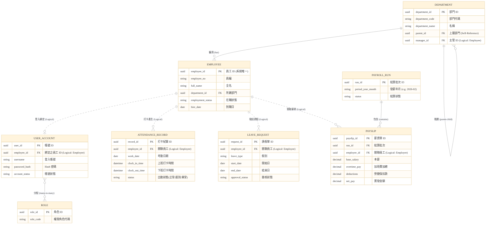

# 核心實體關聯圖 (Global Entity Relationship Diagram)

本文件展示 HRMS 系統的跨服務邏輯實體關聯圖 (Logical ERD)。在微服務架構 (Microservices) 及「每服務一資料庫 (Database-per-service)」的設計下，不同模組之間**並不存在實體的外鍵約束 (No Physical Foreign Keys)**。跨模組的資料實體皆以 UUID 作為邏輯引用 (Logical Reference)，並透過事件驅動或 API Composition 進行資料聚合。

### 關聯設計要點 (Schema Design Principles)

本系統的資料架構具備以下三個高可用性與資安防護的設計特徵：

1. **跨微服務無實體外鍵（No Physical Foreign Keys）**
   在傳統單體 (Monolith) 系統中，跨業務模組常倚賴實體關聯 (如：`Payroll.employee_id` 指向 `Employee` 表)。在本系統微服務架構中，薪資模組 (Payroll) 與人事模組 (Organization) 具備獨立的 PostgreSQL Schema，改以邏輯外鍵 (Logical Reference) 進行弱關聯 (如圖上虛線所示)。此舉能徹底隔離單一模組資料庫異常所引發的死鎖 (Deadlock) 與系統級存取失效。

2. **跨模組資料聚合策略 (Data Aggregation & API Composition)**
   由於跨庫無法執行 SQL JOIN 語句，當前端要求複合性檢視表 (如：包含員工姓名與部門名稱的打卡列表) 時，系統採取 **CQRS 加上 API Composition** 的架構設計。在主領域模型撈取分頁資料後，利用 Application Service 發出批次查詢 (Batch Query) 獲取來自關聯模組的 Snapshot；針對高頻讀取的情境，則利用 Kafka 訂閱關聯實體的異動事件，於本地端維護讀取專用的快取模型 (Read-Model)。

3. **採用 UUID 構築無狀態主鍵設計**
   所有微服務之領域實體皆強制採用 `UUID V4` 取代傳統的 Auto Increment ID。此策略除避免在跨微服務水平擴展時發生 ID 碰撞外，更天然地阻絕了 **ID 猜測攻擊 (BOLA: Broken Object Level Authorization)**，使得資料探勘與外洩風險降至最低。
