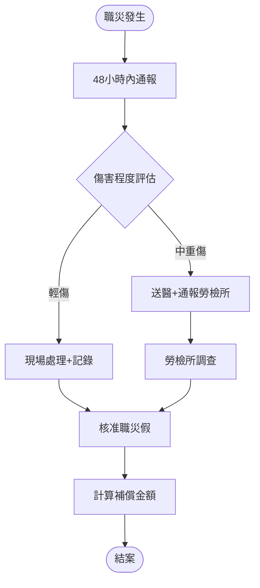
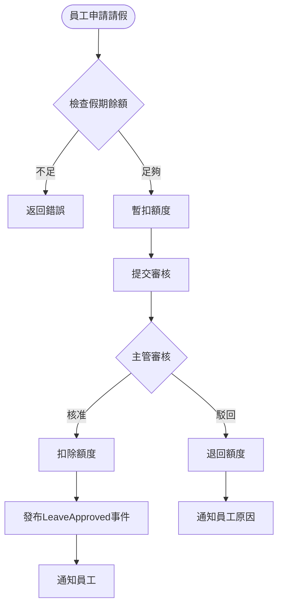
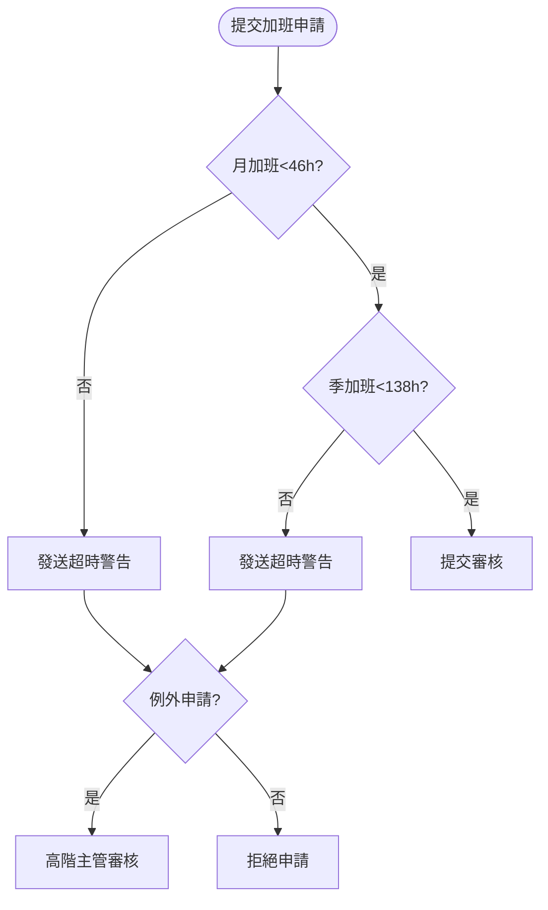
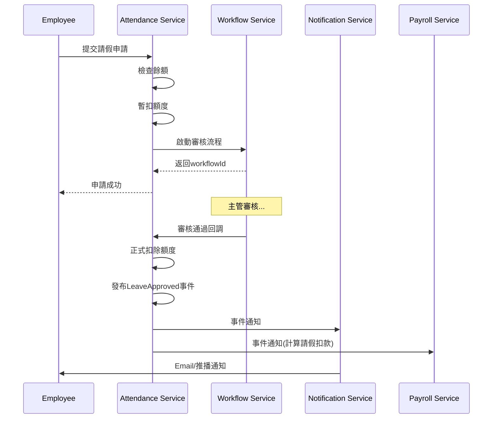

# 考勤管理服務(Attendance Service) 需求分析書

**版本:** 1.0  
**日期:** 2025-11-24  
**所屬領域:** 支撐領域 (Supporting Domain)  
**導入階段:** 第一階段（核心基礎服務）

---

## 1. 服務定位與職責

### 1.1 服務概述
考勤管理服務負責員工的出勤管理、假勤申請與審核，以及加班管理。本服務必須確保**符合台灣勞動基準法**的所有規定，特別是加班時數管控、特休假計算等法規要求。

### 1.2 核心職責
- **打卡管理:** 多元打卡方式、打卡異常偵測、補卡申請
- **班別設定:** 彈性班別、輪班、彈性工時管理
- **假勤管理:** 20+種假別設定、請假申請與審核、假期餘額計算
- **特休假管理:** 依勞基法自動計算特休、到期提醒、未休補償
- **加班管理:** 加班申請審核、加班時數管控（46小時/月、138小時/3月）
- **變形工時:** 支援二週/四週/八週變形工時排班
- **法規遵循:** 女性員工保護、職業災害管理
- **差勤報表:** 個人/部門月度差勤統計

### 1.3 服務邊界
**屬於本服務:**
- 打卡記錄
- 請假申請與審核
- 加班申請與審核
- 假期餘額計算
- 班別與假別規則設定

**不屬於本服務:**
- 薪資計算（Payroll Service使用本服務數據）
- 員工基本資料（Organization Service）
- 審核流程引擎（Workflow Service）

---

## 2. 限界上下文定義

### 2.1 上下文名稱
**Attendance Context (考勤上下文)**

### 2.2 通用語言

| 術語 | 定義 | 範例 |
|:---|:---|:---|
| AttendanceRecord | 打卡記錄 | 上班打卡、下班打卡 |
| Shift | 班別 | 標準班、彈性班、輪班 |
| LeaveType | 假別 | 特休、事假、病假、婚假 |
| LeaveApplication | 請假申請 | 申請2天特休 |
| LeaveBalance | 假期餘額 | 特休剩餘10天 |
| AnnualLeave | 特休假（勞基法規定） | 年資1年=7天特休 |
| Overtime | 加班 | 平日加班、假日加班 |
| FlexTime | 彈性工時/變形工時 | 二週變形、四週變形 |
| Anomaly | 打卡異常 | 遲到、早退、忘打卡 |

---

## 3. 領域模型設計

### 3.1 聚合根

#### 聚合根1: Shift (班別)
**職責:** 定義工作班別與工時規則

**屬性:**
```
Shift {
  shiftId: UUID (PK)
  shiftCode: String (unique)
  shiftName: String
  organizationId: UUID
  shiftType: ShiftType
  
  // 工時設定
  workStartTime: Time
  workEndTime: Time
  breakStartTime: Time
  breakEndTime: Time
  workingHours: Decimal
  
  // 容許時間
  lateToleranceMinutes: Integer (遲到容許分鐘)
  earlyLeaveToleranceMinutes: Integer
  
  isActive: Boolean
  createdAt: DateTime
}

enum ShiftType {
  STANDARD    // 標準班（固定時間）
  FLEXIBLE    // 彈性班（彈性上下班）
  ROTATING    // 輪班
}
```

#### 聚合根2: LeaveType (假別)
**職責:** 定義假別與其規則

**屬性:**
```
LeaveType {
  leaveTypeId: UUID (PK)
  leaveCode: String (unique)
  leaveName: String
  organizationId: UUID
  
  // 規則
  isPaid: Boolean (是否支薪)
  payRate: Decimal (支薪比例，1=全薪，0.5=半薪)
  requiresProof: Boolean (是否需要證明文件)
  proofDescription: String
  unit: LeaveUnit (請假單位)
  maxDaysPerYear: Decimal (nullable, 年度上限天數)
  canCarryover: Boolean (是否可遞延)
  
  // 勞基法特殊假別
  isStatutoryLeave: Boolean
  statutoryType: StatutoryLeaveType (nullable)
  
  isActive: Boolean
  createdAt: DateTime
}

enum LeaveUnit {
  HOUR      // 以小時計
  HALF_DAY  // 以半天計
  FULL_DAY  // 以全天計
}

enum StatutoryLeaveType {
  ANNUAL_LEAVE         // 特休
  SICK_LEAVE           // 病假
  PERSONAL_LEAVE       // 事假
  MARRIAGE_LEAVE       // 婚假
  BEREAVEMENT_LEAVE    // 喪假
  MATERNITY_LEAVE      // 產假
  PATERNITY_LEAVE      // 陪產假
  MENSTRUAL_LEAVE      // 生理假
  PARENTAL_LEAVE       // 育嬰留停
}
```

#### 聚合根3: AttendanceRecord (打卡記錄)
**職責:** 記錄員工打卡

**屬性:**
```
AttendanceRecord {
  recordId: UUID (PK)
  employeeId: UUID (FK)
  recordDate: Date
  shiftId: UUID (FK)
  
  // 打卡時間
  checkInTime: DateTime (nullable)
  checkOutTime: DateTime (nullable)
  
  // 打卡位置資訊
  checkInLocation: GPSLocation (nullable)
  checkOutLocation: GPSLocation (nullable)
  checkInIP: String
  checkOutIP: String
  
  // 計算結果
  workingHours: Decimal (nullable, 實際工時)
  isLate: Boolean
  lateMinutes: Integer
  isEarlyLeave: Boolean
  earlyLeaveMinutes: Integer
  
  // 異常處理
  anomalyType: AnomalyType (nullable)
  anomalyNote: String (nullable)
  isCorrected: Boolean (是否已補卡)
  
  createdAt: DateTime
  updatedAt: DateTime
}

enum AnomalyType {
  LATE              // 遲到
  EARLY_LEAVE       // 早退
  MISSING_CHECK_IN  // 忘記上班打卡
  MISSING_CHECK_OUT // 忘記下班打卡
  ABNORMAL_LOCATION // 異常地點打卡
}
```

**領域行為:**
- `checkIn(time, location, ip)`: 上班打卡
- `checkOut(time, location, ip)`: 下班打卡
- `detectAnomaly()`: 偵測打卡異常
- `calculateWorkingHours()`: 計算工時

#### 聚合根4: LeaveApplication (請假申請)
**職責:** 員工請假申請與審核

**屬性:**
```
LeaveApplication {
  applicationId: UUID (PK)
  employeeId: UUID (FK)
  leaveTypeId: UUID (FK)
  
  // 請假時間
  startDate: Date
  endDate: Date
  startPeriod: DayPeriod (AM, PM, FULL_DAY)
  endPeriod: DayPeriod
  totalDays: Decimal
  totalHours: Decimal
  
  // 申請資訊
  reason: String
  proofAttachmentUrl: String (nullable)
  appliedAt: DateTime
  
  // 審核資訊
  status: ApplicationStatus
  approverId: UUID (nullable, FK to Employee)
  approvedAt: DateTime (nullable)
  rejectionReason: String (nullable)
  
  // Workflow
  workflowInstanceId: UUID (nullable)
  
  createdAt: DateTime
  updatedAt: DateTime
}

enum DayPeriod {
  AM        // 上午
  PM        // 下午
  FULL_DAY  // 全天
}

enum ApplicationStatus {
  DRAFT           // 草稿
  PENDING         // 待審核
  APPROVED        // 已核准
  REJECTED        // 已駁回
  CANCELLED       // 已取消
}
```

**領域行為:**
- `submit()`: 提交申請
- `approve(approverId)`: 審核通過
- `reject(approverId, reason)`: 駁回
- `cancel()`: 取消申請
- `calculateLeaveDays()`: 計算請假天數

#### 聚合根5: OvertimeApplication (加班申請)
**職責:** 員工加班申請與審核

**屬性:**
```
OvertimeApplication {
  overtimeId: UUID (PK)
  employeeId: UUID (FK)
  
  // 加班時間
  overtimeDate: Date
  startTime: Time
  endTime: Time
  overtimeHours: Decimal
  overtimeType: OvertimeType
  
  // 申請資訊
  reason: String
  appliedAt: DateTime
  
  // 審核資訊
  status: ApplicationStatus
  approverId: UUID (nullable)
  approvedAt: DateTime (nullable)
  rejectionReason: String (nullable)
  
  // 補償方式
  compensationType: CompensationType
  isCompensated: Boolean (是否已補償)
  
  createdAt: DateTime
}

enum OvertimeType {
  WEEKDAY        // 平日加班
  REST_DAY       // 休息日加班
  HOLIDAY        // 國定假日加班
}

enum CompensationType {
  PAY           // 加班費
  COMP_TIME     // 補休
}
```

**領域行為:**
- `submit()`: 提交申請
- `approve(approverId)`: 審核通過
- `checkMonthlyLimit(employeeId)`: 檢查月加班時數上限

#### 聚合根6: LeaveBalance (假期餘額)
**職責:** 管理員工各類假別的餘額

**屬性:**
```
LeaveBalance {
  balanceId: UUID (PK)
  employeeId: UUID (FK)
  leaveTypeId: UUID (FK)
  year: Integer
  
  // 額度
  totalDays: Decimal (年度總額度)
  usedDays: Decimal (已使用)
  remainingDays: Decimal (剩餘)
  
  // 特休特殊欄位
  isAnnualLeave: Boolean
  expiryDate: Date (nullable, 特休到期日)
  
  updatedAt: DateTime
}
```

**領域行為:**
- `deduct(days)`: 扣除假期
- `refund(days)`: 退回假期（取消請假）
- `checkExpiry()`: 檢查是否即將到期

#### 聚合根7: AnnualLeavePolicy (特休假政策)
**職責:** 依勞基法計算特休天數

**屬性:**
```
AnnualLeavePolicy {
  policyId: UUID (PK)
  organizationId: UUID
  
  // 勞基法規則（年資→天數對映）
  rules: List<AnnualLeaveRule>
  
  // 到期政策
  expiryMonths: Integer (特休有效期，月數)
  compensationEnabled: Boolean (是否補償未休假)
}

AnnualLeaveRule {
  minServiceYears: Decimal
  maxServiceYears: Decimal
  leaveDays: Integer
}

預設規則範例：
- 6個月以上~1年未滿: 3天（依比例）
- 1年以上~2年未滿: 7天
- 2年以上~3年未滿: 10天
- 3年以上~5年未滿: 14天
- 5年以上~10年未滿: 15天
- 10年以上，每1年加1天，上限30天
```

**領域行為:**
- `calculateAnnualLeave(hireDate, currentDate)`: 計算特休天數
- `calculateUnusedCompensation(balance)`: 計算未休補償工資

---

## 4. 領域事件定義

### 4.1 事件清單

| 事件名稱 | 觸發時機 | 事件負載 | 訂閱服務 |
|:---|:---|:---|:---|
| `AttendanceRecorded` | 員工打卡 | employeeId, recordDate, checkInTime, checkOutTime | - |
| `AttendanceAnomalyDetected` | 偵測到打卡異常 | employeeId, anomalyType, recordDate | Notification |
| `LeaveApplied` | 請假申請提交 | applicationId, employeeId, leaveTypeId, days | Workflow |
| `LeaveApproved` | 請假審核通過 | applicationId, employeeId, approved Days | Payroll |
| `LeaveRejected` | 請假審核駁回 | applicationId, reason | Notification |
| `OvertimeApplied` | 加班申請提交 | overtimeId, employeeId, hours | Workflow |
| `OvertimeApproved` | 加班審核通過 | overtimeId, employeeId, hours, overtimeType | Payroll |
| `OvertimeLimitExceeded` | 加班時數超過上限 | employeeId, monthlyHours, limit | Notification |
| `AnnualLeaveExpiring` | 特休即將到期 | employeeId, remainingDays, expiryDate | Notification |
| `AttendanceMonthClosed` | 月度差勤結算 | month, employeeId, totalWorkHours, totalOvertime, totalLeave | Payroll |

---

## 5. API設計

### 5.1 打卡API

#### 5.1.1 員工打卡（上班）
```
POST /api/v1/attendance/check-in
Authorization: Bearer {token}

Request:
{
  "employeeId": "uuid",
  "checkInTime": "2025-11-24T09:05:00",
  "location": {
    "latitude": 25.033,
    "longitude": 121.565
  },
  "ipAddress": "192.168.1.100"
}

Response 200:
{
  "recordId": "uuid",
  "checkInTime": "2025-11-24T09:05:00",
  "isLate": true,
  "lateMinutes": 5,
  "shift": {
    "shiftName": "標準班",
    "workStartTime": "09:00"
  }
}
```

**業務邏輯:**
1. 驗證員工是否存在且在職
2. 查詢員工班別
3. 檢查GPS定位是否在允許範圍內（誤差<50m）
4. 檢查IP是否在白名單內（若有設定）
5. 計算是否遲到
6. 若異常，標記anomalyType
7. 儲存打卡記錄

#### 5.1.2 員工打卡（下班）
```
POST /api/v1/attendance/check-out
Authorization: Bearer {token}

Request:
{
  "employeeId": "uuid",
  "checkOutTime": "2025-11-24T18:30:00",
  "location": {...}
}

Response 200:
{
  "recordId": "uuid",
  "checkInTime": "2025-11-24T09:05:00",
  "checkOutTime": "2025-11-24T18:30:00",
  "workingHours": 8.42,
  "isEarlyLeave": false
}
```

**業務邏輯:**
1. 查詢當日上班打卡記錄
2. 更新下班時間
3. 計算實際工時 = (下班時間 - 上班時間) - 休息時間
4. 檢查是否早退

#### 5.1.3 查詢個人打卡記錄
```
GET /api/v1/attendance/records?employeeId={id}&startDate={date}&endDate={date}
Authorization: Bearer {token}

Response 200:
[
  {
    "recordId": "uuid",
    "recordDate": "2025-11-24",
    "checkInTime": "09:05",
    "checkOutTime": "18:30",
    "workingHours": 8.42,
    "isLate": true,
    "lateMinutes": 5,
    "anomalyType": "LATE"
  }
]
```

#### 5.1.4 申請補卡
```
POST /api/v1/attendance/correction
Authorization: Bearer {token}

Request:
{
  "recordId": "uuid",
  "correctedCheckInTime": "09:00",
  "reason": "忘記打卡"
}

Response 201:
{
  "correctionId": "uuid",
  "status": "PENDING",
  "workflowInstanceId": "uuid"
}
```

**業務邏輯:**
- 提交至Workflow Service審核
- 審核通過後更新AttendanceRecord

### 5.2 請假API

#### 5.2.1 查詢假期餘額
```
GET /api/v1/leave/balances?employeeId={id}
Authorization: Bearer {token}

Response 200:
[
  {
    "leaveType": {
      "leaveCode": "ANNUAL",
      "leaveName": "特休假"
    },
    "year": 2025,
    "totalDays": 10,
    "usedDays": 3.5,
    "remainingDays": 6.5,
    "expiryDate": "2026-12-31"
  },
  {
    "leaveType": {
      "leaveCode": "SICK",
      "leaveName": "病假"
    },
    "year": 2025,
    "totalDays": 30,
    "usedDays": 2,
    "remainingDays": 28
  }
]
```

#### 5.2.2 提交請假申請
```
POST /api/v1/leave/applications
Authorization: Bearer {token}

Request:
{
  "employeeId": "uuid",
  "leaveTypeId": "uuid",
  "startDate": "2025-12-01",
  "endDate": "2025-12-02",
  "startPeriod": "FULL_DAY",
  "endPeriod": "FULL_DAY",
  "reason": "家庭事務",
  "proofAttachmentUrl": null
}

Response 201:
{
  "applicationId": "uuid",
  "totalDays": 2,
  "remainingBalance": 4.5,
  "status": "PENDING",
  "workflowInstanceId": "uuid"
}
```

**業務邏輯:**
1. 檢查假期餘額是否足夠
2. 檢查日期區間是否與其他請假或出差重疊
3. 若需要證明文件，檢查是否已上傳
4. 計算請假天數（扣除例假日、國定假日）
5. 提交至Workflow Service審核
6. 返回待審核狀態

#### 5.2.3 審核請假（主管）
```
PUT /api/v1/leave/applications/{id}/approve
Authorization: Bearer {token}
Required Permission: attendance:leave:approve

Response 200:
{
  "applicationId": "uuid",
  "status": "APPROVED",
  "approvedBy": "李經理",
  "approvedAt": "2025-11-24T10:00:00Z"
}
```

**後續動作:**
- 扣除LeaveBalance
- 發布 `LeaveApproved` 事件 → Payroll Service（計算請假扣款）
- 發送通知給申請員工

### 5.3 加班API

#### 5.3.1 提交加班申請
```
POST /api/v1/overtime/applications
Authorization: Bearer {token}

Request:
{
  "employeeId": "uuid",
  "overtimeDate": "2025-11-24",
  "startTime": "18:00",
  "endTime": "20:00",
  "overtimeType": "WEEKDAY",
  "reason": "專案趕工",
  "compensationType": "PAY"
}

Response 201:
{
  "overtimeId": "uuid",
  "overtimeHours": 2,
  "overtimeType": "WEEKDAY",
  "status": "PENDING",
  "monthlyAccumulatedHours": 12,
  "monthlyLimit": 46
}
```

**業務邏輯:**
1. 計算加班時數
2. 檢查月加班時數是否超過46小時
3. 檢查三個月加班時數是否超過138小時
4. 若超過，發送警告（可設定是否允許申請）
5. 提交至Workflow Service審核

#### 5.3.2 審核加班（主管）
```
PUT /api/v1/overtime/applications/{id}/approve
Authorization: Bearer {token}
Required Permission: attendance:overtime:approve

Response 200:
{
  "overtimeId": "uuid",
  "status": "APPROVED"
}
```

**後續動作:**
- 發布 `OvertimeApproved` 事件 → Payroll Service（計算加班費）
- 若選擇補休，建立補休額度

#### 5.3.3 查詢員工加班統計
```
GET /api/v1/overtime/statistics?employeeId={id}&month={month}
Authorization: Bearer {token}

Response 200:
{
  "employeeId": "uuid",
  "month": "2025-11",
  "totalOvertimeHours": 15.5,
  "byType": {
    "WEEKDAY": 12,
    "REST_DAY": 3.5,
    "HOLIDAY": 0
  },
  "monthlyLimit": 46,
  "quarterlyUsed": 38,
  "quarterlyLimit": 138,
  "warnings": []
}
```

### 5.4 特休假管理API

#### 5.4.1 觸發特休假計算（Job定期執行）
```
POST /api/v1/leave/annual-leave/calculate
Authorization: Bearer {token}
Required Permission: leave:annual:calculate

Request:
{
  "employeeIds": ["uuid1", "uuid2"],
  "effectiveDate": "2025-01-01"
}

Response 200:
{
  "processed": 150,
  "summary": [
    {
      "employeeId": "uuid1",
      "serviceYears": 2.5,
      "annualLeaveDays": 10,
      "expiryDate": "2026-12-31"
    }
  ]
}
```

**業務邏輯:**
1. 查詢員工到職日，計算年資
2. 依AnnualLeavePolicy規則計算特休天數
3. 建立或更新LeaveBalance
4. 若有前一年度未休完特休，檢查補償政策

#### 5.4.2 查詢即將到期的特休
```
GET /api/v1/leave/annual-leave/expiring?days=30
Authorization: Bearer {token}
Required Permission: leave:read

Response 200:
[
  {
    "employeeId": "uuid",
    "employeeName": "張三",
    "remainingDays": 5,
    "expiryDate": "2025-12-31",
    "daysUntilExpiry": 25
  }
]
```

**自動提醒:**
- 定期Job每日檢查，到期前30天發布 `AnnualLeaveExpiring` 事件
- Notification Service發送提醒

### 5.5 月度結算API

#### 5.5.1 月度差勤結算（HR執行）
```
POST /api/v1/attendance/monthly-close
Authorization: Bearer {token}
Required Permission: attendance:close

Request:
{
  "month": "2025-11",
  "organizationId": "uuid"
}

Response 200:
{
  "month": "2025-11",
  "totalEmployees": 150,
  "closedAt": "2025-12-01T00:00:00Z"
}
```

**業務邏輯:**
1. 彙總該月所有員工的打卡記錄、請假、加班
2. 計算總工時、總加班時數、總請假天數
3. 標記為「已結算」，不可再修改
4. 為每位員工發布 `AttendanceMonthClosed` 事件
5. Payroll Service訂閱事件，取得差勤數據進行薪資計算

---

## 6. 資料模型設計

### 6.1 資料庫Schema (PostgreSQL)

```sql
-- 班別表
CREATE TABLE shifts (
    shift_id UUID PRIMARY KEY DEFAULT gen_random_uuid(),
    shift_code VARCHAR(50) UNIQUE NOT NULL,
    shift_name VARCHAR(255) NOT NULL,
    organization_id UUID NOT NULL,
    shift_type VARCHAR(20) NOT NULL,
    work_start_time TIME NOT NULL,
    work_end_time TIME NOT NULL,
    break_start_time TIME,
    break_end_time TIME,
    working_hours DECIMAL(4,2) NOT NULL,
    late_tolerance_minutes INTEGER DEFAULT 0,
    early_leave_tolerance_minutes INTEGER DEFAULT 0,
    is_active BOOLEAN DEFAULT TRUE,
    created_at TIMESTAMP DEFAULT CURRENT_TIMESTAMP,
    
    CONSTRAINT chk_shift_type CHECK (shift_type IN ('STANDARD', 'FLEXIBLE', 'ROTATING'))
);

-- 假別表
CREATE TABLE leave_types (
    leave_type_id UUID PRIMARY KEY DEFAULT gen_random_uuid(),
    leave_code VARCHAR(50) UNIQUE NOT NULL,
    leave_name VARCHAR(255) NOT NULL,
    organization_id UUID,
    is_paid BOOLEAN DEFAULT FALSE,
    pay_rate DECIMAL(3,2) DEFAULT 0,
    requires_proof BOOLEAN DEFAULT FALSE,
    proof_description TEXT,
    unit VARCHAR(20) NOT NULL,
    max_days_per_year DECIMAL(5,2),
    can_carryover BOOLEAN DEFAULT FALSE,
    is_statutory_leave BOOLEAN DEFAULT FALSE,
    statutory_type VARCHAR(50),
    is_active BOOLEAN DEFAULT TRUE,
    created_at TIMESTAMP DEFAULT CURRENT_TIMESTAMP,
    
    CONSTRAINT chk_unit CHECK (unit IN ('HOUR', 'HALF_DAY', 'FULL_DAY'))
);

-- 打卡記錄表
CREATE TABLE attendance_records (
    record_id UUID PRIMARY KEY DEFAULT gen_random_uuid(),
    employee_id UUID NOT NULL,
    record_date DATE NOT NULL,
    shift_id UUID REFERENCES shifts(shift_id),
    
    check_in_time TIMESTAMP,
    check_out_time TIMESTAMP,
    check_in_location JSONB,
    check_out_location JSONB,
    check_in_ip VARCHAR(50),
    check_out_ip VARCHAR(50),
    
    working_hours DECIMAL(5,2),
    is_late BOOLEAN DEFAULT FALSE,
    late_minutes INTEGER DEFAULT 0,
    is_early_leave BOOLEAN DEFAULT FALSE,
    early_leave_minutes INTEGER DEFAULT 0,
    
    anomaly_type VARCHAR(30),
    anomaly_note TEXT,
    is_corrected BOOLEAN DEFAULT FALSE,
    
    created_at TIMESTAMP DEFAULT CURRENT_TIMESTAMP,
    updated_at TIMESTAMP DEFAULT CURRENT_TIMESTAMP,
    
    UNIQUE(employee_id, record_date),
    CONSTRAINT chk_anomaly CHECK (anomaly_type IN ('LATE', 'EARLY_LEAVE', 'MISSING_CHECK_IN', 'MISSING_CHECK_OUT', 'ABNORMAL_LOCATION'))
);

CREATE INDEX idx_attendance_emp_date ON attendance_records(employee_id, record_date);

-- 請假申請表
CREATE TABLE leave_applications (
    application_id UUID PRIMARY KEY DEFAULT gen_random_uuid(),
    employee_id UUID NOT NULL,
    leave_type_id UUID NOT NULL REFERENCES leave_types(leave_type_id),
    
    start_date DATE NOT NULL,
    end_date DATE NOT NULL,
    start_period VARCHAR(10) DEFAULT 'FULL_DAY',
    end_period VARCHAR(10) DEFAULT 'FULL_DAY',
    total_days DECIMAL(4,1) NOT NULL,
    total_hours DECIMAL(5,1),
    
    reason TEXT NOT NULL,
    proof_attachment_url VARCHAR(500),
    applied_at TIMESTAMP DEFAULT CURRENT_TIMESTAMP,
    
    status VARCHAR(20) DEFAULT 'PENDING',
    approver_id UUID,
    approved_at TIMESTAMP,
    rejection_reason TEXT,
    
    workflow_instance_id UUID,
    
    created_at TIMESTAMP DEFAULT CURRENT_TIMESTAMP,
    updated_at TIMESTAMP DEFAULT CURRENT_TIMESTAMP,
    
    CONSTRAINT chk_period CHECK (start_period IN ('AM', 'PM', 'FULL_DAY')),
    CONSTRAINT chk_leave_status CHECK (status IN ('DRAFT', 'PENDING', 'APPROVED', 'REJECTED', 'CANCELLED'))
);

CREATE INDEX idx_leave_app_emp_id ON leave_applications(employee_id);
CREATE INDEX idx_leave_app_status ON leave_applications(status);

-- 加班申請表
CREATE TABLE overtime_applications (
    overtime_id UUID PRIMARY KEY DEFAULT gen_random_uuid(),
    employee_id UUID NOT NULL,
    
    overtime_date DATE NOT NULL,
    start_time TIME NOT NULL,
    end_time TIME NOT NULL,
    overtime_hours DECIMAL(4,2) NOT NULL,
    overtime_type VARCHAR(20) NOT NULL,
    
    reason TEXT NOT NULL,
    applied_at TIMESTAMP DEFAULT CURRENT_TIMESTAMP,
    
    status VARCHAR(20) DEFAULT 'PENDING',
    approver_id UUID,
    approved_at TIMESTAMP,
    rejection_reason TEXT,
    
    compensation_type VARCHAR(20) DEFAULT 'PAY',
    is_compensated BOOLEAN DEFAULT FALSE,
    
    created_at TIMESTAMP DEFAULT CURRENT_TIMESTAMP,
    
    CONSTRAINT chk_ot_type CHECK (overtime_type IN ('WEEKDAY', 'REST_DAY', 'HOLIDAY')),
    CONSTRAINT chk_ot_status CHECK (status IN ('PENDING', 'APPROVED', 'REJECTED', 'CANCELLED')),
    CONSTRAINT chk_comp_type CHECK (compensation_type IN ('PAY', 'COMP_TIME'))
);

CREATE INDEX idx_overtime_emp_id ON overtime_applications(employee_id);

-- 假期餘額表
CREATE TABLE leave_balances (
    balance_id UUID PRIMARY KEY DEFAULT gen_random_uuid(),
    employee_id UUID NOT NULL,
    leave_type_id UUID NOT NULL REFERENCES leave_types(leave_type_id),
    year INTEGER NOT NULL,
    
    total_days DECIMAL(5,1) NOT NULL,
    used_days DECIMAL(5,1) DEFAULT 0,
    remaining_days DECIMAL(5,1) NOT NULL,
    
    is_annual_leave BOOLEAN DEFAULT FALSE,
    expiry_date DATE,
    
    updated_at TIMESTAMP DEFAULT CURRENT_TIMESTAMP,
    
    UNIQUE(employee_id, leave_type_id, year)
);

CREATE INDEX idx_leave_balance_emp ON leave_balances(employee_id);

-- 特休政策表
CREATE TABLE annual_leave_policies (
    policy_id UUID PRIMARY KEY DEFAULT gen_random_uuid(),
    organization_id UUID NOT NULL,
    rules JSONB NOT NULL, -- 年資規則JSON
    expiry_months INTEGER DEFAULT 12,
    compensation_enabled BOOLEAN DEFAULT TRUE,
    created_at TIMESTAMP DEFAULT CURRENT_TIMESTAMP
);
```

### 6.2 分區策略

**attendance_records** 表建議按月分區（月增約5000筆 × 150人 = 750,000筆）

```sql
CREATE TABLE attendance_records_2025_11 PARTITION OF attendance_records
    FOR VALUES FROM ('2025-11-01') TO ('2025-12-01');
```

---

## 7. 與其他服務整合

### 7.1 同步整合

| 呼叫服務 | API | 場景 |
|:---|:---|:---|
| Organization Service | GET /api/v1/employees/{id} | 打卡時驗證員工班別 |
| Workflow Service | POST /api/v1/workflows/start | 提交請假/加班審核 |

### 7.2 異步整合

#### 發布事件
- `LeaveApproved` → Payroll Service（薪資計算時扣除請假）
- `OvertimeApproved` → Payroll Service（計算加班費）
- `AttendanceMonthClosed` → Payroll Service（月度薪資計算）

#### 訂閱事件
- `EmployeeDepartmentChanged` (Organization) → 更新請假審核路徑（新主管審核）
- `EmployeeTerminatedEvent` (Organization) → 觸發特休/補休離職結算 [2026-03-17 新增]

---

## 8. 勞基法合規設計

### 8.1 加班時數管控

**法規要求:**
- 每月加班時數上限：46小時
- 三個月累計上限：138小時
- 特殊情況（天災、突發事件）可例外

**實作:**
```java
public void validateOvertimeLimit(UUID employeeId, LocalDate overtimeDate) {
    // 檢查當月加班時數
    BigDecimal monthlyHours = calculateMonthlyOvertime(employeeId, overtimeDate.getMonth());
    if (monthlyHours.add(requestedHours).compareTo(new BigDecimal("46")) > 0) {
        throw new OvertimeLimitExceededException("月加班時數超過46小時上限");
    }
    
    // 檢查三個月累計
    BigDecimal quarterlyHours = calculateQuarterlyOvertime(employeeId, overtimeDate);
    if (quarterlyHours.add(requestedHours).compareTo(new BigDecimal("138")) > 0) {
        throw new OvertimeLimitExceededException("三個月加班時數超過138小時上限");
    }
}
```

### 8.2 特休假自動計算

**法規要求（勞基法第38條）:**
- 6個月以上~1年未滿：3天（依比例）
- 1年以上~2年未滿：7天
- 2年以上~3年未滿：10天
- ...

**實作:**
```java
public int calculateAnnualLeaveDays(LocalDate hireDate, LocalDate currentDate) {
    Period serviceYears = Period.between(hireDate, currentDate);
    int years = serviceYears.getYears();
    int months = serviceYears.getMonths();
    
    if (years == 0 && months >= 6) {
        // 6個月以上未滿1年，依比例計算
        return (int) ((months - 6) / 6.0 * 3);
    } else if (years >= 1 && years < 2) {
        return 7;
    } else if (years >= 2 && years < 3) {
        return 10;
    }
    // ... 其他規則
}
```

---

## 9. 非功能需求

### 9.1 效能需求

| 指標 | 目標 |
|:---|:---|
| 打卡API回應時間 | <300ms |
| 假期餘額查詢 | <200ms |
| 月度結算（150人） | <5分鐘 |
| 併發打卡支援 | 500人同時打卡（上下班尖峰） |

### 9.2 可靠性需求

- 打卡失敗時允許離線暫存，待恢復後補送
- 月度結算採用冪等性設計，可重複執行

### 9.3 安全性需求

- GPS定位資料加密傳輸
- IP白名單設定
- Audit Log記錄所有審核操作

---

## 10. 技術選型

| 元件 | 選型 |
|:---|:---|
| 框架 | Spring Boot 3.2+ |
| 資料庫 | PostgreSQL 15+ (分區表) |
| 快取 | Redis (假期餘額) |
| 訊息佇列 | Kafka |
| 排程 | Spring Scheduler (特休計算、到期提醒) |

---

---

## 11. 特休/補休法規合規性補充 [2026-03-17 更新]

### 11.1 特休假 — 勞基法第 38 條合規設計

**法規依據：** 勞動基準法第 38 條（2016 年修正）

#### 11.1.1 法定特休天數內建規則

系統**必須**內建勞基法第 38 條法定特休天數作為預設規則，不可由使用者自行刪除或低於法定標準：

| 年資區間 | 特休天數 | 備註 |
|:---|:---:|:---|
| 6 個月以上未滿 1 年 | 3 天 | 最低門檻，滿 6 個月即起算 |
| 1 年以上未滿 2 年 | 7 天 | |
| 2 年以上未滿 3 年 | 10 天 | |
| 3 年以上未滿 5 年 | 14 天 | |
| 5 年以上未滿 10 年 | 15 天 | |
| 10 年以上 | 15 + (年資 - 10) 天 | 每年加 1 天，最多 30 天 |

**業務規則：**

| 規則代碼 | 規則描述 | 影響範圍 |
|:---|:---|:---|
| BR-03-101 | AnnualLeaveRule 的 minServiceYears/maxServiceYears 必須支援非整數年資（如 0.5 年 = 6 個月），建議型別為 `BigDecimal` 或以月數 `minMonths/maxMonths` 表達 | UC-03-特休計算 |
| BR-03-102 | 特休天數不得低於勞基法第 38 條規定，企業可優於但不可劣於法定標準 | AnnualLeavePolicy |
| BR-03-103 | 年資計算以到職日起算，支援週年制與曆年制兩種計算方式 | AnnualLeavePolicy |
| BR-03-104 | 10 年以上年資員工，每增加 1 年年資增加 1 天特休，上限 30 天 | UC-03-特休計算 |

#### 11.1.2 特休使用提醒（勞基法第 38 條第 3 項）

**法規要求：** 雇主應於年度終結或契約終止前，主動提醒勞工排定特休假。

| 規則代碼 | 規則描述 | 影響範圍 |
|:---|:---|:---|
| BR-03-105 | 特休到期前 30 天，系統自動發送第一次提醒通知給員工 | Notification Service |
| BR-03-106 | 特休到期前 14 天，系統發送第二次提醒通知給員工及其主管 | Notification Service |
| BR-03-107 | 特休到期前 7 天，系統發送最終提醒通知給員工、主管及 HR | Notification Service |

#### 11.1.3 離職時特休結算（勞基法第 38 條第 4 項）

**法規要求：** 勞工離職時，未休完之特別休假日數，雇主應發給工資。

| 規則代碼 | 規則描述 | 影響範圍 |
|:---|:---|:---|
| BR-03-108 | 員工離職（含資遣、合意終止）時，系統自動計算剩餘特休天數並折算工資 | Payroll Service |
| BR-03-109 | 特休折算工資金額 = 剩餘特休天數 x 日薪（以員工離職前一個月正常工時工資除以 30 計算） | Payroll Service |
| BR-03-110 | 系統需監聽 `EmployeeTerminatedEvent`，自動觸發特休結算流程 | Organization Service -> Attendance Service |
| BR-03-111 | 結算結果需以 `AnnualLeaveSettlementEvent` 通知 Payroll 模組納入最後薪資 | Payroll Service |

### 11.2 補休 — 勞基法第 32-1 條合規設計

**法規依據：** 勞動基準法第 32-1 條（2018 年 3 月 1 日施行）

#### 11.2.1 補休基本規則

| 規則代碼 | 規則描述 | 影響範圍 |
|:---|:---|:---|
| BR-03-112 | 加班後選擇「補休」而非「加班費」者，系統建立補休額度（CompTimeBalance） | OvertimeApplication |
| BR-03-113 | 補休換算比例為 1:1（加班 1 小時 = 補休 1 小時），不依加班費率加成 | CompTimeBalance |
| BR-03-114 | 補休期限依勞資約定，最遲不得超過年度終結或契約終止日 | CompTimeBalance |
| BR-03-115 | 補休額度需記錄「來源加班單 ID」與「加班當日工資費率」，供到期折算使用 | CompTimeBalance |

#### 11.2.2 補休到期自動折算工資

| 規則代碼 | 規則描述 | 影響範圍 |
|:---|:---|:---|
| BR-03-116 | 補休到期未休完者，系統自動將未休時數依**加班當日之工資費率**折算為加班費 | Payroll Service |
| BR-03-117 | 系統需有每日排程檢查補休到期日（CompTimeExpiryJob） | Scheduler |
| BR-03-118 | 補休到期前 7 天，系統自動發送提醒通知給員工 | Notification Service |
| BR-03-119 | 到期折算結果以 `CompTimeExpiredEvent` 通知 Payroll 模組納入當月薪資 | Payroll Service |

#### 11.2.3 離職時補休結算

| 規則代碼 | 規則描述 | 影響範圍 |
|:---|:---|:---|
| BR-03-120 | 員工離職時，未休完的補休時數同樣需依加班當日工資費率折算工資 | Payroll Service |
| BR-03-121 | 離職結算時，補休結算結果併入 `CompTimeSettlementEvent` 通知 Payroll | Payroll Service |

### 11.3 新增聚合根 — CompTimeBalance（補休餘額）

**職責：** 追蹤員工因加班換取補休所累積的餘額，並管理到期折算

```
CompTimeBalance {
  balanceId: UUID (PK)
  employeeId: UUID (FK)

  // 來源加班資訊
  overtimeApplicationId: UUID (FK，關聯加班申請單)
  overtimeDate: Date (加班日期，用於計算折算費率)
  overtimeType: OvertimeType (加班類型：WEEKDAY/REST_DAY/HOLIDAY)
  overtimeHours: Decimal (加班時數)
  hourlyWageRate: Decimal (加班當日的時薪費率)

  // 補休額度
  grantedHours: Decimal (核給補休時數，等於加班時數)
  usedHours: Decimal (已使用補休時數)
  remainingHours: Decimal (剩餘補休時數)

  // 到期管理
  expiryDate: Date (補休到期日)
  isExpired: Boolean (是否已到期)
  isSettled: Boolean (是否已結算)
  settlementAmount: Decimal (到期折算金額)
  settledAt: DateTime (結算時間)

  createdAt: DateTime
  updatedAt: DateTime
}
```

**領域行為：**
- `use(hours)`: 使用補休時數
- `expire()`: 到期處理，計算折算金額
- `settleOnTermination()`: 離職結算
- `calculateSettlementAmount()`: 計算折算金額 = 剩餘時數 x 時薪費率 x 加班費率倍數

### 11.4 新增領域事件

| 事件名稱 | 觸發時機 | 事件負載 | 訂閱服務 |
|:---|:---|:---|:---|
| `AnnualLeaveSettlementEvent` | 員工離職時特休結算完成 | employeeId, remainingDays, settlementAmount, terminationDate | Payroll |
| `CompTimeExpiredEvent` | 補休到期自動折算 | employeeId, expiredHours, settlementAmount, overtimeDate, overtimeType | Payroll |
| `CompTimeSettlementEvent` | 員工離職時補休結算完成 | employeeId, totalExpiredHours, totalSettlementAmount, terminationDate | Payroll |
| `CompTimeExpiringEvent` | 補休即將到期提醒 | employeeId, remainingHours, expiryDate, daysUntilExpiry | Notification |

### 11.5 新增 Use Case

#### UC-03-020: 離職特休/補休結算

**主要參與者：** 系統（自動觸發）
**前置條件：** Organization Service 發布 `EmployeeTerminatedEvent`
**後置條件：** 特休與補休未休餘額折算為工資，通知 Payroll 模組

**主要流程：**
1. 系統接收 `EmployeeTerminatedEvent`（含 employeeId、terminationDate）
2. 系統查詢該員工所有未過期的特休餘額（LeaveBalance where isAnnualLeave = true）
3. 系統計算特休折算金額 = 剩餘天數 x 日薪
4. 系統查詢該員工所有未結算的補休餘額（CompTimeBalance where isSettled = false）
5. 系統逐筆計算補休折算金額 = 剩餘時數 x 時薪費率 x 加班費率倍數
6. 系統發布 `AnnualLeaveSettlementEvent` 通知 Payroll
7. 系統發布 `CompTimeSettlementEvent` 通知 Payroll
8. 系統標記所有相關餘額為已結算

**替代流程：**
- 3a. 員工無剩餘特休：跳過特休結算，僅處理補休
- 4a. 員工無剩餘補休：跳過補休結算，僅處理特休
- 5a. 員工無任何未休餘額：不發布結算事件

#### UC-03-021: 補休到期自動折算

**主要參與者：** 系統排程（CompTimeExpiryJob）
**前置條件：** 每日排程執行
**後置條件：** 到期補休折算為工資，通知 Payroll 模組

**主要流程：**
1. 排程每日 00:30 執行
2. 查詢所有到期日 <= 今日且未結算的補休餘額
3. 對每筆到期補休：
   a. 計算折算金額 = 剩餘時數 x 時薪費率 x 加班費率倍數
   b. 標記為已到期、已結算
   c. 發布 `CompTimeExpiredEvent`
4. Payroll 模組訂閱事件，納入當月薪資計算

#### UC-03-022: 補休到期提醒

**主要參與者：** 系統排程
**前置條件：** 每日排程執行
**後置條件：** 即將到期的補休通知員工

**主要流程：**
1. 排程每日 09:00 執行
2. 查詢 7 天內即將到期且仍有剩餘時數的補休
3. 發布 `CompTimeExpiringEvent`
4. Notification Service 發送提醒通知

### 11.6 跨服務整合補充

#### 新增訂閱事件
| 來源事件 | 來源服務 | 處理邏輯 |
|:---|:---|:---|
| `EmployeeTerminatedEvent` | Organization Service | 觸發特休/補休離職結算（UC-03-020） |

#### 新增發布事件
| 事件 | 訂閱服務 | 用途 |
|:---|:---|:---|
| `AnnualLeaveSettlementEvent` | Payroll Service | 離職最後薪資加入特休折算金額 |
| `CompTimeExpiredEvent` | Payroll Service | 當月薪資加入補休到期折算金額 |
| `CompTimeSettlementEvent` | Payroll Service | 離職最後薪資加入補休折算金額 |
| `CompTimeExpiringEvent` | Notification Service | 通知員工補休即將到期 |

### 11.7 開放問題

- [ ] **OQ-03-001:** 補休到期日的預設值為何？建議選項：(a) 加班日起算 3 個月 (b) 加班日起算 6 個月 (c) 當年度 12/31 (d) 由企業自訂。需與客戶確認。
- [ ] **OQ-03-002:** 特休的「日薪」計算基準為何？是否包含固定津貼？需與客戶及 Payroll 模組確認。
- [ ] **OQ-03-003:** 特休到期提醒的頻率（30/14/7 天）是否可由企業自訂？
- [ ] **OQ-03-004:** 離職結算時，若員工有已申請但尚未到期的請假（使用特休），是否需要先取消再結算？
- [ ] **OQ-03-005:** 補休折算工資的「加班費率倍數」是否需要區分平日 (1.34/1.67)、休息日 (1.34/1.67/2.67)、國定假日 (2) 等不同費率？

---

**文件結束**


# PM審查補充

# 考勤管理服務 - PM審查補充文件

**版本:** 1.1
**日期:** 2025-11-26
**補充說明:** 根據PM審查報告補充遺漏需求

---

## 📋 本文件補充的PM審查項目

### P0 優先級（法規遵循）
- **ATT-004:** 變形工時管理詳細設計
- **ATT-006:** 職業災害管理完整功能

### P1 優先級
- **ATT-003:** 出差申請功能
- **ATT-005:** 哺乳時間記錄
- **ATT-007:** 加班例外處理機制
- **ATT-001:** 生物辨識打卡
- **ATT-002:** 離線打卡

### 文件增強
- 業務流程圖（Mermaid）
- 循序圖（Mermaid）
- 事件JSON範例
- 業務案例

---

## 1. 變形工時管理 (ATT-004) - P0

### 1.1 聚合根補充

#### FlexTimeSchedule (變形工時排班)
```
FlexTimeSchedule {
  scheduleId: UUID
  employeeId: UUID
  organizationId: UUID

  flexType: FlexTimeType (TWO_WEEK, FOUR_WEEK, EIGHT_WEEK)
  startDate: Date
  endDate: Date

  weeklySchedules: List<WeeklySchedule>

  totalWorkingHours: Decimal
  approvedBy: UUID
  status: ScheduleStatus
}

enum FlexTimeType {
  TWO_WEEK    // 二週變形
  FOUR_WEEK   // 四週變形
  EIGHT_WEEK  // 八週變形
}

WeeklySchedule {
  weekNumber: Integer
  dailyHours: Map<DayOfWeek, Decimal>
  totalHours: Decimal
}
```

### 1.2 變形工時加班認定規則

**二週變形工時（勞基法§30-1）:**
- 二週總工時不超過84小時
- 單日正常工時上限10小時
- 每週至少1天例假日
- **加班認定:** 超過二週84小時或單日10小時

**四週變形工時（勞基法§30）:**
- 四週總工時不超過168小時
- 單日正常工時上限10小時
- **加班認定:** 超過四週168小時或單日10小時

**八週變形工時（勞基法§30）:**
- 八週總工時不超過336小時
- 單日正常工時上限8小時（可例外10小時，但一週不超過2日）
- **加班認定:** 超過八週336小時

### 1.3 API補充

```
POST /api/v1/attendance/flex-schedules
創建變形工時排班

GET /api/v1/attendance/flex-schedules/{id}/overtime-check
檢查是否超時（加班認定）
```

---

## 2. 職業災害管理 (ATT-006) - P0

### 2.1 聚合根補充

#### OccupationalInjury (職業災害)
```
OccupationalInjury {
  injuryId: UUID
  employeeId: UUID

  // 災害資訊
  injuryDate: DateTime
  injuryLocation: String
  injuryDescription: Text
  injuryType: InjuryType (MINOR, MODERATE, SEVERE, FATAL)

  // 通報資訊
  reportedBy: UUID
  reportedAt: DateTime
  isReportedToAuthority: Boolean (是否通報勞檢所)
  authorityReportDate: Date

  // 醫療資訊
  medicalInstitution: String
  diagnosisResult: Text
  estimatedRecoveryDays: Integer

  // 職災假
  injuryLeaves: List<InjuryLeaveRecord>
  totalLeaveDays: Decimal

  // 補償
  compensationAmount: Decimal
  compensationPaidDate: Date

  status: InjuryStatus
}

enum InjuryType {
  MINOR    // 輕傷：未失能
  MODERATE // 中度：暫時失能
  SEVERE   // 重傷：永久部分失能
  FATAL    // 死亡
}

InjuryLeaveRecord {
  leaveId: UUID
  startDate: Date
  endDate: Date
  days: Decimal
  isFullPay: Boolean (職災假全薪)
}
```

### 2.2 職災處理流程



### 2.3 職災補償計算

**法規依據:** 勞基法§59

```java
public BigDecimal calculateInjuryCompensation(OccupationalInjury injury) {
    BigDecimal dailyWage = employeeSalary.divide(30, 2, ROUND_HALF_UP);

    // 醫療費用全額補償
    BigDecimal medicalCost = injury.getMedicalCost();

    // 工資補償（原領工資）
    BigDecimal wageLoss = dailyWage.multiply(injury.getTotalLeaveDays());

    // 失能補償（視失能等級）
    BigDecimal disabilityComp = calculateDisabilityCompensation(injury);

    return medicalCost.add(wageLoss).add(disabilityComp);
}
```

### 2.4 API補充

```
POST /api/v1/attendance/occupational-injuries
通報職業災害

POST /api/v1/attendance/occupational-injuries/{id}/leave
申請職災假（自動核准）

GET /api/v1/attendance/occupational-injuries/{id}/compensation
查詢補償金額
```

---

## 3. 出差申請 (ATT-003) - P1

### 3.1 聚合根補充

#### BusinessTripApplication
```
BusinessTripApplication {
  tripId: UUID
  employeeId: UUID

  destination: String
  purpose: String
  startDate: Date
  endDate: Date
  totalDays: Decimal

  transport: TransportType (PLANE, TRAIN, CAR, OTHER)
  estimatedExpense: Decimal

  status: ApplicationStatus
  workflowInstanceId: UUID
}
```

---

## 4. 其他補充項目（P1-P3）

### 4.1 哺乳時間記錄 (ATT-005)
```
NursingTimeRecord {
  recordId: UUID
  employeeId: UUID
  recordDate: Date
  times: Integer (每日2次)
  minutes: Integer (每次30分鐘)
}
```

**法規:** 勞基法§52，子女未滿1歲

### 4.2 加班例外處理 (ATT-007)
```
OvertimeException {
  exceptionId: UUID
  employeeId: UUID
  reason: ExceptionReason (DISASTER, EMERGENCY)
  overtimeHours: Decimal (可超過46小時)
  approvedBy: UUID (需高階主管)
}
```

### 4.3 生物辨識打卡 (ATT-001)
```
POST /api/v1/attendance/check-in/biometric
Request: {
  "employeeId": "uuid",
  "biometricType": "FACE|FINGERPRINT",
  "biometricData": "base64_encoded_data"
}
```

### 4.4 離線打卡 (ATT-002)
App本地儲存 → 連線後同步 → 衝突檢測與解決

---

## 5. 業務流程圖

### 5.1 請假審核流程


### 5.2 加班時數管控流程


---

## 6. 循序圖

### 6.1 請假申請循序圖


---

## 7. 事件JSON範例

### 7.1 LeaveApproved 事件
```json
{
  "eventType": "LeaveApproved",
  "eventId": "550e8400-e29b-41d4-a716-446655440001",
  "timestamp": "2025-11-26T10:30:00Z",
  "aggregateId": "leave-app-001",
  "aggregateType": "LeaveApplication",
  "version": 1,
  "payload": {
    "applicationId": "uuid-leave-app",
    "employeeId": "uuid-emp-001",
    "employeeName": "張三",
    "leaveType": {
      "code": "ANNUAL",
      "name": "特休假"
    },
    "startDate": "2025-12-01",
    "endDate": "2025-12-02",
    "totalDays": 2,
    "approvedBy": "uuid-manager-001",
    "approvedByName": "李經理",
    "approvedAt": "2025-11-26T10:30:00Z"
  },
  "metadata": {
    "correlationId": "uuid-correlation",
    "causationId": "uuid-causation",
    "userId": "uuid-manager-001",
    "ipAddress": "192.168.1.100"
  }
}
```

### 7.2 OvertimeApproved 事件
```json
{
  "eventType": "OvertimeApproved",
  "eventId": "uuid-event",
  "timestamp": "2025-11-26T18:00:00Z",
  "payload": {
    "overtimeId": "uuid-ot",
    "employeeId": "uuid-emp",
    "overtimeDate": "2025-11-26",
    "hours": 2,
    "overtimeType": "WEEKDAY",
    "compensationType": "PAY"
  }
}
```

---

## 8. 業務邏輯詳述

### 8.1 特休天數自動計算邏輯

**輸入:** 員工到職日、計算基準日
**輸出:** 特休天數

**詳細邏輯:**
```
STEP 1: 計算年資
  服務年資 = 計算基準日 - 到職日
  整年數 = 服務年資的年份部分
  整月數 = 服務年資的月份部分

STEP 2: 依勞基法規則對映
  IF 整年數 == 0 AND 整月數 >= 6:
    特休天數 = 3 × ((整月數 - 6) / 6)  # 比例計算
  ELSE IF 整年數 == 1:
    特休天數 = 7
  ELSE IF 整年數 == 2:
    特休天數 = 10
  ELSE IF 整年數 >= 3 AND 整年數 < 5:
    特休天數 = 14
  ELSE IF 整年數 >= 5 AND 整年數 < 10:
    特休天數 = 15
  ELSE IF 整年數 >= 10:
    特休天數 = MIN(15 + (整年數 - 10), 30)  # 每年+1天，上限30

STEP 3: 設定到期日
  到期日 = 到職日 + 特休週年 + 1年

STEP 4: 返回特休資訊
```

---

## 9. 操作邏輯步驟

### 9.1 員工申請2天特休的完整操作步驟

**前置條件:**
- 員工張三已登入系統
- 張三到職2年，有10天特休額度，已使用3天，剩餘7天

**操作步驟:**

1. **開啟請假功能**
   - 張三點擊「我的差勤」→「請假申請」

2. **選擇假別**
   - 系統顯示假期餘額列表
   - 張三看到：特休假 剩餘7天
   - 選擇「特休假」

3. **選擇日期**
   - 開始日期: 2025-12-01 (全天)
   - 結束日期: 2025-12-02 (全天)
   - 系統自動計算：2天

4. **填寫事由**
   - 請假事由: "家庭事務"
   - (特休不需證明文件)

5. **確認提交**
   - 系統顯示預覽：
     * 申請天數: 2天
     * 暫扣後剩餘: 5天
   - 點擊「提交申請」

6. **系統處理**
   - 檢查餘額（7天 >= 2天，通過）
   - 檢查日期衝突（無衝突）
   - 暫扣額度（7 - 2 = 5天）
   - 提交至簽核流程

7. **等待審核**
   - 系統發送通知給直屬主管李經理
   - 張三可在「申請記錄」查看狀態：待審核

8. **主管審核**
   - 李經理收到待辦通知
   - 李經理點擊「核准」

9. **完成**
   - 系統正式扣除2天特休
   - 張三收到核准通知
   - 最終餘額: 5天

---

## 10. 業務案例

### 業務案例 UC-ATT-001: 變形工時員工加班認定

**角色:** 王五（採用二週變形工時）

**情境:**
- 王五所在部門採用二週變形工時（84小時/2週）
- 第一週排班: 一~五 各9小時，共45小時
- 第二週排班: 一~四 各9小時，五 3小時，共39小時
- 總計: 84小時（符合規定）

**案例:** 王五第一週週五因專案需求加班2小時

**處理:**
1. 系統檢查當日排班: 9小時
2. 實際工時: 9 + 2 = 11小時
3. **判定結果:**
   - 單日超過10小時上限 → 超過1小時為加班
   - 二週總時數: 84 + 1 = 85小時 → 超過84小時，1小時為加班
4. **加班費計算:** 平日延長工時1小時 × 1.34倍

### 業務案例 UC-ATT-002: 職業災害處理

**角色:** 陳六（生產線作業員）

**情境:** 陳六在作業過程中手部被機器夾傷

**處理流程:**
1. **立即處理 (0小時):**
   - 現場主管送醫急救

2. **48小時內通報:**
   - 人資建檔職災記錄
   - 傷害評估: 中度（骨折，需休養2個月）
   - 通報勞檢所（72小時內）

3. **職災假核准:**
   - 陳六申請職災假60天
   - 系統自動核准（職災假無需一般審核）
   - 薪資: 全薪（勞基法§59）

4. **補償計算:**
   - 醫療費用: 50,000元（檢附收據）
   - 工資補償: 月薪50,000 ÷ 30 × 60天 = 100,000元
   - 總補償: 150,000元

5. **後續追蹤:**
   - 每月關懷陳六復原狀況
   - 復工評估
   - 勞檢所調查配合

---

**補充文件結束**

**主文件:** 03_考勤管理服務需求分析書.md
**修訂日期:** 2025-11-26
**修訂人:** SA根據PM審查意見
