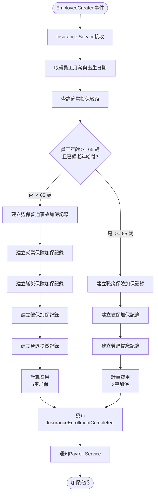
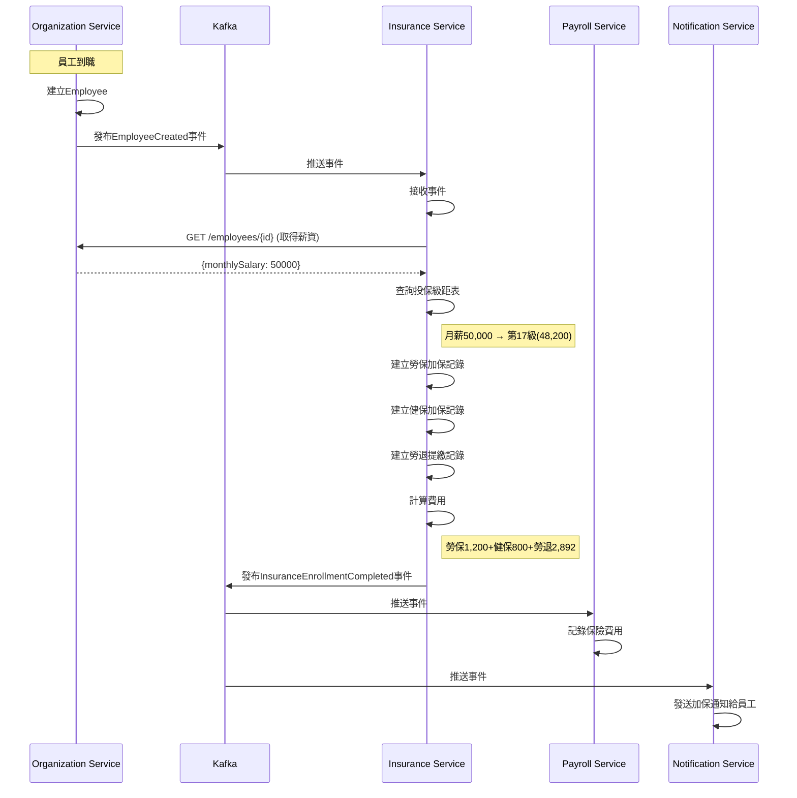
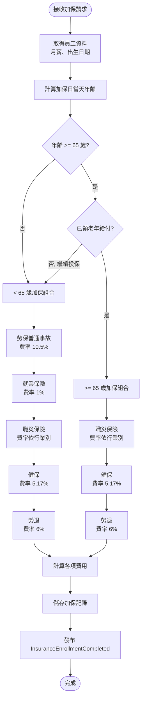
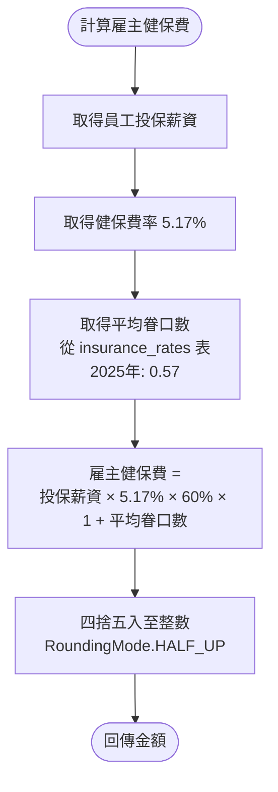
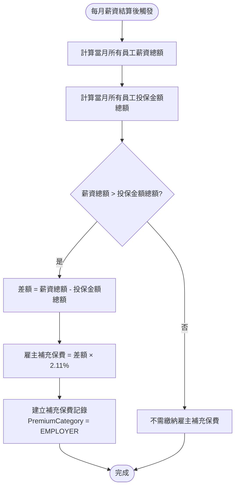

# 保險管理服務(Insurance Service) 需求分析書

**版本:** 2.0
**日期:** 2025-11-24（初版） / 2026-03-17（v2.0 法規修正）
**所屬領域:** 支撐領域 (Supporting Domain)
**導入階段:** 第一階段（核心基礎服務）

> **[2026-03-17 更新] v2.0 變更摘要**
> - A. 勞保 -- 職災保險獨立（勞工職業災害保險及保護法）、就業保險拆分、65 歲以上年齡規則
> - B. 健保 -- 雇主平均眷口數計算修正、DependentType 修正、進位方式修正
> - C. 二代健保 -- 補充保費 IncomeType 補齊 6 類、雇主補充保費計算

---

## 1. 服務概述與職責

### 1.1 核心職責
- 多投保單位管理（母子公司分別投保）
- 勞健保加退保自動化
- 投保級距管理與調整建議
- 勞保普通事故、就業保險、職災保險、健保、勞退費用計算 [2026-03-17 更新]
- 65 歲以上員工加保規則（僅職災保險 + 健保 + 勞退）[2026-03-17 更新]
- 二代健保補充保費計算（2.11%，含 6 類所得）[2026-03-17 更新]
- 雇主補充保費計算（薪資總額與投保金額總額差額）[2026-03-17 更新]
- 健保眷屬管理（含平均眷口數雇主負擔計算）[2026-03-17 更新]
- 政府申報檔案匯出

### 1.2 服務邊界
**屬於:** 保險資料、費用計算、申報檔案產生
**不屬於:** 員工資料(Organization)、實際繳費(Payroll提供數據)

---

## 2. 領域模型

### 2.1 聚合根

#### InsuranceUnit (投保單位)
```
InsuranceUnit {
  unitId: UUID (PK)
  organizationId: UUID (FK)
  unitCode: String (投保單位代號)
  unitName: String
  laborInsuranceNumber: String (勞保證號)
  healthInsuranceNumber: String (健保證號)
  isActive: Boolean
}
```

#### InsuranceEnrollment (加退保記錄)
```
InsuranceEnrollment {
  enrollmentId: UUID (PK)
  employeeId: UUID (FK)
  insuranceType: InsuranceType (LABOR, HEALTH, PENSION, OCCUPATIONAL_ACCIDENT, EMPLOYMENT_INSURANCE)

  enrollDate: Date (加保日)
  withdrawDate: Date (nullable, 退保日)

  insuranceLevelId: UUID (FK, 投保級距)
  monthlySalary: Decimal (投保薪資)

  status: EnrollmentStatus (ACTIVE, WITHDRAWN)

  // 申報資訊
  isReported: Boolean (是否已申報)
  reportedAt: DateTime
}

// [2026-03-17 更新] InsuranceType 新增職災保險與就業保險
// 法規依據：勞工職業災害保險及保護法（2022/5/1 施行）
enum InsuranceType {
  LABOR                  // 勞保（普通事故保險）
  HEALTH                 // 健保
  PENSION                // 勞退
  OCCUPATIONAL_ACCIDENT  // 職災保險（獨立，雇主 100% 負擔）
  EMPLOYMENT_INSURANCE   // 就業保險
  GROUP_LIFE             // 團體壽險
  GROUP_ACCIDENT         // 團體傷害險
  GROUP_MEDICAL          // 團體醫療險
}

enum EnrollmentStatus {
  PENDING   // 待加保
  ACTIVE    // 已加保
  WITHDRAWN // 已退保
}
```

#### InsuranceLevel (投保級距)
```
InsuranceLevel {
  levelId: UUID (PK)
  insuranceType: InsuranceType
  level: Integer (級距)
  monthlySalary: Decimal (月投保金額)

  // 費率（動態可調整）
  laborEmployeeRate: Decimal (勞保員工負擔比例)
  laborEmployerRate: Decimal (勞保雇主負擔比例)

  healthEmployeeRate: Decimal (健保員工負擔比例)
  healthEmployerRate: Decimal (健保雇主負擔比例)

  pensionEmployerRate: Decimal (勞退雇主提繳6%)

  effectiveDate: Date
}
```

#### SupplementaryPremium (二代健保補充保費)
```
SupplementaryPremium {
  premiumId: UUID (PK)
  employeeId: UUID (FK)
  incomeType: IncomeType
  premiumCategory: PremiumCategory (EMPLOYEE / EMPLOYER)  // [2026-03-17 更新]

  incomeAmount: Decimal (所得金額)
  premiumBase: Decimal (計費基準)
  premiumAmount: Decimal (補充保費 = 基準 × 2.11%)

  incomeDate: Date
  year: Integer

  createdAt: DateTime
}

// [2026-03-17 更新] IncomeType 補齊 6 類
// 法規依據：全民健康保險法第 31 條
enum IncomeType {
  BONUS              // 高額獎金（超過當月投保金額 4 倍部分）
  PART_TIME_INCOME   // 兼職所得
  PROFESSIONAL_FEE   // 執行業務收入
  STOCK_DIVIDEND     // 股利所得 [2026-03-17 新增]
  INTEREST           // 利息所得 [2026-03-17 新增]
  RENTAL             // 租金收入 [2026-03-17 新增]
}

// [2026-03-17 新增] 補充保費類別
enum PremiumCategory {
  EMPLOYEE  // 個人補充保費
  EMPLOYER  // 雇主補充保費
}
```

#### [2026-03-17 新增] HealthInsuranceDependent (健保眷屬)
```
HealthInsuranceDependent {
  dependentId: UUID (PK)
  employeeId: UUID (FK, 被保險人)
  dependentName: String (眷屬姓名)
  dependentType: DependentType
  nationalId: String (身分證號)
  birthDate: Date (出生日期)
  enrollDate: Date (加保日)
  withdrawDate: Date (nullable, 退保日)
  status: EnrollmentStatus
}

// [2026-03-17 更新] DependentType 修正
// 法規依據：全民健康保險法第 2 條
enum DependentType {
  SPOUSE       // 配偶
  CHILD        // 子女（未滿 20 歲，或滿 20 歲仍在學者可延長至畢業）
  PARENT       // 父母
  GRANDPARENT  // 祖父母 [2026-03-17 新增]
  GRANDCHILD   // 孫子女 [2026-03-17 新增]
  // 注意：已移除 SIBLING（兄弟姐妹不符合健保法眷屬定義）
}
```

---

## 3. 核心計算邏輯

### 3.1 投保級距自動對應
```java
public InsuranceLevel findAppropriateLevel(Decimal monthlySalary, InsuranceType type) {
    // 查詢所有級距
    List<InsuranceLevel> levels = insuranceLevelRepo.findByType(type);

    // 找到最接近的級距（小於等於薪資的最大級距）
    return levels.stream()
        .filter(l -> l.getMonthlySalary().compareTo(monthlySalary) <= 0)
        .max(Comparator.comparing(InsuranceLevel::getMonthlySalary))
        .orElse(levels.get(0)); // 最低級距
}
```

### 3.2 勞保費用計算 [2026-03-17 更新]

> **法規依據：** 勞工保險條例、勞工職業災害保險及保護法（2022/5/1 施行）

```
=== 勞保普通事故保險 ===
費率：10.5%（2022/5/1 起，職災獨立後勞保費率調降）
負擔比例：雇主 70%、勞工 20%、政府 10%

勞保普通事故(個人) = 投保薪資 × 10.5% × 20%
勞保普通事故(雇主) = 投保薪資 × 10.5% × 70%

=== 就業保險 ===
費率：1%
負擔比例：雇主 70%、勞工 20%、政府 10%
適用對象：< 65 歲之受僱勞工

就業保險(個人) = 投保薪資 × 1% × 20%
就業保險(雇主) = 投保薪資 × 1% × 70%

=== 職災保險（獨立） ===
費率：依行業別 0.04% ~ 0.92%（由勞動部公告）
負擔比例：雇主 100% 負擔
投保薪資上限：87,600 元（與勞保相同）
適用對象：所有受僱勞工（含 65 歲以上已領老年給付者）

職災保險(雇主) = 投保薪資 × 行業費率（0.04% ~ 0.92%）
```

### 3.2.1 [2026-03-17 新增] 65 歲以上員工加保規則

> **法規依據：** 勞工保險條例第 58 條、勞工職業災害保險及保護法

```
年齡判斷基準日 = 加保日（enrollDate）
員工年齡 = 加保日 - 出生日期

若員工 < 65 歲：
  加保項目 = 勞保普通事故 + 就業保險 + 職災保險 + 健保 + 勞退
  （共 5 筆加保記錄）

若員工 >= 65 歲（已領取勞保老年給付）：
  加保項目 = 職災保險 + 健保 + 勞退
  （共 3 筆加保記錄，不含勞保普通事故與就業保險）
```

### 3.3 健保費用計算 [2026-03-17 更新]

> **法規依據：** 全民健康保險法第 18 條、第 27 條

```
=== 個人健保費 ===
健保費(個人) = 投保薪資 × 5.17% × 30% × (1 + 眷屬人數)
（眷屬人數上限 3 人，超過 3 人以 3 人計）

=== 雇主健保費 ===
健保費(雇主) = 投保薪資 × 5.17% × 60% × (1 + 平均眷口數)

平均眷口數：由衛福部每年公告（2025 年為 0.57）
※ 平均眷口數應設計為可配置參數（insurance_rates 表），非硬編碼

=== 進位方式 ===
所有保費金額採四捨五入（RoundingMode.HALF_UP），非無條件進位
```

### 3.4 勞退提繳

```
勞退(雇主) = 投保薪資 × 6%
勞退(個人自提) = 投保薪資 × 自提比例(0~6%)
```

### 3.5 二代健保補充保費 [2026-03-17 更新]

> **法規依據：** 全民健康保險法第 31 條

```
=== 個人補充保費（6 類所得）===

1. 高額獎金（BONUS）：
   觸發條件：單次獎金 > 當月投保金額 × 4
   計費基準 = 獎金 - (投保金額 × 4)
   補充保費 = 計費基準 × 2.11%
   上限：單次計費基準上限 = 10,000,000 元

2. 兼職所得（PART_TIME_INCOME）：
   觸發條件：非投保單位給付之薪資所得
   補充保費 = 兼職所得金額 × 2.11%

3. 執行業務收入（PROFESSIONAL_FEE）：
   觸發條件：執行業務收入
   補充保費 = 收入金額 × 2.11%

4. 股利所得（STOCK_DIVIDEND）：[2026-03-17 新增]
   觸發條件：單次股利所得 > 費用基準下限（目前為 20,000 元）
   補充保費 = 股利金額 × 2.11%

5. 利息所得（INTEREST）：[2026-03-17 新增]
   觸發條件：單筆利息 > 費用基準下限（目前為 20,000 元）
   補充保費 = 利息金額 × 2.11%

6. 租金收入（RENTAL）：[2026-03-17 新增]
   觸發條件：單次租金收入
   補充保費 = 租金金額 × 2.11%

=== 雇主補充保費 === [2026-03-17 新增]

計算公式：（每月薪資總額 - 每月投保金額總額）× 2.11%
觸發條件：每月薪資總額 > 每月投保金額總額
說明：雇主每月須就超出部分繳納補充保費

=== 與薪資計算流程整合 ===
發放獎金時自動判斷是否超過門檻，超過則自動扣繳個人補充保費
每月薪資結算時自動計算雇主補充保費
```

---

## 4. 領域事件

| 事件 | 觸發時機 | 訂閱服務 |
|:---|:---|:---|
| `InsuranceEnrollmentCompleted` | 加保完成 | Payroll |
| `InsuranceWithdrawalCompleted` | 退保完成 | Payroll |
| `InsuranceLevelAdjusted` | 投保級距調整 | Payroll, Notification |
| `SupplementaryPremiumCalculated` | 補充保費計算 | Payroll |

---

## 5. 核心API

### 5.1 加退保API

#### 員工加保（自動觸發）
```
POST /api/v1/insurance/enrollments
Request:
{
  "employeeId": "uuid",
  "insuranceUnitId": "uuid",
  "enrollDate": "2025-01-01",
  "monthlySalary": 50000
}

Response 201:
{
  "enrollmentId": "uuid",
  "insuranceLevel": {
    "level": 15,
    "monthlySalary": 48200
  },
  "fees": {
    "laborInsurance": 1205,
    "healthInsurance": 749,
    "pension": 2892
  }
}
```

**業務邏輯:**
- 訂閱 `EmployeeCreated` 事件自動觸發
- 查詢適當投保級距
- 建立勞保、健保、勞退三筆加保記錄
- 發布 `InsuranceEnrollmentCompleted` 事件 → Payroll Service

#### 員工退保
```
PUT /api/v1/insurance/enrollments/{id}/withdraw
Request:
{
  "withdrawDate": "2025-12-31"
}

Response 200:
{
  "enrollmentId": "uuid",
  "status": "WITHDRAWN",
  "withdrawDate": "2025-12-31"
}
```

### 5.2 費用計算API（供Payroll調用）

```
POST /api/v1/insurance/fees/calculate
Request:
{
  "employeeId": "uuid",
  "month": "2025-11"
}

Response 200:
{
  "employeeId": "uuid",
  "month": "2025-11",
  "insuranceLevel": 48200,
  "laborInsuranceEmployee": 1205,
  "laborInsuranceEmployer": 4218,
  "healthInsuranceEmployee": 749,
  "healthInsuranceEmployer": 1498,
  "pensionEmployer": 2892,
  "pensionSelfContribution": 0
}
```

### 5.3 補充保費計算

```
POST /api/v1/insurance/supplementary-premium/calculate
Request:
{
  "employeeId": "uuid",
  "incomeType": "BONUS",
  "amount": 250000,
  "incomeDate": "2025-12-01"
}

Response 200:
{
  "needSupplementary": true,
  "insuranceLevel": 48200,
  "threshold": 192800, (48200 × 4)
  "premiumBase": 57200, (250000 - 192800)
  "premiumAmount": 1207 (57200 × 2.11%)
}
```

### 5.4 政府申報檔案

```
POST /api/v1/insurance/export/enrollment-report
Request:
{
  "insuranceUnitId": "uuid",
  "startDate": "2025-11-01",
  "endDate": "2025-11-30",
  "format": "LABOR_BUREAU_XML"
}

Response 200:
{
  "fileUrl": "/downloads/labor-enrollment-202511.xml",
  "recordCount": 5,
  "generatedAt": "2025-12-01T10:00:00Z"
}
```

---

## 6. 與其他服務整合

### 6.1 訂閱事件
- `EmployeeCreated` (Organization) → 自動加保
- `EmployeeTerminated` (Organization) → 自動退保
- `EmployeeSalaryChanged` (Organization) → 檢查是否需調整級距

### 6.2 被調用
- Payroll Service → 查詢保險費用

---

## 7. 數據初始化

### 7.1 投保級距資料（2025年最新）
```sql
INSERT INTO insurance_levels VALUES
  (1, 'LABOR', 1, 27470, ...),
  (2, 'LABOR', 2, 27600, ...),
  ...
  (18, 'LABOR', 18, 45800, ...);
```

### 7.2 費率設定 [2026-03-17 更新]
```
勞保普通事故費率: 10.5% (個人20%, 雇主70%, 政府10%)
就業保險費率: 1% (個人20%, 雇主70%, 政府10%)
職災保險費率: 依行業別 0.04%~0.92% (雇主100%)
健保費率: 5.17% (個人30%, 雇主60%, 政府10%)
健保平均眷口數: 0.57 (2025年衛福部公告，可配置)
勞退提繳率: 6% (雇主)
補充保費率: 2.11%
```

---

## 8. 非功能需求

| 需求 | 目標 |
|:---|:---|
| 費用計算準確率 | 100% |
| 級距對應準確率 | 100% |
| 申報檔案格式符合勞保局規範 | 100% |

---

**文件結束**


# PM審查補充

# 保險管理服務 - PM審查補充文件

**版本:** 1.1  
**日期:** 2025-11-30  
**補充說明:** 補充業務流程圖、循序圖、事件案例等

---

## 📋 補充內容

### 文件增強
- 業務流程圖：自動加退保流程、級距調整流程
- 循序圖：員工到職自動加保互動
- 事件JSON範例
- 業務邏輯：投保級距對應邏輯、補充保費計算
- 業務案例：完整加保與補充保費實例

---

## 1. 業務流程圖

### 1.1 員工到職自動加保流程 [2026-03-17 更新]


### 1.2 薪資調整觸發級距調整流程
```mermaid
flowchart TD
    Start([EmployeeSalaryChanged事件]) --> Get[取得新薪資]
    Get --> Current[取得目前投保級距]
    Current --> Find[查詢適當新級距]
    
    Find --> Compare{級距改變?}
    Compare -->|否| Skip[不調整]
    Compare -->|是| Check{差異>=2級?}
    
    Check -->|否| Suggest[建議調整<br/>非強制]
    Check -->|是| Must[必須調整<br/>法規要求]
    
    Suggest --> Notify1[通知HR]
    Must --> Update[更新投保級距]
    Update --> Notify2[通知HR+Payroll]
    
    Skip & Notify1 & Notify2 --> End([完成])
``````

### 1.3 二代健保補充保費觸發流程
```mermaid
flowchart TD
    Start([薪資計算發現獎金]) --> GetLevel[取得投保金額]
    GetLevel --> Calc[計算門檻<br/>投保金額×4]
    
    Calc --> Check{獎金>門檻?}
    Check -->|否| NoFee[無需補充保費]
    Check -->|是| CalcBase[計費基準=<br/>獎金-門檻]
    
    CalcBase --> CalcPremium[補充保費=<br/>基準×2.11%]
    CalcPremium --> Record[記錄補充保費]
    Record --> Payroll[通知Payroll扣除]
    
    NoFee & Payroll --> End([完成])
```

---

## 2. 循序圖

### 2.1 員工到職自動加保循序圖


---

## 3. 事件JSON範例

### 3.1 InsuranceEnrollmentCompleted 事件
```json
{
  "eventType": "InsuranceEnrollmentCompleted",
  "eventId": "uuid-event",
  "timestamp": "2025-11-30T10:30:00Z",
  "aggregateId": "enrollment-uuid",
  "aggregateType": "InsuranceEnrollment",
  "version": 1,
  "payload": {
    "employeeId": "uuid-emp",
    "employeeName": "張三",
    "enrollDate": "2025-12-01",
    
    "insuranceLevel": {
      "level": 17,
      "monthlySalary": 48200
    },
    
    "enrollments": [
      {
        "type": "LABOR",
        "monthlyPremium": 1200,
        "employeePortion": 1200,
        "employerPortion": 4218
      },
      {
        "type": "HEALTH",
        "monthlyPremium": 800,
        "employeePortion": 800,
        "employerPortion": 1600
      },
      {
        "type": "PENSION",
        "contributionRate": 0.06,
        "monthlyAmount": 2892,
        "employerPortion": 2892
      }
    ],
    
    "totalEmployeeFee": 2000,
    "totalEmployerFee": 8710
  },
  "metadata": {
    "correlationId": "uuid-corr",
    "causationId": "employee-created-event-uuid"
  }
}
```

### 3.2 SupplementaryPremiumCalculated 事件
```json
{
  "eventType": "SupplementaryPremiumCalculated",
  "eventId": "uuid",
  "timestamp": "2025-12-01T00:00:00Z",
  "payload": {
    "premiumId": "uuid-premium",
    "employeeId": "uuid-emp",
    "incomeType": "BONUS",
    "incomeAmount": 250000,
    "insuranceLevel": 48200,
    "threshold": 192800,
    "premiumBase": 57200,
    "premiumAmount": 1207,
    "premiumRate": 0.0211
  }
}
```

---

## 4. 業務邏輯詳述

### 4.1 投保級距自動對應邏輯

**勞保投保級距表（2025年）:**
```
級距    月投保金額    適用月薪範圍
----------------------------------
1       27,470      0 ~ 27,600
2       27,600      27,601 ~ 28,800
...
17      48,200      47,101 ~ 50,200
18      50,600      50,201 ~ 52,400
...
33      45,800      最高級距
```

**對應邏輯:**
```java
public InsuranceLevel findAppropriateLevel(BigDecimal monthlySalary) {
    List<InsuranceLevel> levels = levelRepository
        .findByInsuranceTypeOrderByLevelAsc(InsuranceType.LABOR);
    
    // 找到月薪適用的級距
    for (int i = 0; i < levels.size() - 1; i++) {
        InsuranceLevel current = levels.get(i);
        InsuranceLevel next = levels.get(i + 1);
        
        // 月薪落在此級距與下一級距之間
        if (monthlySalary.compareTo(current.getMonthlySalary()) >= 0 
            && monthlySalary.compareTo(next.getMonthlySalary()) < 0) {
            return current;
        }
    }
    
    // 超過最高級距，使用最高級距
    return levels.get(levels.size() - 1);
}

// 範例：月薪50,000元
// → 落在第17級(48,200)與第18級(50,600)之間
// → 應使用第17級(48,200)
```

### 4.2 保險費用精確計算 [2026-03-17 更新]

**勞保普通事故保險費計算:**
```
投保金額：48,200元
勞保普通事故費率：10.5%
進位方式：四捨五入（HALF_UP）

個人負擔：48,200 × 10.5% × 20% = 1,012.2元 → 1,012元
雇主負擔：48,200 × 10.5% × 70% = 3,542.7元 → 3,543元
政府負擔：48,200 × 10.5% × 10% = 506.1元 → 506元
```

**就業保險費計算:**
```
投保金額：48,200元
就業保險費率：1%

個人負擔：48,200 × 1% × 20% = 96.4元 → 96元
雇主負擔：48,200 × 1% × 70% = 337.4元 → 337元
政府負擔：48,200 × 1% × 10% = 48.2元 → 48元
```

**職災保險費計算:**
```
投保金額：48,200元
職災保險費率：0.17%（以資訊服務業為例）
雇主 100% 負擔

雇主負擔：48,200 × 0.17% = 81.94元 → 82元
```

**健保費計算:** [2026-03-17 更新]
```
投保金額：48,200元
健保費率：5.17%
平均眷口數：0.57（2025年）
進位方式：四捨五入（HALF_UP）

個人負擔（無眷屬）：48,200 × 5.17% × 30% = 747.21元 → 747元
個人負擔（1 名眷屬）：48,200 × 5.17% × 30% × 2 = 1,494.42元 → 1,494元
雇主負擔：48,200 × 5.17% × 60% × (1 + 0.57) = 2,346.24元 → 2,346元
政府負擔：48,200 × 5.17% × 10% = 249.07元 → 249元
```

**勞退提繳:**
```
投保金額：48,200元
提繳率：6%（固定）
自提率：0~6%（員工自選）

雇主提繳：48,200 × 6% = 2,892元
個人自提（若選3%）：48,200 × 3% = 1,446元
```

### 4.3 二代健保補充保費完整計算 [2026-03-17 更新]

**法規依據:** 全民健康保險法第 31 條

#### 4.3.1 個人補充保費（6 類所得）

**高額獎金計算規則:**
```
1. 觸發條件：
   單次獎金 > 投保金額 × 4倍

2. 計費基準：
   獎金 - (投保金額 × 4)

3. 補充保費：
   計費基準 × 2.11%

4. 上限：
   單次計費基準上限 = 10,000,000元
   單次補充保費上限 = 10,000,000 × 2.11% = 211,000元

5. 下限：
   單次給付金額未達費用基準下限者（目前為 20,000 元），免扣取
```

**其他 5 類所得計算規則:** [2026-03-17 新增]
```
兼職所得、執行業務收入、股利所得、利息所得、租金收入：
  補充保費 = 所得金額 × 2.11%
  下限：單次給付金額 < 20,000 元者免扣取（股利、利息適用）
  上限：單次計費基準上限 = 10,000,000 元
```

**實際案例:**
```
範例1：未達門檻（高額獎金）
投保金額：48,200元
年終獎金：150,000元
門檻：48,200 × 4 = 192,800元

150,000 < 192,800 → 無需補充保費

---

範例2：需扣繳補充保費（高額獎金）
投保金額：48,200元
年終獎金：250,000元
門檻：192,800元

計費基準 = 250,000 - 192,800 = 57,200元
補充保費 = 57,200 × 2.11% = 1,206.92元 → 1,207元（四捨五入）

---

範例3：股利所得 [2026-03-17 新增]
某員工收到股利所得 80,000 元
80,000 > 20,000（下限）→ 需扣繳
補充保費 = 80,000 × 2.11% = 1,688 元

---

範例4：利息所得免扣 [2026-03-17 新增]
某員工銀行利息 15,000 元
15,000 < 20,000（下限）→ 免扣取
```

#### 4.3.2 [2026-03-17 新增] 雇主補充保費

**計算規則:**
```
雇主補充保費 = (每月薪資總額 - 每月投保金額總額) × 2.11%

其中：
  每月薪資總額 = 當月所有員工實際薪資加總
  每月投保金額總額 = 當月所有員工投保薪資加總

若差額 <= 0，則不需繳納雇主補充保費
```

**實際案例:**
```
公司共 10 名員工
每月薪資總額：800,000 元
每月投保金額總額：600,000 元

差額 = 800,000 - 600,000 = 200,000 元
雇主補充保費 = 200,000 × 2.11% = 4,220 元
```

---

## 5. 業務案例

### 業務案例 UC-INS-001: 新進員工自動加保完整流程

**角色:** 新進員工王五

**基本資料:**
- 到職日：2025-12-01
- 職稱：後端工程師
- 月薪：52,000元

**自動加保流程詳解:**

**1. Organization Service建立員工（Day 1）**
```
HR輸入王五資料 → 建立Employee
發布 EmployeeCreated 事件
```

**2. Insurance Service接收事件（Day 1 +5秒）**
```
事件負載：
{
  "employeeId": "uuid-wangwu",
  "monthly​Salary": 52000,
  "hireDate": "2025-12-01"
}
```

**3. 查詢適當投保級距（Day 1 +10秒）**
```
輸入：月薪52,000元

查級距表：
- 第17級：48,200 (月薪47,101~50,200) ❌ 太低
- 第18級：50,600 (月薪50,201~52,400) ✅ 適用
- 第19級：53,000 (月薪52,401~54,600) ❌ 太高

選定：第18級，投保金額50,600元
```

**4. 建立加保記錄（Day 1 +15秒）**
```
勞保加保：
- 加保日期：2025-12-01
- 投保金額：50,600元
- 個人負擔：50,600 × 11.5% × 20% = 1,163.8 → 1,164元
- 雇主負擔：50,600 × 11.5% × 70% = 4,073.3 → 4,074元

健保加保：
- 加保日期：2025-12-01
- 投保金額：50,600元
- 個人負擔：50,600 × 5.17% × 30% = 784.41 → 785元
- 雇主負擔：50,600 × 5.17% × 60% = 1,568.82 → 1,569元

勞退提繳：
- 提繳日期：2025-12-01
- 提繳金額：50,600元
- 雇主提繳：50,600 × 6% = 3,036元
- 個人自提：0元（未選擇自提）
```

**5. 發布事件通知其他服務（Day 1 +20秒）**
```
InsuranceEnrollmentCompleted事件 →
- Payroll Service：記錄保費（個人負擔1,949元）
- Notification Service：Email通知王五加保資訊
```

**6. 產生勞保局申報資料（Day 1結束）**
```
每日批次Job產生當日加保XML檔案
HR於隔日上傳至勞保局e化系統
```

**7. 首月薪資計算時扣除保費（Day 30）**
```
12月薪資：
應發：52,000元
扣除：
- 勞保費：1,164元
- 健保費：785元
- 勞退自提：0元
-----------------
實發：49,051元
```

### 業務案例 UC-INS-002: 年終獎金補充保費計算

**角色:** 員工李經理

**基本資料:**
- 職稱：部門經理
- 月薪：80,000元
- 投保金額：45,800元（最高級距）

**年終獎金發放:**
- 發放時間：2026-01-25
- 年終獎金：300,000元

**補充保費計算:**

**1. 檢查是否需扣繳**
```
投保金額：45,800元
門檻：45,800 × 4 = 183,200元
獎金：300,000元

300,000 > 183,200 → 需扣繳補充保費 ✅
```

**2. 計算計費基準**
```
計費基準 = 獎金 - 門檻
        = 300,000 - 183,200
        = 116,800元
```

**3. 計算補充保費**
```
補充保費 = 計費基準 × 2.11%
        = 116,800 × 0.0211
        = 2,464.48元
        → 無條件進位至整數：2,465元
```

**4. 薪資單呈現**
```
=========================================
          2026年1月 薪資單
=========================================
【應發項目】
底薪                           80,000
年終獎金                      300,000
-----------------------------------------
應發合計                      380,000

【扣除項目】
勞保費                         1,200
健保費                          800
二代健保補充保費                2,465
所得稅                        15,000
-----------------------------------------
扣除合計                       19,465

【實發金額】                  360,535
=========================================
```

**5. 申報與繳納**
```
Insurance Service每月彙總補充保費
於次月底前向健保署申報並繳納
```

---

**補充文件結束**

**主文件:** 05_保險管理服務需求分析書.md
**修訂日期:** 2025-11-30
**修訂人:** SA

---

# [2026-03-17 更新] 法規合規性修正 — 補充分析

**版本:** 2.0
**日期:** 2026-03-17
**修訂人:** SA
**修訂原因:** 配合勞工職業災害保險及保護法、全民健康保險法最新規定進行合規修正

---

## 1. 新增業務規則

| 規則代碼 | 規則描述 | 法規依據 | 影響範圍 |
|:---|:---|:---|:---|
| BR-05-010 | 加保時須判斷員工年齡，>= 65 歲且已領老年給付者不加保勞保普通事故與就業保險 | 勞工保險條例 §58 | UC-INS-001 自動加保 |
| BR-05-011 | 職災保險獨立於勞保，所有受僱勞工（含 >= 65 歲）均須加保，雇主 100% 負擔 | 勞工職業災害保險及保護法 | UC-INS-001 自動加保 |
| BR-05-012 | 職災保險費率依行業別不同（0.04% ~ 0.92%），須設計為可配置參數 | 勞工職業災害保險及保護法 | 費用計算 |
| BR-05-013 | 就業保險費率 1%，負擔比例雇主 70%、勞工 20%、政府 10% | 就業保險法 | 費用計算 |
| BR-05-014 | 勞保普通事故費率為 10.5%（職災獨立後調降） | 勞工保險條例 | 費用計算 |
| BR-05-015 | 雇主健保費計算須乘以 (1 + 平均眷口數)，平均眷口數由衛福部公告 | 全民健康保險法 §18, §27 | 費用計算 |
| BR-05-016 | 平均眷口數為可配置參數（insurance_rates 表），2025 年為 0.57 | 全民健康保險法 §18 | 系統設定 |
| BR-05-017 | 眷屬類型不含兄弟姐妹（SIBLING），應含祖父母（GRANDPARENT）與孫子女（GRANDCHILD） | 全民健康保險法 §2 | 眷屬管理 |
| BR-05-018 | 子女眷屬年齡門檻為 20 歲，仍在學者可延長至畢業 | 全民健康保險法 §2 | 眷屬管理 |
| BR-05-019 | 所有保費金額進位方式為四捨五入（HALF_UP），非無條件進位（CEILING） | 各法規實務 | 費用計算 |
| BR-05-020 | 補充保費所得類型須涵蓋 6 類：獎金、兼職、執行業務、股利、利息、租金 | 全民健康保險法 §31 | 二代健保 |
| BR-05-021 | 雇主每月須就（薪資總額 - 投保金額總額）差額繳納 2.11% 補充保費 | 全民健康保險法 §31 | 二代健保 |
| BR-05-022 | 股利所得、利息所得單次未達 20,000 元免扣取補充保費 | 全民健康保險法 §31 | 二代健保 |
| BR-05-023 | 發放獎金時須自動判斷是否超過補充保費門檻，超過則於薪資計算時自動扣繳 | 全民健康保險法 §31 | 薪資整合 |

---

## 2. 新增/修正 Use Case

### UC-05-010: 65 歲以上員工加保 [2026-03-17 新增]

**主要參與者：** 系統（自動觸發）/ HR 人員（手動加保）
**前置條件：** 員工已建立、員工出生日期已知
**後置條件：** 依年齡建立正確的加保記錄組合

#### 主要流程
1. 系統接收 EmployeeCreated 事件或 HR 執行手動加保
2. 系統取得員工出生日期，計算加保日當天的年齡
3. 若年齡 < 65 歲，建立 5 筆加保記錄（勞保普通事故 + 就業保險 + 職災保險 + 健保 + 勞退）
4. 若年齡 >= 65 歲且已領老年給付，建立 3 筆加保記錄（職災保險 + 健保 + 勞退）
5. 計算各項費用並發布 InsuranceEnrollmentCompleted 事件

#### 替代流程
- 3a. 員工出生日期未知：系統預設以 < 65 歲處理，並通知 HR 補填出生日期
- 4a. 員工 >= 65 歲但未領老年給付（繼續工作不退保）：仍加保勞保普通事故 + 就業保險

### UC-05-011: 雇主補充保費月結計算 [2026-03-17 新增]

**主要參與者：** 系統（每月自動）/ HR 人員（手動觸發）
**前置條件：** 當月薪資已結算
**後置條件：** 產生雇主補充保費記錄

#### 主要流程
1. 系統於每月薪資結算後觸發
2. 計算當月所有員工薪資總額
3. 計算當月所有員工投保金額總額
4. 若薪資總額 > 投保金額總額，計算差額 × 2.11%
5. 建立雇主補充保費記錄（PremiumCategory = EMPLOYER）

---

## 3. 加保流程 Activity Diagram [2026-03-17 更新]

### 3.1 年齡判斷加保決策流程



### 3.2 雇主健保費計算流程



### 3.3 雇主補充保費月結流程



---

## 4. 開放問題

- [ ] 65 歲以上員工是否已領取勞保老年給付的資訊，由哪個服務提供？是否需要在 Employee 資料中新增欄位？
- [ ] 職災保險的行業別費率，是由公司層級統一設定，還是需要支援不同投保單位不同行業別？
- [ ] 平均眷口數的更新頻率？是否需要支援歷史版本查詢？
- [ ] 雇主補充保費的計算，是由 Insurance Service 主動計算，還是由 Payroll Service 在薪資結算後通知？
- [ ] 股利所得、利息所得、租金收入的來源資料從哪裡取得？是否由 HR 手動輸入？
- [ ] 眷屬「仍在學」的判斷邏輯如何實作？是否需要上傳在學證明？

---

**修訂完成日期:** 2026-03-17
**版本:** 2.0
**修訂人:** SA
