# IAM服務系統設計書

**版本:** 1.0
**日期:** 2025-12-04
**目標:** 提供工程師完整的系統實作規格,供PM建立工項清單

---

## 目錄

1. [服務概述](#1-服務概述)
2. [UI設計](#2-ui設計)
3. [UX流程設計](#3-ux流程設計)
4. [畫面事件說明](#4-畫面事件說明)
5. [Data Flow設計](#5-data-flow設計)
6. [資料庫設計](#6-資料庫設計)
7. [Domain設計](#7-domain設計)
8. [領域事件設計](#8-領域事件設計)
9. [API設計](#9-api設計)
10. [事件範例](#10-事件範例)

---

## 1. 服務概述

### 1.1 服務定位
IAM服務是整個HR系統的**基礎安全服務**,負責所有使用者的身份認證與授權管理。

### 1.2 核心功能
- ✅ 使用者登入認證
- ✅ Token核發與驗證
- ✅ 使用者帳號管理(CRUD)
- ✅ 角色權限管理(RBAC)
- ✅ 密碼安全管理
- ✅ 登入日誌審計
- ✅ 多租戶資料隔離

### 1.3 技術架構
- **前端**: ReactJS + Redux + Ant Design
- **後端**: Spring Boot 3.1.x + Spring Security
- **資料庫**: PostgreSQL 15.x
- **快取**: Redis 7.x
- **認證方式**: JWT Token

---

## 2. UI設計

### 2.1 頁面清單

| 頁面代碼 | 頁面名稱 | 路由 | 權限要求 |
|:---|:---|:---|:---:|
| `HR01-P01` | 登入頁面 | `/login` | - |
| `HR01-P02` | 使用者管理頁面 | `/admin/users` | user:read |
| `HR01-P03` | 角色權限管理頁面 | `/admin/roles` | role:read |
| `HR01-P04` | 密碼修改頁面 | `/profile/password` | - |
| `HR01-M01` | 使用者新增/編輯對話框 | (Modal) | user:create/write |
| `HR01-M02` | 角色新增/編輯對話框 | (Modal) | role:create/write |


### 2.2 UI線稿

#### 2.2.1 登入頁面 (HR01-P01)

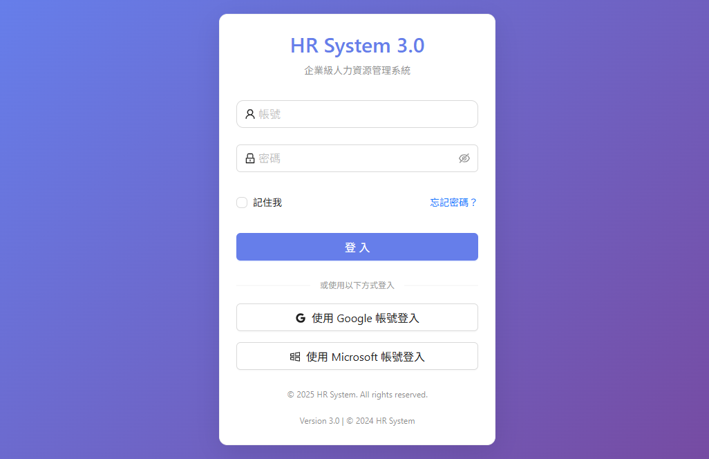 <!-- 原路徑 ./image/iam_login_page.png 不存在，已改指向實際截圖 -->

**頁面元素:**
- **Header區域**
  - 公司Logo (左上)
  - 語言切換器 (右上): 繁體中文/English

- **主要內容區 (置中卡片)**
  - 系統標題: "人力資源暨專案管理系統"
  - 登入表單:
    - 使用者名稱輸入框 (帶帳號圖示)
    - 密碼輸入框 (帶鎖頭圖示,顯示/隱藏切換)
    - "記住我" 核取方塊
    - "忘記密碼?" 連結
    - "登入" 按鈕 (藍色, 100%寬度)
  - SSO選項:
    - "使用Google登入" 按鈕
    - "使用Microsoft登入" 按鈕

- **Footer區域**
  - 版權資訊: "© 2025 Company Name. All rights reserved."

**元件規格:**
```typescript
// 登入表單欄位
interface LoginFormData {
  username: string;      // 使用者名稱 (email格式)
  password: string;      // 密碼
  rememberMe: boolean;   // 記住我
  tenantId?: string;     // 租戶ID (多租戶情境)
}
```

#### 2.2.2 使用者管理頁面 (HR01-P02)

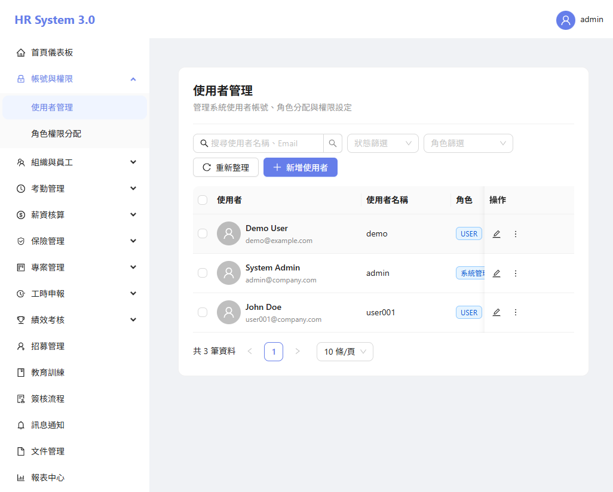 <!-- 原路徑 ./image/iam_user_management.png 不存在，已改指向實際截圖 -->

**頁面佈局:**
- **Left Sidebar**
  - Dashboard
  - 使用者管理 (當前選中)
  - 角色管理
  - 權限管理
  - 審計日誌

- **Main Content**
  - **工具列**
    - 頁面標題: "使用者管理"
    - 搜尋框 (placeholder: "搜尋使用者名稱、Email")
    - 篩選器:
      - 狀態下拉: 全部/啟用/停用/鎖定
      - 角色下拉: 全部/系統管理員/人資管理員...
      - 部門下拉: (動態載入)
    - "新增使用者" 按鈕 (主要按鈕, 藍色)

  - **使用者表格**
    | 欄位 | 說明 | 寬度 |
    |:---|:---|:---:|
    | ☑ | 批次選擇核取方塊 | 40px |
    | 頭像 | 使用者頭像 (圓形) | 50px |
    | 使用者名稱/Email | 主/副標題顯示 | 200px |
    | 員工姓名 | 關聯員工姓名 | 120px |
    | 部門 | 所屬部門 | 120px |
    | 角色 | 標籤形式顯示多個角色 | 180px |
    | 狀態 | 啟用(綠)/停用(灰)/鎖定(紅) | 80px |
    | 最後登入時間 | YYYY-MM-DD HH:mm | 150px |
    | 操作 | 編輯/停用/重置密碼按鈕 | 120px |

  - **批次操作工具列** (選擇項目時顯示)
    - 已選擇 N 個使用者
    - "批次停用" 按鈕
    - "批次匯出" 按鈕

  - **分頁控制**
    - 顯示: "第 1-10 筆，共 156 筆"
    - 頁碼切換
    - 每頁筆數選擇: 10/20/50/100

**元件規格:**
```typescript
interface UserTableRow {
  userId: string;
  username: string;
  email: string;
  employeeName: string;
  department: string;
  roles: Array<{roleId: string; roleName: string;}>;
  status: 'ACTIVE' | 'INACTIVE' | 'LOCKED';
  lastLoginAt: string;
  avatar?: string;
}
```

#### 2.2.3 角色權限管理頁面 (HR01-P03)

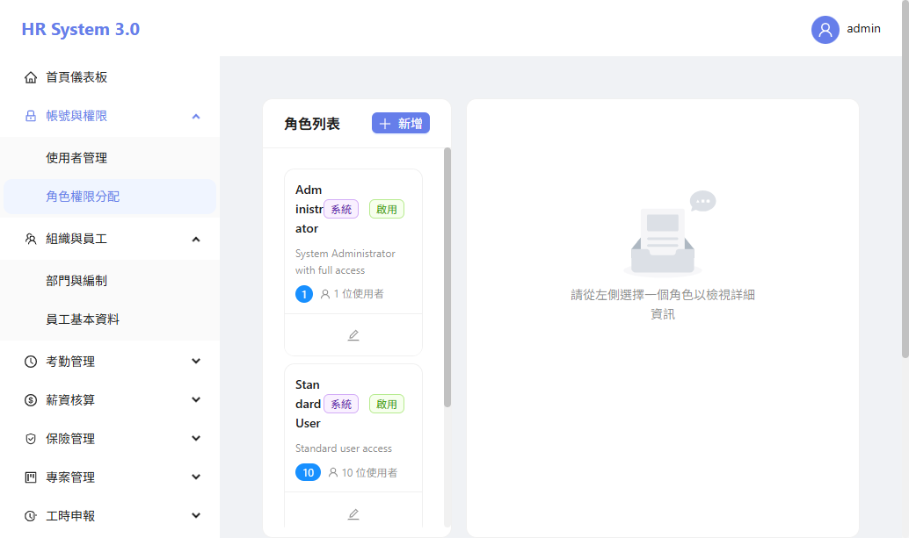 <!-- 原路徑 ./image/iam_role_management.png 不存在，已改指向實際截圖 -->

**頁面佈局:**

**左側面板 (30%寬度):**
- **Header**
  - "角色列表" 標題
  - "新增角色" 按鈕 (+ 圖示)

- **角色卡片列表**
  每個卡片顯示:
  - 角色名稱 (粗體)
  - 角色描述 (灰色小字)
  - 使用者數量徽章 (如: "15 users")
  - 系統/自訂標籤
  - 編輯圖示按鈕

**右側面板 (70%寬度):**
- **角色詳細資訊區**
  - 角色名稱 (大標題)
  - 角色描述
  - "編輯角色資訊" 按鈕

- **權限樹狀結構**
  可展開/收合的權限樹:
  ```
  ☑ 員工管理 ▼
    ☑ 查看員工資料
    ☑ 新增員工
    ☐ 編輯員工
    ☐ 刪除員工

  ☑ 考勤管理 ▼
    ☑ 查看考勤記錄
    ☑ 審核請假
    ☐ 審核加班申請

  ☐ 薪資管理 ▼
    ☐ 查看薪資資料
    ☐ 處理薪資
  ```

- **操作按鈕區**
  - "儲存變更" 按鈕 (主要按鈕)
  - "取消" 按鈕 (次要按鈕)

**元件規格:**
```typescript
interface RoleDetailView {
  roleId: string;
  roleName: string;
  displayName: string;
  description: string;
  isSystemRole: boolean;
  userCount: number;
  permissions: PermissionTree[];
}

interface PermissionTree {
  category: string;              // 權限分類 (如: 員工管理)
  permissions: Array<{
    permissionId: string;
    permissionCode: string;      // 如: employee:profile:read
    displayName: string;
    checked: boolean;
  }>;
}
```

### 2.3 通用組件設計

#### 2.3.1 UserFormModal (使用者新增/編輯對話框)
```typescript
interface UserFormModalProps {
  visible: boolean;
  mode: 'create' | 'edit';
  userId?: string;
  onSubmit: (data: UserFormData) => Promise<void>;
  onCancel: () => void;
}

interface UserFormData {
  username: string;         // Email格式
  email: string;
  employeeId: string;       // 關聯員工ID
  tenantId: string;
  initialPassword?: string; // 僅新增時
  roleIds: string[];        // 指派角色
}
```

**表單欄位:**
- 使用者名稱 (必填, Email格式驗證)
- Email (必填, Email格式驗證)
- 關聯員工 (下拉選擇, 必填)
- 租戶 (下拉選擇, 預設母公司)
- 初始密碼 (新增時必填, 8字元以上)
- 角色 (多選下拉, 至少選一個)

#### 2.3.2 StatusBadge (狀態徽章)
```typescript
interface StatusBadgeProps {
  status: 'ACTIVE' | 'INACTIVE' | 'LOCKED';
}

// 顏色對應
const statusColors = {
  ACTIVE: 'green',    // 綠色
  INACTIVE: 'gray',   // 灰色
 LOCKED: 'red',      // 紅色
};
```

---

## 3. UX流程設計

### 3.1 使用者旅程圖

#### 3.1.1 登入流程

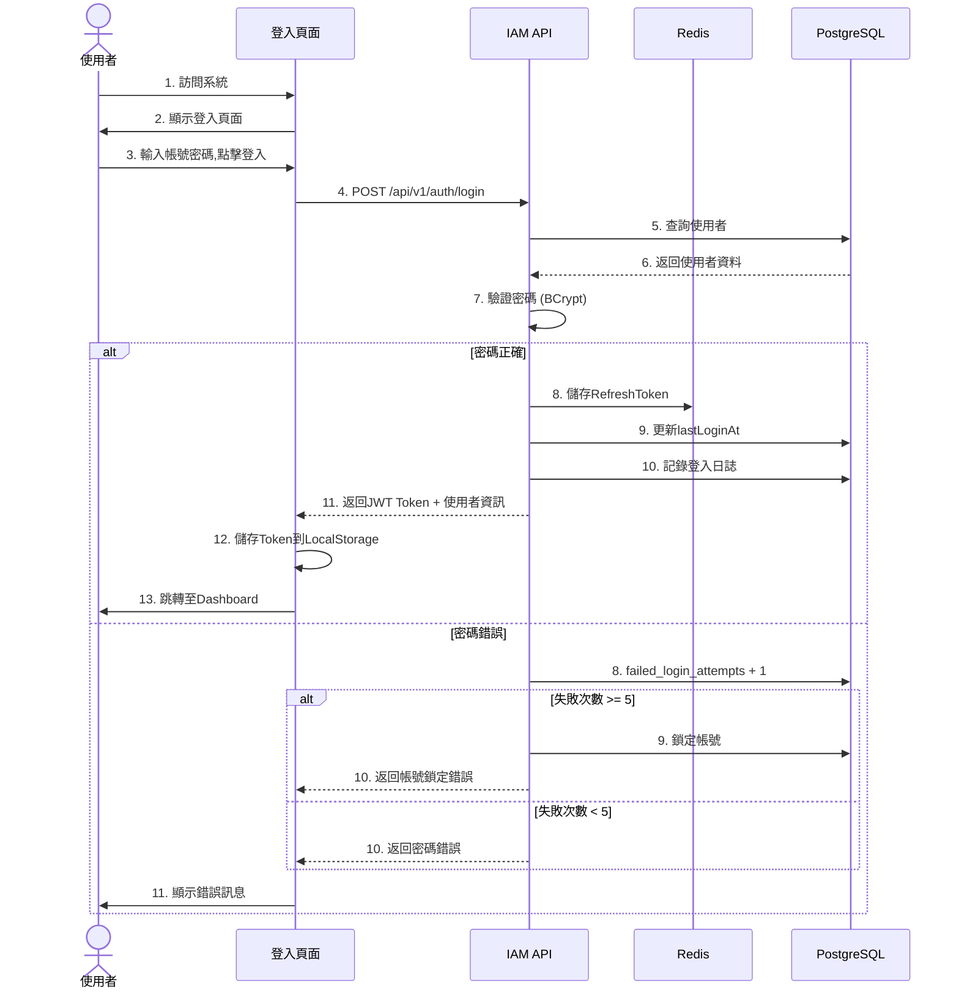

**關鍵點:**
- ✅ 密碼驗證使用BCrypt compare
- ✅ 連續失敗5次自動鎖定30分鐘
- ✅ 每次登入記錄IP與User Agent
- ✅ Token儲存於LocalStorage

#### 3.1.2 使用者管理流程

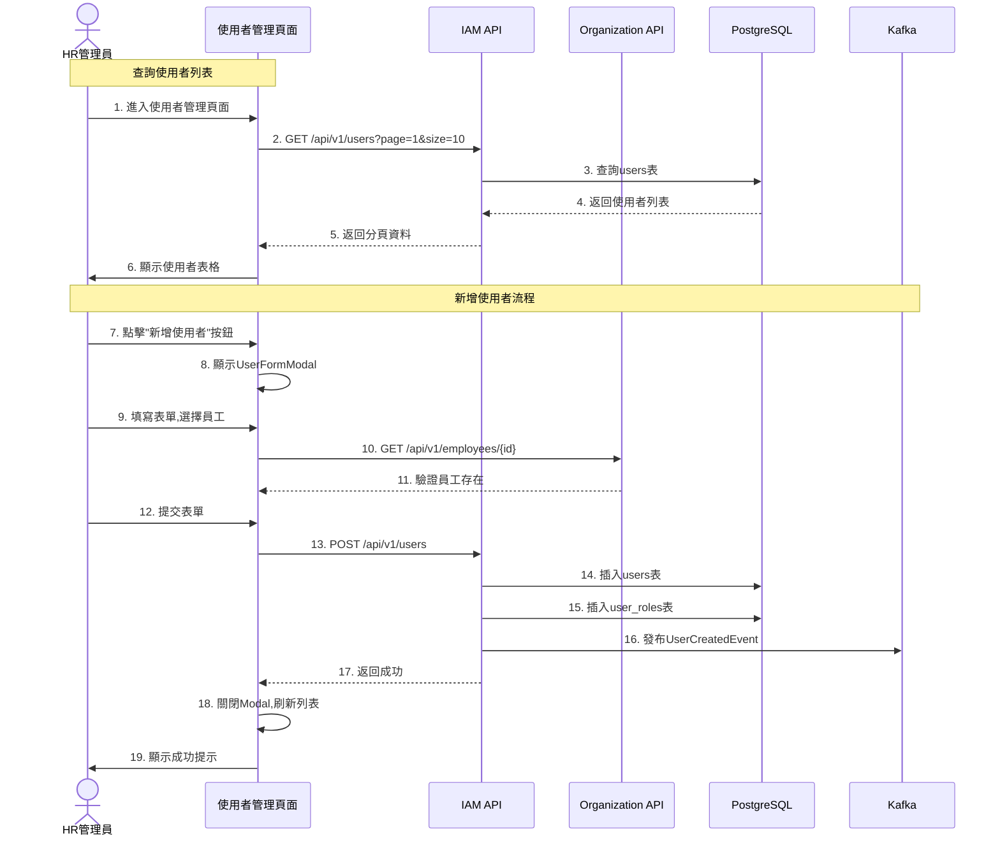

**關鍵點:**
- ✅ 新增使用者前驗證employeeId存在
- ✅ 初始密碼8字元以上,首次登入強制修改
- ✅ 發布UserCreatedEvent給Organization Service
- ✅ 至少指派一個角色

---

*（接下頁）*


# Continued: 01_IAM服務系統設計書_part2.md

## 4. 畫面事件說明

### 4.1 登入頁面事件 (IAM-P01)

| 事件ID | 觸發元素 | 事件類型 | 事件處理 | 後端API |
|:---|:---|:---|:---|:---|
| `E-LOGIN-01` | 登入按鈕 | onClick | 驗證表單 → 呼叫登入API → 儲存Token → 跳轉 | POST /api/v1/auth/login |
| `E-LOGIN-02` | 忘記密碼連結 | onClick | 開啟密碼重置對話框 | - |
| `E-LOGIN-03` | Google登入按鈕 | onClick | 跳轉Google OAuth | GET /api/v1/auth/oauth/google |
| `E-LOGIN-04` | Microsoft登入按鈕 | onClick | 跳轉Microsoft OAuth | GET /api/v1/auth/oauth/microsoft |
| `E-LOGIN-05` | 語言切換器 | onChange | 切換i18n語言包 | - |
| `E-LOGIN-06` | 密碼顯示/隱藏 | onClick | 切換input type | - |

**E-LOGIN-01 詳細流程:**
```typescript
const handleLogin = async (values: LoginFormData) => {
  try {
    // 1. 表單驗證
    await form.validateFields();

    // 2. 呼叫登入API
    const response = await authService.login({
      username: values.username,
      password: values.password,
      tenantId: values.tenantId
    });

    // 3. 儲存Token
    localStorage.setItem('accessToken', response.accessToken);
    localStorage.setItem('refreshToken', response.refreshToken);

    // 4. 儲存使用者資訊到Redux
    dispatch(setCurrentUser(response.user));

    // 5. 跳轉至Dashboard
    navigate('/dashboard');

  } catch (error) {
    // 顯示伺服器回傳的錯誤訊息
    const serverMessage = error?.response?.data?.message;
    if (error.code === 'ACCOUNT_LOCKED') {
      message.error(serverMessage || '帳號已被鎖定，請聯絡系統管理員');
    } else if (error.code === 'INVALID_CREDENTIALS') {
      message.error(serverMessage || '使用者名稱或密碼錯誤');
    }
  }
};
```

**前端 apiClient 401 攔截器行為：**
- 全域 Axios response interceptor 攔截 HTTP 401 回應
- **登入 API（`/api/v1/auth/login`）除外：** 401 攔截器跳過登入端點，不觸發自動跳轉至登入頁，改由登入頁面自行處理錯誤訊息顯示
- 其餘 API 收到 401 時自動清除 Token 並導向登入頁
- 攔截器優先提取伺服器回傳的 `response.data.message` 作為錯誤提示，若無則使用前端預設訊息

### 4.2 使用者管理頁面事件 (IAM-P02)

| 事件ID | 觸發元素 | 事件類型 | 事件處理 | 後端API |
|:---|:---|:---|:---|:---|
| `E-USER-01` | 新增使用者按鈕 | onClick | 開啟UserFormModal (create模式) | - |
| `E-USER-02` | 搜尋框 | onChange (debounce 500ms) | 重新查詢使用者列表 | GET /api/v1/users?search={keyword} |
| `E-USER-03` | 狀態篩選器 | onChange | 重新查詢使用者列表 | GET /api/v1/users?status={status} |
| `E-USER-04` | 角色篩選器 | onChange | 重新查詢使用者列表 | GET /api/v1/users?roleId={roleId} |
| `E-USER-05` | 編輯按鈕 | onClick | 開啟UserFormModal (edit模式) | GET /api/v1/users/{userId} |
| `E-USER-06` | 停用按鈕 | onClick | 確認對話框 → 停用使用者 | PUT /api/v1/users/{userId}/deactivate |
| `E-USER-07` | 重置密碼按鈕 | onClick | 開啟重置密碼對話框 | PUT /api/v1/users/{userId}/reset-password |
| `E-USER-08` | 批次選擇 | onChange | 更新選中項目狀態 | - |
| `E-USER-09` | 批次停用按鈕 | onClick | 確認對話框 → 批次停用 | PUT /api/v1/users/batch-deactivate |
| `E-USER-10` | 分頁切換 | onChange | 重新查詢使用者列表 | GET /api/v1/users?page={page} |

**E-USER-06 詳細流程:**
```typescript
const handleDeactivateUser = async (userId: string) => {
  // 1. 顯示確認對話框
  Modal.confirm({
    title: '確認停用使用者',
    content: '停用後該使用者將無法登入系統，確定要繼續嗎？',
    onOk: async () => {
      try {
        // 2. 呼叫停用API
        await userService.deactivateUser(userId);

        // 3. 顯示成功訊息
        message.success('使用者已停用');

        // 4. 刷新列表
        await fetchUsers();

      } catch (error) {
        message.error('停用失敗: ' + error.message);
      }
    }
  });
};
```

### 4.3 角色權限管理頁面事件 (IAM-P03)

| 事件ID | 觸發元素 | 事件類型 | 事件處理 | 後端API |
|:---|:---|:---|:---|:---|
| `E-ROLE-01` | 新增角色按鈕 | onClick | 開啟RoleFormModal | - |
| `E-ROLE-02` | 角色卡片 | onClick | 載入角色詳細資訊與權限 | GET /api/v1/roles/{roleId} |
| `E-ROLE-03` | 編輯角色資訊按鈕 | onClick | 開啟RoleFormModal (edit模式) | - |
| `E-ROLE-04` | 權限核取方塊 | onChange | 更新權限選中狀態 | - |
| `E-ROLE-05` | 權限分類展開/收合 | onClick | 切換展開狀態 | - |
| `E-ROLE-06` | 儲存變更按鈕 | onClick | 儲存角色權限變更 | PUT /api/v1/roles/{roleId}/permissions |
| `E-ROLE-07` | 取消按鈕 | onClick | 重置權限狀態 | - |

**E-ROLE-06 詳細流程:**
```typescript
const handleSavePermissions = async () => {
  try {
    // 1. 收集選中的權限ID
    const selectedPermissionIds = permissions
      .filter(p => p.checked)
      .map(p => p.permissionId);

    // 2. 呼叫更新API
    await roleService.updateRolePermissions(currentRoleId, {
      permissionIds: selectedPermissionIds
    });

    // 3. 顯示成功訊息
    message.success('權限已更新');

    // 4. 發布權限變更事件 (清除快取)
    eventBus.emit('role:permissions:changed', currentRoleId);

  } catch (error) {
    message.error('更新失敗: ' + error.message);
  }
};
```

---

### 4.x API Gateway 路由設定

IAM 服務在 API Gateway（`application.yml` / `application-local.yml`）中的 Route Predicates 包含以下路徑：

| 路徑模式 | 說明 |
|:---|:---|
| `/api/v1/auth/**` | 認證相關 API（登入、登出、Token 刷新、OAuth） |
| `/api/v1/users/**` | 使用者管理 API |
| `/api/v1/roles/**` | 角色管理 API |
| `/api/v1/permissions/**` | 權限管理 API |
| `/api/v1/system/**` | 系統管理 API（功能開關、系統參數、排程任務配置） |

> **注意：** `/api/v1/system/**` 路由已新增，將系統管理模組（第 13 章）的 API 請求正確路由至 IAM 服務。

---

## 5. Data Flow設計

### 5.1 前端狀態管理 (Redux)

#### 5.1.1 State結構

```typescript
interface IAMState {
  // 認證狀態
  auth: {
    isAuthenticated: boolean;
    currentUser: User | null;
    accessToken: string | null;
    refreshToken: string | null;
    loading: boolean;
    error: string | null;
  };

  // 使用者管理
  users: {
    list: User[];
    total: number;
    currentPage: number;
    pageSize: number;
    filters: {
      search: string;
      status: UserStatus | null;
      roleId: string | null;
      departmentId: string | null;
    };
    selectedUserIds: string[];
    loading: boolean;
  };

  // 角色管理
  roles: {
    list: Role[];
    currentRole: RoleDetail | null;
    loading: boolean;
  };

  // 權限管理
  permissions: {
    allPermissions: Permission[];
    permissionTree: PermissionTree[];
    loading: boolean;
  };
}
```

#### 5.1.2 Redux Actions

```typescript
// 認證相關Actions
export const authActions = {
  login: createAsyncThunk('auth/login', async (credentials: LoginCredentials) => {
    const response = await authService.login(credentials);
    return response;
  }),

  logout: createAsyncThunk('auth/logout', async () => {
    await authService.logout();
  }),

  refreshToken: createAsyncThunk('auth/refreshToken', async (refreshToken: string) => {
    const response = await authService.refreshToken(refreshToken);
    return response;
  }),
};

// 使用者管理Actions
export const userActions = {
  fetchUsers: createAsyncThunk('users/fetchUsers', async (params: UserQueryParams) => {
    const response = await userService.getUsers(params);
    return response;
  }),

  createUser: createAsyncThunk('users/createUser', async (data: CreateUserRequest) => {
    const response = await userService.createUser(data);
    return response;
  }),

  updateUser: createAsyncThunk('users/updateUser', async ({userId, data}: {userId: string, data: UpdateUserRequest}) => {
    const response = await userService.updateUser(userId, data);
    return response;
  }),

  deactivateUser: createAsyncThunk('users/deactivateUser', async (userId: string) => {
    await userService.deactivateUser(userId);
    return userId;
  }),
};
```

### 5.2 前後端資料流

#### 5.2.1 登入流程資料流

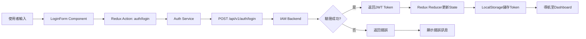

#### 5.2.2 使用者CRUD資料流

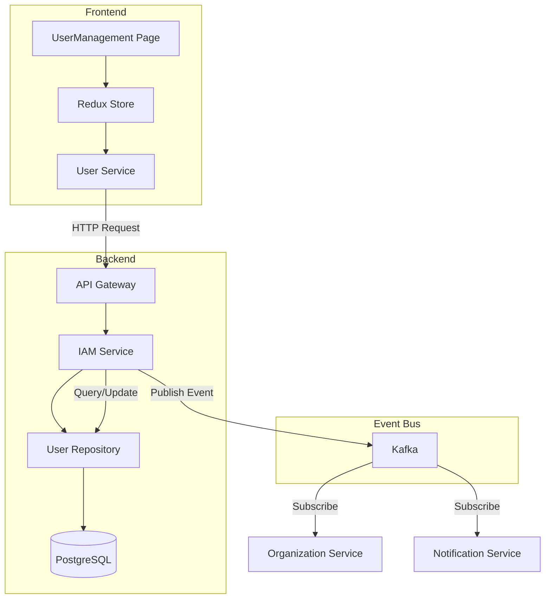

### 5.3 服務間資料流

#### 5.3.1 Token驗證流程

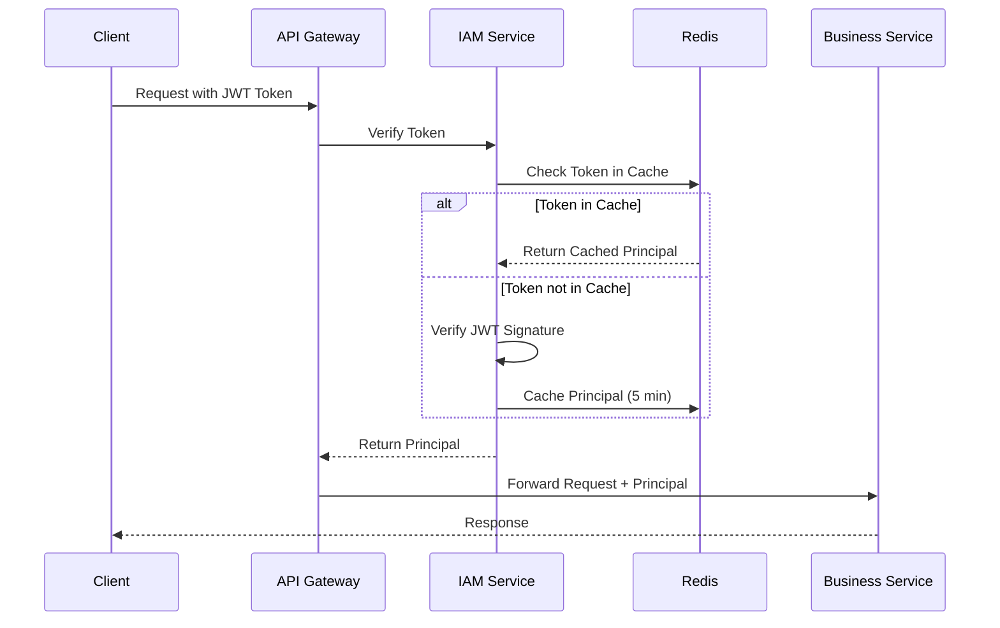

#### 5.3.2 使用者建立同步流程

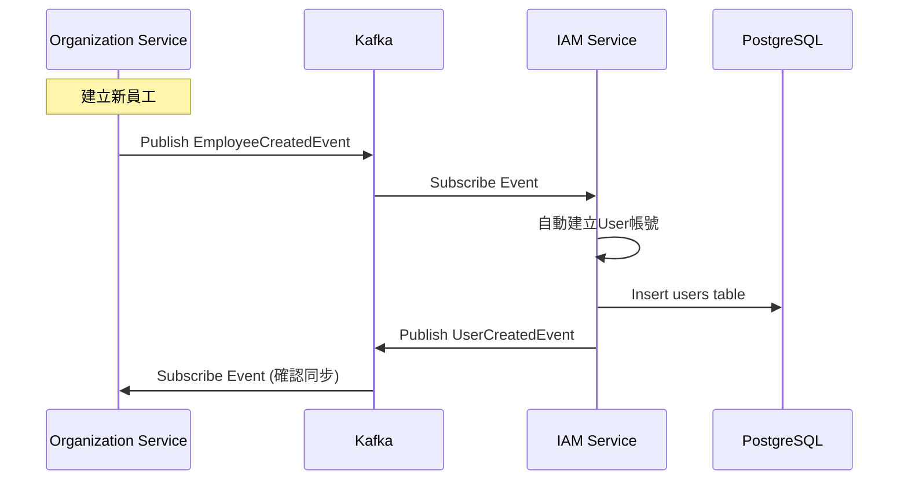

---

*（文件持續中，下一部分將包含資料庫設計、Domain設計、API規格等）*


# Continued: 01_IAM服務系統設計書_part3.md

## 6. 資料庫設計

### 6.1 ER Diagram

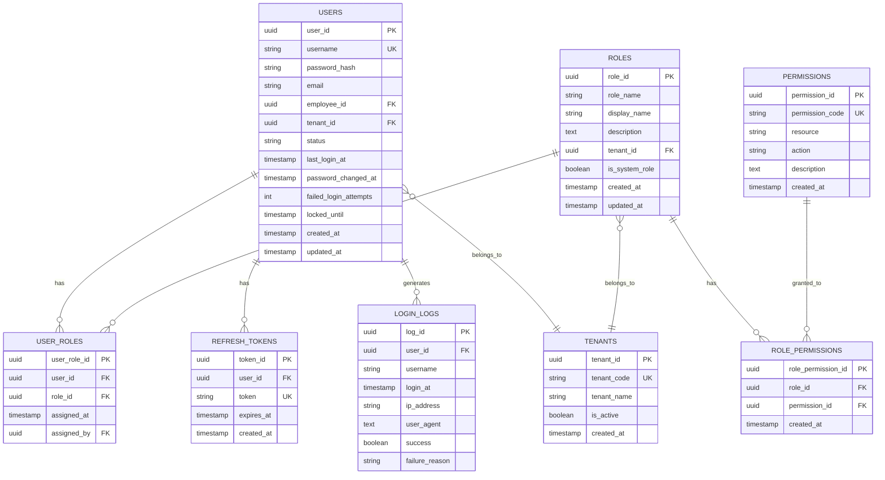

### 6.2 表結構定義 (DDL)

#### 6.2.1 users (使用者表)

```sql
CREATE TABLE users (
    user_id UUID PRIMARY KEY DEFAULT gen_random_uuid(),
    username VARCHAR(255) UNIQUE NOT NULL,
    password_hash VARCHAR(255) NOT NULL,
    email VARCHAR(255) NOT NULL,
    employee_id UUID NOT NULL,
    tenant_id UUID NOT NULL,
    status VARCHAR(20) NOT NULL DEFAULT 'ACTIVE',
    last_login_at TIMESTAMP,
    password_changed_at TIMESTAMP,
    failed_login_attempts INTEGER DEFAULT 0,
    locked_until TIMESTAMP,
    created_at TIMESTAMP DEFAULT CURRENT_TIMESTAMP,
    updated_at TIMESTAMP DEFAULT CURRENT_TIMESTAMP,

    CONSTRAINT chk_status CHECK (status IN ('ACTIVE', 'INACTIVE', 'LOCKED')),
    CONSTRAINT chk_email_format CHECK (email ~* '^[A-Za-z0-9._%+-]+@[A-Za-z0-9.-]+\.[A-Za-z]{2,}$')
);

-- 索引
CREATE INDEX idx_users_username ON users(username);
CREATE INDEX idx_users_email ON users(email);
CREATE INDEX idx_users_employee_id ON users(employee_id);
CREATE INDEX idx_users_tenant_id ON users(tenant_id);
CREATE INDEX idx_users_status ON users(status);
CREATE INDEX idx_users_last_login_at ON users(last_login_at);

-- 註解
COMMENT ON TABLE users IS '使用者帳號表';
COMMENT ON COLUMN users.user_id IS '使用者ID (主鍵)';
COMMENT ON COLUMN users.username IS '登入帳號 (通常為email)';
COMMENT ON COLUMN users.password_hash IS 'BCrypt加密後的密碼';
COMMENT ON COLUMN users.employee_id IS '關聯員工ID (外鍵至Organization Service)';
COMMENT ON COLUMN users.tenant_id IS '所屬租戶ID';
COMMENT ON COLUMN users.status IS '帳號狀態: ACTIVE/INACTIVE/LOCKED';
COMMENT ON COLUMN users.failed_login_attempts IS '連續失敗登入次數';
COMMENT ON COLUMN users.locked_until IS '鎖定至何時 (null表示未鎖定)';
```

#### 6.2.2 roles (角色表)

```sql
CREATE TABLE roles (
    role_id UUID PRIMARY KEY DEFAULT gen_random_uuid(),
    role_name VARCHAR(100) NOT NULL,
    display_name VARCHAR(255) NOT NULL,
    description TEXT,
    tenant_id UUID,
    is_system_role BOOLEAN DEFAULT FALSE,
    created_at TIMESTAMP DEFAULT CURRENT_TIMESTAMP,
    updated_at TIMESTAMP DEFAULT CURRENT_TIMESTAMP,

    UNIQUE(role_name, tenant_id)
);

-- 索引
CREATE INDEX idx_roles_tenant_id ON roles(tenant_id);
CREATE INDEX idx_roles_is_system_role ON roles(is_system_role);

-- 註解
COMMENT ON TABLE roles IS '角色定義表';
COMMENT ON COLUMN roles.role_name IS '角色代碼 (如: SYSTEM_ADMIN)';
COMMENT ON COLUMN roles.display_name IS '角色顯示名稱';
COMMENT ON COLUMN roles.tenant_id IS '所屬租戶ID (null表示系統預設角色)';
COMMENT ON COLUMN roles.is_system_role IS '是否為系統預設角色 (不可刪除)';
```

#### 6.2.3 permissions (權限表)

```sql
CREATE TABLE permissions (
    permission_id UUID PRIMARY KEY DEFAULT gen_random_uuid(),
    permission_code VARCHAR(255) UNIQUE NOT NULL,
    resource VARCHAR(100) NOT NULL,
    action VARCHAR(100) NOT NULL,
    description TEXT,
    created_at TIMESTAMP DEFAULT CURRENT_TIMESTAMP
);

-- 索引
CREATE INDEX idx_permissions_code ON permissions(permission_code);
CREATE INDEX idx_permissions_resource ON permissions(resource);

-- 註解
COMMENT ON TABLE permissions IS '權限定義表';
COMMENT ON COLUMN permissions.permission_code IS '權限代碼 (格式: resource:action, 如: employee:profile:read)';
COMMENT ON COLUMN permissions.resource IS '資源名稱 (如: employee, attendance)';
COMMENT ON COLUMN permissions.action IS '操作名稱 (如: read, write, approve)';
```

#### 6.2.4 user_roles (使用者角色關聯表)

```sql
CREATE TABLE user_roles (
    user_role_id UUID PRIMARY KEY DEFAULT gen_random_uuid(),
    user_id UUID NOT NULL REFERENCES users(user_id) ON DELETE CASCADE,
    role_id UUID NOT NULL REFERENCES roles(role_id) ON DELETE CASCADE,
    assigned_at TIMESTAMP DEFAULT CURRENT_TIMESTAMP,
    assigned_by UUID REFERENCES users(user_id),

    UNIQUE(user_id, role_id)
);

-- 索引
CREATE INDEX idx_user_roles_user_id ON user_roles(user_id);
CREATE INDEX idx_user_roles_role_id ON user_roles(role_id);

-- 註解
COMMENT ON TABLE user_roles IS '使用者角色關聯表';
COMMENT ON COLUMN user_roles.assigned_by IS '指派者ID';
```

#### 6.2.5 role_permissions (角色權限關聯表)

```sql
CREATE TABLE role_permissions (
    role_permission_id UUID PRIMARY KEY DEFAULT gen_random_uuid(),
    role_id UUID NOT NULL REFERENCES roles(role_id) ON DELETE CASCADE,
    permission_id UUID NOT NULL REFERENCES permissions(permission_id) ON DELETE CASCADE,
    created_at TIMESTAMP DEFAULT CURRENT_TIMESTAMP,

    UNIQUE(role_id, permission_id)
);

-- 索引
CREATE INDEX idx_role_permissions_role_id ON role_permissions(role_id);
CREATE INDEX idx_role_permissions_permission_id ON role_permissions(permission_id);

-- 註解
COMMENT ON TABLE role_permissions IS '角色權限關聯表';
```

#### 6.2.6 refresh_tokens (刷新Token表)

```sql
CREATE TABLE refresh_tokens (
    token_id UUID PRIMARY KEY DEFAULT gen_random_uuid(),
    user_id UUID NOT NULL REFERENCES users(user_id) ON DELETE CASCADE,
    token VARCHAR(512) UNIQUE NOT NULL,
    expires_at TIMESTAMP NOT NULL,
    created_at TIMESTAMP DEFAULT CURRENT_TIMESTAMP
);

-- 索引
CREATE INDEX idx_refresh_tokens_user_id ON refresh_tokens(user_id);
CREATE INDEX idx_refresh_tokens_token ON refresh_tokens(token);
CREATE INDEX idx_refresh_tokens_expires_at ON refresh_tokens(expires_at);

-- 註解
COMMENT ON TABLE refresh_tokens IS 'Refresh Token儲存表';
COMMENT ON COLUMN refresh_tokens.token IS 'Refresh Token字串';
COMMENT ON COLUMN refresh_tokens.expires_at IS '過期時間 (通常7天)';
```

#### 6.2.7 login_logs (登入日誌表)

```sql
CREATE TABLE login_logs (
    log_id UUID PRIMARY KEY DEFAULT gen_random_uuid(),
    user_id UUID REFERENCES users(user_id),
    username VARCHAR(255) NOT NULL,
    login_at TIMESTAMP DEFAULT CURRENT_TIMESTAMP,
    ip_address VARCHAR(50),
    user_agent TEXT,
    success BOOLEAN NOT NULL,
    failure_reason VARCHAR(255)
);

-- 索引
CREATE INDEX idx_login_logs_user_id ON login_logs(user_id);
CREATE INDEX idx_login_logs_username ON login_logs(username);
CREATE INDEX idx_login_logs_login_at ON login_logs(login_at);
CREATE INDEX idx_login_logs_success ON login_logs(success);
CREATE INDEX idx_login_logs_ip_address ON login_logs(ip_address);

-- 註解
COMMENT ON TABLE login_logs IS '登入日誌表 (用於審計)';
COMMENT ON COLUMN login_logs.success IS '登入是否成功';
COMMENT ON COLUMN login_logs.failure_reason IS '失敗原因 (如: INVALID_PASSWORD, ACCOUNT_LOCKED)';

-- 分區表 (按月分區，提升查詢效能)
CREATE TABLE login_logs_y2025m01 PARTITION OF login_logs
    FOR VALUES FROM ('2025-01-01') TO ('2025-02-01');
```

### 6.3 資料字典

| 表名 | 說明 | 預估資料量 | 成長速度 | 保留策略 |
|:---|:---|:---:|:---|:---|
| `users` | 使用者帳號 | 200 | 年增50筆 | 永久保留 |
| `roles` | 角色定義 | 30 | 年增5筆 | 永久保留 |
| `permissions` | 權限定義 | 150 | 年增20筆 | 永久保留 |
| `user_roles` | 使用者角色關聯 | 400 | 年增100筆 | 永久保留 |
| `role_permissions` | 角色權限關聯 | 800 | 年增100筆 | 永久保留 |
| `refresh_tokens` | Refresh Token | 500 | - | 自動過期清理 |
| `login_logs` | 登入日誌 | 10,000 | 月增10,000筆 | 保留2年後歸檔 |

### 6.4 初始化資料腳本

#### 6.4.1 系統預設角色

```sql
-- 插入系統預設角色
INSERT INTO roles (role_id, role_name, display_name, description, tenant_id, is_system_role) VALUES
('00000000-0000-0000-0000-000000000001', 'SYSTEM_ADMIN', '系統管理員', '最高權限，可管理所有功能', NULL, TRUE),
('00000000-0000-0000-0000-000000000002', 'HR_ADMIN', '人資管理員', '人資全功能權限', NULL, TRUE),
('00000000-0000-0000-0000-000000000003', 'HR_STAFF', '人資專員', '人資部分功能權限', NULL, TRUE),
('00000000-0000-0000-0000-000000000004', 'FINANCE_ADMIN', '財務管理員', '財務全功能權限', NULL, TRUE),
('00000000-0000-0000-0000-000000000005', 'DEPT_MANAGER', '部門主管', '部門管理權限', NULL, TRUE),
('00000000-0000-0000-0000-000000000006', 'PM', '專案經理', '專案管理權限', NULL, TRUE),
('00000000-0000-0000-0000-000000000007', 'EMPLOYEE', '一般員工', '基本功能權限', NULL, TRUE);
```

#### 6.4.2 系統預設權限

```sql
-- IAM相關權限
INSERT INTO permissions (permission_code, resource, action, description) VALUES
('user:read', 'user', 'read', '查看使用者資料'),
('user:create', 'user', 'create', '建立使用者'),
('user:write', 'user', 'write', '編輯使用者'),
('user:delete', 'user', 'delete', '刪除使用者'),
('user:deactivate', 'user', 'deactivate', '停用使用者'),
('user:reset-password', 'user', 'reset-password', '重置使用者密碼'),
('user:assign-role', 'user', 'assign-role', '指派角色給使用者'),

('role:read', 'role', 'read', '查看角色'),
('role:create', 'role', 'create', '建立角色'),
('role:write', 'role', 'write', '編輯角色'),
('role:delete', 'role', 'delete', '刪除角色'),
('role:manage-permission', 'role', 'manage-permission', '管理角色權限'),

('permission:read', 'permission', 'read', '查看權限列表');

-- 員工管理相關權限
INSERT INTO permissions (permission_code, resource, action, description) VALUES
('employee:profile:read', 'employee', 'profile:read', '查看員工資料'),
('employee:profile:write', 'employee', 'profile:write', '編輯員工資料'),
('employee:profile:delete', 'employee', 'profile:delete', '刪除員工'),
('employee:salary:read', 'employee', 'salary:read', '查看員工薪資');

-- 考勤管理相關權限
INSERT INTO permissions (permission_code, resource, action, description) VALUES
('attendance:leave:read', 'attendance', 'leave:read', '查看請假記錄'),
('attendance:leave:apply', 'attendance', 'leave:apply', '申請請假'),
('attendance:leave:approve', 'attendance', 'leave:approve', '審核請假'),
('attendance:overtime:read', 'attendance', 'overtime:read', '查看加班記錄'),
('attendance:overtime:apply', 'attendance', 'overtime:apply', '申請加班'),
('attendance:overtime:approve', 'attendance', 'overtime:approve', '審核加班');
```

---

## 7. Domain設計

### 7.1 聚合根 (Aggregate Root)

#### 7.1.1 User聚合根

**職責:** 管理使用者帳號、密碼、狀態與登入行為

**屬性:**
```java
@Entity
@Table(name = "users")
public class User {
    @EmbeddedId
    private UserId id;

    @Column(unique = true, nullable = false)
    private String username;

    @Embedded
    private Password password;

    @Embedded
    private Email email;

    @Column(name = "employee_id", nullable = false)
    private UUID employeeId;

    @Column(name = "tenant_id", nullable = false)
    private UUID tenantId;

    @Enumerated(EnumType.STRING)
    private UserStatus status;

    @Column(name = "last_login_at")
    private LocalDateTime lastLoginAt;

    @Column(name = "password_changed_at")
    private LocalDateTime passwordChangedAt;

    @Column(name = "failed_login_attempts")
    private int failedLoginAttempts;

    @Column(name = "locked_until")
    private LocalDateTime lockedUntil;

    @Column(name = "created_at")
    private LocalDateTime createdAt;

    @Column(name = "updated_at")
    private LocalDateTime updatedAt;

    // Domain行為
    public void authenticate(String rawPassword, PasswordEncoder encoder) {
        if (!status.canLogin()) {
            throw new DomainException("帳號狀態不允許登入");
        }

        if (isLocked()) {
            throw new AccountLockedException("帳號已被鎖定至 " + lockedUntil);
        }

        if (!password.matches(rawPassword, encoder)) {
            recordLoginFailure();
            throw new InvalidCredentialsException("密碼錯誤");
        }

        recordLoginSuccess();
    }

    public void changePassword(String oldPassword, String newPassword, PasswordEncoder encoder) {
        // 驗證舊密碼
        if (!password.matches(oldPassword, encoder)) {
            throw new DomainException("舊密碼錯誤");
        }

        // 驗證新密碼強度
        Password newPasswordObj = Password.create(newPassword);

        // 新密碼不能與舊密碼相同
        if (password.equals(newPasswordObj)) {
            throw new DomainException("新密碼不能與舊密碼相同");
        }

        this.password = newPasswordObj.encode(encoder);
        this.passwordChangedAt = LocalDateTime.now();
        this.updatedAt = LocalDateTime.now();
    }

    public void resetPassword(String newPassword, PasswordEncoder encoder) {
        Password newPasswordObj = Password.create(newPassword);
        this.password = newPasswordObj.encode(encoder);
        this.passwordChangedAt = LocalDateTime.now();
        this.updatedAt = LocalDateTime.now();
    }

    public void deactivate() {
        if (status == UserStatus.INACTIVE) {
            throw new DomainException("帳號已停用");
        }
        this.status = UserStatus.INACTIVE;
        this.updatedAt = LocalDateTime.now();
    }

    public void activate() {
        this.status = UserStatus.ACTIVE;
        this.failedLoginAttempts = 0;
        this.lockedUntil = null;
        this.updatedAt = LocalDateTime.now();
    }

    private void recordLoginSuccess() {
        this.lastLoginAt = LocalDateTime.now();
        this.failedLoginAttempts = 0;
        this.lockedUntil = null;
        this.updatedAt = LocalDateTime.now();
    }

    private void recordLoginFailure() {
        this.failedLoginAttempts++;

        // 連續失敗5次，鎖定30分鐘
        if (this.failedLoginAttempts >= 5) {
            this.status = UserStatus.LOCKED;
            this.lockedUntil = LocalDateTime.now().plusMinutes(30);
        }

        this.updatedAt = LocalDateTime.now();
    }

    private boolean isLocked() {
        if (status == UserStatus.LOCKED && lockedUntil != null) {
            if (LocalDateTime.now().isAfter(lockedUntil)) {
                // 鎖定時間已過，自動解鎖
                activate();
                return false;
            }
            return true;
        }
        return false;
    }
}
```

**不變性規則 (Invariants):**
- ✅ username必須唯一且不可為空
- ✅ 密碼必須符合強度規則（至少8字元、含大小寫字母、數字）
- ✅ 連續失敗登入5次後自動鎖定帳號30分鐘
- ✅ INACTIVE或LOCKED狀態的使用者不可登入
- ✅ employeeId必須存在於Organization Service

---

*（文件持續中，下一部分將包含Role聚合根、值對象、領域事件、完整API規格等）*


# Continued: 01_IAM服務系統設計書_part4.md

## 7.2 Role聚合根

**職責:** 管理角色定義與權限分配

**屬性:**
```java
@Entity
@Table(name = "roles")
public class Role {
    @EmbeddedId
    private RoleId id;

    @Column(name = "role_name", nullable = false)
    private String roleName;

    @Column(name = "display_name", nullable = false)
    private String displayName;

    @Column(name = "description")
    private String description;

    @Column(name = "tenant_id")
    private UUID tenantId;

    @Column(name = "is_system_role")
    private boolean isSystemRole;

    @OneToMany(cascade = CascadeType.ALL, orphanRemoval = true)
    @JoinColumn(name = "role_id")
    private Set<RolePermission> permissions = new HashSet<>();

    @Column(name = "created_at")
    private LocalDateTime createdAt;

    @Column(name = "updated_at")
    private LocalDateTime updatedAt;

    // ========== Factory Method ==========

    public static Role create(CreateRoleCommand cmd) {
        Objects.requireNonNull(cmd.getRoleName(), "角色代碼不可為空");
        Objects.requireNonNull(cmd.getDisplayName(), "角色名稱不可為空");

        Role role = new Role();
        role.id = RoleId.generate();
        role.roleName = cmd.getRoleName();
        role.displayName = cmd.getDisplayName();
        role.description = cmd.getDescription();
        role.tenantId = cmd.getTenantId();
        role.isSystemRole = false;
        role.createdAt = LocalDateTime.now();
        role.updatedAt = LocalDateTime.now();

        DomainEventPublisher.publish(new RoleCreatedEvent(
            role.id.getValue(),
            role.roleName,
            role.displayName
        ));

        return role;
    }

    // ========== Domain行為 ==========

    /**
     * 新增權限
     */
    public void grantPermission(Permission permission) {
        if (this.permissions.stream().anyMatch(p ->
            p.getPermissionId().equals(permission.getId()))) {
            return; // 已存在則跳過
        }

        RolePermission rp = new RolePermission(this.id, permission.getId());
        this.permissions.add(rp);
        this.updatedAt = LocalDateTime.now();

        DomainEventPublisher.publish(new RolePermissionChangedEvent(
            this.id.getValue(),
            "GRANT",
            permission.getPermissionCode()
        ));
    }

    /**
     * 移除權限
     */
    public void revokePermission(PermissionId permissionId) {
        boolean removed = this.permissions.removeIf(p ->
            p.getPermissionId().equals(permissionId));

        if (removed) {
            this.updatedAt = LocalDateTime.now();

            DomainEventPublisher.publish(new RolePermissionChangedEvent(
                this.id.getValue(),
                "REVOKE",
                permissionId.getValue().toString()
            ));
        }
    }

    /**
     * 批次更新權限
     */
    public void updatePermissions(Set<Permission> newPermissions) {
        this.permissions.clear();
        newPermissions.forEach(this::grantPermission);
        this.updatedAt = LocalDateTime.now();
    }

    /**
     * 更新角色資訊
     */
    public void update(UpdateRoleCommand cmd) {
        if (this.isSystemRole) {
            throw new DomainException("系統預設角色不可修改");
        }

        if (cmd.getDisplayName() != null) {
            this.displayName = cmd.getDisplayName();
        }
        if (cmd.getDescription() != null) {
            this.description = cmd.getDescription();
        }
        this.updatedAt = LocalDateTime.now();
    }

    /**
     * 刪除檢查
     */
    public void validateDeletion() {
        if (this.isSystemRole) {
            throw new DomainException("系統預設角色不可刪除");
        }
    }

    /**
     * 檢查是否擁有指定權限
     */
    public boolean hasPermission(String permissionCode) {
        return this.permissions.stream()
            .anyMatch(p -> p.getPermissionCode().equals(permissionCode));
    }
}
```

**不變性規則 (Invariants):**
- ✅ roleName在同一tenant內必須唯一
- ✅ 系統預設角色(isSystemRole=true)不可修改或刪除
- ✅ 角色至少需要一個權限才能使用

---

## 7.3 值對象 (Value Objects)

### 7.3.1 UserId

```java
@Embeddable
public class UserId implements Serializable {
    @Column(name = "user_id")
    private UUID value;

    protected UserId() {}

    private UserId(UUID value) {
        this.value = Objects.requireNonNull(value, "UserId不可為空");
    }

    public static UserId generate() {
        return new UserId(UUID.randomUUID());
    }

    public static UserId of(String id) {
        return new UserId(UUID.fromString(id));
    }

    public static UserId of(UUID id) {
        return new UserId(id);
    }

    public UUID getValue() {
        return value;
    }

    @Override
    public boolean equals(Object o) {
        if (this == o) return true;
        if (o == null || getClass() != o.getClass()) return false;
        UserId userId = (UserId) o;
        return Objects.equals(value, userId.value);
    }

    @Override
    public int hashCode() {
        return Objects.hash(value);
    }

    @Override
    public String toString() {
        return value.toString();
    }
}
```

### 7.3.2 Email

```java
@Embeddable
public class Email implements Serializable {
    private static final String EMAIL_REGEX = "^[A-Za-z0-9+_.-]+@(.+)$";
    private static final Pattern EMAIL_PATTERN = Pattern.compile(EMAIL_REGEX);

    @Column(name = "email")
    private String value;

    protected Email() {}

    public Email(String value) {
        Objects.requireNonNull(value, "Email不可為空");

        if (!EMAIL_PATTERN.matcher(value).matches()) {
            throw new InvalidEmailException("Email格式不正確: " + value);
        }

        this.value = value.toLowerCase().trim();
    }

    public String getValue() {
        return value;
    }

    public String getDomain() {
        return value.substring(value.indexOf("@") + 1);
    }

    @Override
    public boolean equals(Object o) {
        if (this == o) return true;
        if (o == null || getClass() != o.getClass()) return false;
        Email email = (Email) o;
        return Objects.equals(value, email.value);
    }

    @Override
    public int hashCode() {
        return Objects.hash(value);
    }

    @Override
    public String toString() {
        return value;
    }
}
```

### 7.3.3 Password

```java
@Embeddable
public class Password implements Serializable {
    private static final int MIN_LENGTH = 8;
    private static final int MAX_LENGTH = 128;
    private static final String PATTERN = "^(?=.*[a-z])(?=.*[A-Z])(?=.*\\d).+$";

    @Column(name = "password_hash")
    private String hash;

    protected Password() {}

    private Password(String hash) {
        this.hash = hash;
    }

    /**
     * 建立密碼（未加密）
     */
    public static Password create(String rawPassword) {
        Objects.requireNonNull(rawPassword, "密碼不可為空");

        if (rawPassword.length() < MIN_LENGTH) {
            throw new WeakPasswordException("密碼長度至少需要" + MIN_LENGTH + "個字元");
        }

        if (rawPassword.length() > MAX_LENGTH) {
            throw new WeakPasswordException("密碼長度不可超過" + MAX_LENGTH + "個字元");
        }

        if (!rawPassword.matches(PATTERN)) {
            throw new WeakPasswordException("密碼必須包含大小寫字母和數字");
        }

        return new Password(rawPassword); // 暫存未加密密碼
    }

    /**
     * 加密密碼
     */
    public Password encode(PasswordEncoder encoder) {
        return new Password(encoder.encode(this.hash));
    }

    /**
     * 驗證密碼
     */
    public boolean matches(String rawPassword, PasswordEncoder encoder) {
        return encoder.matches(rawPassword, this.hash);
    }

    public String getHash() {
        return hash;
    }

    @Override
    public boolean equals(Object o) {
        if (this == o) return true;
        if (o == null || getClass() != o.getClass()) return false;
        Password password = (Password) o;
        return Objects.equals(hash, password.hash);
    }

    @Override
    public int hashCode() {
        return Objects.hash(hash);
    }
}
```

### 7.3.4 RoleId

```java
@Embeddable
public class RoleId implements Serializable {
    @Column(name = "role_id")
    private UUID value;

    protected RoleId() {}

    private RoleId(UUID value) {
        this.value = Objects.requireNonNull(value, "RoleId不可為空");
    }

    public static RoleId generate() {
        return new RoleId(UUID.randomUUID());
    }

    public static RoleId of(String id) {
        return new RoleId(UUID.fromString(id));
    }

    public static RoleId of(UUID id) {
        return new RoleId(id);
    }

    public UUID getValue() {
        return value;
    }

    @Override
    public boolean equals(Object o) {
        if (this == o) return true;
        if (o == null || getClass() != o.getClass()) return false;
        RoleId roleId = (RoleId) o;
        return Objects.equals(value, roleId.value);
    }

    @Override
    public int hashCode() {
        return Objects.hash(value);
    }
}
```

### 7.3.5 UserStatus

```java
public enum UserStatus {
    ACTIVE("啟用", true),
    INACTIVE("停用", false),
    LOCKED("鎖定", false);

    private final String displayName;
    private final boolean canLogin;

    UserStatus(String displayName, boolean canLogin) {
        this.displayName = displayName;
        this.canLogin = canLogin;
    }

    public String getDisplayName() {
        return displayName;
    }

    public boolean canLogin() {
        return canLogin;
    }
}
```

---

## 7.4 領域服務 (Domain Services)

### 7.4.1 AuthenticationDomainService

```java
@Service
public class AuthenticationDomainService {

    private final IUserRepository userRepository;
    private final PasswordEncoder passwordEncoder;
    private final JwtTokenProvider tokenProvider;

    /**
     * 執行登入驗證
     */
    public AuthResult authenticate(String username, String password, UUID tenantId) {
        // 1. 查找使用者
        User user = userRepository.findByUsernameAndTenantId(username, tenantId)
            .orElseThrow(() -> new InvalidCredentialsException("使用者名稱或密碼錯誤"));

        // 2. 驗證密碼（Domain行為）
        user.authenticate(password, passwordEncoder);

        // 3. 儲存更新（lastLoginAt等）
        userRepository.save(user);

        // 4. 產生Token
        String accessToken = tokenProvider.generateAccessToken(user);
        String refreshToken = tokenProvider.generateRefreshToken(user);

        // 5. 記錄登入日誌
        DomainEventPublisher.publish(new UserLoggedInEvent(
            user.getId().getValue(),
            user.getUsername(),
            LocalDateTime.now()
        ));

        return new AuthResult(accessToken, refreshToken, user);
    }

    /**
     * 刷新Token
     */
    public AuthResult refreshToken(String refreshToken) {
        // 驗證refresh token
        Claims claims = tokenProvider.validateRefreshToken(refreshToken);
        UUID userId = UUID.fromString(claims.getSubject());

        User user = userRepository.findById(UserId.of(userId))
            .orElseThrow(() -> new InvalidTokenException("無效的Token"));

        if (!user.getStatus().canLogin()) {
            throw new AccountDisabledException("帳號已停用");
        }

        String newAccessToken = tokenProvider.generateAccessToken(user);
        String newRefreshToken = tokenProvider.generateRefreshToken(user);

        return new AuthResult(newAccessToken, newRefreshToken, user);
    }
}
```

### 7.4.2 AccountLockingDomainService

```java
@Service
public class AccountLockingDomainService {

    private static final int MAX_FAILED_ATTEMPTS = 5;
    private static final int LOCK_DURATION_MINUTES = 30;

    private final IUserRepository userRepository;

    /**
     * 記錄登入失敗
     */
    public void recordLoginFailure(String username, UUID tenantId) {
        userRepository.findByUsernameAndTenantId(username, tenantId)
            .ifPresent(user -> {
                user.recordLoginFailure();
                userRepository.save(user);

                if (user.getStatus() == UserStatus.LOCKED) {
                    DomainEventPublisher.publish(new AccountLockedEvent(
                        user.getId().getValue(),
                        user.getUsername(),
                        user.getLockedUntil()
                    ));
                }
            });
    }

    /**
     * 手動解鎖帳號
     */
    public void unlockAccount(UserId userId) {
        User user = userRepository.findById(userId)
            .orElseThrow(() -> new UserNotFoundException("使用者不存在"));

        user.activate();
        userRepository.save(user);

        DomainEventPublisher.publish(new AccountUnlockedEvent(
            user.getId().getValue(),
            user.getUsername()
        ));
    }
}
```

---

## 8. 領域事件設計

### 8.1 事件清單

| 事件名稱 | 觸發時機 | 發布服務 | 訂閱服務 |
|:---|:---|:---|:---|
| `UserCreatedEvent` | 建立使用者 | IAM | Organization, Notification |
| `UserUpdatedEvent` | 更新使用者資料 | IAM | - |
| `UserDeactivatedEvent` | 停用使用者 | IAM | Notification |
| `UserActivatedEvent` | 啟用使用者 | IAM | - |
| `UserLoggedInEvent` | 登入成功 | IAM | Notification (安全通知) |
| `AccountLockedEvent` | 帳號鎖定 | IAM | Notification |
| `AccountUnlockedEvent` | 帳號解鎖 | IAM | - |
| `PasswordChangedEvent` | 修改密碼 | IAM | Notification |
| `PasswordResetEvent` | 重置密碼 | IAM | Notification |
| `RoleCreatedEvent` | 建立角色 | IAM | - |
| `RoleUpdatedEvent` | 更新角色 | IAM | - |
| `RoleDeletedEvent` | 刪除角色 | IAM | - |
| `RolePermissionChangedEvent` | 角色權限變更 | IAM | - |
| `UserRoleAssignedEvent` | 指派角色給使用者 | IAM | - |
| `UserRoleRevokedEvent` | 移除使用者角色 | IAM | - |

### 8.2 事件Schema

#### UserCreatedEvent

```json
{
  "eventId": "uuid",
  "eventType": "UserCreatedEvent",
  "occurredAt": "2025-01-15T10:30:00Z",
  "aggregateId": "user-uuid",
  "aggregateType": "User",
  "payload": {
    "userId": "uuid",
    "username": "john.doe@company.com",
    "email": "john.doe@company.com",
    "employeeId": "employee-uuid",
    "tenantId": "tenant-uuid",
    "roleIds": ["role-uuid-1", "role-uuid-2"]
  }
}
```

#### UserLoggedInEvent

```json
{
  "eventId": "uuid",
  "eventType": "UserLoggedInEvent",
  "occurredAt": "2025-01-15T10:30:00Z",
  "aggregateId": "user-uuid",
  "aggregateType": "User",
  "payload": {
    "userId": "uuid",
    "username": "john.doe@company.com",
    "loginAt": "2025-01-15T10:30:00Z",
    "ipAddress": "192.168.1.100",
    "userAgent": "Mozilla/5.0..."
  }
}
```

#### AccountLockedEvent

```json
{
  "eventId": "uuid",
  "eventType": "AccountLockedEvent",
  "occurredAt": "2025-01-15T10:30:00Z",
  "aggregateId": "user-uuid",
  "aggregateType": "User",
  "payload": {
    "userId": "uuid",
    "username": "john.doe@company.com",
    "lockedUntil": "2025-01-15T11:00:00Z",
    "reason": "連續登入失敗5次"
  }
}
```

#### RolePermissionChangedEvent

```json
{
  "eventId": "uuid",
  "eventType": "RolePermissionChangedEvent",
  "occurredAt": "2025-01-15T10:30:00Z",
  "aggregateId": "role-uuid",
  "aggregateType": "Role",
  "payload": {
    "roleId": "uuid",
    "roleName": "HR_STAFF",
    "action": "GRANT",
    "permissionCode": "employee:profile:read"
  }
}
```

---

## 9. API設計

### 9.1 Controller命名對照

| Controller | 說明 | 負責頁面 |
|:---|:---|:---|
| `HR01AuthCmdController` | 認證Command操作 | IAM-P01 |
| `HR01UserCmdController` | 使用者Command操作 | IAM-P02 |
| `HR01UserQryController` | 使用者Query操作 | IAM-P02 |
| `HR01RoleCmdController` | 角色Command操作 | IAM-P03 |
| `HR01RoleQryController` | 角色Query操作 | IAM-P03 |
| `HR01PermissionQryController` | 權限Query操作 | IAM-P03 |
| `HR01ProfileCmdController` | 個人資料Command操作 | IAM-P04 |
| `HR01ProfileQryController` | 個人資料Query操作 | IAM-P04 |

### 9.2 API總覽 (24個端點)

| 端點 | 方法 | Controller | 說明 |
|:---|:---:|:---|:---|
| `/api/v1/auth/login` | POST | HR01AuthCmdController | 登入 |
| `/api/v1/auth/logout` | POST | HR01AuthCmdController | 登出 |
| `/api/v1/auth/refresh-token` | POST | HR01AuthCmdController | 刷新Token |
| `/api/v1/auth/forgot-password` | POST | HR01AuthCmdController | 忘記密碼 |
| `/api/v1/auth/reset-password` | POST | HR01AuthCmdController | 重置密碼 |
| `/api/v1/auth/oauth/google` | GET | HR01AuthCmdController | Google OAuth |
| `/api/v1/auth/oauth/google/callback` | GET | HR01AuthCmdController | Google回調 |
| `/api/v1/auth/oauth/microsoft` | GET | HR01AuthCmdController | Microsoft OAuth |
| `/api/v1/auth/oauth/microsoft/callback` | GET | HR01AuthCmdController | Microsoft回調 |
| `/api/v1/users` | GET | HR01UserQryController | 查詢使用者列表 |
| `/api/v1/users/{id}` | GET | HR01UserQryController | 查詢使用者詳情 |
| `/api/v1/users` | POST | HR01UserCmdController | 建立使用者 |
| `/api/v1/users/{id}` | PUT | HR01UserCmdController | 更新使用者 |
| `/api/v1/users/{id}/deactivate` | PUT | HR01UserCmdController | 停用使用者 |
| `/api/v1/users/{id}/activate` | PUT | HR01UserCmdController | 啟用使用者 |
| `/api/v1/users/{id}/reset-password` | PUT | HR01UserCmdController | 管理員重置密碼 |
| `/api/v1/users/{id}/roles` | PUT | HR01UserCmdController | 指派角色 |
| `/api/v1/users/batch-deactivate` | PUT | HR01UserCmdController | 批次停用 |
| `/api/v1/roles` | GET | HR01RoleQryController | 查詢角色列表 |
| `/api/v1/roles/{id}` | GET | HR01RoleQryController | 查詢角色詳情 |
| `/api/v1/roles` | POST | HR01RoleCmdController | 建立角色 |
| `/api/v1/roles/{id}` | PUT | HR01RoleCmdController | 更新角色 |
| `/api/v1/roles/{id}` | DELETE | HR01RoleCmdController | 刪除角色 |
| `/api/v1/roles/{id}/permissions` | PUT | HR01RoleCmdController | 更新角色權限 |
| `/api/v1/permissions` | GET | HR01PermissionQryController | 查詢權限列表 |
| `/api/v1/permissions/tree` | GET | HR01PermissionQryController | 查詢權限樹 |
| `/api/v1/profile` | GET | HR01ProfileQryController | 查詢個人資料 |
| `/api/v1/profile` | PUT | HR01ProfileCmdController | 更新個人資料 |
| `/api/v1/profile/change-password` | PUT | HR01ProfileCmdController | 修改密碼 |

### 9.3 API詳細規格

#### 9.3.1 登入API

**請求:**
```http
POST /api/v1/auth/login
Content-Type: application/json

{
  "username": "john.doe@company.com",
  "password": "Password123!",
  "tenantId": "tenant-uuid"
}
```

**成功回應:**
```json
{
  "code": "SUCCESS",
  "message": "登入成功",
  "data": {
    "accessToken": "eyJhbGciOiJIUzI1NiIs...",
    "refreshToken": "eyJhbGciOiJIUzI1NiIs...",
    "expiresIn": 3600,
    "user": {
      "userId": "uuid",
      "username": "john.doe@company.com",
      "displayName": "John Doe",
      "roles": ["HR_ADMIN", "EMPLOYEE"],
      "permissions": ["user:read", "user:write", ...]
    }
  }
}
```

**錯誤回應（HTTP 401）：**

> `LOGIN_FAILED`（INVALID_CREDENTIALS）與 `ACCOUNT_LOCKED` 統一回傳 HTTP 401，由 `GlobalExceptionHandler` 處理。

```json
{
  "code": "INVALID_CREDENTIALS",
  "message": "使用者名稱或密碼錯誤"
}
```

```json
{
  "code": "ACCOUNT_LOCKED",
  "message": "帳號已被鎖定，請30分鐘後再試",
  "data": {
    "lockedUntil": "2025-01-15T11:00:00Z"
  }
}
```

#### 9.3.2 建立使用者API

**請求:**
```http
POST /api/v1/users
Content-Type: application/json
Authorization: Bearer {accessToken}

{
  "username": "jane.doe@company.com",
  "email": "jane.doe@company.com",
  "employeeId": "employee-uuid",
  "roleIds": ["role-uuid-1", "role-uuid-2"],
  "sendWelcomeEmail": true
}
```

**成功回應:**
```json
{
  "code": "SUCCESS",
  "message": "使用者建立成功",
  "data": {
    "userId": "new-user-uuid"
  }
}
```

#### 9.3.3 更新角色權限API

**請求:**
```http
PUT /api/v1/roles/{roleId}/permissions
Content-Type: application/json
Authorization: Bearer {accessToken}

{
  "permissionIds": [
    "permission-uuid-1",
    "permission-uuid-2",
    "permission-uuid-3"
  ]
}
```

**成功回應:**
```json
{
  "code": "SUCCESS",
  "message": "角色權限更新成功"
}
```

---

## 10. 事件範例

### 10.1 登入流程完整事件

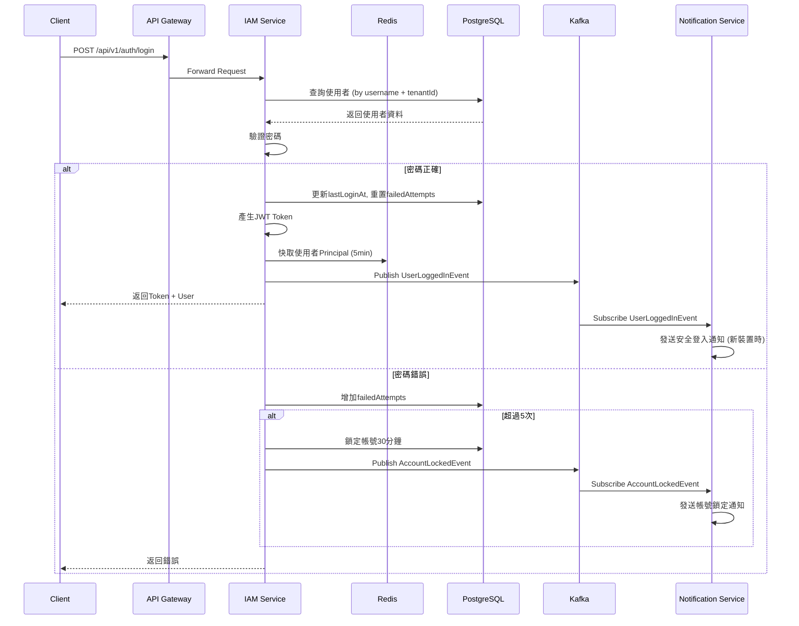

### 10.2 使用者建立與同步事件

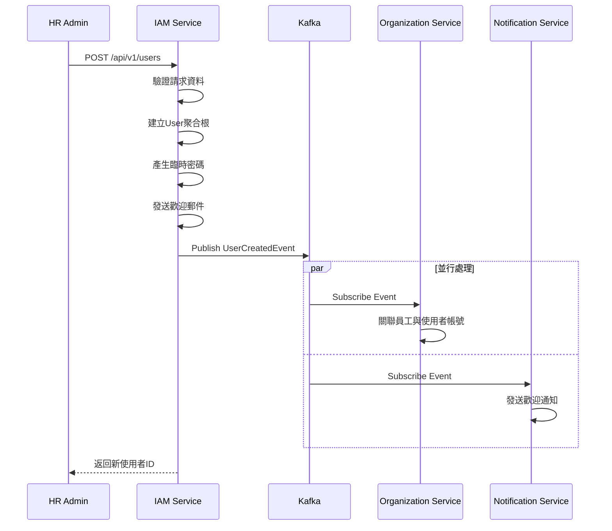

---

## 11. 工項清單摘要

### 前端開發工項

| 工項編號 | 工項名稱 | 估計工時 | 優先順序 |
|:---|:---|:---:|:---:|
| FE-01-01 | IAM-P01 登入頁面 | 8h | P0 |
| FE-01-02 | IAM-P02 使用者管理頁面 | 16h | P0 |
| FE-01-03 | IAM-P03 角色權限管理頁面 | 16h | P0 |
| FE-01-04 | IAM-P04 個人資料頁面 | 8h | P1 |
| FE-01-05 | IAM-M01 使用者編輯對話框 | 4h | P0 |
| FE-01-06 | IAM-M02 角色編輯對話框 | 4h | P0 |
| FE-01-07 | IAM-M03 修改密碼對話框 | 4h | P1 |
| FE-01-08 | 權限樹元件開發 | 8h | P0 |
| FE-01-09 | Redux Auth模組 | 8h | P0 |
| FE-01-10 | UserViewModelFactory | 4h | P0 |
| FE-01-11 | RoleViewModelFactory | 4h | P0 |
| **小計** | | **84h** | |

### 後端開發工項

| 工項編號 | 工項名稱 | 估計工時 | 優先順序 |
|:---|:---|:---:|:---:|
| BE-01-01 | User聚合根與Repository | 16h | P0 |
| BE-01-02 | Role聚合根與Repository | 8h | P0 |
| BE-01-03 | Permission Entity與Repository | 4h | P0 |
| BE-01-04 | 值對象實作 (Email, Password等) | 8h | P0 |
| BE-01-05 | AuthenticationDomainService | 8h | P0 |
| BE-01-06 | AccountLockingDomainService | 4h | P0 |
| BE-01-07 | JwtTokenProvider | 8h | P0 |
| BE-01-08 | 認證API (5端點) | 16h | P0 |
| BE-01-09 | 使用者API (8端點) | 16h | P0 |
| BE-01-10 | 角色API (5端點) | 8h | P0 |
| BE-01-11 | 權限API (2端點) | 4h | P1 |
| BE-01-12 | 個人資料API (3端點) | 4h | P1 |
| BE-01-13 | OAuth2整合 (Google, Microsoft) | 16h | P2 |
| BE-01-16 | LDAP/AD 企業登入整合 | 24h | P2 |
| BE-01-14 | 領域事件發布 | 8h | P0 |
| BE-01-15 | Swagger文件 | 4h | P1 |
| **小計** | | **132h** | |

### 資料庫開發工項

| 工項編號 | 工項名稱 | 估計工時 | 優先順序 |
|:---|:---|:---:|:---:|
| DB-01-01 | 建立7個資料表DDL | 4h | P0 |
| DB-01-02 | 建立索引 | 2h | P0 |
| DB-01-03 | 初始化系統角色資料 | 2h | P0 |
| DB-01-04 | 初始化權限資料 | 2h | P0 |
| DB-01-05 | 登入日誌分區表 | 2h | P1 |
| **小計** | | **12h** | |

### 測試開發工項

| 工項編號 | 工項名稱 | 估計工時 | 優先順序 |
|:---|:---|:---:|:---:|
| TE-01-01 | User聚合根單元測試 | 8h | P0 |
| TE-01-02 | Role聚合根單元測試 | 4h | P0 |
| TE-01-03 | 值對象單元測試 | 4h | P0 |
| TE-01-04 | 認證API整合測試 | 8h | P0 |
| TE-01-05 | 使用者API整合測試 | 8h | P0 |
| TE-01-06 | 角色API整合測試 | 4h | P0 |
| TE-01-07 | 前端Factory測試 | 4h | P0 |
| TE-01-08 | 前端Component測試 | 8h | P0 |
| TE-01-09 | E2E登入流程測試 | 8h | P1 |
| **小計** | | **56h** | |

### 總計

| 類別 | 工時 |
|:---|:---:|
| 前端開發 | 84h |
| 後端開發 | 132h |
| 資料庫開發 | 12h |
| 測試開發 | 56h |
| **合計** | **284h** |

---

## 12. LDAP/AD 企業登入整合

### 12.1 架構設計

**混合模式：** LDAP/AD 認證與本地帳號並存，透過 `ldap.enabled` 配置開關控制。

```
使用者登入 → LoginServiceImpl
  ├─ ldap.enabled=true → 先嘗試 LDAP 認證
  │     ├─ 成功 → JIT Provisioning → 群組角色映射 → JWT
  │     └─ 失敗 → 回退本地認證
  └─ ldap.enabled=false → 僅本地認證
```

### 12.2 核心元件

| 元件 | 職責 |
|:---|:---|
| `LdapProperties` | LDAP 連線配置（URL、BaseDN、Filter、群組映射） |
| `LdapAuthenticationDomainService` | LDAP 認證介面（authenticate + getUserGroups） |
| `LdapAuthenticationServiceImpl` | JNDI 實作，支援 LDAP/LDAPS (AD) |
| `LdapLoginService` | LDAP 登入流程（認證 + JIT + 角色同步） |
| `LdapGroupRoleMappingService` | LDAP 群組 DN → RBAC 角色代碼映射 |

### 12.3 JIT Provisioning（即時佈建）

LDAP 使用者首次登入時自動建立本地帳號：
- `authSource = "LDAP"`
- `passwordHash = null`（LDAP 使用者不儲存密碼）
- `status = ACTIVE`（LDAP 認證通過即啟用）
- `ldapDn` 記錄 LDAP Distinguished Name
- 後續登入自動同步 displayName、email 等屬性

### 12.4 LDAP Group → RBAC Role 映射

```yaml
ldap:
  group-role-mapping:
    "CN=HR_DEPT,OU=Groups,DC=company,DC=com": "HR"
    "CN=Managers,OU=Groups,DC=company,DC=com": "MANAGER"
    "CN=IT_Admin,OU=Groups,DC=company,DC=com": "ADMIN"
```

支援精確 DN 匹配和 CN 模糊匹配。

### 12.5 資料庫變更

`users` 表新增欄位：
- `auth_source VARCHAR(20) DEFAULT 'LOCAL'` — 認證來源 (LOCAL/LDAP)
- `ldap_dn VARCHAR(500)` — LDAP Distinguished Name
- `password_hash` 改為 nullable（LDAP 使用者無密碼）

### 12.6 安全考量

- LDAP Filter 輸入轉義防止 LDAP Injection
- LDAPS (SSL) 支援加密傳輸
- 管理者 Bind DN/Password 不寫入程式碼，由環境變數注入
- LDAP 連線超時設定避免阻塞

## 13. 系統管理模組（整合至 HR01 IAM）

### 13.1 模組定位

系統管理功能整合至 IAM 服務（HR01），提供 IT 管理員日常維運所需工具，包含功能開關、系統參數、排程管理。

### 13.2 核心 Domain

#### 13.2.1 FeatureToggle（功能開關）

**職責：** 控制各模組業務功能的即時啟停，不需重啟服務

**欄位：** featureCode、featureName、module、enabled、tenantId
**方法：** enable()、disable()、toggle()

**預設開關：**
| 功能代碼 | 名稱 | 模組 | 預設 |
|:---|:---|:---|:---:|
| LATE_CHECK | 遲到判定 | HR03 | ON |
| LATE_SALARY_DEDUCTION | 遲到扣薪 | HR03 | ON |
| SHIFT_SCHEDULING | 輪班排程 | HR03 | ON |
| SALARY_ADVANCE | 薪資預借 | HR04 | ON |
| LEGAL_DEDUCTION | 法扣款 | HR04 | ON |
| LDAP_AUTH | LDAP 認證 | HR01 | OFF |
| ABSENT_DETECTION | 曠職自動判定 | HR03 | ON |
| AUTO_INSURANCE_WITHDRAW | 離職自動退保 | HR05 | ON |

#### 13.2.2 SystemParameter（系統參數）

**職責：** 管理全域及各模組業務參數，支援 audit trail

**參數型別：** STRING / INTEGER / DECIMAL / BOOLEAN / JSON
**分類：** SECURITY / BUSINESS / UI / SYSTEM
**方法：** updateValue() → 回傳 ParameterChange 記錄（含 oldValue/newValue/operator/timestamp）

#### 13.2.3 ScheduledJobConfig（排程任務配置）

**職責：** 管理系統排程任務的啟停和 Cron 表達式

**預設排程：**
| 任務代碼 | 名稱 | Cron | 說明 |
|:---|:---|:---|:---|
| ABSENT_DETECTION | 曠職判定 | 0 0 19 * * ? | 每日 19:00 |
| ANNUAL_LEAVE_SETTLEMENT | 特休年度結算 | 0 0 1 1 1 ? | 每年 1/1 |
| INSURANCE_DAILY_REPORT | 保險異動報表 | 0 30 8 * * ? | 每日 08:30 |
| PAYROLL_MONTHLY_CLOSE | 薪資月結 | 0 0 2 1 * ? | 每月 1 日 02:00 |

**前端 ScheduledJobTab 操作：**
- **啟用/停用切換（Toggle）：** 每筆排程任務提供 Switch 開關，切換前彈出 Popconfirm 二次確認（「確定要啟用/停用此排程？」），防止誤操作
- **錯誤詳情（Error Detail Modal）：** 當排程任務執行失敗時，可點擊錯誤次數開啟 Modal 檢視最近一次錯誤的詳細訊息（錯誤時間、例外類別、堆疊摘要）

**連續失敗告警：** consecutiveFailures >= 3 時觸發告警

### 13.3 資料庫

新增 4 張表：
- `feature_toggles` — 功能開關
- `system_parameters` — 系統參數
- `parameter_change_logs` — 參數異動記錄
- `scheduled_job_configs` — 排程任務配置

**文件完成日期:** 2025-12-26
**版本:** 1.2


# API詳細規格

# IAM服務 API 詳細規格

**版本:** 1.0
**日期:** 2025-12-29
**服務代碼:** HR01
**API 總數:** 29 個端點

---

## 目錄

1. [認證 API (Auth)](#1-認證-api-auth) - 9 個端點
2. [使用者管理 API (User)](#2-使用者管理-api-user) - 9 個端點
3. [角色管理 API (Role)](#3-角色管理-api-role) - 6 個端點
4. [權限管理 API (Permission)](#4-權限管理-api-permission) - 2 個端點
5. [個人資料 API (Profile)](#5-個人資料-api-profile) - 3 個端點

---

## 1. 認證 API (Auth)

### 1.1 使用者登入

**基本資訊**

| 項目 | 內容 |
|:---|:---|
| 端點 | `POST /api/v1/auth/login` |
| Controller | `HR01AuthCmdController` |
| Service | `LoginServiceImpl` |
| 權限 | 無（公開 API） |
| 版本 | v1 |

**用途說明**

使用者透過帳號密碼進行身份驗證，成功後取得 JWT Token 用於後續 API 呼叫。支援多租戶情境。

**業務邏輯**

1. **驗證請求資料**
   - username 不可為空
   - password 不可為空
   - tenantId 為選填（單租戶情境可省略）

2. **查詢使用者**
   - 根據 username + tenantId 查詢使用者
   - 若使用者不存在，回傳「帳號或密碼錯誤」（不透露帳號是否存在）

3. **檢查帳號狀態**
   - INACTIVE：回傳「帳號已停用」
   - LOCKED：檢查 lockedUntil，若已過期則自動解鎖，否則回傳「帳號已鎖定」

4. **驗證密碼**
   - 使用 BCrypt 比對密碼
   - 密碼錯誤：failedLoginAttempts + 1
   - 連續錯誤 5 次：鎖定帳號 30 分鐘

5. **登入成功處理**
   - 重置 failedLoginAttempts = 0
   - 更新 lastLoginAt
   - 產生 AccessToken（有效期 1 小時）
   - 產生 RefreshToken（有效期 7 天）
   - 儲存 RefreshToken 至資料庫
   - 記錄登入日誌（IP、User-Agent）

6. **發布事件**
   - 發布 UserLoggedInEvent 至 Kafka

**Request**

**Headers**

| 名稱 | 必填 | 說明 |
|:---|:---:|:---|
| Content-Type | ✅ | `application/json` |

**Request Body**

| 欄位 | 類型 | 必填 | 驗證規則 | 說明 | 範例 |
|:---|:---|:---:|:---|:---|:---|
| username | String | ✅ | 最長255字元 | 登入帳號（通常為Email） | `"john.doe@company.com"` |
| password | String | ✅ | 最長128字元 | 密碼 | `"Password123!"` |
| tenantId | UUID | ⬚ | 有效的租戶ID | 租戶識別碼（多租戶情境） | `"tenant-uuid"` |
| rememberMe | Boolean | ⬚ | - | 記住我（延長Token有效期） | `false` |

**範例：**
```json
{
  "username": "john.doe@company.com",
  "password": "Password123!",
  "tenantId": "550e8400-e29b-41d4-a716-446655440000",
  "rememberMe": false
}
```

**Response**

**成功回應 (200 OK)**

| 欄位 | 類型 | 說明 |
|:---|:---|:---|
| accessToken | String | JWT Access Token |
| refreshToken | String | JWT Refresh Token |
| expiresIn | Integer | Access Token 有效秒數 |
| tokenType | String | Token 類型（固定為 "Bearer"） |
| user | Object | 使用者資訊 |
| user.userId | UUID | 使用者ID |
| user.username | String | 登入帳號 |
| user.displayName | String | 顯示名稱 |
| user.email | String | Email |
| user.employeeId | UUID | 關聯員工ID |
| user.roles | String[] | 角色代碼列表 |
| user.permissions | String[] | 權限代碼列表 |

```json
{
  "code": "SUCCESS",
  "message": "登入成功",
  "data": {
    "accessToken": "eyJhbGciOiJIUzI1NiIsInR5cCI6IkpXVCJ9...",
    "refreshToken": "eyJhbGciOiJIUzI1NiIsInR5cCI6IkpXVCJ9...",
    "expiresIn": 3600,
    "tokenType": "Bearer",
    "user": {
      "userId": "550e8400-e29b-41d4-a716-446655440001",
      "username": "john.doe@company.com",
      "displayName": "John Doe",
      "email": "john.doe@company.com",
      "employeeId": "550e8400-e29b-41d4-a716-446655440002",
      "roles": ["HR_ADMIN", "EMPLOYEE"],
      "permissions": ["user:read", "user:write", "employee:profile:read"]
    }
  }
}
```

**錯誤碼**

| HTTP | 錯誤碼 | 說明 | 處理建議 |
|:---:|:---|:---|:---|
| 400 | VALIDATION_USERNAME_REQUIRED | 帳號不可為空 | 填入帳號 |
| 400 | VALIDATION_PASSWORD_REQUIRED | 密碼不可為空 | 填入密碼 |
| 401 | AUTH_INVALID_CREDENTIALS | 帳號或密碼錯誤 | 確認帳號密碼 |
| 401 | AUTH_ACCOUNT_INACTIVE | 帳號已停用 | 聯繫管理員啟用 |
| 401 | AUTH_ACCOUNT_LOCKED | 帳號已被鎖定 | 等待解鎖或聯繫管理員 |
| 404 | RESOURCE_TENANT_NOT_FOUND | 租戶不存在 | 確認租戶ID |

**錯誤回應範例（帳號鎖定）：**
```json
{
  "code": "AUTH_ACCOUNT_LOCKED",
  "message": "帳號已被鎖定，請30分鐘後再試",
  "data": {
    "lockedUntil": "2025-12-29T11:30:00Z",
    "remainingMinutes": 25
  }
}
```

**領域事件**

| 事件名稱 | Topic | 說明 |
|:---|:---|:---|
| UserLoggedInEvent | `iam.user.logged-in` | 登入成功時發布 |

---

### 1.2 使用者登出

**基本資訊**

| 項目 | 內容 |
|:---|:---|
| 端點 | `POST /api/v1/auth/logout` |
| Controller | `HR01AuthCmdController` |
| Service | `LogoutServiceImpl` |
| 權限 | 需登入 |
| 版本 | v1 |

**用途說明**

使用者登出系統，撤銷當前的 Refresh Token，使其失效。

**業務邏輯**

1. **驗證 Token**
   - 從 Header 取得 Access Token
   - 驗證 Token 有效性

2. **撤銷 Refresh Token**
   - 從資料庫刪除該使用者的 Refresh Token

3. **清除快取**
   - 從 Redis 清除使用者 Principal 快取

4. **記錄日誌**
   - 記錄登出日誌

**Request**

**Headers**

| 名稱 | 必填 | 說明 |
|:---|:---:|:---|
| Authorization | ✅ | `Bearer {accessToken}` |

**Request Body**

| 欄位 | 類型 | 必填 | 說明 | 範例 |
|:---|:---|:---:|:---|:---|
| refreshToken | String | ⬚ | 要撤銷的 Refresh Token | `"eyJhbGci..."` |
| logoutAll | Boolean | ⬚ | 是否登出所有裝置（預設false） | `false` |

**範例：**
```json
{
  "refreshToken": "eyJhbGciOiJIUzI1NiIsInR5cCI6IkpXVCJ9...",
  "logoutAll": false
}
```

**Response**

**成功回應 (200 OK)**

```json
{
  "code": "SUCCESS",
  "message": "登出成功"
}
```

**錯誤碼**

| HTTP | 錯誤碼 | 說明 | 處理建議 |
|:---:|:---|:---|:---|
| 401 | AUTH_TOKEN_INVALID | Token 無效 | 重新登入 |
| 401 | AUTH_TOKEN_EXPIRED | Token 已過期 | 重新登入 |

---

### 1.3 刷新 Token

**基本資訊**

| 項目 | 內容 |
|:---|:---|
| 端點 | `POST /api/v1/auth/refresh-token` |
| Controller | `HR01AuthCmdController` |
| Service | `RefreshTokenServiceImpl` |
| 權限 | 無（使用 Refresh Token） |
| 版本 | v1 |

**用途說明**

當 Access Token 過期時，使用 Refresh Token 取得新的 Access Token，無需重新登入。

**業務邏輯**

1. **驗證 Refresh Token**
   - 驗證 Token 簽章
   - 驗證 Token 未過期
   - 驗證 Token 存在於資料庫（未被撤銷）

2. **檢查使用者狀態**
   - 使用者必須仍為 ACTIVE 狀態

3. **產生新 Token**
   - 產生新的 Access Token
   - 產生新的 Refresh Token（Token Rotation）
   - 撤銷舊的 Refresh Token

4. **更新資料庫**
   - 儲存新的 Refresh Token
   - 刪除舊的 Refresh Token

**Request**

**Headers**

| 名稱 | 必填 | 說明 |
|:---|:---:|:---|
| Content-Type | ✅ | `application/json` |

**Request Body**

| 欄位 | 類型 | 必填 | 說明 | 範例 |
|:---|:---|:---:|:---|:---|
| refreshToken | String | ✅ | Refresh Token | `"eyJhbGci..."` |

**範例：**
```json
{
  "refreshToken": "eyJhbGciOiJIUzI1NiIsInR5cCI6IkpXVCJ9..."
}
```

**Response**

**成功回應 (200 OK)**

| 欄位 | 類型 | 說明 |
|:---|:---|:---|
| accessToken | String | 新的 Access Token |
| refreshToken | String | 新的 Refresh Token |
| expiresIn | Integer | Access Token 有效秒數 |
| tokenType | String | Token 類型 |

```json
{
  "code": "SUCCESS",
  "message": "Token 刷新成功",
  "data": {
    "accessToken": "eyJhbGciOiJIUzI1NiIsInR5cCI6IkpXVCJ9...",
    "refreshToken": "eyJhbGciOiJIUzI1NiIsInR5cCI6IkpXVCJ9...",
    "expiresIn": 3600,
    "tokenType": "Bearer"
  }
}
```

**錯誤碼**

| HTTP | 錯誤碼 | 說明 | 處理建議 |
|:---:|:---|:---|:---|
| 400 | VALIDATION_REFRESH_TOKEN_REQUIRED | Refresh Token 不可為空 | 提供 Refresh Token |
| 401 | AUTH_REFRESH_TOKEN_INVALID | Refresh Token 無效 | 重新登入 |
| 401 | AUTH_REFRESH_TOKEN_EXPIRED | Refresh Token 已過期 | 重新登入 |
| 401 | AUTH_REFRESH_TOKEN_REVOKED | Refresh Token 已被撤銷 | 重新登入 |
| 401 | AUTH_ACCOUNT_INACTIVE | 帳號已停用 | 聯繫管理員 |

---

### 1.4 忘記密碼

**基本資訊**

| 項目 | 內容 |
|:---|:---|
| 端點 | `POST /api/v1/auth/forgot-password` |
| Controller | `HR01AuthCmdController` |
| Service | `ForgotPasswordServiceImpl` |
| 權限 | 無（公開 API） |
| 版本 | v1 |

**用途說明**

使用者忘記密碼時，輸入註冊 Email，系統發送密碼重置連結。

**業務邏輯**

1. **驗證 Email**
   - Email 格式驗證
   - 查詢使用者是否存在

2. **安全考量**
   - 無論使用者是否存在，都回傳成功訊息（避免帳號列舉攻擊）

3. **產生重置 Token**
   - 產生隨機 Token（有效期 24 小時）
   - 儲存 Token 與使用者關聯

4. **發送郵件**
   - 發送包含重置連結的郵件
   - 連結格式：`{frontendUrl}/reset-password?token={token}`

5. **發布事件**
   - 發布 PasswordResetRequestedEvent

**Request**

**Headers**

| 名稱 | 必填 | 說明 |
|:---|:---:|:---|
| Content-Type | ✅ | `application/json` |

**Request Body**

| 欄位 | 類型 | 必填 | 驗證規則 | 說明 | 範例 |
|:---|:---|:---:|:---|:---|:---|
| email | String | ✅ | Email格式 | 註冊時使用的 Email | `"john@company.com"` |
| tenantId | UUID | ⬚ | - | 租戶ID | `"tenant-uuid"` |

**範例：**
```json
{
  "email": "john.doe@company.com",
  "tenantId": "550e8400-e29b-41d4-a716-446655440000"
}
```

**Response**

**成功回應 (200 OK)**

```json
{
  "code": "SUCCESS",
  "message": "若此 Email 已註冊，您將收到密碼重置郵件"
}
```

**錯誤碼**

| HTTP | 錯誤碼 | 說明 | 處理建議 |
|:---:|:---|:---|:---|
| 400 | VALIDATION_EMAIL_REQUIRED | Email 不可為空 | 填入 Email |
| 400 | VALIDATION_EMAIL_FORMAT | Email 格式不正確 | 確認 Email 格式 |
| 429 | RATE_LIMIT_EXCEEDED | 請求過於頻繁 | 稍後再試（限制：每分鐘1次） |

**領域事件**

| 事件名稱 | Topic | 說明 |
|:---|:---|:---|
| PasswordResetRequestedEvent | `iam.password.reset-requested` | 發送重置郵件 |

---

### 1.5 重置密碼

**基本資訊**

| 項目 | 內容 |
|:---|:---|
| 端點 | `POST /api/v1/auth/reset-password` |
| Controller | `HR01AuthCmdController` |
| Service | `ResetPasswordServiceImpl` |
| 權限 | 無（使用重置 Token） |
| 版本 | v1 |

**用途說明**

使用者點擊重置連結後，設定新密碼完成密碼重置。

**業務邏輯**

1. **驗證重置 Token**
   - Token 必須存在
   - Token 未過期（24小時內）
   - Token 未被使用過

2. **驗證新密碼**
   - 長度 8~128 字元
   - 包含大小寫字母和數字
   - 不可與舊密碼相同

3. **更新密碼**
   - 使用 BCrypt 加密新密碼
   - 更新 passwordChangedAt
   - 標記重置 Token 為已使用

4. **安全處理**
   - 撤銷所有 Refresh Token（強制重新登入）
   - 解鎖帳號（若被鎖定）

5. **發送通知**
   - 發送密碼已變更通知郵件

6. **發布事件**
   - 發布 PasswordChangedEvent

**Request**

**Headers**

| 名稱 | 必填 | 說明 |
|:---|:---:|:---|
| Content-Type | ✅ | `application/json` |

**Request Body**

| 欄位 | 類型 | 必填 | 驗證規則 | 說明 | 範例 |
|:---|:---|:---:|:---|:---|:---|
| token | String | ✅ | - | 重置 Token | `"abc123..."` |
| newPassword | String | ✅ | 8~128字元，含大小寫+數字 | 新密碼 | `"NewPassword123!"` |
| confirmPassword | String | ✅ | 必須與 newPassword 相同 | 確認新密碼 | `"NewPassword123!"` |

**範例：**
```json
{
  "token": "abc123def456ghi789",
  "newPassword": "NewPassword123!",
  "confirmPassword": "NewPassword123!"
}
```

**Response**

**成功回應 (200 OK)**

```json
{
  "code": "SUCCESS",
  "message": "密碼重置成功，請使用新密碼登入"
}
```

**錯誤碼**

| HTTP | 錯誤碼 | 說明 | 處理建議 |
|:---:|:---|:---|:---|
| 400 | VALIDATION_TOKEN_REQUIRED | Token 不可為空 | 使用郵件中的連結 |
| 400 | VALIDATION_PASSWORD_REQUIRED | 密碼不可為空 | 填入新密碼 |
| 400 | VALIDATION_PASSWORD_WEAK | 密碼強度不足 | 密碼需含大小寫+數字，至少8字元 |
| 400 | VALIDATION_PASSWORD_MISMATCH | 兩次密碼不一致 | 確認密碼輸入相同 |
| 400 | AUTH_RESET_TOKEN_INVALID | 重置 Token 無效 | 重新申請密碼重置 |
| 400 | AUTH_RESET_TOKEN_EXPIRED | 重置 Token 已過期 | 重新申請密碼重置 |
| 400 | AUTH_RESET_TOKEN_USED | 重置 Token 已使用 | 重新申請密碼重置 |
| 422 | BUSINESS_PASSWORD_SAME_AS_OLD | 新密碼不可與舊密碼相同 | 使用不同的密碼 |

**領域事件**

| 事件名稱 | Topic | 說明 |
|:---|:---|:---|
| PasswordChangedEvent | `iam.password.changed` | 密碼變更完成 |

---

### 1.6 Google OAuth 登入

**基本資訊**

| 項目 | 內容 |
|:---|:---|
| 端點 | `GET /api/v1/auth/oauth/google` |
| Controller | `HR01AuthCmdController` |
| Service | `GoogleOAuthServiceImpl` |
| 權限 | 無（公開 API） |
| 版本 | v1 |

**用途說明**

重導向至 Google OAuth 授權頁面，開始 Google 單一登入流程。

**業務邏輯**

1. **產生 State Token**
   - 產生隨機 state 參數防止 CSRF 攻擊
   - 暫存 state 至 Redis（有效期 10 分鐘）

2. **組合授權 URL**
   - client_id: Google OAuth Client ID
   - redirect_uri: 回調 URL
   - scope: email, profile, openid
   - state: CSRF Token

3. **重導向**
   - 302 重導向至 Google 授權頁面

**Request**

**Query Parameters**

| 參數名 | 類型 | 必填 | 說明 | 範例 |
|:---|:---|:---:|:---|:---|
| tenantId | UUID | ⬚ | 租戶ID | `"tenant-uuid"` |
| returnUrl | String | ⬚ | 登入成功後跳轉URL | `"/dashboard"` |

**Response**

**成功回應 (302 Found)**

重導向至 Google 授權頁面

**錯誤碼**

| HTTP | 錯誤碼 | 說明 | 處理建議 |
|:---:|:---|:---|:---|
| 500 | SYSTEM_OAUTH_CONFIG_ERROR | OAuth 設定錯誤 | 聯繫系統管理員 |

---

### 1.7 Google OAuth 回調

**基本資訊**

| 項目 | 內容 |
|:---|:---|
| 端點 | `GET /api/v1/auth/oauth/google/callback` |
| Controller | `HR01AuthCmdController` |
| Service | `GoogleOAuthCallbackServiceImpl` |
| 權限 | 無（OAuth 回調） |
| 版本 | v1 |

**用途說明**

接收 Google OAuth 授權回調，驗證授權碼並完成登入或帳號連結。

**業務邏輯**

1. **驗證 State**
   - 比對 state 參數與 Redis 中的值
   - 驗證失敗則拒絕請求

2. **交換授權碼**
   - 使用 code 向 Google 換取 Access Token
   - 取得使用者資訊（email, name, picture）

3. **查詢/建立使用者**
   - 查詢是否已有帳號連結此 Google 帳號
   - 若無，檢查 email 是否已存在系統使用者
     - 若存在：進行帳號連結
     - 若不存在：依設定決定是否自動建立帳號

4. **產生 Token**
   - 產生 Access Token 和 Refresh Token
   - 記錄登入日誌

5. **重導向**
   - 重導向至前端，帶入 Token

**Request**

**Query Parameters**

| 參數名 | 類型 | 必填 | 說明 |
|:---|:---|:---:|:---|
| code | String | ✅ | Google 授權碼 |
| state | String | ✅ | CSRF 防護 Token |
| error | String | ⬚ | 錯誤碼（使用者拒絕授權時） |

**Response**

**成功回應 (302 Found)**

重導向至前端，URL 帶入 Token：
```
{frontendUrl}/oauth/callback?accessToken={token}&refreshToken={token}
```

**錯誤回應 (302 Found)**

重導向至前端錯誤頁面：
```
{frontendUrl}/oauth/error?code={errorCode}&message={message}
```

**錯誤碼**

| HTTP | 錯誤碼 | 說明 | 處理建議 |
|:---:|:---|:---|:---|
| 400 | AUTH_OAUTH_STATE_INVALID | State 驗證失敗 | 重新發起 OAuth 流程 |
| 400 | AUTH_OAUTH_CODE_INVALID | 授權碼無效 | 重新發起 OAuth 流程 |
| 400 | AUTH_OAUTH_USER_DENIED | 使用者拒絕授權 | 使用帳號密碼登入 |
| 409 | AUTH_OAUTH_EMAIL_EXISTS | Email 已被其他帳號使用 | 使用該帳號登入後連結 |
| 422 | BUSINESS_AUTO_CREATE_DISABLED | 不允許自動建立帳號 | 聯繫管理員建立帳號 |

---

### 1.8 Microsoft OAuth 登入

**基本資訊**

| 項目 | 內容 |
|:---|:---|
| 端點 | `GET /api/v1/auth/oauth/microsoft` |
| Controller | `HR01AuthCmdController` |
| Service | `MicrosoftOAuthServiceImpl` |
| 權限 | 無（公開 API） |
| 版本 | v1 |

**用途說明**

重導向至 Microsoft OAuth 授權頁面，開始 Microsoft 單一登入流程。

**業務邏輯**

與 Google OAuth 登入類似，參考 [1.6 Google OAuth 登入](#16-google-oauth-登入)

**Request**

**Query Parameters**

| 參數名 | 類型 | 必填 | 說明 | 範例 |
|:---|:---|:---:|:---|:---|
| tenantId | UUID | ⬚ | 租戶ID | `"tenant-uuid"` |
| returnUrl | String | ⬚ | 登入成功後跳轉URL | `"/dashboard"` |

**Response**

**成功回應 (302 Found)**

重導向至 Microsoft 授權頁面

---

### 1.9 Microsoft OAuth 回調

**基本資訊**

| 項目 | 內容 |
|:---|:---|
| 端點 | `GET /api/v1/auth/oauth/microsoft/callback` |
| Controller | `HR01AuthCmdController` |
| Service | `MicrosoftOAuthCallbackServiceImpl` |
| 權限 | 無（OAuth 回調） |
| 版本 | v1 |

**用途說明**

接收 Microsoft OAuth 授權回調，驗證授權碼並完成登入或帳號連結。

**業務邏輯**

與 Google OAuth 回調類似，參考 [1.7 Google OAuth 回調](#17-google-oauth-回調)

**Request**

**Query Parameters**

| 參數名 | 類型 | 必填 | 說明 |
|:---|:---|:---:|:---|
| code | String | ✅ | Microsoft 授權碼 |
| state | String | ✅ | CSRF 防護 Token |
| error | String | ⬚ | 錯誤碼 |
| error_description | String | ⬚ | 錯誤描述 |

**Response**

與 Google OAuth 回調相同

---

## 2. 使用者管理 API (User)

### 2.1 查詢使用者列表

**基本資訊**

| 項目 | 內容 |
|:---|:---|
| 端點 | `GET /api/v1/users` |
| Controller | `HR01UserQryController` |
| Service | `GetUserListServiceImpl` |
| 權限 | `user:read` |
| 版本 | v1 |

**用途說明**

HR 管理員查詢系統使用者列表，支援分頁、排序、關鍵字搜尋與多條件篩選。

**業務邏輯**

1. **權限檢查**
   - 需具備 user:read 權限

2. **查詢條件處理**
   - search：模糊比對 username、email、displayName
   - status：精確比對帳號狀態
   - roleId：篩選具有特定角色的使用者
   - departmentId：篩選特定部門的使用者（需跨服務查詢）

3. **分頁與排序**
   - 預設每頁 10 筆
   - 預設按 createdAt 降冪排序

4. **多租戶隔離**
   - 自動加入 tenantId 條件，只能查詢同租戶的使用者

**Request**

**Headers**

| 名稱 | 必填 | 說明 |
|:---|:---:|:---|
| Authorization | ✅ | `Bearer {accessToken}` |

**Query Parameters**

| 參數名 | 類型 | 必填 | 預設值 | 說明 | 範例 |
|:---|:---|:---:|:---|:---|:---|
| page | Integer | ⬚ | 1 | 頁碼（從1開始） | `1` |
| size | Integer | ⬚ | 10 | 每頁筆數（1~100） | `20` |
| sort | String | ⬚ | createdAt,desc | 排序欄位,方向 | `username,asc` |
| search | String | ⬚ | - | 關鍵字搜尋 | `john` |
| status | Enum | ⬚ | - | 狀態篩選 | `ACTIVE` |
| roleId | UUID | ⬚ | - | 角色篩選 | `"role-uuid"` |
| departmentId | UUID | ⬚ | - | 部門篩選 | `"dept-uuid"` |

**可排序欄位**

| 欄位 | 說明 |
|:---|:---|
| username | 帳號 |
| displayName | 顯示名稱 |
| status | 狀態 |
| lastLoginAt | 最後登入時間 |
| createdAt | 建立時間 |

**Response**

**成功回應 (200 OK)**

| 欄位 | 類型 | 說明 |
|:---|:---|:---|
| content | User[] | 使用者列表 |
| page | Integer | 當前頁碼 |
| size | Integer | 每頁筆數 |
| totalElements | Long | 總筆數 |
| totalPages | Integer | 總頁數 |

**User 物件結構**

| 欄位 | 類型 | 說明 |
|:---|:---|:---|
| userId | UUID | 使用者ID |
| username | String | 登入帳號 |
| email | String | Email |
| displayName | String | 顯示名稱（從員工資料取得） |
| employeeId | UUID | 關聯員工ID |
| departmentName | String | 部門名稱 |
| status | Enum | 帳號狀態 |
| roles | Role[] | 角色列表 |
| lastLoginAt | DateTime | 最後登入時間 |
| createdAt | DateTime | 建立時間 |
| avatar | String | 頭像 URL |

```json
{
  "code": "SUCCESS",
  "message": "查詢成功",
  "data": {
    "content": [
      {
        "userId": "550e8400-e29b-41d4-a716-446655440001",
        "username": "john.doe@company.com",
        "email": "john.doe@company.com",
        "displayName": "John Doe",
        "employeeId": "550e8400-e29b-41d4-a716-446655440002",
        "departmentName": "人力資源部",
        "status": "ACTIVE",
        "roles": [
          {
            "roleId": "00000000-0000-0000-0000-000000000002",
            "roleName": "HR_ADMIN",
            "displayName": "人資管理員"
          }
        ],
        "lastLoginAt": "2025-12-29T08:30:00Z",
        "createdAt": "2025-01-15T10:00:00Z",
        "avatar": "https://storage.example.com/avatars/john.jpg"
      }
    ],
    "page": 1,
    "size": 10,
    "totalElements": 156,
    "totalPages": 16
  }
}
```

**錯誤碼**

| HTTP | 錯誤碼 | 說明 | 處理建議 |
|:---:|:---|:---|:---|
| 400 | VALIDATION_PAGE_INVALID | 頁碼必須大於0 | 頁碼從1開始 |
| 400 | VALIDATION_SIZE_INVALID | 每頁筆數必須在1~100之間 | 調整 size 參數 |
| 401 | AUTH_TOKEN_INVALID | Token 無效 | 重新登入 |
| 403 | AUTHZ_PERMISSION_DENIED | 無 user:read 權限 | 聯繫管理員授權 |

---

### 2.2 查詢使用者詳情

**基本資訊**

| 項目 | 內容 |
|:---|:---|
| 端點 | `GET /api/v1/users/{id}` |
| Controller | `HR01UserQryController` |
| Service | `GetUserDetailServiceImpl` |
| 權限 | `user:read` |
| 版本 | v1 |

**用途說明**

查詢單一使用者的詳細資訊，包含角色權限、登入歷史等。

**業務邏輯**

1. **權限檢查**
   - 需具備 user:read 權限

2. **查詢使用者**
   - 根據 userId 查詢使用者
   - 同時載入角色、權限資訊

3. **查詢關聯資料**
   - 從 Organization 服務取得員工資訊

4. **多租戶隔離**
   - 只能查詢同租戶的使用者

**Request**

**Headers**

| 名稱 | 必填 | 說明 |
|:---|:---:|:---|
| Authorization | ✅ | `Bearer {accessToken}` |

**Path Parameters**

| 參數名 | 類型 | 必填 | 說明 | 範例 |
|:---|:---|:---:|:---|:---|
| id | UUID | ✅ | 使用者ID | `"550e8400-e29b-41d4-a716-446655440001"` |

**Response**

**成功回應 (200 OK)**

| 欄位 | 類型 | 說明 |
|:---|:---|:---|
| userId | UUID | 使用者ID |
| username | String | 登入帳號 |
| email | String | Email |
| displayName | String | 顯示名稱 |
| employeeId | UUID | 關聯員工ID |
| employeeNo | String | 員工編號 |
| departmentId | UUID | 部門ID |
| departmentName | String | 部門名稱 |
| status | Enum | 帳號狀態 |
| roles | Role[] | 角色列表（含權限） |
| lastLoginAt | DateTime | 最後登入時間 |
| lastLoginIp | String | 最後登入IP |
| passwordChangedAt | DateTime | 密碼變更時間 |
| failedLoginAttempts | Integer | 連續失敗次數 |
| lockedUntil | DateTime | 鎖定至（若被鎖定） |
| createdAt | DateTime | 建立時間 |
| createdBy | String | 建立者 |
| updatedAt | DateTime | 更新時間 |
| updatedBy | String | 更新者 |

```json
{
  "code": "SUCCESS",
  "message": "查詢成功",
  "data": {
    "userId": "550e8400-e29b-41d4-a716-446655440001",
    "username": "john.doe@company.com",
    "email": "john.doe@company.com",
    "displayName": "John Doe",
    "employeeId": "550e8400-e29b-41d4-a716-446655440002",
    "employeeNo": "EMP001",
    "departmentId": "550e8400-e29b-41d4-a716-446655440003",
    "departmentName": "人力資源部",
    "status": "ACTIVE",
    "roles": [
      {
        "roleId": "00000000-0000-0000-0000-000000000002",
        "roleName": "HR_ADMIN",
        "displayName": "人資管理員",
        "permissions": ["user:read", "user:write", "employee:profile:read"]
      }
    ],
    "lastLoginAt": "2025-12-29T08:30:00Z",
    "lastLoginIp": "192.168.1.100",
    "passwordChangedAt": "2025-06-15T10:00:00Z",
    "failedLoginAttempts": 0,
    "lockedUntil": null,
    "createdAt": "2025-01-15T10:00:00Z",
    "createdBy": "admin",
    "updatedAt": "2025-12-01T14:30:00Z",
    "updatedBy": "hr.manager"
  }
}
```

**錯誤碼**

| HTTP | 錯誤碼 | 說明 | 處理建議 |
|:---:|:---|:---|:---|
| 401 | AUTH_TOKEN_INVALID | Token 無效 | 重新登入 |
| 403 | AUTHZ_PERMISSION_DENIED | 無 user:read 權限 | 聯繫管理員授權 |
| 404 | RESOURCE_USER_NOT_FOUND | 使用者不存在 | 確認使用者ID |

---

### 2.3 建立使用者

**基本資訊**

| 項目 | 內容 |
|:---|:---|
| 端點 | `POST /api/v1/users` |
| Controller | `HR01UserCmdController` |
| Service | `CreateUserServiceImpl` |
| 權限 | `user:create` |
| 版本 | v1 |

**用途說明**

HR 管理員建立新的系統使用者帳號。新使用者會收到一封包含臨時密碼的歡迎郵件，首次登入時必須修改密碼。

**業務邏輯**

1. **權限檢查**
   - 需具備 user:create 權限

2. **驗證請求資料**
   - username 必須為有效 Email 格式
   - username 在同一 tenant 內必須唯一
   - employeeId 必須存在於 Organization 服務
   - employeeId 尚未關聯其他使用者帳號
   - roleIds 至少指定一個角色，所有角色必須存在

3. **建立使用者**
   - 產生 UUID 作為 userId
   - 產生 8 位隨機臨時密碼（含大小寫+數字+特殊字元）
   - 密碼使用 BCrypt 加密後儲存
   - 設定 status = ACTIVE
   - 設定 passwordChangedAt = null（強制首次登入改密碼）

4. **建立角色關聯**
   - 在 user_roles 表建立使用者與角色的關聯

5. **發送通知**
   - 若 sendWelcomeEmail = true，發送歡迎郵件含臨時密碼

6. **發布事件**
   - 發布 UserCreatedEvent 至 Kafka

**Request**

**Headers**

| 名稱 | 必填 | 說明 |
|:---|:---:|:---|
| Authorization | ✅ | `Bearer {accessToken}` |
| Content-Type | ✅ | `application/json` |

**Request Body**

| 欄位 | 類型 | 必填 | 驗證規則 | 說明 | 範例 |
|:---|:---|:---:|:---|:---|:---|
| username | String | ✅ | Email格式，最長255字元，tenant內唯一 | 登入帳號 | `"jane.doe@company.com"` |
| email | String | ✅ | Email格式，最長255字元 | 使用者電子郵件 | `"jane.doe@company.com"` |
| employeeId | UUID | ✅ | 必須存在且未關聯其他帳號 | 關聯員工ID | `"emp-uuid-001"` |
| roleIds | UUID[] | ✅ | 1~10個，所有ID必須存在 | 指派角色ID列表 | `["role-uuid-1"]` |
| sendWelcomeEmail | Boolean | ⬚ | - | 是否發送歡迎郵件（預設true） | `true` |

**範例：**
```json
{
  "username": "jane.doe@company.com",
  "email": "jane.doe@company.com",
  "employeeId": "550e8400-e29b-41d4-a716-446655440001",
  "roleIds": ["00000000-0000-0000-0000-000000000007"],
  "sendWelcomeEmail": true
}
```

**Response**

**成功回應 (201 Created)**

| 欄位 | 類型 | 說明 |
|:---|:---|:---|
| userId | UUID | 新建使用者ID |
| username | String | 登入帳號 |
| status | Enum | 帳號狀態 |
| createdAt | DateTime | 建立時間 |

```json
{
  "code": "SUCCESS",
  "message": "使用者建立成功",
  "data": {
    "userId": "550e8400-e29b-41d4-a716-446655440099",
    "username": "jane.doe@company.com",
    "status": "ACTIVE",
    "createdAt": "2025-12-29T10:30:00Z"
  }
}
```

**錯誤碼**

| HTTP | 錯誤碼 | 說明 | 處理建議 |
|:---:|:---|:---|:---|
| 400 | VALIDATION_USERNAME_REQUIRED | 帳號不可為空 | 填入帳號 |
| 400 | VALIDATION_EMAIL_FORMAT | Email格式不正確 | 確認Email格式 |
| 400 | VALIDATION_ROLE_REQUIRED | 至少需指派一個角色 | 在roleIds中加入角色ID |
| 400 | VALIDATION_ROLE_LIMIT_EXCEEDED | 最多指派10個角色 | 減少角色數量 |
| 401 | AUTH_TOKEN_INVALID | Token 無效 | 重新登入 |
| 403 | AUTHZ_PERMISSION_DENIED | 無 user:create 權限 | 聯繫管理員授權 |
| 404 | RESOURCE_EMPLOYEE_NOT_FOUND | 員工不存在 | 確認 employeeId |
| 404 | RESOURCE_ROLE_NOT_FOUND | 角色不存在 | 確認 roleIds |
| 409 | RESOURCE_USER_EXISTS | 使用者帳號已存在 | 使用其他帳號名稱 |
| 409 | RESOURCE_EMPLOYEE_HAS_USER | 該員工已有帳號 | 一個員工只能有一個帳號 |

**領域事件**

| 事件名稱 | Topic | 說明 |
|:---|:---|:---|
| UserCreatedEvent | `iam.user.created` | 使用者建立完成 |

---

### 2.4 更新使用者

**基本資訊**

| 項目 | 內容 |
|:---|:---|
| 端點 | `PUT /api/v1/users/{id}` |
| Controller | `HR01UserCmdController` |
| Service | `UpdateUserServiceImpl` |
| 權限 | `user:write` |
| 版本 | v1 |

**用途說明**

更新使用者的基本資訊，如 Email、關聯員工等。不包含密碼與角色的變更。

**業務邏輯**

1. **權限檢查**
   - 需具備 user:write 權限

2. **查詢使用者**
   - 確認使用者存在

3. **驗證更新資料**
   - email 必須為有效 Email 格式
   - employeeId 若有變更，必須存在且未關聯其他帳號

4. **更新使用者**
   - 更新允許修改的欄位
   - 更新 updatedAt、updatedBy

5. **發布事件**
   - 發布 UserUpdatedEvent

**Request**

**Headers**

| 名稱 | 必填 | 說明 |
|:---|:---:|:---|
| Authorization | ✅ | `Bearer {accessToken}` |
| Content-Type | ✅ | `application/json` |

**Path Parameters**

| 參數名 | 類型 | 必填 | 說明 | 範例 |
|:---|:---|:---:|:---|:---|
| id | UUID | ✅ | 使用者ID | `"550e8400-..."` |

**Request Body**

| 欄位 | 類型 | 必填 | 驗證規則 | 說明 | 範例 |
|:---|:---|:---:|:---|:---|:---|
| email | String | ⬚ | Email格式 | 電子郵件 | `"john.new@company.com"` |
| employeeId | UUID | ⬚ | 必須存在且未關聯其他帳號 | 關聯員工ID | `"emp-uuid-002"` |

**範例：**
```json
{
  "email": "john.new@company.com"
}
```

**Response**

**成功回應 (200 OK)**

```json
{
  "code": "SUCCESS",
  "message": "使用者更新成功",
  "data": {
    "userId": "550e8400-e29b-41d4-a716-446655440001",
    "username": "john.doe@company.com",
    "email": "john.new@company.com",
    "updatedAt": "2025-12-29T10:30:00Z"
  }
}
```

**錯誤碼**

| HTTP | 錯誤碼 | 說明 | 處理建議 |
|:---:|:---|:---|:---|
| 400 | VALIDATION_EMAIL_FORMAT | Email格式不正確 | 確認Email格式 |
| 401 | AUTH_TOKEN_INVALID | Token 無效 | 重新登入 |
| 403 | AUTHZ_PERMISSION_DENIED | 無 user:write 權限 | 聯繫管理員授權 |
| 404 | RESOURCE_USER_NOT_FOUND | 使用者不存在 | 確認使用者ID |
| 404 | RESOURCE_EMPLOYEE_NOT_FOUND | 員工不存在 | 確認 employeeId |
| 409 | RESOURCE_EMPLOYEE_HAS_USER | 該員工已有帳號 | 一個員工只能有一個帳號 |

**領域事件**

| 事件名稱 | Topic | 說明 |
|:---|:---|:---|
| UserUpdatedEvent | `iam.user.updated` | 使用者資料更新 |

---

### 2.5 停用使用者

**基本資訊**

| 項目 | 內容 |
|:---|:---|
| 端點 | `PUT /api/v1/users/{id}/deactivate` |
| Controller | `HR01UserCmdController` |
| Service | `DeactivateUserServiceImpl` |
| 權限 | `user:deactivate` |
| 版本 | v1 |

**用途說明**

停用使用者帳號，使其無法登入系統。適用於員工離職或暫時停權的情境。

**業務邏輯**

1. **權限檢查**
   - 需具備 user:deactivate 權限

2. **驗證使用者**
   - 確認使用者存在
   - 不可停用自己的帳號
   - 不可停用系統管理員帳號（需額外確認）

3. **停用帳號**
   - 設定 status = INACTIVE
   - 更新 updatedAt、updatedBy

4. **撤銷 Token**
   - 刪除該使用者所有 Refresh Token
   - 清除 Redis 中的 Principal 快取

5. **發布事件**
   - 發布 UserDeactivatedEvent

**Request**

**Headers**

| 名稱 | 必填 | 說明 |
|:---|:---:|:---|
| Authorization | ✅ | `Bearer {accessToken}` |
| Content-Type | ✅ | `application/json` |

**Path Parameters**

| 參數名 | 類型 | 必填 | 說明 | 範例 |
|:---|:---|:---:|:---|:---|
| id | UUID | ✅ | 使用者ID | `"550e8400-..."` |

**Request Body**

| 欄位 | 類型 | 必填 | 說明 | 範例 |
|:---|:---|:---:|:---|:---|
| reason | String | ⬚ | 停用原因 | `"員工離職"` |

**範例：**
```json
{
  "reason": "員工離職"
}
```

**Response**

**成功回應 (200 OK)**

```json
{
  "code": "SUCCESS",
  "message": "使用者已停用",
  "data": {
    "userId": "550e8400-e29b-41d4-a716-446655440001",
    "status": "INACTIVE",
    "deactivatedAt": "2025-12-29T10:30:00Z"
  }
}
```

**錯誤碼**

| HTTP | 錯誤碼 | 說明 | 處理建議 |
|:---:|:---|:---|:---|
| 400 | BUSINESS_CANNOT_DEACTIVATE_SELF | 不可停用自己的帳號 | 請其他管理員操作 |
| 401 | AUTH_TOKEN_INVALID | Token 無效 | 重新登入 |
| 403 | AUTHZ_PERMISSION_DENIED | 無 user:deactivate 權限 | 聯繫管理員授權 |
| 404 | RESOURCE_USER_NOT_FOUND | 使用者不存在 | 確認使用者ID |
| 409 | RESOURCE_USER_ALREADY_INACTIVE | 使用者已是停用狀態 | 無需重複操作 |
| 422 | BUSINESS_CANNOT_DEACTIVATE_ADMIN | 不可停用系統管理員 | 需先移除系統管理員角色 |

**領域事件**

| 事件名稱 | Topic | 說明 |
|:---|:---|:---|
| UserDeactivatedEvent | `iam.user.deactivated` | 使用者已停用 |

---

### 2.6 啟用使用者

**基本資訊**

| 項目 | 內容 |
|:---|:---|
| 端點 | `PUT /api/v1/users/{id}/activate` |
| Controller | `HR01UserCmdController` |
| Service | `ActivateUserServiceImpl` |
| 權限 | `user:deactivate` |
| 版本 | v1 |

**用途說明**

重新啟用已停用的使用者帳號，或解鎖被鎖定的帳號。

**業務邏輯**

1. **權限檢查**
   - 需具備 user:deactivate 權限（與停用共用）

2. **驗證使用者**
   - 確認使用者存在
   - 確認使用者目前為 INACTIVE 或 LOCKED 狀態

3. **啟用帳號**
   - 設定 status = ACTIVE
   - 重置 failedLoginAttempts = 0
   - 清除 lockedUntil
   - 更新 updatedAt、updatedBy

4. **發布事件**
   - 發布 UserActivatedEvent

**Request**

**Headers**

| 名稱 | 必填 | 說明 |
|:---|:---:|:---|
| Authorization | ✅ | `Bearer {accessToken}` |

**Path Parameters**

| 參數名 | 類型 | 必填 | 說明 | 範例 |
|:---|:---|:---:|:---|:---|
| id | UUID | ✅ | 使用者ID | `"550e8400-..."` |

**Response**

**成功回應 (200 OK)**

```json
{
  "code": "SUCCESS",
  "message": "使用者已啟用",
  "data": {
    "userId": "550e8400-e29b-41d4-a716-446655440001",
    "status": "ACTIVE",
    "activatedAt": "2025-12-29T10:30:00Z"
  }
}
```

**錯誤碼**

| HTTP | 錯誤碼 | 說明 | 處理建議 |
|:---:|:---|:---|:---|
| 401 | AUTH_TOKEN_INVALID | Token 無效 | 重新登入 |
| 403 | AUTHZ_PERMISSION_DENIED | 無權限 | 聯繫管理員授權 |
| 404 | RESOURCE_USER_NOT_FOUND | 使用者不存在 | 確認使用者ID |
| 409 | RESOURCE_USER_ALREADY_ACTIVE | 使用者已是啟用狀態 | 無需重複操作 |

**領域事件**

| 事件名稱 | Topic | 說明 |
|:---|:---|:---|
| UserActivatedEvent | `iam.user.activated` | 使用者已啟用 |

---

### 2.7 管理員重置密碼

**基本資訊**

| 項目 | 內容 |
|:---|:---|
| 端點 | `PUT /api/v1/users/{id}/reset-password` |
| Controller | `HR01UserCmdController` |
| Service | `AdminResetPasswordServiceImpl` |
| 權限 | `user:reset-password` |
| 版本 | v1 |

**用途說明**

管理員為使用者重置密碼，產生新的臨時密碼並發送通知郵件。

**業務邏輯**

1. **權限檢查**
   - 需具備 user:reset-password 權限

2. **驗證使用者**
   - 確認使用者存在

3. **重置密碼**
   - 產生 8 位隨機臨時密碼
   - 使用 BCrypt 加密後儲存
   - 設定 passwordChangedAt = null（強制首次登入改密碼）

4. **安全處理**
   - 撤銷所有 Refresh Token
   - 解鎖帳號（若被鎖定）
   - 重置 failedLoginAttempts

5. **發送通知**
   - 發送密碼重置通知郵件，含臨時密碼

6. **發布事件**
   - 發布 PasswordResetEvent

**Request**

**Headers**

| 名稱 | 必填 | 說明 |
|:---|:---:|:---|
| Authorization | ✅ | `Bearer {accessToken}` |
| Content-Type | ✅ | `application/json` |

**Path Parameters**

| 參數名 | 類型 | 必填 | 說明 | 範例 |
|:---|:---|:---:|:---|:---|
| id | UUID | ✅ | 使用者ID | `"550e8400-..."` |

**Request Body**

| 欄位 | 類型 | 必填 | 說明 | 範例 |
|:---|:---|:---:|:---|:---|
| sendEmail | Boolean | ⬚ | 是否發送郵件通知（預設true） | `true` |

**範例：**
```json
{
  "sendEmail": true
}
```

**Response**

**成功回應 (200 OK)**

```json
{
  "code": "SUCCESS",
  "message": "密碼已重置，通知郵件已發送",
  "data": {
    "userId": "550e8400-e29b-41d4-a716-446655440001",
    "emailSent": true
  }
}
```

**錯誤碼**

| HTTP | 錯誤碼 | 說明 | 處理建議 |
|:---:|:---|:---|:---|
| 400 | BUSINESS_CANNOT_RESET_OWN_PASSWORD | 不可重置自己的密碼 | 使用修改密碼功能 |
| 401 | AUTH_TOKEN_INVALID | Token 無效 | 重新登入 |
| 403 | AUTHZ_PERMISSION_DENIED | 無 user:reset-password 權限 | 聯繫管理員授權 |
| 404 | RESOURCE_USER_NOT_FOUND | 使用者不存在 | 確認使用者ID |

**領域事件**

| 事件名稱 | Topic | 說明 |
|:---|:---|:---|
| PasswordResetEvent | `iam.password.reset` | 管理員重置密碼 |

---

### 2.8 指派角色

**基本資訊**

| 項目 | 內容 |
|:---|:---|
| 端點 | `PUT /api/v1/users/{id}/roles` |
| Controller | `HR01UserCmdController` |
| Service | `AssignRolesServiceImpl` |
| 權限 | `user:assign-role` |
| 版本 | v1 |

**用途說明**

為使用者指派或更新角色，完全覆蓋原有的角色設定。

**業務邏輯**

1. **權限檢查**
   - 需具備 user:assign-role 權限
   - 不可指派比自己權限更高的角色（如非 SYSTEM_ADMIN 不可指派 SYSTEM_ADMIN）

2. **驗證請求**
   - 確認使用者存在
   - 確認所有角色存在
   - 至少指派一個角色

3. **更新角色**
   - 刪除原有的 user_roles 記錄
   - 建立新的 user_roles 記錄
   - 記錄 assigned_by 和 assigned_at

4. **清除快取**
   - 清除該使用者的權限快取

5. **發布事件**
   - 發布 UserRolesChangedEvent

**Request**

**Headers**

| 名稱 | 必填 | 說明 |
|:---|:---:|:---|
| Authorization | ✅ | `Bearer {accessToken}` |
| Content-Type | ✅ | `application/json` |

**Path Parameters**

| 參數名 | 類型 | 必填 | 說明 | 範例 |
|:---|:---|:---:|:---|:---|
| id | UUID | ✅ | 使用者ID | `"550e8400-..."` |

**Request Body**

| 欄位 | 類型 | 必填 | 驗證規則 | 說明 | 範例 |
|:---|:---|:---:|:---|:---|:---|
| roleIds | UUID[] | ✅ | 1~10個，所有ID必須存在 | 角色ID列表 | `["role-1", "role-2"]` |

**範例：**
```json
{
  "roleIds": [
    "00000000-0000-0000-0000-000000000002",
    "00000000-0000-0000-0000-000000000007"
  ]
}
```

**Response**

**成功回應 (200 OK)**

```json
{
  "code": "SUCCESS",
  "message": "角色指派成功",
  "data": {
    "userId": "550e8400-e29b-41d4-a716-446655440001",
    "roles": [
      {
        "roleId": "00000000-0000-0000-0000-000000000002",
        "roleName": "HR_ADMIN",
        "displayName": "人資管理員"
      },
      {
        "roleId": "00000000-0000-0000-0000-000000000007",
        "roleName": "EMPLOYEE",
        "displayName": "一般員工"
      }
    ]
  }
}
```

**錯誤碼**

| HTTP | 錯誤碼 | 說明 | 處理建議 |
|:---:|:---|:---|:---|
| 400 | VALIDATION_ROLE_REQUIRED | 至少需指派一個角色 | 加入角色ID |
| 400 | VALIDATION_ROLE_LIMIT_EXCEEDED | 最多指派10個角色 | 減少角色數量 |
| 401 | AUTH_TOKEN_INVALID | Token 無效 | 重新登入 |
| 403 | AUTHZ_PERMISSION_DENIED | 無 user:assign-role 權限 | 聯繫管理員授權 |
| 403 | AUTHZ_CANNOT_ASSIGN_HIGHER_ROLE | 不可指派更高權限的角色 | 聯繫系統管理員 |
| 404 | RESOURCE_USER_NOT_FOUND | 使用者不存在 | 確認使用者ID |
| 404 | RESOURCE_ROLE_NOT_FOUND | 角色不存在 | 確認角色ID |

**領域事件**

| 事件名稱 | Topic | 說明 |
|:---|:---|:---|
| UserRolesChangedEvent | `iam.user.roles-changed` | 使用者角色變更 |

---

### 2.9 批次停用使用者

**基本資訊**

| 項目 | 內容 |
|:---|:---|
| 端點 | `PUT /api/v1/users/batch-deactivate` |
| Controller | `HR01UserCmdController` |
| Service | `BatchDeactivateUsersServiceImpl` |
| 權限 | `user:deactivate` |
| 版本 | v1 |

**用途說明**

批次停用多個使用者帳號，適用於組織調整或批次處理離職員工的情境。

**業務邏輯**

1. **權限檢查**
   - 需具備 user:deactivate 權限

2. **驗證請求**
   - userIds 不可為空，最多 100 個
   - 過濾掉不存在的使用者
   - 過濾掉操作者自己的帳號
   - 過濾掉系統管理員帳號

3. **批次處理**
   - 逐一停用使用者
   - 記錄成功與失敗的項目

4. **撤銷 Token**
   - 批次刪除 Refresh Token
   - 批次清除快取

5. **發布事件**
   - 為每個成功停用的使用者發布 UserDeactivatedEvent

**Request**

**Headers**

| 名稱 | 必填 | 說明 |
|:---|:---:|:---|
| Authorization | ✅ | `Bearer {accessToken}` |
| Content-Type | ✅ | `application/json` |

**Request Body**

| 欄位 | 類型 | 必填 | 驗證規則 | 說明 | 範例 |
|:---|:---|:---:|:---|:---|:---|
| userIds | UUID[] | ✅ | 1~100個 | 使用者ID列表 | `["user-1", "user-2"]` |
| reason | String | ⬚ | 最長500字元 | 停用原因 | `"批次離職處理"` |

**範例：**
```json
{
  "userIds": [
    "550e8400-e29b-41d4-a716-446655440001",
    "550e8400-e29b-41d4-a716-446655440002",
    "550e8400-e29b-41d4-a716-446655440003"
  ],
  "reason": "批次離職處理"
}
```

**Response**

**成功回應 (200 OK)**

| 欄位 | 類型 | 說明 |
|:---|:---|:---|
| successCount | Integer | 成功停用數量 |
| failedCount | Integer | 失敗數量 |
| successIds | UUID[] | 成功停用的使用者ID |
| failures | Object[] | 失敗項目詳情 |
| failures[].userId | UUID | 使用者ID |
| failures[].reason | String | 失敗原因 |

```json
{
  "code": "SUCCESS",
  "message": "批次停用完成",
  "data": {
    "successCount": 2,
    "failedCount": 1,
    "successIds": [
      "550e8400-e29b-41d4-a716-446655440001",
      "550e8400-e29b-41d4-a716-446655440002"
    ],
    "failures": [
      {
        "userId": "550e8400-e29b-41d4-a716-446655440003",
        "reason": "不可停用系統管理員"
      }
    ]
  }
}
```

**錯誤碼**

| HTTP | 錯誤碼 | 說明 | 處理建議 |
|:---:|:---|:---|:---|
| 400 | VALIDATION_USER_IDS_REQUIRED | 使用者ID列表不可為空 | 提供至少一個使用者ID |
| 400 | VALIDATION_USER_IDS_LIMIT_EXCEEDED | 最多處理100個使用者 | 分批處理 |
| 401 | AUTH_TOKEN_INVALID | Token 無效 | 重新登入 |
| 403 | AUTHZ_PERMISSION_DENIED | 無 user:deactivate 權限 | 聯繫管理員授權 |

---

## 3. 角色管理 API (Role)

### 3.1 查詢角色列表

**基本資訊**

| 項目 | 內容 |
|:---|:---|
| 端點 | `GET /api/v1/roles` |
| Controller | `HR01RoleQryController` |
| Service | `GetRoleListServiceImpl` |
| 權限 | `role:read` |
| 版本 | v1 |

**用途說明**

查詢系統中所有角色列表，包含系統預設角色與自訂角色。

**業務邏輯**

1. **權限檢查**
   - 需具備 role:read 權限

2. **查詢角色**
   - 查詢系統角色（isSystemRole = true）
   - 查詢同租戶的自訂角色

3. **統計使用者數量**
   - 計算每個角色的使用者數量

**Request**

**Headers**

| 名稱 | 必填 | 說明 |
|:---|:---:|:---|
| Authorization | ✅ | `Bearer {accessToken}` |

**Query Parameters**

| 參數名 | 類型 | 必填 | 預設值 | 說明 | 範例 |
|:---|:---|:---:|:---|:---|:---|
| search | String | ⬚ | - | 角色名稱搜尋 | `"admin"` |
| isSystemRole | Boolean | ⬚ | - | 篩選系統/自訂角色 | `true` |

**Response**

**成功回應 (200 OK)**

| 欄位 | 類型 | 說明 |
|:---|:---|:---|
| roles | Role[] | 角色列表 |

**Role 物件結構**

| 欄位 | 類型 | 說明 |
|:---|:---|:---|
| roleId | UUID | 角色ID |
| roleName | String | 角色代碼 |
| displayName | String | 角色顯示名稱 |
| description | String | 角色描述 |
| isSystemRole | Boolean | 是否為系統角色 |
| userCount | Integer | 使用此角色的使用者數量 |
| createdAt | DateTime | 建立時間 |

```json
{
  "code": "SUCCESS",
  "message": "查詢成功",
  "data": {
    "roles": [
      {
        "roleId": "00000000-0000-0000-0000-000000000001",
        "roleName": "SYSTEM_ADMIN",
        "displayName": "系統管理員",
        "description": "最高權限，可管理所有功能",
        "isSystemRole": true,
        "userCount": 2,
        "createdAt": "2025-01-01T00:00:00Z"
      },
      {
        "roleId": "00000000-0000-0000-0000-000000000002",
        "roleName": "HR_ADMIN",
        "displayName": "人資管理員",
        "description": "人資全功能權限",
        "isSystemRole": true,
        "userCount": 5,
        "createdAt": "2025-01-01T00:00:00Z"
      }
    ]
  }
}
```

**錯誤碼**

| HTTP | 錯誤碼 | 說明 | 處理建議 |
|:---:|:---|:---|:---|
| 401 | AUTH_TOKEN_INVALID | Token 無效 | 重新登入 |
| 403 | AUTHZ_PERMISSION_DENIED | 無 role:read 權限 | 聯繫管理員授權 |

---

### 3.2 查詢角色詳情

**基本資訊**

| 項目 | 內容 |
|:---|:---|
| 端點 | `GET /api/v1/roles/{id}` |
| Controller | `HR01RoleQryController` |
| Service | `GetRoleDetailServiceImpl` |
| 權限 | `role:read` |
| 版本 | v1 |

**用途說明**

查詢單一角色的詳細資訊，包含完整的權限列表。

**業務邏輯**

1. **權限檢查**
   - 需具備 role:read 權限

2. **查詢角色**
   - 載入角色基本資訊
   - 載入關聯的權限列表
   - 載入擁有此角色的使用者列表

**Request**

**Headers**

| 名稱 | 必填 | 說明 |
|:---|:---:|:---|
| Authorization | ✅ | `Bearer {accessToken}` |

**Path Parameters**

| 參數名 | 類型 | 必填 | 說明 | 範例 |
|:---|:---|:---:|:---|:---|
| id | UUID | ✅ | 角色ID | `"00000000-0000-0000-0000-000000000002"` |

**Response**

**成功回應 (200 OK)**

| 欄位 | 類型 | 說明 |
|:---|:---|:---|
| roleId | UUID | 角色ID |
| roleName | String | 角色代碼 |
| displayName | String | 角色顯示名稱 |
| description | String | 角色描述 |
| isSystemRole | Boolean | 是否為系統角色 |
| permissions | Permission[] | 權限列表 |
| users | User[] | 擁有此角色的使用者（簡要資訊） |
| createdAt | DateTime | 建立時間 |
| updatedAt | DateTime | 更新時間 |

```json
{
  "code": "SUCCESS",
  "message": "查詢成功",
  "data": {
    "roleId": "00000000-0000-0000-0000-000000000002",
    "roleName": "HR_ADMIN",
    "displayName": "人資管理員",
    "description": "人資全功能權限",
    "isSystemRole": true,
    "permissions": [
      {
        "permissionId": "perm-001",
        "permissionCode": "user:read",
        "resource": "user",
        "action": "read",
        "description": "查看使用者資料"
      },
      {
        "permissionId": "perm-002",
        "permissionCode": "user:write",
        "resource": "user",
        "action": "write",
        "description": "編輯使用者"
      }
    ],
    "users": [
      {
        "userId": "user-001",
        "username": "hr.manager@company.com",
        "displayName": "HR Manager"
      }
    ],
    "createdAt": "2025-01-01T00:00:00Z",
    "updatedAt": "2025-06-15T10:00:00Z"
  }
}
```

**錯誤碼**

| HTTP | 錯誤碼 | 說明 | 處理建議 |
|:---:|:---|:---|:---|
| 401 | AUTH_TOKEN_INVALID | Token 無效 | 重新登入 |
| 403 | AUTHZ_PERMISSION_DENIED | 無 role:read 權限 | 聯繫管理員授權 |
| 404 | RESOURCE_ROLE_NOT_FOUND | 角色不存在 | 確認角色ID |

---

### 3.3 建立角色

**基本資訊**

| 項目 | 內容 |
|:---|:---|
| 端點 | `POST /api/v1/roles` |
| Controller | `HR01RoleCmdController` |
| Service | `CreateRoleServiceImpl` |
| 權限 | `role:create` |
| 版本 | v1 |

**用途說明**

建立自訂角色，可指定權限範圍。

**業務邏輯**

1. **權限檢查**
   - 需具備 role:create 權限

2. **驗證請求**
   - roleName 在同一 tenant 內必須唯一
   - roleName 符合命名規則（大寫字母、底線、數字）
   - permissionIds 皆必須存在

3. **建立角色**
   - 產生 UUID 作為 roleId
   - 設定 isSystemRole = false
   - 建立角色與權限的關聯

4. **發布事件**
   - 發布 RoleCreatedEvent

**Request**

**Headers**

| 名稱 | 必填 | 說明 |
|:---|:---:|:---|
| Authorization | ✅ | `Bearer {accessToken}` |
| Content-Type | ✅ | `application/json` |

**Request Body**

| 欄位 | 類型 | 必填 | 驗證規則 | 說明 | 範例 |
|:---|:---|:---:|:---|:---|:---|
| roleName | String | ✅ | 大寫+底線+數字，最長100字元，唯一 | 角色代碼 | `"CUSTOM_ROLE"` |
| displayName | String | ✅ | 最長255字元 | 角色顯示名稱 | `"自訂角色"` |
| description | String | ⬚ | 最長1000字元 | 角色描述 | `"這是自訂角色"` |
| permissionIds | UUID[] | ⬚ | 最多500個 | 權限ID列表 | `["perm-1", "perm-2"]` |

**範例：**
```json
{
  "roleName": "CUSTOM_REVIEWER",
  "displayName": "審核人員",
  "description": "負責審核各類申請",
  "permissionIds": [
    "perm-uuid-001",
    "perm-uuid-002"
  ]
}
```

**Response**

**成功回應 (201 Created)**

```json
{
  "code": "SUCCESS",
  "message": "角色建立成功",
  "data": {
    "roleId": "550e8400-e29b-41d4-a716-446655440099",
    "roleName": "CUSTOM_REVIEWER",
    "displayName": "審核人員",
    "createdAt": "2025-12-29T10:30:00Z"
  }
}
```

**錯誤碼**

| HTTP | 錯誤碼 | 說明 | 處理建議 |
|:---:|:---|:---|:---|
| 400 | VALIDATION_ROLE_NAME_REQUIRED | 角色代碼不可為空 | 填入角色代碼 |
| 400 | VALIDATION_ROLE_NAME_FORMAT | 角色代碼格式錯誤 | 使用大寫+底線+數字 |
| 400 | VALIDATION_DISPLAY_NAME_REQUIRED | 顯示名稱不可為空 | 填入顯示名稱 |
| 401 | AUTH_TOKEN_INVALID | Token 無效 | 重新登入 |
| 403 | AUTHZ_PERMISSION_DENIED | 無 role:create 權限 | 聯繫管理員授權 |
| 404 | RESOURCE_PERMISSION_NOT_FOUND | 權限不存在 | 確認權限ID |
| 409 | RESOURCE_ROLE_EXISTS | 角色代碼已存在 | 使用其他代碼 |

**領域事件**

| 事件名稱 | Topic | 說明 |
|:---|:---|:---|
| RoleCreatedEvent | `iam.role.created` | 角色建立完成 |

---

### 3.4 更新角色

**基本資訊**

| 項目 | 內容 |
|:---|:---|
| 端點 | `PUT /api/v1/roles/{id}` |
| Controller | `HR01RoleCmdController` |
| Service | `UpdateRoleServiceImpl` |
| 權限 | `role:write` |
| 版本 | v1 |

**用途說明**

更新角色的基本資訊（顯示名稱、描述）。系統角色不可修改。

**業務邏輯**

1. **權限檢查**
   - 需具備 role:write 權限

2. **驗證角色**
   - 確認角色存在
   - 確認非系統角色（isSystemRole = false）

3. **更新角色**
   - 更新 displayName、description
   - 更新 updatedAt、updatedBy

4. **發布事件**
   - 發布 RoleUpdatedEvent

**Request**

**Headers**

| 名稱 | 必填 | 說明 |
|:---|:---:|:---|
| Authorization | ✅ | `Bearer {accessToken}` |
| Content-Type | ✅ | `application/json` |

**Path Parameters**

| 參數名 | 類型 | 必填 | 說明 | 範例 |
|:---|:---|:---:|:---|:---|
| id | UUID | ✅ | 角色ID | `"550e8400-..."` |

**Request Body**

| 欄位 | 類型 | 必填 | 驗證規則 | 說明 | 範例 |
|:---|:---|:---:|:---|:---|:---|
| displayName | String | ⬚ | 最長255字元 | 角色顯示名稱 | `"新名稱"` |
| description | String | ⬚ | 最長1000字元 | 角色描述 | `"新描述"` |

**範例：**
```json
{
  "displayName": "進階審核人員",
  "description": "負責審核重要申請"
}
```

**Response**

**成功回應 (200 OK)**

```json
{
  "code": "SUCCESS",
  "message": "角色更新成功",
  "data": {
    "roleId": "550e8400-e29b-41d4-a716-446655440099",
    "roleName": "CUSTOM_REVIEWER",
    "displayName": "進階審核人員",
    "updatedAt": "2025-12-29T10:30:00Z"
  }
}
```

**錯誤碼**

| HTTP | 錯誤碼 | 說明 | 處理建議 |
|:---:|:---|:---|:---|
| 401 | AUTH_TOKEN_INVALID | Token 無效 | 重新登入 |
| 403 | AUTHZ_PERMISSION_DENIED | 無 role:write 權限 | 聯繫管理員授權 |
| 404 | RESOURCE_ROLE_NOT_FOUND | 角色不存在 | 確認角色ID |
| 422 | BUSINESS_CANNOT_MODIFY_SYSTEM_ROLE | 系統角色不可修改 | 只能修改自訂角色 |

**領域事件**

| 事件名稱 | Topic | 說明 |
|:---|:---|:---|
| RoleUpdatedEvent | `iam.role.updated` | 角色資料更新 |

---

### 3.5 刪除角色

**基本資訊**

| 項目 | 內容 |
|:---|:---|
| 端點 | `DELETE /api/v1/roles/{id}` |
| Controller | `HR01RoleCmdController` |
| Service | `DeleteRoleServiceImpl` |
| 權限 | `role:delete` |
| 版本 | v1 |

**用途說明**

刪除自訂角色。系統角色與仍有使用者使用的角色不可刪除。

**業務邏輯**

1. **權限檢查**
   - 需具備 role:delete 權限

2. **驗證角色**
   - 確認角色存在
   - 確認非系統角色
   - 確認無使用者使用此角色

3. **刪除角色**
   - 刪除 role_permissions 關聯
   - 刪除角色記錄

4. **發布事件**
   - 發布 RoleDeletedEvent

**Request**

**Headers**

| 名稱 | 必填 | 說明 |
|:---|:---:|:---|
| Authorization | ✅ | `Bearer {accessToken}` |

**Path Parameters**

| 參數名 | 類型 | 必填 | 說明 | 範例 |
|:---|:---|:---:|:---|:---|
| id | UUID | ✅ | 角色ID | `"550e8400-..."` |

**Response**

**成功回應 (200 OK)**

```json
{
  "code": "SUCCESS",
  "message": "角色刪除成功"
}
```

**錯誤碼**

| HTTP | 錯誤碼 | 說明 | 處理建議 |
|:---:|:---|:---|:---|
| 401 | AUTH_TOKEN_INVALID | Token 無效 | 重新登入 |
| 403 | AUTHZ_PERMISSION_DENIED | 無 role:delete 權限 | 聯繫管理員授權 |
| 404 | RESOURCE_ROLE_NOT_FOUND | 角色不存在 | 確認角色ID |
| 422 | BUSINESS_CANNOT_DELETE_SYSTEM_ROLE | 系統角色不可刪除 | 只能刪除自訂角色 |
| 422 | BUSINESS_ROLE_IN_USE | 角色仍有使用者使用 | 先移除使用者的此角色 |

**領域事件**

| 事件名稱 | Topic | 說明 |
|:---|:---|:---|
| RoleDeletedEvent | `iam.role.deleted` | 角色已刪除 |

---

### 3.6 更新角色權限

**基本資訊**

| 項目 | 內容 |
|:---|:---|
| 端點 | `PUT /api/v1/roles/{id}/permissions` |
| Controller | `HR01RoleCmdController` |
| Service | `UpdateRolePermissionsServiceImpl` |
| 權限 | `role:manage-permission` |
| 版本 | v1 |

**用途說明**

更新角色的權限配置，完全覆蓋原有的權限設定。

**業務邏輯**

1. **權限檢查**
   - 需具備 role:manage-permission 權限

2. **驗證請求**
   - 確認角色存在
   - 確認所有權限存在
   - 系統角色也可修改權限

3. **更新權限**
   - 刪除原有的 role_permissions 記錄
   - 建立新的 role_permissions 記錄

4. **清除快取**
   - 清除所有擁有此角色的使用者的權限快取

5. **發布事件**
   - 發布 RolePermissionChangedEvent

**Request**

**Headers**

| 名稱 | 必填 | 說明 |
|:---|:---:|:---|
| Authorization | ✅ | `Bearer {accessToken}` |
| Content-Type | ✅ | `application/json` |

**Path Parameters**

| 參數名 | 類型 | 必填 | 說明 | 範例 |
|:---|:---|:---:|:---|:---|
| id | UUID | ✅ | 角色ID | `"550e8400-..."` |

**Request Body**

| 欄位 | 類型 | 必填 | 驗證規則 | 說明 | 範例 |
|:---|:---|:---:|:---|:---|:---|
| permissionIds | UUID[] | ✅ | 最多500個，所有ID必須存在 | 權限ID列表 | `["perm-1", "perm-2"]` |

**範例：**
```json
{
  "permissionIds": [
    "perm-uuid-001",
    "perm-uuid-002",
    "perm-uuid-003"
  ]
}
```

**Response**

**成功回應 (200 OK)**

```json
{
  "code": "SUCCESS",
  "message": "角色權限更新成功",
  "data": {
    "roleId": "550e8400-e29b-41d4-a716-446655440099",
    "permissionCount": 3,
    "affectedUserCount": 15
  }
}
```

**錯誤碼**

| HTTP | 錯誤碼 | 說明 | 處理建議 |
|:---:|:---|:---|:---|
| 400 | VALIDATION_PERMISSION_IDS_REQUIRED | 權限ID列表不可為空 | 至少提供一個權限 |
| 401 | AUTH_TOKEN_INVALID | Token 無效 | 重新登入 |
| 403 | AUTHZ_PERMISSION_DENIED | 無 role:manage-permission 權限 | 聯繫管理員授權 |
| 404 | RESOURCE_ROLE_NOT_FOUND | 角色不存在 | 確認角色ID |
| 404 | RESOURCE_PERMISSION_NOT_FOUND | 權限不存在 | 確認權限ID |

**領域事件**

| 事件名稱 | Topic | 說明 |
|:---|:---|:---|
| RolePermissionChangedEvent | `iam.role.permission-changed` | 角色權限變更 |

---

## 4. 權限管理 API (Permission)

### 4.1 查詢權限列表

**基本資訊**

| 項目 | 內容 |
|:---|:---|
| 端點 | `GET /api/v1/permissions` |
| Controller | `HR01PermissionQryController` |
| Service | `GetPermissionListServiceImpl` |
| 權限 | `permission:read` |
| 版本 | v1 |

**用途說明**

查詢系統中所有的權限列表，用於角色權限配置時的選項來源。

**業務邏輯**

1. **權限檢查**
   - 需具備 permission:read 權限

2. **查詢權限**
   - 查詢所有權限
   - 可依資源分類篩選

**Request**

**Headers**

| 名稱 | 必填 | 說明 |
|:---|:---:|:---|
| Authorization | ✅ | `Bearer {accessToken}` |

**Query Parameters**

| 參數名 | 類型 | 必填 | 預設值 | 說明 | 範例 |
|:---|:---|:---:|:---|:---|:---|
| resource | String | ⬚ | - | 資源名稱篩選 | `"user"` |
| search | String | ⬚ | - | 關鍵字搜尋 | `"read"` |

**Response**

**成功回應 (200 OK)**

| 欄位 | 類型 | 說明 |
|:---|:---|:---|
| permissions | Permission[] | 權限列表 |

**Permission 物件結構**

| 欄位 | 類型 | 說明 |
|:---|:---|:---|
| permissionId | UUID | 權限ID |
| permissionCode | String | 權限代碼 |
| resource | String | 資源名稱 |
| action | String | 操作名稱 |
| description | String | 權限描述 |

```json
{
  "code": "SUCCESS",
  "message": "查詢成功",
  "data": {
    "permissions": [
      {
        "permissionId": "perm-001",
        "permissionCode": "user:read",
        "resource": "user",
        "action": "read",
        "description": "查看使用者資料"
      },
      {
        "permissionId": "perm-002",
        "permissionCode": "user:create",
        "resource": "user",
        "action": "create",
        "description": "建立使用者"
      },
      {
        "permissionId": "perm-003",
        "permissionCode": "user:write",
        "resource": "user",
        "action": "write",
        "description": "編輯使用者"
      }
    ]
  }
}
```

**錯誤碼**

| HTTP | 錯誤碼 | 說明 | 處理建議 |
|:---:|:---|:---|:---|
| 401 | AUTH_TOKEN_INVALID | Token 無效 | 重新登入 |
| 403 | AUTHZ_PERMISSION_DENIED | 無 permission:read 權限 | 聯繫管理員授權 |

---

### 4.2 查詢權限樹

**基本資訊**

| 項目 | 內容 |
|:---|:---|
| 端點 | `GET /api/v1/permissions/tree` |
| Controller | `HR01PermissionQryController` |
| Service | `GetPermissionTreeServiceImpl` |
| 權限 | `permission:read` |
| 版本 | v1 |

**用途說明**

以樹狀結構回傳權限列表，方便在角色權限設定頁面以樹狀核取方塊顯示。

**業務邏輯**

1. **權限檢查**
   - 需具備 permission:read 權限

2. **組織樹狀結構**
   - 第一層：資源（如 user, employee, attendance）
   - 第二層：操作（如 read, create, write, delete）

**Request**

**Headers**

| 名稱 | 必填 | 說明 |
|:---|:---:|:---|
| Authorization | ✅ | `Bearer {accessToken}` |

**Response**

**成功回應 (200 OK)**

| 欄位 | 類型 | 說明 |
|:---|:---|:---|
| tree | PermissionGroup[] | 權限樹狀結構 |

**PermissionGroup 物件結構**

| 欄位 | 類型 | 說明 |
|:---|:---|:---|
| resource | String | 資源名稱 |
| displayName | String | 資源顯示名稱 |
| permissions | Permission[] | 該資源下的權限列表 |

```json
{
  "code": "SUCCESS",
  "message": "查詢成功",
  "data": {
    "tree": [
      {
        "resource": "user",
        "displayName": "使用者管理",
        "permissions": [
          {
            "permissionId": "perm-001",
            "permissionCode": "user:read",
            "action": "read",
            "description": "查看使用者資料"
          },
          {
            "permissionId": "perm-002",
            "permissionCode": "user:create",
            "action": "create",
            "description": "建立使用者"
          },
          {
            "permissionId": "perm-003",
            "permissionCode": "user:write",
            "action": "write",
            "description": "編輯使用者"
          },
          {
            "permissionId": "perm-004",
            "permissionCode": "user:delete",
            "action": "delete",
            "description": "刪除使用者"
          }
        ]
      },
      {
        "resource": "employee",
        "displayName": "員工管理",
        "permissions": [
          {
            "permissionId": "perm-010",
            "permissionCode": "employee:profile:read",
            "action": "profile:read",
            "description": "查看員工資料"
          },
          {
            "permissionId": "perm-011",
            "permissionCode": "employee:profile:write",
            "action": "profile:write",
            "description": "編輯員工資料"
          }
        ]
      },
      {
        "resource": "attendance",
        "displayName": "考勤管理",
        "permissions": [
          {
            "permissionId": "perm-020",
            "permissionCode": "attendance:leave:read",
            "action": "leave:read",
            "description": "查看請假記錄"
          },
          {
            "permissionId": "perm-021",
            "permissionCode": "attendance:leave:approve",
            "action": "leave:approve",
            "description": "審核請假"
          }
        ]
      }
    ]
  }
}
```

**錯誤碼**

| HTTP | 錯誤碼 | 說明 | 處理建議 |
|:---:|:---|:---|:---|
| 401 | AUTH_TOKEN_INVALID | Token 無效 | 重新登入 |
| 403 | AUTHZ_PERMISSION_DENIED | 無 permission:read 權限 | 聯繫管理員授權 |

---

## 5. 個人資料 API (Profile)

### 5.1 查詢個人資料

**基本資訊**

| 項目 | 內容 |
|:---|:---|
| 端點 | `GET /api/v1/profile` |
| Controller | `HR01ProfileQryController` |
| Service | `GetProfileServiceImpl` |
| 權限 | 需登入（查詢自己的資料） |
| 版本 | v1 |

**用途說明**

查詢當前登入使用者的個人資料與帳號資訊。

**業務邏輯**

1. **取得當前使用者**
   - 從 Token 取得 userId

2. **查詢使用者資訊**
   - 載入使用者基本資料
   - 載入角色與權限

3. **查詢員工資訊**
   - 從 Organization 服務取得關聯員工資料

**Request**

**Headers**

| 名稱 | 必填 | 說明 |
|:---|:---:|:---|
| Authorization | ✅ | `Bearer {accessToken}` |

**Response**

**成功回應 (200 OK)**

| 欄位 | 類型 | 說明 |
|:---|:---|:---|
| userId | UUID | 使用者ID |
| username | String | 登入帳號 |
| email | String | Email |
| displayName | String | 顯示名稱 |
| employeeId | UUID | 關聯員工ID |
| employeeNo | String | 員工編號 |
| departmentName | String | 部門名稱 |
| jobTitle | String | 職稱 |
| roles | Role[] | 角色列表 |
| permissions | String[] | 權限代碼列表 |
| avatar | String | 頭像 URL |
| lastLoginAt | DateTime | 最後登入時間 |
| passwordChangedAt | DateTime | 密碼變更時間 |
| mustChangePassword | Boolean | 是否需要變更密碼 |

```json
{
  "code": "SUCCESS",
  "message": "查詢成功",
  "data": {
    "userId": "550e8400-e29b-41d4-a716-446655440001",
    "username": "john.doe@company.com",
    "email": "john.doe@company.com",
    "displayName": "John Doe",
    "employeeId": "550e8400-e29b-41d4-a716-446655440002",
    "employeeNo": "EMP001",
    "departmentName": "人力資源部",
    "jobTitle": "人資經理",
    "roles": [
      {
        "roleId": "00000000-0000-0000-0000-000000000002",
        "roleName": "HR_ADMIN",
        "displayName": "人資管理員"
      }
    ],
    "permissions": ["user:read", "user:write", "employee:profile:read"],
    "avatar": "https://storage.example.com/avatars/john.jpg",
    "lastLoginAt": "2025-12-29T08:30:00Z",
    "passwordChangedAt": "2025-06-15T10:00:00Z",
    "mustChangePassword": false
  }
}
```

**錯誤碼**

| HTTP | 錯誤碼 | 說明 | 處理建議 |
|:---:|:---|:---|:---|
| 401 | AUTH_TOKEN_INVALID | Token 無效 | 重新登入 |

---

### 5.2 更新個人資料

**基本資訊**

| 項目 | 內容 |
|:---|:---|
| 端點 | `PUT /api/v1/profile` |
| Controller | `HR01ProfileCmdController` |
| Service | `UpdateProfileServiceImpl` |
| 權限 | 需登入（更新自己的資料） |
| 版本 | v1 |

**用途說明**

更新當前登入使用者的個人資料，僅限可自行修改的欄位（如 Email、頭像）。

**業務邏輯**

1. **取得當前使用者**
   - 從 Token 取得 userId

2. **驗證請求**
   - email 格式驗證
   - avatar URL 格式驗證

3. **更新資料**
   - 更新允許自行修改的欄位
   - 更新 updatedAt

**Request**

**Headers**

| 名稱 | 必填 | 說明 |
|:---|:---:|:---|
| Authorization | ✅ | `Bearer {accessToken}` |
| Content-Type | ✅ | `application/json` |

**Request Body**

| 欄位 | 類型 | 必填 | 驗證規則 | 說明 | 範例 |
|:---|:---|:---:|:---|:---|:---|
| email | String | ⬚ | Email格式 | Email | `"john.new@company.com"` |
| avatar | String | ⬚ | URL格式 | 頭像URL | `"https://..."` |

**範例：**
```json
{
  "email": "john.new@company.com",
  "avatar": "https://storage.example.com/avatars/new-avatar.jpg"
}
```

**Response**

**成功回應 (200 OK)**

```json
{
  "code": "SUCCESS",
  "message": "個人資料更新成功",
  "data": {
    "userId": "550e8400-e29b-41d4-a716-446655440001",
    "email": "john.new@company.com",
    "avatar": "https://storage.example.com/avatars/new-avatar.jpg",
    "updatedAt": "2025-12-29T10:30:00Z"
  }
}
```

**錯誤碼**

| HTTP | 錯誤碼 | 說明 | 處理建議 |
|:---:|:---|:---|:---|
| 400 | VALIDATION_EMAIL_FORMAT | Email格式不正確 | 確認Email格式 |
| 400 | VALIDATION_AVATAR_URL_FORMAT | 頭像URL格式不正確 | 確認URL格式 |
| 401 | AUTH_TOKEN_INVALID | Token 無效 | 重新登入 |

---

### 5.3 修改密碼

**基本資訊**

| 項目 | 內容 |
|:---|:---|
| 端點 | `PUT /api/v1/profile/change-password` |
| Controller | `HR01ProfileCmdController` |
| Service | `ChangePasswordServiceImpl` |
| 權限 | 需登入 |
| 版本 | v1 |

**用途說明**

使用者自行修改密碼，需提供現有密碼驗證身份。

**業務邏輯**

1. **取得當前使用者**
   - 從 Token 取得 userId

2. **驗證現有密碼**
   - 使用 BCrypt 比對現有密碼

3. **驗證新密碼**
   - 長度 8~128 字元
   - 包含大小寫字母和數字
   - 不可與現有密碼相同
   - 兩次輸入一致

4. **更新密碼**
   - 使用 BCrypt 加密新密碼
   - 更新 passwordChangedAt

5. **安全處理**
   - 撤銷其他裝置的 Refresh Token（可選）

6. **發送通知**
   - 發送密碼變更通知郵件

7. **發布事件**
   - 發布 PasswordChangedEvent

**Request**

**Headers**

| 名稱 | 必填 | 說明 |
|:---|:---:|:---|
| Authorization | ✅ | `Bearer {accessToken}` |
| Content-Type | ✅ | `application/json` |

**Request Body**

| 欄位 | 類型 | 必填 | 驗證規則 | 說明 | 範例 |
|:---|:---|:---:|:---|:---|:---|
| currentPassword | String | ✅ | - | 現有密碼 | `"OldPassword123!"` |
| newPassword | String | ✅ | 8~128字元，含大小寫+數字 | 新密碼 | `"NewPassword123!"` |
| confirmPassword | String | ✅ | 必須與 newPassword 相同 | 確認新密碼 | `"NewPassword123!"` |
| logoutOtherDevices | Boolean | ⬚ | - | 是否登出其他裝置（預設false） | `true` |

**範例：**
```json
{
  "currentPassword": "OldPassword123!",
  "newPassword": "NewPassword123!",
  "confirmPassword": "NewPassword123!",
  "logoutOtherDevices": true
}
```

**Response**

**成功回應 (200 OK)**

```json
{
  "code": "SUCCESS",
  "message": "密碼修改成功",
  "data": {
    "passwordChangedAt": "2025-12-29T10:30:00Z",
    "otherDevicesLoggedOut": true
  }
}
```

**錯誤碼**

| HTTP | 錯誤碼 | 說明 | 處理建議 |
|:---:|:---|:---|:---|
| 400 | VALIDATION_CURRENT_PASSWORD_REQUIRED | 現有密碼不可為空 | 填入現有密碼 |
| 400 | VALIDATION_NEW_PASSWORD_REQUIRED | 新密碼不可為空 | 填入新密碼 |
| 400 | VALIDATION_PASSWORD_WEAK | 密碼強度不足 | 密碼需含大小寫+數字，至少8字元 |
| 400 | VALIDATION_PASSWORD_MISMATCH | 兩次密碼不一致 | 確認密碼輸入相同 |
| 401 | AUTH_TOKEN_INVALID | Token 無效 | 重新登入 |
| 401 | AUTH_CURRENT_PASSWORD_WRONG | 現有密碼錯誤 | 確認現有密碼 |
| 422 | BUSINESS_PASSWORD_SAME_AS_OLD | 新密碼不可與現有密碼相同 | 使用不同的密碼 |

**領域事件**

| 事件名稱 | Topic | 說明 |
|:---|:---|:---|
| PasswordChangedEvent | `iam.password.changed` | 密碼變更完成 |

---

## 附錄：API 端點總表

| # | 端點 | 方法 | 說明 | 權限 |
|:---:|:---|:---:|:---|:---|
| 1 | `/api/v1/auth/login` | POST | 使用者登入 | - |
| 2 | `/api/v1/auth/logout` | POST | 使用者登出 | 需登入 |
| 3 | `/api/v1/auth/refresh-token` | POST | 刷新Token | - |
| 4 | `/api/v1/auth/forgot-password` | POST | 忘記密碼 | - |
| 5 | `/api/v1/auth/reset-password` | POST | 重置密碼 | - |
| 6 | `/api/v1/auth/oauth/google` | GET | Google OAuth登入 | - |
| 7 | `/api/v1/auth/oauth/google/callback` | GET | Google OAuth回調 | - |
| 8 | `/api/v1/auth/oauth/microsoft` | GET | Microsoft OAuth登入 | - |
| 9 | `/api/v1/auth/oauth/microsoft/callback` | GET | Microsoft OAuth回調 | - |
| 10 | `/api/v1/users` | GET | 查詢使用者列表 | user:read |
| 11 | `/api/v1/users/{id}` | GET | 查詢使用者詳情 | user:read |
| 12 | `/api/v1/users` | POST | 建立使用者 | user:create |
| 13 | `/api/v1/users/{id}` | PUT | 更新使用者 | user:write |
| 14 | `/api/v1/users/{id}/deactivate` | PUT | 停用使用者 | user:deactivate |
| 15 | `/api/v1/users/{id}/activate` | PUT | 啟用使用者 | user:deactivate |
| 16 | `/api/v1/users/{id}/reset-password` | PUT | 管理員重置密碼 | user:reset-password |
| 17 | `/api/v1/users/{id}/roles` | PUT | 指派角色 | user:assign-role |
| 18 | `/api/v1/users/batch-deactivate` | PUT | 批次停用使用者 | user:deactivate |
| 19 | `/api/v1/roles` | GET | 查詢角色列表 | role:read |
| 20 | `/api/v1/roles/{id}` | GET | 查詢角色詳情 | role:read |
| 21 | `/api/v1/roles` | POST | 建立角色 | role:create |
| 22 | `/api/v1/roles/{id}` | PUT | 更新角色 | role:write |
| 23 | `/api/v1/roles/{id}` | DELETE | 刪除角色 | role:delete |
| 24 | `/api/v1/roles/{id}/permissions` | PUT | 更新角色權限 | role:manage-permission |
| 25 | `/api/v1/permissions` | GET | 查詢權限列表 | permission:read |
| 26 | `/api/v1/permissions/tree` | GET | 查詢權限樹 | permission:read |
| 27 | `/api/v1/profile` | GET | 查詢個人資料 | 需登入 |
| 28 | `/api/v1/profile` | PUT | 更新個人資料 | 需登入 |
| 29 | `/api/v1/profile/change-password` | PUT | 修改密碼 | 需登入 |

---

**文件建立日期:** 2025-12-29
**版本:** 1.0
