# 組織員工服務系統設計書

**版本:** 1.0
**日期:** 2025-12-05
**目標:** 提供工程師完整的系統實作規格,供PM建立工項清單

---

## 目錄

1. [服務概述](#1-服務概述)
2. [UI設計](#2-ui設計)
3. [UX流程設計](#3-ux流程設計)
4. [畫面事件說明](#4-畫面事件說明)
5. [Data Flow設計](#5-data-flow設計)
6. [資料庫設計](#6-資料庫設計)
7. [Domain設計](#7-domain設計)
8. [領域事件設計](#8-領域事件設計)
9. [API設計](#9-api設計)
10. [事件範例](#10-事件範例)

---

## 1. 服務概述

### 1.1 服務定位
組織員工服務是HR系統的**核心主數據服務**,負責管理集團組織架構與員工全生命週期資料。這是整個系統的**資料源頭**。

### 1.2 核心功能
- ✅ 組織架構管理(母子公司、多層級部門)
- ✅ 員工主檔管理(基本資料、聯絡方式、學經歷)
- ✅ 員工生命週期(到職、試用、轉正、調薪、升遷、調動、離職)
- ✅ 合約管理(員工合約類型、期限、附件)
- ✅ ESS員工自助服務(個人資料變更、證明文件申請)
- ✅ 數據同步(發布員工異動事件)

### 1.3 技術架構
- **前端**: ReactJS + Redux + Ant Design + Ant Design Pro
- **後端**: Spring Boot 3.1.x + MyBatis
- **資料庫**: PostgreSQL 15.x
- **檔案儲存**: MinIO / AWS S3
- **事件匯流排**: Kafka

---

## 2. UI設計

### 2.1 頁面清單

| 頁面代碼 | 頁面名稱 | 路由 | 權限要求 |
|:---|:---|:---|:---:|
| `HR02-P01` | 組織架構圖頁面 | `/admin/organization` | organization:read |
| `HR02-P02` | 部門管理頁面 | `/admin/departments` | department:read |
| `HR02-P03` | 員工列表頁面 | `/admin/employees` | employee:read |
| `HR02-P04` | 員工詳細資料頁面 | `/admin/employees/:id` | employee:read |
| `HR02-P05` | 員工新增頁面 | `/admin/employees/new` | employee:create |
| `HR02-P06` | 員工編輯頁面 | `/admin/employees/:id/edit` | employee:update |
| `HR02-P07` | 員工人事歷程頁面 | `/admin/employees/:id/history` | employee:read |
| `HR02-P08` | 我的資料頁面(ESS) | `/profile` | - |
| `HR02-P09` | 證明文件申請頁面(ESS) | `/profile/certificates` | -|


### 2.2 UI線稿 (Mermaid)

#### 2.2.1 組織架構圖頁面 (HR02-P01)

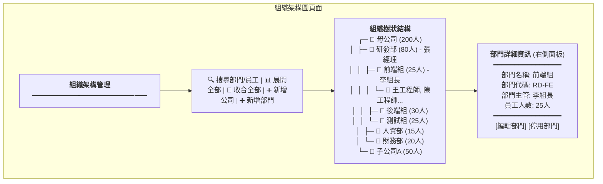

**頁面元素說明:**
- **工具列**
  - 搜尋框: 可搜尋部門名稱或員工姓名
  - 展開/收合按鈕: 控制樹狀結構展開層級
  - 新增公司按鈕: 開啟新增公司對話框
  - 新增部門按鈕: 開啟新增部門對話框

- **組織樹**
  - 樹狀結構顯示: 公司 > 部門 > 子部門 > 員工
  - 每個節點顯示: 圖示 + 名稱 + 人數 + 主管
  - 可拖曳調整部門順序
  - 點擊節點顯示詳細資訊

- **詳細資訊面板** (右側)
  - 顯示選中部門的詳細資訊
  - 編輯/停用按鈕

**元件規格:**
```typescript
interface OrganizationTreeNode {
  id: string;
  type: 'organization' | 'department' | 'employee';
  name: string;
  code?: string;
  managerId?: string;
  managerName?: string;
  employeeCount: number;
  level: number;
  children?: OrganizationTreeNode[];
}
```

#### 2.2.2 部門管理頁面 (HR02-P02)

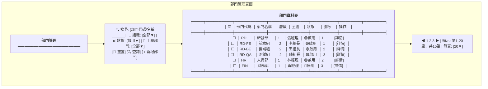

**頁面元素說明:**
- **篩選工具列**
  - 搜尋框: 支援部門代碼、部門名稱模糊搜尋
  - 組織下拉: 篩選特定組織的部門
  - 狀態下拉: 啟用/停用
  - 上層部門下拉: 篩選特定父部門的子部門
  - 新增部門按鈕: 開啟新增部門對話框

- **部門表格**
  - 批次選擇核取方塊
  - 部門代碼 (可點擊查看詳情)
  - 部門名稱 (可點擊查看詳情)
  - 層級 (1-5)
  - 主管姓名 (顯示部門主管)
  - 狀態徽章 (啟用/停用,不同顏色)
  - 排序 (displayOrder,用於控制顯示順序)
  - 操作按鈕: 詳情/編輯/指派主管/停用

- **分頁控制**
  - 頁碼切換
  - 總筆數顯示
  - 每頁筆數選擇

**元件規格:**
```typescript
interface DepartmentListItem {
  departmentId: string;
  code: string;
  name: string;
  level: number;
  sortOrder: number;
  organizationId: string;
  parentId: string | null;
  managerId: string | null;
  managerName: string | null;
  status: 'ACTIVE' | 'INACTIVE';
  statusDisplay: string;
  employeeCount: number;  // 列表查詢固定為 0,詳情查詢才載入
}

interface DepartmentQueryParams {
  code?: string;          // 部門代碼 (精確匹配)
  name?: string;          // 部門名稱 (模糊查詢)
  organizationId?: string; // 組織ID
  parentId?: string;      // 上層部門ID
  status?: 'ACTIVE' | 'INACTIVE';
  page: number;
  size: number;
  sort?: string;
}
```

**API 調用:**
- **載入部門列表**: `GET /api/v1/departments`
  - 支援分頁、篩選、排序
  - 返回 `PageResponse<DepartmentListItem>`
  
- **查詢子部門**: `GET /api/v1/departments/{id}/sub-departments`
  - 用於展開部門層級時動態載入
  - 返回直接子部門列表

**互動流程:**
1. 頁面載入時調用 `GET /api/v1/departments?page=1&size=20`
2. 使用者輸入篩選條件後點擊「查詢」,重新調用 API 並傳入篩選參數
3. 點擊「詳情」按鈕跳轉至部門詳情頁面
4. 點擊「新增部門」開啟新增對話框

#### 2.2.3 員工列表頁面 (HR02-P03)

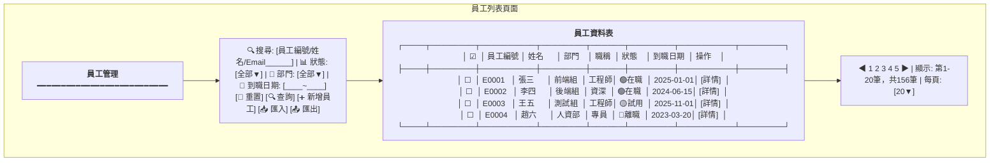

**頁面元素說明:**
- **篩選工具列**
  - 搜尋框: 支援員工編號、姓名、Email模糊搜尋
  - 狀態下拉: 全部/在職/試用/留停/離職
  - 部門下拉: 動態載入部門樹
  - 到職日期範圍選擇器
  - 新增員工按鈕: 跳轉至新增頁面
  - 匯入/匯出按鈕: Excel批次處理

- **員工表格**
  - 批次選擇核取方塊
  - 員工編號 (可點擊查看詳情)
  - 姓名 (可點擊查看詳情)
  - 部門 (顯示完整路徑: 研發部>前端組)
  - 職稱
  - 狀態徽章 (不同顏色)
  - 到職日期
  - 操作按鈕: 詳情/編輯/調動/離職

- **分頁控制**
  - 頁碼切換
  - 總筆數顯示
  - 每頁筆數選擇

**元件規格:**
```typescript
interface EmployeeListItem {
  employeeId: string;
  employeeNumber: string;
  fullName: string;
  departmentPath: string;  // "研發部 > 前端組"
  jobTitle: string;
  employmentStatus: EmploymentStatus;
  hireDate: string;
  photoUrl?: string;
}

interface EmployeeQueryParams {
  search?: string;
  status?: EmploymentStatus;
  departmentId?: string;
  hireDateFrom?: string;
  hireDateTo?: string;
  page: number;
  size: number;
}
```

#### 2.2.3 員工詳細資料頁面 (HR02-P04)

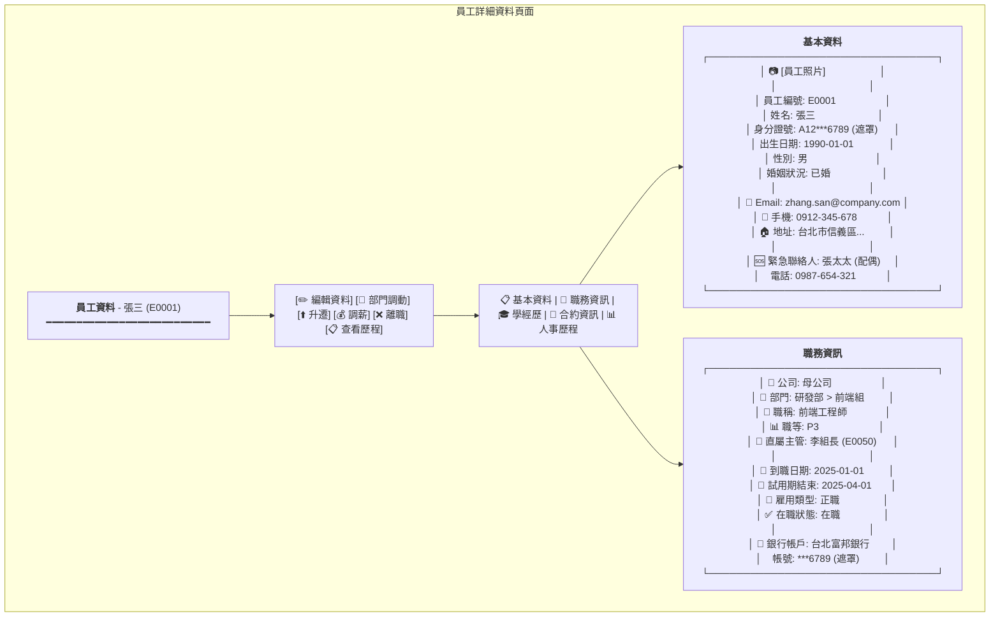

**頁面元素說明:**
- **操作按鈕列**
  - 編輯資料: 跳轉至編輯頁面
  - 部門調動: 開啟調動對話框
  - 升遷: 開啟升遷對話框
  - 調薪: 開啟調薪對話框
  - 離職: 開啟離職確認對話框
  - 查看歷程: 切換至人事歷程Tab

- **Tab頁籤**
  - 基本資料: 個人資訊、聯絡方式
  - 職務資訊: 組織關係、職務、薪資
  - 學經歷: 教育背景、工作經驗
  - 合約資訊: 勞動合約詳情
  - 人事歷程: 所有異動記錄

- **資料顯示**
  - 敏感資料遮罩 (身分證號、銀行帳號)
  - 員工照片顯示
  - 關聯資料可點擊 (如主管、部門)

**元件規格:**
```typescript
interface EmployeeDetail {
  // 基本資料
  employeeId: string;
  employeeNumber: string;
  fullName: string;
  nationalId: string;  // 後端已遮罩
  dateOfBirth: string;
  gender: Gender;
  maritalStatus: MaritalStatus;
  photoUrl?: string;

  // 聯絡方式
  companyEmail: string;
  personalEmail: string;
  mobilePhone: string;
  address: Address;
  emergencyContact: EmergencyContact;

  // 職務資訊
  organization: {
    organizationId: string;
    organizationName: string;
  };
  department: {
    departmentId: string;
    departmentPath: string;
  };
  manager?: {
    employeeId: string;
    fullName: string;
  };
  jobTitle: string;
  jobLevel: string;
  employmentType: EmploymentType;
  employmentStatus: EmploymentStatus;
  hireDate: string;
  probationEndDate?: string;

  // 銀行資訊
  bankAccount: {
    bankName: string;
    accountNumber: string;  // 後端已遮罩
  };
}
```

#### 2.2.4 員工新增/編輯表單 (HR02-P05/HR02-P06)

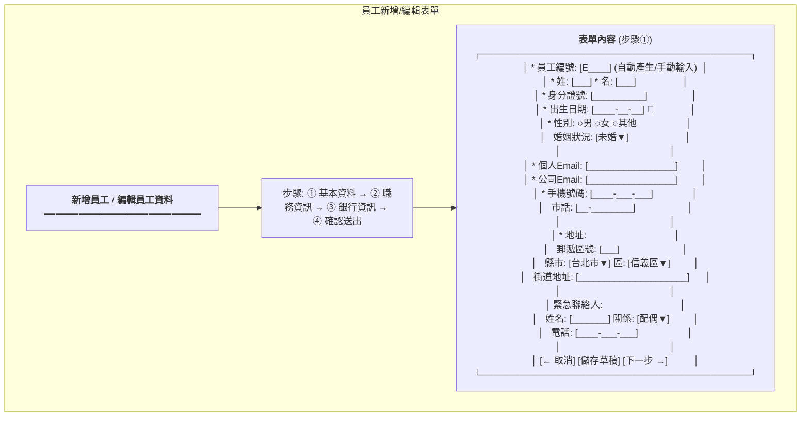

**表單步驟說明:**

**步驟①: 基本資料**
- 員工編號 (必填): 自動產生或手動輸入
- 姓名 (必填): 分姓、名兩欄
- 身分證號 (必填): 格式驗證
- 出生日期 (必填): 日期選擇器
- 性別 (必填): 單選
- 婚姻狀況: 下拉選擇
- Email (必填): 格式驗證、唯一性檢查
- 手機 (必填): 格式驗證
- 地址 (必填): 郵遞區號、縣市區、街道
- 緊急聯絡人: 姓名、關係、電話

**步驟②: 職務資訊**
```
* 公司: [母公司▼]
* 部門: [研發部 > 前端組▼] (樹狀選擇器)
* 直屬主管: [李組長▼] (搜尋選擇)
* 職稱: [前端工程師]
* 職等: [P3▼]
* 雇用類型: ○正職 ○約聘 ○兼職 ○實習
* 到職日期: [____-__-__] 📅
* 試用期: [3] 個月
```

**步驟③: 銀行資訊**
```
* 銀行: [台北富邦銀行▼]
* 分行代碼: [___]
* 帳號: [______________]
* 戶名: [張三] (自動帶入姓名)
```

**步驟④: 確認送出**
- 顯示所有填寫資料摘要
- 確認無誤後送出

**表單驗證規則:**
```typescript
interface EmployeeFormValidation {
  employeeNumber: {
    required: true;
    pattern: /^E\d{4}$/;
    unique: true;  // 後端檢查
  };
  nationalId: {
    required: true;
    pattern: /^[A-Z]\d{9}$/;
    unique: true;
  };
  companyEmail: {
    required: true;
    email: true;
    unique: true;
  };
  mobilePhone: {
    required: true;
    pattern: /^09\d{8}$/;
  };
  hireDate: {
    required: true;
    notFuture: true;  // 不可為未來日期
  };
}
```

---

## 3. UX流程設計

### 3.1 員工到職流程

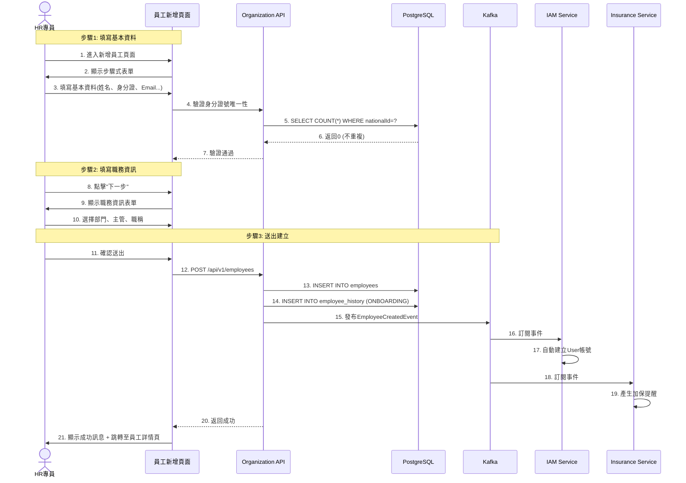

**關鍵點:**
- ✅ 步驟式表單提升使用者體驗
- ✅ 即時驗證身分證號、Email唯一性
- ✅ 自動發布EmployeeCreatedEvent
- ✅ IAM Service自動建立使用者帳號
- ✅ Insurance Service自動產生加保提醒

### 3.2 員工離職流程

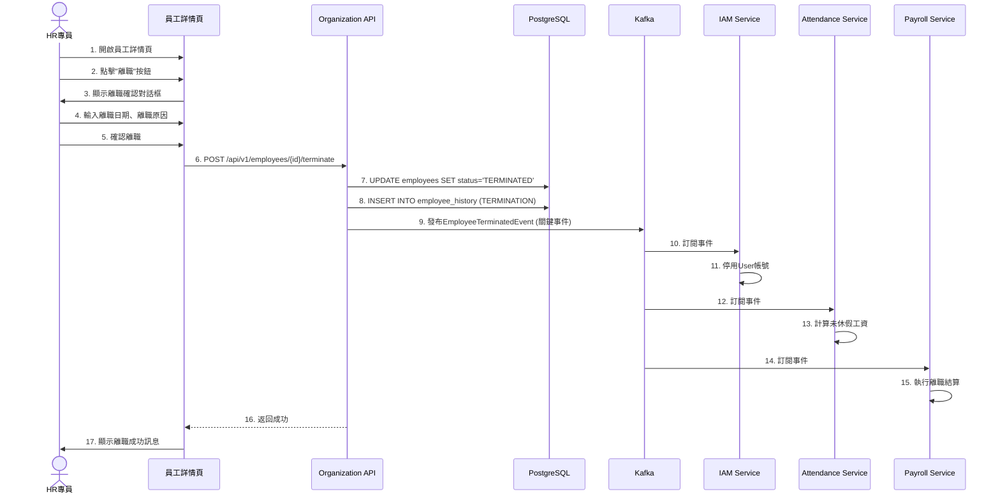

**關鍵點:**
- ✅ 離職需二次確認
- ✅ EmployeeTerminatedEvent是系統中最重要的事件之一
- ✅ 觸發多個服務的連鎖反應
- ✅ IAM停用帳號、Attendance計算未休假、Payroll執行結算

---

*（文件持續，下一部分包含畫面事件、資料庫設計、Domain設計、API規格等）*


# Continued: 02_組織員工服務系統設計書_part2.md

## 4. 畫面事件說明

### 4.1 組織架構圖頁面事件 (HR02-P01)

| 事件ID | 觸發元素 | 事件類型 | 事件處理 | 後端API |
|:---|:---|:---|:---|:---|
| `E-ORG-01` | 搜尋框 | onChange (debounce 300ms) | 過濾組織樹節點 | - (前端過濾) |
| `E-ORG-02` | 展開全部按鈕 | onClick | 展開所有樹節點 | - |
| `E-ORG-03` | 收合全部按鈕 | onClick | 收合所有樹節點 | - |
| `E-ORG-04` | 新增公司按鈕 | onClick | 開啟新增公司對話框 | - |
| `E-ORG-05` | 新增部門按鈕 | onClick | 開啟新增部門對話框 | - |
| `E-ORG-06` | 樹節點點擊 | onClick | 載入節點詳細資訊 | GET /api/v1/departments/{id} |
| `E-ORG-07` | 樹節點拖曳 | onDrop | 調整部門順序/層級 | PUT /api/v1/departments/{id}/reorder |
| `E-ORG-08` | 編輯部門按鈕 | onClick | 開啟編輯部門對話框 | - |
| `E-ORG-09` | 停用部門按鈕 | onClick | 確認對話框 → 停用部門 | PUT /api/v1/departments/{id}/deactivate |

**E-ORG-06 詳細流程:**
```typescript
const handleNodeClick = async (node: OrganizationTreeNode) => {
  if (node.type === 'department') {
    try {
      // 載入部門詳細資訊
      const response = await departmentService.getDepartmentDetail(node.id);

      // 更新右側面板
      setSelectedDepartment(response);

      // 載入部門員工列表
      const employees = await employeeService.getEmployeesByDepartment(node.id);
      setDepartmentEmployees(employees);

    } catch (error) {
      message.error('載入部門資訊失敗');
    }
  }
};
```

### 4.2 部門管理頁面事件 (HR02-P02)

| 事件ID | 觸發元素 | 事件類型 | 事件處理 | 後端API |
|:---|:---|:---|:---|:---|
| `E-DEPT-01` | 搜尋框 | onChange (debounce 500ms) | 重新查詢部門列表 | GET /api/v1/departments?code={code}&name={name} |
| `E-DEPT-02` | 組織篩選器 | onChange | 重新查詢部門列表 | GET /api/v1/departments?organizationId={id} |
| `E-DEPT-03` | 狀態篩選器 | onChange | 重新查詢部門列表 | GET /api/v1/departments?status={status} |
| `E-DEPT-04` | 上層部門篩選器 | onChange | 重新查詢部門列表 | GET /api/v1/departments?parentId={id} |
| `E-DEPT-05` | 重置按鈕 | onClick | 清空所有篩選條件 | - |
| `E-DEPT-06` | 查詢按鈕 | onClick | 執行查詢 | GET /api/v1/departments |
| `E-DEPT-07` | 新增部門按鈕 | onClick | 開啟新增部門對話框 | - |
| `E-DEPT-08` | 部門代碼點擊 | onClick | 跳轉至部門詳情頁 | - (路由跳轉) |
| `E-DEPT-09` | 部門名稱點擊 | onClick | 跳轉至部門詳情頁 | - (路由跳轉) |
| `E-DEPT-10` | 詳情按鈕 | onClick | 跳轉至部門詳情頁 | - (路由跳轉) |
| `E-DEPT-11` | 編輯按鈕 | onClick | 開啟編輯部門對話框 | - |
| `E-DEPT-12` | 指派主管按鈕 | onClick | 開啟指派主管對話框 | - |
| `E-DEPT-13` | 停用按鈕 | onClick | 確認對話框 → 停用部門 | PUT /api/v1/departments/{id}/deactivate |
| `E-DEPT-14` | 分頁切換 | onChange | 重新查詢部門列表 | GET /api/v1/departments?page={page} |
| `E-DEPT-15` | 新增部門確認 | onClick | 執行新增部門 | POST /api/v1/departments |
| `E-DEPT-16` | 編輯部門確認 | onClick | 執行更新部門 | PUT /api/v1/departments/{id} |
| `E-DEPT-17` | 指派主管確認 | onClick | 執行指派主管 | PUT /api/v1/departments/{id}/assign-manager |

**E-DEPT-01 詳細流程:**
```typescript
const handleSearch = useDebouncedCallback(async (keyword: string) => {
  try {
    setLoading(true);

    // 更新查詢參數
    const params = {
      ...queryParams,
      code: keyword,  // 可同時搜尋代碼和名稱
      name: keyword,
      page: 1  // 重置到第一頁
    };

    // 呼叫API
    const response = await departmentService.getDepartments(params);

    // 更新Redux State
    dispatch(setDepartmentList(response.data.items));
    dispatch(setTotalCount(response.data.total));

  } catch (error) {
    message.error('查詢失敗');
  } finally {
    setLoading(false);
  }
}, 500);
```

**E-DEPT-06 詳細流程:**
```typescript
const handleQuery = async () => {
  try {
    setLoading(true);

    // 組合查詢參數
    const params: DepartmentQueryParams = {
      code: filters.code,
      name: filters.name,
      organizationId: filters.organizationId,
      parentId: filters.parentId,
      status: filters.status,
      page: pagination.current,
      size: pagination.pageSize,
      sort: sorter.field ? `${sorter.field},${sorter.order}` : undefined
    };

    // 呼叫API
    const response = await departmentService.getDepartments(params);

    // 更新表格資料
    setDataSource(response.data.items);
    setPagination({
      ...pagination,
      total: response.data.total,
      totalPages: response.data.totalPages
    });

  } catch (error) {
    message.error('查詢部門列表失敗');
  } finally {
    setLoading(false);
  }
};
```

**E-DEPT-15 詳細流程:**
```typescript
const handleCreateDepartment = async (values: CreateDepartmentFormData) => {
  try {
    setSubmitting(true);

    // 呼叫API
    const response = await departmentService.createDepartment({
      organizationId: values.organizationId,
      parentDepartmentId: values.parentDepartmentId,
      departmentCode: values.code,
      departmentName: values.name,
      managerId: values.managerId,
      displayOrder: values.sortOrder
    });

    message.success('部門建立成功');

    // 關閉對話框
    setModalVisible(false);

    // 重新載入列表
    handleQuery();

  } catch (error) {
    if (error.code === 'RESOURCE_DEPT_CODE_EXISTS') {
      message.error('部門代碼已存在');
    } else {
      message.error('建立部門失敗');
    }
  } finally {
    setSubmitting(false);
  }
};
```

### 4.3 員工列表頁面事件 (HR02-P03)

| 事件ID | 觸發元素 | 事件類型 | 事件處理 | 後端API |
|:---|:---|:---|:---|:---|
| `E-EMP-01` | 搜尋框 | onChange (debounce 500ms) | 重新查詢員工列表 | GET /api/v1/employees?search={keyword} |
| `E-EMP-02` | 狀態篩選器 | onChange | 重新查詢員工列表 | GET /api/v1/employees?status={status} |
| `E-EMP-03` | 部門篩選器 | onChange | 重新查詢員工列表 | GET /api/v1/employees?departmentId={id} |
| `E-EMP-04` | 到職日期範圍 | onChange | 重新查詢員工列表 | GET /api/v1/employees?hireDateFrom=&hireDateTo= |
| `E-EMP-05` | 重置按鈕 | onClick | 清空所有篩選條件 | - |
| `E-EMP-06` | 查詢按鈕 | onClick | 執行查詢 | GET /api/v1/employees |
| `E-EMP-07` | 新增員工按鈕 | onClick | 跳轉至新增頁面 | - (路由跳轉) |
| `E-EMP-08` | 匯入按鈕 | onClick | 開啟Excel匯入對話框 | POST /api/v1/employees/import |
| `E-EMP-09` | 匯出按鈕 | onClick | 下載Excel檔案 | GET /api/v1/employees/export |
| `E-EMP-10` | 員工姓名點擊 | onClick | 跳轉至員工詳情頁 | - (路由跳轉) |
| `E-EMP-11` | 詳情按鈕 | onClick | 跳轉至員工詳情頁 | - (路由跳轉) |
| `E-EMP-12` | 分頁切換 | onChange | 重新查詢員工列表 | GET /api/v1/employees?page={page} |

**E-EMP-01 詳細流程:**
```typescript
const handleSearch = useDebouncedCallback(async (keyword: string) => {
  try {
    setLoading(true);

    // 更新查詢參數
    const params = {
      ...queryParams,
      search: keyword,
      page: 1  // 重置到第一頁
    };

    // 呼叫API
    const response = await employeeService.getEmployees(params);

    // 更新Redux State
    dispatch(setEmployeeList(response.data));
    dispatch(setTotalCount(response.total));

  } catch (error) {
    message.error('查詢失敗');
  } finally {
    setLoading(false);
  }
}, 500);
```

### 4.3 員工詳細資料頁面事件 (HR02-P04)

| 事件ID | 觸發元素 | 事件類型 | 事件處理 | 後端API |
|:---|:---|:---|:---|:---|
| `E-DETAIL-01` | 編輯資料按鈕 | onClick | 跳轉至編輯頁面 | - |
| `E-DETAIL-02` | 部門調動按鈕 | onClick | 開啟調動對話框 | - |
| `E-DETAIL-03` | 升遷按鈕 | onClick | 開啟升遷對話框 | - |
| `E-DETAIL-04` | 調薪按鈕 | onClick | 開啟調薪對話框 | - |
| `E-DETAIL-05` | 離職按鈕 | onClick | 開啟離職確認對話框 | - |
| `E-DETAIL-06` | 查看歷程按鈕 | onClick | 切換至人事歷程Tab | - |
| `E-DETAIL-07` | Tab切換 | onChange | 載入對應Tab資料 | GET /api/v1/employees/{id}/educations 等 |
| `E-DETAIL-08` | 調動確認 | onClick | 執行部門調動 | POST /api/v1/employees/{id}/transfer |
| `E-DETAIL-09` | 升遷確認 | onClick | 執行升遷 | POST /api/v1/employees/{id}/promote |
| `E-DETAIL-10` | 調薪確認 | onClick | 執行調薪 | POST /api/v1/employees/{id}/adjust-salary |
| `E-DETAIL-11` | 離職確認 | onClick | 執行離職 | POST /api/v1/employees/{id}/terminate |

**E-DETAIL-08 詳細流程:**
```typescript
const handleTransfer = async (values: TransferFormData) => {
  try {
    // 1. 顯示確認對話框
    Modal.confirm({
      title: '確認部門調動',
      content: `確定要將 ${employee.fullName} 從 ${employee.department.name} 調動至 ${values.newDepartmentName} 嗎？`,
      onOk: async () => {
        // 2. 呼叫調動API
        await employeeService.transferEmployee(employeeId, {
          newDepartmentId: values.newDepartmentId,
          newManagerId: values.newManagerId,
          effectiveDate: values.effectiveDate,
          reason: values.reason
        });

        // 3. 顯示成功訊息
        message.success('部門調動成功');

        // 4. 重新載入員工資料
        await fetchEmployeeDetail();

        // 5. 關閉對話框
        setTransferModalVisible(false);
      }
    });
  } catch (error) {
    message.error('調動失敗: ' + error.message);
  }
};
```

### 4.4 員工新增/編輯表單事件 (HR02-P05/HR02-P06)

| 事件ID | 觸發元素 | 事件類型 | 事件處理 | 後端API |
|:---|:---|:---|:---|:---|
| `E-FORM-01` | 員工編號輸入 | onBlur | 檢查編號唯一性 | GET /api/v1/employees/check-number?number={number} |
| `E-FORM-02` | 身分證號輸入 | onBlur | 檢查身分證號唯一性 | GET /api/v1/employees/check-national-id?id={id} |
| `E-FORM-03` | 公司Email輸入 | onBlur | 檢查Email唯一性 | GET /api/v1/employees/check-email?email={email} |
| `E-FORM-04` | 部門選擇器 | onChange | 載入該部門的主管列表 | GET /api/v1/departments/{id}/managers |
| `E-FORM-05` | 下一步按鈕 | onClick | 驗證當前步驟 → 進入下一步 | - |
| `E-FORM-06` | 上一步按鈕 | onClick | 返回上一步 | - |
| `E-FORM-07` | 儲存草稿按鈕 | onClick | 儲存表單至LocalStorage | - |
| `E-FORM-08` | 取消按鈕 | onClick | 確認對話框 → 返回列表頁 | - |
| `E-FORM-09` | 送出按鈕 | onClick | 驗證所有步驟 → 建立員工 | POST /api/v1/employees |

**E-FORM-09 詳細流程:**
```typescript
const handleSubmit = async () => {
  try {
    // 1. 驗證所有步驟的表單
    await Promise.all([
      basicInfoForm.validateFields(),
      jobInfoForm.validateFields(),
      bankInfoForm.validateFields()
    ]);

    // 2. 組合完整資料
    const employeeData = {
      ...basicInfoForm.getFieldsValue(),
      ...jobInfoForm.getFieldsValue(),
      ...bankInfoForm.getFieldsValue()
    };

    // 3. 呼叫建立API
    setSubmitting(true);
    const response = await employeeService.createEmployee(employeeData);

    // 4. 顯示成功訊息
    message.success('員工建立成功');

    // 5. 清除草稿
    localStorage.removeItem('employee_draft');

    // 6. 跳轉至員工詳情頁
    navigate(`/admin/employees/${response.employeeId}`);

  } catch (error) {
    if (error.name === 'ValidationError') {
      message.error('請檢查表單欄位');
    } else {
      message.error('建立失敗: ' + error.message);
    }
  } finally {
    setSubmitting(false);
  }
};
```

---

## 5. Data Flow設計

### 5.1 前端狀態管理 (Redux)

#### 5.1.1 State結構

```typescript
interface OrganizationState {
  // 組織架構
  organizations: {
    list: Organization[];
    tree: OrganizationTreeNode[];
    selectedNode: OrganizationTreeNode | null;
    loading: boolean;
  };

  // 部門管理
  departments: {
    list: Department[];
    currentDepartment: DepartmentDetail | null;
    loading: boolean;
  };

  // 員工管理
  employees: {
    list: Employee[];
    total: number;
    currentPage: number;
    pageSize: number;
    filters: EmployeeQueryParams;
    selectedEmployee: EmployeeDetail | null;
    loading: boolean;
  };

  // 員工歷程
  employeeHistory: {
    records: EmployeeHistoryRecord[];
    loading: boolean;
  };

  // 合約管理
  contracts: {
    list: EmployeeContract[];
    expiringContracts: EmployeeContract[];
    loading: boolean;
  };
}
```

#### 5.1.2 Redux Actions

```typescript
// 組織架構Actions
export const organizationActions = {
  fetchOrganizationTree: createAsyncThunk(
    'organization/fetchTree',
    async (organizationId: string) => {
      const response = await organizationService.getOrganizationTree(organizationId);
      return response;
    }
  ),

  createDepartment: createAsyncThunk(
    'organization/createDepartment',
    async (data: CreateDepartmentRequest) => {
      const response = await departmentService.createDepartment(data);
      return response;
    }
  ),
};

// 員工管理Actions
export const employeeActions = {
  fetchEmployees: createAsyncThunk(
    'employees/fetchList',
    async (params: EmployeeQueryParams) => {
      const response = await employeeService.getEmployees(params);
      return response;
    }
  ),

  createEmployee: createAsyncThunk(
    'employees/create',
    async (data: CreateEmployeeRequest) => {
      const response = await employeeService.createEmployee(data);
      return response;
    }
  ),

  transferEmployee: createAsyncThunk(
    'employees/transfer',
    async ({employeeId, data}: {employeeId: string, data: TransferRequest}) => {
      const response = await employeeService.transferEmployee(employeeId, data);
      return response;
    }
  ),

  terminateEmployee: createAsyncThunk(
    'employees/terminate',
    async ({employeeId, data}: {employeeId: string, data: TerminateRequest}) => {
      await employeeService.terminateEmployee(employeeId, data);
      return employeeId;
    }
  ),
};
```

### 5.2 前後端資料流

#### 5.2.1 員工查詢流程

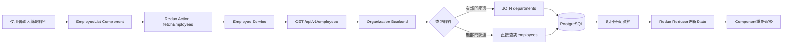

#### 5.2.2 員工建立資料流

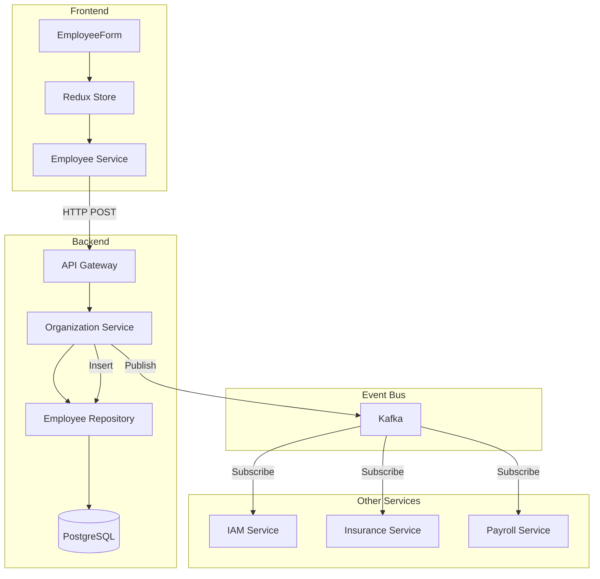

### 5.3 服務間資料流

#### 5.3.1 員工到職事件流

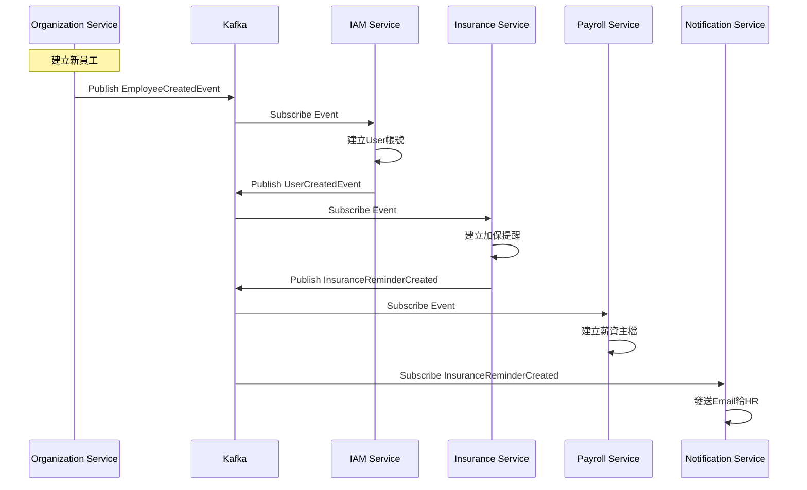

#### 5.3.2 員工離職事件流

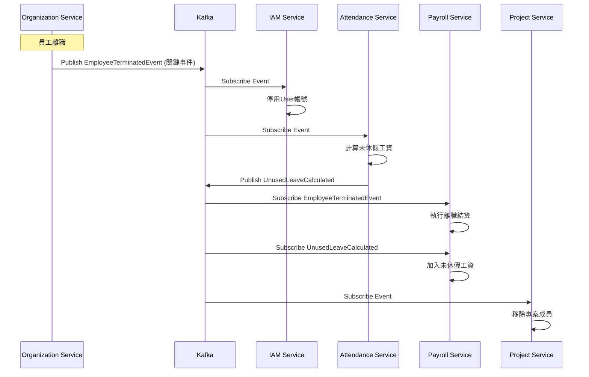

---

*（文件持續，下一部分包含資料庫設計、Domain設計、API規格等）*


# Continued: 02_組織員工服務系統設計書_part3.md

## 6. 資料庫設計

### 6.1 ER Diagram

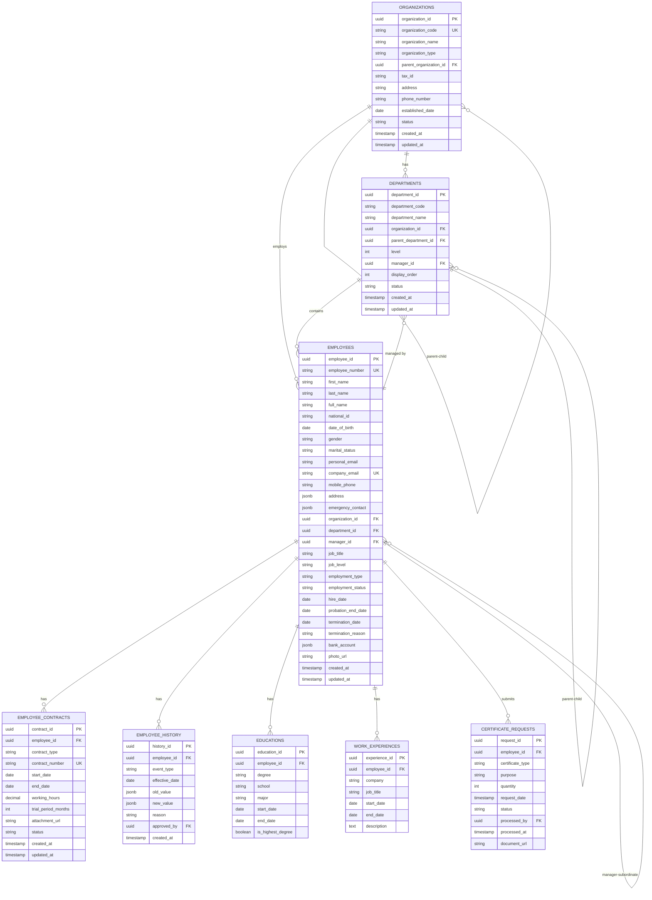

### 6.2 表結構定義 (DDL)

#### 6.2.1 organizations (組織/公司表)

```sql
CREATE TABLE organizations (
    organization_id UUID PRIMARY KEY DEFAULT gen_random_uuid(),
    organization_code VARCHAR(50) UNIQUE NOT NULL,
    organization_name VARCHAR(255) NOT NULL,
    organization_type VARCHAR(20) NOT NULL,
    parent_organization_id UUID REFERENCES organizations(organization_id),
    tax_id VARCHAR(20),
    address TEXT,
    phone_number VARCHAR(50),
    established_date DATE,
    status VARCHAR(20) DEFAULT 'ACTIVE',
    created_at TIMESTAMP DEFAULT CURRENT_TIMESTAMP,
    updated_at TIMESTAMP DEFAULT CURRENT_TIMESTAMP,

    CONSTRAINT chk_org_type CHECK (organization_type IN ('PARENT', 'SUBSIDIARY')),
    CONSTRAINT chk_org_status CHECK (status IN ('ACTIVE', 'INACTIVE'))
);

CREATE INDEX idx_organizations_parent_id ON organizations(parent_organization_id);
CREATE INDEX idx_organizations_status ON organizations(status);

COMMENT ON TABLE organizations IS '組織/公司表';
COMMENT ON COLUMN organizations.organization_code IS '公司代號 (唯一)';
COMMENT ON COLUMN organizations.organization_type IS '組織類型: PARENT(母公司)/SUBSIDIARY(子公司)';
COMMENT ON COLUMN organizations.tax_id IS '統一編號';
```

#### 6.2.2 departments (部門表)

```sql
CREATE TABLE departments (
    department_id UUID PRIMARY KEY DEFAULT gen_random_uuid(),
    department_code VARCHAR(50) NOT NULL,
    department_name VARCHAR(255) NOT NULL,
    organization_id UUID NOT NULL REFERENCES organizations(organization_id),
    parent_department_id UUID REFERENCES departments(department_id),
    level INTEGER NOT NULL DEFAULT 1,
    manager_id UUID REFERENCES employees(employee_id),
    display_order INTEGER DEFAULT 0,
    status VARCHAR(20) DEFAULT 'ACTIVE',
    created_at TIMESTAMP DEFAULT CURRENT_TIMESTAMP,
    updated_at TIMESTAMP DEFAULT CURRENT_TIMESTAMP,

    UNIQUE(department_code, organization_id),
    CONSTRAINT chk_dept_status CHECK (status IN ('ACTIVE', 'INACTIVE')),
    CONSTRAINT chk_dept_level CHECK (level >= 1 AND level <= 5)
);

CREATE INDEX idx_departments_org_id ON departments(organization_id);
CREATE INDEX idx_departments_parent_id ON departments(parent_department_id);
CREATE INDEX idx_departments_manager_id ON departments(manager_id);
CREATE INDEX idx_departments_status ON departments(status);

COMMENT ON TABLE departments IS '部門表 (支援最多5層)';
COMMENT ON COLUMN departments.level IS '部門層級 (1-5)';
COMMENT ON COLUMN departments.display_order IS '顯示順序';
```

#### 6.2.3 employees (員工表) - 核心表

```sql
CREATE TABLE employees (
    employee_id UUID PRIMARY KEY DEFAULT gen_random_uuid(),
    employee_number VARCHAR(50) UNIQUE NOT NULL,

    -- 基本資料
    first_name VARCHAR(100) NOT NULL,
    last_name VARCHAR(100) NOT NULL,
    full_name VARCHAR(255) NOT NULL,
    national_id VARCHAR(255) NOT NULL,  -- 加密欄位
    date_of_birth DATE NOT NULL,
    gender VARCHAR(10) NOT NULL,
    marital_status VARCHAR(20),

    -- 聯絡方式
    personal_email VARCHAR(255),
    company_email VARCHAR(255) UNIQUE NOT NULL,
    mobile_phone VARCHAR(50),
    home_phone VARCHAR(50),

    -- 地址 (JSON)
    address JSONB,

    -- 緊急聯絡人 (JSON)
    emergency_contact JSONB,

    -- 組織關係
    organization_id UUID NOT NULL REFERENCES organizations(organization_id),
    department_id UUID NOT NULL REFERENCES departments(department_id),
    manager_id UUID REFERENCES employees(employee_id),

    -- 職務資訊
    job_title VARCHAR(255),
    job_level VARCHAR(50),
    employment_type VARCHAR(20) NOT NULL,
    employment_status VARCHAR(20) NOT NULL DEFAULT 'PROBATION',

    -- 到離職資訊
    hire_date DATE NOT NULL,
    probation_end_date DATE,
    termination_date DATE,
    termination_reason TEXT,

    -- 銀行資訊 (JSON, 加密)
    bank_account JSONB,

    -- 照片
    photo_url VARCHAR(500),

    -- 審計
    created_at TIMESTAMP DEFAULT CURRENT_TIMESTAMP,
    updated_at TIMESTAMP DEFAULT CURRENT_TIMESTAMP,

    CONSTRAINT chk_gender CHECK (gender IN ('MALE', 'FEMALE', 'OTHER')),
    CONSTRAINT chk_marital_status CHECK (marital_status IN ('SINGLE', 'MARRIED', 'DIVORCED', 'WIDOWED')),
    CONSTRAINT chk_employment_type CHECK (employment_type IN ('FULL_TIME', 'CONTRACT', 'PART_TIME', 'INTERN')),
    CONSTRAINT chk_employment_status CHECK (employment_status IN ('PROBATION', 'ACTIVE', 'PARENTAL_LEAVE', 'UNPAID_LEAVE', 'TERMINATED')),
    CONSTRAINT chk_termination_date CHECK (termination_date IS NULL OR termination_date >= hire_date)
);

-- 索引
CREATE INDEX idx_employees_employee_number ON employees(employee_number);
CREATE INDEX idx_employees_company_email ON employees(company_email);
CREATE INDEX idx_employees_national_id ON employees(national_id);  -- 加密欄位索引
CREATE INDEX idx_employees_organization_id ON employees(organization_id);
CREATE INDEX idx_employees_department_id ON employees(department_id);
CREATE INDEX idx_employees_manager_id ON employees(manager_id);
CREATE INDEX idx_employees_employment_status ON employees(employment_status);
CREATE INDEX idx_employees_hire_date ON employees(hire_date);
CREATE INDEX idx_employees_full_name ON employees(full_name);

-- 全文搜尋索引
CREATE INDEX idx_employees_fulltext ON employees USING gin(to_tsvector('simple', full_name || ' ' || employee_number || ' ' || company_email));

-- 註解
COMMENT ON TABLE employees IS '員工主檔表';
COMMENT ON COLUMN employees.national_id IS '身分證號 (加密儲存)';
COMMENT ON COLUMN employees.address IS 'JSON格式: {postalCode, city, district, street}';
COMMENT ON COLUMN employees.emergency_contact IS 'JSON格式: {name, relationship, phoneNumber}';
COMMENT ON COLUMN employees.bank_account IS 'JSON格式: {bankCode, bankName, accountNumber(加密)}';
COMMENT ON COLUMN employees.employment_status IS 'PROBATION(試用)/ACTIVE(在職)/PARENTAL_LEAVE(育嬰留停)/UNPAID_LEAVE(留職停薪)/TERMINATED(離職)';
```

#### 6.2.4 employee_contracts (員工合約表)

```sql
CREATE TABLE employee_contracts (
    contract_id UUID PRIMARY KEY DEFAULT gen_random_uuid(),
    employee_id UUID NOT NULL REFERENCES employees(employee_id) ON DELETE CASCADE,
    contract_type VARCHAR(20) NOT NULL,
    contract_number VARCHAR(100) UNIQUE NOT NULL,
    start_date DATE NOT NULL,
    end_date DATE,  -- NULL表示不定期契約
    working_hours DECIMAL(5,2) NOT NULL DEFAULT 40,
    trial_period_months INTEGER DEFAULT 0,
    attachment_url VARCHAR(500),
    status VARCHAR(20) DEFAULT 'ACTIVE',
    created_at TIMESTAMP DEFAULT CURRENT_TIMESTAMP,
    updated_at TIMESTAMP DEFAULT CURRENT_TIMESTAMP,

    CONSTRAINT chk_contract_type CHECK (contract_type IN ('INDEFINITE', 'FIXED_TERM')),
    CONSTRAINT chk_contract_status CHECK (status IN ('ACTIVE', 'EXPIRED', 'TERMINATED')),
    CONSTRAINT chk_end_date CHECK (end_date IS NULL OR end_date > start_date)
);

CREATE INDEX idx_contracts_employee_id ON employee_contracts(employee_id);
CREATE INDEX idx_contracts_status ON employee_contracts(status);
CREATE INDEX idx_contracts_end_date ON employee_contracts(end_date);

COMMENT ON TABLE employee_contracts IS '員工合約表';
COMMENT ON COLUMN employee_contracts.contract_type IS 'INDEFINITE(不定期)/FIXED_TERM(定期)';
COMMENT ON COLUMN employee_contracts.working_hours IS '每週工時';
```

#### 6.2.5 employee_history (員工人事歷程表)

```sql
CREATE TABLE employee_history (
    history_id UUID PRIMARY KEY DEFAULT gen_random_uuid(),
    employee_id UUID NOT NULL REFERENCES employees(employee_id) ON DELETE CASCADE,
    event_type VARCHAR(50) NOT NULL,
    effective_date DATE NOT NULL,
    old_value JSONB,
    new_value JSONB,
    reason TEXT,
    approved_by UUID REFERENCES employees(employee_id),
    created_at TIMESTAMP DEFAULT CURRENT_TIMESTAMP,

    CONSTRAINT chk_event_type CHECK (event_type IN (
        'ONBOARDING', 'PROBATION_PASSED', 'DEPARTMENT_TRANSFER',
        'JOB_CHANGE', 'PROMOTION', 'SALARY_ADJUSTMENT',
        'TERMINATION', 'REHIRE'
    ))
);

CREATE INDEX idx_history_employee_id ON employee_history(employee_id);
CREATE INDEX idx_history_event_type ON employee_history(event_type);
CREATE INDEX idx_history_effective_date ON employee_history(effective_date);

COMMENT ON TABLE employee_history IS '員工人事歷程記錄表';
COMMENT ON COLUMN employee_history.old_value IS '變更前資料 (JSON格式)';
COMMENT ON COLUMN employee_history.new_value IS '變更後資料 (JSON格式)';
```

#### 6.2.6 educations (學歷表)

```sql
CREATE TABLE educations (
    education_id UUID PRIMARY KEY DEFAULT gen_random_uuid(),
    employee_id UUID NOT NULL REFERENCES employees(employee_id) ON DELETE CASCADE,
    degree VARCHAR(50) NOT NULL,
    school VARCHAR(255) NOT NULL,
    major VARCHAR(255),
    start_date DATE,
    end_date DATE,
    is_highest_degree BOOLEAN DEFAULT FALSE,

    CONSTRAINT chk_degree CHECK (degree IN ('高中', '專科', '學士', '碩士', '博士'))
);

CREATE INDEX idx_educations_employee_id ON educations(employee_id);

COMMENT ON TABLE educations IS '員工學歷表';
```

#### 6.2.7 work_experiences (工作經歷表)

```sql
CREATE TABLE work_experiences (
    experience_id UUID PRIMARY KEY DEFAULT gen_random_uuid(),
    employee_id UUID NOT NULL REFERENCES employees(employee_id) ON DELETE CASCADE,
    company VARCHAR(255) NOT NULL,
    job_title VARCHAR(255) NOT NULL,
    start_date DATE NOT NULL,
    end_date DATE,  -- NULL表示目前在職
    description TEXT
);

CREATE INDEX idx_work_experiences_employee_id ON work_experiences(employee_id);

COMMENT ON TABLE work_experiences IS '員工工作經歷表';
```

#### 6.2.8 certificate_requests (證明文件申請表)

```sql
CREATE TABLE certificate_requests (
    request_id UUID PRIMARY KEY DEFAULT gen_random_uuid(),
    employee_id UUID NOT NULL REFERENCES employees(employee_id) ON DELETE CASCADE,
    certificate_type VARCHAR(50) NOT NULL,
    purpose VARCHAR(500),
    quantity INTEGER DEFAULT 1,
    request_date TIMESTAMP DEFAULT CURRENT_TIMESTAMP,
    status VARCHAR(20) DEFAULT 'PENDING',
    processed_by UUID REFERENCES employees(employee_id),
    processed_at TIMESTAMP,
    document_url VARCHAR(500),

    CONSTRAINT chk_certificate_type CHECK (certificate_type IN (
        'EMPLOYMENT_CERTIFICATE', 'SALARY_CERTIFICATE', 'TAX_WITHHOLDING'
    )),
    CONSTRAINT chk_request_status CHECK (status IN ('PENDING', 'APPROVED', 'REJECTED', 'COMPLETED'))
);

CREATE INDEX idx_certificate_requests_employee_id ON certificate_requests(employee_id);
CREATE INDEX idx_certificate_requests_status ON certificate_requests(status);
CREATE INDEX idx_certificate_requests_request_date ON certificate_requests(request_date);

COMMENT ON TABLE certificate_requests IS '員工證明文件申請表';
COMMENT ON COLUMN certificate_requests.certificate_type IS 'EMPLOYMENT_CERTIFICATE(在職證明)/SALARY_CERTIFICATE(薪資證明)/TAX_WITHHOLDING(扣繳憑單)';
```

### 6.3 資料字典

| 表名 | 說明 | 預估資料量 | 成長速度 | 保留策略 |
|:---|:---|:---:|:---|:---|
| `organizations` | 組織/公司 | 10 | 年增2-3筆 | 永久保留 |
| `departments` | 部門 | 100 | 年增10-20筆 | 永久保留 |
| `employees` | 員工主檔 | 200 | 年增50筆 | 永久保留 |
| `employee_contracts` | 員工合約 | 250 | 年增60筆 | 永久保留 |
| `employee_history` | 人事歷程 | 1,000 | 年增500筆 | 永久保留 |
| `educations` | 學歷 | 400 | 年增100筆 | 永久保留 |
| `work_experiences` | 工作經歷 | 600 | 年增150筆 | 永久保留 |
| `certificate_requests` | 證明文件申請 | 500 | 月增50筆 | 保留3年 |

### 6.4 資料加密策略

**敏感欄位加密:**
- `employees.national_id`: AES-256加密
- `employees.bank_account.accountNumber`: AES-256加密

**加密實作 (Application Level):**
```java
@Component
public class EncryptionService {

    @Value("${encryption.secret-key}")
    private String secretKey;

    public String encrypt(String plainText) {
        // AES-256 加密
        Cipher cipher = Cipher.getInstance("AES/GCM/NoPadding");
        // ... 加密邏輯
        return Base64.getEncoder().encodeToString(encrypted);
    }

    public String decrypt(String encryptedText) {
        // AES-256 解密
        byte[] decoded = Base64.getDecoder().decode(encryptedText);
        // ... 解密邏輯
        return new String(decrypted);
    }
}
```

---

## 7. Domain設計

### 7.1 聚合根 (Aggregate Root)

#### 7.1.1 Organization聚合根

**職責:** 代表一個法人公司（母公司或子公司）

**Java實作:**
```java
@Entity
@Table(name = "organizations")
public class Organization {
    @EmbeddedId
    private OrganizationId id;

    @Column(name = "organization_code", unique = true, nullable = false)
    private String organizationCode;

    @Column(name = "organization_name", nullable = false)
    private String organizationName;

    @Enumerated(EnumType.STRING)
    @Column(name = "organization_type", nullable = false)
    private OrganizationType organizationType;

    @Column(name = "parent_organization_id")
    private UUID parentOrganizationId;

    @Column(name = "tax_id")
    private String taxId;

    @Column(name = "address")
    private String address;

    @Enumerated(EnumType.STRING)
    private OrganizationStatus status;

    // Domain行為
    public void deactivate() {
        if (hasActiveEmployees()) {
            throw new DomainException("無法停用有在職員工的公司");
        }
        this.status = OrganizationStatus.INACTIVE;
    }

    private boolean hasActiveEmployees() {
        // 由Repository查詢
        return false;  // 實際實作需注入Repository
    }
}

enum OrganizationType {
    PARENT,      // 母公司
    SUBSIDIARY   // 子公司
}

enum OrganizationStatus {
    ACTIVE,
    INACTIVE
}
```

#### 7.1.2 Department聚合根

**職責:** 代表組織內的部門，支援多層級結構

**Java實作:**
```java
@Entity
@Table(name = "departments")
public class Department {
    @EmbeddedId
    private DepartmentId id;

    @Column(name = "department_code", nullable = false)
    private String departmentCode;

    @Column(name = "department_name", nullable = false)
    private String departmentName;

    @Column(name = "organization_id", nullable = false)
    private UUID organizationId;

    @Column(name = "parent_department_id")
    private UUID parentDepartmentId;

    @Column(name = "level", nullable = false)
    private Integer level;

    @Column(name = "manager_id")
    private UUID managerId;

    @Column(name = "display_order")
    private Integer displayOrder;

    @Enumerated(EnumType.STRING)
    private DepartmentStatus status;

    // Domain行為
    public void addSubDepartment(Department subDepartment) {
        if (this.level >= 5) {
            throw new DomainException("部門層級不可超過5層");
        }

        subDepartment.setParentDepartmentId(this.id.getValue());
        subDepartment.setLevel(this.level + 1);
        subDepartment.setOrganizationId(this.organizationId);
    }

    public void assignManager(UUID employeeId) {
        // 驗證員工是否屬於此部門
        this.managerId = employeeId;
    }

    public void deactivate() {
        if (hasActiveSubDepartments()) {
            throw new DomainException("無法停用有啟用中子部門的部門");
        }
        if (hasActiveEmployees()) {
            throw new DomainException("無法停用有在職員工的部門");
        }
        this.status = DepartmentStatus.INACTIVE;
    }

    private boolean hasActiveSubDepartments() {
        // 由Repository查詢
        return false;
    }

    private boolean hasActiveEmployees() {
        // 由Repository查詢
        return false;
    }
}
```

---

*（文件持續，下一部分包含Employee聚合根、值對象、領域事件、完整API規格等）*


# Continued: 02_組織員工服務系統設計書_part4.md

#### 7.1.3 Employee聚合根 (核心聚合根)

**職責:** 員工主檔，包含完整的個人資料與人事歷程管理

**Java實作:**
```java
@Entity
@Table(name = "employees")
public class Employee {
    @EmbeddedId
    private EmployeeId id;

    @Column(name = "employee_number", unique = true, nullable = false)
    private String employeeNumber;

    // 基本資料
    @Column(name = "first_name", nullable = false)
    private String firstName;

    @Column(name = "last_name", nullable = false)
    private String lastName;

    @Column(name = "full_name", nullable = false)
    private String fullName;

    @Embedded
    private NationalId nationalId;  // 值對象，加密處理

    @Column(name = "date_of_birth", nullable = false)
    private LocalDate dateOfBirth;

    @Enumerated(EnumType.STRING)
    private Gender gender;

    @Enumerated(EnumType.STRING)
    private MaritalStatus maritalStatus;

    // 聯絡方式
    @Embedded
    private Email companyEmail;

    @Column(name = "personal_email")
    private String personalEmail;

    @Column(name = "mobile_phone")
    private String mobilePhone;

    @Embedded
    private Address address;

    @Embedded
    private EmergencyContact emergencyContact;

    // 組織關係
    @Column(name = "organization_id", nullable = false)
    private UUID organizationId;

    @Column(name = "department_id", nullable = false)
    private UUID departmentId;

    @Column(name = "manager_id")
    private UUID managerId;

    // 職務資訊
    @Column(name = "job_title")
    private String jobTitle;

    @Column(name = "job_level")
    private String jobLevel;

    @Enumerated(EnumType.STRING)
    @Column(name = "employment_type", nullable = false)
    private EmploymentType employmentType;

    @Enumerated(EnumType.STRING)
    @Column(name = "employment_status", nullable = false)
    private EmploymentStatus employmentStatus;

    // 到離職資訊
    @Column(name = "hire_date", nullable = false)
    private LocalDate hireDate;

    @Column(name = "probation_end_date")
    private LocalDate probationEndDate;

    @Column(name = "termination_date")
    private LocalDate terminationDate;

    @Column(name = "termination_reason")
    private String terminationReason;

    // 銀行資訊
    @Embedded
    private BankAccount bankAccount;

    // ========== Domain行為 ==========

    /**
     * 到職 - 建立新員工
     */
    public static Employee onboard(CreateEmployeeCommand command) {
        Employee employee = new Employee();
        employee.id = EmployeeId.generate();
        employee.employeeNumber = command.getEmployeeNumber();
        employee.firstName = command.getFirstName();
        employee.lastName = command.getLastName();
        employee.fullName = command.getLastName() + command.getFirstName();
        employee.nationalId = new NationalId(command.getNationalId());
        employee.dateOfBirth = command.getDateOfBirth();
        employee.gender = command.getGender();
        employee.companyEmail = new Email(command.getCompanyEmail());
        employee.organizationId = command.getOrganizationId();
        employee.departmentId = command.getDepartmentId();
        employee.managerId = command.getManagerId();
        employee.jobTitle = command.getJobTitle();
        employee.jobLevel = command.getJobLevel();
        employee.employmentType = command.getEmploymentType();
        employee.employmentStatus = EmploymentStatus.PROBATION;
        employee.hireDate = command.getHireDate();
        employee.probationEndDate = command.getHireDate().plusMonths(command.getProbationMonths());
        employee.bankAccount = command.getBankAccount();

        // 發布領域事件
        DomainEventPublisher.publish(new EmployeeCreatedEvent(
            employee.id.getValue(),
            employee.employeeNumber,
            employee.companyEmail.getValue(),
            employee.organizationId,
            employee.departmentId,
            employee.hireDate
        ));

        return employee;
    }

    /**
     * 試用期轉正
     */
    public void completeProbation() {
        if (this.employmentStatus != EmploymentStatus.PROBATION) {
            throw new DomainException("只有試用期員工可以轉正");
        }

        this.employmentStatus = EmploymentStatus.ACTIVE;

        DomainEventPublisher.publish(new EmployeeProbationPassedEvent(
            this.id.getValue(),
            LocalDate.now()
        ));
    }

    /**
     * 部門調動
     */
    public void transferDepartment(UUID newDepartmentId, UUID newManagerId,
                                   LocalDate effectiveDate, String reason) {
        UUID oldDepartmentId = this.departmentId;

        this.departmentId = newDepartmentId;
        this.managerId = newManagerId;

        DomainEventPublisher.publish(new EmployeeDepartmentChangedEvent(
            this.id.getValue(),
            oldDepartmentId,
            newDepartmentId,
            effectiveDate,
            reason
        ));
    }

    /**
     * 升遷
     */
    public void promote(String newJobTitle, String newJobLevel,
                        LocalDate effectiveDate, String reason) {
        String oldJobTitle = this.jobTitle;
        String oldJobLevel = this.jobLevel;

        this.jobTitle = newJobTitle;
        this.jobLevel = newJobLevel;

        DomainEventPublisher.publish(new EmployeePromotedEvent(
            this.id.getValue(),
            oldJobTitle,
            newJobTitle,
            oldJobLevel,
            newJobLevel,
            effectiveDate,
            reason
        ));
    }

    /**
     * 離職
     */
    public void terminate(LocalDate terminationDate, String reason) {
        if (this.employmentStatus == EmploymentStatus.TERMINATED) {
            throw new DomainException("員工已離職");
        }

        if (terminationDate.isBefore(this.hireDate)) {
            throw new DomainException("離職日期不可早於到職日期");
        }

        this.employmentStatus = EmploymentStatus.TERMINATED;
        this.terminationDate = terminationDate;
        this.terminationReason = reason;

        // 發布關鍵事件
        DomainEventPublisher.publish(new EmployeeTerminatedEvent(
            this.id.getValue(),
            this.employeeNumber,
            terminationDate,
            reason
        ));
    }

    /**
     * 更新個人資料
     */
    public void updatePersonalInfo(UpdatePersonalInfoCommand command) {
        if (command.getMobilePhone() != null) {
            this.mobilePhone = command.getMobilePhone();
        }
        if (command.getAddress() != null) {
            this.address = command.getAddress();
        }
        if (command.getEmergencyContact() != null) {
            this.emergencyContact = command.getEmergencyContact();
        }
    }

    /**
     * 是否在職
     */
    public boolean isActive() {
        return this.employmentStatus == EmploymentStatus.ACTIVE ||
               this.employmentStatus == EmploymentStatus.PROBATION;
    }
}
```

**不變性規則 (Invariants):**
- ✅ employeeNumber必須唯一且不可變更
- ✅ companyEmail必須唯一
- ✅ nationalId必須加密儲存
- ✅ 離職日期不可早於到職日期
- ✅ 試用期結束日必須晚於到職日
- ✅ 只有試用期員工可以轉正

#### 7.1.4 EmployeeContract聚合根

**職責:** 管理員工的勞動合約

**Java實作:**
```java
@Entity
@Table(name = "employee_contracts")
public class EmployeeContract {
    @EmbeddedId
    private ContractId id;

    @Column(name = "employee_id", nullable = false)
    private UUID employeeId;

    @Enumerated(EnumType.STRING)
    @Column(name = "contract_type", nullable = false)
    private ContractType contractType;

    @Column(name = "contract_number", unique = true, nullable = false)
    private String contractNumber;

    @Column(name = "start_date", nullable = false)
    private LocalDate startDate;

    @Column(name = "end_date")
    private LocalDate endDate;  // NULL表示不定期契約

    @Column(name = "working_hours", nullable = false)
    private BigDecimal workingHours;

    @Column(name = "trial_period_months")
    private Integer trialPeriodMonths;

    @Column(name = "attachment_url")
    private String attachmentUrl;

    @Enumerated(EnumType.STRING)
    private ContractStatus status;

    // ========== Domain行為 ==========

    /**
     * 續約
     */
    public void renew(LocalDate newEndDate) {
        if (this.contractType == ContractType.INDEFINITE) {
            throw new DomainException("不定期契約無需續約");
        }

        if (newEndDate.isBefore(this.endDate)) {
            throw new DomainException("新合約結束日必須晚於現有結束日");
        }

        this.endDate = newEndDate;
        this.status = ContractStatus.ACTIVE;

        DomainEventPublisher.publish(new ContractRenewedEvent(
            this.id.getValue(),
            this.employeeId,
            newEndDate
        ));
    }

    /**
     * 終止合約
     */
    public void terminate(LocalDate terminationDate) {
        this.status = ContractStatus.TERMINATED;
        this.endDate = terminationDate;
    }

    /**
     * 檢查是否即將到期
     */
    public boolean isExpiringSoon(int daysBeforeExpiry) {
        if (this.endDate == null) return false;  // 不定期契約
        if (this.status != ContractStatus.ACTIVE) return false;

        LocalDate threshold = LocalDate.now().plusDays(daysBeforeExpiry);
        return this.endDate.isBefore(threshold) || this.endDate.isEqual(threshold);
    }
}

enum ContractType {
    INDEFINITE,  // 不定期契約
    FIXED_TERM   // 定期契約
}

enum ContractStatus {
    ACTIVE,
    EXPIRED,
    TERMINATED
}
```

### 7.2 值對象 (Value Object)

#### 7.2.1 Address (地址)

```java
@Embeddable
public class Address {
    @Column(name = "postal_code")
    private String postalCode;

    @Column(name = "city")
    private String city;

    @Column(name = "district")
    private String district;

    @Column(name = "street")
    private String street;

    // 不可變，無setter
    protected Address() {}

    public Address(String postalCode, String city, String district, String street) {
        this.postalCode = postalCode;
        this.city = city;
        this.district = district;
        this.street = street;
    }

    public String getFullAddress() {
        return String.format("%s%s%s%s", postalCode, city, district, street);
    }

    // equals, hashCode 基於所有屬性
}
```

#### 7.2.2 EmergencyContact (緊急聯絡人)

```java
@Embeddable
public class EmergencyContact {
    @Column(name = "emergency_contact_name")
    private String name;

    @Column(name = "emergency_contact_relationship")
    private String relationship;

    @Column(name = "emergency_contact_phone")
    private String phoneNumber;

    protected EmergencyContact() {}

    public EmergencyContact(String name, String relationship, String phoneNumber) {
        if (name == null || name.isBlank()) {
            throw new IllegalArgumentException("緊急聯絡人姓名不可為空");
        }
        this.name = name;
        this.relationship = relationship;
        this.phoneNumber = phoneNumber;
    }
}
```

#### 7.2.3 BankAccount (銀行帳戶)

```java
@Embeddable
public class BankAccount {
    @Column(name = "bank_code")
    private String bankCode;

    @Column(name = "bank_name")
    private String bankName;

    @Column(name = "branch_code")
    private String branchCode;

    @Column(name = "account_number")
    @Convert(converter = EncryptedStringConverter.class)  // 加密
    private String accountNumber;

    @Column(name = "account_name")
    private String accountName;

    protected BankAccount() {}

    public BankAccount(String bankCode, String bankName, String accountNumber, String accountName) {
        this.bankCode = bankCode;
        this.bankName = bankName;
        this.accountNumber = accountNumber;
        this.accountName = accountName;
    }

    // 遮罩帳號 (顯示用)
    public String getMaskedAccountNumber() {
        if (accountNumber == null || accountNumber.length() < 4) {
            return "****";
        }
        return "***" + accountNumber.substring(accountNumber.length() - 4);
    }
}
```

#### 7.2.4 NationalId (身分證號)

```java
@Embeddable
public class NationalId {
    @Column(name = "national_id")
    @Convert(converter = EncryptedStringConverter.class)  // 加密
    private String value;

    protected NationalId() {}

    public NationalId(String value) {
        if (!isValidFormat(value)) {
            throw new IllegalArgumentException("身分證號格式錯誤");
        }
        this.value = value;
    }

    private boolean isValidFormat(String id) {
        return id != null && id.matches("^[A-Z][12]\\d{8}$");
    }

    // 遮罩顯示
    public String getMaskedValue() {
        if (value == null || value.length() < 10) {
            return "**********";
        }
        return value.substring(0, 3) + "***" + value.substring(6);
    }
}
```

### 7.3 Repository介面

```java
// Employee Repository
public interface EmployeeRepository {
    Employee findById(EmployeeId id);
    Employee findByEmployeeNumber(String employeeNumber);
    Employee findByCompanyEmail(String email);
    List<Employee> findByDepartmentId(UUID departmentId);
    List<Employee> findByManagerId(UUID managerId);
    List<Employee> findByStatus(EmploymentStatus status);
    Page<Employee> findAll(EmployeeQueryCriteria criteria, Pageable pageable);
    void save(Employee employee);
    boolean existsByEmployeeNumber(String employeeNumber);
    boolean existsByNationalId(String nationalId);
    boolean existsByCompanyEmail(String email);
    int countByDepartmentIdAndStatus(UUID departmentId, EmploymentStatus status);
}

// Department Repository
public interface DepartmentRepository {
    Department findById(DepartmentId id);
    List<Department> findByOrganizationId(UUID organizationId);
    List<Department> findByParentDepartmentId(UUID parentId);
    List<Department> findSubDepartments(UUID departmentId);
    void save(Department department);
    int countActiveEmployees(UUID departmentId);
    int countActiveSubDepartments(UUID departmentId);
}

// Organization Repository
public interface OrganizationRepository {
    Organization findById(OrganizationId id);
    List<Organization> findAll();
    void save(Organization organization);
}
```

---

## 8. 領域事件設計

### 8.1 事件清單

| 事件名稱 | 觸發時機 | 發布服務 | 訂閱服務 |
|:---|:---|:---|:---|
| `EmployeeCreated` | 新員工到職 | Organization | IAM, Insurance, Payroll |
| `EmployeeProbationPassed` | 試用期轉正 | Organization | Payroll |
| `EmployeeTerminated` | 員工離職 | Organization | IAM, Attendance, Insurance, Payroll, Project |
| `EmployeeDepartmentChanged` | 部門調動 | Organization | Attendance, Payroll |
| `EmployeeJobChanged` | 職務異動 | Organization | Payroll |
| `EmployeePromoted` | 員工升遷 | Organization | Payroll, Performance |
| `EmployeeSalaryChanged` | 調薪 | Organization | Payroll, Insurance |
| `EmployeeEmailChanged` | Email變更 | Organization | IAM |
| `DepartmentCreated` | 新增部門 | Organization | - |
| `DepartmentManagerChanged` | 主管異動 | Organization | Attendance |
| `ContractExpiring` | 合約即將到期 | Organization | Notification |
| `ContractRenewed` | 合約續約 | Organization | - |
| `CertificateRequested` | 證明文件申請 | Organization | Notification |
| `CertificateCompleted` | 證明文件完成 | Organization | Notification |

### 8.2 事件Schema

#### 8.2.1 EmployeeCreatedEvent

```java
public class EmployeeCreatedEvent implements DomainEvent {
    private String eventId;
    private String eventType = "EmployeeCreated";
    private Instant timestamp;

    // Payload
    private UUID employeeId;
    private String employeeNumber;
    private String companyEmail;
    private UUID organizationId;
    private UUID departmentId;
    private LocalDate hireDate;
    private List<String> roles;  // 預設角色
}
```

**JSON範例:**
```json
{
  "eventId": "evt-550e8400-e29b-41d4-a716-446655440001",
  "eventType": "EmployeeCreated",
  "timestamp": "2025-12-06T10:00:00Z",
  "payload": {
    "employeeId": "550e8400-e29b-41d4-a716-446655440000",
    "employeeNumber": "E0001",
    "companyEmail": "zhang.san@company.com",
    "organizationId": "org-001",
    "departmentId": "dept-rd-fe",
    "hireDate": "2025-01-01",
    "roles": ["EMPLOYEE"]
  }
}
```

#### 8.2.2 EmployeeTerminatedEvent (關鍵事件)

```java
public class EmployeeTerminatedEvent implements DomainEvent {
    private String eventId;
    private String eventType = "EmployeeTerminated";
    private Instant timestamp;

    // Payload
    private UUID employeeId;
    private String employeeNumber;
    private LocalDate terminationDate;
    private String reason;
}
```

**JSON範例:**
```json
{
  "eventId": "evt-550e8400-e29b-41d4-a716-446655440002",
  "eventType": "EmployeeTerminated",
  "timestamp": "2025-12-06T15:30:00Z",
  "payload": {
    "employeeId": "550e8400-e29b-41d4-a716-446655440000",
    "employeeNumber": "E0001",
    "terminationDate": "2025-12-31",
    "reason": "個人生涯規劃"
  }
}
```

#### 8.2.3 EmployeeDepartmentChangedEvent

```json
{
  "eventId": "evt-550e8400-e29b-41d4-a716-446655440003",
  "eventType": "EmployeeDepartmentChanged",
  "timestamp": "2025-12-06T09:00:00Z",
  "payload": {
    "employeeId": "550e8400-e29b-41d4-a716-446655440000",
    "oldDepartmentId": "dept-rd-fe",
    "newDepartmentId": "dept-rd-be",
    "oldManagerId": "mgr-001",
    "newManagerId": "mgr-002",
    "effectiveDate": "2026-01-01",
    "reason": "組織調整"
  }
}
```

---

## 9. API設計

### 9.1 API總覽

| 模組 | API數量 | 說明 |
|:---|:---:|:---|
| 組織管理 | 5 | 公司CRUD、組織樹查詢 |
| 部門管理 | 6 | 部門CRUD、主管指派、停用 |
| 員工管理 | 12 | 員工CRUD、調動、升遷、離職等 |
| ESS自助 | 4 | 個人資料查詢/變更、證明申請 |
| 合約管理 | 4 | 合約CRUD、到期查詢 |
| **合計** | **31** | |

### 9.2 組織管理API

#### 9.2.1 建立公司

**端點:** `POST /api/v1/organizations`

**權限:** `organization:create`

**作用說明:** 建立新的公司實體（母公司或子公司）

**業務邏輯:**
1. 驗證organizationCode唯一性
2. 若為子公司，驗證parentOrganizationId存在
3. 建立Organization實體
4. 返回新建公司資訊

**Request:**
```json
{
  "organizationCode": "SUB_A",
  "organizationName": "子公司A",
  "organizationType": "SUBSIDIARY",
  "parentOrganizationId": "550e8400-e29b-41d4-a716-446655440000",
  "taxId": "12345678",
  "address": "台北市信義區信義路五段7號",
  "phoneNumber": "02-12345678",
  "establishedDate": "2020-01-01"
}
```

**Response 201:**
```json
{
  "organizationId": "550e8400-e29b-41d4-a716-446655440001",
  "organizationCode": "SUB_A",
  "organizationName": "子公司A",
  "organizationType": "SUBSIDIARY",
  "status": "ACTIVE",
  "createdAt": "2025-12-06T10:00:00Z"
}
```

**錯誤碼:**
| HTTP狀態碼 | 錯誤碼 | 說明 |
|:---:|:---|:---|
| 400 | DUPLICATE_ORG_CODE | 公司代號已存在 |
| 404 | PARENT_ORG_NOT_FOUND | 母公司不存在 |

---

#### 9.2.2 查詢組織樹

**端點:** `GET /api/v1/organizations/{organizationId}/tree`

**權限:** `organization:read`

**作用說明:** 查詢完整組織架構樹（含所有部門層級）

**Response 200:**
```json
{
  "organizationId": "550e8400-e29b-41d4-a716-446655440000",
  "organizationName": "母公司",
  "organizationType": "PARENT",
  "employeeCount": 200,
  "departments": [
    {
      "departmentId": "dept-001",
      "departmentCode": "RD",
      "departmentName": "研發部",
      "level": 1,
      "managerId": "mgr-001",
      "managerName": "張經理",
      "employeeCount": 80,
      "subDepartments": [
        {
          "departmentId": "dept-002",
          "departmentCode": "RD-FE",
          "departmentName": "前端組",
          "level": 2,
          "managerId": "mgr-002",
          "managerName": "李組長",
          "employeeCount": 25,
          "subDepartments": []
        }
      ]
    }
  ]
}
```

---

### 9.3 員工管理API

#### 9.3.1 建立員工（到職）

**端點:** `POST /api/v1/employees`

**權限:** `employee:create`

**作用說明:** 建立新員工記錄，觸發到職流程

**業務邏輯:**
1. 驗證employeeNumber、nationalId、companyEmail唯一性
2. 驗證departmentId和managerId存在
3. 建立Employee實體
4. 記錄EmployeeHistory (ONBOARDING)
5. 發布EmployeeCreatedEvent
6. 返回新建員工資訊

**Request:**
```json
{
  "employeeNumber": "E0001",
  "firstName": "三",
  "lastName": "張",
  "nationalId": "A123456789",
  "dateOfBirth": "1990-01-01",
  "gender": "MALE",
  "maritalStatus": "MARRIED",
  "personalEmail": "zhang.san@gmail.com",
  "companyEmail": "zhang.san@company.com",
  "mobilePhone": "0912345678",
  "address": {
    "postalCode": "110",
    "city": "台北市",
    "district": "信義區",
    "street": "信義路五段7號"
  },
  "emergencyContact": {
    "name": "張太太",
    "relationship": "配偶",
    "phoneNumber": "0987654321"
  },
  "organizationId": "550e8400-e29b-41d4-a716-446655440000",
  "departmentId": "550e8400-e29b-41d4-a716-446655440001",
  "managerId": "550e8400-e29b-41d4-a716-446655440002",
  "jobTitle": "前端工程師",
  "jobLevel": "P3",
  "employmentType": "FULL_TIME",
  "hireDate": "2025-01-01",
  "probationMonths": 3,
  "bankAccount": {
    "bankCode": "012",
    "bankName": "台北富邦銀行",
    "accountNumber": "123456789012",
    "accountName": "張三"
  }
}
```

**Response 201:**
```json
{
  "employeeId": "550e8400-e29b-41d4-a716-446655440003",
  "employeeNumber": "E0001",
  "fullName": "張三",
  "companyEmail": "zhang.san@company.com",
  "employmentStatus": "PROBATION",
  "hireDate": "2025-01-01",
  "probationEndDate": "2025-04-01",
  "createdAt": "2025-12-06T10:00:00Z"
}
```

**後續事件:**
- ✅ 發布 `EmployeeCreatedEvent`
- ✅ IAM Service自動建立User帳號
- ✅ Insurance Service產生加保提醒
- ✅ Payroll Service建立薪資主檔

**錯誤碼:**
| HTTP狀態碼 | 錯誤碼 | 說明 |
|:---:|:---|:---|
| 400 | DUPLICATE_EMPLOYEE_NUMBER | 員工編號已存在 |
| 400 | DUPLICATE_NATIONAL_ID | 身分證號已存在 |
| 400 | DUPLICATE_EMAIL | 公司Email已存在 |
| 404 | DEPARTMENT_NOT_FOUND | 部門不存在 |
| 404 | MANAGER_NOT_FOUND | 主管不存在 |

---

#### 9.3.2 查詢員工列表

**端點:** `GET /api/v1/employees`

**權限:** `employee:read`

**Query Parameters:**
| 參數 | 類型 | 必填 | 說明 |
|:---|:---|:---:|:---|
| search | string | 否 | 搜尋關鍵字(編號/姓名/Email) |
| status | string | 否 | 在職狀態篩選 |
| departmentId | uuid | 否 | 部門篩選 |
| hireDateFrom | date | 否 | 到職日期起 |
| hireDateTo | date | 否 | 到職日期迄 |
| page | int | 否 | 頁碼，預設1 |
| size | int | 否 | 每頁筆數，預設20 |

**Response 200:**
```json
{
  "data": [
    {
      "employeeId": "550e8400-e29b-41d4-a716-446655440003",
      "employeeNumber": "E0001",
      "fullName": "張三",
      "departmentPath": "研發部 > 前端組",
      "jobTitle": "前端工程師",
      "employmentStatus": "ACTIVE",
      "hireDate": "2025-01-01",
      "photoUrl": "/photos/e0001.jpg"
    }
  ],
  "pagination": {
    "page": 1,
    "size": 20,
    "total": 156,
    "totalPages": 8
  }
}
```

---

#### 9.3.3 員工離職

**端點:** `POST /api/v1/employees/{employeeId}/terminate`

**權限:** `employee:terminate`

**作用說明:** 執行員工離職流程，觸發系統連鎖反應

**業務邏輯:**
1. 驗證員工存在且非已離職狀態
2. 驗證離職日期不早於到職日期
3. 更新員工狀態為TERMINATED
4. 記錄EmployeeHistory (TERMINATION)
5. 發布EmployeeTerminatedEvent (**關鍵事件**)
6. 返回離職確認資訊

**Request:**
```json
{
  "terminationDate": "2025-12-31",
  "reason": "個人生涯規劃"
}
```

**Response 200:**
```json
{
  "employeeId": "550e8400-e29b-41d4-a716-446655440003",
  "employeeNumber": "E0001",
  "fullName": "張三",
  "terminationDate": "2025-12-31",
  "employmentStatus": "TERMINATED",
  "updatedAt": "2025-12-06T15:30:00Z"
}
```

**後續事件 (關鍵):**
- ✅ 發布 `EmployeeTerminatedEvent`
- ✅ IAM Service停用User帳號
- ✅ Attendance Service計算未休假工資
- ✅ Insurance Service產生退保提醒
- ✅ Payroll Service執行離職結算
- ✅ Project Service移除專案成員

**錯誤碼:**
| HTTP狀態碼 | 錯誤碼 | 說明 |
|:---:|:---|:---|
| 400 | ALREADY_TERMINATED | 員工已離職 |
| 400 | INVALID_TERMINATION_DATE | 離職日期早於到職日期 |
| 404 | EMPLOYEE_NOT_FOUND | 員工不存在 |

---

#### 9.3.4 部門調動

**端點:** `POST /api/v1/employees/{employeeId}/transfer`

**權限:** `employee:transfer`

**Request:**
```json
{
  "newDepartmentId": "550e8400-e29b-41d4-a716-446655440005",
  "newManagerId": "550e8400-e29b-41d4-a716-446655440006",
  "effectiveDate": "2026-01-01",
  "reason": "組織調整"
}
```

**Response 200:**
```json
{
  "employeeId": "550e8400-e29b-41d4-a716-446655440003",
  "oldDepartment": {
    "departmentId": "dept-001",
    "departmentName": "前端組"
  },
  "newDepartment": {
    "departmentId": "dept-002",
    "departmentName": "後端組"
  },
  "effectiveDate": "2026-01-01"
}
```

---

#### 9.3.5 員工升遷

**端點:** `POST /api/v1/employees/{employeeId}/promote`

**權限:** `employee:promote`

**Request:**
```json
{
  "newJobTitle": "資深前端工程師",
  "newJobLevel": "P4",
  "effectiveDate": "2026-01-01",
  "reason": "2025年度績效優異"
}
```

**Response 200:**
```json
{
  "employeeId": "550e8400-e29b-41d4-a716-446655440003",
  "oldJobTitle": "前端工程師",
  "newJobTitle": "資深前端工程師",
  "oldJobLevel": "P3",
  "newJobLevel": "P4",
  "effectiveDate": "2026-01-01"
}
```

---

### 9.4 ESS員工自助服務API

#### 9.4.1 查詢個人資料

**端點:** `GET /api/v1/employees/me`

**權限:** 登入即可

**Response 200:**
```json
{
  "employeeId": "550e8400-e29b-41d4-a716-446655440003",
  "employeeNumber": "E0001",
  "fullName": "張三",
  "nationalId": "A12***789",
  "dateOfBirth": "1990-01-01",
  "gender": "MALE",
  "companyEmail": "zhang.san@company.com",
  "mobilePhone": "0912345678",
  "address": {
    "city": "台北市",
    "district": "信義區",
    "street": "信義路五段7號"
  },
  "department": {
    "departmentId": "dept-001",
    "departmentPath": "研發部 > 前端組"
  },
  "jobTitle": "前端工程師",
  "jobLevel": "P3",
  "hireDate": "2025-01-01",
  "bankAccount": {
    "bankName": "台北富邦銀行",
    "accountNumber": "***9012"
  }
}
```

---

#### 9.4.2 申請證明文件

**端點:** `POST /api/v1/employees/me/certificate-requests`

**權限:** 登入即可

**Request:**
```json
{
  "certificateType": "EMPLOYMENT_CERTIFICATE",
  "purpose": "申請房貸",
  "quantity": 2
}
```

**Response 201:**
```json
{
  "requestId": "550e8400-e29b-41d4-a716-446655440010",
  "certificateType": "EMPLOYMENT_CERTIFICATE",
  "status": "PENDING",
  "requestDate": "2025-12-06T10:00:00Z",
  "estimatedCompletionDate": "2025-12-09T17:00:00Z"
}
```

---

## 10. 事件範例

### 10.1 完整事件流程範例

#### 範例1: 新員工到職完整流程

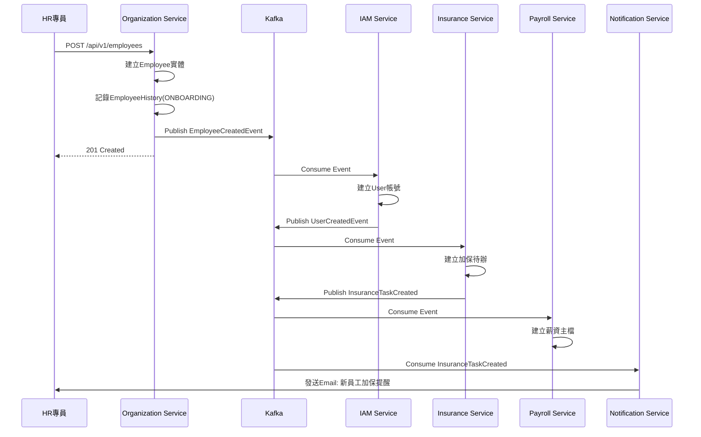

#### 範例2: 員工離職完整流程

```json
// Step 1: HR執行離職API
POST /api/v1/employees/E0001/terminate
{
  "terminationDate": "2025-12-31",
  "reason": "個人生涯規劃"
}

// Step 2: Organization Service發布事件
{
  "eventId": "evt-001",
  "eventType": "EmployeeTerminated",
  "timestamp": "2025-12-06T15:30:00Z",
  "payload": {
    "employeeId": "emp-001",
    "employeeNumber": "E0001",
    "terminationDate": "2025-12-31",
    "reason": "個人生涯規劃"
  }
}

// Step 3: IAM Service收到事件，停用帳號
// Step 4: Attendance Service計算未休假工資
{
  "eventId": "evt-002",
  "eventType": "UnusedLeaveCalculated",
  "payload": {
    "employeeId": "emp-001",
    "unusedDays": 5,
    "unusedLeaveAmount": 8333
  }
}

// Step 5: Payroll Service執行離職結算
// Step 6: Project Service移除專案成員
```

---

## 附錄: 工項清單摘要

供PM建立開發工項參考:

### 前端開發工項
1. ORG-P01 組織架構圖頁面
2. ORG-P02 部門管理頁面
3. ORG-P03 員工列表頁面
4. ORG-P04 員工詳細資料頁面
5. ORG-P05 員工新增頁面(步驟式表單)
6. ORG-P06 員工編輯頁面
7. ORG-P07 員工人事歷程頁面
8. ORG-P08 ESS我的資料頁面
9. ORG-P09 ESS證明文件申請頁面
10. 通用組件: 部門樹選擇器、員工選擇器

### 後端開發工項
1. Organization聚合根與Repository
2. Department聚合根與Repository
3. Employee聚合根與Repository
4. EmployeeContract聚合根與Repository
5. 組織管理API (5個端點)
6. 部門管理API (6個端點)
7. 員工管理API (12個端點)
8. ESS自助API (4個端點)
9. 合約管理API (4個端點)
10. 領域事件發布與訂閱
11. 資料加密服務
12. Excel匯入匯出功能

### 資料庫開發工項
1. 建立8個資料表DDL
2. 建立索引
3. 初始化預設資料
4. 資料遷移腳本

---

**文件完成日期:** 2025-12-06
**版本:** 1.0


# API詳細規格

# HR02 組織員工服務 API 詳細規格

**版本:** 1.0
**日期:** 2025-12-29
**服務代碼:** HR02
**服務名稱:** Organization Service (組織員工服務)

---

## 目錄

1. [Controller 命名對照](#1-controller-命名對照)
2. [API 總覽](#2-api-總覽)
3. [組織管理 API](#3-組織管理-api)
4. [部門管理 API](#4-部門管理-api)
5. [員工管理 API](#5-員工管理-api)
6. [ESS 員工自助 API](#6-ess-員工自助-api)
7. [合約管理 API](#7-合約管理-api)

---

## 1. Controller 命名對照

| Controller 類別 | 說明 | API 數量 |
|:---|:---|:---:|
| `HR02OrganizationCmdController` | 組織管理命令 (CUD) | 2 |
| `HR02OrganizationQryController` | 組織管理查詢 (R) | 3 |
| `HR02DepartmentCmdController` | 部門管理命令 (CUD) | 4 |
| `HR02DepartmentQryController` | 部門管理查詢 (R) | 2 |
| `HR02EmployeeCmdController` | 員工管理命令 (CUD) | 5 |
| `HR02EmployeeQryController` | 員工管理查詢 (R) | 7 |
| `HR02EssCmdController` | ESS 自助命令 | 2 |
| `HR02EssQryController` | ESS 自助查詢 | 2 |
| `HR02ContractCmdController` | 合約管理命令 | 2 |
| `HR02ContractQryController` | 合約管理查詢 | 2 |

---

## 2. API 總覽

### 2.1 組織管理 API (5 個端點)

| 端點 | 方法 | Controller | 說明 | 權限 |
|:---|:---:|:---|:---|:---|
| `/api/v1/organizations` | POST | HR02OrganizationCmdController | 建立公司 | organization:create |
| `/api/v1/organizations` | GET | HR02OrganizationQryController | 查詢公司列表 | organization:read |
| `/api/v1/organizations/{id}` | GET | HR02OrganizationQryController | 查詢公司詳情 | organization:read |
| `/api/v1/organizations/{id}` | PUT | HR02OrganizationCmdController | 更新公司 | organization:update |
| `/api/v1/organizations/{id}/tree` | GET | HR02OrganizationQryController | 查詢組織樹 | organization:read |

### 2.2 部門管理 API (6 個端點)

| 端點 | 方法 | Controller | 說明 | 權限 |
|:---|:---:|:---|:---|:---|
| `/api/v1/departments` | POST | HR02DepartmentCmdController | 建立部門 | department:create |
| `/api/v1/departments/{id}` | GET | HR02DepartmentQryController | 查詢部門詳情 | department:read |
| `/api/v1/departments/{id}` | PUT | HR02DepartmentCmdController | 更新部門 | department:update |
| `/api/v1/departments/{id}` | DELETE | HR02DepartmentCmdController | 刪除部門 | department:delete |
| `/api/v1/departments/{id}/assign-manager` | PUT | HR02DepartmentCmdController | 指派主管 | department:update |
| `/api/v1/departments/{id}/deactivate` | PUT | HR02DepartmentCmdController | 停用部門 | department:update |

### 2.3 員工管理 API (12 個端點)

| 端點 | 方法 | Controller | 說明 | 權限 |
|:---|:---:|:---|:---|:---|
| `/api/v1/employees` | POST | HR02EmployeeCmdController | 建立員工 | employee:create |
| `/api/v1/employees` | GET | HR02EmployeeQryController | 查詢員工列表 | employee:read |
| `/api/v1/employees/{id}` | GET | HR02EmployeeQryController | 查詢員工詳情 | employee:read |
| `/api/v1/employees/{id}` | PUT | HR02EmployeeCmdController | 更新員工 | employee:update |
| `/api/v1/employees/{id}/terminate` | POST | HR02EmployeeCmdController | 員工離職 | employee:terminate |
| `/api/v1/employees/{id}/transfer` | POST | HR02EmployeeCmdController | 部門調動 | employee:transfer |
| `/api/v1/employees/{id}/promote` | POST | HR02EmployeeCmdController | 員工升遷 | employee:promote |
| `/api/v1/employees/{id}/regularize` | POST | HR02EmployeeCmdController | 試用期轉正 | employee:update |
| `/api/v1/employees/{id}/history` | GET | HR02EmployeeQryController | 查詢人事歷程 | employee:read |
| `/api/v1/employees/check-number` | GET | HR02EmployeeQryController | 檢查編號唯一性 | employee:read |
| `/api/v1/employees/check-email` | GET | HR02EmployeeQryController | 檢查Email唯一性 | employee:read |
| `/api/v1/employees/check-national-id` | GET | HR02EmployeeQryController | 檢查身分證號唯一性 | employee:read |

### 2.4 ESS 員工自助 API (4 個端點)

| 端點 | 方法 | Controller | 說明 | 權限 |
|:---|:---:|:---|:---|:---|
| `/api/v1/employees/me` | GET | HR02EssQryController | 查詢個人資料 | - (登入即可) |
| `/api/v1/employees/me` | PUT | HR02EssCmdController | 更新個人資料 | - (登入即可) |
| `/api/v1/employees/me/certificate-requests` | POST | HR02EssCmdController | 申請證明文件 | - (登入即可) |
| `/api/v1/employees/me/certificate-requests` | GET | HR02EssQryController | 查詢證明文件列表 | - (登入即可) |

### 2.5 合約管理 API (4 個端點)

| 端點 | 方法 | Controller | 說明 | 權限 |
|:---|:---:|:---|:---|:---|
| `/api/v1/employees/{employeeId}/contracts` | POST | HR02ContractCmdController | 建立合約 | contract:create |
| `/api/v1/employees/{employeeId}/contracts` | GET | HR02ContractQryController | 查詢合約列表 | contract:read |
| `/api/v1/contracts/{id}` | GET | HR02ContractQryController | 查詢合約詳情 | contract:read |
| `/api/v1/contracts/{id}` | PUT | HR02ContractCmdController | 更新合約 | contract:update |

---

## 3. 組織管理 API

### 3.1 建立公司

**基本資訊**

| 項目 | 內容 |
|:---|:---|
| 端點 | `POST /api/v1/organizations` |
| Controller | `HR02OrganizationCmdController` |
| Service | `CreateOrganizationServiceImpl` |
| 權限 | `organization:create` |
| 版本 | v1 |

**用途說明**

建立新的公司實體，支援母公司與子公司結構。由系統管理員在企業擴張、成立子公司時使用。

**業務邏輯**

1. **驗證請求資料**
   - organizationCode 必須唯一，不可與現有公司代號重複
   - 若為子公司 (SUBSIDIARY)，parentOrganizationId 必須存在且為有效母公司
   - taxId（統一編號）格式驗證

2. **建立公司實體**
   - 產生 UUID 作為 organizationId
   - 設定 status = ACTIVE
   - 若為子公司，自動關聯至母公司

3. **記錄異動**
   - 記錄至審計日誌

**Request**

**Headers**

| 名稱 | 必填 | 說明 |
|:---|:---:|:---|
| Authorization | ✅ | `Bearer {accessToken}` |
| Content-Type | ✅ | `application/json` |

**Request Body**

| 欄位 | 類型 | 必填 | 驗證規則 | 說明 | 範例 |
|:---|:---|:---:|:---|:---|:---|
| organizationCode | String | ✅ | 1-50字元，唯一 | 公司代號 | `"SUB_A"` |
| organizationName | String | ✅ | 1-255字元 | 公司名稱 | `"子公司A"` |
| organizationType | Enum | ✅ | PARENT/SUBSIDIARY | 組織類型 | `"SUBSIDIARY"` |
| parentOrganizationId | UUID | ⬚ | 子公司必填，必須存在 | 母公司ID | `"550e8400-..."` |
| taxId | String | ⬚ | 8位數字 | 統一編號 | `"12345678"` |
| address | String | ⬚ | 最長500字元 | 公司地址 | `"台北市信義區..."` |
| phoneNumber | String | ⬚ | 電話格式 | 公司電話 | `"02-12345678"` |
| establishedDate | Date | ⬚ | 不可為未來日期 | 成立日期 | `"2020-01-01"` |

**範例：**
```json
{
  "organizationCode": "SUB_A",
  "organizationName": "子公司A",
  "organizationType": "SUBSIDIARY",
  "parentOrganizationId": "550e8400-e29b-41d4-a716-446655440000",
  "taxId": "12345678",
  "address": "台北市信義區信義路五段7號",
  "phoneNumber": "02-12345678",
  "establishedDate": "2020-01-01"
}
```

**Response**

**成功回應 (201 Created)**

| 欄位 | 類型 | 說明 |
|:---|:---|:---|
| organizationId | UUID | 新建公司ID |
| organizationCode | String | 公司代號 |
| organizationName | String | 公司名稱 |
| organizationType | Enum | 組織類型 |
| status | Enum | 公司狀態 |
| createdAt | DateTime | 建立時間 |

```json
{
  "code": "SUCCESS",
  "message": "公司建立成功",
  "data": {
    "organizationId": "550e8400-e29b-41d4-a716-446655440001",
    "organizationCode": "SUB_A",
    "organizationName": "子公司A",
    "organizationType": "SUBSIDIARY",
    "status": "ACTIVE",
    "createdAt": "2025-12-29T10:00:00Z"
  }
}
```

**錯誤碼**

| HTTP | 錯誤碼 | 說明 | 處理建議 |
|:---:|:---|:---|:---|
| 400 | VALIDATION_ORG_CODE_REQUIRED | 公司代號為必填 | 提供公司代號 |
| 400 | VALIDATION_ORG_CODE_FORMAT | 公司代號格式不正確 | 檢查格式（1-50字元） |
| 409 | RESOURCE_ORG_CODE_EXISTS | 公司代號已存在 | 使用其他公司代號 |
| 404 | RESOURCE_PARENT_ORG_NOT_FOUND | 母公司不存在 | 確認母公司ID正確性 |
| 400 | BUSINESS_SUBSIDIARY_REQUIRES_PARENT | 子公司必須指定母公司 | 提供 parentOrganizationId |

**領域事件**

無

---

### 3.2 查詢公司列表

**基本資訊**

| 項目 | 內容 |
|:---|:---|
| 端點 | `GET /api/v1/organizations` |
| Controller | `HR02OrganizationQryController` |
| Service | `GetOrganizationListServiceImpl` |
| 權限 | `organization:read` |
| 版本 | v1 |

**用途說明**

查詢系統中所有公司列表，支援篩選與分頁。用於公司管理頁面顯示所有公司資訊。

**業務邏輯**

1. 根據查詢條件篩選公司
2. 支援按公司名稱、代號搜尋
3. 支援按狀態篩選
4. 返回分頁結果

**Request**

**Headers**

| 名稱 | 必填 | 說明 |
|:---|:---:|:---|
| Authorization | ✅ | `Bearer {accessToken}` |

**Query Parameters**

| 參數名 | 類型 | 必填 | 預設值 | 說明 | 範例 |
|:---|:---|:---:|:---|:---|:---|
| search | String | ⬚ | - | 搜尋關鍵字（公司名稱/代號） | `"子公司"` |
| status | Enum | ⬚ | - | 狀態篩選 | `ACTIVE` |
| type | Enum | ⬚ | - | 組織類型篩選 | `SUBSIDIARY` |
| page | Integer | ⬚ | 1 | 頁碼 | `1` |
| size | Integer | ⬚ | 10 | 每頁筆數 | `20` |

**Response**

**成功回應 (200 OK)**

```json
{
  "code": "SUCCESS",
  "message": "查詢成功",
  "data": {
    "content": [
      {
        "organizationId": "550e8400-e29b-41d4-a716-446655440000",
        "organizationCode": "PARENT",
        "organizationName": "母公司",
        "organizationType": "PARENT",
        "taxId": "12345678",
        "employeeCount": 200,
        "status": "ACTIVE",
        "createdAt": "2020-01-01T00:00:00Z"
      },
      {
        "organizationId": "550e8400-e29b-41d4-a716-446655440001",
        "organizationCode": "SUB_A",
        "organizationName": "子公司A",
        "organizationType": "SUBSIDIARY",
        "parentOrganizationId": "550e8400-e29b-41d4-a716-446655440000",
        "parentOrganizationName": "母公司",
        "taxId": "87654321",
        "employeeCount": 50,
        "status": "ACTIVE",
        "createdAt": "2022-06-01T00:00:00Z"
      }
    ],
    "page": 1,
    "size": 10,
    "totalElements": 2,
    "totalPages": 1
  }
}
```

**錯誤碼**

| HTTP | 錯誤碼 | 說明 | 處理建議 |
|:---:|:---|:---|:---|
| 401 | AUTH_TOKEN_INVALID | Token 無效 | 重新登入 |
| 403 | AUTHZ_PERMISSION_DENIED | 無 organization:read 權限 | 聯繫管理員授權 |

---

### 3.3 查詢公司詳情

**基本資訊**

| 項目 | 內容 |
|:---|:---|
| 端點 | `GET /api/v1/organizations/{id}` |
| Controller | `HR02OrganizationQryController` |
| Service | `GetOrganizationDetailServiceImpl` |
| 權限 | `organization:read` |
| 版本 | v1 |

**用途說明**

查詢單一公司的詳細資訊，包含子公司統計、部門統計、員工統計等。

**業務邏輯**

1. 驗證公司ID存在
2. 查詢公司基本資訊
3. 統計子公司數量（若為母公司）
4. 統計部門數量
5. 統計員工數量

**Request**

**Headers**

| 名稱 | 必填 | 說明 |
|:---|:---:|:---|
| Authorization | ✅ | `Bearer {accessToken}` |

**Path Parameters**

| 參數名 | 類型 | 必填 | 說明 | 範例 |
|:---|:---|:---:|:---|:---|
| id | UUID | ✅ | 公司ID | `550e8400-e29b-41d4-a716-446655440000` |

**Response**

**成功回應 (200 OK)**

```json
{
  "code": "SUCCESS",
  "message": "查詢成功",
  "data": {
    "organizationId": "550e8400-e29b-41d4-a716-446655440000",
    "organizationCode": "PARENT",
    "organizationName": "母公司",
    "organizationType": "PARENT",
    "taxId": "12345678",
    "address": "台北市信義區信義路五段7號",
    "phoneNumber": "02-12345678",
    "establishedDate": "2010-01-01",
    "status": "ACTIVE",
    "statistics": {
      "subsidiaryCount": 2,
      "departmentCount": 15,
      "activeEmployeeCount": 200,
      "totalEmployeeCount": 250
    },
    "createdAt": "2010-01-01T00:00:00Z",
    "updatedAt": "2025-06-15T10:30:00Z"
  }
}
```

**錯誤碼**

| HTTP | 錯誤碼 | 說明 | 處理建議 |
|:---:|:---|:---|:---|
| 404 | RESOURCE_ORG_NOT_FOUND | 公司不存在 | 確認公司ID正確性 |

---

### 3.4 更新公司

**基本資訊**

| 項目 | 內容 |
|:---|:---|
| 端點 | `PUT /api/v1/organizations/{id}` |
| Controller | `HR02OrganizationCmdController` |
| Service | `UpdateOrganizationServiceImpl` |
| 權限 | `organization:update` |
| 版本 | v1 |

**用途說明**

更新公司基本資訊。注意：公司代號 (organizationCode) 建立後不可更改。

**業務邏輯**

1. **驗證請求資料**
   - 公司必須存在
   - organizationCode 不可更改
   - organizationType 不可更改

2. **更新公司資訊**
   - 更新允許變更的欄位
   - 更新 updatedAt 時間戳

**Request**

**Headers**

| 名稱 | 必填 | 說明 |
|:---|:---:|:---|
| Authorization | ✅ | `Bearer {accessToken}` |
| Content-Type | ✅ | `application/json` |

**Path Parameters**

| 參數名 | 類型 | 必填 | 說明 | 範例 |
|:---|:---|:---:|:---|:---|
| id | UUID | ✅ | 公司ID | `550e8400-e29b-41d4-a716-446655440000` |

**Request Body**

| 欄位 | 類型 | 必填 | 驗證規則 | 說明 | 範例 |
|:---|:---|:---:|:---|:---|:---|
| organizationName | String | ⬚ | 1-255字元 | 公司名稱 | `"新母公司名稱"` |
| address | String | ⬚ | 最長500字元 | 公司地址 | `"台北市信義區..."` |
| phoneNumber | String | ⬚ | 電話格式 | 公司電話 | `"02-87654321"` |
| status | Enum | ⬚ | ACTIVE/INACTIVE | 公司狀態 | `"ACTIVE"` |

**範例：**
```json
{
  "organizationName": "新母公司名稱",
  "address": "台北市大安區復興南路一段1號",
  "phoneNumber": "02-87654321"
}
```

**Response**

**成功回應 (200 OK)**

```json
{
  "code": "SUCCESS",
  "message": "公司更新成功",
  "data": {
    "organizationId": "550e8400-e29b-41d4-a716-446655440000",
    "organizationCode": "PARENT",
    "organizationName": "新母公司名稱",
    "status": "ACTIVE",
    "updatedAt": "2025-12-29T10:30:00Z"
  }
}
```

**錯誤碼**

| HTTP | 錯誤碼 | 說明 | 處理建議 |
|:---:|:---|:---|:---|
| 404 | RESOURCE_ORG_NOT_FOUND | 公司不存在 | 確認公司ID正確性 |
| 400 | BUSINESS_CANNOT_CHANGE_ORG_CODE | 公司代號不可變更 | 移除 organizationCode 欄位 |
| 400 | BUSINESS_CANNOT_DEACTIVATE_WITH_EMPLOYEES | 有在職員工無法停用 | 先處理在職員工 |

---

### 3.5 查詢組織樹

**基本資訊**

| 項目 | 內容 |
|:---|:---|
| 端點 | `GET /api/v1/organizations/{id}/tree` |
| Controller | `HR02OrganizationQryController` |
| Service | `GetOrganizationTreeServiceImpl` |
| 權限 | `organization:read` |
| 版本 | v1 |

**用途說明**

查詢指定公司的完整組織架構樹，包含所有部門層級與員工人數。用於組織架構圖頁面 (HR02-P01) 的樹狀結構顯示。

**業務邏輯**

1. 驗證公司ID存在
2. 遞迴查詢所有部門層級（最多5層）
3. 計算每個節點的員工人數
4. 包含部門主管資訊
5. 按 displayOrder 排序

**Request**

**Headers**

| 名稱 | 必填 | 說明 |
|:---|:---:|:---|
| Authorization | ✅ | `Bearer {accessToken}` |

**Path Parameters**

| 參數名 | 類型 | 必填 | 說明 | 範例 |
|:---|:---|:---:|:---|:---|
| id | UUID | ✅ | 公司ID | `550e8400-e29b-41d4-a716-446655440000` |

**Query Parameters**

| 參數名 | 類型 | 必填 | 預設值 | 說明 | 範例 |
|:---|:---|:---:|:---|:---|:---|
| includeInactive | Boolean | ⬚ | false | 是否包含停用部門 | `false` |
| maxLevel | Integer | ⬚ | 5 | 最大展開層級 | `3` |

**Response**

**成功回應 (200 OK)**

```json
{
  "code": "SUCCESS",
  "message": "查詢成功",
  "data": {
    "organizationId": "550e8400-e29b-41d4-a716-446655440000",
    "organizationName": "母公司",
    "organizationType": "PARENT",
    "employeeCount": 200,
    "departments": [
      {
        "departmentId": "dept-001",
        "departmentCode": "RD",
        "departmentName": "研發部",
        "level": 1,
        "managerId": "mgr-001",
        "managerName": "張經理",
        "employeeCount": 80,
        "status": "ACTIVE",
        "subDepartments": [
          {
            "departmentId": "dept-002",
            "departmentCode": "RD-FE",
            "departmentName": "前端組",
            "level": 2,
            "managerId": "mgr-002",
            "managerName": "李組長",
            "employeeCount": 25,
            "status": "ACTIVE",
            "subDepartments": []
          },
          {
            "departmentId": "dept-003",
            "departmentCode": "RD-BE",
            "departmentName": "後端組",
            "level": 2,
            "managerId": "mgr-003",
            "managerName": "王組長",
            "employeeCount": 30,
            "status": "ACTIVE",
            "subDepartments": []
          }
        ]
      },
      {
        "departmentId": "dept-010",
        "departmentCode": "HR",
        "departmentName": "人資部",
        "level": 1,
        "managerId": "mgr-010",
        "managerName": "陳經理",
        "employeeCount": 15,
        "status": "ACTIVE",
        "subDepartments": []
      }
    ]
  }
}
```

**錯誤碼**

| HTTP | 錯誤碼 | 說明 | 處理建議 |
|:---:|:---|:---|:---|
| 404 | RESOURCE_ORG_NOT_FOUND | 公司不存在 | 確認公司ID正確性 |

---

## 4. 部門管理 API

### 4.1 建立部門

**基本資訊**

| 項目 | 內容 |
|:---|:---|
| 端點 | `POST /api/v1/departments` |
| Controller | `HR02DepartmentCmdController` |
| Service | `CreateDepartmentServiceImpl` |
| 權限 | `department:create` |
| 版本 | v1 |

**用途說明**

建立新的部門，支援多層級部門結構（最多5層）。由 HR 管理員在組織調整時使用。

**業務邏輯**

1. **驗證請求資料**
   - organizationId 必須存在
   - 若有 parentDepartmentId，驗證父部門存在且屬於同一公司
   - 驗證層級不超過5層
   - departmentCode 在同一公司內唯一

2. **建立部門實體**
   - 產生 UUID 作為 departmentId
   - 設定 level = 父部門 level + 1（根部門為1）
   - 設定 status = ACTIVE
   - 設定 displayOrder

3. **發布領域事件**

**Request**

**Headers**

| 名稱 | 必填 | 說明 |
|:---|:---:|:---|
| Authorization | ✅ | `Bearer {accessToken}` |
| Content-Type | ✅ | `application/json` |

**Request Body**

| 欄位 | 類型 | 必填 | 驗證規則 | 說明 | 範例 |
|:---|:---|:---:|:---|:---|:---|
| organizationId | UUID | ✅ | 必須存在 | 所屬公司ID | `"org-uuid-001"` |
| parentDepartmentId | UUID | ⬚ | 若有則必須存在 | 父部門ID | `"dept-uuid-001"` |
| departmentCode | String | ✅ | 1-50字元，公司內唯一 | 部門代號 | `"RD-FE"` |
| departmentName | String | ✅ | 1-255字元 | 部門名稱 | `"前端組"` |
| managerId | UUID | ⬚ | 若有則必須存在 | 部門主管ID | `"emp-uuid-001"` |
| displayOrder | Integer | ⬚ | >= 0 | 顯示順序 | `1` |

**範例：**
```json
{
  "organizationId": "550e8400-e29b-41d4-a716-446655440000",
  "parentDepartmentId": "550e8400-e29b-41d4-a716-446655440100",
  "departmentCode": "RD-FE",
  "departmentName": "前端組",
  "managerId": "550e8400-e29b-41d4-a716-446655440200",
  "displayOrder": 1
}
```

**Response**

**成功回應 (201 Created)**

```json
{
  "code": "SUCCESS",
  "message": "部門建立成功",
  "data": {
    "departmentId": "550e8400-e29b-41d4-a716-446655440101",
    "departmentCode": "RD-FE",
    "departmentName": "前端組",
    "level": 2,
    "parentDepartmentId": "550e8400-e29b-41d4-a716-446655440100",
    "managerId": "550e8400-e29b-41d4-a716-446655440200",
    "managerName": "李組長",
    "status": "ACTIVE",
    "createdAt": "2025-12-29T10:00:00Z"
  }
}
```

**錯誤碼**

| HTTP | 錯誤碼 | 說明 | 處理建議 |
|:---:|:---|:---|:---|
| 404 | RESOURCE_ORG_NOT_FOUND | 公司不存在 | 確認公司ID正確性 |
| 404 | RESOURCE_PARENT_DEPT_NOT_FOUND | 父部門不存在 | 確認父部門ID正確性 |
| 409 | RESOURCE_DEPT_CODE_EXISTS | 部門代號已存在 | 使用其他部門代號 |
| 400 | BUSINESS_MAX_DEPT_LEVEL_EXCEEDED | 部門層級超過5層 | 調整組織結構 |
| 404 | RESOURCE_MANAGER_NOT_FOUND | 主管不存在 | 確認主管ID正確性 |

**領域事件**

| 事件名稱 | Topic | 說明 |
|:---|:---|:---|
| DepartmentCreatedEvent | `organization.department.created` | 部門建立完成 |

---

### 4.2 查詢部門詳情

**基本資訊**

| 項目 | 內容 |
|:---|:---|
| 端點 | `GET /api/v1/departments/{id}` |
| Controller | `HR02DepartmentQryController` |
| Service | `GetDepartmentDetailServiceImpl` |
| 權限 | `department:read` |
| 版本 | v1 |

**用途說明**

查詢單一部門的詳細資訊，包含主管資訊、員工統計、子部門列表。

**業務邏輯**

1. 驗證部門存在
2. 查詢部門基本資訊
3. 查詢部門主管資訊
4. 統計部門員工人數
5. 查詢直接子部門列表

**Request**

**Headers**

| 名稱 | 必填 | 說明 |
|:---|:---:|:---|
| Authorization | ✅ | `Bearer {accessToken}` |

**Path Parameters**

| 參數名 | 類型 | 必填 | 說明 | 範例 |
|:---|:---|:---:|:---|:---|
| id | UUID | ✅ | 部門ID | `550e8400-e29b-41d4-a716-446655440100` |

**Response**

**成功回應 (200 OK)**

```json
{
  "code": "SUCCESS",
  "message": "查詢成功",
  "data": {
    "departmentId": "550e8400-e29b-41d4-a716-446655440100",
    "departmentCode": "RD",
    "departmentName": "研發部",
    "level": 1,
    "organization": {
      "organizationId": "550e8400-e29b-41d4-a716-446655440000",
      "organizationName": "母公司"
    },
    "parentDepartment": null,
    "manager": {
      "employeeId": "550e8400-e29b-41d4-a716-446655440200",
      "employeeNumber": "E0050",
      "fullName": "張經理",
      "jobTitle": "研發經理"
    },
    "statistics": {
      "directEmployeeCount": 5,
      "totalEmployeeCount": 80,
      "subDepartmentCount": 4
    },
    "subDepartments": [
      {
        "departmentId": "550e8400-e29b-41d4-a716-446655440101",
        "departmentCode": "RD-FE",
        "departmentName": "前端組",
        "employeeCount": 25
      },
      {
        "departmentId": "550e8400-e29b-41d4-a716-446655440102",
        "departmentCode": "RD-BE",
        "departmentName": "後端組",
        "employeeCount": 30
      }
    ],
    "status": "ACTIVE",
    "createdAt": "2020-01-01T00:00:00Z",
    "updatedAt": "2025-06-15T10:30:00Z"
  }
}
```

**錯誤碼**

| HTTP | 錯誤碼 | 說明 | 處理建議 |
|:---:|:---|:---|:---|
| 404 | RESOURCE_DEPT_NOT_FOUND | 部門不存在 | 確認部門ID正確性 |

---

### 4.3 更新部門

**基本資訊**

| 項目 | 內容 |
|:---|:---|
| 端點 | `PUT /api/v1/departments/{id}` |
| Controller | `HR02DepartmentCmdController` |
| Service | `UpdateDepartmentServiceImpl` |
| 權限 | `department:update` |
| 版本 | v1 |

**用途說明**

更新部門基本資訊。注意：不可透過此 API 更改部門層級結構（需使用拖曳調整）。

**業務邏輯**

1. **驗證請求資料**
   - 部門必須存在
   - departmentCode 若更改需驗證唯一性
   - 不可更改 organizationId、parentDepartmentId、level

2. **更新部門資訊**

**Request**

**Headers**

| 名稱 | 必填 | 說明 |
|:---|:---:|:---|
| Authorization | ✅ | `Bearer {accessToken}` |
| Content-Type | ✅ | `application/json` |

**Path Parameters**

| 參數名 | 類型 | 必填 | 說明 | 範例 |
|:---|:---|:---:|:---|:---|
| id | UUID | ✅ | 部門ID | `550e8400-e29b-41d4-a716-446655440100` |

**Request Body**

| 欄位 | 類型 | 必填 | 驗證規則 | 說明 | 範例 |
|:---|:---|:---:|:---|:---|:---|
| departmentName | String | ⬚ | 1-255字元 | 部門名稱 | `"前端開發組"` |
| displayOrder | Integer | ⬚ | >= 0 | 顯示順序 | `2` |

**範例：**
```json
{
  "departmentName": "前端開發組",
  "displayOrder": 2
}
```

**Response**

**成功回應 (200 OK)**

```json
{
  "code": "SUCCESS",
  "message": "部門更新成功",
  "data": {
    "departmentId": "550e8400-e29b-41d4-a716-446655440101",
    "departmentCode": "RD-FE",
    "departmentName": "前端開發組",
    "status": "ACTIVE",
    "updatedAt": "2025-12-29T10:30:00Z"
  }
}
```

**錯誤碼**

| HTTP | 錯誤碼 | 說明 | 處理建議 |
|:---:|:---|:---|:---|
| 404 | RESOURCE_DEPT_NOT_FOUND | 部門不存在 | 確認部門ID正確性 |
| 409 | RESOURCE_DEPT_CODE_EXISTS | 部門代號已存在 | 使用其他部門代號 |

---

### 4.4 刪除部門

**基本資訊**

| 項目 | 內容 |
|:---|:---|
| 端點 | `DELETE /api/v1/departments/{id}` |
| Controller | `HR02DepartmentCmdController` |
| Service | `DeleteDepartmentServiceImpl` |
| 權限 | `department:delete` |
| 版本 | v1 |

**用途說明**

永久刪除部門。僅限無員工、無子部門的空部門可以刪除。

**業務邏輯**

1. **驗證前置條件**
   - 部門必須存在
   - 部門下無在職員工
   - 部門下無子部門
   - 部門非已刪除狀態

2. **執行刪除**
   - 永久刪除部門記錄

**Request**

**Headers**

| 名稱 | 必填 | 說明 |
|:---|:---:|:---|
| Authorization | ✅ | `Bearer {accessToken}` |

**Path Parameters**

| 參數名 | 類型 | 必填 | 說明 | 範例 |
|:---|:---|:---:|:---|:---|
| id | UUID | ✅ | 部門ID | `550e8400-e29b-41d4-a716-446655440100` |

**Response**

**成功回應 (200 OK)**

```json
{
  "code": "SUCCESS",
  "message": "部門刪除成功",
  "data": {
    "departmentId": "550e8400-e29b-41d4-a716-446655440100",
    "deletedAt": "2025-12-29T10:30:00Z"
  }
}
```

**錯誤碼**

| HTTP | 錯誤碼 | 說明 | 處理建議 |
|:---:|:---|:---|:---|
| 404 | RESOURCE_DEPT_NOT_FOUND | 部門不存在 | 確認部門ID正確性 |
| 400 | BUSINESS_DEPT_HAS_EMPLOYEES | 部門下有在職員工 | 先調動或離職員工 |
| 400 | BUSINESS_DEPT_HAS_SUBDEPTS | 部門下有子部門 | 先刪除或遷移子部門 |

---

### 4.5 指派主管

**基本資訊**

| 項目 | 內容 |
|:---|:---|
| 端點 | `PUT /api/v1/departments/{id}/assign-manager` |
| Controller | `HR02DepartmentCmdController` |
| Service | `AssignDepartmentManagerServiceImpl` |
| 權限 | `department:update` |
| 版本 | v1 |

**用途說明**

指派或變更部門主管。主管變更會記錄至人事歷程。

**業務邏輯**

1. **驗證請求資料**
   - 部門必須存在且為 ACTIVE 狀態
   - 新主管必須存在且為在職員工
   - 新主管建議屬於該部門或上層部門

2. **更新主管**
   - 記錄舊主管ID
   - 更新部門 managerId
   - 發布 DepartmentManagerChangedEvent

**Request**

**Headers**

| 名稱 | 必填 | 說明 |
|:---|:---:|:---|
| Authorization | ✅ | `Bearer {accessToken}` |
| Content-Type | ✅ | `application/json` |

**Path Parameters**

| 參數名 | 類型 | 必填 | 說明 | 範例 |
|:---|:---|:---:|:---|:---|
| id | UUID | ✅ | 部門ID | `550e8400-e29b-41d4-a716-446655440100` |

**Request Body**

| 欄位 | 類型 | 必填 | 驗證規則 | 說明 | 範例 |
|:---|:---|:---:|:---|:---|:---|
| managerId | UUID | ✅ | 必須存在且在職 | 新主管員工ID | `"emp-uuid-001"` |
| effectiveDate | Date | ⬚ | 不可為過去日期 | 生效日期（預設今天） | `"2026-01-01"` |
| reason | String | ⬚ | 最長500字元 | 變更原因 | `"組織調整"` |

**範例：**
```json
{
  "managerId": "550e8400-e29b-41d4-a716-446655440200",
  "effectiveDate": "2026-01-01",
  "reason": "組織調整"
}
```

**Response**

**成功回應 (200 OK)**

```json
{
  "code": "SUCCESS",
  "message": "主管指派成功",
  "data": {
    "departmentId": "550e8400-e29b-41d4-a716-446655440100",
    "departmentName": "研發部",
    "oldManager": {
      "employeeId": "550e8400-e29b-41d4-a716-446655440199",
      "fullName": "前任經理"
    },
    "newManager": {
      "employeeId": "550e8400-e29b-41d4-a716-446655440200",
      "fullName": "張經理"
    },
    "effectiveDate": "2026-01-01",
    "updatedAt": "2025-12-29T10:30:00Z"
  }
}
```

**錯誤碼**

| HTTP | 錯誤碼 | 說明 | 處理建議 |
|:---:|:---|:---|:---|
| 404 | RESOURCE_DEPT_NOT_FOUND | 部門不存在 | 確認部門ID正確性 |
| 404 | RESOURCE_EMPLOYEE_NOT_FOUND | 員工不存在 | 確認員工ID正確性 |
| 400 | BUSINESS_EMPLOYEE_NOT_ACTIVE | 員工非在職狀態 | 選擇在職員工 |

**領域事件**

| 事件名稱 | Topic | 說明 |
|:---|:---|:---|
| DepartmentManagerChangedEvent | `organization.department.manager-changed` | 主管變更，通知考勤服務 |

---

### 4.6 停用部門

**基本資訊**

| 項目 | 內容 |
|:---|:---|
| 端點 | `PUT /api/v1/departments/{id}/deactivate` |
| Controller | `HR02DepartmentCmdController` |
| Service | `DeactivateDepartmentServiceImpl` |
| 權限 | `department:update` |
| 版本 | v1 |

**用途說明**

停用部門（軟刪除）。停用後不會顯示在組織樹中，但資料保留供歷史查詢。

**業務邏輯**

1. **驗證前置條件**
   - 部門必須存在
   - 部門目前為 ACTIVE 狀態
   - 部門下無在職員工
   - 部門下無 ACTIVE 的子部門

2. **執行停用**
   - 更新 status = INACTIVE

**Request**

**Headers**

| 名稱 | 必填 | 說明 |
|:---|:---:|:---|
| Authorization | ✅ | `Bearer {accessToken}` |
| Content-Type | ✅ | `application/json` |

**Path Parameters**

| 參數名 | 類型 | 必填 | 說明 | 範例 |
|:---|:---|:---:|:---|:---|
| id | UUID | ✅ | 部門ID | `550e8400-e29b-41d4-a716-446655440100` |

**Request Body**

| 欄位 | 類型 | 必填 | 驗證規則 | 說明 | 範例 |
|:---|:---|:---:|:---|:---|:---|
| reason | String | ⬚ | 最長500字元 | 停用原因 | `"組織重整"` |

**範例：**
```json
{
  "reason": "組織重整"
}
```

**Response**

**成功回應 (200 OK)**

```json
{
  "code": "SUCCESS",
  "message": "部門停用成功",
  "data": {
    "departmentId": "550e8400-e29b-41d4-a716-446655440100",
    "departmentName": "研發部",
    "status": "INACTIVE",
    "deactivatedAt": "2025-12-29T10:30:00Z"
  }
}
```

**錯誤碼**

| HTTP | 錯誤碼 | 說明 | 處理建議 |
|:---:|:---|:---|:---|
| 404 | RESOURCE_DEPT_NOT_FOUND | 部門不存在 | 確認部門ID正確性 |
| 400 | BUSINESS_DEPT_ALREADY_INACTIVE | 部門已停用 | 無需重複操作 |
| 400 | BUSINESS_DEPT_HAS_EMPLOYEES | 部門下有在職員工 | 先調動或離職員工 |
| 400 | BUSINESS_DEPT_HAS_ACTIVE_SUBDEPTS | 部門下有啟用中子部門 | 先停用子部門 |

---

## 5. 員工管理 API

### 5.1 建立員工（到職）

**基本資訊**

| 項目 | 內容 |
|:---|:---|
| 端點 | `POST /api/v1/employees` |
| Controller | `HR02EmployeeCmdController` |
| Service | `CreateEmployeeServiceImpl` |
| 權限 | `employee:create` |
| 版本 | v1 |

**用途說明**

建立新員工記錄，執行完整的到職流程。這是人事系統的核心操作之一，會觸發多個下游服務的自動處理。

**業務邏輯**

1. **驗證請求資料**
   - employeeNumber 必須唯一（系統可自動產生或手動輸入）
   - nationalId（身分證號）必須唯一且格式正確
   - companyEmail 必須唯一
   - departmentId 和 managerId 必須存在

2. **建立員工實體**
   - 產生 UUID 作為 employeeId
   - 加密儲存敏感資料（nationalId、bankAccount）
   - 設定 employmentStatus = PROBATION
   - 計算 probationEndDate = hireDate + probationMonths

3. **記錄人事歷程**
   - 建立 employee_history 記錄（event_type = ONBOARDING）

4. **發布領域事件**
   - EmployeeCreatedEvent → IAM、Insurance、Payroll

**Request**

**Headers**

| 名稱 | 必填 | 說明 |
|:---|:---:|:---|
| Authorization | ✅ | `Bearer {accessToken}` |
| Content-Type | ✅ | `application/json` |

**Request Body**

| 欄位 | 類型 | 必填 | 驗證規則 | 說明 | 範例 |
|:---|:---|:---:|:---|:---|:---|
| employeeNumber | String | ⬚ | 格式 E+4位數，唯一（空則自動產生） | 員工編號 | `"E0001"` |
| firstName | String | ✅ | 1-100字元 | 名 | `"三"` |
| lastName | String | ✅ | 1-100字元 | 姓 | `"張"` |
| nationalId | String | ✅ | 台灣身分證格式，唯一 | 身分證號 | `"A123456789"` |
| dateOfBirth | Date | ✅ | 不可為未來日期 | 出生日期 | `"1990-01-01"` |
| gender | Enum | ✅ | MALE/FEMALE/OTHER | 性別 | `"MALE"` |
| maritalStatus | Enum | ⬚ | SINGLE/MARRIED/DIVORCED/WIDOWED | 婚姻狀況 | `"MARRIED"` |
| personalEmail | String | ⬚ | Email 格式 | 個人 Email | `"zhang@gmail.com"` |
| companyEmail | String | ✅ | Email 格式，唯一 | 公司 Email | `"zhang.san@company.com"` |
| mobilePhone | String | ✅ | 台灣手機格式 | 手機號碼 | `"0912345678"` |
| address | Object | ✅ | - | 地址 | 見下方 |
| emergencyContact | Object | ⬚ | - | 緊急聯絡人 | 見下方 |
| organizationId | UUID | ✅ | 必須存在 | 公司ID | `"org-uuid"` |
| departmentId | UUID | ✅ | 必須存在 | 部門ID | `"dept-uuid"` |
| managerId | UUID | ⬚ | 若有則必須存在 | 直屬主管ID | `"emp-uuid"` |
| jobTitle | String | ⬚ | 最長255字元 | 職稱 | `"前端工程師"` |
| jobLevel | String | ⬚ | 最長50字元 | 職等 | `"P3"` |
| employmentType | Enum | ✅ | FULL_TIME/CONTRACT/PART_TIME/INTERN | 雇用類型 | `"FULL_TIME"` |
| hireDate | Date | ✅ | - | 到職日期 | `"2025-01-01"` |
| probationMonths | Integer | ⬚ | 0-6，預設3 | 試用期月數 | `3` |
| bankAccount | Object | ⬚ | - | 銀行帳戶 | 見下方 |

**address 物件結構：**

| 欄位 | 類型 | 必填 | 說明 |
|:---|:---|:---:|:---|
| postalCode | String | ⬚ | 郵遞區號 |
| city | String | ✅ | 縣市 |
| district | String | ✅ | 區/鄉鎮 |
| street | String | ✅ | 街道地址 |

**emergencyContact 物件結構：**

| 欄位 | 類型 | 必填 | 說明 |
|:---|:---|:---:|:---|
| name | String | ✅ | 聯絡人姓名 |
| relationship | String | ⬚ | 關係 |
| phoneNumber | String | ✅ | 聯絡電話 |

**bankAccount 物件結構：**

| 欄位 | 類型 | 必填 | 說明 |
|:---|:---|:---:|:---|
| bankCode | String | ✅ | 銀行代碼 |
| bankName | String | ✅ | 銀行名稱 |
| accountNumber | String | ✅ | 帳號（會加密儲存） |
| accountName | String | ✅ | 戶名 |

**範例：**
```json
{
  "employeeNumber": "E0001",
  "firstName": "三",
  "lastName": "張",
  "nationalId": "A123456789",
  "dateOfBirth": "1990-01-01",
  "gender": "MALE",
  "maritalStatus": "MARRIED",
  "personalEmail": "zhang.san@gmail.com",
  "companyEmail": "zhang.san@company.com",
  "mobilePhone": "0912345678",
  "address": {
    "postalCode": "110",
    "city": "台北市",
    "district": "信義區",
    "street": "信義路五段7號"
  },
  "emergencyContact": {
    "name": "張太太",
    "relationship": "配偶",
    "phoneNumber": "0987654321"
  },
  "organizationId": "550e8400-e29b-41d4-a716-446655440000",
  "departmentId": "550e8400-e29b-41d4-a716-446655440001",
  "managerId": "550e8400-e29b-41d4-a716-446655440002",
  "jobTitle": "前端工程師",
  "jobLevel": "P3",
  "employmentType": "FULL_TIME",
  "hireDate": "2025-01-01",
  "probationMonths": 3,
  "bankAccount": {
    "bankCode": "012",
    "bankName": "台北富邦銀行",
    "accountNumber": "123456789012",
    "accountName": "張三"
  }
}
```

**Response**

**成功回應 (201 Created)**

```json
{
  "code": "SUCCESS",
  "message": "員工建立成功",
  "data": {
    "employeeId": "550e8400-e29b-41d4-a716-446655440003",
    "employeeNumber": "E0001",
    "fullName": "張三",
    "companyEmail": "zhang.san@company.com",
    "employmentStatus": "PROBATION",
    "hireDate": "2025-01-01",
    "probationEndDate": "2025-04-01",
    "createdAt": "2025-12-29T10:00:00Z"
  }
}
```

**錯誤碼**

| HTTP | 錯誤碼 | 說明 | 處理建議 |
|:---:|:---|:---|:---|
| 400 | VALIDATION_REQUIRED_FIELD | 必填欄位未填 | 補填必填欄位 |
| 400 | VALIDATION_NATIONAL_ID_FORMAT | 身分證號格式錯誤 | 檢查身分證號格式 |
| 400 | VALIDATION_EMAIL_FORMAT | Email 格式錯誤 | 檢查 Email 格式 |
| 400 | VALIDATION_PHONE_FORMAT | 手機格式錯誤 | 檢查手機格式 |
| 409 | RESOURCE_EMPLOYEE_NUMBER_EXISTS | 員工編號已存在 | 使用其他編號或留空自動產生 |
| 409 | RESOURCE_NATIONAL_ID_EXISTS | 身分證號已存在 | 確認是否重複建檔 |
| 409 | RESOURCE_EMAIL_EXISTS | 公司 Email 已存在 | 使用其他 Email |
| 404 | RESOURCE_ORG_NOT_FOUND | 公司不存在 | 確認公司ID正確性 |
| 404 | RESOURCE_DEPT_NOT_FOUND | 部門不存在 | 確認部門ID正確性 |
| 404 | RESOURCE_MANAGER_NOT_FOUND | 主管不存在 | 確認主管ID正確性 |

**領域事件**

| 事件名稱 | Topic | 說明 |
|:---|:---|:---|
| EmployeeCreatedEvent | `organization.employee.created` | 員工建立完成 |

**事件 Payload：**
```json
{
  "eventId": "evt-uuid-001",
  "eventType": "EmployeeCreatedEvent",
  "occurredAt": "2025-12-29T10:00:00Z",
  "aggregateId": "550e8400-e29b-41d4-a716-446655440003",
  "aggregateType": "Employee",
  "payload": {
    "employeeId": "550e8400-e29b-41d4-a716-446655440003",
    "employeeNumber": "E0001",
    "companyEmail": "zhang.san@company.com",
    "organizationId": "550e8400-e29b-41d4-a716-446655440000",
    "departmentId": "550e8400-e29b-41d4-a716-446655440001",
    "hireDate": "2025-01-01",
    "roles": ["EMPLOYEE"]
  }
}
```

**後續處理：**
- ✅ IAM Service 自動建立 User 帳號
- ✅ Insurance Service 產生加保提醒
- ✅ Payroll Service 建立薪資主檔

---

### 5.2 查詢員工列表

**基本資訊**

| 項目 | 內容 |
|:---|:---|
| 端點 | `GET /api/v1/employees` |
| Controller | `HR02EmployeeQryController` |
| Service | `GetEmployeeListServiceImpl` |
| 權限 | `employee:read` |
| 版本 | v1 |

**用途說明**

查詢員工列表，支援多條件篩選、關鍵字搜尋與分頁。用於員工列表頁面 (HR02-P03)。

**業務邏輯**

1. 根據查詢條件篩選員工
2. 支援員工編號、姓名、Email 模糊搜尋
3. 支援部門、狀態、到職日期範圍篩選
4. 返回分頁結果，包含部門路徑

**Request**

**Headers**

| 名稱 | 必填 | 說明 |
|:---|:---:|:---|
| Authorization | ✅ | `Bearer {accessToken}` |

**Query Parameters**

| 參數名 | 類型 | 必填 | 預設值 | 說明 | 範例 |
|:---|:---|:---:|:---|:---|:---|
| search | String | ⬚ | - | 搜尋關鍵字（編號/姓名/Email） | `"張"` |
| status | Enum | ⬚ | - | 在職狀態 | `ACTIVE` |
| departmentId | UUID | ⬚ | - | 部門篩選（含子部門） | `"dept-uuid"` |
| organizationId | UUID | ⬚ | - | 公司篩選 | `"org-uuid"` |
| hireDateFrom | Date | ⬚ | - | 到職日期起 | `"2025-01-01"` |
| hireDateTo | Date | ⬚ | - | 到職日期迄 | `"2025-12-31"` |
| employmentType | Enum | ⬚ | - | 雇用類型 | `FULL_TIME` |
| page | Integer | ⬚ | 1 | 頁碼 | `1` |
| size | Integer | ⬚ | 20 | 每頁筆數（最大100） | `20` |
| sort | String | ⬚ | hireDate,desc | 排序 | `employeeNumber,asc` |

**Response**

**成功回應 (200 OK)**

```json
{
  "code": "SUCCESS",
  "message": "查詢成功",
  "data": {
    "content": [
      {
        "employeeId": "550e8400-e29b-41d4-a716-446655440003",
        "employeeNumber": "E0001",
        "fullName": "張三",
        "departmentId": "550e8400-e29b-41d4-a716-446655440001",
        "departmentPath": "研發部 > 前端組",
        "jobTitle": "前端工程師",
        "employmentType": "FULL_TIME",
        "employmentStatus": "ACTIVE",
        "hireDate": "2025-01-01",
        "photoUrl": "/photos/e0001.jpg"
      },
      {
        "employeeId": "550e8400-e29b-41d4-a716-446655440004",
        "employeeNumber": "E0002",
        "fullName": "李四",
        "departmentId": "550e8400-e29b-41d4-a716-446655440002",
        "departmentPath": "研發部 > 後端組",
        "jobTitle": "後端工程師",
        "employmentType": "FULL_TIME",
        "employmentStatus": "PROBATION",
        "hireDate": "2025-11-15",
        "photoUrl": null
      }
    ],
    "page": 1,
    "size": 20,
    "totalElements": 156,
    "totalPages": 8
  }
}
```

**錯誤碼**

| HTTP | 錯誤碼 | 說明 | 處理建議 |
|:---:|:---|:---|:---|
| 400 | VALIDATION_INVALID_DATE_RANGE | 日期範圍不正確 | hireDateFrom 需小於等於 hireDateTo |

---

### 5.3 查詢員工詳情

**基本資訊**

| 項目 | 內容 |
|:---|:---|
| 端點 | `GET /api/v1/employees/{id}` |
| Controller | `HR02EmployeeQryController` |
| Service | `GetEmployeeDetailServiceImpl` |
| 權限 | `employee:read` |
| 版本 | v1 |

**用途說明**

查詢單一員工的完整詳細資訊，包含個人資料、職務資訊、銀行帳戶等。用於員工詳細資料頁面 (HR02-P04)。

**業務邏輯**

1. 驗證員工存在
2. 查詢員工所有資訊
3. 敏感資料遮罩處理（身分證號、銀行帳號）
4. 組合部門路徑、主管資訊

**Request**

**Headers**

| 名稱 | 必填 | 說明 |
|:---|:---:|:---|
| Authorization | ✅ | `Bearer {accessToken}` |

**Path Parameters**

| 參數名 | 類型 | 必填 | 說明 | 範例 |
|:---|:---|:---:|:---|:---|
| id | UUID | ✅ | 員工ID | `550e8400-e29b-41d4-a716-446655440003` |

**Response**

**成功回應 (200 OK)**

```json
{
  "code": "SUCCESS",
  "message": "查詢成功",
  "data": {
    "employeeId": "550e8400-e29b-41d4-a716-446655440003",
    "employeeNumber": "E0001",
    "fullName": "張三",
    "firstName": "三",
    "lastName": "張",
    "nationalId": "A12***789",
    "dateOfBirth": "1990-01-01",
    "gender": "MALE",
    "maritalStatus": "MARRIED",
    "photoUrl": "/photos/e0001.jpg",
    "contact": {
      "companyEmail": "zhang.san@company.com",
      "personalEmail": "zhang.san@gmail.com",
      "mobilePhone": "0912345678"
    },
    "address": {
      "postalCode": "110",
      "city": "台北市",
      "district": "信義區",
      "street": "信義路五段7號"
    },
    "emergencyContact": {
      "name": "張太太",
      "relationship": "配偶",
      "phoneNumber": "0987654321"
    },
    "organization": {
      "organizationId": "550e8400-e29b-41d4-a716-446655440000",
      "organizationName": "母公司"
    },
    "department": {
      "departmentId": "550e8400-e29b-41d4-a716-446655440001",
      "departmentPath": "研發部 > 前端組"
    },
    "manager": {
      "employeeId": "550e8400-e29b-41d4-a716-446655440050",
      "employeeNumber": "E0050",
      "fullName": "李組長"
    },
    "jobTitle": "前端工程師",
    "jobLevel": "P3",
    "employmentType": "FULL_TIME",
    "employmentStatus": "ACTIVE",
    "hireDate": "2025-01-01",
    "probationEndDate": "2025-04-01",
    "terminationDate": null,
    "bankAccount": {
      "bankCode": "012",
      "bankName": "台北富邦銀行",
      "accountNumber": "***9012"
    },
    "createdAt": "2025-01-01T09:00:00Z",
    "updatedAt": "2025-06-15T10:30:00Z"
  }
}
```

**錯誤碼**

| HTTP | 錯誤碼 | 說明 | 處理建議 |
|:---:|:---|:---|:---|
| 404 | RESOURCE_EMPLOYEE_NOT_FOUND | 員工不存在 | 確認員工ID正確性 |

---

### 5.4 更新員工

**基本資訊**

| 項目 | 內容 |
|:---|:---|
| 端點 | `PUT /api/v1/employees/{id}` |
| Controller | `HR02EmployeeCmdController` |
| Service | `UpdateEmployeeServiceImpl` |
| 權限 | `employee:update` |
| 版本 | v1 |

**用途說明**

更新員工基本資訊。部分欄位（如 employeeNumber、nationalId）建立後不可更改。調動、升遷、離職等操作需使用專屬 API。

**業務邏輯**

1. **驗證請求資料**
   - 員工必須存在
   - 不可更改：employeeNumber、nationalId、hireDate
   - 若更改 companyEmail 需驗證唯一性

2. **更新員工資訊**
   - 更新允許變更的欄位
   - 更新 updatedAt 時間戳

**Request**

**Headers**

| 名稱 | 必填 | 說明 |
|:---|:---:|:---|
| Authorization | ✅ | `Bearer {accessToken}` |
| Content-Type | ✅ | `application/json` |

**Path Parameters**

| 參數名 | 類型 | 必填 | 說明 | 範例 |
|:---|:---|:---:|:---|:---|
| id | UUID | ✅ | 員工ID | `550e8400-e29b-41d4-a716-446655440003` |

**Request Body**

| 欄位 | 類型 | 必填 | 驗證規則 | 說明 | 範例 |
|:---|:---|:---:|:---|:---|:---|
| firstName | String | ⬚ | 1-100字元 | 名 | `"三"` |
| lastName | String | ⬚ | 1-100字元 | 姓 | `"張"` |
| maritalStatus | Enum | ⬚ | - | 婚姻狀況 | `"MARRIED"` |
| personalEmail | String | ⬚ | Email 格式 | 個人 Email | `"new@gmail.com"` |
| companyEmail | String | ⬚ | Email 格式，唯一 | 公司 Email | `"new@company.com"` |
| mobilePhone | String | ⬚ | 電話格式 | 手機號碼 | `"0912345679"` |
| address | Object | ⬚ | - | 地址 | - |
| emergencyContact | Object | ⬚ | - | 緊急聯絡人 | - |
| jobTitle | String | ⬚ | 最長255字元 | 職稱 | `"資深前端工程師"` |
| jobLevel | String | ⬚ | 最長50字元 | 職等 | `"P4"` |
| bankAccount | Object | ⬚ | - | 銀行帳戶 | - |
| photoUrl | String | ⬚ | URL格式 | 照片網址 | `"/photos/new.jpg"` |

**範例：**
```json
{
  "mobilePhone": "0912345679",
  "address": {
    "postalCode": "106",
    "city": "台北市",
    "district": "大安區",
    "street": "復興南路一段1號"
  },
  "emergencyContact": {
    "name": "張太太",
    "relationship": "配偶",
    "phoneNumber": "0987654322"
  }
}
```

**Response**

**成功回應 (200 OK)**

```json
{
  "code": "SUCCESS",
  "message": "員工資料更新成功",
  "data": {
    "employeeId": "550e8400-e29b-41d4-a716-446655440003",
    "employeeNumber": "E0001",
    "fullName": "張三",
    "updatedAt": "2025-12-29T10:30:00Z"
  }
}
```

**錯誤碼**

| HTTP | 錯誤碼 | 說明 | 處理建議 |
|:---:|:---|:---|:---|
| 404 | RESOURCE_EMPLOYEE_NOT_FOUND | 員工不存在 | 確認員工ID正確性 |
| 409 | RESOURCE_EMAIL_EXISTS | 公司 Email 已存在 | 使用其他 Email |
| 400 | BUSINESS_CANNOT_CHANGE_EMPLOYEE_NUMBER | 員工編號不可變更 | 移除該欄位 |

**領域事件**

| 事件名稱 | Topic | 說明 |
|:---|:---|:---|
| EmployeeEmailChangedEvent | `organization.employee.email-changed` | Email 變更時發布，通知 IAM 更新 |

---

### 5.5 員工離職

**基本資訊**

| 項目 | 內容 |
|:---|:---|
| 端點 | `POST /api/v1/employees/{id}/terminate` |
| Controller | `HR02EmployeeCmdController` |
| Service | `TerminateEmployeeServiceImpl` |
| 權限 | `employee:terminate` |
| 版本 | v1 |

**用途說明**

執行員工離職流程，這是系統中最重要的事件之一，會觸發多個下游服務的連鎖處理。

**業務邏輯**

1. **驗證前置條件**
   - 員工必須存在
   - 員工非已離職狀態
   - 離職日期不可早於到職日期

2. **執行離職**
   - 更新 employmentStatus = TERMINATED
   - 設定 terminationDate 和 terminationReason
   - 記錄 employee_history（event_type = TERMINATION）

3. **發布領域事件（關鍵）**
   - EmployeeTerminatedEvent → 觸發多個服務

**Request**

**Headers**

| 名稱 | 必填 | 說明 |
|:---|:---:|:---|
| Authorization | ✅ | `Bearer {accessToken}` |
| Content-Type | ✅ | `application/json` |

**Path Parameters**

| 參數名 | 類型 | 必填 | 說明 | 範例 |
|:---|:---|:---:|:---|:---|
| id | UUID | ✅ | 員工ID | `550e8400-e29b-41d4-a716-446655440003` |

**Request Body**

| 欄位 | 類型 | 必填 | 驗證規則 | 說明 | 範例 |
|:---|:---|:---:|:---|:---|:---|
| terminationDate | Date | ✅ | 不可早於到職日期 | 離職日期 | `"2025-12-31"` |
| reason | String | ⬚ | 最長500字元 | 離職原因 | `"個人生涯規劃"` |

**範例：**
```json
{
  "terminationDate": "2025-12-31",
  "reason": "個人生涯規劃"
}
```

**Response**

**成功回應 (200 OK)**

```json
{
  "code": "SUCCESS",
  "message": "員工離職處理成功",
  "data": {
    "employeeId": "550e8400-e29b-41d4-a716-446655440003",
    "employeeNumber": "E0001",
    "fullName": "張三",
    "terminationDate": "2025-12-31",
    "employmentStatus": "TERMINATED",
    "updatedAt": "2025-12-29T15:30:00Z"
  }
}
```

**錯誤碼**

| HTTP | 錯誤碼 | 說明 | 處理建議 |
|:---:|:---|:---|:---|
| 404 | RESOURCE_EMPLOYEE_NOT_FOUND | 員工不存在 | 確認員工ID正確性 |
| 400 | BUSINESS_EMPLOYEE_ALREADY_TERMINATED | 員工已離職 | 無需重複操作 |
| 400 | BUSINESS_INVALID_TERMINATION_DATE | 離職日期早於到職日期 | 調整離職日期 |

**領域事件**

| 事件名稱 | Topic | 說明 |
|:---|:---|:---|
| EmployeeTerminatedEvent | `organization.employee.terminated` | **關鍵事件** |

**事件 Payload：**
```json
{
  "eventId": "evt-uuid-002",
  "eventType": "EmployeeTerminatedEvent",
  "occurredAt": "2025-12-29T15:30:00Z",
  "aggregateId": "550e8400-e29b-41d4-a716-446655440003",
  "aggregateType": "Employee",
  "payload": {
    "employeeId": "550e8400-e29b-41d4-a716-446655440003",
    "employeeNumber": "E0001",
    "terminationDate": "2025-12-31",
    "reason": "個人生涯規劃"
  }
}
```

**後續處理（關鍵）：**
- ✅ IAM Service 停用 User 帳號
- ✅ Attendance Service 計算未休假工資
- ✅ Insurance Service 產生退保提醒
- ✅ Payroll Service 執行離職結算
- ✅ Project Service 移除專案成員

---

### 5.6 部門調動

**基本資訊**

| 項目 | 內容 |
|:---|:---|
| 端點 | `POST /api/v1/employees/{id}/transfer` |
| Controller | `HR02EmployeeCmdController` |
| Service | `TransferEmployeeServiceImpl` |
| 權限 | `employee:transfer` |
| 版本 | v1 |

**用途說明**

執行員工部門調動。調動可設定生效日期，會記錄至人事歷程。

**業務邏輯**

1. **驗證請求資料**
   - 員工必須存在且為在職狀態
   - 新部門必須存在且為 ACTIVE 狀態
   - 新主管若指定必須存在且為在職

2. **執行調動**
   - 記錄舊部門、舊主管資訊
   - 更新員工的 departmentId、managerId
   - 記錄 employee_history（event_type = DEPARTMENT_TRANSFER）

3. **發布領域事件**

**Request**

**Headers**

| 名稱 | 必填 | 說明 |
|:---|:---:|:---|
| Authorization | ✅ | `Bearer {accessToken}` |
| Content-Type | ✅ | `application/json` |

**Path Parameters**

| 參數名 | 類型 | 必填 | 說明 | 範例 |
|:---|:---|:---:|:---|:---|
| id | UUID | ✅ | 員工ID | `550e8400-e29b-41d4-a716-446655440003` |

**Request Body**

| 欄位 | 類型 | 必填 | 驗證規則 | 說明 | 範例 |
|:---|:---|:---:|:---|:---|:---|
| newDepartmentId | UUID | ✅ | 必須存在且 ACTIVE | 新部門ID | `"dept-uuid-002"` |
| newManagerId | UUID | ⬚ | 若有則必須存在且在職 | 新主管ID | `"emp-uuid-005"` |
| effectiveDate | Date | ✅ | 不可為過去日期 | 生效日期 | `"2026-01-01"` |
| reason | String | ⬚ | 最長500字元 | 調動原因 | `"組織調整"` |

**範例：**
```json
{
  "newDepartmentId": "550e8400-e29b-41d4-a716-446655440005",
  "newManagerId": "550e8400-e29b-41d4-a716-446655440006",
  "effectiveDate": "2026-01-01",
  "reason": "組織調整"
}
```

**Response**

**成功回應 (200 OK)**

```json
{
  "code": "SUCCESS",
  "message": "部門調動成功",
  "data": {
    "employeeId": "550e8400-e29b-41d4-a716-446655440003",
    "employeeNumber": "E0001",
    "fullName": "張三",
    "oldDepartment": {
      "departmentId": "550e8400-e29b-41d4-a716-446655440001",
      "departmentName": "前端組"
    },
    "newDepartment": {
      "departmentId": "550e8400-e29b-41d4-a716-446655440005",
      "departmentName": "後端組"
    },
    "oldManager": {
      "employeeId": "550e8400-e29b-41d4-a716-446655440050",
      "fullName": "李組長"
    },
    "newManager": {
      "employeeId": "550e8400-e29b-41d4-a716-446655440006",
      "fullName": "王組長"
    },
    "effectiveDate": "2026-01-01"
  }
}
```

**錯誤碼**

| HTTP | 錯誤碼 | 說明 | 處理建議 |
|:---:|:---|:---|:---|
| 404 | RESOURCE_EMPLOYEE_NOT_FOUND | 員工不存在 | 確認員工ID正確性 |
| 400 | BUSINESS_EMPLOYEE_NOT_ACTIVE | 員工非在職狀態 | 僅在職員工可調動 |
| 404 | RESOURCE_DEPT_NOT_FOUND | 部門不存在 | 確認部門ID正確性 |
| 400 | BUSINESS_DEPT_NOT_ACTIVE | 部門非啟用狀態 | 選擇啟用中的部門 |
| 404 | RESOURCE_MANAGER_NOT_FOUND | 主管不存在 | 確認主管ID正確性 |

**領域事件**

| 事件名稱 | Topic | 說明 |
|:---|:---|:---|
| EmployeeDepartmentChangedEvent | `organization.employee.department-changed` | 通知考勤、薪資服務 |

---

### 5.7 員工升遷

**基本資訊**

| 項目 | 內容 |
|:---|:---|
| 端點 | `POST /api/v1/employees/{id}/promote` |
| Controller | `HR02EmployeeCmdController` |
| Service | `PromoteEmployeeServiceImpl` |
| 權限 | `employee:promote` |
| 版本 | v1 |

**用途說明**

執行員工升遷（職稱、職等變更）。升遷通常伴隨調薪，調薪部分需另行在 Payroll 服務處理。

**業務邏輯**

1. **驗證請求資料**
   - 員工必須存在且為在職狀態
   - 至少需變更 jobTitle 或 jobLevel 其一

2. **執行升遷**
   - 記錄舊職稱、舊職等
   - 更新 jobTitle、jobLevel
   - 記錄 employee_history（event_type = PROMOTION）

3. **發布領域事件**

**Request**

**Headers**

| 名稱 | 必填 | 說明 |
|:---|:---:|:---|
| Authorization | ✅ | `Bearer {accessToken}` |
| Content-Type | ✅ | `application/json` |

**Path Parameters**

| 參數名 | 類型 | 必填 | 說明 | 範例 |
|:---|:---|:---:|:---|:---|
| id | UUID | ✅ | 員工ID | `550e8400-e29b-41d4-a716-446655440003` |

**Request Body**

| 欄位 | 類型 | 必填 | 驗證規則 | 說明 | 範例 |
|:---|:---|:---:|:---|:---|:---|
| newJobTitle | String | ⬚ | 最長255字元 | 新職稱 | `"資深前端工程師"` |
| newJobLevel | String | ⬚ | 最長50字元 | 新職等 | `"P4"` |
| effectiveDate | Date | ✅ | 不可為過去日期 | 生效日期 | `"2026-01-01"` |
| reason | String | ⬚ | 最長500字元 | 升遷原因 | `"2025年度績效優異"` |

**範例：**
```json
{
  "newJobTitle": "資深前端工程師",
  "newJobLevel": "P4",
  "effectiveDate": "2026-01-01",
  "reason": "2025年度績效優異"
}
```

**Response**

**成功回應 (200 OK)**

```json
{
  "code": "SUCCESS",
  "message": "員工升遷成功",
  "data": {
    "employeeId": "550e8400-e29b-41d4-a716-446655440003",
    "employeeNumber": "E0001",
    "fullName": "張三",
    "oldJobTitle": "前端工程師",
    "newJobTitle": "資深前端工程師",
    "oldJobLevel": "P3",
    "newJobLevel": "P4",
    "effectiveDate": "2026-01-01"
  }
}
```

**錯誤碼**

| HTTP | 錯誤碼 | 說明 | 處理建議 |
|:---:|:---|:---|:---|
| 404 | RESOURCE_EMPLOYEE_NOT_FOUND | 員工不存在 | 確認員工ID正確性 |
| 400 | BUSINESS_EMPLOYEE_NOT_ACTIVE | 員工非在職狀態 | 僅在職員工可升遷 |
| 400 | VALIDATION_NO_CHANGE | 未指定任何變更 | 至少指定新職稱或新職等 |

**領域事件**

| 事件名稱 | Topic | 說明 |
|:---|:---|:---|
| EmployeePromotedEvent | `organization.employee.promoted` | 通知薪資、績效服務 |

---

### 5.8 試用期轉正

**基本資訊**

| 項目 | 內容 |
|:---|:---|
| 端點 | `POST /api/v1/employees/{id}/regularize` |
| Controller | `HR02EmployeeCmdController` |
| Service | `RegularizeEmployeeServiceImpl` |
| 權限 | `employee:update` |
| 版本 | v1 |

**用途說明**

將試用期員工轉為正式員工。僅限目前為 PROBATION 狀態的員工可執行。

**業務邏輯**

1. **驗證前置條件**
   - 員工必須存在
   - 員工目前狀態為 PROBATION

2. **執行轉正**
   - 更新 employmentStatus = ACTIVE
   - 記錄 employee_history（event_type = PROBATION_PASSED）

3. **發布領域事件**

**Request**

**Headers**

| 名稱 | 必填 | 說明 |
|:---|:---:|:---|
| Authorization | ✅ | `Bearer {accessToken}` |
| Content-Type | ✅ | `application/json` |

**Path Parameters**

| 參數名 | 類型 | 必填 | 說明 | 範例 |
|:---|:---|:---:|:---|:---|
| id | UUID | ✅ | 員工ID | `550e8400-e29b-41d4-a716-446655440003` |

**Request Body**

| 欄位 | 類型 | 必填 | 驗證規則 | 說明 | 範例 |
|:---|:---|:---:|:---|:---|:---|
| effectiveDate | Date | ⬚ | 預設今天 | 轉正生效日期 | `"2025-04-01"` |
| remarks | String | ⬚ | 最長500字元 | 備註 | `"試用期考核通過"` |

**範例：**
```json
{
  "effectiveDate": "2025-04-01",
  "remarks": "試用期考核通過"
}
```

**Response**

**成功回應 (200 OK)**

```json
{
  "code": "SUCCESS",
  "message": "試用期轉正成功",
  "data": {
    "employeeId": "550e8400-e29b-41d4-a716-446655440003",
    "employeeNumber": "E0001",
    "fullName": "張三",
    "employmentStatus": "ACTIVE",
    "regularizedAt": "2025-04-01"
  }
}
```

**錯誤碼**

| HTTP | 錯誤碼 | 說明 | 處理建議 |
|:---:|:---|:---|:---|
| 404 | RESOURCE_EMPLOYEE_NOT_FOUND | 員工不存在 | 確認員工ID正確性 |
| 400 | BUSINESS_EMPLOYEE_NOT_PROBATION | 員工非試用期狀態 | 僅試用期員工可轉正 |

**領域事件**

| 事件名稱 | Topic | 說明 |
|:---|:---|:---|
| EmployeeProbationPassedEvent | `organization.employee.probation-passed` | 通知薪資服務可能調整 |

---

### 5.9 查詢人事歷程

**基本資訊**

| 項目 | 內容 |
|:---|:---|
| 端點 | `GET /api/v1/employees/{id}/history` |
| Controller | `HR02EmployeeQryController` |
| Service | `GetEmployeeHistoryServiceImpl` |
| 權限 | `employee:read` |
| 版本 | v1 |

**用途說明**

查詢員工的完整人事異動歷程，包含到職、調動、升遷、調薪、離職等所有記錄。

**Request**

**Headers**

| 名稱 | 必填 | 說明 |
|:---|:---:|:---|
| Authorization | ✅ | `Bearer {accessToken}` |

**Path Parameters**

| 參數名 | 類型 | 必填 | 說明 | 範例 |
|:---|:---|:---:|:---|:---|
| id | UUID | ✅ | 員工ID | `550e8400-e29b-41d4-a716-446655440003` |

**Query Parameters**

| 參數名 | 類型 | 必填 | 預設值 | 說明 | 範例 |
|:---|:---|:---:|:---|:---|:---|
| eventType | Enum | ⬚ | - | 事件類型篩選 | `PROMOTION` |
| page | Integer | ⬚ | 1 | 頁碼 | `1` |
| size | Integer | ⬚ | 20 | 每頁筆數 | `20` |

**Response**

**成功回應 (200 OK)**

```json
{
  "code": "SUCCESS",
  "message": "查詢成功",
  "data": {
    "content": [
      {
        "historyId": "hist-uuid-003",
        "eventType": "PROMOTION",
        "effectiveDate": "2026-01-01",
        "oldValue": {
          "jobTitle": "前端工程師",
          "jobLevel": "P3"
        },
        "newValue": {
          "jobTitle": "資深前端工程師",
          "jobLevel": "P4"
        },
        "reason": "2025年度績效優異",
        "createdAt": "2025-12-20T10:00:00Z"
      },
      {
        "historyId": "hist-uuid-002",
        "eventType": "PROBATION_PASSED",
        "effectiveDate": "2025-04-01",
        "oldValue": {
          "employmentStatus": "PROBATION"
        },
        "newValue": {
          "employmentStatus": "ACTIVE"
        },
        "reason": "試用期考核通過",
        "createdAt": "2025-04-01T09:00:00Z"
      },
      {
        "historyId": "hist-uuid-001",
        "eventType": "ONBOARDING",
        "effectiveDate": "2025-01-01",
        "oldValue": null,
        "newValue": {
          "departmentId": "550e8400-e29b-41d4-a716-446655440001",
          "jobTitle": "前端工程師",
          "jobLevel": "P3"
        },
        "reason": null,
        "createdAt": "2025-01-01T09:00:00Z"
      }
    ],
    "page": 1,
    "size": 20,
    "totalElements": 3,
    "totalPages": 1
  }
}
```

**事件類型列舉**

| 值 | 說明 |
|:---|:---|
| ONBOARDING | 到職 |
| PROBATION_PASSED | 試用期轉正 |
| DEPARTMENT_TRANSFER | 部門調動 |
| JOB_CHANGE | 職務異動 |
| PROMOTION | 升遷 |
| SALARY_ADJUSTMENT | 調薪 |
| TERMINATION | 離職 |
| REHIRE | 復職 |

---

### 5.10 檢查員工編號唯一性

**基本資訊**

| 項目 | 內容 |
|:---|:---|
| 端點 | `GET /api/v1/employees/check-number` |
| Controller | `HR02EmployeeQryController` |
| Service | `CheckEmployeeNumberServiceImpl` |
| 權限 | `employee:read` |
| 版本 | v1 |

**用途說明**

在新增員工表單中即時檢查員工編號是否已存在。

**Request**

**Headers**

| 名稱 | 必填 | 說明 |
|:---|:---:|:---|
| Authorization | ✅ | `Bearer {accessToken}` |

**Query Parameters**

| 參數名 | 類型 | 必填 | 說明 | 範例 |
|:---|:---|:---:|:---|:---|
| number | String | ✅ | 要檢查的員工編號 | `E0001` |

**Response**

**成功回應 (200 OK)**

```json
{
  "code": "SUCCESS",
  "message": "檢查完成",
  "data": {
    "number": "E0001",
    "available": false,
    "message": "員工編號已存在"
  }
}
```

---

### 5.11 檢查 Email 唯一性

**基本資訊**

| 項目 | 內容 |
|:---|:---|
| 端點 | `GET /api/v1/employees/check-email` |
| Controller | `HR02EmployeeQryController` |
| Service | `CheckEmployeeEmailServiceImpl` |
| 權限 | `employee:read` |
| 版本 | v1 |

**用途說明**

在新增員工表單中即時檢查公司 Email 是否已存在。

**Request**

**Headers**

| 名稱 | 必填 | 說明 |
|:---|:---:|:---|
| Authorization | ✅ | `Bearer {accessToken}` |

**Query Parameters**

| 參數名 | 類型 | 必填 | 說明 | 範例 |
|:---|:---|:---:|:---|:---|
| email | String | ✅ | 要檢查的 Email | `zhang.san@company.com` |

**Response**

**成功回應 (200 OK)**

```json
{
  "code": "SUCCESS",
  "message": "檢查完成",
  "data": {
    "email": "zhang.san@company.com",
    "available": true,
    "message": "Email 可使用"
  }
}
```

---

### 5.12 檢查身分證號唯一性

**基本資訊**

| 項目 | 內容 |
|:---|:---|
| 端點 | `GET /api/v1/employees/check-national-id` |
| Controller | `HR02EmployeeQryController` |
| Service | `CheckNationalIdServiceImpl` |
| 權限 | `employee:read` |
| 版本 | v1 |

**用途說明**

在新增員工表單中即時檢查身分證號是否已存在。

**Request**

**Headers**

| 名稱 | 必填 | 說明 |
|:---|:---:|:---|
| Authorization | ✅ | `Bearer {accessToken}` |

**Query Parameters**

| 參數名 | 類型 | 必填 | 說明 | 範例 |
|:---|:---|:---:|:---|:---|
| nationalId | String | ✅ | 要檢查的身分證號 | `A123456789` |

**Response**

**成功回應 (200 OK)**

```json
{
  "code": "SUCCESS",
  "message": "檢查完成",
  "data": {
    "nationalId": "A12***789",
    "available": false,
    "message": "身分證號已存在"
  }
}
```

---

## 6. ESS 員工自助 API

### 6.1 查詢個人資料

**基本資訊**

| 項目 | 內容 |
|:---|:---|
| 端點 | `GET /api/v1/employees/me` |
| Controller | `HR02EssQryController` |
| Service | `GetMyProfileServiceImpl` |
| 權限 | - (登入即可) |
| 版本 | v1 |

**用途說明**

員工查詢自己的個人資料，用於 ESS 我的資料頁面 (HR02-P08)。

**業務邏輯**

1. 從 JWT Token 取得當前登入者的 employeeId
2. 查詢該員工的完整資料
3. 敏感資料遮罩處理

**Request**

**Headers**

| 名稱 | 必填 | 說明 |
|:---|:---:|:---|
| Authorization | ✅ | `Bearer {accessToken}` |

**Response**

**成功回應 (200 OK)**

```json
{
  "code": "SUCCESS",
  "message": "查詢成功",
  "data": {
    "employeeId": "550e8400-e29b-41d4-a716-446655440003",
    "employeeNumber": "E0001",
    "fullName": "張三",
    "nationalId": "A12***789",
    "dateOfBirth": "1990-01-01",
    "gender": "MALE",
    "companyEmail": "zhang.san@company.com",
    "mobilePhone": "0912345678",
    "address": {
      "city": "台北市",
      "district": "信義區",
      "street": "信義路五段7號"
    },
    "department": {
      "departmentId": "dept-001",
      "departmentPath": "研發部 > 前端組"
    },
    "jobTitle": "前端工程師",
    "jobLevel": "P3",
    "hireDate": "2025-01-01",
    "bankAccount": {
      "bankName": "台北富邦銀行",
      "accountNumber": "***9012"
    }
  }
}
```

---

### 6.2 更新個人資料

**基本資訊**

| 項目 | 內容 |
|:---|:---|
| 端點 | `PUT /api/v1/employees/me` |
| Controller | `HR02EssCmdController` |
| Service | `UpdateMyProfileServiceImpl` |
| 權限 | - (登入即可) |
| 版本 | v1 |

**用途說明**

員工自行更新允許變更的個人資料，如聯絡方式、地址、緊急聯絡人等。

**業務邏輯**

1. 從 JWT Token 取得當前登入者的 employeeId
2. 驗證可變更欄位（不可變更職務相關資訊）
3. 更新資料

**可變更欄位限制：**
- ✅ 可變更：mobilePhone、personalEmail、address、emergencyContact
- ❌ 不可變更：employeeNumber、nationalId、companyEmail、jobTitle、department 等

**Request**

**Headers**

| 名稱 | 必填 | 說明 |
|:---|:---:|:---|
| Authorization | ✅ | `Bearer {accessToken}` |
| Content-Type | ✅ | `application/json` |

**Request Body**

| 欄位 | 類型 | 必填 | 驗證規則 | 說明 | 範例 |
|:---|:---|:---:|:---|:---|:---|
| mobilePhone | String | ⬚ | 電話格式 | 手機號碼 | `"0912345679"` |
| personalEmail | String | ⬚ | Email 格式 | 個人 Email | `"new@gmail.com"` |
| address | Object | ⬚ | - | 地址 | - |
| emergencyContact | Object | ⬚ | - | 緊急聯絡人 | - |

**範例：**
```json
{
  "mobilePhone": "0912345679",
  "address": {
    "postalCode": "106",
    "city": "台北市",
    "district": "大安區",
    "street": "復興南路一段1號"
  },
  "emergencyContact": {
    "name": "張太太",
    "relationship": "配偶",
    "phoneNumber": "0987654322"
  }
}
```

**Response**

**成功回應 (200 OK)**

```json
{
  "code": "SUCCESS",
  "message": "個人資料更新成功",
  "data": {
    "employeeId": "550e8400-e29b-41d4-a716-446655440003",
    "updatedAt": "2025-12-29T10:30:00Z"
  }
}
```

**錯誤碼**

| HTTP | 錯誤碼 | 說明 | 處理建議 |
|:---:|:---|:---|:---|
| 400 | BUSINESS_CANNOT_CHANGE_RESTRICTED_FIELD | 嘗試變更受限欄位 | 僅更新允許變更的欄位 |

---

### 6.3 申請證明文件

**基本資訊**

| 項目 | 內容 |
|:---|:---|
| 端點 | `POST /api/v1/employees/me/certificate-requests` |
| Controller | `HR02EssCmdController` |
| Service | `CreateCertificateRequestServiceImpl` |
| 權限 | - (登入即可) |
| 版本 | v1 |

**用途說明**

員工自行申請在職證明、薪資證明等證明文件。

**業務邏輯**

1. 從 JWT Token 取得當前登入者的 employeeId
2. 驗證員工為在職狀態
3. 建立申請記錄（status = PENDING）
4. 發布事件通知 HR 處理

**Request**

**Headers**

| 名稱 | 必填 | 說明 |
|:---|:---:|:---|
| Authorization | ✅ | `Bearer {accessToken}` |
| Content-Type | ✅ | `application/json` |

**Request Body**

| 欄位 | 類型 | 必填 | 驗證規則 | 說明 | 範例 |
|:---|:---|:---:|:---|:---|:---|
| certificateType | Enum | ✅ | 見下方列舉 | 證明文件類型 | `"EMPLOYMENT_CERTIFICATE"` |
| purpose | String | ⬚ | 最長500字元 | 申請用途 | `"申請房貸"` |
| quantity | Integer | ⬚ | 1-10，預設1 | 份數 | `2` |

**證明文件類型列舉：**

| 值 | 說明 |
|:---|:---|
| EMPLOYMENT_CERTIFICATE | 在職證明 |
| SALARY_CERTIFICATE | 薪資證明 |
| TAX_WITHHOLDING | 扣繳憑單 |

**範例：**
```json
{
  "certificateType": "EMPLOYMENT_CERTIFICATE",
  "purpose": "申請房貸",
  "quantity": 2
}
```

**Response**

**成功回應 (201 Created)**

```json
{
  "code": "SUCCESS",
  "message": "證明文件申請成功",
  "data": {
    "requestId": "550e8400-e29b-41d4-a716-446655440010",
    "certificateType": "EMPLOYMENT_CERTIFICATE",
    "status": "PENDING",
    "requestDate": "2025-12-29T10:00:00Z",
    "estimatedCompletionDate": "2025-12-31T17:00:00Z"
  }
}
```

**錯誤碼**

| HTTP | 錯誤碼 | 說明 | 處理建議 |
|:---:|:---|:---|:---|
| 400 | BUSINESS_EMPLOYEE_NOT_ACTIVE | 非在職員工無法申請 | 僅在職員工可申請 |

**領域事件**

| 事件名稱 | Topic | 說明 |
|:---|:---|:---|
| CertificateRequestedEvent | `organization.certificate.requested` | 通知 HR 處理申請 |

---

### 6.4 查詢證明文件列表

**基本資訊**

| 項目 | 內容 |
|:---|:---|
| 端點 | `GET /api/v1/employees/me/certificate-requests` |
| Controller | `HR02EssQryController` |
| Service | `GetMyCertificateRequestsServiceImpl` |
| 權限 | - (登入即可) |
| 版本 | v1 |

**用途說明**

員工查詢自己的證明文件申請記錄。

**Request**

**Headers**

| 名稱 | 必填 | 說明 |
|:---|:---:|:---|
| Authorization | ✅ | `Bearer {accessToken}` |

**Query Parameters**

| 參數名 | 類型 | 必填 | 預設值 | 說明 | 範例 |
|:---|:---|:---:|:---|:---|:---|
| status | Enum | ⬚ | - | 狀態篩選 | `PENDING` |
| page | Integer | ⬚ | 1 | 頁碼 | `1` |
| size | Integer | ⬚ | 10 | 每頁筆數 | `10` |

**Response**

**成功回應 (200 OK)**

```json
{
  "code": "SUCCESS",
  "message": "查詢成功",
  "data": {
    "content": [
      {
        "requestId": "550e8400-e29b-41d4-a716-446655440010",
        "certificateType": "EMPLOYMENT_CERTIFICATE",
        "certificateTypeName": "在職證明",
        "purpose": "申請房貸",
        "quantity": 2,
        "status": "COMPLETED",
        "requestDate": "2025-12-29T10:00:00Z",
        "processedAt": "2025-12-30T14:00:00Z",
        "documentUrl": "/documents/cert-001.pdf"
      },
      {
        "requestId": "550e8400-e29b-41d4-a716-446655440011",
        "certificateType": "SALARY_CERTIFICATE",
        "certificateTypeName": "薪資證明",
        "purpose": "信用卡申請",
        "quantity": 1,
        "status": "PENDING",
        "requestDate": "2025-12-28T09:00:00Z",
        "processedAt": null,
        "documentUrl": null
      }
    ],
    "page": 1,
    "size": 10,
    "totalElements": 2,
    "totalPages": 1
  }
}
```

**狀態列舉：**

| 值 | 說明 |
|:---|:---|
| PENDING | 待處理 |
| APPROVED | 已核准（處理中） |
| REJECTED | 已駁回 |
| COMPLETED | 已完成 |

---

## 7. 合約管理 API

### 7.1 建立合約

**基本資訊**

| 項目 | 內容 |
|:---|:---|
| 端點 | `POST /api/v1/employees/{employeeId}/contracts` |
| Controller | `HR02ContractCmdController` |
| Service | `CreateContractServiceImpl` |
| 權限 | `contract:create` |
| 版本 | v1 |

**用途說明**

為員工建立勞動合約記錄，支援不定期契約與定期契約。

**業務邏輯**

1. **驗證請求資料**
   - 員工必須存在
   - contractNumber 必須唯一
   - 若為定期契約 (FIXED_TERM)，endDate 必須大於 startDate

2. **建立合約**
   - 產生 UUID 作為 contractId
   - 設定 status = ACTIVE

3. **合約到期提醒**
   - 若為定期契約，發布 ContractCreatedEvent 供後續排程監控到期

**Request**

**Headers**

| 名稱 | 必填 | 說明 |
|:---|:---:|:---|
| Authorization | ✅ | `Bearer {accessToken}` |
| Content-Type | ✅ | `application/json` |

**Path Parameters**

| 參數名 | 類型 | 必填 | 說明 | 範例 |
|:---|:---|:---:|:---|:---|
| employeeId | UUID | ✅ | 員工ID | `550e8400-e29b-41d4-a716-446655440003` |

**Request Body**

| 欄位 | 類型 | 必填 | 驗證規則 | 說明 | 範例 |
|:---|:---|:---:|:---|:---|:---|
| contractType | Enum | ✅ | INDEFINITE/FIXED_TERM | 合約類型 | `"INDEFINITE"` |
| contractNumber | String | ✅ | 唯一 | 合約編號 | `"CON-2025-0001"` |
| startDate | Date | ✅ | - | 合約開始日期 | `"2025-01-01"` |
| endDate | Date | ⬚ | 定期契約必填，須大於 startDate | 合約結束日期 | `"2025-12-31"` |
| workingHours | Decimal | ⬚ | 正數，預設40 | 每週工時 | `40` |
| trialPeriodMonths | Integer | ⬚ | 0-6，預設0 | 試用期月數 | `3` |
| attachmentUrl | String | ⬚ | URL格式 | 合約附件網址 | `"/docs/contract.pdf"` |

**範例：**
```json
{
  "contractType": "INDEFINITE",
  "contractNumber": "CON-2025-0001",
  "startDate": "2025-01-01",
  "workingHours": 40,
  "trialPeriodMonths": 3
}
```

**Response**

**成功回應 (201 Created)**

```json
{
  "code": "SUCCESS",
  "message": "合約建立成功",
  "data": {
    "contractId": "550e8400-e29b-41d4-a716-446655440020",
    "employeeId": "550e8400-e29b-41d4-a716-446655440003",
    "contractType": "INDEFINITE",
    "contractNumber": "CON-2025-0001",
    "startDate": "2025-01-01",
    "endDate": null,
    "status": "ACTIVE",
    "createdAt": "2025-12-29T10:00:00Z"
  }
}
```

**錯誤碼**

| HTTP | 錯誤碼 | 說明 | 處理建議 |
|:---:|:---|:---|:---|
| 404 | RESOURCE_EMPLOYEE_NOT_FOUND | 員工不存在 | 確認員工ID正確性 |
| 409 | RESOURCE_CONTRACT_NUMBER_EXISTS | 合約編號已存在 | 使用其他編號 |
| 400 | BUSINESS_FIXED_TERM_REQUIRES_END_DATE | 定期契約需指定結束日期 | 提供 endDate |
| 400 | VALIDATION_END_DATE_BEFORE_START | 結束日期早於開始日期 | 調整日期 |

---

### 7.2 查詢員工合約列表

**基本資訊**

| 項目 | 內容 |
|:---|:---|
| 端點 | `GET /api/v1/employees/{employeeId}/contracts` |
| Controller | `HR02ContractQryController` |
| Service | `GetEmployeeContractsServiceImpl` |
| 權限 | `contract:read` |
| 版本 | v1 |

**用途說明**

查詢指定員工的所有合約記錄。

**Request**

**Headers**

| 名稱 | 必填 | 說明 |
|:---|:---:|:---|
| Authorization | ✅ | `Bearer {accessToken}` |

**Path Parameters**

| 參數名 | 類型 | 必填 | 說明 | 範例 |
|:---|:---|:---:|:---|:---|
| employeeId | UUID | ✅ | 員工ID | `550e8400-e29b-41d4-a716-446655440003` |

**Response**

**成功回應 (200 OK)**

```json
{
  "code": "SUCCESS",
  "message": "查詢成功",
  "data": {
    "content": [
      {
        "contractId": "550e8400-e29b-41d4-a716-446655440020",
        "contractType": "INDEFINITE",
        "contractTypeName": "不定期契約",
        "contractNumber": "CON-2025-0001",
        "startDate": "2025-01-01",
        "endDate": null,
        "workingHours": 40,
        "status": "ACTIVE",
        "isExpiringSoon": false
      }
    ],
    "page": 1,
    "size": 10,
    "totalElements": 1,
    "totalPages": 1
  }
}
```

---

### 7.3 查詢合約詳情

**基本資訊**

| 項目 | 內容 |
|:---|:---|
| 端點 | `GET /api/v1/contracts/{id}` |
| Controller | `HR02ContractQryController` |
| Service | `GetContractDetailServiceImpl` |
| 權限 | `contract:read` |
| 版本 | v1 |

**用途說明**

查詢單一合約的詳細資訊。

**Request**

**Headers**

| 名稱 | 必填 | 說明 |
|:---|:---:|:---|
| Authorization | ✅ | `Bearer {accessToken}` |

**Path Parameters**

| 參數名 | 類型 | 必填 | 說明 | 範例 |
|:---|:---|:---:|:---|:---|
| id | UUID | ✅ | 合約ID | `550e8400-e29b-41d4-a716-446655440020` |

**Response**

**成功回應 (200 OK)**

```json
{
  "code": "SUCCESS",
  "message": "查詢成功",
  "data": {
    "contractId": "550e8400-e29b-41d4-a716-446655440020",
    "employee": {
      "employeeId": "550e8400-e29b-41d4-a716-446655440003",
      "employeeNumber": "E0001",
      "fullName": "張三"
    },
    "contractType": "INDEFINITE",
    "contractTypeName": "不定期契約",
    "contractNumber": "CON-2025-0001",
    "startDate": "2025-01-01",
    "endDate": null,
    "workingHours": 40,
    "trialPeriodMonths": 3,
    "attachmentUrl": "/docs/contract.pdf",
    "status": "ACTIVE",
    "createdAt": "2025-01-01T09:00:00Z",
    "updatedAt": "2025-01-01T09:00:00Z"
  }
}
```

---

### 7.4 更新合約

**基本資訊**

| 項目 | 內容 |
|:---|:---|
| 端點 | `PUT /api/v1/contracts/{id}` |
| Controller | `HR02ContractCmdController` |
| Service | `UpdateContractServiceImpl` |
| 權限 | `contract:update` |
| 版本 | v1 |

**用途說明**

更新合約資訊，常用於合約續約（延長 endDate）或終止合約。

**業務邏輯**

1. **驗證請求資料**
   - 合約必須存在
   - 若為不定期契約，不可設定 endDate

2. **更新合約**
   - 若續約（延長 endDate），發布 ContractRenewedEvent

**Request**

**Headers**

| 名稱 | 必填 | 說明 |
|:---|:---:|:---|
| Authorization | ✅ | `Bearer {accessToken}` |
| Content-Type | ✅ | `application/json` |

**Path Parameters**

| 參數名 | 類型 | 必填 | 說明 | 範例 |
|:---|:---|:---:|:---|:---|
| id | UUID | ✅ | 合約ID | `550e8400-e29b-41d4-a716-446655440020` |

**Request Body**

| 欄位 | 類型 | 必填 | 驗證規則 | 說明 | 範例 |
|:---|:---|:---:|:---|:---|:---|
| endDate | Date | ⬚ | 續約時須大於原 endDate | 新結束日期 | `"2026-12-31"` |
| workingHours | Decimal | ⬚ | 正數 | 每週工時 | `40` |
| attachmentUrl | String | ⬚ | URL格式 | 合約附件網址 | `"/docs/contract-v2.pdf"` |
| status | Enum | ⬚ | ACTIVE/TERMINATED | 合約狀態 | `"TERMINATED"` |

**範例（續約）：**
```json
{
  "endDate": "2026-12-31",
  "attachmentUrl": "/docs/contract-renewal.pdf"
}
```

**範例（終止）：**
```json
{
  "status": "TERMINATED"
}
```

**Response**

**成功回應 (200 OK)**

```json
{
  "code": "SUCCESS",
  "message": "合約更新成功",
  "data": {
    "contractId": "550e8400-e29b-41d4-a716-446655440020",
    "contractNumber": "CON-2025-0001",
    "endDate": "2026-12-31",
    "status": "ACTIVE",
    "updatedAt": "2025-12-29T10:30:00Z"
  }
}
```

**錯誤碼**

| HTTP | 錯誤碼 | 說明 | 處理建議 |
|:---:|:---|:---|:---|
| 404 | RESOURCE_CONTRACT_NOT_FOUND | 合約不存在 | 確認合約ID正確性 |
| 400 | BUSINESS_INDEFINITE_NO_END_DATE | 不定期契約不可設定結束日期 | 移除 endDate 欄位 |
| 400 | BUSINESS_RENEWAL_DATE_INVALID | 續約日期需大於原結束日期 | 調整 endDate |

**領域事件**

| 事件名稱 | Topic | 說明 |
|:---|:---|:---|
| ContractRenewedEvent | `organization.contract.renewed` | 合約續約 |

---

## 附錄：列舉值定義

### A.1 組織類型 (OrganizationType)

```java
public enum OrganizationType {
    PARENT("母公司"),
    SUBSIDIARY("子公司");
}
```

### A.2 組織狀態 (OrganizationStatus)

```java
public enum OrganizationStatus {
    ACTIVE("啟用"),
    INACTIVE("停用");
}
```

### A.3 部門狀態 (DepartmentStatus)

```java
public enum DepartmentStatus {
    ACTIVE("啟用"),
    INACTIVE("停用");
}
```

### A.4 性別 (Gender)

```java
public enum Gender {
    MALE("男"),
    FEMALE("女"),
    OTHER("其他");
}
```

### A.5 婚姻狀況 (MaritalStatus)

```java
public enum MaritalStatus {
    SINGLE("未婚"),
    MARRIED("已婚"),
    DIVORCED("離婚"),
    WIDOWED("喪偶");
}
```

### A.6 雇用類型 (EmploymentType)

```java
public enum EmploymentType {
    FULL_TIME("正職"),
    CONTRACT("約聘"),
    PART_TIME("兼職"),
    INTERN("實習");
}
```

### A.7 在職狀態 (EmploymentStatus)

```java
public enum EmploymentStatus {
    PROBATION("試用"),
    ACTIVE("在職"),
    PARENTAL_LEAVE("育嬰留停"),
    UNPAID_LEAVE("留職停薪"),
    TERMINATED("離職");
}
```

### A.8 合約類型 (ContractType)

```java
public enum ContractType {
    INDEFINITE("不定期契約"),
    FIXED_TERM("定期契約");
}
```

### A.9 合約狀態 (ContractStatus)

```java
public enum ContractStatus {
    ACTIVE("有效"),
    EXPIRED("已到期"),
    TERMINATED("已終止");
}
```

### A.10 人事歷程事件類型 (HistoryEventType)

```java
public enum HistoryEventType {
    ONBOARDING("到職"),
    PROBATION_PASSED("試用期轉正"),
    DEPARTMENT_TRANSFER("部門調動"),
    JOB_CHANGE("職務異動"),
    PROMOTION("升遷"),
    SALARY_ADJUSTMENT("調薪"),
    TERMINATION("離職"),
    REHIRE("復職");
}
```

### A.11 證明文件類型 (CertificateType)

```java
public enum CertificateType {
    EMPLOYMENT_CERTIFICATE("在職證明"),
    SALARY_CERTIFICATE("薪資證明"),
    TAX_WITHHOLDING("扣繳憑單");
}
```

### A.12 證明文件申請狀態 (CertificateRequestStatus)

```java
public enum CertificateRequestStatus {
    PENDING("待處理"),
    APPROVED("已核准"),
    REJECTED("已駁回"),
    COMPLETED("已完成");
}
```

---

**文件建立日期:** 2025-12-29
**版本:** 1.0
**API 總數:** 31 個端點
