# 考勤管理服務系統設計書

**版本:** 1.0
**日期:** 2025-12-06
**Domain代號:** 03 (ATT)
**目標:** 提供工程師完整的系統實作規格，供PM建立工項清單

---

## 目錄

1. [服務概述](#1-服務概述)
2. [UI設計](#2-ui設計)
3. [UX流程設計](#3-ux流程設計)
4. [畫面事件說明](#4-畫面事件說明)
5. [Data Flow設計](#5-data-flow設計)
6. [資料庫設計](#6-資料庫設計)
7. [Domain設計](#7-domain設計)
8. [領域事件設計](#8-領域事件設計)
9. [API設計](#9-api設計)
10. [事件範例](#10-事件範例)

---

## 1. 服務概述

### 1.1 服務定位
考勤管理服務負責員工的出勤管理、假勤申請與審核，以及加班管理。本服務必須確保**符合台灣勞動基準法**的所有規定。

### 1.2 核心功能
- ✅ **打卡管理:** 多元打卡方式、打卡異常偵測、補卡申請
- ✅ **班別設定:** 彈性班別、輪班、彈性工時管理
- ✅ **假勤管理:** 20+種假別設定、請假申請與審核、假期餘額計算
- ✅ **特休假管理:** 依勞基法自動計算特休、到期提醒、未休補償
- ✅ **加班管理:** 加班申請審核、加班時數管控（46小時/月、138小時/3月）
- ✅ **變形工時:** 支援二週/四週/八週變形工時排班
- ✅ **法規遵循:** 女性員工保護、職業災害管理
- ✅ **差勤報表:** 個人/部門月度差勤統計

### 1.3 技術架構
- **前端:** ReactJS + Redux + Ant Design
- **後端:** Spring Boot 3.1.x + MyBatis
- **資料庫:** PostgreSQL 15.x
- **事件匯流排:** Kafka
- **排程任務:** Quartz Scheduler

### 1.4 服務邊界

| 屬於本服務 | 不屬於本服務 |
|:---|:---|
| 打卡記錄 | 薪資計算 (Payroll Service使用本服務數據) |
| 請假申請與審核 | 員工基本資料 (Organization Service) |
| 加班申請與審核 | 審核流程引擎 (Workflow Service) |
| 假期餘額計算 | |
| 班別與假別規則設定 | |

---

## 2. UI設計

### 2.1 頁面清單

| 頁面代碼 | 頁面名稱 | 路由 | 權限要求 |
|:---|:---|:---|:---:|
| `HR03-P01` | 打卡頁面 | `/attendance/check-in` | - |
| `HR03-P02` | 我的差勤記錄頁面 | `/attendance/my-records` | - |
| `HR03-P03` | 請假申請頁面 | `/attendance/leave/apply` | - |
| `HR03-P04` | 我的假期餘額頁面 | `/attendance/leave/balance` | - |
| `HR03-P05` | 加班申請頁面 | `/attendance/overtime/apply` | - |
| `HR03-P06` | 差勤審核頁面 (主管) | `/admin/attendance/approvals` | attendance:approve |
| `HR03-P07` | 班別管理頁面 | `/admin/attendance/shifts` | shift:manage |
| `HR03-P08` | 假別管理頁面 | `/admin/attendance/leave-types` | leave-type:manage |
| `HR03-P09` | 部門差勤報表頁面 | `/admin/attendance/reports` | attendance:report |
| `HR03-P10` | 月度差勤結算頁面 | `/admin/attendance/monthly-close` | attendance:close |

### 2.2 UI線稿 (Mermaid)

#### 2.2.1 打卡頁面 (HR03-P01)

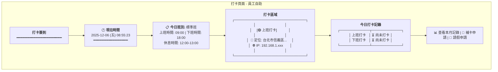

**頁面元素說明:**
- **時間顯示:** 即時更新的系統時間
- **班別資訊:** 顯示員工今日排定的班別
- **打卡按鈕:**
  - 上班時段顯示「上班打卡」（綠色）
  - 下班時段顯示「下班打卡」（藍色）
  - 已打卡顯示「已打卡 ✓」（灰色）
- **定位資訊:** 顯示GPS定位與IP
- **今日記錄:** 即時顯示上/下班打卡狀態

**元件規格:**
```typescript
interface CheckInPageData {
  currentTime: Date;
  shift: {
    shiftName: string;
    workStartTime: string;
    workEndTime: string;
    breakStartTime: string;
    breakEndTime: string;
  };
  todayRecord: {
    checkInTime: string | null;
    checkOutTime: string | null;
    isLate: boolean;
    lateMinutes: number;
  };
  location: {
    latitude: number;
    longitude: number;
    address: string;
  };
  ipAddress: string;
}
```

#### 2.2.2 我的差勤記錄頁面 (HR03-P02)

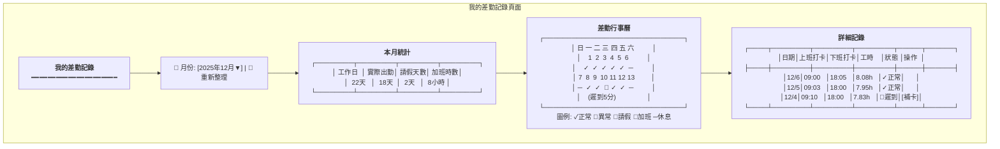

#### 2.2.3 請假申請頁面 (HR03-P03)

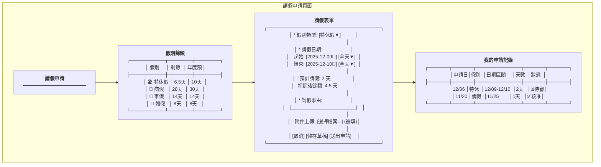

#### 2.2.4 差勤審核頁面 (HR03-P06)

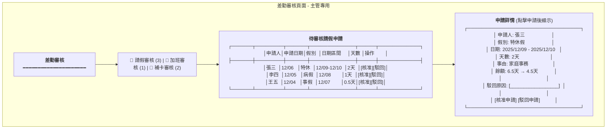

---

## 3. UX流程設計

### 3.1 員工打卡流程

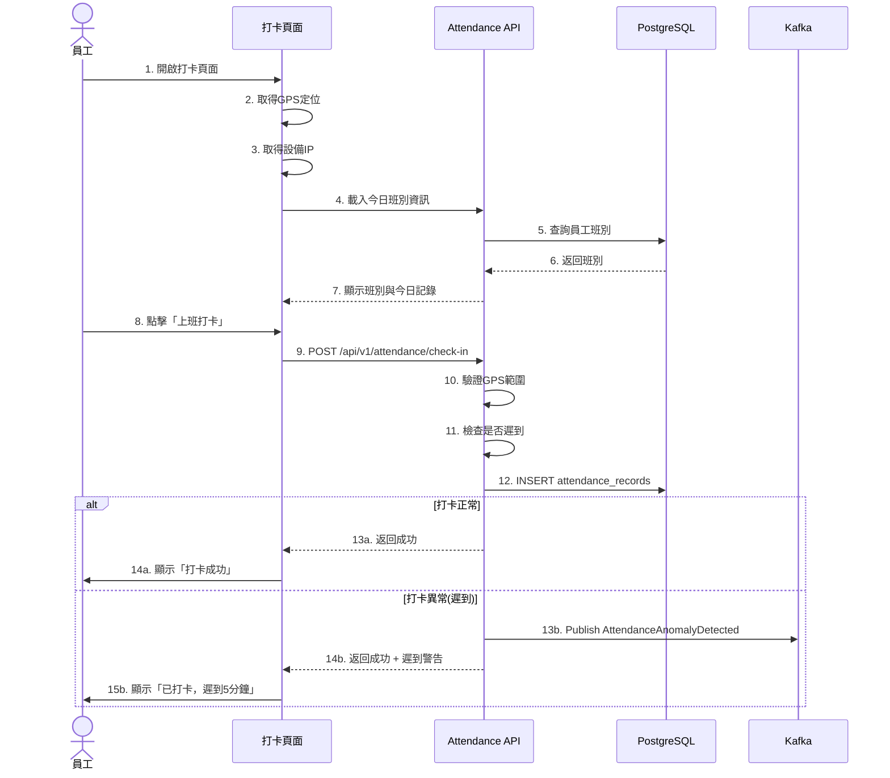

**關鍵點:**
- ✅ GPS定位驗證 (誤差<50m)
- ✅ 自動偵測遲到/早退
- ✅ 異常打卡發布事件通知

### 3.2 請假申請流程

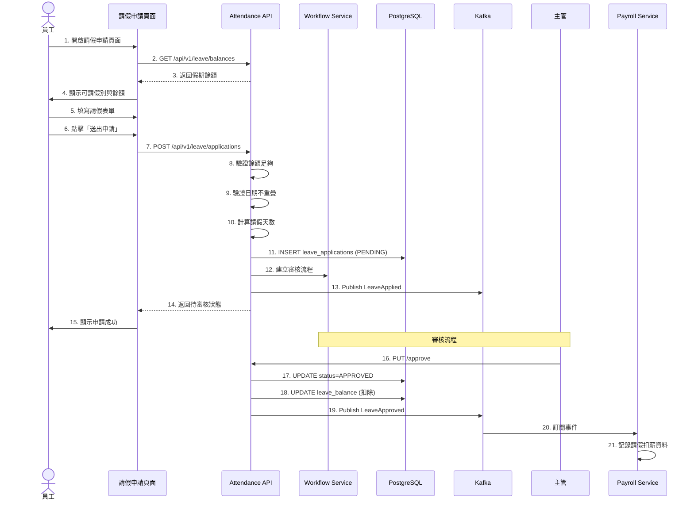

**關鍵點:**
- ✅ 即時餘額驗證
- ✅ 重疊日期檢查
- ✅ 整合Workflow審核流程
- ✅ 核准後自動扣除餘額
- ✅ 發布事件供Payroll計算

### 3.3 加班申請流程

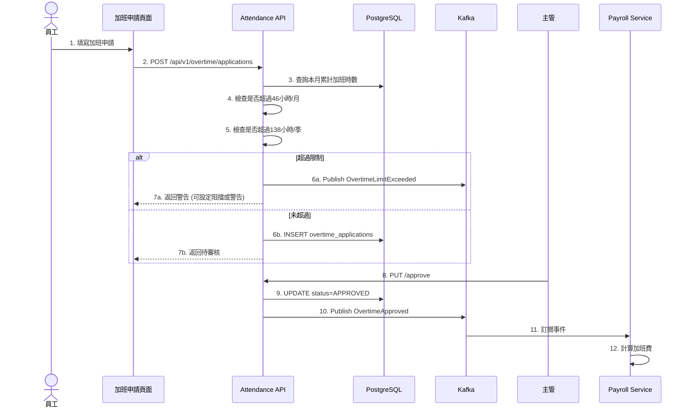

**關鍵點:**
- ✅ 勞基法加班時數管控 (46h/月、138h/季)
- ✅ 超時申請預警機制
- ✅ 審核後自動計算加班費/補休

---

*(文件持續，下一部分包含畫面事件說明、資料庫設計、Domain設計、API規格等)*


# Continued: 03_考勤管理服務系統設計書_part2.md

## 4. 畫面事件說明

### 4.1 打卡頁面事件 (HR03-P01)

| 事件ID | 觸發元素 | 事件類型 | 事件處理 | 後端API |
|:---|:---|:---|:---|:---|
| `E-ATT-01` | 頁面載入 | onMount | 取得GPS定位 + 載入班別 | GET /api/v1/attendance/today |
| `E-ATT-02` | 上班打卡按鈕 | onClick | 執行上班打卡 | POST /api/v1/attendance/check-in |
| `E-ATT-03` | 下班打卡按鈕 | onClick | 執行下班打卡 | POST /api/v1/attendance/check-out |
| `E-ATT-04` | 查看本月記錄 | onClick | 路由跳轉 | - |
| `E-ATT-05` | 補卡申請 | onClick | 開啟補卡對話框 | - |

**E-ATT-02 詳細流程:**
```typescript
const handleCheckIn = async () => {
  try {
    // 1. 取得當前位置
    const position = await getCurrentPosition();

    // 2. 組裝請求資料
    const request = {
      employeeId: currentUser.employeeId,
      checkInTime: new Date().toISOString(),
      location: {
        latitude: position.coords.latitude,
        longitude: position.coords.longitude
      },
      ipAddress: await getClientIP()
    };

    // 3. 呼叫API
    setLoading(true);
    const response = await attendanceService.checkIn(request);

    // 4. 更新本地狀態
    dispatch(setTodayRecord(response));

    // 5. 顯示結果
    if (response.isLate) {
      message.warning(`打卡成功，遲到 ${response.lateMinutes} 分鐘`);
    } else {
      message.success('打卡成功！');
    }

  } catch (error) {
    if (error.code === 'LOCATION_OUT_OF_RANGE') {
      message.error('您的位置不在允許的打卡範圍內');
    } else {
      message.error('打卡失敗，請稍後重試');
    }
  } finally {
    setLoading(false);
  }
};
```

### 4.2 差勤記錄頁面事件 (HR03-P02)

| 事件ID | 觸發元素 | 事件類型 | 事件處理 | 後端API |
|:---|:---|:---|:---|:---|
| `E-REC-01` | 月份選擇器 | onChange | 重新載入該月記錄 | GET /api/v1/attendance/records?month={month} |
| `E-REC-02` | 日曆日期點擊 | onClick | 顯示該日詳情 | - (本地篩選) |
| `E-REC-03` | 補卡按鈕 | onClick | 開啟補卡申請對話框 | - |
| `E-REC-04` | 補卡送出 | onClick | 提交補卡申請 | POST /api/v1/attendance/corrections |

### 4.3 請假申請頁面事件 (HR03-P03)

| 事件ID | 觸發元素 | 事件類型 | 事件處理 | 後端API |
|:---|:---|:---|:---|:---|
| `E-LV-01` | 頁面載入 | onMount | 載入假期餘額 | GET /api/v1/leave/balances |
| `E-LV-02` | 假別選擇器 | onChange | 更新表單驗證規則 | - |
| `E-LV-03` | 日期選擇器 | onChange | 計算請假天數 | GET /api/v1/leave/calculate-days |
| `E-LV-04` | 附件上傳 | onUpload | 上傳附件 | POST /api/v1/files/upload |
| `E-LV-05` | 儲存草稿 | onClick | 儲存至LocalStorage | - |
| `E-LV-06` | 送出申請 | onClick | 提交請假申請 | POST /api/v1/leave/applications |

**E-LV-06 詳細流程:**
```typescript
const handleSubmitLeave = async (values: LeaveFormData) => {
  try {
    // 1. 表單驗證
    await form.validateFields();

    // 2. 餘額檢查
    const selectedType = leaveTypes.find(t => t.leaveTypeId === values.leaveTypeId);
    const balance = balances.find(b => b.leaveTypeId === values.leaveTypeId);

    if (balance && values.totalDays > balance.remainingDays) {
      message.error(`剩餘餘額不足，目前剩餘 ${balance.remainingDays} 天`);
      return;
    }

    // 3. 組裝請求
    const request: CreateLeaveRequest = {
      employeeId: currentUser.employeeId,
      leaveTypeId: values.leaveTypeId,
      startDate: values.dateRange[0].format('YYYY-MM-DD'),
      endDate: values.dateRange[1].format('YYYY-MM-DD'),
      startPeriod: values.startPeriod,
      endPeriod: values.endPeriod,
      reason: values.reason,
      proofAttachmentUrl: values.attachmentUrl
    };

    // 4. 提交申請
    setSubmitting(true);
    const response = await leaveService.createApplication(request);

    // 5. 更新Redux狀態
    dispatch(addLeaveApplication(response));
    dispatch(refreshLeaveBalances());

    // 6. 顯示成功
    message.success('請假申請已送出，待主管審核');
    form.resetFields();

  } catch (error) {
    message.error('申請失敗: ' + error.message);
  } finally {
    setSubmitting(false);
  }
};
```

### 4.4 差勤審核頁面事件 (HR03-P06)

| 事件ID | 觸發元素 | 事件類型 | 事件處理 | 後端API |
|:---|:---|:---|:---|:---|
| `E-APR-01` | Tab切換 | onChange | 載入對應類型的待審清單 | GET /api/v1/attendance/approvals?type={type} |
| `E-APR-02` | 申請項目點擊 | onClick | 顯示申請詳情 | - |
| `E-APR-03` | 核准按鈕 | onClick | 確認核准 | PUT /api/v1/leave/applications/{id}/approve |
| `E-APR-04` | 駁回按鈕 | onClick | 開啟駁回原因對話框 | - |
| `E-APR-05` | 駁回確認 | onClick | 執行駁回 | PUT /api/v1/leave/applications/{id}/reject |
| `E-APR-06` | 批次核准 | onClick | 批次核准選中項目 | PUT /api/v1/leave/applications/batch-approve |

---

## 5. Data Flow設計

### 5.1 前端狀態管理 (Redux)

#### 5.1.1 State結構

```typescript
interface AttendanceState {
  // 打卡相關
  checkIn: {
    todayRecord: AttendanceRecord | null;
    shift: Shift | null;
    loading: boolean;
  };

  // 差勤記錄
  records: {
    list: AttendanceRecord[];
    selectedMonth: string;
    statistics: MonthlyStatistics | null;
    loading: boolean;
  };

  // 請假相關
  leave: {
    balances: LeaveBalance[];
    leaveTypes: LeaveType[];
    applications: LeaveApplication[];
    loading: boolean;
  };

  // 加班相關
  overtime: {
    applications: OvertimeApplication[];
    monthlyStatistics: OvertimeStatistics | null;
    loading: boolean;
  };

  // 審核相關 (主管)
  approvals: {
    pendingLeaves: LeaveApplication[];
    pendingOvertimes: OvertimeApplication[];
    pendingCorrections: CorrectionRequest[];
    loading: boolean;
  };
}

interface MonthlyStatistics {
  month: string;
  totalWorkDays: number;
  actualWorkDays: number;
  totalLeaveDays: number;
  totalOvertimeHours: number;
  lateCount: number;
  earlyLeaveCount: number;
}
```

#### 5.1.2 Redux Actions

```typescript
// 打卡相關Actions
export const attendanceActions = {
  loadTodayRecord: createAsyncThunk(
    'attendance/loadToday',
    async (employeeId: string) => {
      const response = await attendanceService.getTodayRecord(employeeId);
      return response;
    }
  ),

  checkIn: createAsyncThunk(
    'attendance/checkIn',
    async (request: CheckInRequest) => {
      const response = await attendanceService.checkIn(request);
      return response;
    }
  ),

  checkOut: createAsyncThunk(
    'attendance/checkOut',
    async (request: CheckOutRequest) => {
      const response = await attendanceService.checkOut(request);
      return response;
    }
  ),
};

// 請假相關Actions
export const leaveActions = {
  loadBalances: createAsyncThunk(
    'leave/loadBalances',
    async (employeeId: string) => {
      const response = await leaveService.getBalances(employeeId);
      return response;
    }
  ),

  createApplication: createAsyncThunk(
    'leave/createApplication',
    async (request: CreateLeaveRequest) => {
      const response = await leaveService.createApplication(request);
      return response;
    }
  ),

  approveLeave: createAsyncThunk(
    'leave/approve',
    async (applicationId: string) => {
      await leaveService.approveApplication(applicationId);
      return applicationId;
    }
  ),
};
```

### 5.2 前後端資料流

#### 5.2.1 打卡流程資料流

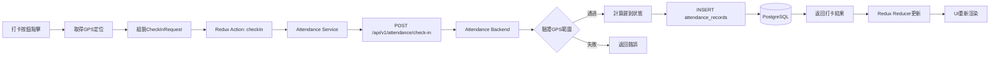

#### 5.2.2 請假審核資料流

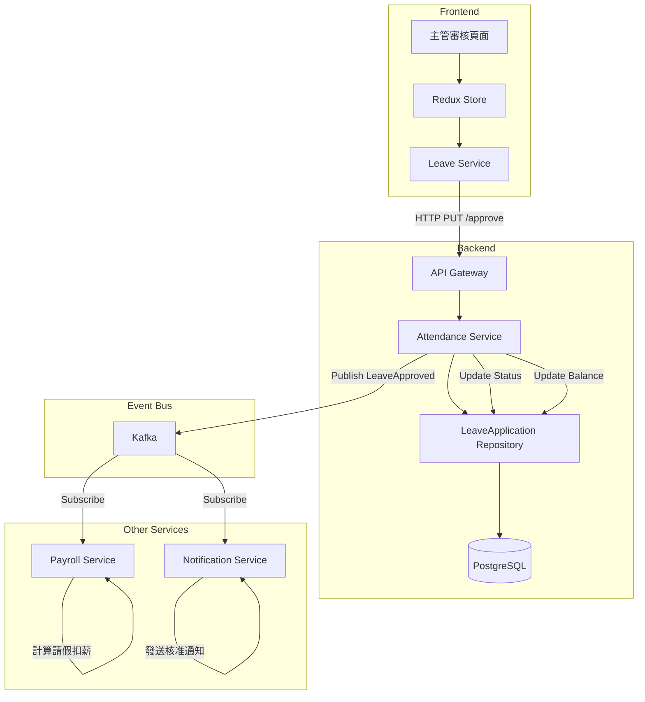

### 5.3 服務間資料流

#### 5.3.1 月度差勤結算事件流

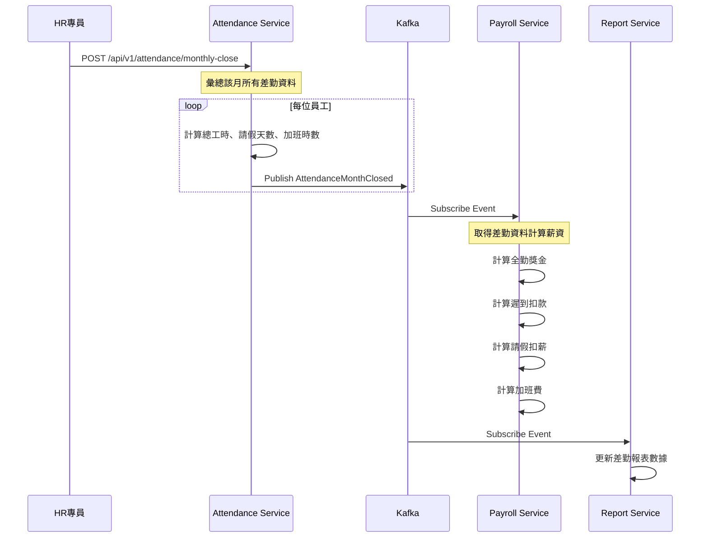

---

## 6. 資料庫設計

### 6.1 ER Diagram

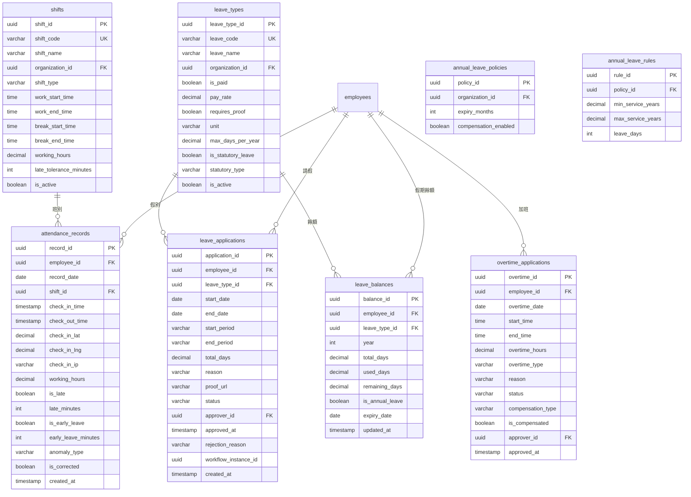

### 6.2 DDL Script

```sql
-- 班別表
CREATE TABLE shifts (
    shift_id UUID PRIMARY KEY DEFAULT gen_random_uuid(),
    shift_code VARCHAR(50) UNIQUE NOT NULL,
    shift_name VARCHAR(255) NOT NULL,
    organization_id UUID NOT NULL,
    shift_type VARCHAR(20) NOT NULL CHECK (shift_type IN ('STANDARD', 'FLEXIBLE', 'ROTATING')),
    work_start_time TIME NOT NULL,
    work_end_time TIME NOT NULL,
    break_start_time TIME,
    break_end_time TIME,
    working_hours DECIMAL(4,2) NOT NULL,
    late_tolerance_minutes INTEGER DEFAULT 0,
    early_leave_tolerance_minutes INTEGER DEFAULT 0,
    is_active BOOLEAN DEFAULT TRUE,
    created_at TIMESTAMP DEFAULT CURRENT_TIMESTAMP,
    updated_at TIMESTAMP DEFAULT CURRENT_TIMESTAMP
);

CREATE INDEX idx_shifts_org ON shifts(organization_id);
CREATE INDEX idx_shifts_active ON shifts(is_active) WHERE is_active = TRUE;

COMMENT ON TABLE shifts IS '班別設定表';
COMMENT ON COLUMN shifts.shift_type IS '班別類型: STANDARD標準班, FLEXIBLE彈性班, ROTATING輪班';
COMMENT ON COLUMN shifts.late_tolerance_minutes IS '遲到容許分鐘數';

-- 假別表
CREATE TABLE leave_types (
    leave_type_id UUID PRIMARY KEY DEFAULT gen_random_uuid(),
    leave_code VARCHAR(50) UNIQUE NOT NULL,
    leave_name VARCHAR(255) NOT NULL,
    organization_id UUID,
    is_paid BOOLEAN DEFAULT FALSE,
    pay_rate DECIMAL(3,2) DEFAULT 0 CHECK (pay_rate >= 0 AND pay_rate <= 1),
    requires_proof BOOLEAN DEFAULT FALSE,
    proof_description TEXT,
    unit VARCHAR(20) NOT NULL CHECK (unit IN ('HOUR', 'HALF_DAY', 'FULL_DAY')),
    max_days_per_year DECIMAL(5,2),
    can_carryover BOOLEAN DEFAULT FALSE,
    is_statutory_leave BOOLEAN DEFAULT FALSE,
    statutory_type VARCHAR(50),
    is_active BOOLEAN DEFAULT TRUE,
    created_at TIMESTAMP DEFAULT CURRENT_TIMESTAMP
);

CREATE INDEX idx_leave_types_org ON leave_types(organization_id);
CREATE INDEX idx_leave_types_statutory ON leave_types(is_statutory_leave);

COMMENT ON TABLE leave_types IS '假別設定表';
COMMENT ON COLUMN leave_types.is_paid IS '是否支薪';
COMMENT ON COLUMN leave_types.pay_rate IS '支薪比例 (1=全薪, 0.5=半薪)';
COMMENT ON COLUMN leave_types.statutory_type IS '法定假別類型: ANNUAL_LEAVE, SICK_LEAVE, MARRIAGE_LEAVE等';

-- 打卡記錄表
CREATE TABLE attendance_records (
    record_id UUID PRIMARY KEY DEFAULT gen_random_uuid(),
    employee_id UUID NOT NULL,
    record_date DATE NOT NULL,
    shift_id UUID REFERENCES shifts(shift_id),
    check_in_time TIMESTAMP,
    check_out_time TIMESTAMP,
    check_in_latitude DECIMAL(10,7),
    check_in_longitude DECIMAL(10,7),
    check_in_ip VARCHAR(50),
    check_out_latitude DECIMAL(10,7),
    check_out_longitude DECIMAL(10,7),
    check_out_ip VARCHAR(50),
    working_hours DECIMAL(5,2),
    is_late BOOLEAN DEFAULT FALSE,
    late_minutes INTEGER DEFAULT 0,
    is_early_leave BOOLEAN DEFAULT FALSE,
    early_leave_minutes INTEGER DEFAULT 0,
    anomaly_type VARCHAR(30) CHECK (anomaly_type IN ('LATE', 'EARLY_LEAVE', 'MISSING_CHECK_IN', 'MISSING_CHECK_OUT', 'ABNORMAL_LOCATION')),
    anomaly_note TEXT,
    is_corrected BOOLEAN DEFAULT FALSE,
    created_at TIMESTAMP DEFAULT CURRENT_TIMESTAMP,
    updated_at TIMESTAMP DEFAULT CURRENT_TIMESTAMP,

    CONSTRAINT uk_attendance_employee_date UNIQUE (employee_id, record_date)
);

CREATE INDEX idx_attendance_employee ON attendance_records(employee_id);
CREATE INDEX idx_attendance_date ON attendance_records(record_date);
CREATE INDEX idx_attendance_anomaly ON attendance_records(anomaly_type) WHERE anomaly_type IS NOT NULL;

COMMENT ON TABLE attendance_records IS '打卡記錄表';
COMMENT ON COLUMN attendance_records.anomaly_type IS '異常類型: LATE遲到, EARLY_LEAVE早退, MISSING_CHECK_IN忘打上班卡等';

-- 請假申請表
CREATE TABLE leave_applications (
    application_id UUID PRIMARY KEY DEFAULT gen_random_uuid(),
    employee_id UUID NOT NULL,
    leave_type_id UUID NOT NULL REFERENCES leave_types(leave_type_id),
    start_date DATE NOT NULL,
    end_date DATE NOT NULL,
    start_period VARCHAR(10) NOT NULL CHECK (start_period IN ('AM', 'PM', 'FULL_DAY')),
    end_period VARCHAR(10) NOT NULL CHECK (end_period IN ('AM', 'PM', 'FULL_DAY')),
    total_days DECIMAL(4,1) NOT NULL,
    total_hours DECIMAL(5,1),
    reason TEXT NOT NULL,
    proof_attachment_url VARCHAR(500),
    applied_at TIMESTAMP DEFAULT CURRENT_TIMESTAMP,
    status VARCHAR(20) NOT NULL DEFAULT 'PENDING' CHECK (status IN ('DRAFT', 'PENDING', 'APPROVED', 'REJECTED', 'CANCELLED')),
    approver_id UUID,
    approved_at TIMESTAMP,
    rejection_reason TEXT,
    workflow_instance_id UUID,
    created_at TIMESTAMP DEFAULT CURRENT_TIMESTAMP,
    updated_at TIMESTAMP DEFAULT CURRENT_TIMESTAMP,

    CONSTRAINT chk_leave_dates CHECK (end_date >= start_date)
);

CREATE INDEX idx_leave_app_employee ON leave_applications(employee_id);
CREATE INDEX idx_leave_app_status ON leave_applications(status);
CREATE INDEX idx_leave_app_dates ON leave_applications(start_date, end_date);
CREATE INDEX idx_leave_app_approver ON leave_applications(approver_id) WHERE status = 'PENDING';

COMMENT ON TABLE leave_applications IS '請假申請表';
COMMENT ON COLUMN leave_applications.start_period IS '起始時段: AM上午, PM下午, FULL_DAY全天';

-- 加班申請表
CREATE TABLE overtime_applications (
    overtime_id UUID PRIMARY KEY DEFAULT gen_random_uuid(),
    employee_id UUID NOT NULL,
    overtime_date DATE NOT NULL,
    start_time TIME NOT NULL,
    end_time TIME NOT NULL,
    overtime_hours DECIMAL(4,1) NOT NULL,
    overtime_type VARCHAR(20) NOT NULL CHECK (overtime_type IN ('WEEKDAY', 'REST_DAY', 'HOLIDAY')),
    reason TEXT NOT NULL,
    applied_at TIMESTAMP DEFAULT CURRENT_TIMESTAMP,
    status VARCHAR(20) NOT NULL DEFAULT 'PENDING' CHECK (status IN ('DRAFT', 'PENDING', 'APPROVED', 'REJECTED', 'CANCELLED')),
    approver_id UUID,
    approved_at TIMESTAMP,
    rejection_reason TEXT,
    compensation_type VARCHAR(20) CHECK (compensation_type IN ('PAY', 'COMP_TIME')),
    is_compensated BOOLEAN DEFAULT FALSE,
    workflow_instance_id UUID,
    created_at TIMESTAMP DEFAULT CURRENT_TIMESTAMP,
    updated_at TIMESTAMP DEFAULT CURRENT_TIMESTAMP,

    CONSTRAINT chk_overtime_times CHECK (end_time > start_time)
);

CREATE INDEX idx_overtime_employee ON overtime_applications(employee_id);
CREATE INDEX idx_overtime_date ON overtime_applications(overtime_date);
CREATE INDEX idx_overtime_status ON overtime_applications(status);

COMMENT ON TABLE overtime_applications IS '加班申請表';
COMMENT ON COLUMN overtime_applications.overtime_type IS '加班類型: WEEKDAY平日, REST_DAY休息日, HOLIDAY國定假日';
COMMENT ON COLUMN overtime_applications.compensation_type IS '補償方式: PAY加班費, COMP_TIME補休';

-- 假期餘額表
CREATE TABLE leave_balances (
    balance_id UUID PRIMARY KEY DEFAULT gen_random_uuid(),
    employee_id UUID NOT NULL,
    leave_type_id UUID NOT NULL REFERENCES leave_types(leave_type_id),
    year INTEGER NOT NULL,
    total_days DECIMAL(5,1) NOT NULL,
    used_days DECIMAL(5,1) NOT NULL DEFAULT 0,
    carry_over_days DECIMAL(5,1) NOT NULL DEFAULT 0,
    is_annual_leave BOOLEAN DEFAULT FALSE,
    expiry_date DATE,
    updated_at TIMESTAMP DEFAULT CURRENT_TIMESTAMP,

    CONSTRAINT uk_balance_emp_type_year UNIQUE (employee_id, leave_type_id, year)
);

CREATE INDEX idx_balance_employee ON leave_balances(employee_id);
CREATE INDEX idx_balance_expiry ON leave_balances(expiry_date) WHERE is_annual_leave = TRUE;

COMMENT ON TABLE leave_balances IS '假期餘額表';
COMMENT ON COLUMN leave_balances.carry_over_days IS '上年度結轉天數';
COMMENT ON COLUMN leave_balances.expiry_date IS '特休假到期日';

-- 特休假政策表
CREATE TABLE annual_leave_policies (
    policy_id UUID PRIMARY KEY DEFAULT gen_random_uuid(),
    organization_id UUID NOT NULL UNIQUE,
    annual_leave_system VARCHAR(20) NOT NULL DEFAULT 'CALENDAR_YEAR',
    overdraw_policy VARCHAR(30) NOT NULL DEFAULT 'DENY',
    expiry_policy VARCHAR(30) NOT NULL DEFAULT 'PAY_COMPENSATION',
    carry_over_limit INTEGER,
    expiry_months INTEGER DEFAULT 12,
    compensation_enabled BOOLEAN DEFAULT TRUE,
    created_at TIMESTAMP DEFAULT CURRENT_TIMESTAMP
);

COMMENT ON COLUMN annual_leave_policies.annual_leave_system IS '年度制度: CALENDAR_YEAR歷年制, ANNIVERSARY週年制';
COMMENT ON COLUMN annual_leave_policies.overdraw_policy IS '超額請假政策: DENY拒絕, CONVERT_TO_PERSONAL轉事假, ADVANCE預支';
COMMENT ON COLUMN annual_leave_policies.expiry_policy IS '未休假處理: CARRYOVER結轉, PAY_COMPENSATION折薪, FORFEIT作廢';
COMMENT ON COLUMN annual_leave_policies.carry_over_limit IS '結轉上限天數（CARRYOVER政策使用）';

-- 特休假規則表 (年資對應天數)
CREATE TABLE annual_leave_rules (
    rule_id UUID PRIMARY KEY DEFAULT gen_random_uuid(),
    policy_id UUID NOT NULL REFERENCES annual_leave_policies(policy_id),
    min_service_years DECIMAL(4,2) NOT NULL,
    max_service_years DECIMAL(4,2),
    leave_days INTEGER NOT NULL,

    CONSTRAINT uk_rule_policy_years UNIQUE (policy_id, min_service_years)
);

COMMENT ON TABLE annual_leave_rules IS '特休假規則表 (依勞基法年資對應天數)';

-- 補卡申請表
CREATE TABLE attendance_corrections (
    correction_id UUID PRIMARY KEY DEFAULT gen_random_uuid(),
    record_id UUID NOT NULL REFERENCES attendance_records(record_id),
    employee_id UUID NOT NULL,
    correction_type VARCHAR(20) NOT NULL CHECK (correction_type IN ('CHECK_IN', 'CHECK_OUT')),
    original_time TIMESTAMP,
    corrected_time TIMESTAMP NOT NULL,
    reason TEXT NOT NULL,
    status VARCHAR(20) NOT NULL DEFAULT 'PENDING' CHECK (status IN ('PENDING', 'APPROVED', 'REJECTED')),
    approver_id UUID,
    approved_at TIMESTAMP,
    created_at TIMESTAMP DEFAULT CURRENT_TIMESTAMP
);

CREATE INDEX idx_correction_employee ON attendance_corrections(employee_id);
CREATE INDEX idx_correction_status ON attendance_corrections(status);

COMMENT ON TABLE attendance_corrections IS '補卡申請表';
```

### 6.3 資料字典

| 表名 | 欄位 | 類型 | 說明 | 備註 |
|:---|:---|:---|:---|:---|
| `shifts` | shift_type | ENUM | 班別類型 | STANDARD/FLEXIBLE/ROTATING |
| `leave_types` | unit | ENUM | 請假單位 | HOUR/HALF_DAY/FULL_DAY |
| `leave_types` | statutory_type | ENUM | 法定假別 | ANNUAL_LEAVE, SICK_LEAVE等 |
| `attendance_records` | anomaly_type | ENUM | 異常類型 | LATE, EARLY_LEAVE等 |
| `leave_applications` | status | ENUM | 申請狀態 | DRAFT/PENDING/APPROVED/REJECTED/CANCELLED |
| `overtime_applications` | overtime_type | ENUM | 加班類型 | WEEKDAY/REST_DAY/HOLIDAY |
| `overtime_applications` | compensation_type | ENUM | 補償方式 | PAY/COMP_TIME |

### 6.4 初始化資料

```sql
-- 初始化法定假別
INSERT INTO leave_types (leave_code, leave_name, is_paid, pay_rate, requires_proof, unit, max_days_per_year, is_statutory_leave, statutory_type) VALUES
('ANNUAL', '特休假', TRUE, 1.0, FALSE, 'FULL_DAY', NULL, TRUE, 'ANNUAL_LEAVE'),
('SICK', '病假', FALSE, 0.5, TRUE, 'HALF_DAY', 30, TRUE, 'SICK_LEAVE'),
('PERSONAL', '事假', FALSE, 0.0, FALSE, 'HALF_DAY', 14, TRUE, 'PERSONAL_LEAVE'),
('MARRIAGE', '婚假', TRUE, 1.0, TRUE, 'FULL_DAY', 8, TRUE, 'MARRIAGE_LEAVE'),
('BEREAVEMENT_PARENT', '喪假(父母)', TRUE, 1.0, TRUE, 'FULL_DAY', 8, TRUE, 'BEREAVEMENT_LEAVE'),
('BEREAVEMENT_SPOUSE', '喪假(配偶)', TRUE, 1.0, TRUE, 'FULL_DAY', 8, TRUE, 'BEREAVEMENT_LEAVE'),
('BEREAVEMENT_CHILD', '喪假(子女)', TRUE, 1.0, TRUE, 'FULL_DAY', 8, TRUE, 'BEREAVEMENT_LEAVE'),
('MATERNITY', '產假', TRUE, 1.0, TRUE, 'FULL_DAY', 56, TRUE, 'MATERNITY_LEAVE'),
('PATERNITY', '陪產假', TRUE, 1.0, TRUE, 'FULL_DAY', 7, TRUE, 'PATERNITY_LEAVE'),
('MENSTRUAL', '生理假', FALSE, 0.5, FALSE, 'FULL_DAY', 12, TRUE, 'MENSTRUAL_LEAVE'),
('PARENTAL', '育嬰留停', FALSE, 0.0, TRUE, 'FULL_DAY', NULL, TRUE, 'PARENTAL_LEAVE'),
('COMP_TIME', '補休', TRUE, 1.0, FALSE, 'HOUR', NULL, FALSE, NULL);

-- 初始化標準班別
INSERT INTO shifts (shift_code, shift_name, organization_id, shift_type, work_start_time, work_end_time, break_start_time, break_end_time, working_hours, late_tolerance_minutes) VALUES
('STD', '標準班', '00000000-0000-0000-0000-000000000001', 'STANDARD', '09:00', '18:00', '12:00', '13:00', 8.0, 5),
('FLEX_A', '彈性班A(08:00-17:00)', '00000000-0000-0000-0000-000000000001', 'FLEXIBLE', '08:00', '17:00', '12:00', '13:00', 8.0, 0),
('FLEX_B', '彈性班B(10:00-19:00)', '00000000-0000-0000-0000-000000000001', 'FLEXIBLE', '10:00', '19:00', '12:00', '13:00', 8.0, 0);

-- 初始化特休假規則 (勞基法)
INSERT INTO annual_leave_policies (organization_id, expiry_months, compensation_enabled) VALUES
('00000000-0000-0000-0000-000000000001', 12, TRUE);

INSERT INTO annual_leave_rules (policy_id, min_service_years, max_service_years, leave_days) VALUES
((SELECT policy_id FROM annual_leave_policies LIMIT 1), 0.5, 1, 3),
((SELECT policy_id FROM annual_leave_policies LIMIT 1), 1, 2, 7),
((SELECT policy_id FROM annual_leave_policies LIMIT 1), 2, 3, 10),
((SELECT policy_id FROM annual_leave_policies LIMIT 1), 3, 5, 14),
((SELECT policy_id FROM annual_leave_policies LIMIT 1), 5, 10, 15),
((SELECT policy_id FROM annual_leave_policies LIMIT 1), 10, NULL, 15);  -- 10年以上每年+1天，由程式計算
```

---

*(文件持續，下一部分包含Domain設計、領域事件設計、完整API規格等)*


# Continued: 03_考勤管理服務系統設計書_part3.md

## 7. Domain設計

### 7.1 聚合根 (Aggregate Root)

#### 7.1.1 Shift聚合根 (班別)

**職責:** 定義工作班別與工時規則

**Java實作:**
```java
@Entity
@Table(name = "shifts")
public class Shift {
    @EmbeddedId
    private ShiftId id;

    @Column(name = "shift_code", unique = true, nullable = false)
    private String shiftCode;

    @Column(name = "shift_name", nullable = false)
    private String shiftName;

    @Column(name = "organization_id", nullable = false)
    private UUID organizationId;

    @Enumerated(EnumType.STRING)
    @Column(name = "shift_type", nullable = false)
    private ShiftType shiftType;

    @Embedded
    private WorkingTime workingTime;

    @Column(name = "late_tolerance_minutes")
    private Integer lateToleranceMinutes;

    @Column(name = "early_leave_tolerance_minutes")
    private Integer earlyLeaveToleranceMinutes;

    @Column(name = "is_active")
    private boolean isActive;

    // ========== Domain行為 ==========

    /**
     * 檢查打卡時間是否遲到
     */
    public LateResult checkLate(LocalTime checkInTime) {
        LocalTime tolerance = workingTime.getWorkStartTime()
            .plusMinutes(lateToleranceMinutes);

        if (checkInTime.isAfter(tolerance)) {
            int lateMinutes = (int) Duration.between(
                workingTime.getWorkStartTime(), checkInTime).toMinutes();
            return new LateResult(true, lateMinutes);
        }
        return new LateResult(false, 0);
    }

    /**
     * 檢查打卡時間是否早退
     */
    public EarlyLeaveResult checkEarlyLeave(LocalTime checkOutTime) {
        LocalTime tolerance = workingTime.getWorkEndTime()
            .minusMinutes(earlyLeaveToleranceMinutes);

        if (checkOutTime.isBefore(tolerance)) {
            int earlyMinutes = (int) Duration.between(
                checkOutTime, workingTime.getWorkEndTime()).toMinutes();
            return new EarlyLeaveResult(true, earlyMinutes);
        }
        return new EarlyLeaveResult(false, 0);
    }

    /**
     * 計算實際工時
     */
    public BigDecimal calculateWorkingHours(LocalTime checkIn, LocalTime checkOut) {
        Duration workDuration = Duration.between(checkIn, checkOut);

        // 扣除休息時間
        if (hasBreakTime()) {
            Duration breakDuration = Duration.between(
                workingTime.getBreakStartTime(),
                workingTime.getBreakEndTime());
            workDuration = workDuration.minus(breakDuration);
        }

        return BigDecimal.valueOf(workDuration.toMinutes())
            .divide(BigDecimal.valueOf(60), 2, RoundingMode.HALF_UP);
    }
}

// 值對象
@Embeddable
public class WorkingTime {
    @Column(name = "work_start_time")
    private LocalTime workStartTime;

    @Column(name = "work_end_time")
    private LocalTime workEndTime;

    @Column(name = "break_start_time")
    private LocalTime breakStartTime;

    @Column(name = "break_end_time")
    private LocalTime breakEndTime;
}
```

#### 7.1.2 AttendanceRecord聚合根 (打卡記錄)

**職責:** 記錄員工打卡與計算出勤狀態

**Java實作:**
```java
@Entity
@Table(name = "attendance_records")
public class AttendanceRecord {
    @EmbeddedId
    private RecordId id;

    @Column(name = "employee_id", nullable = false)
    private UUID employeeId;

    @Column(name = "record_date", nullable = false)
    private LocalDate recordDate;

    @Column(name = "shift_id")
    private UUID shiftId;

    @Embedded
    private CheckInInfo checkInInfo;

    @Embedded
    private CheckOutInfo checkOutInfo;

    @Column(name = "working_hours")
    private BigDecimal workingHours;

    @Column(name = "is_late")
    private boolean isLate;

    @Column(name = "late_minutes")
    private int lateMinutes;

    @Column(name = "is_early_leave")
    private boolean isEarlyLeave;

    @Column(name = "early_leave_minutes")
    private int earlyLeaveMinutes;

    @Enumerated(EnumType.STRING)
    @Column(name = "anomaly_type")
    private AnomalyType anomalyType;

    @Column(name = "is_corrected")
    private boolean isCorrected;

    // ========== Factory Method ==========

    /**
     * 上班打卡
     */
    public static AttendanceRecord checkIn(
            UUID employeeId,
            LocalDate date,
            Shift shift,
            CheckInRequest request) {

        AttendanceRecord record = new AttendanceRecord();
        record.id = RecordId.generate();
        record.employeeId = employeeId;
        record.recordDate = date;
        record.shiftId = shift.getId().getValue();

        // 設定打卡資訊
        record.checkInInfo = new CheckInInfo(
            request.getCheckInTime(),
            request.getLatitude(),
            request.getLongitude(),
            request.getIpAddress()
        );

        // 檢查遲到
        LateResult lateResult = shift.checkLate(
            request.getCheckInTime().toLocalTime());
        record.isLate = lateResult.isLate();
        record.lateMinutes = lateResult.getLateMinutes();

        if (record.isLate) {
            record.anomalyType = AnomalyType.LATE;

            // 發布異常事件
            DomainEventPublisher.publish(new AttendanceAnomalyDetectedEvent(
                record.employeeId,
                record.recordDate,
                AnomalyType.LATE,
                record.lateMinutes
            ));
        }

        // 發布打卡事件
        DomainEventPublisher.publish(new AttendanceRecordedEvent(
            record.id.getValue(),
            record.employeeId,
            record.recordDate,
            record.checkInInfo.getCheckInTime(),
            null
        ));

        return record;
    }

    /**
     * 下班打卡
     */
    public void checkOut(Shift shift, CheckOutRequest request) {
        if (this.checkOutInfo != null && this.checkOutInfo.getCheckOutTime() != null) {
            throw new DomainException("今日已完成下班打卡");
        }

        this.checkOutInfo = new CheckOutInfo(
            request.getCheckOutTime(),
            request.getLatitude(),
            request.getLongitude(),
            request.getIpAddress()
        );

        // 檢查早退
        EarlyLeaveResult result = shift.checkEarlyLeave(
            request.getCheckOutTime().toLocalTime());
        this.isEarlyLeave = result.isEarlyLeave();
        this.earlyLeaveMinutes = result.getEarlyMinutes();

        if (this.isEarlyLeave) {
            this.anomalyType = AnomalyType.EARLY_LEAVE;
        }

        // 計算工時
        this.workingHours = shift.calculateWorkingHours(
            this.checkInInfo.getCheckInTime().toLocalTime(),
            request.getCheckOutTime().toLocalTime()
        );
    }

    /**
     * 補卡
     */
    public void correct(LocalDateTime correctedTime, CorrectionType type) {
        if (type == CorrectionType.CHECK_IN) {
            this.checkInInfo = new CheckInInfo(
                correctedTime, null, null, "CORRECTED");
            this.isLate = false;
            this.lateMinutes = 0;
        } else {
            this.checkOutInfo = new CheckOutInfo(
                correctedTime, null, null, "CORRECTED");
            this.isEarlyLeave = false;
            this.earlyLeaveMinutes = 0;
        }
        this.isCorrected = true;
        this.anomalyType = null;
    }
}

// 值對象
@Embeddable
public class CheckInInfo {
    @Column(name = "check_in_time")
    private LocalDateTime checkInTime;

    @Column(name = "check_in_latitude")
    private BigDecimal latitude;

    @Column(name = "check_in_longitude")
    private BigDecimal longitude;

    @Column(name = "check_in_ip")
    private String ipAddress;
}
```

#### 7.1.3 LeaveApplication聚合根 (請假申請)

**職責:** 管理員工請假申請與審核

**Java實作:**
```java
@Entity
@Table(name = "leave_applications")
public class LeaveApplication {
    @EmbeddedId
    private ApplicationId id;

    @Column(name = "employee_id", nullable = false)
    private UUID employeeId;

    @Column(name = "leave_type_id", nullable = false)
    private UUID leaveTypeId;

    @Embedded
    private LeavePeriod leavePeriod;

    @Column(name = "total_days", nullable = false)
    private BigDecimal totalDays;

    @Column(name = "reason", nullable = false)
    private String reason;

    @Column(name = "proof_attachment_url")
    private String proofAttachmentUrl;

    @Enumerated(EnumType.STRING)
    @Column(name = "status", nullable = false)
    private ApplicationStatus status;

    @Column(name = "approver_id")
    private UUID approverId;

    @Column(name = "approved_at")
    private LocalDateTime approvedAt;

    @Column(name = "rejection_reason")
    private String rejectionReason;

    // ========== Factory Method ==========

    /**
     * 建立請假申請
     */
    public static LeaveApplication create(
            UUID employeeId,
            LeaveType leaveType,
            LeaveBalance balance,
            CreateLeaveRequest request) {

        // 計算請假天數
        BigDecimal days = calculateLeaveDays(
            request.getStartDate(),
            request.getEndDate(),
            request.getStartPeriod(),
            request.getEndPeriod()
        );

        // 驗證餘額
        if (balance.getRemainingDays().compareTo(days) < 0) {
            throw new DomainException(
                String.format("假期餘額不足，剩餘 %s 天，申請 %s 天",
                    balance.getRemainingDays(), days));
        }

        // 驗證是否需要證明文件
        if (leaveType.isRequiresProof() &&
            StringUtils.isBlank(request.getProofAttachmentUrl())) {
            throw new DomainException("此假別需要上傳證明文件");
        }

        LeaveApplication app = new LeaveApplication();
        app.id = ApplicationId.generate();
        app.employeeId = employeeId;
        app.leaveTypeId = leaveType.getId().getValue();
        app.leavePeriod = new LeavePeriod(
            request.getStartDate(),
            request.getEndDate(),
            request.getStartPeriod(),
            request.getEndPeriod()
        );
        app.totalDays = days;
        app.reason = request.getReason();
        app.proofAttachmentUrl = request.getProofAttachmentUrl();
        app.status = ApplicationStatus.PENDING;

        // 發布事件
        DomainEventPublisher.publish(new LeaveAppliedEvent(
            app.id.getValue(),
            app.employeeId,
            app.leaveTypeId,
            app.totalDays
        ));

        return app;
    }

    /**
     * 核准
     */
    public void approve(UUID approverId, LeaveBalance balance) {
        if (this.status != ApplicationStatus.PENDING) {
            throw new DomainException("只能核准待審核的申請");
        }

        this.status = ApplicationStatus.APPROVED;
        this.approverId = approverId;
        this.approvedAt = LocalDateTime.now();

        // 扣除餘額
        balance.deduct(this.totalDays);

        // 發布事件
        DomainEventPublisher.publish(new LeaveApprovedEvent(
            this.id.getValue(),
            this.employeeId,
            this.leaveTypeId,
            this.totalDays
        ));
    }

    /**
     * 駁回
     */
    public void reject(UUID approverId, String reason) {
        if (this.status != ApplicationStatus.PENDING) {
            throw new DomainException("只能駁回待審核的申請");
        }

        this.status = ApplicationStatus.REJECTED;
        this.approverId = approverId;
        this.rejectionReason = reason;

        DomainEventPublisher.publish(new LeaveRejectedEvent(
            this.id.getValue(),
            this.employeeId,
            reason
        ));
    }

    /**
     * 取消
     */
    public void cancel(LeaveBalance balance) {
        if (this.status == ApplicationStatus.CANCELLED) {
            throw new DomainException("申請已取消");
        }

        // 若已核准，退回餘額
        if (this.status == ApplicationStatus.APPROVED) {
            balance.refund(this.totalDays);
        }

        this.status = ApplicationStatus.CANCELLED;
    }
}
```

#### 7.1.4 OvertimeApplication聚合根 (加班申請)

**職責:** 管理員工加班申請，包含勞基法時數管控

**Java實作:**
```java
@Entity
@Table(name = "overtime_applications")
public class OvertimeApplication {
    @EmbeddedId
    private OvertimeId id;

    @Column(name = "employee_id", nullable = false)
    private UUID employeeId;

    @Column(name = "overtime_date", nullable = false)
    private LocalDate overtimeDate;

    @Column(name = "start_time", nullable = false)
    private LocalTime startTime;

    @Column(name = "end_time", nullable = false)
    private LocalTime endTime;

    @Column(name = "overtime_hours", nullable = false)
    private BigDecimal overtimeHours;

    @Enumerated(EnumType.STRING)
    @Column(name = "overtime_type", nullable = false)
    private OvertimeType overtimeType;

    @Column(name = "reason", nullable = false)
    private String reason;

    @Enumerated(EnumType.STRING)
    @Column(name = "status", nullable = false)
    private ApplicationStatus status;

    @Enumerated(EnumType.STRING)
    @Column(name = "compensation_type")
    private CompensationType compensationType;

    @Column(name = "is_compensated")
    private boolean isCompensated;

    // 勞基法限制常數
    private static final BigDecimal MONTHLY_LIMIT = new BigDecimal("46");
    private static final BigDecimal QUARTERLY_LIMIT = new BigDecimal("138");

    // ========== Factory Method ==========

    /**
     * 建立加班申請
     */
    public static OvertimeApplication create(
            UUID employeeId,
            OvertimeStatistics statistics,
            CreateOvertimeRequest request) {

        // 計算加班時數
        BigDecimal hours = calculateHours(request.getStartTime(), request.getEndTime());

        // 檢查月加班上限 (46小時)
        BigDecimal newMonthly = statistics.getMonthlyHours().add(hours);
        if (newMonthly.compareTo(MONTHLY_LIMIT) > 0) {
            DomainEventPublisher.publish(new OvertimeLimitExceededEvent(
                employeeId,
                newMonthly,
                MONTHLY_LIMIT,
                "MONTHLY"
            ));
            throw new DomainException(
                String.format("超過月加班上限，目前累計 %s 小時 + 本次 %s 小時 > 46小時",
                    statistics.getMonthlyHours(), hours));
        }

        // 檢查季加班上限 (138小時)
        BigDecimal newQuarterly = statistics.getQuarterlyHours().add(hours);
        if (newQuarterly.compareTo(QUARTERLY_LIMIT) > 0) {
            DomainEventPublisher.publish(new OvertimeLimitExceededEvent(
                employeeId,
                newQuarterly,
                QUARTERLY_LIMIT,
                "QUARTERLY"
            ));
            throw new DomainException("超過季加班上限 (138小時)");
        }

        OvertimeApplication app = new OvertimeApplication();
        app.id = OvertimeId.generate();
        app.employeeId = employeeId;
        app.overtimeDate = request.getOvertimeDate();
        app.startTime = request.getStartTime();
        app.endTime = request.getEndTime();
        app.overtimeHours = hours;
        app.overtimeType = request.getOvertimeType();
        app.reason = request.getReason();
        app.compensationType = request.getCompensationType();
        app.status = ApplicationStatus.PENDING;

        DomainEventPublisher.publish(new OvertimeAppliedEvent(
            app.id.getValue(),
            app.employeeId,
            app.overtimeHours,
            app.overtimeType
        ));

        return app;
    }

    /**
     * 核准
     */
    public void approve(UUID approverId) {
        if (this.status != ApplicationStatus.PENDING) {
            throw new DomainException("只能核准待審核的申請");
        }

        this.status = ApplicationStatus.APPROVED;

        DomainEventPublisher.publish(new OvertimeApprovedEvent(
            this.id.getValue(),
            this.employeeId,
            this.overtimeHours,
            this.overtimeType,
            this.compensationType
        ));
    }
}
```

#### 7.1.5 LeaveBalance聚合根 (假期餘額)

**職責:** 管理員工各類假別的餘額

**Java實作:**
```java
@Entity
@Table(name = "leave_balances")
public class LeaveBalance {
    @EmbeddedId
    private BalanceId id;

    @Column(name = "employee_id", nullable = false)
    private UUID employeeId;

    @Column(name = "leave_type_id", nullable = false)
    private UUID leaveTypeId;

    @Column(name = "year", nullable = false)
    private int year;

    @Column(name = "total_days", nullable = false)
    private BigDecimal totalDays;

    @Column(name = "used_days", nullable = false)
    private BigDecimal usedDays;

    @Column(name = "carry_over_days")
    private BigDecimal carryOverDays;

    @Column(name = "expiry_date")
    private LocalDate expiryDate;

    // ========== Domain行為 ==========

    /**
     * 可用天數 = 年度額度 + 結轉天數 - 已使用天數
     */
    public BigDecimal getAvailableDays() {
        return totalDays.add(carryOverDays).subtract(usedDays);
    }

    /**
     * 扣除假期（含超額請假政策）
     * @return 實際可扣除天數
     */
    public BigDecimal deductWithPolicy(BigDecimal days, OverdrawPolicy overdrawPolicy) {
        BigDecimal available = getAvailableDays();
        if (available.compareTo(days) >= 0) {
            this.usedDays = this.usedDays.add(days);
            return days;
        }
        switch (overdrawPolicy) {
            case DENY: throw new DomainException("假期餘額不足");
            case CONVERT_TO_PERSONAL:
                this.usedDays = this.usedDays.add(available);
                return available; // 超出部分由呼叫端轉為事假
            case ADVANCE:
                this.usedDays = this.usedDays.add(days);
                return days; // 預支下年度
            default: throw new DomainException("假期餘額不足");
        }
    }

    /**
     * 扣除假期（預設 DENY 政策）
     */
    public void deduct(BigDecimal days) {
        deductWithPolicy(days, OverdrawPolicy.DENY);
    }

    /**
     * 退回假期
     */
    public void restore(BigDecimal days) {
        this.usedDays = this.usedDays.subtract(days);
    }

    /**
     * 年度結算：回傳未休天數供呼叫端依 ExpiryPolicy 處理
     */
    public BigDecimal settleYear(ExpiryPolicy expiryPolicy) {
        BigDecimal unused = getAvailableDays();
        return unused.compareTo(BigDecimal.ZERO) > 0 ? unused : BigDecimal.ZERO;
    }

    /**
     * 設定結轉天數（由上年度結算帶入）
     */
    public void addCarryOver(BigDecimal days) {
        this.carryOverDays = this.carryOverDays.add(days);
    }

    /**
     * 檢查是否即將到期
     */
    public boolean isExpiringSoon(int daysThreshold) {
        if (this.expiryDate == null) return false;

        LocalDate threshold = LocalDate.now().plusDays(daysThreshold);
        return this.expiryDate.isBefore(threshold) ||
               this.expiryDate.isEqual(threshold);
    }
}
```

#### 7.1.6 AnnualLeavePolicy聚合根 (特休假政策)

**職責:** 依勞基法計算特休天數

**Java實作:**
```java
@Entity
@Table(name = "annual_leave_policies")
public class AnnualLeavePolicy {
    @EmbeddedId
    private PolicyId id;

    @Column(name = "organization_id", nullable = false)
    private UUID organizationId;

    @OneToMany(cascade = CascadeType.ALL)
    @JoinColumn(name = "policy_id")
    private List<AnnualLeaveRule> rules;

    @Column(name = "expiry_months")
    private int expiryMonths;

    @Column(name = "compensation_enabled")
    private boolean compensationEnabled;

    /**
     * 計算特休天數 (依勞基法)
     */
    public int calculateAnnualLeaveDays(LocalDate hireDate, LocalDate currentDate) {
        BigDecimal serviceYears = calculateServiceYears(hireDate, currentDate);

        // 未滿6個月，無特休
        if (serviceYears.compareTo(new BigDecimal("0.5")) < 0) {
            return 0;
        }

        // 找到對應規則
        for (AnnualLeaveRule rule : rules) {
            if (serviceYears.compareTo(rule.getMinServiceYears()) >= 0) {
                if (rule.getMaxServiceYears() == null ||
                    serviceYears.compareTo(rule.getMaxServiceYears()) < 0) {

                    // 10年以上特殊計算
                    if (serviceYears.compareTo(new BigDecimal("10")) >= 0) {
                        int extraYears = serviceYears.intValue() - 10;
                        int extraDays = Math.min(extraYears, 15); // 最多加15天
                        return rule.getLeaveDays() + extraDays;  // 15 + extra, 上限30
                    }

                    return rule.getLeaveDays();
                }
            }
        }

        return 0;
    }

    /**
     * 計算未休工資補償
     */
    public BigDecimal calculateUnusedCompensation(
            LeaveBalance balance,
            BigDecimal dailySalary) {
        if (!compensationEnabled) return BigDecimal.ZERO;

        return balance.getRemainingDays().multiply(dailySalary);
    }
}
```

### 7.2 Repository介面

```java
// AttendanceRecord Repository
public interface IAttendanceRecordRepository {
    AttendanceRecord findById(RecordId id);
    AttendanceRecord findByEmployeeAndDate(UUID employeeId, LocalDate date);
    List<AttendanceRecord> findByEmployeeAndMonth(UUID employeeId, YearMonth month);
    List<AttendanceRecord> findAnomalies(UUID employeeId, LocalDate from, LocalDate to);
    void save(AttendanceRecord record);
}

// LeaveApplication Repository
public interface ILeaveApplicationRepository {
    LeaveApplication findById(ApplicationId id);
    List<LeaveApplication> findByEmployeeId(UUID employeeId);
    List<LeaveApplication> findPendingByApprover(UUID approverId);
    List<LeaveApplication> findOverlapping(UUID employeeId, LocalDate start, LocalDate end);
    void save(LeaveApplication application);
}

// OvertimeApplication Repository
public interface IOvertimeApplicationRepository {
    OvertimeApplication findById(OvertimeId id);
    List<OvertimeApplication> findByEmployeeId(UUID employeeId);
    OvertimeStatistics getStatistics(UUID employeeId, YearMonth month);
    void save(OvertimeApplication application);
}

// LeaveBalance Repository
public interface ILeaveBalanceRepository {
    LeaveBalance findByEmployeeAndTypeAndYear(UUID employeeId, UUID leaveTypeId, int year);
    List<LeaveBalance> findByEmployeeId(UUID employeeId);
    List<LeaveBalance> findExpiringBefore(LocalDate date);
    void save(LeaveBalance balance);
}
```

---

## 8. 領域事件設計

### 8.1 事件清單

| 事件名稱 | 觸發時機 | 發布服務 | 訂閱服務 |
|:---|:---|:---|:---|
| `AttendanceRecorded` | 員工打卡 | Attendance | - |
| `AttendanceAnomalyDetected` | 偵測到打卡異常 | Attendance | Notification |
| `LeaveApplied` | 請假申請提交 | Attendance | Workflow |
| `LeaveApproved` | 請假審核通過 | Attendance | Payroll, Notification |
| `LeaveRejected` | 請假審核駁回 | Attendance | Notification |
| `LeaveCancelled` | 請假取消 | Attendance | - |
| `OvertimeApplied` | 加班申請提交 | Attendance | Workflow |
| `OvertimeApproved` | 加班審核通過 | Attendance | Payroll |
| `OvertimeLimitExceeded` | 加班時數超過上限 | Attendance | Notification |
| `AnnualLeaveExpiring` | 特休即將到期 | Attendance | Notification |
| `AttendanceMonthClosed` | 月度差勤結算 | Attendance | Payroll, Report |

### 8.2 事件Schema與範例

#### 8.2.1 AttendanceRecordedEvent

```json
{
  "eventId": "evt-att-001",
  "eventType": "AttendanceRecorded",
  "timestamp": "2025-12-06T09:05:00Z",
  "payload": {
    "recordId": "550e8400-e29b-41d4-a716-446655440000",
    "employeeId": "emp-001",
    "recordDate": "2025-12-06",
    "checkInTime": "2025-12-06T09:05:00",
    "checkOutTime": null,
    "isLate": true,
    "lateMinutes": 5
  }
}
```

#### 8.2.2 LeaveApprovedEvent

```json
{
  "eventId": "evt-lv-002",
  "eventType": "LeaveApproved",
  "timestamp": "2025-12-06T10:30:00Z",
  "payload": {
    "applicationId": "app-leave-001",
    "employeeId": "emp-001",
    "leaveTypeId": "lt-annual",
    "leaveTypeName": "特休假",
    "startDate": "2025-12-09",
    "endDate": "2025-12-10",
    "totalDays": 2,
    "isPaid": true,
    "payRate": 1.0,
    "approverId": "mgr-001",
    "approvedAt": "2025-12-06T10:30:00"
  }
}
```

#### 8.2.3 OvertimeApprovedEvent

```json
{
  "eventId": "evt-ot-003",
  "eventType": "OvertimeApproved",
  "timestamp": "2025-12-06T11:00:00Z",
  "payload": {
    "overtimeId": "ot-001",
    "employeeId": "emp-001",
    "overtimeDate": "2025-12-05",
    "overtimeHours": 2.5,
    "overtimeType": "WEEKDAY",
    "compensationType": "PAY",
    "approverId": "mgr-001"
  }
}
```

#### 8.2.4 AttendanceMonthClosedEvent (關鍵事件)

```json
{
  "eventId": "evt-close-004",
  "eventType": "AttendanceMonthClosed",
  "timestamp": "2025-12-01T00:00:00Z",
  "payload": {
    "month": "2025-11",
    "employeeId": "emp-001",
    "summary": {
      "totalWorkDays": 22,
      "actualWorkDays": 20,
      "totalLeaveDays": 2,
      "totalOvertimeHours": 15.5,
      "lateCount": 3,
      "lateTotalMinutes": 25,
      "earlyLeaveCount": 1,
      "earlyLeaveTotalMinutes": 10
    },
    "leaveDetails": [
      {"leaveType": "ANNUAL", "days": 1.5, "isPaid": true},
      {"leaveType": "SICK", "days": 0.5, "isPaid": false}
    ],
    "overtimeDetails": [
      {"type": "WEEKDAY", "hours": 10.5, "compensation": "PAY"},
      {"type": "REST_DAY", "hours": 5, "compensation": "PAY"}
    ]
  }
}
```

---

## 9. API設計

### 9.1 API總覽

| 模組 | API數量 | 說明 |
|:---|:---:|:---|
| 打卡管理 | 6 | 打卡、查詢記錄、補卡申請 |
| 請假管理 | 8 | 餘額、申請、審核、取消 |
| 加班管理 | 6 | 申請、審核、統計 |
| 班別管理 | 4 | CRUD |
| 假別管理 | 4 | CRUD |
| 報表結算 | 3 | 月報、結算 |
| **合計** | **31** | |

### 9.2 Controller命名對照 (符合命名規範)

| Controller | 說明 |
|:---|:---|
| `HR03CheckInCmdController` | 打卡Command操作 |
| `HR03CheckInQryController` | 打卡記錄Query操作 |
| `HR03LeaveCmdController` | 請假Command操作 |
| `HR03LeaveQryController` | 請假Query操作 |
| `HR03OvertimeCmdController` | 加班Command操作 |
| `HR03OvertimeQryController` | 加班Query操作 |
| `HR03ShiftCmdController` | 班別管理Command操作 |
| `HR03ShiftQryController` | 班別Query操作 |
| `HR03ReportQryController` | 報表Query操作 |
| `HR03MonthCloseCmdController` | 月結Command操作 |

### 9.3 打卡管理API

#### 9.3.1 上班打卡

**端點:** `POST /api/v1/attendance/check-in`

**Controller:** `HR03CheckInCmdController`

**Service:** `CheckInServiceImpl`

**Request:**
```json
{
  "employeeId": "550e8400-e29b-41d4-a716-446655440000",
  "checkInTime": "2025-12-06T09:05:00",
  "location": {
    "latitude": 25.0330,
    "longitude": 121.5654
  },
  "ipAddress": "192.168.1.100"
}
```

**Response 200:**
```json
{
  "recordId": "550e8400-e29b-41d4-a716-446655440001",
  "checkInTime": "2025-12-06T09:05:00",
  "isLate": true,
  "lateMinutes": 5,
  "shift": {
    "shiftName": "標準班",
    "workStartTime": "09:00",
    "lateToleranceMinutes": 0
  }
}
```

**錯誤碼:**
| HTTP狀態碼 | 錯誤碼 | 說明 |
|:---:|:---|:---|
| 400 | ALREADY_CHECKED_IN | 今日已完成上班打卡 |
| 400 | LOCATION_OUT_OF_RANGE | 位置不在允許範圍內 |
| 404 | NO_SHIFT_ASSIGNED | 員工未設定班別 |

#### 9.3.2 下班打卡

**端點:** `POST /api/v1/attendance/check-out`

**Service:** `CheckOutServiceImpl`

**Request:**
```json
{
  "employeeId": "550e8400-e29b-41d4-a716-446655440000",
  "checkOutTime": "2025-12-06T18:30:00",
  "location": {
    "latitude": 25.0330,
    "longitude": 121.5654
  },
  "ipAddress": "192.168.1.100"
}
```

**Response 200:**
```json
{
  "recordId": "550e8400-e29b-41d4-a716-446655440001",
  "checkInTime": "2025-12-06T09:05:00",
  "checkOutTime": "2025-12-06T18:30:00",
  "workingHours": 8.42,
  "isEarlyLeave": false
}
```

### 9.4 請假管理API

#### 9.4.1 查詢假期餘額

**端點:** `GET /api/v1/leave/balances?employeeId={id}`

**Controller:** `HR03LeaveQryController`

**Service:** `GetLeaveBalancesServiceImpl`

**Response 200:**
```json
{
  "employeeId": "emp-001",
  "balances": [
    {
      "leaveTypeId": "lt-annual",
      "leaveTypeName": "特休假",
      "year": 2025,
      "totalDays": 10,
      "usedDays": 3.5,
      "remainingDays": 6.5,
      "expiryDate": "2026-12-31"
    },
    {
      "leaveTypeId": "lt-sick",
      "leaveTypeName": "病假",
      "year": 2025,
      "totalDays": 30,
      "usedDays": 2,
      "remainingDays": 28,
      "expiryDate": null
    }
  ]
}
```

#### 9.4.2 提交請假申請

**端點:** `POST /api/v1/leave/applications`

**Controller:** `HR03LeaveCmdController`

**Service:** `CreateLeaveApplicationServiceImpl`

**Request:**
```json
{
  "employeeId": "emp-001",
  "leaveTypeId": "lt-annual",
  "startDate": "2025-12-09",
  "endDate": "2025-12-10",
  "startPeriod": "FULL_DAY",
  "endPeriod": "FULL_DAY",
  "reason": "家庭事務",
  "proofAttachmentUrl": null
}
```

**Response 201:**
```json
{
  "applicationId": "app-001",
  "totalDays": 2,
  "remainingBalance": 4.5,
  "status": "PENDING",
  "workflowInstanceId": "wf-001"
}
```

**錯誤碼:**
| HTTP狀態碼 | 錯誤碼 | 說明 |
|:---:|:---|:---|
| 400 | INSUFFICIENT_BALANCE | 假期餘額不足 |
| 400 | DATE_OVERLAP | 日期與其他申請重疊 |
| 400 | PROOF_REQUIRED | 需要上傳證明文件 |

#### 9.4.3 審核請假 (核准)

**端點:** `PUT /api/v1/leave/applications/{id}/approve`

**Controller:** `HR03LeaveCmdController`

**Service:** `ApproveLeaveServiceImpl`

**權限:** `attendance:leave:approve`

**Response 200:**
```json
{
  "applicationId": "app-001",
  "status": "APPROVED",
  "approvedBy": "李經理",
  "approvedAt": "2025-12-06T10:30:00Z"
}
```

### 9.5 加班管理API

#### 9.5.1 提交加班申請

**端點:** `POST /api/v1/overtime/applications`

**Controller:** `HR03OvertimeCmdController`

**Service:** `CreateOvertimeApplicationServiceImpl`

**Request:**
```json
{
  "employeeId": "emp-001",
  "overtimeDate": "2025-12-06",
  "startTime": "18:00",
  "endTime": "20:30",
  "overtimeType": "WEEKDAY",
  "reason": "專案趕工",
  "compensationType": "PAY"
}
```

**Response 201:**
```json
{
  "overtimeId": "ot-001",
  "overtimeHours": 2.5,
  "status": "PENDING",
  "monthlyStatistics": {
    "accumulatedHours": 15.5,
    "monthlyLimit": 46,
    "quarterlyAccumulatedHours": 45.5,
    "quarterlyLimit": 138
  }
}
```

#### 9.5.2 查詢加班統計

**端點:** `GET /api/v1/overtime/statistics?employeeId={id}&month={month}`

**Controller:** `HR03OvertimeQryController`

**Service:** `GetOvertimeStatisticsServiceImpl`

**Response 200:**
```json
{
  "employeeId": "emp-001",
  "month": "2025-12",
  "totalHours": 15.5,
  "byType": {
    "WEEKDAY": 12.0,
    "REST_DAY": 3.5,
    "HOLIDAY": 0
  },
  "monthlyLimit": 46,
  "quarterlyAccumulatedHours": 45.5,
  "quarterlyLimit": 138,
  "warnings": []
}
```

### 9.6 月度結算API

#### 9.6.1 執行月度結算

**端點:** `POST /api/v1/attendance/monthly-close`

**Controller:** `HR03MonthCloseCmdController`

**Service:** `MonthlyCloseServiceImpl`

**權限:** `attendance:close`

**Request:**
```json
{
  "month": "2025-11",
  "organizationId": "org-001"
}
```

**Response 200:**
```json
{
  "month": "2025-11",
  "processedEmployees": 150,
  "closedAt": "2025-12-01T00:00:00Z"
}
```

**後續事件:**
- ✅ 為每位員工發布 `AttendanceMonthClosed` 事件
- ✅ Payroll Service訂閱事件進行薪資計算

### 9.8 曠職自動判定排程 (AbsentDetectionJob)

**排程:** 每日 19:00（`cron: 0 0 19 * * ?`）

**流程:**
1. 取得所有在職員工 ID（employee_read_models / leave_balances 降級）
2. 查詢今日已有打卡記錄的員工 ID
3. 查詢今日有核准請假的員工 ID
4. AbsentDetectionDomainService 比對差集 → 缺勤員工清單
5. 為每位缺勤員工建立 AttendanceRecord (anomalyType=ABSENT)
6. 發布 `AttendanceAnomalyDetectedEvent` → 通知 HR/主管

**領域服務:** `AbsentDetectionDomainService`
- `detectAbsentEmployees(allIds, withRecord, onLeave)` → 缺勤員工 ID 清單
- `createAbsentRecord(employeeId, date)` → AttendanceRecord (ABSENT)

---

## 10. 工項清單摘要

### 前端開發工項
1. HR03-P01 打卡頁面 (GPS定位、即時時間)
2. HR03-P02 差勤記錄頁面 (行事曆、統計)
3. HR03-P03 請假申請頁面 (餘額顯示、表單)
4. HR03-P04 假期餘額頁面
5. HR03-P05 加班申請頁面 (時數預警)
6. HR03-P06 差勤審核頁面 (主管)
7. HR03-P07 班別管理頁面
8. HR03-P08 假別管理頁面
9. HR03-P09 差勤報表頁面
10. HR03-P10 月度結算頁面

### 後端開發工項
1. 班別聚合根與Repository
2. 打卡記錄聚合根與Repository
3. 請假申請聚合根與Repository
4. 加班申請聚合根與Repository
5. 假期餘額聚合根與Repository
6. 特休假政策聚合根
7. 打卡管理API (6端點)
8. 請假管理API (8端點)
9. 加班管理API (6端點)
10. 班別/假別管理API (8端點)
11. 報表結算API (3端點)
12. Workflow整合 (請假/加班審核)
13. 排程任務 (特休到期提醒、月結算Job)
14. 曠職自動判定排程 (AbsentDetectionJob) + 通知

### 資料庫開發工項
1. 建立8個資料表DDL
2. 建立索引
3. 初始化法定假別與預設班別
4. 初始化特休假規則 (依勞基法)

---

**文件完成日期:** 2025-12-06
**版本:** 1.0
