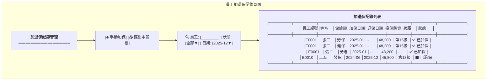
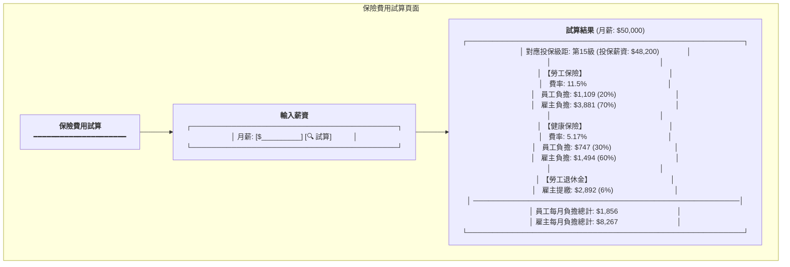
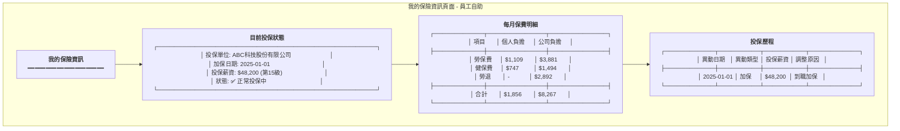
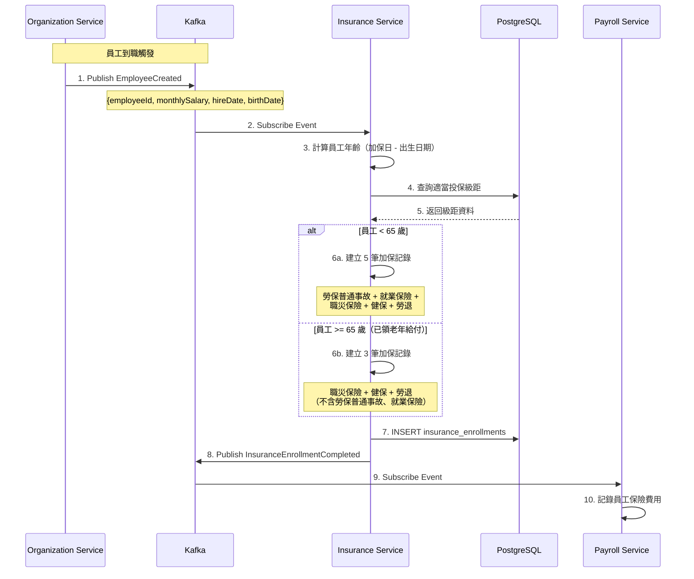
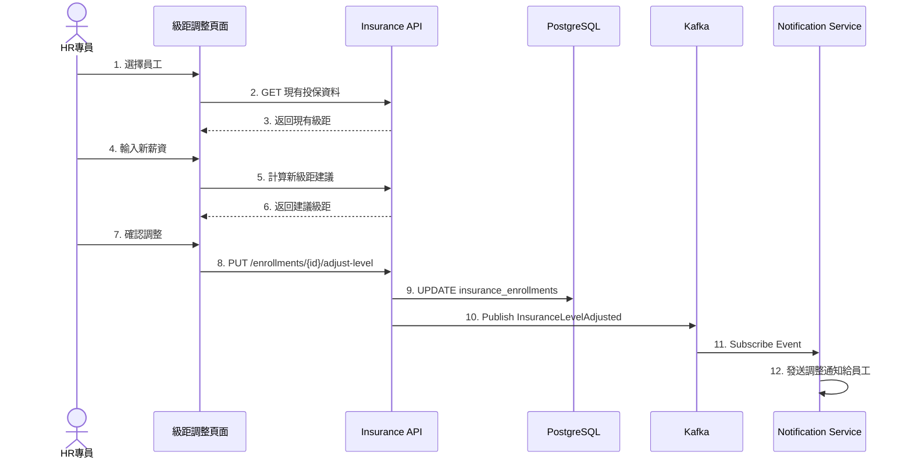
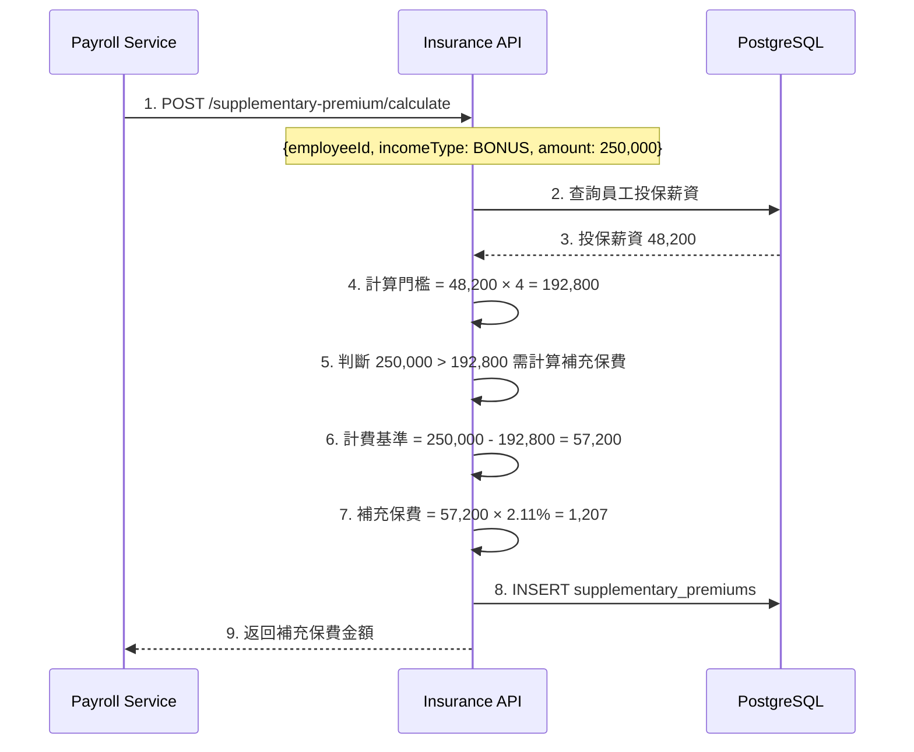

# 保險管理服務系統設計書

**版本:** 2.0
**日期:** 2025-12-07（初版） / 2026-03-17（v2.0 法規修正）
**Domain代號:** 05 (INS)
**目標:** 提供工程師完整的系統實作規格，供PM建立工項清單

> **[2026-03-17 更新] v2.0 變更摘要**
> - A. InsuranceType 新增 OCCUPATIONAL_ACCIDENT（職災保險）和 EMPLOYMENT_INSURANCE（就業保險）
> - B. 加保流程新增年齡判斷（< 65 歲 vs >= 65 歲）
> - C. 費率修正：勞保普通事故 10.5% + 就業保險 1% + 職災保險依行業別
> - D. 健保雇主負擔修正：乘以 (1 + 平均眷口數)，新增可配置參數
> - E. DependentType 修正：移除 SIBLING，新增 GRANDPARENT / GRANDCHILD
> - F. IncomeType 補齊 6 類（新增 STOCK_DIVIDEND / INTEREST / RENTAL）
> - G. 新增雇主補充保費計算
> - H. 進位方式統一改為 HALF_UP（四捨五入）

---

## 目錄

1. [服務概述](#1-服務概述)
2. [UI設計](#2-ui設計)
3. [UX流程設計](#3-ux流程設計)
4. [畫面事件說明](#4-畫面事件說明)
5. [Data Flow設計](#5-data-flow設計)
6. [資料庫設計](#6-資料庫設計)
7. [Domain設計](#7-domain設計)
8. [領域事件設計](#8-領域事件設計)
9. [API設計](#9-api設計)
10. [工項清單摘要](#10-工項清單摘要)

---

## 1. 服務概述

### 1.1 服務定位
保險管理服務負責勞健保加退保自動化、投保級距管理、保險費用計算及政府申報檔案產生。本服務須確保符合台灣勞保、健保、勞退法規要求。

### 1.2 核心功能
- ✅ **多投保單位管理:** 母子公司分別投保
- ✅ **勞健保加退保自動化:** 訂閱員工事件自動處理
- ✅ **投保級距管理:** 自動對應、調整建議
- ✅ **費用計算:** 勞保普通事故、就業保險、職災保險、健保、勞退完整計算 [2026-03-17 更新]
- ✅ **65 歲以上加保規則:** 依年齡判斷加保項目組合 [2026-03-17 新增]
- ✅ **二代健保補充保費:** 6 類所得 2.11% 計算 + 雇主補充保費 [2026-03-17 更新]
- ✅ **健保眷屬管理:** 含平均眷口數雇主負擔計算 [2026-03-17 更新]
- ✅ **政府申報檔案:** 產生勞保局、健保局規範格式
- ✅ **團體保險方案管理:** 團體壽險/傷害險/醫療險方案 CRUD、職等對應、費用拆分
- ✅ **加退保生效日期規則:** 勞保=到職日、健保=到職日（月底離職例外）、團保=依合約

### 1.3 技術架構
- **前端:** ReactJS + Redux + Ant Design
- **後端:** Spring Boot 3.1.x + MyBatis
- **資料庫:** PostgreSQL 15.x
- **事件匯流排:** Kafka

### 1.4 服務邊界

| 屬於本服務 | 不屬於本服務 |
|:---|:---|
| 保險資料管理 | 員工資料 (Organization Service) |
| 加退保處理 | 實際繳費 (Payroll提供數據) |
| 費用計算 | |
| 申報檔案產生 | |

### 1.5 費率常數 (2025年) [2026-03-17 更新]

| 項目 | 費率 | 個人負擔 | 雇主負擔 | 政府負擔 | 備註 |
|:---|:---:|:---:|:---:|:---:|:---|
| 勞保普通事故 | 10.5% | 20% | 70% | 10% | 職災獨立後調降 |
| 就業保險 | 1% | 20% | 70% | 10% | < 65 歲適用 |
| 職災保險 | 0.04%~0.92% | - | 100% | - | 依行業別，可配置 |
| 健保 | 5.17% | 30% | 60% | 10% | 雇主須乘 (1+平均眷口數) |
| 健保平均眷口數 | 0.57 | - | - | - | 2025年衛福部公告，可配置 |
| 勞退 | 6% | - | 100% | - | |
| 補充保費 | 2.11% | 視類型 | 視類型 | - | 個人6類+雇主 |

> [!IMPORTANT]
> **法規參數可配置**
> 上述費率會依年度調整 (每年勞動部/衛福部公告)。系統須支援:
> - 費率依 `effective_date` 生效日配置
> - 級距表依年度版本管理
> - **平均眷口數** 依年度配置（insurance_rates 表 rate_type = 'HEALTH_AVG_DEPENDENTS'）[2026-03-17 新增]
> - **職災保險行業費率** 依投保單位配置（insurance_rates 表 rate_type = 'OCCUPATIONAL_ACCIDENT'）[2026-03-17 新增]
> - 詳見: [法規參數管理與異動稽核設計規格書](logic_spec/regulatory_parameters_and_audit.md)
> - 詳見: [2025年度稅務保險級距表](logic_spec/tax_insurance_tables_2025.md)
>
> **生效日邏輯:**
> - 2026/1/1生效 = 適用2026年1月薪資 (2月發放)
>
> **進位方式:** [2026-03-17 更新]
> - 所有保費金額統一採用四捨五入（RoundingMode.HALF_UP），非無條件進位（CEILING）

## 2. UI設計

### 2.1 頁面清單

| 頁面代碼 | 頁面名稱 | 路由 | 權限要求 |
|:---|:---|:---|:---:|
| `HR05-P01` | 投保單位管理頁面 | `/admin/insurance/units` | insurance:unit:manage |
| `HR05-P02` | 員工加退保記錄頁面 | `/admin/insurance/enrollments` | insurance:enrollment:read |
| `HR05-P03` | 投保級距管理頁面 | `/admin/insurance/levels` | insurance:level:manage |
| `HR05-P04` | 保險費用試算頁面 | `/admin/insurance/calculator` | insurance:calculate |
| `HR05-P05` | 補充保費管理頁面 | `/admin/insurance/supplementary` | insurance:supplementary:manage |
| `HR05-P06` | 申報檔案產生頁面 | `/admin/insurance/reports` | insurance:report:export |
| `HR05-P07` | 我的保險資訊頁面 (ESS) | `/profile/insurance` | - |
| `HR05-M01` | 手動加保對話框 | (Modal) | insurance:enrollment:manage |
| `HR05-M02` | 投保級距調整對話框 | (Modal) | insurance:enrollment:manage |

### 2.2 UI線稿 (Mermaid)

#### 2.2.1 員工加退保記錄頁面 (HR05-P02)



#### 2.2.2 保險費用試算頁面 (HR05-P04)



#### 2.2.3 我的保險資訊頁面 - ESS (HR05-P07)



---

## 3. UX流程設計

### 3.1 自動加保流程 (Event-Driven) [2026-03-17 更新]



### 3.2 投保級距調整流程



### 3.3 補充保費計算流程



---

## 4. 畫面事件說明

### 4.1 加退保記錄頁面事件 (HR05-P02)

| 事件ID | 觸發元素 | 事件類型 | 事件處理 | 後端API |
|:---|:---|:---|:---|:---|
| `E-INS-01` | 搜尋框 | onChange | 篩選員工記錄 | GET /api/v1/insurance/enrollments |
| `E-INS-02` | 手動加保按鈕 | onClick | 開啟加保對話框 | - |
| `E-INS-03` | 確認加保 | onClick | 執行加保 | POST /api/v1/insurance/enrollments |
| `E-INS-04` | 匯出申報檔 | onClick | 產生申報檔案 | POST /api/v1/insurance/export |
| `E-INS-05` | 調整級距按鈕 | onClick | 開啟級距調整對話框 | - |

### 4.2 我的保險資訊頁面事件 (HR05-P07)

| 事件ID | 觸發元素 | 事件類型 | 事件處理 | 後端API |
|:---|:---|:---|:---|:---|
| `E-MY-01` | 頁面載入 | onMount | 載入有效投保資料 | GET /api/v1/insurance/enrollments/active |

### 4.3 費用試算頁面事件 (HR05-P04)

| 事件ID | 觸發元素 | 事件類型 | 事件處理 | 後端API |
|:---|:---|:---|:---|:---|
| `E-CALC-01` | 試算按鈕 | onClick | 試算保費 | POST /api/v1/insurance/fees/calculate |

---

## 5. Data Flow設計

### 5.1 前端State結構

```typescript
interface InsuranceState {
  units: {
    list: InsuranceUnit[];
    loading: boolean;
  };
  enrollments: {
    list: InsuranceEnrollment[];
    selectedEmployee: string | null;
    loading: boolean;
  };
  levels: {
    laborLevels: InsuranceLevel[];
    healthLevels: InsuranceLevel[];
    loading: boolean;
  };
  calculator: {
    salary: number | null;
    result: CalculationResult | null;
    loading: boolean;
  };
  myInsurance: {
    data: MyInsuranceInfo | null;
    loading: boolean;
  };
}
```

---

## 6. 資料庫設計

### 6.1 DDL Script

```sql
-- 投保單位表
CREATE TABLE insurance_units (
    unit_id UUID PRIMARY KEY DEFAULT gen_random_uuid(),
    organization_id UUID NOT NULL,
    unit_code VARCHAR(50) NOT NULL,
    unit_name VARCHAR(255) NOT NULL,
    labor_insurance_number VARCHAR(50),
    health_insurance_number VARCHAR(50),
    pension_number VARCHAR(50),
    is_active BOOLEAN DEFAULT TRUE,
    created_at TIMESTAMP DEFAULT CURRENT_TIMESTAMP,
    CONSTRAINT uk_unit_code UNIQUE (unit_code)
);

-- 投保級距表
CREATE TABLE insurance_levels (
    level_id UUID PRIMARY KEY DEFAULT gen_random_uuid(),
    insurance_type VARCHAR(30) NOT NULL CHECK (insurance_type IN ('LABOR', 'HEALTH', 'PENSION', 'OCCUPATIONAL_ACCIDENT', 'EMPLOYMENT_INSURANCE')),  -- [2026-03-17 更新] 新增職災保險、就業保險
    level_number INTEGER NOT NULL,
    monthly_salary DECIMAL(10,2) NOT NULL,
    labor_employee_rate DECIMAL(6,4),
    labor_employer_rate DECIMAL(6,4),
    health_employee_rate DECIMAL(6,4),
    health_employer_rate DECIMAL(6,4),
    pension_employer_rate DECIMAL(6,4) DEFAULT 0.06,
    effective_date DATE NOT NULL,
    end_date DATE,
    is_active BOOLEAN DEFAULT TRUE,
    CONSTRAINT uk_level UNIQUE (insurance_type, level_number, effective_date)
);

-- 加退保記錄表 [2026-03-17 更新]
CREATE TABLE insurance_enrollments (
    enrollment_id UUID PRIMARY KEY DEFAULT gen_random_uuid(),
    employee_id UUID NOT NULL,
    insurance_unit_id UUID NOT NULL REFERENCES insurance_units(unit_id),
    insurance_type VARCHAR(30) NOT NULL CHECK (insurance_type IN ('LABOR', 'HEALTH', 'PENSION', 'OCCUPATIONAL_ACCIDENT', 'EMPLOYMENT_INSURANCE', 'GROUP_LIFE', 'GROUP_ACCIDENT', 'GROUP_MEDICAL')),  -- [2026-03-17 更新]
    enroll_date DATE NOT NULL,
    withdraw_date DATE,
    insurance_level_id UUID REFERENCES insurance_levels(level_id),
    monthly_salary DECIMAL(10,2) NOT NULL,
    status VARCHAR(20) NOT NULL DEFAULT 'ACTIVE' CHECK (status IN ('PENDING', 'ACTIVE', 'WITHDRAWN')),
    is_reported BOOLEAN DEFAULT FALSE,
    reported_at TIMESTAMP,
    created_at TIMESTAMP DEFAULT CURRENT_TIMESTAMP,
    updated_at TIMESTAMP DEFAULT CURRENT_TIMESTAMP,
    CONSTRAINT uk_enrollment UNIQUE (employee_id, insurance_type, enroll_date)
);

CREATE INDEX idx_enrollment_emp ON insurance_enrollments(employee_id);
CREATE INDEX idx_enrollment_status ON insurance_enrollments(status);

-- 補充保費記錄表 [2026-03-17 更新]
CREATE TABLE supplementary_premiums (
    premium_id UUID PRIMARY KEY DEFAULT gen_random_uuid(),
    employee_id UUID,                                                                                    -- NULL 表示雇主補充保費
    premium_category VARCHAR(20) NOT NULL DEFAULT 'EMPLOYEE' CHECK (premium_category IN ('EMPLOYEE', 'EMPLOYER')),  -- [2026-03-17 新增]
    income_type VARCHAR(30) NOT NULL CHECK (income_type IN ('BONUS', 'PART_TIME_INCOME', 'PROFESSIONAL_FEE', 'STOCK_DIVIDEND', 'INTEREST', 'RENTAL', 'EMPLOYER_SALARY_DIFF')),  -- [2026-03-17 更新] 新增 3 類所得 + 雇主薪資差額
    income_date DATE NOT NULL,
    income_amount DECIMAL(12,2) NOT NULL,
    insured_salary DECIMAL(10,2),                                                                        -- 個人：投保薪資；雇主：投保金額總額
    threshold DECIMAL(12,2),                                                                             -- 個人：門檻值；雇主：NULL
    premium_base DECIMAL(12,2) NOT NULL,
    premium_amount DECIMAL(10,2) NOT NULL,
    year INTEGER NOT NULL,
    month INTEGER NOT NULL,
    created_at TIMESTAMP DEFAULT CURRENT_TIMESTAMP
);

CREATE INDEX idx_supp_emp ON supplementary_premiums(employee_id);
CREATE INDEX idx_supp_year ON supplementary_premiums(year, month);
CREATE INDEX idx_supp_category ON supplementary_premiums(premium_category);  -- [2026-03-17 新增]

-- 保險費率設定表 (可調整) [2026-03-17 更新]
CREATE TABLE insurance_rates (
    rate_id UUID PRIMARY KEY DEFAULT gen_random_uuid(),
    rate_type VARCHAR(40) NOT NULL,       -- [2026-03-17 更新] 新增類型：LABOR_ORDINARY, EMPLOYMENT_INSURANCE, OCCUPATIONAL_ACCIDENT, HEALTH_AVG_DEPENDENTS
    rate_value DECIMAL(8,4) NOT NULL,     -- [2026-03-17 更新] 擴大精度以容納小數
    effective_date DATE NOT NULL,
    end_date DATE,
    description VARCHAR(255),             -- [2026-03-17 新增] 費率說明
    is_active BOOLEAN DEFAULT TRUE
);

-- [2026-03-17 新增] 健保眷屬表
CREATE TABLE health_insurance_dependents (
    dependent_id UUID PRIMARY KEY DEFAULT gen_random_uuid(),
    employee_id UUID NOT NULL,
    dependent_name VARCHAR(100) NOT NULL,
    dependent_type VARCHAR(20) NOT NULL CHECK (dependent_type IN ('SPOUSE', 'CHILD', 'PARENT', 'GRANDPARENT', 'GRANDCHILD')),  -- [2026-03-17 更新] 移除 SIBLING，新增 GRANDPARENT/GRANDCHILD
    national_id VARCHAR(20),
    birth_date DATE,
    enroll_date DATE NOT NULL,
    withdraw_date DATE,
    status VARCHAR(20) NOT NULL DEFAULT 'ACTIVE' CHECK (status IN ('PENDING', 'ACTIVE', 'WITHDRAWN')),
    created_at TIMESTAMP DEFAULT CURRENT_TIMESTAMP,
    updated_at TIMESTAMP DEFAULT CURRENT_TIMESTAMP
);

CREATE INDEX idx_dependent_emp ON health_insurance_dependents(employee_id);
CREATE INDEX idx_dependent_status ON health_insurance_dependents(status);
```

### 6.2 初始化資料

```sql
-- 初始化投保級距 (2025年勞保)
INSERT INTO insurance_levels (insurance_type, level_number, monthly_salary, labor_employee_rate, labor_employer_rate, effective_date) VALUES
('LABOR', 1, 27470, 0.023, 0.0805, '2025-01-01'),
('LABOR', 2, 27600, 0.023, 0.0805, '2025-01-01'),
('LABOR', 3, 28800, 0.023, 0.0805, '2025-01-01'),
-- ... 更多級距
('LABOR', 15, 48200, 0.023, 0.0805, '2025-01-01'),
('LABOR', 16, 50600, 0.023, 0.0805, '2025-01-01'),
('LABOR', 17, 53000, 0.023, 0.0805, '2025-01-01'),
('LABOR', 18, 45800, 0.023, 0.0805, '2025-01-01');

-- 初始化費率 [2026-03-17 更新]
INSERT INTO insurance_rates (rate_type, rate_value, effective_date, description) VALUES
('LABOR_ORDINARY', 0.105, '2025-01-01', '勞保普通事故費率（職災獨立後調降）'),
('EMPLOYMENT_INSURANCE', 0.01, '2025-01-01', '就業保險費率'),
('OCCUPATIONAL_ACCIDENT', 0.0017, '2025-01-01', '職災保險費率（資訊服務業預設）'),
('HEALTH_TOTAL', 0.0517, '2025-01-01', '健保費率'),
('HEALTH_AVG_DEPENDENTS', 0.57, '2025-01-01', '健保平均眷口數（2025年衛福部公告）'),
('PENSION_EMPLOYER', 0.06, '2025-01-01', '勞退雇主提繳率'),
('SUPPLEMENTARY', 0.0211, '2025-01-01', '二代健保補充保費率');

-- 移除舊的 LABOR_TOTAL（已拆分為 LABOR_ORDINARY + EMPLOYMENT_INSURANCE + OCCUPATIONAL_ACCIDENT）
```

---

## 7. Domain設計

### 7.1 聚合根

#### InsuranceEnrollment聚合根

```java
@Entity
@Table(name = "insurance_enrollments")
public class InsuranceEnrollment {
    @EmbeddedId
    private EnrollmentId id;
    
    @Column(name = "employee_id", nullable = false)
    private UUID employeeId;
    
    @Column(name = "insurance_unit_id", nullable = false)
    private UUID insuranceUnitId;
    
    @Enumerated(EnumType.STRING)
    @Column(name = "insurance_type", nullable = false)
    private InsuranceType insuranceType;
    
    @Column(name = "enroll_date", nullable = false)
    private LocalDate enrollDate;
    
    @Column(name = "withdraw_date")
    private LocalDate withdrawDate;
    
    @Column(name = "monthly_salary", nullable = false)
    private BigDecimal monthlySalary;
    
    @Enumerated(EnumType.STRING)
    @Column(name = "status", nullable = false)
    private EnrollmentStatus status;
    
    /**
     * 建立加保記錄
     */
    public static InsuranceEnrollment enroll(
            UUID employeeId,
            UUID unitId,
            InsuranceType type,
            InsuranceLevel level,
            LocalDate enrollDate) {
        
        InsuranceEnrollment enrollment = new InsuranceEnrollment();
        enrollment.id = EnrollmentId.generate();
        enrollment.employeeId = employeeId;
        enrollment.insuranceUnitId = unitId;
        enrollment.insuranceType = type;
        enrollment.enrollDate = enrollDate;
        enrollment.monthlySalary = level.getMonthlySalary();
        enrollment.status = EnrollmentStatus.ACTIVE;
        
        return enrollment;
    }
    
    /**
     * 退保
     */
    public void withdraw(LocalDate withdrawDate) {
        if (this.status != EnrollmentStatus.ACTIVE) {
            throw new DomainException("只有已加保狀態可以退保");
        }
        this.withdrawDate = withdrawDate;
        this.status = EnrollmentStatus.WITHDRAWN;
    }
    
    /**
     * 調整投保級距
     */
    public void adjustLevel(InsuranceLevel newLevel) {
        this.monthlySalary = newLevel.getMonthlySalary();
    }
}
```

### 7.2 費用計算Domain Service [2026-03-17 更新]

```java
/**
 * 保險費用計算 Domain Service
 * [2026-03-17 更新] 重構：拆分勞保為普通事故+就業保險+職災保險，健保增加平均眷口數
 */
@Service
public class InsuranceFeeCalculationService {

    // 負擔比例常數
    private static final BigDecimal EMPLOYEE_RATIO = new BigDecimal("0.20");   // 勞保/就業保險 個人負擔
    private static final BigDecimal EMPLOYER_RATIO = new BigDecimal("0.70");   // 勞保/就業保險 雇主負擔
    private static final BigDecimal HEALTH_EMPLOYEE_RATIO = new BigDecimal("0.30");
    private static final BigDecimal HEALTH_EMPLOYER_RATIO = new BigDecimal("0.60");
    private static final BigDecimal PENSION_EMPLOYER_RATE = new BigDecimal("0.06");
    private static final BigDecimal SUPPLEMENTARY_RATE = new BigDecimal("0.0211");

    /**
     * 計算完整保險費用
     * @param salary 投保薪資
     * @param rates 費率參數（含勞保普通事故、就業保險、職災保險、健保、平均眷口數）
     * @param employeeAge 員工年齡（用於判斷加保項目）
     * @param dependentCount 眷屬人數（健保個人負擔用，上限 3 人）
     */
    public InsuranceFees calculate(BigDecimal salary, InsuranceRates rates,
                                   int employeeAge, int dependentCount) {

        // [2026-03-17 更新] 勞保普通事故費用（< 65 歲才有）
        BigDecimal laborOrdinaryEmployee = BigDecimal.ZERO;
        BigDecimal laborOrdinaryEmployer = BigDecimal.ZERO;
        BigDecimal employmentInsEmployee = BigDecimal.ZERO;
        BigDecimal employmentInsEmployer = BigDecimal.ZERO;

        if (employeeAge < 65) {
            // 勞保普通事故 10.5%
            BigDecimal laborTotal = salary.multiply(rates.getLaborOrdinaryRate());
            laborOrdinaryEmployee = laborTotal.multiply(EMPLOYEE_RATIO)
                .setScale(0, RoundingMode.HALF_UP);
            laborOrdinaryEmployer = laborTotal.multiply(EMPLOYER_RATIO)
                .setScale(0, RoundingMode.HALF_UP);

            // 就業保險 1%
            BigDecimal empInsTotal = salary.multiply(rates.getEmploymentInsuranceRate());
            employmentInsEmployee = empInsTotal.multiply(EMPLOYEE_RATIO)
                .setScale(0, RoundingMode.HALF_UP);
            employmentInsEmployer = empInsTotal.multiply(EMPLOYER_RATIO)
                .setScale(0, RoundingMode.HALF_UP);
        }

        // [2026-03-17 新增] 職災保險（所有年齡，雇主 100%）
        BigDecimal occAccidentEmployer = salary.multiply(rates.getOccupationalAccidentRate())
            .setScale(0, RoundingMode.HALF_UP);

        // [2026-03-17 更新] 健保費用（含平均眷口數）
        BigDecimal healthTotal = salary.multiply(rates.getHealthRate());
        int cappedDependents = Math.min(dependentCount, 3);
        BigDecimal healthEmployee = healthTotal.multiply(HEALTH_EMPLOYEE_RATIO)
            .multiply(BigDecimal.valueOf(1 + cappedDependents))
            .setScale(0, RoundingMode.HALF_UP);
        BigDecimal avgDependents = rates.getHealthAvgDependents(); // 0.57
        BigDecimal healthEmployer = healthTotal.multiply(HEALTH_EMPLOYER_RATIO)
            .multiply(BigDecimal.ONE.add(avgDependents))
            .setScale(0, RoundingMode.HALF_UP);

        // 勞退
        BigDecimal pensionEmployer = salary.multiply(PENSION_EMPLOYER_RATE)
            .setScale(0, RoundingMode.HALF_UP);

        return new InsuranceFees(
            laborOrdinaryEmployee, laborOrdinaryEmployer,
            employmentInsEmployee, employmentInsEmployer,
            occAccidentEmployer,
            healthEmployee, healthEmployer,
            pensionEmployer
        );
    }

    /**
     * 計算個人補充保費
     * [2026-03-17 更新] 支援 6 類所得
     */
    public SupplementaryPremiumResult calculateSupplementary(
            UUID employeeId,
            BigDecimal incomeAmount,
            IncomeType incomeType,
            BigDecimal insuredSalary) {

        if (incomeType == IncomeType.BONUS) {
            // 高額獎金：門檻 = 投保薪資 x 4
            BigDecimal threshold = insuredSalary.multiply(new BigDecimal("4"));
            if (incomeAmount.compareTo(threshold) <= 0) {
                return SupplementaryPremiumResult.notRequired();
            }
            BigDecimal premiumBase = incomeAmount.subtract(threshold);
            BigDecimal maxBase = new BigDecimal("10000000");
            if (premiumBase.compareTo(maxBase) > 0) {
                premiumBase = maxBase;
            }
            BigDecimal premiumAmount = premiumBase.multiply(SUPPLEMENTARY_RATE)
                .setScale(0, RoundingMode.HALF_UP);
            return new SupplementaryPremiumResult(true, threshold, premiumBase, premiumAmount);
        }

        // [2026-03-17 新增] 其他 5 類所得：直接以所得金額計算
        // 股利、利息有下限門檻 20,000 元
        if ((incomeType == IncomeType.STOCK_DIVIDEND || incomeType == IncomeType.INTEREST)
                && incomeAmount.compareTo(new BigDecimal("20000")) < 0) {
            return SupplementaryPremiumResult.notRequired();
        }

        BigDecimal premiumBase = incomeAmount.min(new BigDecimal("10000000"));
        BigDecimal premiumAmount = premiumBase.multiply(SUPPLEMENTARY_RATE)
            .setScale(0, RoundingMode.HALF_UP);
        return new SupplementaryPremiumResult(true, BigDecimal.ZERO, premiumBase, premiumAmount);
    }

    /**
     * [2026-03-17 新增] 計算雇主補充保費
     * 公式：（每月薪資總額 - 每月投保金額總額）× 2.11%
     */
    public SupplementaryPremiumResult calculateEmployerSupplementary(
            BigDecimal totalMonthlySalary,
            BigDecimal totalInsuredSalary) {

        BigDecimal diff = totalMonthlySalary.subtract(totalInsuredSalary);
        if (diff.compareTo(BigDecimal.ZERO) <= 0) {
            return SupplementaryPremiumResult.notRequired();
        }

        BigDecimal premiumAmount = diff.multiply(SUPPLEMENTARY_RATE)
            .setScale(0, RoundingMode.HALF_UP);
        return new SupplementaryPremiumResult(true, totalInsuredSalary, diff, premiumAmount);
    }
}
```

### 7.3 [2026-03-17 新增] InsuranceFees Value Object 更新

```java
/**
 * 保險費用結果（Value Object）
 * [2026-03-17 更新] 新增職災保險、就業保險欄位
 */
public record InsuranceFees(
    BigDecimal laborOrdinaryEmployee,    // 勞保普通事故 個人負擔
    BigDecimal laborOrdinaryEmployer,    // 勞保普通事故 雇主負擔
    BigDecimal employmentInsEmployee,    // 就業保險 個人負擔
    BigDecimal employmentInsEmployer,    // 就業保險 雇主負擔
    BigDecimal occAccidentEmployer,      // 職災保險 雇主負擔（雇主 100%）
    BigDecimal healthEmployee,           // 健保 個人負擔
    BigDecimal healthEmployer,           // 健保 雇主負擔（含平均眷口數）
    BigDecimal pensionEmployer           // 勞退 雇主提繳
) {
    /** 員工每月負擔總計 */
    public BigDecimal totalEmployeeFee() {
        return laborOrdinaryEmployee.add(employmentInsEmployee).add(healthEmployee);
    }

    /** 雇主每月負擔總計 */
    public BigDecimal totalEmployerFee() {
        return laborOrdinaryEmployer.add(employmentInsEmployer)
               .add(occAccidentEmployer).add(healthEmployer).add(pensionEmployer);
    }
}
```

### 7.4 [2026-03-17 新增] InsuranceRates Value Object 更新

```java
/**
 * 保險費率參數（Value Object）
 * [2026-03-17 更新] 新增職災保險費率、就業保險費率、平均眷口數
 */
public record InsuranceRates(
    BigDecimal laborOrdinaryRate,         // 勞保普通事故費率 (10.5%)
    BigDecimal employmentInsuranceRate,   // 就業保險費率 (1%)
    BigDecimal occupationalAccidentRate,  // 職災保險費率 (依行業別)
    BigDecimal healthRate,                // 健保費率 (5.17%)
    BigDecimal healthAvgDependents,       // 健保平均眷口數 (0.57)
    BigDecimal pensionRate,              // 勞退提繳率 (6%)
    BigDecimal supplementaryRate         // 補充保費率 (2.11%)
) {}
```

### 7.5 [2026-03-17 新增] InsuranceType enum 更新

```java
public enum InsuranceType {
    LABOR("勞保"),                                    // 勞保普通事故
    HEALTH("健保"),
    PENSION("勞退"),
    OCCUPATIONAL_ACCIDENT("職災保險"),                 // [2026-03-17 新增]
    EMPLOYMENT_INSURANCE("就業保險"),                   // [2026-03-17 新增]
    GROUP_LIFE("團體壽險"),
    GROUP_ACCIDENT("團體傷害險"),
    GROUP_MEDICAL("團體醫療險");

    /**
     * 是否為法定保險
     * [2026-03-17 更新] 含職災保險、就業保險
     */
    public boolean isStatutory() {
        return this == LABOR || this == HEALTH || this == PENSION
            || this == OCCUPATIONAL_ACCIDENT || this == EMPLOYMENT_INSURANCE;
    }

    /**
     * [2026-03-17 新增] 是否為 65 歲以上仍需加保的項目
     */
    public boolean isRequiredForSenior() {
        return this == OCCUPATIONAL_ACCIDENT || this == HEALTH || this == PENSION;
    }

    /**
     * [2026-03-17 新增] 是否為 65 歲以下才需加保的項目
     */
    public boolean isRequiredForNonSenior() {
        return this == LABOR || this == EMPLOYMENT_INSURANCE
            || this == OCCUPATIONAL_ACCIDENT || this == HEALTH || this == PENSION;
    }
}
```

### 7.6 [2026-03-17 新增] DependentType enum 更新

```java
/**
 * 眷屬類型
 * [2026-03-17 更新] 移除 SIBLING，新增 GRANDPARENT / GRANDCHILD
 * 法規依據：全民健康保險法第 2 條
 */
public enum DependentType {
    SPOUSE("配偶"),
    CHILD("子女"),           // 未滿 20 歲，或滿 20 歲仍在學者可延長至畢業
    PARENT("父母"),
    GRANDPARENT("祖父母"),   // [2026-03-17 新增]
    GRANDCHILD("孫子女");    // [2026-03-17 新增]
    // 注意：已移除 SIBLING（兄弟姐妹不符合健保法眷屬定義）
}
```

### 7.7 [2026-03-17 新增] IncomeType enum 更新

```java
/**
 * 收入類型枚舉（二代健保補充保費適用）
 * [2026-03-17 更新] 補齊 6 類所得
 * 法規依據：全民健康保險法第 31 條
 */
public enum IncomeType {
    BONUS("高額獎金"),
    PART_TIME_INCOME("兼職所得"),
    PROFESSIONAL_FEE("執行業務收入"),
    STOCK_DIVIDEND("股利所得"),     // [2026-03-17 新增]
    INTEREST("利息所得"),           // [2026-03-17 新增]
    RENTAL("租金收入");             // [2026-03-17 新增]
}
```

---

## 8. 領域事件設計 [2026-03-17 更新]

| 事件名稱 | 觸發時機 | 發布服務 | 訂閱服務 |
|:---|:---|:---|:---|
| `InsuranceEnrollmentCompleted` | 加保完成（含年齡判斷後的加保組合）| Insurance | Payroll |
| `InsuranceWithdrawalCompleted` | 退保完成 | Insurance | Payroll |
| `InsuranceLevelAdjusted` | 投保級距調整 | Insurance | Payroll, Notification |
| `SupplementaryPremiumCalculated` | 個人補充保費計算（6 類所得）| Insurance | Payroll |
| `EmployerSupplementaryPremiumCalculated` | 雇主補充保費月結計算 [2026-03-17 新增] | Insurance | Payroll |
| `EmployeeTerminated` (訂閱) | 員工離職 | Organization | **Insurance** |

### 8.2 離職連動自動退保流程

**觸發：** 訂閱 `EmployeeTerminated` 事件（Kafka topic: `hrms.employee.terminated`）

**流程：**
1. `EmployeeTerminatedEventListener` 接收事件
2. 呼叫 `AutoWithdrawOnTerminationService.withdrawAllOnTermination()`
3. 查詢員工所有 ACTIVE 加保記錄
4. 依保險類型透過 `EffectiveDateRule.calculateWithdrawDate()` 計算退保日期
5. 逐筆執行 `enrollment.withdraw(withdrawDate)` 並儲存
6. 發布 `InsuranceWithdrawalCompletedEvent`（供 Payroll 訂閱）

**退保日期規則：**
- 勞保/勞退/團保：離職日退保
- 健保：月底離職者次月 1 日退保（健保法規定）

### 8.1 事件範例 [2026-03-17 更新]

```json
// < 65 歲員工加保完成事件（5 筆加保記錄）
{
  "eventId": "evt-ins-001",
  "eventType": "InsuranceEnrollmentCompleted",
  "timestamp": "2025-01-01T09:00:00Z",
  "payload": {
    "employeeId": "emp-001",
    "employeeAge": 35,
    "enrollments": [
      {"type": "LABOR", "monthlySalary": 48200, "enrollDate": "2025-01-01"},
      {"type": "EMPLOYMENT_INSURANCE", "monthlySalary": 48200, "enrollDate": "2025-01-01"},
      {"type": "OCCUPATIONAL_ACCIDENT", "monthlySalary": 48200, "enrollDate": "2025-01-01"},
      {"type": "HEALTH", "monthlySalary": 48200, "enrollDate": "2025-01-01"},
      {"type": "PENSION", "monthlySalary": 48200, "enrollDate": "2025-01-01"}
    ],
    "fees": {
      "laborOrdinaryEmployee": 1012,
      "laborOrdinaryEmployer": 3543,
      "employmentInsEmployee": 96,
      "employmentInsEmployer": 337,
      "occAccidentEmployer": 82,
      "healthEmployee": 747,
      "healthEmployer": 2346,
      "pensionEmployer": 2892
    }
  }
}

// >= 65 歲員工加保完成事件（3 筆加保記錄）
{
  "eventId": "evt-ins-002",
  "eventType": "InsuranceEnrollmentCompleted",
  "timestamp": "2025-01-01T09:00:00Z",
  "payload": {
    "employeeId": "emp-002",
    "employeeAge": 67,
    "enrollments": [
      {"type": "OCCUPATIONAL_ACCIDENT", "monthlySalary": 48200, "enrollDate": "2025-01-01"},
      {"type": "HEALTH", "monthlySalary": 48200, "enrollDate": "2025-01-01"},
      {"type": "PENSION", "monthlySalary": 48200, "enrollDate": "2025-01-01"}
    ],
    "fees": {
      "laborOrdinaryEmployee": 0,
      "laborOrdinaryEmployer": 0,
      "employmentInsEmployee": 0,
      "employmentInsEmployer": 0,
      "occAccidentEmployer": 82,
      "healthEmployee": 747,
      "healthEmployer": 2346,
      "pensionEmployer": 2892
    }
  }
}
```

---

## 9. API設計

### 9.1 Controller命名對照

| Controller | 說明 |
|:---|:---|
| `HR05EnrollmentCmdController` | 加退保Command操作 |
| `HR05EnrollmentQryController` | 加退保Query操作 |
| `HR05FeeCmdController` | 費用計算Command操作 |
| `HR05LevelQryController` | 投保級距Query操作 |
| `HR05ExportCmdController` | 申報檔案匯出 |

### 9.2 API總覽 (13個端點) [2026-03-17 更新]

| 端點 | 方法 | 說明 | 備註 |
|:---|:---:|:---|:---|
| `/api/v1/insurance/enrollments` | POST | 手動加保 | [更新] 含年齡判斷邏輯 |
| `/api/v1/insurance/enrollments` | GET | 查詢加退保記錄 | [更新] 含新保險類型 |
| `/api/v1/insurance/enrollments/active` | GET | 查詢員工有效加保記錄 | |
| `/api/v1/insurance/enrollments/{id}/withdraw` | PUT | 退保 | |
| `/api/v1/insurance/enrollments/{id}/adjust-level` | PUT | 調整投保級距 | |
| `/api/v1/insurance/fees/calculate` | POST | 計算保費 | [更新] 拆分為 5 項保險 |
| `/api/v1/insurance/levels` | GET | 查詢投保級距 | |
| `/api/v1/insurance/supplementary-premium/calculate` | POST | 計算個人補充保費 | [更新] 支援 6 類所得 |
| `/api/v1/insurance/supplementary-premium/employer/calculate` | POST | 計算雇主補充保費 | [2026-03-17 新增] |
| `/api/v1/insurance/dependents` | POST | 新增健保眷屬 | [2026-03-17 新增] |
| `/api/v1/insurance/dependents/{id}/withdraw` | PUT | 眷屬退保 | [2026-03-17 新增] |
| `/api/v1/insurance/export/enrollment-report` | POST | 匯出加退保申報檔 | |
| `/api/v1/insurance/my` | GET | 查詢我的保險資訊 | |

---

## 10. 工項清單摘要

### 前端開發工項
1. HR05-P02 員工加退保記錄頁面（更新：顯示新增的保險類型）
2. HR05-P04 保險費用試算頁面（更新：拆分顯示 5 項保險費用）
3. HR05-P07 我的保險資訊頁面 (ESS)

### 後端開發工項
1. InsuranceEnrollment 聚合根
2. InsuranceFeeCalculationService（更新：拆分費率計算、年齡判斷）[2026-03-17 更新]
3. SupplementaryPremiumCalculator（更新：6 類所得 + 雇主補充保費）[2026-03-17 更新]
4. 加退保 API (4 端點 + 年齡判斷邏輯) [2026-03-17 更新]
5. 費用計算 API (2 端點)
6. 申報檔案產生 (勞保局/健保局格式)
7. 訂閱 EmployeeCreated/EmployeeTerminated 事件（更新：加保含年齡判斷）
8. 離職連動自動退保 (AutoWithdrawOnTerminationService + KafkaListener)

### [2026-03-17 新增] 後端開發工項
9. InsuranceType enum 擴充（OCCUPATIONAL_ACCIDENT, EMPLOYMENT_INSURANCE）
10. DependentType enum 修正（移除 SIBLING，新增 GRANDPARENT/GRANDCHILD）
11. IncomeType enum 擴充（STOCK_DIVIDEND, INTEREST, RENTAL）
12. 雇主補充保費月結計算 API
13. 健保眷屬管理 API（新增/退保）
14. InsuranceRates 參數化（平均眷口數、職災行業費率）
15. 進位方式統一修正為 HALF_UP

### 資料庫開發工項
1. 建立 6 個資料表 DDL（新增 health_insurance_dependents）[2026-03-17 更新]
2. 初始化投保級距資料
3. 初始化費率設定（更新：拆分勞保費率、新增平均眷口數）[2026-03-17 更新]
4. 更新 insurance_enrollments 的 insurance_type CHECK 約束 [2026-03-17 新增]
5. 更新 supplementary_premiums 的 income_type CHECK 約束 + 新增 premium_category [2026-03-17 新增]

---

## 11. [2026-03-17 新增] 影響分析

### 11.1 與其他模組的影響

| 影響模組 | 影響項目 | 影響說明 |
|:---|:---|:---|
| HR02 Organization | EmployeeCreated 事件 | 事件 payload 需包含 birthDate（出生日期），用於年齡判斷 |
| HR04 Payroll | InsuranceEnrollmentCompleted 事件 | 事件 payload 結構變更：費用拆分為 5 項（原 2 項），需同步更新 Payroll 訂閱端 |
| HR04 Payroll | 薪資計算 | 勞保費從 11.5% 拆為普通事故 10.5% + 就業保險 1%，扣繳明細需拆開顯示 |
| HR04 Payroll | 獎金發放 | 補充保費支援 6 類所得，需在獎金發放時自動判斷扣繳 |
| HR04 Payroll | 薪資單 | 薪資單保費明細需新增職災保險、就業保險欄位 |
| HR14 Reporting | 政府申報 | 申報格式需配合職災保險獨立申報 |

### 11.2 資料遷移注意事項

- 既有 LABOR 類型的加保記錄，在法規生效後需拆分為 LABOR + EMPLOYMENT_INSURANCE + OCCUPATIONAL_ACCIDENT
- 既有 DependentType = SIBLING 的眷屬記錄需處理（標記為無效或轉移）
- 既有 CEILING 進位計算的保費記錄不需回溯修正，新計算起統一使用 HALF_UP

---

**文件完成日期:** 2025-12-07（初版）/ 2026-03-17（v2.0）
**版本:** 2.0
