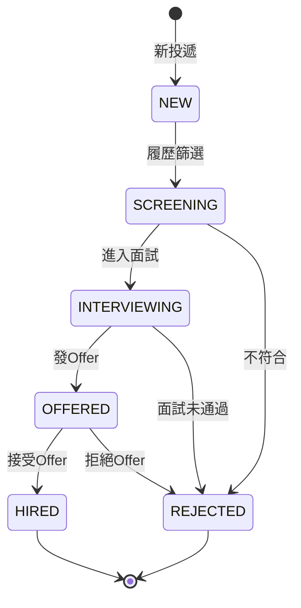
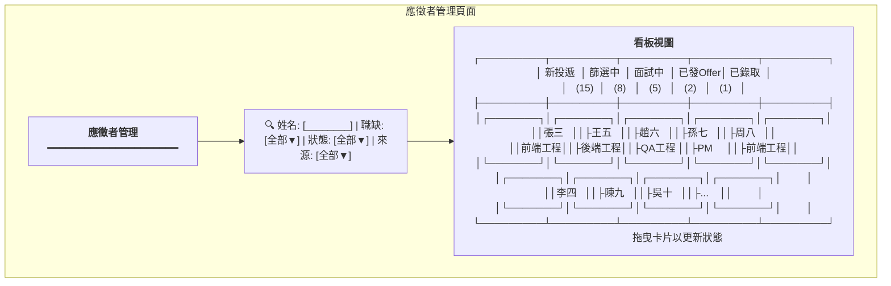
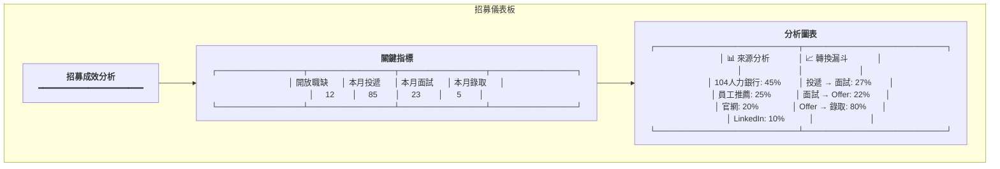
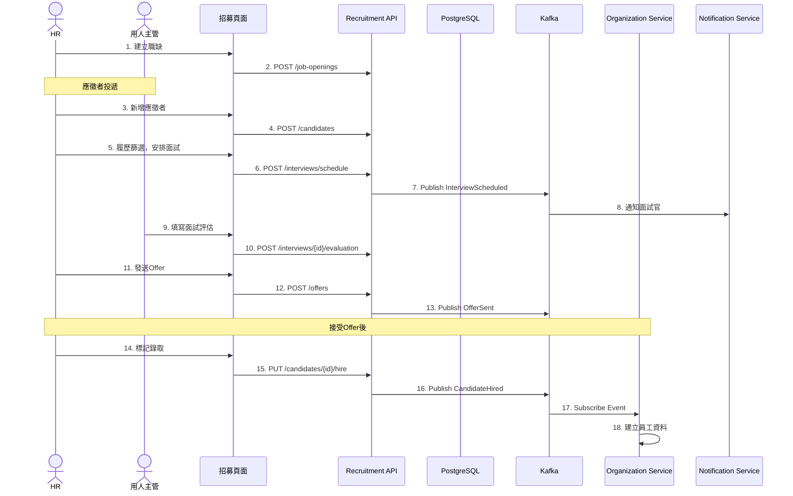
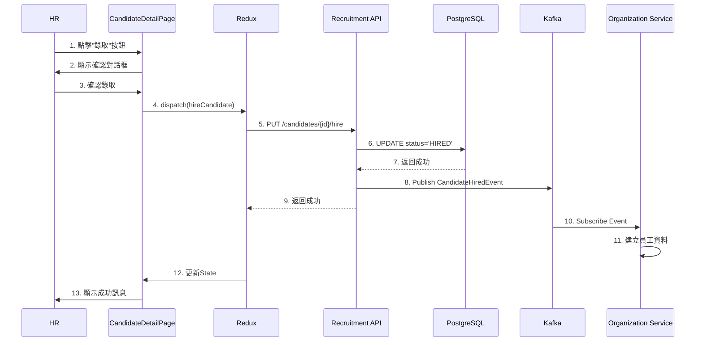
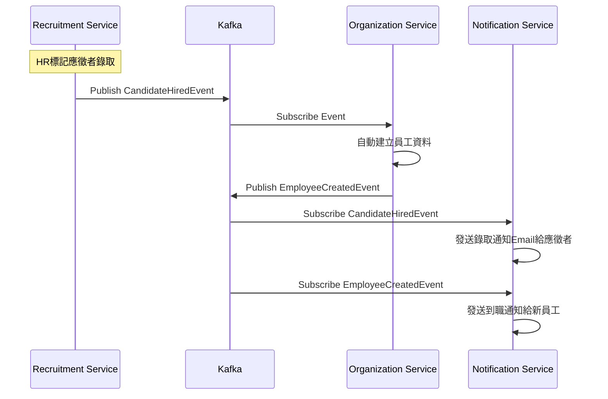

# 招募管理服務系統設計書

**版本:** 1.0
**日期:** 2025-12-07
**Domain代號:** 09 (REC)
**導入階段:** 第三階段（進階人資功能）

---

## 目錄

1. [服務概述](#1-服務概述)
2. [UI設計](#2-ui設計)
3. [UX流程設計](#3-ux流程設計)
4. [畫面事件說明](#4-畫面事件說明)
5. [Data Flow設計](#5-data-flow設計)
6. [資料庫設計](#6-資料庫設計)
7. [Domain設計](#7-domain設計)
8. [領域事件設計](#8-領域事件設計)
9. [API設計](#9-api設計)
10. [工項清單摘要](#10-工項清單摘要)

---

## 1. 服務概述

### 1.1 核心功能
- ✅ **職缺需求管理:** 需求提出與審核
- ✅ **應徵者管理:** 履歷、來源、狀態追蹤
- ✅ **面試管理:** 排程、評估、結果彙整
- ✅ **Offer管理:** 發放、接受/拒絕
- ✅ **招募成效分析:** 來源、轉換率

### 1.2 應徵者狀態流程



---

## 2. UI設計

### 2.1 頁面清單

| 頁面代碼 | 頁面名稱 | 路由 |
|:---|:---|:---|
| `HR09-P01` | 職缺管理頁面 | `/admin/recruitment/jobs` |
| `HR09-P02` | 應徵者管理頁面 | `/admin/recruitment/candidates` |
| `HR09-P03` | 應徵者詳情頁面 | `/admin/recruitment/candidates/:id` |
| `HR09-P04` | 面試管理頁面 | `/admin/recruitment/interviews` |
| `HR09-P05` | Offer管理頁面 | `/admin/recruitment/offers` |
| `HR09-P06` | 招募儀表板 | `/admin/recruitment/dashboard` |

### 2.2 UI線稿

#### 2.2.1 應徵者管理頁面 (HR09-P02)



#### 2.2.2 招募儀表板 (HR09-P06)



---

## 3. UX流程設計

### 3.1 招募流程



---

## 4. 畫面事件說明

### 4.1 職缺管理頁面事件 (HR09-P01)

| 事件ID | 觸發元素 | 事件類型 | 事件處理 | 後端API |
|:---|:---|:---|:---|:---|
| `E-JOB-01` | 新增職缺按鈕 | onClick | 開啟新增職缺對話框 | - |
| `E-JOB-02` | 編輯按鈕 | onClick | 開啟編輯對話框 | GET /api/v1/recruitment/job-openings/{id} |
| `E-JOB-03` | 關閉職缺按鈕 | onClick | 確認後關閉職缺 | PUT /api/v1/recruitment/job-openings/{id}/close |
| `E-JOB-04` | 新增職缺確認 | onClick | 建立職缺 | POST /api/v1/recruitment/job-openings |
| `E-JOB-05` | 狀態篩選器 | onChange | 過濾職缺列表 | - |

**E-JOB-04 詳細流程:**
```typescript
const handleCreateJob = async (values: JobOpeningForm) => {
  try {
    await recruitmentService.createJobOpening({
      jobTitle: values.jobTitle,
      departmentId: values.departmentId,
      numberOfPositions: values.numberOfPositions,
      salaryRange: values.salaryRange,
      requirements: values.requirements,
      responsibilities: values.responsibilities
    });

    message.success('職缺已建立');
    await fetchJobOpenings();
    setModalVisible(false);
  } catch (error) {
    message.error('建立失敗: ' + error.message);
  }
};
```

### 4.2 應徵者管理頁面事件 (HR09-P02)

| 事件ID | 觸發元素 | 事件類型 | 事件處理 | 後端API |
|:---|:---|:---|:---|:---|
| `E-CAND-01` | 姓名搜尋框 | onChange (debounce 300ms) | 過濾應徵者 | - |
| `E-CAND-02` | 職缺篩選器 | onChange | 過濾應徵者 | GET /api/v1/recruitment/candidates?openingId={id} |
| `E-CAND-03` | 狀態篩選器 | onChange | 過濾應徵者 | - |
| `E-CAND-04` | 來源篩選器 | onChange | 過濾應徵者 | - |
| `E-CAND-05` | 新增應徵者按鈕 | onClick | 開啟新增對話框 | - |
| `E-CAND-06` | 看板卡片拖曳 | onDragEnd | 更新應徵者狀態 | PUT /api/v1/recruitment/candidates/{id}/status |
| `E-CAND-07` | 卡片點擊 | onClick | 跳轉至應徵者詳情頁 | - |

**E-CAND-06 詳細流程:**
```typescript
const handleDragEnd = async (result: DropResult) => {
  const { source, destination, draggableId } = result;

  if (!destination || source.droppableId === destination.droppableId) {
    return;
  }

  try {
    // 更新本地狀態(樂觀更新)
    const newStatus = destination.droppableId as CandidateStatus;
    updateCandidateStatusLocally(draggableId, newStatus);

    // 呼叫API
    await recruitmentService.updateCandidateStatus(draggableId, {
      newStatus,
      reason: `從${source.droppableId}移動至${destination.droppableId}`
    });

    message.success('狀態已更新');
  } catch (error) {
    // 回復狀態
    revertCandidateStatus(draggableId);
    message.error('更新失敗: ' + error.message);
  }
};
```

### 4.3 應徵者詳情頁面事件 (HR09-P03)

| 事件ID | 觸發元素 | 事件類型 | 事件處理 | 後端API |
|:---|:---|:---|:---|:---|
| `E-DETAIL-01` | 安排面試按鈕 | onClick | 開啟面試排程對話框 | - |
| `E-DETAIL-02` | 發送Offer按鈕 | onClick | 開啟Offer對話框 | - |
| `E-DETAIL-03` | 拒絕按鈕 | onClick | 開啟拒絕理由對話框 | - |
| `E-DETAIL-04` | 安排面試確認 | onClick | 建立面試 | POST /api/v1/recruitment/interviews/schedule |
| `E-DETAIL-05` | 發送Offer確認 | onClick | 建立Offer | POST /api/v1/recruitment/offers |
| `E-DETAIL-06` | 拒絕確認 | onClick | 更新狀態為拒絕 | PUT /api/v1/recruitment/candidates/{id}/reject |

**E-DETAIL-04 詳細流程:**
```typescript
const handleScheduleInterview = async (values: InterviewForm) => {
  try {
    await recruitmentService.scheduleInterview({
      candidateId,
      interviewRound: values.round,
      interviewType: values.type,
      interviewDate: values.date,
      location: values.location,
      interviewers: values.interviewers
    });

    message.success('面試已安排，將通知面試官');
    await fetchCandidateDetail();
    setInterviewModalVisible(false);
  } catch (error) {
    message.error('安排失敗: ' + error.message);
  }
};
```

### 4.4 面試管理頁面事件 (HR09-P04)

| 事件ID | 觸發元素 | 事件類型 | 事件處理 | 後端API |
|:---|:---|:---|:---|:---|
| `E-INT-01` | 日期篩選器 | onChange | 過濾面試列表 | GET /api/v1/recruitment/interviews?date={date} |
| `E-INT-02` | 面試官篩選器 | onChange | 過濾面試列表 | - |
| `E-INT-03` | 面試卡片點擊 | onClick | 開啟面試詳情 Modal | GET /api/v1/recruitment/interviews/{id} |
| `E-INT-04` | 評估按鈕 | onClick | 開啟評估表單 | - |
| `E-INT-05` | 評估確認 | onClick | 提交面試評估 | POST /api/v1/recruitment/interviews/{id}/evaluations |
| `E-INT-06` | 取消面試按鈕 | onClick | 取消面試 | POST /api/v1/recruitment/interviews/{id}/cancel |
| `E-INT-07` | 重新排程按鈕 | onClick | 開啟重新排程對話框 | - |
| `E-INT-08` | 重新排程確認 | onClick | 更新面試時間 | PUT /api/v1/recruitment/interviews/{id}/reschedule |

**E-INT-03 詳細流程:**
```typescript
const handleViewInterview = async (interviewId: string) => {
  try {
    const detail = await recruitmentService.getInterviewDetail(interviewId);
    setCurrentInterview(detail);
    setDetailModalVisible(true);
  } catch (error) {
    message.error('載入失敗: ' + error.message);
  }
};
```

**E-INT-05 詳細流程:**
```typescript
const handleSubmitEvaluation = async (values: EvaluationForm) => {
  try {
    await recruitmentService.submitEvaluation(interviewId, {
      interviewerId: currentUser.employeeId,
      technicalScore: values.technicalScore,
      communicationScore: values.communicationScore,
      cultureFitScore: values.cultureFitScore,
      overallRating: values.overallRating,
      comments: values.comments,
      strengths: values.strengths,
      concerns: values.concerns
    });

    message.success('評估已送出');
    await fetchInterviews();
    setEvalModalVisible(false);
  } catch (error) {
    message.error('送出失敗: ' + error.message);
  }
};
```

**E-INT-08 詳細流程:**
```typescript
const handleReschedule = async (values: RescheduleForm) => {
  try {
    await recruitmentService.rescheduleInterview(interviewId, {
      newInterviewDate: values.newDate,
      newLocation: values.location,
      reason: values.reason
    });

    message.success('已重新排程，將通知相關人員');
    await fetchInterviews();
    setRescheduleModalVisible(false);
  } catch (error) {
    message.error('更新失敗: ' + error.message);
  }
};
```

### 4.5 Offer 管理頁面事件 (HR09-P05)

| 事件ID | 觸發元素 | 事件類型 | 事件處理 | 後端API |
|:---|:---|:---|:---|:---|
| `E-OFR-01` | 頁面載入 | onMount | 載入 Offer 列表 | GET /api/v1/recruitment/offers |
| `E-OFR-02` | Offer 卡片點擊 | onClick | 開啟 Offer 詳情 Modal | GET /api/v1/recruitment/offers/{id} |
| `E-OFR-03` | 接受 Offer 按鈕 | onClick | 標記應徵者接受 | POST /api/v1/recruitment/offers/{id}/accept |
| `E-OFR-04` | 拒絕 Offer 按鈕 | onClick | 開啟拒絕理由對話框 | - |
| `E-OFR-05` | 拒絕確認 | onClick | 標記應徵者拒絕 | POST /api/v1/recruitment/offers/{id}/reject |
| `E-OFR-06` | 撤回 Offer 按鈕 | onClick | 公司主動撤回 Offer | POST /api/v1/recruitment/offers/{id}/withdraw |
| `E-OFR-07` | 延長到期日按鈕 | onClick | 開啟延長日期對話框 | - |
| `E-OFR-08` | 延長確認 | onClick | 更新 Offer 到期日 | PUT /api/v1/recruitment/offers/{id}/extend |

**E-OFR-02 詳細流程:**
```typescript
const handleViewOffer = async (offerId: string) => {
  try {
    const detail = await recruitmentService.getOfferDetail(offerId);
    setCurrentOffer(detail);
    setOfferDetailModalVisible(true);
  } catch (error) {
    message.error('載入失敗: ' + error.message);
  }
};
```

**E-OFR-06 詳細流程 (撤回 Offer):**
```typescript
const handleWithdrawOffer = async (offerId: string) => {
  try {
    await Modal.confirm({
      title: '確認撤回 Offer',
      content: '撤回後將無法恢復，確定要撤回此 Offer 嗎？',
      onOk: async () => {
        await recruitmentService.withdrawOffer(offerId);
        message.success('Offer 已撤回');
        await fetchOffers();
      }
    });
  } catch (error) {
    message.error('撤回失敗: ' + error.message);
  }
};
```

**E-OFR-08 詳細流程 (延長到期日):**
```typescript
const handleExtendOffer = async (values: ExtendOfferForm) => {
  try {
    await recruitmentService.extendOffer(offerId, {
      newExpiryDate: values.newExpiryDate,
      reason: values.reason
    });

    message.success('Offer 到期日已延長');
    await fetchOffers();
    setExtendModalVisible(false);
  } catch (error) {
    message.error('更新失敗: ' + error.message);
  }
};
```

### 4.6 招募儀表板事件 (HR09-P06)

| 事件ID | 觸發元素 | 事件類型 | 事件處理 | 後端API |
|:---|:---|:---|:---|:---|
| `E-DASH-01` | 頁面載入 | onMount | 載入儀表板資料 | GET /api/v1/recruitment/dashboard |
| `E-DASH-02` | 日期範圍篩選 | onChange | 切換日期範圍並重新載入 | GET /api/v1/recruitment/dashboard?from={date}&to={date} |
| `E-DASH-03` | 匯出報表按鈕 | onClick | 下載Excel報表 | GET /api/v1/recruitment/dashboard/export |


---

## 5. Data Flow設計

### 5.1 前端狀態管理 (Redux)

#### 5.1.1 State結構

```typescript
interface RecruitmentState {
  // 職缺管理
  jobOpenings: {
    list: JobOpening[];
    currentJob: JobOpening | null;
    filters: {
      status: JobStatus;
    };
    loading: boolean;
  };

  // 應徵者管理
  candidates: {
    kanbanData: {
      NEW: Candidate[];
      SCREENING: Candidate[];
      INTERVIEWING: Candidate[];
      OFFERED: Candidate[];
      HIRED: Candidate[];
      REJECTED: Candidate[];
    };
    currentCandidate: CandidateDetail | null;
    filters: {
      search: string;
      openingId: string;
      status: CandidateStatus;
      source: RecruitmentSource;
    };
    loading: boolean;
  };

  // 面試管理
  interviews: {
    list: Interview[];
    upcoming: Interview[];
    filters: {
      date: string;
      interviewerId: string;
    };
    loading: boolean;
  };

  // Offer管理
  offers: {
    list: Offer[];
    pending: Offer[];
    loading: boolean;
  };

  // 招募儀表板
  dashboard: {
    kpis: RecruitmentKPIs;
    sourceFunnel: SourceAnalytics[];
    conversionFunnel: ConversionFunnel;
    loading: boolean;
  };
}
```

#### 5.1.2 Redux Actions

```typescript
// 職缺管理Actions
export const jobOpeningActions = {
  fetchJobOpenings: createAsyncThunk(
    'recruitment/fetchJobOpenings',
    async () => {
      const response = await recruitmentService.getJobOpenings();
      return response;
    }
  ),

  createJobOpening: createAsyncThunk(
    'recruitment/createJobOpening',
    async (data: CreateJobOpeningRequest) => {
      const response = await recruitmentService.createJobOpening(data);
      return response;
    }
  ),

  closeJobOpening: createAsyncThunk(
    'recruitment/closeJobOpening',
    async (openingId: string) => {
      await recruitmentService.closeJobOpening(openingId);
      return openingId;
    }
  ),
};

// 應徵者管理Actions
export const candidateActions = {
  fetchCandidates: createAsyncThunk(
    'recruitment/fetchCandidates',
    async (filters: CandidateFilters) => {
      const response = await recruitmentService.getCandidates(filters);
      return response;
    }
  ),

  createCandidate: createAsyncThunk(
    'recruitment/createCandidate',
    async (data: CreateCandidateRequest) => {
      const response = await recruitmentService.createCandidate(data);
      return response;
    }
  ),

  updateCandidateStatus: createAsyncThunk(
    'recruitment/updateCandidateStatus',
    async ({candidateId, status}: {candidateId: string, status: CandidateStatus}) => {
      await recruitmentService.updateCandidateStatus(candidateId, { newStatus: status });
      return { candidateId, status };
    }
  ),

  rejectCandidate: createAsyncThunk(
    'recruitment/rejectCandidate',
    async ({candidateId, reason}: {candidateId: string, reason: string}) => {
      await recruitmentService.rejectCandidate(candidateId, reason);
      return candidateId;
    }
  ),

  hireCandidate: createAsyncThunk(
    'recruitment/hireCandidate',
    async (candidateId: string) => {
      await recruitmentService.hireCandidate(candidateId);
      return candidateId;
    }
  ),
};

// 面試管理Actions
export const interviewActions = {
  fetchInterviews: createAsyncThunk(
    'recruitment/fetchInterviews',
    async (filters: InterviewFilters) => {
      const response = await recruitmentService.getInterviews(filters);
      return response;
    }
  ),

  scheduleInterview: createAsyncThunk(
    'recruitment/scheduleInterview',
    async (data: ScheduleInterviewRequest) => {
      const response = await recruitmentService.scheduleInterview(data);
      return response;
    }
  ),

  submitEvaluation: createAsyncThunk(
    'recruitment/submitEvaluation',
    async ({interviewId, data}: {interviewId: string, data: EvaluationRequest}) => {
      await recruitmentService.submitEvaluation(interviewId, data);
      return interviewId;
    }
  ),
};

// Offer管理Actions
export const offerActions = {
  sendOffer: createAsyncThunk(
    'recruitment/sendOffer',
    async (data: SendOfferRequest) => {
      const response = await recruitmentService.sendOffer(data);
      return response;
    }
  ),

  acceptOffer: createAsyncThunk(
    'recruitment/acceptOffer',
    async (offerId: string) => {
      await recruitmentService.acceptOffer(offerId);
      return offerId;
    }
  ),

  rejectOffer: createAsyncThunk(
    'recruitment/rejectOffer',
    async ({offerId, reason}: {offerId: string, reason: string}) => {
      await recruitmentService.rejectOffer(offerId, reason);
      return offerId;
    }
  ),
};

// 儀表板Actions
export const dashboardActions = {
  fetchDashboard: createAsyncThunk(
    'recruitment/fetchDashboard',
    async (dateRange?: {from: string, to: string}) => {
      const response = await recruitmentService.getDashboard(dateRange);
      return response;
    }
  ),
};
```

### 5.2 前後端資料流

#### 5.2.1 應徵者狀態更新流程 (看板拖曳)

```mermaid
flowchart LR
    A[拖曳卡片] --> B[onDragEnd事件]
    B --> C[樂觀更新UI]
    C --> D[Redux Action: updateCandidateStatus]
    D --> E[Recruitment Service]
    E --> F[PUT /api/v1/recruitment/candidates/{id}/status]
    F --> G[Recruitment Backend]
    G --> H{驗證狀態轉換}
    H -->|合法| I[更新DB]
    H -->|非法| J[返回錯誤]
    I --> K[發布 CandidateStatusChangedEvent]
    J --> L[回復UI狀態]
    K --> M[返回成功]
    M --> N[Redux Reducer更新State]
    N --> O[Component重新渲染]
```

#### 5.2.2 應徵者錄取流程



### 5.3 服務間資料流

#### 5.3.1 應徵者錄取事件流



---

## 6. 資料庫設計

```sql
-- 職缺表
CREATE TABLE job_openings (
    opening_id UUID PRIMARY KEY DEFAULT gen_random_uuid(),
    job_title VARCHAR(100) NOT NULL,
    department_id UUID NOT NULL,
    number_of_positions INTEGER DEFAULT 1,
    salary_range VARCHAR(100),
    requirements TEXT,
    responsibilities TEXT,
    status VARCHAR(20) DEFAULT 'OPEN' CHECK (status IN ('DRAFT', 'OPEN', 'CLOSED', 'FILLED')),
    open_date DATE,
    close_date DATE,
    created_by UUID,
    created_at TIMESTAMP DEFAULT CURRENT_TIMESTAMP
);

-- 應徵者表
CREATE TABLE candidates (
    candidate_id UUID PRIMARY KEY DEFAULT gen_random_uuid(),
    opening_id UUID REFERENCES job_openings(opening_id),
    full_name VARCHAR(100) NOT NULL,
    email VARCHAR(255) NOT NULL,
    phone_number VARCHAR(50),
    resume_url VARCHAR(500),
    source VARCHAR(30) CHECK (source IN ('JOB_BANK', 'REFERRAL', 'WEBSITE', 'LINKEDIN', 'OTHER')),
    referrer_id UUID,
    application_date DATE DEFAULT CURRENT_DATE,
    status VARCHAR(20) DEFAULT 'NEW' 
        CHECK (status IN ('NEW', 'SCREENING', 'INTERVIEWING', 'OFFERED', 'HIRED', 'REJECTED')),
    rejection_reason TEXT,
    created_at TIMESTAMP DEFAULT CURRENT_TIMESTAMP,
    updated_at TIMESTAMP DEFAULT CURRENT_TIMESTAMP
);

CREATE INDEX idx_candidate_status ON candidates(status);
CREATE INDEX idx_candidate_opening ON candidates(opening_id);

-- 面試表
CREATE TABLE interviews (
    interview_id UUID PRIMARY KEY DEFAULT gen_random_uuid(),
    candidate_id UUID NOT NULL REFERENCES candidates(candidate_id),
    interview_round INTEGER DEFAULT 1,
    interview_type VARCHAR(30) CHECK (interview_type IN ('PHONE', 'VIDEO', 'ONSITE', 'TECHNICAL')),
    interview_date TIMESTAMP NOT NULL,
    location VARCHAR(255),
    interviewers JSONB DEFAULT '[]',
    status VARCHAR(20) DEFAULT 'SCHEDULED' CHECK (status IN ('SCHEDULED', 'COMPLETED', 'CANCELLED')),
    created_at TIMESTAMP DEFAULT CURRENT_TIMESTAMP
);

-- 面試評估表
CREATE TABLE interview_evaluations (
    evaluation_id UUID PRIMARY KEY DEFAULT gen_random_uuid(),
    interview_id UUID NOT NULL REFERENCES interviews(interview_id),
    interviewer_id UUID NOT NULL,
    technical_score INTEGER CHECK (technical_score BETWEEN 1 AND 5),
    communication_score INTEGER CHECK (communication_score BETWEEN 1 AND 5),
    culture_fit_score INTEGER CHECK (culture_fit_score BETWEEN 1 AND 5),
    overall_rating VARCHAR(20) CHECK (overall_rating IN ('STRONG_HIRE', 'HIRE', 'NO_HIRE', 'STRONG_NO_HIRE')),
    comments TEXT,
    strengths TEXT,
    concerns TEXT,
    created_at TIMESTAMP DEFAULT CURRENT_TIMESTAMP,
    
    CONSTRAINT uk_evaluation UNIQUE (interview_id, interviewer_id)
);

-- Offer表
CREATE TABLE offers (
    offer_id UUID PRIMARY KEY DEFAULT gen_random_uuid(),
    candidate_id UUID NOT NULL REFERENCES candidates(candidate_id),
    offered_position VARCHAR(100) NOT NULL,
    offered_salary DECIMAL(12,2) NOT NULL,
    offered_start_date DATE,
    offer_date DATE DEFAULT CURRENT_DATE,
    expiry_date DATE NOT NULL,
    status VARCHAR(20) DEFAULT 'PENDING' CHECK (status IN ('PENDING', 'ACCEPTED', 'REJECTED', 'EXPIRED', 'WITHDRAWN')),
    response_date DATE,
    rejection_reason TEXT,
    created_by UUID,
    created_at TIMESTAMP DEFAULT CURRENT_TIMESTAMP
);
```

---

## 5. Domain設計

```java
@Entity
public class Candidate {
    @EmbeddedId
    private CandidateId id;
    
    private UUID openingId;
    private String fullName;
    private String email;
    private String phoneNumber;
    private String resumeUrl;
    
    @Enumerated(EnumType.STRING)
    private RecruitmentSource source;
    
    @Enumerated(EnumType.STRING)
    private CandidateStatus status;
    
    /**
     * 履歷篩選通過
     */
    public void passScreening() {
        if (this.status != CandidateStatus.NEW) {
            throw new DomainException("只有新投遞狀態可以篩選");
        }
        this.status = CandidateStatus.SCREENING;
    }
    
    /**
     * 進入面試
     */
    public void moveToInterview() {
        this.status = CandidateStatus.INTERVIEWING;
    }
    
    /**
     * 發送Offer
     */
    public void sendOffer() {
        if (this.status != CandidateStatus.INTERVIEWING) {
            throw new DomainException("只有面試中狀態可以發Offer");
        }
        this.status = CandidateStatus.OFFERED;
    }
    
    /**
     * 錄取
     */
    public void hire() {
        if (this.status != CandidateStatus.OFFERED) {
            throw new DomainException("只有已發Offer狀態可以錄取");
        }
        this.status = CandidateStatus.HIRED;
        
        DomainEventPublisher.publish(new CandidateHiredEvent(
            this.id.getValue(),
            this.fullName,
            this.email,
            this.phoneNumber
        ));
    }
    
    /**
     * 拒絕
     */
    public void reject(String reason) {
        this.status = CandidateStatus.REJECTED;
        this.rejectionReason = reason;
    }
}

public enum CandidateStatus {
    NEW, SCREENING, INTERVIEWING, OFFERED, HIRED, REJECTED
}
```

---

## 8. 領域事件設計

### 8.1 事件清單

| 事件名稱 | 觸發時機 | 訂閱服務 | 業務影響 |
|:---|:---|:---|:---|
| `JobOpeningCreated` | HR建立職缺 | - | 記錄到招募日誌 |
| `CandidateApplied` | 應徵者投遞履歷 | - | 增加應徵者數量統計 |
| `InterviewScheduled` | HR安排面試 | Notification | 通知面試官和應徵者 |
| `OfferSent` | HR發送Offer | Notification | 通知應徵者收到Offer |
| `CandidateHired` | HR確認錄取 | Organization, Notification | 自動建立員工資料、通知相關人員 |

### 8.2 事件Schema

#### 8.2.1 JobOpeningCreatedEvent

```json
{
  "eventId": "uuid",
  "eventType": "JobOpeningCreated",
  "aggregateId": "opening-id",
  "aggregateType": "JobOpening",
  "occurredAt": "2025-12-07T10:00:00Z",
  "payload": {
    "openingId": "uuid",
    "jobTitle": "前端工程師",
    "departmentId": "dept-uuid",
    "departmentName": "研發部",
    "numberOfPositions": 2,
    "salaryRange": "60K-80K",
    "requirements": "React, TypeScript, 3年以上經驗",
    "openDate": "2025-12-07",
    "createdBy": "hr-user-id",
    "createdByName": "HR Admin"
  },
  "metadata": {
    "userId": "hr-user-id",
    "userName": "HR Admin",
    "source": "Recruitment Service",
    "version": "1.0"
  }
}
```

#### 8.2.2 InterviewScheduledEvent

```json
{
  "eventId": "uuid",
  "eventType": "InterviewScheduled",
  "aggregateId": "interview-id",
  "aggregateType": "Interview",
  "occurredAt": "2025-12-07T14:00:00Z",
  "payload": {
    "interviewId": "uuid",
    "candidateId": "candidate-uuid",
    "candidateName": "王小明",
    "candidateEmail": "wang@email.com",
    "openingId": "opening-uuid",
    "jobTitle": "前端工程師",
    "interviewRound": 1,
    "interviewType": "TECHNICAL",
    "interviewDate": "2025-12-15T10:00:00Z",
    "location": "台北辦公室 3F 會議室A",
    "interviewers": [
      {
        "employeeId": "emp-uuid-1",
        "employeeName": "李組長",
        "email": "lee@company.com"
      },
      {
        "employeeId": "emp-uuid-2",
        "employeeName": "張經理",
        "email": "zhang@company.com"
      }
    ],
    "scheduledBy": "hr-user-id"
  },
  "metadata": {
    "userId": "hr-user-id",
    "userName": "HR Admin",
    "source": "Recruitment Service",
    "version": "1.0"
  }
}
```

#### 8.2.3 OfferSentEvent

```json
{
  "eventId": "uuid",
  "eventType": "OfferSent",
  "aggregateId": "offer-id",
  "aggregateType": "Offer",
  "occurredAt": "2025-12-07T16:00:00Z",
  "payload": {
    "offerId": "uuid",
    "candidateId": "candidate-uuid",
    "candidateName": "王小明",
    "candidateEmail": "wang@email.com",
    "openingId": "opening-uuid",
    "offeredPosition": "前端工程師",
    "offeredSalary": 70000,
    "offeredStartDate": "2026-01-01",
    "offerDate": "2025-12-07",
    "expiryDate": "2025-12-21",
    "offerDocumentUrl": "https://storage.company.com/offers/xxxxx.pdf"
  },
  "metadata": {
    "userId": "hr-user-id",
    "userName": "HR Admin",
    "source": "Recruitment Service",
    "version": "1.0"
  }
}
```

#### 8.2.4 CandidateHiredEvent (重要事件)

```json
{
  "eventId": "uuid",
  "eventType": "CandidateHired",
  "aggregateId": "candidate-id",
  "aggregateType": "Candidate",
  "occurredAt": "2025-12-07T17:00:00Z",
  "payload": {
    "candidateId": "uuid",
    "fullName": "王小明",
    "email": "wang@email.com",
    "phoneNumber": "0912-345-678",
    "openingId": "opening-uuid",
    "jobTitle": "前端工程師",
    "departmentId": "dept-uuid",
    "departmentName": "研發部",
    "offeredSalary": 70000,
    "expectedStartDate": "2026-01-01",
    "resumeUrl": "https://storage.company.com/resumes/xxxxx.pdf",
    "referrerId": "emp-uuid",
    "referrerName": "陳推薦人",
    "hiredBy": "hr-user-id",
    "hiredByName": "HR Admin",
    "hiredAt": "2025-12-07T17:00:00Z"
  },
  "metadata": {
    "userId": "hr-user-id",
    "userName": "HR Admin",
    "source": "Recruitment Service",
    "version": "1.0"
  }
}
```

### 8.3 事件處理範例

#### 8.3.1 Notification Service 處理 InterviewScheduledEvent

```java
@Service
public class RecruitmentEventListener {
    @Autowired
    private NotificationService notificationService;

    @KafkaListener(topics = "recruitment.interview.scheduled")
    public void handleInterviewScheduled(InterviewScheduledEvent event) {
        var payload = event.getPayload();

        // 通知應徵者
        notificationService.send(
            NotificationRequest.builder()
                .recipientEmail(payload.getCandidateEmail())
                .channel(NotificationChannel.EMAIL)
                .template("INTERVIEW_SCHEDULED_CANDIDATE")
                .data(Map.of(
                    "candidateName", payload.getCandidateName(),
                    "jobTitle", payload.getJobTitle(),
                    "interviewDate", payload.getInterviewDate(),
                    "location", payload.getLocation(),
                    "interviewers", payload.getInterviewers()
                ))
                .build()
        );

        // 通知所有面試官
        payload.getInterviewers().forEach(interviewer -> {
            notificationService.send(
                NotificationRequest.builder()
                    .recipientId(interviewer.getEmployeeId())
                    .channel(NotificationChannel.EMAIL)
                    .template("INTERVIEW_SCHEDULED_INTERVIEWER")
                    .data(Map.of(
                        "interviewerName", interviewer.getEmployeeName(),
                        "candidateName", payload.getCandidateName(),
                        "interviewDate", payload.getInterviewDate(),
                        "location", payload.getLocation()
                    ))
                    .build()
            );
        });
    }
}
```

#### 8.3.2 Organization Service 處理 CandidateHiredEvent

```java
@Service
public class CandidateHiredEventListener {
    @Autowired
    private EmployeeService employeeService;

    @KafkaListener(topics = "recruitment.candidate.hired")
    public void handleCandidateHired(CandidateHiredEvent event) {
        var payload = event.getPayload();

        // 自動建立員工資料
        try {
            employeeService.createFromCandidate(
                CreateEmployeeFromCandidateRequest.builder()
                    .fullName(payload.getFullName())
                    .companyEmail(generateCompanyEmail(payload.getFullName()))
                    .personalEmail(payload.getEmail())
                    .mobilePhone(payload.getPhoneNumber())
                    .departmentId(payload.getDepartmentId())
                    .jobTitle(payload.getJobTitle())
                    .hireDate(payload.getExpectedStartDate())
                    .employmentType(EmploymentType.FULL_TIME)
                    .employmentStatus(EmploymentStatus.PROBATION)
                    .probationEndDate(payload.getExpectedStartDate().plusMonths(3))
                    .baseSalary(payload.getOfferedSalary())
                    .referredBy(payload.getReferrerId())
                    .resumeUrl(payload.getResumeUrl())
                    .build()
            );

            log.info("Employee created from candidate: {}", payload.getFullName());
        } catch (Exception e) {
            log.error("Failed to create employee from candidate", e);
            // 發布失敗事件，由HR手動處理
        }
    }

    private String generateCompanyEmail(String fullName) {
        // 簡單實作：姓名拼音 + @company.com
        // 實際需要檢查重複等邏輯
        return fullName.toLowerCase() + "@company.com";
    }
}
```

---

## 7. API設計 (14個端點)

| 端點 | 方法 | Controller |
|:---|:---:|:---|
| `/api/v1/recruitment/job-openings` | POST | HR09JobCmdController |
| `/api/v1/recruitment/job-openings` | GET | HR09JobQryController |
| `/api/v1/recruitment/candidates` | POST | HR09CandidateCmdController |
| `/api/v1/recruitment/candidates` | GET | HR09CandidateQryController |
| `/api/v1/recruitment/candidates/{id}` | GET | HR09CandidateQryController |
| `/api/v1/recruitment/candidates/{id}/status` | PUT | HR09CandidateCmdController |
| `/api/v1/recruitment/candidates/{id}/hire` | PUT | HR09CandidateCmdController |
| `/api/v1/recruitment/interviews/schedule` | POST | HR09InterviewCmdController |
| `/api/v1/recruitment/interviews/{id}/evaluation` | POST | HR09InterviewCmdController |
| `/api/v1/recruitment/interviews` | GET | HR09InterviewQryController |
| `/api/v1/recruitment/offers` | POST | HR09OfferCmdController |
| `/api/v1/recruitment/offers/{id}/accept` | PUT | HR09OfferCmdController |
| `/api/v1/recruitment/offers/{id}/reject` | PUT | HR09OfferCmdController |
| `/api/v1/recruitment/dashboard` | GET | HR09ReportQryController |

---

## 10. 工項清單摘要

### 10.1 前端開發工項 (總計: 96小時)

| 工項ID | 工項名稱 | 類別 | 工時(小時) | 負責模組 | 說明 |
|:---|:---|:---|---:|:---|:---|
| **F-REC-01** | **職缺管理頁面 (HR09-P01)** | **頁面開發** | **14** | **features/recruitment** | |
| F-REC-01-01 | JobOpeningListComponent | 元件 | 3 | components/ | 職缺列表表格 |
| F-REC-01-02 | CreateJobModal | 元件 | 4 | components/ | 新增職缺對話框 |
| F-REC-01-03 | useJobManagement | Hook | 3 | hooks/ | 職缺管理邏輯 |
| F-REC-01-04 | JobViewModelFactory | Factory | 2 | factory/ | DTO轉換 |
| F-REC-01-05 | 單元測試 | 測試 | 2 | __tests__/ | Factory + Component測試 |
| **F-REC-02** | **應徵者管理頁面 (HR09-P02)** | **頁面開發** | **24** | **features/recruitment** | |
| F-REC-02-01 | KanbanBoardComponent | 元件 | 6 | components/ | 看板視圖(含拖曳) |
| F-REC-02-02 | CandidateCard | 元件 | 3 | components/ | 應徵者卡片 |
| F-REC-02-03 | CandidateFilterBar | 元件 | 3 | components/ | 篩選工具列 |
| F-REC-02-04 | AddCandidateModal | 元件 | 4 | components/ | 新增應徵者對話框 |
| F-REC-02-05 | useCandidateKanban | Hook | 4 | hooks/ | 看板拖曳邏輯 |
| F-REC-02-06 | CandidateViewModelFactory | Factory | 2 | factory/ | DTO轉換 |
| F-REC-02-07 | 單元測試 | 測試 | 2 | __tests__/ | 拖曳邏輯測試 |
| **F-REC-03** | **應徵者詳情頁面 (HR09-P03)** | **頁面開發** | **18** | **features/recruitment** | |
| F-REC-03-01 | CandidateDetailComponent | 元件 | 5 | components/ | 應徵者詳情 |
| F-REC-03-02 | TimelineComponent | 元件 | 4 | components/ | 時間軸 |
| F-REC-03-03 | ScheduleInterviewModal | 元件 | 4 | components/ | 安排面試對話框 |
| F-REC-03-04 | SendOfferModal | 元件 | 3 | components/ | 發送Offer對話框 |
| F-REC-03-05 | 單元測試 | 測試 | 2 | __tests__/ | 元件測試 |
| **F-REC-04** | **面試管理頁面 (HR09-P04)** | **頁面開發** | **16** | **features/recruitment** | |
| F-REC-04-01 | InterviewListComponent | 元件 | 4 | components/ | 面試列表 |
| F-REC-04-02 | InterviewEvaluationModal | 元件 | 5 | components/ | 評估表單 |
| F-REC-04-03 | InterviewCalendarView | 元件 | 4 | components/ | 日曆視圖 |
| F-REC-04-04 | useInterviewManagement | Hook | 2 | hooks/ | 面試管理邏輯 |
| F-REC-04-05 | 單元測試 | 測試 | 1 | __tests__/ | Hook測試 |
| **F-REC-05** | **Offer管理頁面 (HR09-P05)** | **頁面開發** | **12** | **features/recruitment** | |
| F-REC-05-01 | OfferListComponent | 元件 | 4 | components/ | Offer列表 |
| F-REC-05-02 | OfferDetailModal | 元件 | 3 | components/ | Offer詳情 |
| F-REC-05-03 | useOfferManagement | Hook | 3 | hooks/ | Offer管理邏輯 |
| F-REC-05-04 | 單元測試 | 測試 | 2 | __tests__/ | 元件測試 |
| **F-REC-06** | **招募儀表板頁面 (HR09-P06)** | **頁面開發** | **10** | **features/recruitment** | |
| F-REC-06-01 | RecruitmentDashboard | 元件 | 3 | components/ | 儀表板 |
| F-REC-06-02 | FunnelChart | 元件 | 3 | components/ | 漏斗圖 |
| F-REC-06-03 | SourceAnalyticsChart | 元件 | 2 | components/ | 來源分析圖 |
| F-REC-06-04 | 單元測試 | 測試 | 2 | __tests__/ | 圖表測試 |
| **F-REC-07** | **API & Redux整合** | **整合** | **2** | **features/recruitment** | |
| F-REC-07-01 | RecruitmentApi | API | 1 | api/ | API呼叫封裝 |
| F-REC-07-02 | recruitmentSlice | Redux | 1 | store/ | State管理 |

**前端小計:** 96小時

### 10.2 後端開發工項 (總計: 76小時)

| 工項ID | 工項名稱 | 類別 | 工時(小時) | 負責模組 | 說明 |
|:---|:---|:---|---:|:---|:---|
| **B-REC-01** | **Domain層開發** | **領域模型** | **24** | **domain** | |
| B-REC-01-01 | JobOpening聚合根 | 聚合根 | 3 | domain/model | 職缺管理 |
| B-REC-01-02 | Candidate聚合根 | 聚合根 | 6 | domain/model | 應徵者(含狀態機) |
| B-REC-01-03 | Interview聚合根 | 聚合根 | 4 | domain/model | 面試管理 |
| B-REC-01-04 | Offer聚合根 | 聚合根 | 3 | domain/model | Offer管理 |
| B-REC-01-05 | 領域事件定義 | 事件 | 3 | domain/event | 5個領域事件 |
| B-REC-01-06 | Domain單元測試 | 測試 | 5 | domain/ | 100%覆蓋率 |
| **B-REC-02** | **Repository層開發** | **持久化** | **16** | **infrastructure** | |
| B-REC-02-01 | IJobOpeningRepository | 介面 | 1 | domain/repository | Repository介面 |
| B-REC-02-02 | JobOpeningRepositoryImpl | 實作 | 2 | infrastructure/repository | MyBatis實作 |
| B-REC-02-03 | ICandidateRepository | 介面 | 1 | domain/repository | Repository介面 |
| B-REC-02-04 | CandidateRepositoryImpl | 實作 | 4 | infrastructure/repository | 含看板查詢 |
| B-REC-02-05 | IInterviewRepository | 介面 | 1 | domain/repository | Repository介面 |
| B-REC-02-06 | InterviewRepositoryImpl | 實作 | 3 | infrastructure/repository | 含評估查詢 |
| B-REC-02-07 | IOfferRepository | 介面 | 1 | domain/repository | Repository介面 |
| B-REC-02-08 | OfferRepositoryImpl | 實作 | 2 | infrastructure/repository | MyBatis實作 |
| B-REC-02-09 | Repository測試 | 測試 | 1 | infrastructure/ | 整合測試 |
| **B-REC-03** | **Application層開發** | **應用服務** | **20** | **application** | |
| B-REC-03-01 | CreateJobOpeningServiceImpl | Command | 2 | application/service | 建立職缺 |
| B-REC-03-02 | CreateCandidateServiceImpl | Command | 2 | application/service | 新增應徵者 |
| B-REC-03-03 | UpdateCandidateStatusServiceImpl | Command | 3 | application/service | 更新狀態(驗證) |
| B-REC-03-04 | ScheduleInterviewServiceImpl | Command | 2 | application/service | 安排面試 |
| B-REC-03-05 | SubmitEvaluationServiceImpl | Command | 2 | application/service | 提交評估 |
| B-REC-03-06 | SendOfferServiceImpl | Command | 2 | application/service | 發送Offer |
| B-REC-03-07 | HireCandidateServiceImpl | Command | 3 | application/service | 錄取(發事件) |
| B-REC-03-08 | GetCandidatesServiceImpl | Query | 2 | application/service | 查詢應徵者 |
| B-REC-03-09 | GetDashboardServiceImpl | Query | 1 | application/service | 查詢儀表板 |
| B-REC-03-10 | Service測試 | 測試 | 1 | application/ | 服務測試 |
| **B-REC-04** | **Interface層開發** | **API** | **12** | **interface** | |
| B-REC-04-01 | HR09JobCmdController | Controller | 2 | interface/api | 職缺Command |
| B-REC-04-02 | HR09CandidateCmdController | Controller | 3 | interface/api | 應徵者Command |
| B-REC-04-03 | HR09InterviewCmdController | Controller | 2 | interface/api | 面試Command |
| B-REC-04-04 | HR09OfferCmdController | Controller | 2 | interface/api | Offer Command |
| B-REC-04-05 | HR09*QryController | Controller | 2 | interface/api | Query Controllers |
| B-REC-04-06 | Request/Response DTO | DTO | 1 | interface/api | 14個端點DTO |
| **B-REC-05** | **事件處理開發** | **事件驅動** | **4** | **infrastructure** | |
| B-REC-05-01 | EventPublisher整合 | 發布 | 2 | infrastructure/event | Kafka發布 |
| B-REC-05-02 | 事件序列化測試 | 測試 | 2 | infrastructure/ | 確保Schema正確 |

**後端小計:** 76小時

### 10.3 工項總覽

| 類別 | 前端工時 | 後端工時 | 小計 |
|:---|---:|---:|---:|
| 頁面開發 | 94 | - | 94 |
| API整合 | 2 | - | 2 |
| Domain層 | - | 24 | 24 |
| Repository層 | - | 16 | 16 |
| Application層 | - | 20 | 20 |
| Interface層 | - | 12 | 12 |
| 事件處理 | - | 4 | 4 |
| **總計** | **96** | **76** | **172** |

### 10.4 人力配置建議

- **前端工程師:** 1人，預計2.5週完成 (96小時)
- **後端工程師:** 1人，預計2週完成 (76小時)
- **總開發週期:** 3週 (含測試與整合)

### 10.5 開發優先順序

1. **Phase 1 (Week 1):**
   - 後端: Domain層 + Repository層 (40小時)
   - 前端: 職缺管理 + 應徵者看板基礎功能 (38小時)

2. **Phase 2 (Week 2):**
   - 後端: Application層 + Interface層 (32小時)
   - 前端: 應徵者詳情 + 面試管理 (34小時)

3. **Phase 3 (Week 3):**
   - 後端: 事件處理 + 整合測試 (4小時)
   - 前端: Offer管理 + 儀表板 + 整合測試 (24小時)

### 10.6 技術挑戰與風險

| 挑戰項目 | 風險等級 | 解決方案 |
|:---|:---:|:---|
| 看板拖曳功能 | 中 | 使用 react-beautiful-dnd 函式庫 |
| 狀態轉換驗證 | 中 | Domain層實作狀態機模式 |
| CandidateHired事件整合 | 高 | 需與Organization Service協調Schema |
| 履歷檔案上傳 | 低 | 使用Document Service API |

---

**文件完成日期:** 2025-12-26
