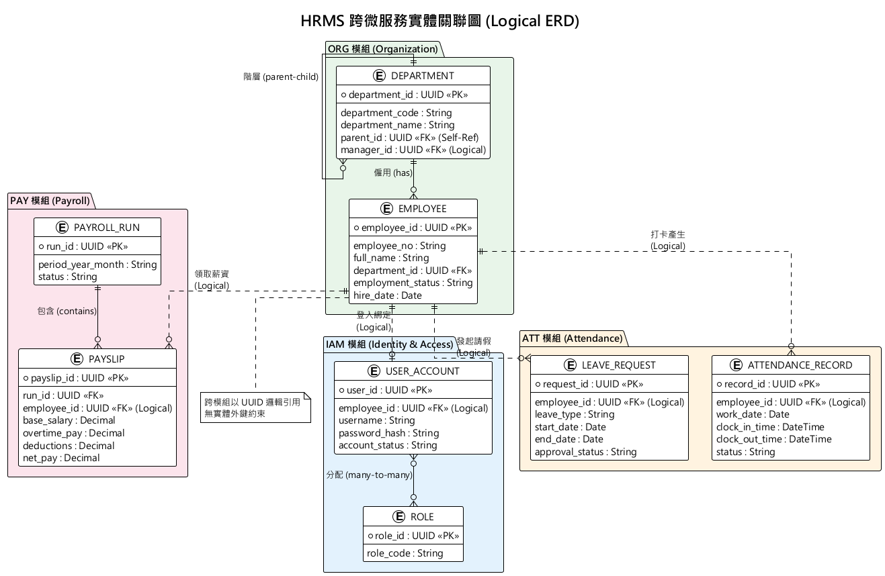
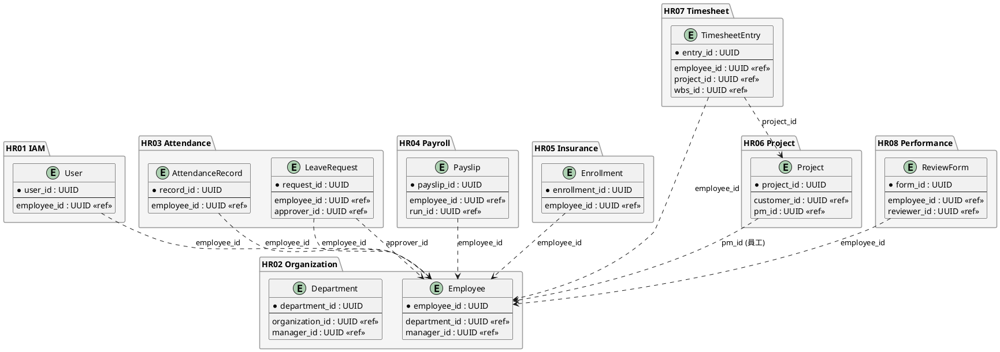

# 核心實體關聯圖 (Global Entity Relationship Diagram)

本文件展示 HRMS 系統的跨服務邏輯實體關聯圖 (Logical ERD)。在微服務架構 (Microservices) 及「每服務一資料庫 (Database-per-service)」的設計下，不同模組之間**並不存在實體的外鍵約束 (No Physical Foreign Keys)**。跨模組的資料實體皆以 UUID 作為邏輯引用 (Logical Reference)，並透過事件驅動或 API Composition 進行資料聚合。

> **圖表格式：** PlantUML 渲染｜原始碼：`02_跨微服務實體關聯圖.puml`｜渲染指令：`java -jar tools/plantuml.jar -smetana -o diagrams 02_跨微服務實體關聯圖.puml`



### 關聯設計要點 (Schema Design Principles)

本系統的資料架構具備以下三個高可用性與資安防護的設計特徵：

1. **跨微服務無實體外鍵（No Physical Foreign Keys）**
   在傳統單體 (Monolith) 系統中，跨業務模組常倚賴實體關聯 (如：`Payroll.employee_id` 指向 `Employee` 表)。在本系統微服務架構中，薪資模組 (Payroll) 與人事模組 (Organization) 具備獨立的 PostgreSQL Schema，改以邏輯外鍵 (Logical Reference) 進行弱關聯 (如圖上虛線所示)。此舉能徹底隔離單一模組資料庫異常所引發的死鎖 (Deadlock) 與系統級存取失效。

2. **跨模組資料聚合策略 (Data Aggregation & API Composition)**
   由於跨庫無法執行 SQL JOIN 語句，當前端要求複合性檢視表 (如：包含員工姓名與部門名稱的打卡列表) 時，系統採取 **CQRS 加上 API Composition** 的架構設計。在主領域模型撈取分頁資料後，利用 Application Service 發出批次查詢 (Batch Query) 獲取來自關聯模組的 Snapshot；針對高頻讀取的情境，則利用 Kafka 訂閱關聯實體的異動事件，於本地端維護讀取專用的快取模型 (Read-Model)。

3. **採用 UUID 構築無狀態主鍵設計**
   所有微服務之領域實體皆強制採用 `UUID V4` 取代傳統的 Auto Increment ID。此策略除避免在跨微服務水平擴展時發生 ID 碰撞外，更天然地阻絕了 **ID 猜測攻擊 (BOLA: Broken Object Level Authorization)**，使得資料探勘與外洩風險降至最低。

---

## 14 服務核心實體總覽 (Core Entities per Service)

下表列出每個微服務的核心 Aggregate Root 與主要 Entity，以及其主鍵（PK）格式。

| 服務 | Aggregate Root / Entity | PK 欄位 | 說明 |
|:---|:---|:---|:---|
| **HR01 IAM** | `User` | `user_id` (UUID) | 系統帳號，含密碼雜湊與角色 |
| | `Role` | `role_id` (VARCHAR) | 角色定義，含權限集合 |
| | `Permission` | `permission_id` (VARCHAR) | 系統權限（resource:action） |
| **HR02 Organization** | `Employee` | `employee_id` (UUID) | 員工主檔（姓名、身分證、職稱、部門） |
| | `Department` | `department_id` (UUID) | 部門結構（支援多層樹狀） |
| | `Organization` | `organization_id` (UUID) | 公司/事業群頂層組織 |
| **HR03 Attendance** | `AttendanceRecord` | `record_id` (UUID) | 每日打卡紀錄（上下班時間） |
| | `LeaveRequest` | `request_id` (UUID) | 請假申請（假別、起迄、狀態） |
| | `OvertimeRequest` | `overtime_id` (UUID) | 加班申請（時數、核准狀態） |
| **HR04 Payroll** | `PayrollRun` | `run_id` (UUID) | 計薪批次（月份、狀態、總額） |
| | `Payslip` | `payslip_id` (UUID) | 個人薪資單（底薪、加項、扣項） |
| | `SalaryStructure` | `structure_id` (UUID) | 薪資結構範本 |
| **HR05 Insurance** | `Enrollment` | `enrollment_id` (UUID) | 投保紀錄（勞保/健保/退休金） |
| | `InsuranceLevel` | `level_id` (UUID) | 投保級距（金額區間、費率） |
| | `Contribution` | `contribution_id` (UUID) | 保費分攤明細（雇主/員工/政府） |
| **HR06 Project** | `Project` | `project_id` (UUID) | 專案主檔（客戶、狀態、預算） |
| | `Customer` | `customer_id` (UUID) | 客戶主檔 |
| | `WbsItem` | `wbs_id` (UUID) | WBS 工作分解（多層樹狀） |
| **HR07 Timesheet** | `WeeklyTimesheet` | `timesheet_id` (UUID) | 週報主表（員工、週次、狀態） |
| | `TimesheetEntry` | `entry_id` (UUID) | 工時明細（專案、日期、時數） |
| **HR08 Performance** | `ReviewCycle` | `cycle_id` (UUID) | 考核週期（期間、權重、狀態） |
| | `ReviewForm` | `form_id` (UUID) | 個人考核表（自評、主管評、評等） |
| | `ReviewTemplate` | `template_id` (UUID) | 考核範本（項目、配分） |
| **HR09 Recruitment** | `JobOpening` | `opening_id` (UUID) | 職缺（名稱、需求人數、狀態） |
| | `Application` | `application_id` (UUID) | 應徵紀錄（候選人、進度） |
| | `Interview` | `interview_id` (UUID) | 面試排程（時間、面試官、結果） |
| **HR10 Training** | `Course` | `course_id` (UUID) | 課程（名稱、講師、時數） |
| | `Enrollment` | `enrollment_id` (UUID) | 報名紀錄（員工、課程、狀態） |
| | `Certificate` | `certificate_id` (UUID) | 證照紀錄（名稱、到期日） |
| **HR11 Workflow** | `ProcessDefinition` | `definition_id` (UUID) | 流程定義（節點、路由、條件） |
| | `ProcessInstance` | `instance_id` (UUID) | 流程實例（狀態、當前節點） |
| | `ApprovalTask` | `task_id` (UUID) | 簽核任務（簽核人、結果） |
| **HR12 Notification** | `Notification` | `notification_id` (UUID) | 通知紀錄（類型、標題、狀態） |
| | `NotificationTemplate` | `template_id` (UUID) | 通知範本（頻道、內容模板） |
| **HR13 Document** | `Document` | `document_id` (UUID) | 文件主檔（名稱、路徑、版本） |
| | `DocumentVersion` | `version_id` (UUID) | 版本歷程（版號、上傳者） |
| | `DocumentTemplate` | `template_id` (UUID) | 文件範本（範本類型、欄位定義） |
| **HR14 Reporting** | `ReportDefinition` | `report_id` (UUID) | 報表定義（類型、資料來源） |
| | `DashboardWidget` | `widget_id` (UUID) | 儀表板元件（圖表類型、查詢） |
| | `ScheduledReport` | `schedule_id` (UUID) | 排程報表（週期、收件人） |

---

## 跨服務引用關係圖 (Cross-Service Reference Map)

下圖展示各服務之間的 UUID 邏輯引用關係。所有引用均為 **邏輯外鍵（Logical Reference）**，無物理 FK 約束。



### 核心共用 UUID 引用彙整

| UUID 類型 | 來源服務 | 引用服務 | 用途 |
|:---|:---|:---|:---|
| `employee_id` | HR02 Organization | HR01, HR03, HR04, HR05, HR07, HR08, HR09, HR10 | **最核心的跨服務 ID**，幾乎所有服務都引用 |
| `department_id` | HR02 Organization | HR03, HR08, HR14 | 部門篩選、團隊績效、部門報表 |
| `user_id` | HR01 IAM | HR11, HR12, HR13 | 簽核人、通知收件人、文件上傳者 |
| `project_id` | HR06 Project | HR07 Timesheet | 工時歸屬專案 |
| `customer_id` | HR06 Project | HR14 Reporting | 客戶專案報表 |
| `wbs_id` | HR06 Project | HR07 Timesheet | 工時歸屬 WBS 項目 |

---

## API Composition 實例

### 實例一：報表儀表板 (Dashboard Composition)

HR14 Reporting 服務的儀表板需從多個服務聚合資料：

```
┌─────────────────────────────────────────────────────┐
│              HR14 Reporting Service                  │
│                 Dashboard API                        │
├─────────────────────────────────────────────────────┤
│                                                      │
│  GET /api/v1/reports/dashboard                       │
│                                                      │
│  ┌──────────┐  ┌──────────┐  ┌──────────┐          │
│  │ 員工統計  │  │ 考勤摘要  │  │ 薪資總覽  │          │
│  │ ReadModel │  │ ReadModel │  │ ReadModel │          │
│  └────┬─────┘  └────┬─────┘  └────┬─────┘          │
│       │              │              │                │
└───────┼──────────────┼──────────────┼────────────────┘
        │              │              │
   ┌────▼─────┐  ┌────▼─────┐  ┌────▼─────┐
   │ HR02 ORG │  │ HR03 ATT │  │ HR04 PAY │
   │ Query API│  │ Query API│  │ Query API│
   └──────────┘  └──────────┘  └──────────┘
```

**組合方式：**
1. CQRS ReadModel：訂閱各服務 Domain Event，在本地維護 Materialized View
2. API Composition：即時查詢各服務 Query API，在 Application Service 層合併
3. 混合模式：高頻資料用 ReadModel，低頻資料用即時查詢

### 實例二：員工 360 度檢視 (Employee 360 View)

員工個人頁面需聚合來自 8 個服務的資料：

| 區塊 | 來源服務 | API | 說明 |
|:---|:---|:---|:---|
| 基本資料 | HR02 Organization | `GET /api/v1/employees/{id}` | 姓名、部門、職稱 |
| 帳號狀態 | HR01 IAM | `GET /api/v1/users/{id}` | 登入狀態、角色 |
| 本月考勤 | HR03 Attendance | `GET /api/v1/attendance/my-records` | 出勤率、遲到次數 |
| 薪資單 | HR04 Payroll | `GET /api/v1/payslips/latest` | 最近薪資 |
| 保險資料 | HR05 Insurance | `GET /api/v1/insurance/my` | 投保級距 |
| 本週工時 | HR07 Timesheet | `GET /api/v1/timesheets/my` | 本週已填工時 |
| 績效狀態 | HR08 Performance | `GET /api/v1/performance/my` | 當前週期評核進度 |
| 訓練紀錄 | HR10 Training | `GET /api/v1/training/my` | 已完成課程數 |
