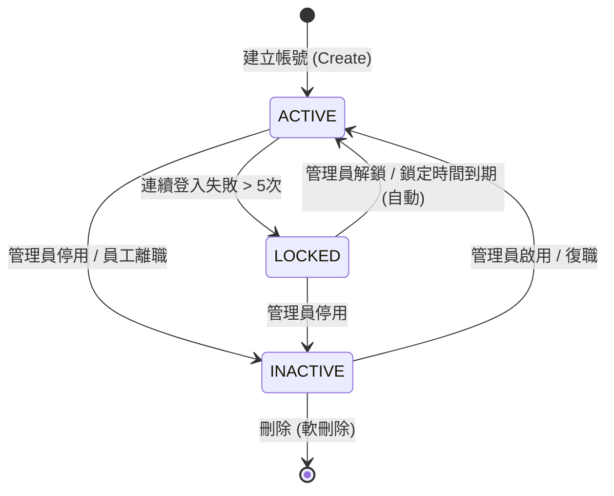

# IAM 服務 (HR01) - 領域邏輯與資料來源詳解

**版本:** 1.0
**日期:** 2025-12-29
**文件定位:** 補充 `01_IAM服務系統設計書`，深入描述領域事件、複雜業務邏輯與資料來源架構。

---

## 1. 資料來源架構 (Data Sources & Integration)

本服務的資料來源分為 **自有資料 (Owned Data)**、**外部參照資料 (Reference Data)** 與 **外部身分提供者 (External IdP)**。

### 1.1 資料來源清單

| 資料類別 | 資料實體 | 來源系統/擁有者 | 資料權威性 | 同步機制 | 說明 |
|:---|:---|:---|:---|:---|:---|
| **自有資料** | **User (使用者)** | **IAM Service** | Master | - | 系統核心帳號，包含帳號、密碼雜湊、狀態。 |
| **自有資料** | **Role (角色)** | **IAM Service** | Master | - | RBAC 角色定義。 |
| **自有資料** | **Permission (權限)** | **IAM Service** | Master | - | 系統功能權限定義。 |
| **自有資料** | **RefreshToken** | **IAM Service** | Master | - | 用於換發 Access Token 的憑證。 |
| **參照資料** | **Employee (員工)** | **Organization Service** | Slave (Cache) | **Event-Driven** | IAM 僅儲存 `employee_id` (FK) 與 `display_name` (快照)。<br>若員工姓名變更，需透過事件更新 User 表。 |
| **參照資料** | **Tenant (租戶)** | **System/Admin Service** | Slave | Config/Event | 租戶資訊通常為靜態配置或透過 Admin 服務管理。 |
| **外部資料** | **Google Profile** | **Google OAuth** | Transient | On-Demand | 登入時暫時取得，用於比對 Email 與建立關聯。 |
| **外部資料** | **MS Entra Profile** | **Microsoft Graph** | Transient | On-Demand | 登入時暫時取得。 |

### 1.2 資料流與同步邏輯

#### 1.2.1 員工資料同步 (Org -> IAM)
*   **來源:** Organization Service
*   **觸發:** `EmployeeCreated`, `EmployeeUpdated`, `EmployeeTerminated` 事件
*   **IAM 處理邏輯:**
    *   **建立:** 當收到 `EmployeeCreated`，IAM **自動建立** 對應的 `User` 帳號。
        *   `username` = 員工 Email
        *   `displayName` = 員工姓名
        *   `status` = ACTIVE
    *   **更新:** 當收到 `EmployeeUpdated` (且姓名或 Email 變更)，IAM 更新 `User` 表的 `displayName` 或 `email` / `username`。
    *   **離職:** 當收到 `EmployeeTerminated`，IAM 將 `User` 狀態改為 `INACTIVE`，並撤銷所有 Token。

#### 1.2.2 權限資料初始化
*   **來源:** 程式碼 (Codebase) / 系統啟動
*   **邏輯:** 系統啟動時，掃描所有微服務定義的權限 (透過 Annotation 或 Config)，自動更新 `permissions` 表。這確保資料庫中的權限清單永遠與程式碼同步。

---

## 2. 領域模型與業務邏輯詳解 (Domain Logic Specifications)

### 2.1 使用者狀態機 (User State Machine)

使用者狀態 (`status`) 的流轉受到嚴格限制：



**狀態轉換規則:**
1.  **LOCKED (自動解鎖):** 每次嘗試登入時，若狀態為 LOCKED，檢查 `locked_until`。若 `current_time > locked_until`，則視為狀態 **自動轉回 ACTIVE**，並允許登入嘗試。
2.  **INACTIVE 限制:** 處於 INACTIVE 狀態的帳號，**絕對禁止** 進行登入或刷新 Token。此狀態優先級高於 LOCKED。

### 2.2 密碼驗證與安全性邏輯

#### 2.2.1 登入失敗計數器 (Sliding Window vs Fixed)
*   **採用策略:** 固定區間重置 (Reset on Success)
*   **邏輯:**
    *   `failed_login_attempts` 是一個計數器。
    *   **密碼錯誤:** `failed_login_attempts + 1`。若 >= 5，設定 `status = LOCKED` 且 `locked_until = now() + 30m`。
    *   **密碼正確:** 若帳號未被鎖定，`failed_login_attempts` **立即重置為 0**。

#### 2.2.2 密碼強度驗證 (Domain Service: `PasswordPolicy`)
*   **規則:** 正則表達式 `^(?=.*[a-z])(?=.*[A-Z])(?=.*\d).{8,128}$`
*   **歷史檢查:** 修改密碼時，新密碼雜湊值 **不可** 與目前的 `password_hash` 相同。(進階需求可擴充為檢查最近 3 次，需額外資料表 `password_history`)。

### 2.3 RBAC 授權邏輯 (Authorization)

#### 2.3.1 權限判定演算法
當查詢 `User.hasPermission(permissionCode)` 時：
1.  取出 User 指派的所有 `Role`。
2.  取出這些 `Role` 包含的所有 `Permission`。
3.  **聯集 (Union)** 所有 Permission。
4.  檢查 `permissionCode` 是否存在於聯集中。

#### 2.3.2 系統角色保護
*   **規則:** `is_system_role = true` 的角色 (如 `SYSTEM_ADMIN`)：
    *   ❌ 不可刪除。
    *   ❌ 不可修改 `role_name`。
    *   ✅ 可以修改 `display_name` 或 `permissions` (視需求而定，通常建議系統角色權限也鎖定)。
    *   **本系統設計:** 系統角色的權限由 Migration Script 管理，API 不允許修改系統角色的權限，以防意外鎖死系統。

---

## 3. 領域事件清單與規格 (Domain Events Catalog)

所有事件發布至 Kafka，Topic 命名規範：`hr.iam.{aggregate}.{event}`。

### 3.1 使用者生命週期事件

| 事件名稱 (Event Name) | Topic | 觸發時機 | Payload 關鍵欄位 | 訂閱者與用途 |
|:---|:---|:---|:---|:---|
| `UserCreated` | `hr.iam.user.created` | 帳號建立成功 | `userId`, `email`, `employeeId`, `tenantId` | **Notification:** 發送歡迎信<br>**Org:** 關聯確認 |
| `UserDeactivated` | `hr.iam.user.deactivated` | 帳號停用 (手動/離職) | `userId`, `reason`, `deactivatedAt` | **Gateway:** 清除 Session<br>**Workflow:** 轉移待辦事項 |
| `UserActivated` | `hr.iam.user.activated` | 帳號重新啟用 | `userId`, `activatedAt` | - |
| `UserDeleted` | `hr.iam.user.deleted` | 帳號刪除 | `userId` | **Audit:** 歸檔紀錄 |

### 3.2 安全與認證事件

| 事件名稱 | Topic | 觸發時機 | Payload 關鍵欄位 | 訂閱者與用途 |
|:---|:---|:---|:---|:---|
| `UserLoggedIn` | `hr.iam.auth.logged-in` | 登入成功 | `userId`, `ip`, `userAgent`, `loginTime` | **Audit:** 審計日誌<br>**Risk:** 異地登入分析 |
| `LoginFailed` | `hr.iam.auth.login-failed` | 登入失敗 (密碼錯/鎖定) | `username`, `ip`, `reason`, `attemptCount` | **Risk:** 暴力破解偵測 |
| `AccountLocked` | `hr.iam.auth.locked` | 帳號被鎖定 | `userId`, `lockedUntil`, `reason` | **Notification:** 通知管理員/使用者 |
| `PasswordChanged` | `hr.iam.auth.pwd-changed` | 密碼修改完成 | `userId`, `changedAt` | **Notification:** 安全通知信 |
| `SsoLinked` | `hr.iam.auth.sso-linked` | 完成 SSO 帳號綁定 | `userId`, `provider`, `ssoEmail` | **Audit:** 綁定紀錄 |

### 3.3 權限變更事件 (Cache Invalidation)

| 事件名稱 | Topic | 觸發時機 | Payload 關鍵欄位 | 訂閱者與用途 |
|:---|:---|:---|:---|:---|
| `RolePermissionUpdated` | `hr.iam.role.perm-updated` | 修改角色的權限 | `roleId`, `addedPerms`, `removedPerms` | **API Gateway / Auth Filter:** <br>立即清除 Redis 中持有該 Role 的所有 User 的權限快取。 |
| `UserRoleAssigned` | `hr.iam.user.role-assigned` | 指派角色給使用者 | `userId`, `roleIds` | **API Gateway / Auth Filter:** <br>立即清除該 User 的權限快取。 |

### 3.4 事件 Payload 範例 (JSON)

**Event: `LoginFailed`**

```json
{
  "eventId": "evt-1234567890",
  "eventType": "LoginFailed",
  "occurredAt": "2025-12-29T10:00:00Z",
  "data": {
    "username": "admin@company.com",
    "ipAddress": "203.0.113.1",
    "userAgent": "Mozilla/5.0...",
    "reason": "INVALID_PASSWORD",
    "currentFailedAttempts": 3,
    "tenantId": "tenant-001"
  }
}
```

**Event: `RolePermissionUpdated`**

```json
{
  "eventId": "evt-9876543210",
  "eventType": "RolePermissionUpdated",
  "occurredAt": "2025-12-29T11:00:00Z",
  "data": {
    "roleId": "role-hr-admin",
    "roleName": "HR_ADMIN",
    "tenantId": "tenant-001",
    "action": "UPDATE",
    "invalidatedUserIds": [] // 若影響人數過多，可為空，由訂閱者進行全量或基於 Role 的清除
  }
}
```

---

**文件結束**
