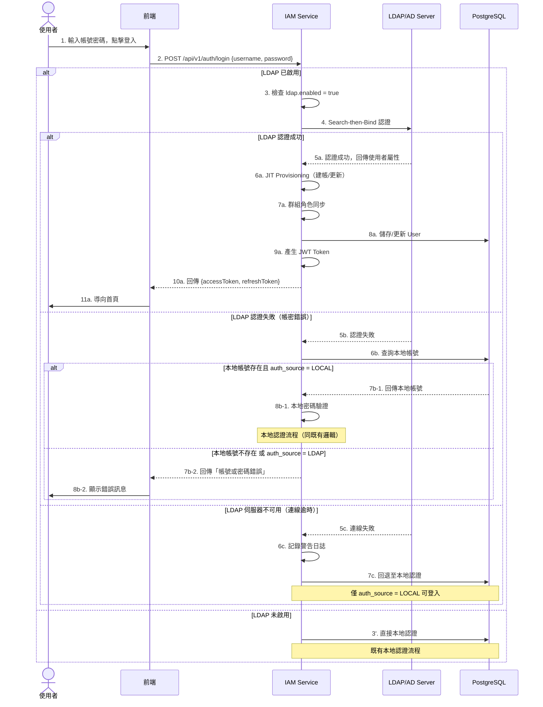
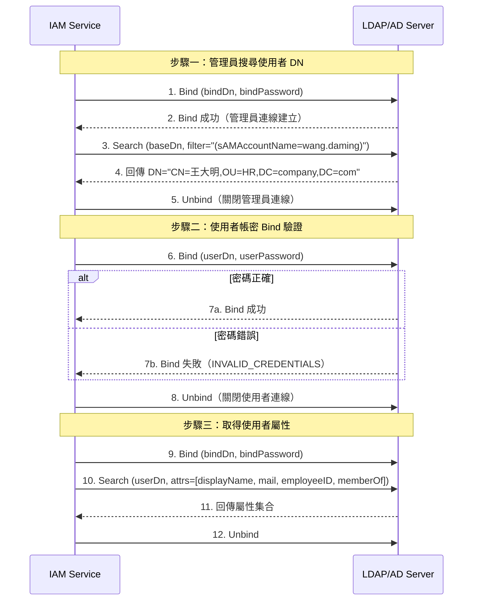
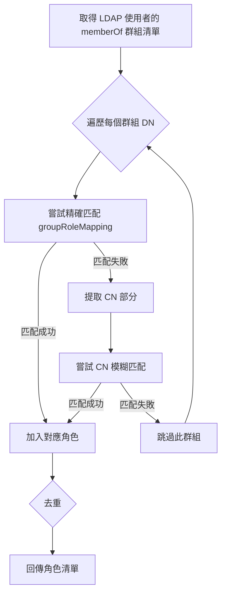
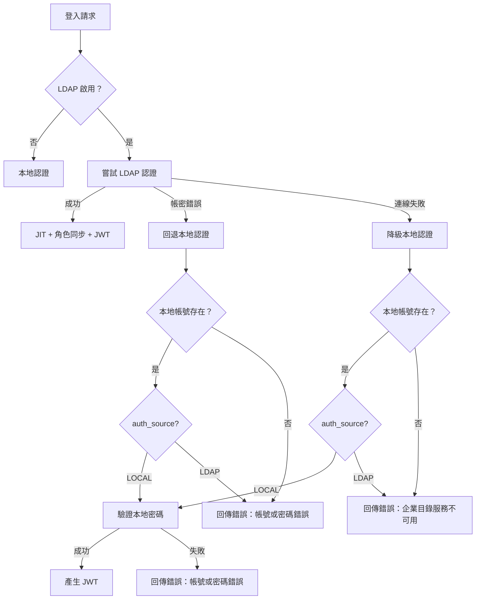

# LDAP/AD 企業登入邏輯規格書

**版本:** 1.0
**日期:** 2026-03-05
**適用服務:** IAM 服務 (01)
**相關文件:**
- `01_IAM_Domain_Layer_and_Data.md`（領域邏輯與資料來源）
- `sso_account_linking.md`（SSO 帳號連結流程）
- `01_IAM服務系統設計書.md`（系統設計書）

---

## 1. 文件概述

### 1.1 目的

定義 LDAP/AD（Lightweight Directory Access Protocol / Active Directory）企業登入的完整業務邏輯規格，涵蓋連線配置、混合認證模式、JIT Provisioning、群組角色映射、錯誤處理與安全考量，作為工程師實作與 QA 驗證的依據。

### 1.2 範圍

| 範圍 | 說明 |
|:---|:---|
| **包含** | LDAP/AD 認證流程、JIT Provisioning（自動建帳）、群組角色同步、混合模式降級策略、安全防護 |
| **不包含** | SSO（OAuth/OIDC/SAML）帳號連結（見 `sso_account_linking.md`）、密碼策略管理（見 `01_IAM_Domain_Layer_and_Data.md`） |

### 1.3 術語定義

| 術語 | 說明 |
|:---|:---|
| **LDAP** | Lightweight Directory Access Protocol，輕量級目錄存取協定 |
| **AD** | Active Directory，Microsoft 的目錄服務，相容 LDAPv3 |
| **DN** | Distinguished Name，LDAP 中唯一識別物件的完整路徑（如 `CN=王大明,OU=HR,DC=company,DC=com`） |
| **Base DN** | 搜尋根目錄的 DN |
| **Bind** | LDAP 認證操作，使用 DN + 密碼驗證身份 |
| **JIT Provisioning** | Just-In-Time Provisioning，首次登入時自動建立本地帳號 |
| **Search-then-Bind** | 先用管理員帳號搜尋使用者 DN，再用使用者帳密 Bind 認證 |
| **CN** | Common Name，LDAP 中的通用名稱屬性 |
| **sAMAccountName** | AD 中的使用者帳號名稱屬性 |

---

## 2. 業務規則

### 2.1 總則

| 編號 | 規則 | 說明 |
|:---|:---|:---|
| BR-L01 | LDAP 功能透過 Feature Toggle 控制 | `feature_toggles.feature_code = 'LDAP_AUTH'`，可按租戶獨立啟停 |
| BR-L02 | 混合認證模式 | 系統同時支援本地帳號認證與 LDAP 認證，互不衝突 |
| BR-L03 | LDAP 優先策略 | 登入時先嘗試 LDAP 認證，LDAP 失敗或不可用時回退至本地認證 |
| BR-L04 | LDAP 使用者不儲存密碼 | `auth_source = 'LDAP'` 的使用者，`password_hash` 為 `NULL`，不允許本地密碼登入 |
| BR-L05 | LDAP 使用者密碼修改 | LDAP 使用者不可透過系統修改密碼，需至 AD/LDAP 目錄修改 |
| BR-L06 | 每次 LDAP 登入同步使用者資訊 | 登入時同步 displayName、email、LDAP DN 至本地帳號 |
| BR-L07 | 群組角色映射可選啟用 | 透過 `ldap.sync-roles` 配置，預設啟用 |
| BR-L08 | JIT Provisioning 可選啟用 | 透過 `ldap.jit-provisioning` 配置，預設啟用 |

### 2.2 帳號識別規則

| 編號 | 規則 | 說明 |
|:---|:---|:---|
| BR-L09 | LDAP 使用者識別 | `users.auth_source = 'LDAP'` 且 `users.ldap_dn IS NOT NULL` |
| BR-L10 | username 唯一性 | LDAP 使用者的 `username` 在同租戶內必須唯一（與本地帳號共用約束） |
| BR-L11 | 帳號來源不可變更 | 已建立的帳號不可從 LOCAL 轉為 LDAP，亦不可從 LDAP 轉為 LOCAL |

### 2.3 降級策略

| 編號 | 規則 | 說明 |
|:---|:---|:---|
| BR-L12 | LDAP 伺服器不可用 | 連線逾時或拒絕連線時，回退至本地認證（僅對 `auth_source = 'LOCAL'` 帳號有效） |
| BR-L13 | LDAP 使用者無法降級 | `auth_source = 'LDAP'` 的帳號在 LDAP 不可用時，登入失敗並提示「企業目錄服務暫時不可用」 |

---

## 3. LDAP/AD 連線配置規格

### 3.1 配置屬性

配置類別：`LdapProperties`（`@ConfigurationProperties(prefix = "ldap")`）

| 屬性 | 型別 | 預設值 | 必填 | 說明 |
|:---|:---|:---|:---:|:---|
| `enabled` | boolean | `false` | Y | 是否啟用 LDAP 認證 |
| `url` | String | - | Y | LDAP 伺服器 URL |
| `base-dn` | String | - | Y | 搜尋根目錄 DN |
| `bind-dn` | String | - | Y | 管理者 Bind DN（用於搜尋使用者） |
| `bind-password` | String | - | Y | 管理者 Bind 密碼（應加密儲存） |
| `user-search-filter` | String | `(sAMAccountName={0})` | N | 使用者搜尋過濾器 |
| `user-search-base` | String | `""` | N | 使用者搜尋基底（相對於 baseDn） |
| `group-search-filter` | String | `(member={0})` | N | 群組搜尋過濾器 |
| `group-search-base` | String | `ou=groups` | N | 群組搜尋基底 |
| `attribute-mapping` | Map | 見下表 | N | LDAP 屬性 → 系統欄位映射 |
| `group-role-mapping` | Map | `{}` | N | LDAP 群組 DN → RBAC 角色映射 |
| `jit-provisioning` | boolean | `true` | N | 是否啟用 JIT 自動建帳 |
| `sync-roles` | boolean | `true` | N | 是否同步 LDAP 群組到 RBAC 角色 |
| `sync-interval-minutes` | int | `60` | N | 群組同步間隔（分鐘） |
| `connect-timeout` | int | `5000` | N | 連線逾時（毫秒） |
| `read-timeout` | int | `10000` | N | 讀取逾時（毫秒） |
| `default-tenant-id` | String | `00000000-...001` | N | LDAP 使用者的預設租戶 ID |

### 3.2 預設屬性映射

| LDAP 屬性 | 系統欄位 | 說明 |
|:---|:---|:---|
| `displayName` | `displayName` | 使用者顯示名稱 |
| `mail` | `email` | Email 地址 |
| `employeeID` | `employeeId` | 員工編號（用於關聯組織服務） |
| `sAMAccountName` | `username` | 登入帳號名稱 |
| `memberOf` | groups | 所屬群組（AD 多值屬性） |

### 3.3 範例配置（application-ldap.yml）

```yaml
ldap:
  enabled: true
  url: ldaps://ad.company.com:636
  base-dn: DC=company,DC=com
  bind-dn: CN=svc-hrms,OU=ServiceAccounts,DC=company,DC=com
  bind-password: ${LDAP_BIND_PASSWORD}
  user-search-filter: "(sAMAccountName={0})"
  user-search-base: "OU=Users"
  group-search-filter: "(member={0})"
  group-search-base: "OU=Groups"
  jit-provisioning: true
  sync-roles: true
  connect-timeout: 5000
  read-timeout: 10000
  default-tenant-id: "00000000-0000-0000-0000-000000000001"
  group-role-mapping:
    "CN=HR_Department,OU=Groups,DC=company,DC=com": "HR"
    "CN=IT_Admin,OU=Groups,DC=company,DC=com": "ADMIN"
    "CN=Managers,OU=Groups,DC=company,DC=com": "MANAGER"
    "CN=Project_Managers,OU=Groups,DC=company,DC=com": "PM"
```

### 3.4 LDAP vs LDAPS

| 協定 | 連接埠 | 加密 | 建議 |
|:---|:---:|:---|:---|
| `ldap://` | 389 | 無（明文傳輸） | 僅限內網測試環境 |
| `ldaps://` | 636 | SSL/TLS | **生產環境必須使用** |
| `ldap://` + StartTLS | 389 | TLS 升級 | 可接受，但建議用 LDAPS |

---

## 4. 認證流程

### 4.1 混合模式認證流程圖



### 4.2 Search-then-Bind 認證細節



### 4.3 認證判定邏輯（虛擬碼）

```
function login(username, password):
    if ldap.enabled:
        try:
            ldapUser = ldapService.authenticate(username, password)    // LDAP 認證
            user = jitProvision(ldapUser)                               // JIT 建帳/同步
            if ldap.syncRoles:
                syncRoles(user, ldapUser.groups)                        // 群組角色同步
            user.recordLogin()
            return generateJwt(user)
        catch LdapAuthenticationException:
            log.info("LDAP 認證失敗，嘗試本地認證: {}", username)
            return localLogin(username, password)                       // 回退本地認證
        catch LdapConnectionException:
            log.warn("LDAP 伺服器不可用，降級至本地認證")
            return localLogin(username, password)                       // 降級本地認證
    else:
        return localLogin(username, password)                           // 純本地認證

function localLogin(username, password):
    user = userRepository.findByUsername(username)
    if user is null:
        throw "帳號或密碼錯誤"
    if user.authSource == "LDAP":
        throw "此帳號需透過企業目錄登入，請聯繫 IT 部門"
    // ... 既有本地認證邏輯（密碼驗證、鎖定檢查等）
```

---

## 5. JIT Provisioning（自動建帳）

### 5.1 流程說明

JIT Provisioning 在 LDAP 使用者首次登入系統時，自動建立對應的本地帳號記錄，無需 HR 或 IT 管理員手動建帳。

### 5.2 決策矩陣

| 情境 | JIT 啟用 | 本地帳號存在 | 動作 | 說明 |
|:---|:---:|:---:|:---|:---|
| A | Y | Y | **同步更新** | 更新 displayName、email、ldapDn |
| B | Y | N | **自動建帳** | 建立新 User，`auth_source = 'LDAP'`，`password_hash = NULL` |
| C | N | Y | **同步更新** | 同情境 A |
| D | N | N | **拒絕登入** | 拋出例外「JIT Provisioning 未啟用，需手動建帳」 |

### 5.3 自動建帳欄位對照

| User 欄位 | 來源 | 說明 |
|:---|:---|:---|
| `user_id` | 系統產生 UUID | `UserId.generate()` |
| `username` | LDAP `sAMAccountName` | 登入帳號 |
| `email` | LDAP `mail` | 可為 null |
| `password_hash` | `NULL` | LDAP 使用者不儲存密碼 |
| `display_name` | LDAP `displayName` | 顯示名稱 |
| `employee_id` | LDAP `employeeID` | 員工編號（可為 null） |
| `tenant_id` | `ldap.default-tenant-id` | 預設租戶 |
| `auth_source` | 固定 `"LDAP"` | 認證來源標記 |
| `ldap_dn` | LDAP 使用者 DN | 完整 Distinguished Name |
| `status` | 固定 `ACTIVE` | LDAP 認證通過即啟用 |
| `must_change_password` | 固定 `false` | LDAP 使用者不需修改系統密碼 |
| `failed_login_attempts` | 固定 `0` | 初始失敗次數 |

### 5.4 同步更新邏輯

每次 LDAP 登入成功時，呼叫 `User.syncFromLdap(displayName, email, ldapDn)` 同步以下欄位：

```java
public void syncFromLdap(String displayName, String email, String ldapDn) {
    if (displayName != null && !displayName.isBlank()) {
        this.displayName = displayName;
    }
    if (email != null && !email.isBlank()) {
        this.email = new Email(email);
    }
    if (ldapDn != null) {
        this.ldapDn = ldapDn;
    }
    this.updatedAt = LocalDateTime.now();
}
```

**同步原則：**
- 只更新非空值（避免 LDAP 屬性未配置時覆蓋既有資料）
- 不更新 `username`（作為帳號識別碼，不可變更）
- 不更新 `auth_source`（帳號來源不可變更）

---

## 6. 群組-角色映射規則

### 6.1 映射機制

LDAP 群組 DN 與 RBAC 角色之間的映射透過配置檔定義，支援兩種匹配模式：

| 模式 | 說明 | 範例 |
|:---|:---|:---|
| **精確匹配** | 完整 DN 匹配 | `"CN=HR_Department,OU=Groups,DC=company,DC=com"` → `"HR"` |
| **CN 模糊匹配** | 僅比對 CN 部分（不區分大小寫） | `"HR_Department"` → `"HR"` |

### 6.2 映射範例配置

```yaml
ldap:
  group-role-mapping:
    # 精確 DN 匹配
    "CN=HR_Department,OU=Groups,DC=company,DC=com": "HR"
    "CN=IT_Admin,OU=Groups,DC=company,DC=com": "ADMIN"

    # CN 模糊匹配
    "Managers": "MANAGER"
    "CN=Project_Managers": "PM"
```

### 6.3 映射流程



### 6.4 角色同步策略

| 策略 | 說明 | 當前實作 |
|:---|:---|:---:|
| **增量新增** | 僅新增 LDAP 映射的角色，不移除既有角色 | **採用** |
| 完全同步 | 以 LDAP 群組為準，移除不在映射中的角色 | 未實作 |
| 合併模式 | LDAP 角色 + 手動指派角色並存 | 等同增量新增 |

**注意事項：**
- 角色同步使用 `User.assignRole(role)` 方法，內部有去重邏輯（`if (!this.roles.contains(role))`）
- 目前不會移除使用者既有的手動指派角色
- 若需完全同步（移除不在 LDAP 映射中的角色），需擴充為先清除 LDAP 來源角色再重新指派

### 6.5 無映射情境處理

| 情境 | 行為 |
|:---|:---|
| 使用者無任何 LDAP 群組 | 不新增任何角色，保留既有角色 |
| 使用者的 LDAP 群組無對應映射 | 不新增任何角色，保留既有角色 |
| `ldap.sync-roles = false` | 完全跳過群組角色同步 |
| `ldap.group-role-mapping` 為空 | 不新增任何角色 |

---

## 7. 錯誤處理與降級策略

### 7.1 錯誤分類

| 錯誤類型 | 原因 | HTTP 狀態碼 | 回應訊息 | 處理策略 |
|:---|:---|:---:|:---|:---|
| **LDAP 帳號不存在** | 使用者搜尋無結果 | 401 | 帳號或密碼錯誤 | 回退本地認證 |
| **LDAP 密碼錯誤** | Bind 認證失敗 | 401 | 帳號或密碼錯誤 | 回退本地認證 |
| **LDAP 連線逾時** | 伺服器無回應 | 503 | 企業目錄服務暫時不可用 | 降級本地認證 |
| **LDAP 連線拒絕** | 伺服器拒絕連線 | 503 | 企業目錄服務暫時不可用 | 降級本地認證 |
| **LDAP 管理員 Bind 失敗** | bindDn/bindPassword 錯誤 | 500 | 系統設定錯誤，請聯繫管理員 | 記錄 ERROR 日誌 |
| **JIT 未啟用且無帳號** | 首次登入但 JIT 關閉 | 403 | LDAP 帳號尚未在系統中建立 | 提示聯繫 HR/IT |
| **LDAP 使用者帳號已停用** | 本地 `status = INACTIVE` | 401 | 帳號已停用 | 不嘗試 LDAP 認證 |
| **LDAP 使用者帳號已鎖定** | 本地 `status = LOCKED` | 401 | 帳號已鎖定 | 檢查 `locked_until` |

### 7.2 降級流程圖



### 7.3 日誌記錄規範

| 等級 | 情境 | 日誌內容 |
|:---|:---|:---|
| `INFO` | LDAP 認證成功 | `LDAP 認證成功: username={}, dn={}` |
| `INFO` | JIT 建帳 | `JIT Provisioning 建立新帳號: username={}, userId={}` |
| `INFO` | 資訊同步 | `LDAP 使用者資訊同步: username={}` |
| `INFO` | 角色同步 | `LDAP 群組角色同步: username={}, roles={}` |
| `WARN` | LDAP 連線失敗 | `LDAP 伺服器不可用，降級至本地認證: {}` |
| `WARN` | 群組查詢失敗 | `LDAP 群組查詢失敗: {}` |
| `ERROR` | 管理員 Bind 失敗 | `LDAP 管理員連線失敗，請檢查 bindDn/bindPassword 配置` |

---

## 8. 安全考量

### 8.1 傳輸安全

| 項目 | 規範 | 說明 |
|:---|:---|:---|
| **協定** | 生產環境必須使用 `ldaps://`（SSL/TLS） | 防止密碼明文傳輸 |
| **憑證驗證** | 應驗證 LDAP 伺服器 SSL 憑證 | 防止中間人攻擊 |
| **連接埠** | LDAPS 使用 636，LDAP 使用 389 | |

### 8.2 憑證管理

| 項目 | 規範 | 說明 |
|:---|:---|:---|
| **Bind 密碼** | 使用環境變數或 Vault 注入 | `${LDAP_BIND_PASSWORD}`，**禁止**寫在程式碼或配置檔 |
| **Bind 帳號** | 使用最小權限的服務帳號 | 僅需搜尋權限，不需管理員權限 |
| **密碼輪換** | 定期輪換 Bind 帳號密碼 | 建議每 90 天 |

### 8.3 LDAP Injection 防護

系統已實作 LDAP 過濾器特殊字元轉義：

```java
private String escapeLdapFilter(String input) {
    if (input == null) return null;
    StringBuilder sb = new StringBuilder();
    for (char c : input.toCharArray()) {
        switch (c) {
            case '\\': sb.append("\\5c"); break;
            case '*':  sb.append("\\2a"); break;
            case '(':  sb.append("\\28"); break;
            case ')':  sb.append("\\29"); break;
            case '\0': sb.append("\\00"); break;
            default:   sb.append(c);
        }
    }
    return sb.toString();
}
```

**防護的攻擊向量：**

| 攻擊 | 範例 | 防護 |
|:---|:---|:---|
| 萬用字元注入 | `username = "*"` → `(sAMAccountName=*)` | `*` → `\2a` |
| 過濾器注入 | `username = ")(cn=*"` → 修改搜尋條件 | `(` → `\28`, `)` → `\29` |
| Null 位元注入 | `username = "admin\0"` | `\0` → `\00` |

### 8.4 帳號安全

| 項目 | 規範 | 說明 |
|:---|:---|:---|
| **LDAP 使用者鎖定** | LDAP 認證失敗不觸發本地鎖定機制 | LDAP 端有自己的鎖定策略 |
| **帳號狀態檢查** | 本地帳號狀態優先（INACTIVE/LOCKED） | 即使 LDAP 認證成功，本地狀態為 INACTIVE 仍拒絕 |
| **Session 管理** | LDAP 使用者與本地使用者共用 JWT 機制 | Token 過期、刷新邏輯一致 |

### 8.5 連線池與資源管理

| 項目 | 規範 | 說明 |
|:---|:---|:---|
| **Context 關閉** | 每次操作後 `finally` 區塊關閉 `DirContext` | 防止連線洩漏 |
| **連線逾時** | 預設 5 秒連線、10 秒讀取 | 避免長時間阻塞 |
| **連線重試** | 不自動重試（由上層降級邏輯處理） | 快速失敗原則 |

---

## 9. Domain Event 列表

### 9.1 LDAP 相關事件

| 事件名稱 | Topic | 觸發時機 | Payload 關鍵欄位 | 訂閱者與用途 |
|:---|:---|:---|:---|:---|
| `LdapUserLoggedIn` | `hr.iam.auth.ldap-logged-in` | LDAP 認證成功並登入 | `userId`, `username`, `ldapDn`, `ip`, `loginTime` | **Audit:** 審計日誌 |
| `LdapUserProvisioned` | `hr.iam.user.ldap-provisioned` | JIT Provisioning 建立新帳號 | `userId`, `username`, `email`, `ldapDn`, `tenantId` | **Notification:** 通知管理員<br>**Org:** 員工關聯 |
| `LdapUserSynced` | `hr.iam.user.ldap-synced` | LDAP 使用者資訊同步更新 | `userId`, `changedFields[]` | **Audit:** 變更紀錄 |
| `LdapRolesSynced` | `hr.iam.user.ldap-roles-synced` | LDAP 群組角色同步完成 | `userId`, `assignedRoles[]`, `ldapGroups[]` | **Audit:** 角色變更紀錄 |
| `LdapAuthFailed` | `hr.iam.auth.ldap-auth-failed` | LDAP 認證失敗 | `username`, `reason`, `ip` | **Risk:** 異常登入偵測 |
| `LdapServerUnavailable` | `hr.iam.infra.ldap-unavailable` | LDAP 伺服器連線失敗 | `serverUrl`, `errorMessage`, `timestamp` | **Ops:** 基礎設施告警 |

### 9.2 事件 Payload 範例

**Event: `LdapUserProvisioned`**

```json
{
  "eventId": "evt-ldap-001",
  "eventType": "LdapUserProvisioned",
  "occurredAt": "2026-03-05T09:00:00Z",
  "data": {
    "userId": "550e8400-e29b-41d4-a716-446655440000",
    "username": "wang.daming",
    "email": "wang.daming@company.com",
    "displayName": "王大明",
    "ldapDn": "CN=王大明,OU=HR,DC=company,DC=com",
    "tenantId": "00000000-0000-0000-0000-000000000001",
    "authSource": "LDAP",
    "provisionedAt": "2026-03-05T09:00:00Z"
  }
}
```

**Event: `LdapServerUnavailable`**

```json
{
  "eventId": "evt-ldap-002",
  "eventType": "LdapServerUnavailable",
  "occurredAt": "2026-03-05T10:30:00Z",
  "data": {
    "serverUrl": "ldaps://ad.company.com:636",
    "errorMessage": "Connection timed out after 5000ms",
    "affectedTenantId": "00000000-0000-0000-0000-000000000001",
    "fallbackEnabled": true
  }
}
```

---

## 10. 相關 API 端點對照

### 10.1 既有端點（含 LDAP 影響）

| 端點 | 方法 | LDAP 影響 | 說明 |
|:---|:---:|:---|:---|
| `/api/v1/auth/login` | POST | **核心影響** | 混合模式：先 LDAP 後本地 |
| `/api/v1/auth/logout` | POST | 無影響 | LDAP/本地使用者共用登出邏輯 |
| `/api/v1/auth/refresh-token` | POST | 無影響 | JWT 刷新機制與認證來源無關 |
| `/api/v1/users` | GET | 需顯示 `authSource` | 使用者列表需標示認證來源 |
| `/api/v1/users/{id}` | GET | 需顯示 `authSource`、`ldapDn` | 使用者詳情需顯示 LDAP 資訊 |
| `/api/v1/users` | POST | 需指定 `authSource` | 手動建立 LDAP 帳號（JIT 關閉時） |
| `/api/v1/users/{id}` | PUT | LDAP 使用者限制欄位 | LDAP 使用者不可修改 username、password |
| `/api/v1/users/{id}/reset-password` | PUT | LDAP 使用者禁止 | LDAP 使用者密碼由 AD 管理 |
| `/api/v1/profile/change-password` | PUT | LDAP 使用者禁止 | LDAP 使用者密碼由 AD 管理 |

### 10.2 新增 API 端點（建議）

| 端點 | 方法 | 說明 | 權限 |
|:---|:---:|:---|:---|
| `/api/v1/admin/ldap/test-connection` | POST | 測試 LDAP 連線 | `admin:ldap-config` |
| `/api/v1/admin/ldap/search-user` | POST | 在 LDAP 中搜尋使用者 | `admin:ldap-config` |
| `/api/v1/admin/ldap/sync-status` | GET | 查詢 LDAP 同步狀態 | `admin:ldap-config` |

### 10.3 登入 API 擴充回應

登入成功回應新增 `authSource` 欄位：

```json
{
  "accessToken": "eyJhbGciOiJIUzI1NiIs...",
  "refreshToken": "eyJhbGciOiJIUzI1NiIs...",
  "user": {
    "userId": "uuid",
    "username": "wang.daming",
    "displayName": "王大明",
    "email": "wang.daming@company.com",
    "authSource": "LDAP",
    "roles": ["HR", "EMPLOYEE"]
  }
}
```

---

## 11. 資料模型

### 11.1 users 表 LDAP 相關欄位

```sql
-- users 表中與 LDAP 相關的欄位
ALTER TABLE users ADD COLUMN IF NOT EXISTS auth_source VARCHAR(20) DEFAULT 'LOCAL';
ALTER TABLE users ADD COLUMN IF NOT EXISTS ldap_dn VARCHAR(500);

-- 索引
CREATE INDEX IF NOT EXISTS idx_users_auth_source ON users(auth_source);
```

| 欄位 | 型別 | 預設值 | 說明 |
|:---|:---|:---|:---|
| `auth_source` | VARCHAR(20) | `'LOCAL'` | 認證來源：`LOCAL`（本地）/ `LDAP`（企業目錄） |
| `ldap_dn` | VARCHAR(500) | NULL | LDAP Distinguished Name，僅 LDAP 使用者有值 |

### 11.2 feature_toggles 表 LDAP 設定

```sql
INSERT INTO feature_toggles (id, feature_code, feature_name, module, enabled, description)
VALUES ('ft-0006', 'LDAP_AUTH', 'LDAP 認證', 'HR01', FALSE, '啟用 LDAP/AD 企業登入整合');
```

---

## 12. 程式碼結構

### 12.1 類別關係圖

```
┌─────────────────────────────────────────────────────────────────────┐
│  Application Layer                                                   │
│  ┌──────────────────────┐                                           │
│  │   LdapLoginService   │ @ConditionalOnProperty(ldap.enabled=true) │
│  │  - authenticateViaLdap()                                         │
│  │  - jitProvision()                                                │
│  │  - syncRoles()                                                   │
│  └──────┬────────┬──────┘                                           │
│         │        │                                                   │
├─────────┼────────┼──────────────────────────────────────────────────┤
│  Domain │Layer   │                                                   │
│  ┌──────┴──────┐ │  ┌──────────────────────────────┐                │
│  │ LdapAuth    │ │  │ LdapGroupRoleMappingService  │                │
│  │ DomainSvc   │ │  │  - mapGroupsToRoles()        │                │
│  │ (Interface) │ │  │  - extractCn()               │                │
│  └─────────────┘ │  └──────────────────────────────┘                │
│                  │                                                   │
│  ┌───────────────┴───┐    ┌──────────────┐                          │
│  │  User (Aggregate) │    │ LdapUserInfo │                          │
│  │  - createFromLdap()│    │  (Record/VO) │                          │
│  │  - syncFromLdap() │    └──────────────┘                          │
│  │  - isLdapUser()   │                                              │
│  └───────────────────┘                                              │
│                                                                      │
├──────────────────────────────────────────────────────────────────────┤
│  Infrastructure Layer                                                │
│  ┌──────────────────────────────┐    ┌──────────────────┐           │
│  │ LdapAuthenticationServiceImpl│    │  LdapProperties  │           │
│  │  - authenticate()            │    │  (@ConfigProps)   │           │
│  │  - getUserGroups()           │    └──────────────────┘           │
│  │  - findUserDn()              │                                   │
│  │  - fetchUserInfo()           │                                   │
│  │  - escapeLdapFilter()        │                                   │
│  └──────────────────────────────┘                                   │
└──────────────────────────────────────────────────────────────────────┘
```

### 12.2 檔案清單

| 層級 | 檔案路徑 | 說明 |
|:---|:---|:---|
| Application | `application/service/auth/LdapLoginService.java` | LDAP 登入服務（JIT + 角色同步） |
| Domain | `domain/service/LdapAuthenticationDomainService.java` | LDAP 認證介面 + LdapUserInfo VO |
| Domain | `domain/service/LdapGroupRoleMappingService.java` | 群組-角色映射 Domain Service |
| Domain | `domain/model/aggregate/User.java` | User 聚合根（含 `createFromLdap`、`syncFromLdap`） |
| Infra | `infrastructure/ldap/LdapAuthenticationServiceImpl.java` | LDAP 認證實作（JNDI） |
| Infra | `infrastructure/config/LdapProperties.java` | LDAP 配置類別 |
| Infra | `infrastructure/po/UserPO.java` | User 持久化物件（含 `authSource`、`ldapDn`） |

---

## 附錄 A：與 SSO 的差異比較

| 面向 | LDAP/AD | SSO (OAuth/OIDC) |
|:---|:---|:---|
| **協定** | LDAPv3 | OAuth 2.0 / OIDC / SAML 2.0 |
| **認證方式** | 伺服器直連 Bind | 重定向至 IdP |
| **帳號建立** | JIT Provisioning | Link Existing（連結既有帳號） |
| **密碼管理** | AD 管理 | IdP 管理 |
| **群組同步** | 自動同步 memberOf | 無（手動指派角色） |
| **適用場景** | 企業內網、AD 已部署 | 雲端服務、多 IdP |
| **使用者體驗** | 帳密輸入（與本地相同） | 重定向跳轉 |
| **前端影響** | 無（共用登入表單） | 需 SSO 按鈕與回調頁面 |

---

**文件結束**
