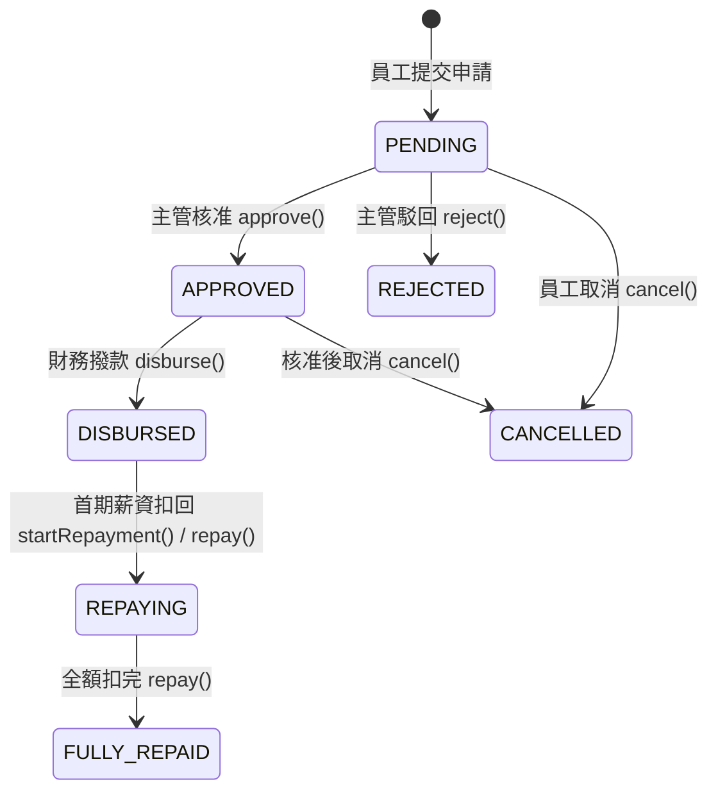
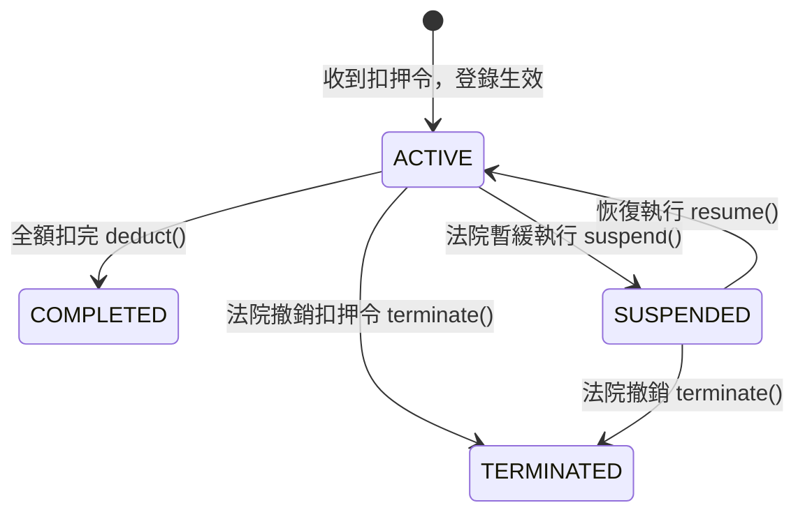
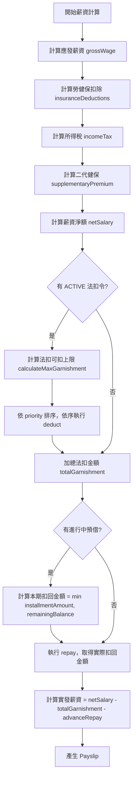

# 薪資預借與法扣款邏輯規格書

**版本:** 1.0
**日期:** 2026-03-05
**適用範圍:** HR04 薪資管理服務（Payroll Service）
**相關文件:**
- `knowledge/02_System_Design/04_薪資管理服務系統設計書.md`
- `knowledge/03_Logic_Specifications/tax_insurance_tables_2025.md`
- `knowledge/03_Logic_Specifications/regulatory_parameters_and_audit.md`
- `knowledge/04_API_Specifications/04_薪資管理服務系統設計書_API詳細規格.md`

---

## 1. 文件概述

### 1.1 目的

本文件定義薪資預借（Salary Advance）與法定扣款（Legal Deduction / Garnishment）的完整業務規則、Domain 模型、計算公式及流程設計，供工程師實作時參照。

### 1.2 業務背景

| 功能 | 說明 | 法規依據 |
|:---|:---|:---|
| **薪資預借** | 員工因緊急需求，向公司預先支領未發放薪資，後續分期從薪資中扣回 | 公司內規（勞動契約約定） |
| **法扣款** | 法院或行政機關依法對員工薪資發出扣押令，雇主依令執行扣款並匯繳指定帳戶 | 強制執行法 §115-1、§122 |

### 1.3 扣款優先順序（全局）

薪資計算中各項扣款的執行順序如下，**優先順序高者先扣**，後續項目從剩餘金額中扣除：

```
① 法定扣款（法院/行政扣押令）  →  最高優先
② 勞工保險費（員工自付 20%）
③ 健康保險費（員工自付 30%）
④ 勞退自提（0-6%，員工自願）
⑤ 所得稅扣繳
⑥ 二代健保補充保費
⑦ 薪資預借扣回                  →  最低優先
⑧ 其他自訂扣款
```

> **設計原則：** 法扣款具有法律強制力，優先於一切公司內部扣款。勞健保屬法定義務，優先於所得稅。預借扣回屬公司內部約定，排在最後。

---

## 2. 薪資預借業務規則

### 2.1 申請條件

| 條件 | 規則 | 驗證時機 |
|:---|:---|:---|
| 任職期間 | 到職滿 3 個月以上 | 申請時 |
| 在職狀態 | 必須為在職員工（非離職/留停） | 申請時 |
| 申請金額 | 必須 > 0 | 申請時 |
| 分期月數 | 必須 >= 1（建議上限 12 個月） | 申請時 |
| 未結清預借 | 不得有未扣完的進行中預借（DISBURSED / REPAYING） | 申請時 |
| 預借上限 | 申請金額 <= 計算出的可預借上限 | 核准時 |

### 2.2 額度計算

#### 2.2.1 可預借上限公式

```
可預借金額 ≤ (應發薪資 − 法定扣除 − 法扣款) × 90%
```

其中：
- **應發薪資（grossSalary）：** 底薪 + 固定津貼 + 加班費 - 請假扣款
- **法定扣除（statutoryDeductions）：** 勞保費 + 健保費 + 勞退自提 + 所得稅 + 補充保費
- **法扣款（garnishments）：** 當期法扣預估金額（所有 ACTIVE 法扣令的月扣款合計）

#### 2.2.2 計算範例

```
員工月薪: $60,000
固定津貼: $7,400
加班費:   $3,200
請假扣款: $0
──────────────────
應發薪資: $70,600

勞保費: $1,200
健保費: $800
所得稅: $2,000
──────────────────
法定扣除: $4,000

法扣款: $0（無扣押令）
──────────────────
可預借上限 = ($70,600 - $4,000 - $0) × 90%
           = $66,600 × 0.9
           = $59,940
```

#### 2.2.3 計算實作

```java
/**
 * 計算最大可預借金額
 * 可預借金額 <= (應發薪資 - 法定扣除 - 法扣款) × 90%
 */
public static BigDecimal calculateMaxAdvance(
        BigDecimal grossSalary,        // 應發薪資
        BigDecimal statutoryDeductions, // 法定扣除
        BigDecimal garnishments) {      // 法扣款
    BigDecimal available = grossSalary
            .subtract(statutoryDeductions)
            .subtract(garnishments);
    if (available.compareTo(BigDecimal.ZERO) <= 0) {
        return BigDecimal.ZERO;
    }
    return available.multiply(new BigDecimal("0.9"));
}
```

### 2.3 還款機制

#### 2.3.1 分期扣回規則

| 規則 | 說明 |
|:---|:---|
| 每期金額 | `核准金額 ÷ 分期月數`，向上取整（CEILING），最後一期扣剩餘） |
| 扣回時機 | 每月薪資計算時自動扣回 |
| 提前還清 | 若員工薪資足夠，可一次性扣回剩餘全額 |
| 最後一期 | 實際扣回金額 = min(每期金額, 剩餘未扣回金額) |

#### 2.3.2 分期計算範例

```
核准金額: $30,000
分期月數: 3 個月
每期扣回: CEILING($30,000 ÷ 3) = $10,000

第 1 期: 扣 $10,000 → 已扣 $10,000 / 剩餘 $20,000
第 2 期: 扣 $10,000 → 已扣 $20,000 / 剩餘 $10,000
第 3 期: 扣 $10,000 → 已扣 $30,000 / 剩餘 $0 → 狀態變更為 FULLY_REPAID
```

#### 2.3.3 不整除情境

```
核准金額: $10,000
分期月數: 3 個月
每期扣回: CEILING($10,000 ÷ 3) = $3,334

第 1 期: 扣 $3,334 → 已扣 $3,334  / 剩餘 $6,666
第 2 期: 扣 $3,334 → 已扣 $6,668  / 剩餘 $3,332
第 3 期: 扣 min($3,334, $3,332) = $3,332 → 已扣 $10,000 / 剩餘 $0 → FULLY_REPAID
```

### 2.4 審核流程



**狀態說明：**

| 狀態 | 代碼 | 說明 |
|:---|:---|:---|
| 待審核 | `PENDING` | 員工提交申請，等待主管審核 |
| 已核准 | `APPROVED` | 主管已核准，等待財務撥款 |
| 已駁回 | `REJECTED` | 主管駁回申請（終態） |
| 已撥款 | `DISBURSED` | 財務已撥款至員工帳戶 |
| 扣回中 | `REPAYING` | 正在從薪資中分期扣回 |
| 已全額扣回 | `FULLY_REPAID` | 預借已全額還清（終態） |
| 已取消 | `CANCELLED` | 申請已取消（終態） |

### 2.5 特殊情境處理

| 情境 | 處理方式 |
|:---|:---|
| 員工離職但未扣完 | 從最後一次薪資中一次性扣回剩餘金額；若薪資不足，記錄為應收帳款 |
| 員工留職停薪 | 暫停扣回，復職後繼續 |
| 薪資不足以扣回 | 扣回金額 = min(每期金額, 可用餘額)，不足部分延至下期 |
| 核准後但未撥款 | 可執行 cancel() 取消 |

---

## 3. 法定扣款規則

### 3.1 法規依據

#### 3.1.1 強制執行法

| 法條 | 規定 | 系統對應 |
|:---|:---|:---|
| §115-1 | 扣薪上限不得超過薪資的 **1/3** | `calculateMaxGarnishment()` 規則一 |
| §122 | 需保留債務人居住地 **最低生活費 × 1.2 倍 + 扶養費用** | `calculateMaxGarnishment()` 規則二 |

#### 3.1.2 2025 年各縣市最低生活費（月）

| 區域 | 最低生活費 | × 1.2 倍 |
|:---|---:|---:|
| 台北市 | $19,013 | $22,816 |
| 新北市 | $16,400 | $19,680 |
| 桃園市 | $15,977 | $19,172 |
| 台中市 | $16,084 | $19,301 |
| 台南市 | $14,230 | $17,076 |
| 高雄市 | $14,419 | $17,303 |
| 台灣省（其他） | $14,230 | $17,076 |

> **備註：** 上述數據為示意值，實際數據依衛福部年度公告為準。應透過法規參數管理表 `regulatory_parameters` 設定，支援年度更新。

### 3.2 扣款類型

| 類型 | 代碼 | 說明 | 執行機關 |
|:---|:---|:---|:---|
| 法院強制執行 | `COURT_ORDER` | 法院依債權人聲請發出扣押令 | 地方法院 |
| 行政執行 | `ADMINISTRATIVE_LEVY` | 國稅局欠稅、健保署欠費等行政機關扣薪 | 行政執行署/國稅局/健保署 |

### 3.3 金額限制

#### 3.3.1 可扣上限公式

```
可扣金額 = min(
    薪資淨額 × 1/3,                              ← 規則一：不超過 1/3
    薪資淨額 - 最低生活費 × 1.2 - 扶養費           ← 規則二：保留最低生活費
)
```

其中：
- **薪資淨額（netSalary）：** 應發薪資 - 勞保費 - 健保費 - 勞退自提 - 所得稅（即「法定扣除後」的金額）
- **最低生活費：** 依員工居住地縣市對應的當年度公告金額
- **扶養費：** 每名受扶養人的月扶養費用（依法院裁定或一般標準）

#### 3.3.2 計算範例

```
員工月薪淨額: $56,600 (應發 $60,600 - 法定扣除 $4,000)
居住地: 台北市
最低生活費: $19,013
扶養人數: 1 人（每月 $8,000）

規則一: $56,600 × 1/3 = $18,866（FLOOR 取整）
規則二: $56,600 - $19,013 × 1.2 - $8,000
       = $56,600 - $22,816 - $8,000
       = $25,784

可扣上限 = min($18,866, $25,784) = $18,866
```

#### 3.3.3 特殊情境：低薪員工保護

```
員工月薪淨額: $25,000
居住地: 台北市
最低生活費: $19,013
扶養人數: 0

規則一: $25,000 × 1/3 = $8,333
規則二: $25,000 - $19,013 × 1.2 - $0
       = $25,000 - $22,816
       = $2,184

可扣上限 = min($8,333, $2,184) = $2,184
→ 低薪員工受到最低生活費保護，可扣金額大幅縮減
```

#### 3.3.4 特殊情境：薪資不足保護

```
員工月薪淨額: $20,000
居住地: 台北市
最低生活費: $19,013
扶養人數: 1 人（每月 $8,000）

規則二: $20,000 - $19,013 × 1.2 - $8,000
       = $20,000 - $22,816 - $8,000
       = -$10,816 → 負值，取 $0

可扣上限 = min($6,666, $0) = $0
→ 薪資不足以保障最低生活費時，不得執行扣薪
```

#### 3.3.5 計算實作

```java
/**
 * 計算法定可扣上限
 *
 * @param netSalary         薪資淨額（應發 - 勞保 - 健保 - 所得稅）
 * @param minimumLivingCost 居住地最低生活費（月）
 * @param dependentCost     扶養費用（月）
 * @return 法定可扣上限
 */
public static BigDecimal calculateMaxGarnishment(
        BigDecimal netSalary,
        BigDecimal minimumLivingCost,
        BigDecimal dependentCost) {
    if (netSalary.compareTo(BigDecimal.ZERO) <= 0) {
        return BigDecimal.ZERO;
    }

    // 規則一：不超過淨額 1/3
    BigDecimal oneThird = netSalary
            .divide(BigDecimal.valueOf(3), 0, RoundingMode.FLOOR);

    // 規則二：需保留最低生活費 × 1.2 + 扶養費
    BigDecimal protectedAmount = minimumLivingCost
            .multiply(new BigDecimal("1.2"))
            .add(dependentCost != null ? dependentCost : BigDecimal.ZERO);
    BigDecimal afterProtection = netSalary.subtract(protectedAmount);

    if (afterProtection.compareTo(BigDecimal.ZERO) <= 0) {
        return BigDecimal.ZERO;
    }

    return oneThird.min(afterProtection);
}
```

### 3.4 多筆扣押令處理

當同一員工存在多筆法扣令時：

| 規則 | 說明 |
|:---|:---|
| 依優先順序 | `priority` 欄位決定扣款順序（數值越小越優先） |
| 優先順序原則 | 先到者先扣（依收文日期排序）；法院扣押優先於行政執行 |
| 總額限制 | 所有法扣合計不得超過可扣上限 |
| 分配方式 | 依序扣款，前一筆扣完再扣下一筆，非按比例分攤 |

```
範例：員工有 2 筆法扣令，可扣上限 = $18,866

扣押令 A（priority=1）: 總額 $100,000，每月扣 $18,866 → 本期實扣 $18,866
扣押令 B（priority=2）: 總額 $50,000  → 本期可扣 = $18,866 - $18,866 = $0

→ 扣押令 B 須等扣押令 A 全部扣完後方可開始扣款
```

### 3.5 法扣款狀態管理



| 狀態 | 代碼 | 說明 |
|:---|:---|:---|
| 執行中 | `ACTIVE` | 每月薪資計算時執行扣款 |
| 暫停 | `SUSPENDED` | 法院暫緩執行，暫停扣款 |
| 已完成 | `COMPLETED` | 扣押總額已全部扣完（終態） |
| 已終止 | `TERMINATED` | 法院撤銷扣押令（終態） |

---

## 4. 薪資預借 Domain Model

### 4.1 Aggregate Root：SalaryAdvance

**所在套件：** `com.company.hrms.payroll.domain.model.aggregate`

```java
@Getter
public class SalaryAdvance extends AggregateRoot<AdvanceId> {

    private String employeeId;          // 員工 ID
    private BigDecimal requestedAmount; // 申請金額
    private BigDecimal approvedAmount;  // 核准金額（可能 <= 申請金額）
    private int installmentMonths;      // 分期月數
    private BigDecimal installmentAmount; // 每期扣回金額
    private BigDecimal repaidAmount;    // 已扣回金額
    private BigDecimal remainingBalance; // 剩餘未扣回
    private LocalDate applicationDate;  // 申請日期
    private LocalDate disbursementDate; // 撥款日
    private AdvanceStatus status;       // 狀態
    private String reason;             // 申請理由
    private String rejectionReason;    // 駁回原因
    private String approverId;         // 核准人 ID
}
```

**核心方法：**

| 方法 | 簽章 | 說明 |
|:---|:---|:---|
| 建構子 | `SalaryAdvance(id, employeeId, requestedAmount, installmentMonths, reason)` | 建立新預借申請 |
| 核准 | `approve(approverId, approvedAmount)` | 核准並計算每期扣回金額 |
| 駁回 | `reject(approverId, reason)` | 駁回申請 |
| 撥款 | `disburse(disbursementDate)` | 財務撥款 |
| 開始扣回 | `startRepayment()` | 首期薪資扣回時觸發 |
| 每期扣回 | `repay(amount) → BigDecimal` | 執行扣回，回傳實際扣回金額 |
| 取消 | `cancel()` | 取消申請（未撥款前） |
| 計算上限 | `calculateMaxAdvance(gross, statutory, garnishments) → BigDecimal` | 靜態方法 |
| 重建 | `reconstitute(...)` | 從持久層重建 |

### 4.2 Value Objects

| Value Object | 套件位置 | 說明 |
|:---|:---|:---|
| `AdvanceId` | `domain.model.valueobject` | 預借 ID（UUID），繼承 `Identifier<String>` |
| `AdvanceStatus` | `domain.model.valueobject` | 預借狀態列舉（7 種狀態） |

### 4.3 Repository Interface

**套件：** `com.company.hrms.payroll.domain.repository`

```java
public interface ISalaryAdvanceRepository {
    void save(SalaryAdvance advance);
    Optional<SalaryAdvance> findById(AdvanceId id);
    List<SalaryAdvance> findByEmployeeId(String employeeId);
    List<SalaryAdvance> findActiveByEmployeeId(String employeeId); // DISBURSED 或 REPAYING
    List<SalaryAdvance> findByQuery(QueryGroup query);
}
```

### 4.4 Persistent Object

**表名：** `hr04_salary_advances`

| 欄位 | 型別 | 約束 | 說明 |
|:---|:---|:---|:---|
| `advance_id` | VARCHAR(36) | PK | 預借 ID |
| `employee_id` | VARCHAR(36) | NOT NULL, INDEX | 員工 ID |
| `requested_amount` | DECIMAL(10,2) | NOT NULL | 申請金額 |
| `approved_amount` | DECIMAL(10,2) | NULLABLE | 核准金額 |
| `installment_months` | INTEGER | NOT NULL | 分期月數 |
| `installment_amount` | DECIMAL(10,2) | NULLABLE | 每期扣回金額 |
| `repaid_amount` | DECIMAL(10,2) | DEFAULT 0 | 已扣回金額 |
| `remaining_balance` | DECIMAL(10,2) | NULLABLE | 剩餘未扣回 |
| `application_date` | DATE | | 申請日期 |
| `disbursement_date` | DATE | NULLABLE | 撥款日 |
| `status` | VARCHAR(20) | NOT NULL, INDEX | 狀態 |
| `reason` | VARCHAR(500) | | 申請理由 |
| `rejection_reason` | VARCHAR(500) | | 駁回原因 |
| `approver_id` | VARCHAR(36) | | 核准人 ID |
| `created_at` | TIMESTAMP | | 建立時間 |
| `updated_at` | TIMESTAMP | | 更新時間 |

---

## 5. 法扣款 Domain Model

### 5.1 Aggregate Root：LegalDeduction

**所在套件：** `com.company.hrms.payroll.domain.model.aggregate`

```java
@Getter
public class LegalDeduction extends AggregateRoot<DeductionId> {

    private String employeeId;           // 員工 ID
    private String courtOrderNumber;     // 法院扣押令編號
    private GarnishmentType garnishmentType; // 法扣類型
    private BigDecimal totalAmount;      // 扣押總額
    private BigDecimal deductedAmount;   // 已扣款金額
    private BigDecimal remainingAmount;  // 剩餘應扣
    private int priority;               // 優先順序
    private LocalDate effectiveDate;     // 生效日
    private LocalDate expiryDate;        // 到期日（可為 null）
    private GarnishmentStatus status;    // 狀態
    private String issuingAuthority;     // 執行機關
    private String caseNumber;           // 案號
    private String note;                 // 備註
}
```

**核心方法：**

| 方法 | 簽章 | 說明 |
|:---|:---|:---|
| 建構子 | `LegalDeduction(id, employeeId, courtOrderNumber, type, totalAmount, priority, effectiveDate, issuingAuthority)` | 登錄扣押令 |
| 執行扣款 | `deduct(maxDeductible) → BigDecimal` | 執行扣款，回傳實際扣款金額 |
| 暫停 | `suspend()` | 法院暫緩執行 |
| 恢復 | `resume()` | 恢復執行 |
| 終止 | `terminate()` | 法院撤銷扣押令 |
| 計算可扣上限 | `calculateMaxGarnishment(netSalary, minimumLivingCost, dependentCost) → BigDecimal` | 靜態方法 |
| 重建 | `reconstitute(...)` | 從持久層重建 |

### 5.2 Value Objects

| Value Object | 套件位置 | 說明 |
|:---|:---|:---|
| `DeductionId` | `domain.model.valueobject` | 法扣 ID（UUID），繼承 `Identifier<String>` |
| `GarnishmentType` | `domain.model.valueobject` | 法扣類型：`COURT_ORDER`、`ADMINISTRATIVE_LEVY` |
| `GarnishmentStatus` | `domain.model.valueobject` | 法扣狀態：`ACTIVE`、`SUSPENDED`、`COMPLETED`、`TERMINATED` |

### 5.3 Repository Interface

**套件：** `com.company.hrms.payroll.domain.repository`

```java
public interface ILegalDeductionRepository {
    void save(LegalDeduction deduction);
    Optional<LegalDeduction> findById(DeductionId id);
    List<LegalDeduction> findByEmployeeId(String employeeId);
    List<LegalDeduction> findActiveByEmployeeId(String employeeId); // ACTIVE，依 priority 排序
    List<LegalDeduction> findByQuery(QueryGroup query);
}
```

### 5.4 Persistent Object

**表名：** `hr04_legal_deductions`

| 欄位 | 型別 | 約束 | 說明 |
|:---|:---|:---|:---|
| `deduction_id` | VARCHAR(36) | PK | 法扣 ID |
| `employee_id` | VARCHAR(36) | NOT NULL, INDEX | 員工 ID |
| `court_order_number` | VARCHAR(100) | NOT NULL | 扣押令編號 |
| `garnishment_type` | VARCHAR(30) | NOT NULL | 法扣類型 |
| `total_amount` | DECIMAL(12,2) | NOT NULL | 扣押總額 |
| `deducted_amount` | DECIMAL(12,2) | DEFAULT 0 | 已扣款金額 |
| `remaining_amount` | DECIMAL(12,2) | | 剩餘應扣 |
| `priority` | INTEGER | DEFAULT 1 | 優先順序 |
| `effective_date` | DATE | NOT NULL | 生效日 |
| `expiry_date` | DATE | NULLABLE | 到期日 |
| `status` | VARCHAR(20) | NOT NULL, INDEX | 狀態 |
| `issuing_authority` | VARCHAR(100) | | 執行機關 |
| `case_number` | VARCHAR(100) | | 案號 |
| `note` | VARCHAR(500) | | 備註 |
| `created_at` | TIMESTAMP | | 建立時間 |
| `updated_at` | TIMESTAMP | | 更新時間 |

---

## 6. 扣款計算公式與範例

### 6.1 薪資計算引擎中的扣款整合流程



### 6.2 完整計算範例

#### 情境：員工有法扣令 + 預借扣回

```
【員工基本資料】
員工: 張三 (E0001)
居住地: 台北市
扶養人數: 1 人（每月 $8,000）

【薪資計算】
底薪:        $50,000
職務加給:     $5,000
伙食津貼:     $2,400
加班費:       $3,200
請假扣款:     -$0
────────────────────
應發薪資:     $60,600

【法定扣除】
勞保費:       -$1,200
健保費:        -$800
所得稅:      -$2,000
────────────────────
法定扣除合計:  -$4,000
薪資淨額:     $56,600

【法扣款計算】
最低生活費 × 1.2: $19,013 × 1.2 = $22,816
扶養費: $8,000
規則一: $56,600 × 1/3 = $18,866 (FLOOR)
規則二: $56,600 - $22,816 - $8,000 = $25,784
可扣上限: min($18,866, $25,784) = $18,866

扣押令 A: 總額 $200,000，剩餘 $180,000 → 本期扣 $18,866
扣押令 B: 總額 $50,000  → 本期不扣（上限已用完）
────────────────────
法扣金額合計:  -$18,866

【預借扣回】
預借核准金額: $30,000，分 3 期，每期 $10,000
已扣回: $10,000，剩餘: $20,000
本期扣回: min($10,000, $20,000) = $10,000
────────────────────
預借扣回:      -$10,000

【最終結果】
實發薪資 = $56,600 - $18,866 - $10,000 = $27,734
```

### 6.3 邊界情境：實發不得為負

```
規則：若 (法扣 + 預借扣回) 導致實發為負數或過低，依以下順序裁減：
  1. 先削減預借扣回金額（內部約定可調整）
  2. 法扣金額不可削減（法律強制）
  3. 法定扣除不可削減（法律義務）

若薪資連法定扣除都不足以覆蓋，則不執行法扣和預借扣回，
記錄為「薪資不足以執行扣款」，延至下期。
```

---

## 7. 審核流程（Pipeline）

### 7.1 薪資預借申請 Pipeline

依照 `framework/architecture/03_Business_Pipeline.md` 規範，預借申請審核流程應建立 Task 鏈：

```
ApplySalaryAdvancePipeline:
  Task 1: ValidateEmployeeEligibilityTask
           → 確認員工在職、任職滿 3 個月
  Task 2: CheckActiveAdvanceTask
           → 確認無進行中的預借（DISBURSED / REPAYING）
  Task 3: CalculateMaxAdvanceTask
           → 計算可預借上限，驗證申請金額是否在範圍內
  Task 4: CreateAdvanceRecordTask
           → 建立 SalaryAdvance 聚合根，狀態 = PENDING
  Task 5: NotifyApproverTask
           → 發送通知給主管（透過 Notification Service）
```

### 7.2 薪資預借核准 Pipeline

```
ApproveSalaryAdvancePipeline:
  Task 1: FetchAdvanceTask
           → 查詢預借記錄，確認狀態為 PENDING
  Task 2: ValidateApprovalTask
           → 確認核准人有權限、核准金額合理
  Task 3: ExecuteApprovalTask
           → 呼叫 SalaryAdvance.approve()
  Task 4: SaveAdvanceTask
           → 儲存至資料庫
  Task 5: PublishEventTask
           → 發布 SalaryAdvanceApprovedEvent
```

### 7.3 法扣款登錄 Pipeline

```
RegisterLegalDeductionPipeline:
  Task 1: ValidateCourtOrderTask
           → 驗證扣押令編號、生效日、金額
  Task 2: CheckDuplicateOrderTask
           → 確認同一扣押令編號未重複登錄
  Task 3: DeterminePriorityTask
           → 根據現有法扣令數量決定優先順序
  Task 4: CreateDeductionRecordTask
           → 建立 LegalDeduction 聚合根
  Task 5: PublishEventTask
           → 發布 LegalDeductionRegisteredEvent
  Task 6: NotifyHRTask
           → 通知 HR 專員有新法扣令
```

### 7.4 薪資計算中的扣款 Task

在既有的薪資計算 Pipeline（`CalculatePayslipsTask`）中，需整合以下步驟：

```
CalculatePayslipPipeline（既有，需擴充）:
  ...
  Task N:   CalculateGarnishmentsTask    ← 新增
            → 查詢 ACTIVE 法扣令
            → 計算可扣上限
            → 依序執行 deduct()
            → 更新法扣記錄

  Task N+1: CalculateAdvanceRepayTask    ← 新增
            → 查詢進行中預借
            → 執行 repay()
            → 更新預借記錄
  ...
```

---

## 8. Domain Event 列表

### 8.1 薪資預借相關事件

| 事件 | 觸發時機 | Payload |
|:---|:---|:---|
| `SalaryAdvanceAppliedEvent` | 員工提交預借申請 | `advanceId`, `employeeId`, `requestedAmount`, `installmentMonths` |
| `SalaryAdvanceApprovedEvent` | 主管核准預借 | `advanceId`, `employeeId`, `approvedAmount`, `approverId` |
| `SalaryAdvanceRejectedEvent` | 主管駁回預借 | `advanceId`, `employeeId`, `rejectionReason`, `approverId` |
| `SalaryAdvanceDisbursedEvent` | 財務完成撥款 | `advanceId`, `employeeId`, `approvedAmount`, `disbursementDate` |
| `SalaryAdvanceRepaidEvent` | 每期薪資扣回 | `advanceId`, `employeeId`, `repaidAmount`, `remainingBalance` |
| `SalaryAdvanceFullyRepaidEvent` | 預借全額扣完 | `advanceId`, `employeeId`, `totalRepaid` |
| `SalaryAdvanceCancelledEvent` | 預借取消 | `advanceId`, `employeeId` |

### 8.2 法扣款相關事件

| 事件 | 觸發時機 | Payload |
|:---|:---|:---|
| `LegalDeductionRegisteredEvent` | 新扣押令登錄 | `deductionId`, `employeeId`, `courtOrderNumber`, `totalAmount`, `issuingAuthority` |
| `LegalDeductionExecutedEvent` | 每期執行扣款 | `deductionId`, `employeeId`, `deductedAmount`, `remainingAmount` |
| `LegalDeductionCompletedEvent` | 扣押總額扣完 | `deductionId`, `employeeId`, `totalDeducted` |
| `LegalDeductionSuspendedEvent` | 法院暫緩執行 | `deductionId`, `employeeId` |
| `LegalDeductionResumedEvent` | 恢復執行 | `deductionId`, `employeeId` |
| `LegalDeductionTerminatedEvent` | 法院撤銷扣押令 | `deductionId`, `employeeId` |

### 8.3 事件消費者

| 事件 | 消費者 | 處理 |
|:---|:---|:---|
| `SalaryAdvanceAppliedEvent` | Notification Service | 通知主管審核 |
| `SalaryAdvanceApprovedEvent` | Notification Service | 通知員工核准結果、通知財務撥款 |
| `SalaryAdvanceRejectedEvent` | Notification Service | 通知員工駁回結果 |
| `SalaryAdvanceDisbursedEvent` | Notification Service | 通知員工撥款完成 |
| `SalaryAdvanceFullyRepaidEvent` | Notification Service | 通知員工預借已還清 |
| `LegalDeductionRegisteredEvent` | Notification Service | 通知 HR 專員新法扣令 |
| `LegalDeductionRegisteredEvent` | Reporting Service | 更新法扣統計報表 |
| `LegalDeductionCompletedEvent` | Notification Service | 通知 HR 法扣已扣完 |

---

## 9. 錯誤處理

### 9.1 薪資預借錯誤碼

| 錯誤碼 | HTTP Status | 訊息 | 觸發條件 |
|:---|:---:|:---|:---|
| `ADV_001` | 400 | 員工 ID 不可為空 | employeeId 為空 |
| `ADV_002` | 400 | 申請金額必須 > 0 | requestedAmount <= 0 |
| `ADV_003` | 400 | 分期月數必須 >= 1 | installmentMonths < 1 |
| `ADV_004` | 422 | 員工任職未滿 3 個月 | 到職日距今 < 90 天 |
| `ADV_005` | 422 | 員工有未結清預借 | 存在 DISBURSED/REPAYING 預借 |
| `ADV_006` | 422 | 申請金額超過可預借上限 | requestedAmount > maxAdvance |
| `ADV_007` | 409 | 僅待審核狀態可核准 | status != PENDING 時呼叫 approve() |
| `ADV_008` | 409 | 僅待審核狀態可駁回 | status != PENDING 時呼叫 reject() |
| `ADV_009` | 400 | 核准金額必須 > 0 | approvedAmount <= 0 |
| `ADV_010` | 400 | 核准金額不可超過申請金額 | approvedAmount > requestedAmount |
| `ADV_011` | 409 | 僅已核准狀態可撥款 | status != APPROVED 時呼叫 disburse() |
| `ADV_012` | 409 | 已撥款/扣回中的預借不可取消 | 已撥款後呼叫 cancel() |
| `ADV_013` | 409 | 不可在此狀態進行扣回 | 非 DISBURSED/REPAYING 時呼叫 repay() |

### 9.2 法扣款錯誤碼

| 錯誤碼 | HTTP Status | 訊息 | 觸發條件 |
|:---|:---:|:---|:---|
| `GAR_001` | 400 | 員工 ID 不可為空 | employeeId 為空 |
| `GAR_002` | 400 | 扣押令編號不可為空 | courtOrderNumber 為空 |
| `GAR_003` | 400 | 扣押總額必須 > 0 | totalAmount <= 0 |
| `GAR_004` | 400 | 生效日不可為空 | effectiveDate 為 null |
| `GAR_005` | 409 | 僅執行中的法扣可暫停 | status != ACTIVE 時呼叫 suspend() |
| `GAR_006` | 409 | 僅暫停中的法扣可恢復 | status != SUSPENDED 時呼叫 resume() |
| `GAR_007` | 422 | 扣押令編號已存在 | 重複登錄同一扣押令 |
| `GAR_008` | 422 | 薪資不足以執行扣款 | 可扣上限為 $0 |

---

## 10. 相關 API 端點對照

### 10.1 薪資預借 API

| 端點 | 方法 | 說明 | Controller | Service Bean |
|:---|:---:|:---|:---|:---|
| `/api/v1/salary-advances` | POST | 申請預借 | `HR04SalaryAdvanceCmdController` | `applySalaryAdvanceServiceImpl` |
| `/api/v1/salary-advances` | GET | 查詢預借列表 | `HR04SalaryAdvanceQryController` | `getSalaryAdvanceListServiceImpl` |
| `/api/v1/salary-advances/{id}` | GET | 查詢預借詳情 | `HR04SalaryAdvanceQryController` | `getSalaryAdvanceByIdServiceImpl` |
| `/api/v1/salary-advances/{id}/approve` | PUT | 核准預借 | `HR04SalaryAdvanceCmdController` | `approveSalaryAdvanceServiceImpl` |
| `/api/v1/salary-advances/{id}/reject` | PUT | 駁回預借 | `HR04SalaryAdvanceCmdController` | `rejectSalaryAdvanceServiceImpl` |
| `/api/v1/salary-advances/{id}/disburse` | PUT | 撥款 | `HR04SalaryAdvanceCmdController` | `disburseSalaryAdvanceServiceImpl` |
| `/api/v1/salary-advances/{id}/cancel` | PUT | 取消預借 | `HR04SalaryAdvanceCmdController` | `cancelSalaryAdvanceServiceImpl` |
| `/api/v1/salary-advances/max-amount` | GET | 查詢可預借上限 | `HR04SalaryAdvanceQryController` | `getMaxAdvanceAmountServiceImpl` |
| `/api/v1/my/salary-advances` | GET | 員工查詢自己的預借 | `HR04SalaryAdvanceQryController` | `getMySalaryAdvancesServiceImpl` |

### 10.2 法扣款 API

| 端點 | 方法 | 說明 | Controller | Service Bean |
|:---|:---:|:---|:---|:---|
| `/api/v1/legal-deductions` | POST | 登錄法扣令 | `HR04LegalDeductionCmdController` | `registerLegalDeductionServiceImpl` |
| `/api/v1/legal-deductions` | GET | 查詢法扣列表 | `HR04LegalDeductionQryController` | `getLegalDeductionListServiceImpl` |
| `/api/v1/legal-deductions/{id}` | GET | 查詢法扣詳情 | `HR04LegalDeductionQryController` | `getLegalDeductionByIdServiceImpl` |
| `/api/v1/legal-deductions/{id}/suspend` | PUT | 暫停法扣 | `HR04LegalDeductionCmdController` | `suspendLegalDeductionServiceImpl` |
| `/api/v1/legal-deductions/{id}/resume` | PUT | 恢復法扣 | `HR04LegalDeductionCmdController` | `resumeLegalDeductionServiceImpl` |
| `/api/v1/legal-deductions/{id}/terminate` | PUT | 終止法扣 | `HR04LegalDeductionCmdController` | `terminateLegalDeductionServiceImpl` |
| `/api/v1/legal-deductions/by-employee/{employeeId}` | GET | 查詢員工法扣 | `HR04LegalDeductionQryController` | `getLegalDeductionsByEmployeeServiceImpl` |

### 10.3 與既有 API 的整合

| 既有端點 | 整合點 | 說明 |
|:---|:---|:---|
| `POST /api/v1/payroll-runs/{id}/execute` | 薪資計算引擎 | 計算時自動整合法扣和預借扣回 |
| `GET /api/v1/payslips/{id}` | 薪資單詳情 | 回傳中應包含法扣和預借扣回明細 |
| `GET /api/v1/payslips?year={year}` | 員工薪資單列表 | 列表中應顯示各項扣款金額 |

---

## 附錄 A：DDL 參考

```sql
-- 薪資預借表
CREATE TABLE IF NOT EXISTS hr04_salary_advances (
    advance_id          VARCHAR(36) PRIMARY KEY,
    employee_id         VARCHAR(36)  NOT NULL,
    requested_amount    DECIMAL(10,2) NOT NULL,
    approved_amount     DECIMAL(10,2),
    installment_months  INTEGER      NOT NULL,
    installment_amount  DECIMAL(10,2),
    repaid_amount       DECIMAL(10,2) DEFAULT 0,
    remaining_balance   DECIMAL(10,2),
    application_date    DATE,
    disbursement_date   DATE,
    status              VARCHAR(20)  NOT NULL,
    reason              VARCHAR(500),
    rejection_reason    VARCHAR(500),
    approver_id         VARCHAR(36),
    created_at          TIMESTAMP,
    updated_at          TIMESTAMP
);

CREATE INDEX IF NOT EXISTS idx_advance_emp_id ON hr04_salary_advances(employee_id);
CREATE INDEX IF NOT EXISTS idx_advance_status ON hr04_salary_advances(status);

-- 法扣款表
CREATE TABLE IF NOT EXISTS hr04_legal_deductions (
    deduction_id        VARCHAR(36) PRIMARY KEY,
    employee_id         VARCHAR(36)  NOT NULL,
    court_order_number  VARCHAR(100) NOT NULL,
    garnishment_type    VARCHAR(30)  NOT NULL,
    total_amount        DECIMAL(12,2) NOT NULL,
    deducted_amount     DECIMAL(12,2) DEFAULT 0,
    remaining_amount    DECIMAL(12,2),
    priority            INTEGER      DEFAULT 1,
    effective_date      DATE         NOT NULL,
    expiry_date         DATE,
    status              VARCHAR(20)  NOT NULL,
    issuing_authority   VARCHAR(100),
    case_number         VARCHAR(100),
    note                VARCHAR(500),
    created_at          TIMESTAMP,
    updated_at          TIMESTAMP
);

CREATE INDEX IF NOT EXISTS idx_legal_ded_emp_id ON hr04_legal_deductions(employee_id);
CREATE INDEX IF NOT EXISTS idx_legal_ded_status ON hr04_legal_deductions(status);

-- 法規參數：最低生活費（應納入 regulatory_parameters 表）
INSERT INTO regulatory_parameters
(parameter_type, parameter_code, effective_date, value_decimal, legal_basis)
VALUES
('MINIMUM_LIVING_COST', 'TAIPEI', '2025-01-01', 19013, '衛福部114年公告'),
('MINIMUM_LIVING_COST', 'NEW_TAIPEI', '2025-01-01', 16400, '衛福部114年公告'),
('MINIMUM_LIVING_COST', 'TAOYUAN', '2025-01-01', 15977, '衛福部114年公告'),
('MINIMUM_LIVING_COST', 'TAICHUNG', '2025-01-01', 16084, '衛福部114年公告'),
('MINIMUM_LIVING_COST', 'TAINAN', '2025-01-01', 14230, '衛福部114年公告'),
('MINIMUM_LIVING_COST', 'KAOHSIUNG', '2025-01-01', 14419, '衛福部114年公告'),
('MINIMUM_LIVING_COST', 'TAIWAN_PROVINCE', '2025-01-01', 14230, '衛福部114年公告');
```

---

## 附錄 B：已實作程式碼對照表

| 元素 | 檔案路徑 | 狀態 |
|:---|:---|:---:|
| SalaryAdvance (Aggregate) | `backend/hrms-payroll/src/main/java/.../domain/model/aggregate/SalaryAdvance.java` | 已實作 |
| LegalDeduction (Aggregate) | `backend/hrms-payroll/src/main/java/.../domain/model/aggregate/LegalDeduction.java` | 已實作 |
| AdvanceId (VO) | `backend/hrms-payroll/src/main/java/.../domain/model/valueobject/AdvanceId.java` | 已實作 |
| AdvanceStatus (VO) | `backend/hrms-payroll/src/main/java/.../domain/model/valueobject/AdvanceStatus.java` | 已實作 |
| DeductionId (VO) | `backend/hrms-payroll/src/main/java/.../domain/model/valueobject/DeductionId.java` | 已實作 |
| GarnishmentType (VO) | `backend/hrms-payroll/src/main/java/.../domain/model/valueobject/GarnishmentType.java` | 已實作 |
| GarnishmentStatus (VO) | `backend/hrms-payroll/src/main/java/.../domain/model/valueobject/GarnishmentStatus.java` | 已實作 |
| ISalaryAdvanceRepository | `backend/hrms-payroll/src/main/java/.../domain/repository/ISalaryAdvanceRepository.java` | 已實作 |
| ILegalDeductionRepository | `backend/hrms-payroll/src/main/java/.../domain/repository/ILegalDeductionRepository.java` | 已實作 |
| SalaryAdvanceRepositoryImpl | `backend/hrms-payroll/src/main/java/.../infrastructure/repository/SalaryAdvanceRepositoryImpl.java` | 已實作 |
| LegalDeductionRepositoryImpl | `backend/hrms-payroll/src/main/java/.../infrastructure/repository/LegalDeductionRepositoryImpl.java` | 已實作 |
| SalaryAdvancePO | `backend/hrms-payroll/src/main/java/.../infrastructure/po/SalaryAdvancePO.java` | 已實作 |
| LegalDeductionPO | `backend/hrms-payroll/src/main/java/.../infrastructure/po/LegalDeductionPO.java` | 已實作 |
| Schema DDL | `backend/hrms-payroll/src/main/resources/db/schema-local.sql` | 已實作 |
| DeductionQueryAssembler | `backend/hrms-payroll/src/main/java/.../application/service/query/assembler/DeductionQueryAssembler.java` | 已實作 |
| GetDeductionListRequest | `backend/hrms-payroll/src/main/java/.../application/dto/request/GetDeductionListRequest.java` | 已實作 |
| PayrollCalculationDomainService 整合 | `backend/hrms-payroll/src/main/java/.../domain/service/PayrollCalculationDomainService.java` | 待擴充 |
| Controller / Service（預借） | - | 待實作 |
| Controller / Service（法扣） | - | 待實作 |
| Domain Event 類別 | - | 待實作 |
| 合約測試 | - | 待實作 |

---

**文件結束**
