# 系統使用案例圖與規格說明 (Use Case Model & Descriptions)

本文件定義了 HRMS (人資暨專案管理系統) 的核心參與者 (Actors) 及其可執行的系統操作 (Use Cases)，以確保系統功能邊界符合各層級使用者的業務需求。

## 一、 系統參與者定義 (Actors)

系統基於 RBAC (Role-Based Access Control) 設計，主要分為三大參與角色：

1.  **一般員工 (Employee / ESS User)**：系統的基層使用者，可存取 ESS (Employee Self-Service) 功能。
2.  **部門主管 (Manager)**：擁有下屬管理權限的員工，負責審核與進度控管。
3.  **人資/系統管理員 (HR / Admin)**：擁有全域管理權限，負責組織架構維護、系統參數設定與薪資結算。

## 二、 核心系統使用案例圖 (Core Use Case Diagram)

下圖展示了不同參與者在系統中的核心操作與權限交集。

> **圖表格式說明：** 本文件所有圖表均以 PlantUML 渲染（純 Java 引擎，免裝 GraphViz）。
> - **Use Case Diagram** 原始碼：`03_系統使用案例圖與規格.puml`
> - **Activity Diagrams (UC01~UC12)** 原始碼：`03_系統使用案例圖與規格_活動圖.puml`
> - 渲染指令：`java -jar tools/plantuml.jar -smetana -o diagrams <puml檔案>`

---

## 三、 核心案例規格描述 (Use Case Descriptions)

針對關鍵之使用案例，提供詳細的事件流 (Flow of Events) 與前置/後置條件。

### [UC01] 個人資料與帳號維護 (Maintain Personal Profile & Account)

*   **參與者 (Actor)**：一般員工
*   **前置條件 (Preconditions)**：員工已登入系統，具備有效在職狀態。
*   **主要流程 (Main Flow)**：
    1.  員工進入「個人設定」模組，系統顯示目前基本資料（聯絡資訊、緊急聯絡人、學歷、證照等）。
    2.  員工修改所需欄位後點擊提交。
    3.  系統驗證格式（手機格式、Email 格式等）。
    4.  系統儲存變更並寫入稽核日誌。
    5.  若員工欲修改登入密碼，需輸入舊密碼驗證後方可設定新密碼（密碼須符合複雜度規則）。
*   **替代流程 (Alternative Flow)**：
    *   若欲修改需 HR 審核的核心欄位（如姓名、身份證字號），系統自動轉發審核流程，待 HR 核准後生效。
*   **後置條件 (Postconditions)**：個人資料更新完成，相關下游服務（如【NTF 通知模組】）同步接收最新聯絡資訊。

**活動圖：**

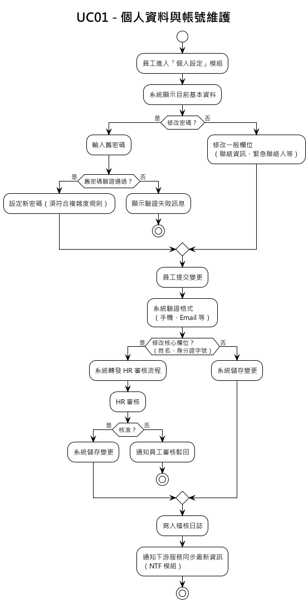

---

### [UC02] 每日考勤打卡 (Daily Clock-In / Clock-Out)

*   **參與者 (Actor)**：一般員工
*   **前置條件 (Preconditions)**：員工已登入系統；系統時間在可打卡時間範圍內（依班表設定）。
*   **主要流程 (Main Flow)**：
    1.  員工進入「考勤打卡」頁面，系統顯示今日班表與目前打卡狀態。
    2.  員工點擊「上班打卡」或「下班打卡」。
    3.  系統記錄打卡時間與 IP 位址（若啟用地理限制則驗證位置）。
    4.  系統與排定班表比對，自動判定是否遲到或早退，並即時顯示結果（正常 / 遲到 / 早退）。
*   **替代流程 (Alternative Flow)**：
    *   若員工忘記打卡，可申請「補打卡」，填具原因後由主管審核生效。
*   **異常流程 (Exception Flow)**：
    *   若系統偵測到 IP 不在允許範圍（如遠端辦公），仍允許打卡但標記為「異常待確認」，並自動通知主管。
*   **後置條件 (Postconditions)**：打卡紀錄儲存至考勤資料庫；若遲到超過閾值，系統自動觸發通知給直屬主管。

**活動圖：**

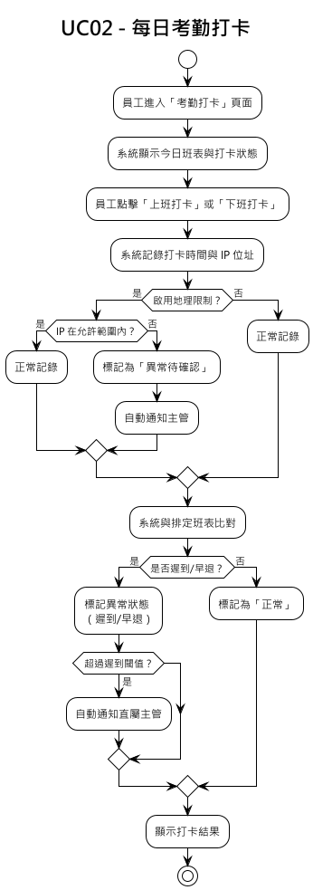

---

### [UC03] 發起請假/加班申請 (Submit Leave/Overtime Request)

*   **參與者 (Actor)**：一般員工
*   **前置條件 (Preconditions)**：員工已登入系統，且具備有效之在職狀態；當年度仍有可用之請假餘額 (若是特休)。
*   **主要流程 (Main Flow)**：
    1.  員工進入「差勤申請」模組。
    2.  系統帶出此員工目前各假別之可用餘額。
    3.  員工選擇假別 (或加班類別)、輸入起始與結束時間，並上傳證明附件 (選填)。
    4.  員工提交申請。
    5.  系統驗證：確認時間未與其他表單重疊、餘額充足。
    6.  系統建立表單紀錄，並透過【Workflow 引擎】匹配該員工所在部門之直屬主管為簽核者。
    7.  系統發送通知 (經由【NTF 模組】) 給對應之主管。
*   **後置條件 (Postconditions)**：請假單狀態變更為 `PENDING_APPROVAL`；對應時數額度暫時凍結 (Locked)。

**活動圖：**

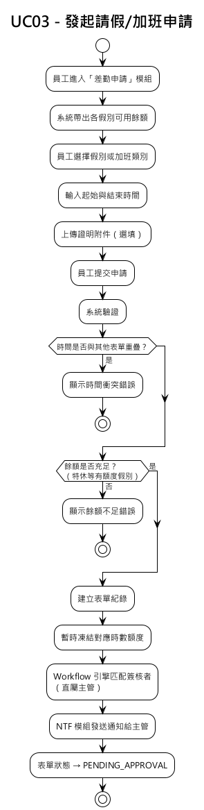

---

### [UC04] 查詢個人薪資單 (View Personal Payslip)

*   **參與者 (Actor)**：一般員工（HR 管理員可查詢全員）
*   **前置條件 (Preconditions)**：員工已登入系統；欲查詢月份的薪資結算批次已完成（狀態為 `COMPLETED`）。
*   **主要流程 (Main Flow)**：
    1.  員工進入「薪資單查詢」模組，系統列出所有歷史薪資月份清單。
    2.  員工選擇欲查閱之月份。
    3.  系統顯示詳細薪資明細：底薪、各項加給、加班費、請假扣薪、勞健保自付額、所得稅預扣、實領淨薪。
    4.  員工可下載 PDF 版電子薪資單留存。
*   **替代流程 (Alternative Flow)**：
    *   HR 管理員可透過「薪資管理」介面搜尋特定員工或部門的歷史薪資，進行全員薪資查詢。
*   **異常流程 (Exception Flow)**：
    *   若當月薪資尚未結算，系統顯示「結算中，預計發放日為 XX/XX」，不顯示試算數字。
*   **後置條件 (Postconditions)**：無資料變更；查詢操作寫入存取稽核日誌（DOC / RPT 模組）。

**活動圖：**

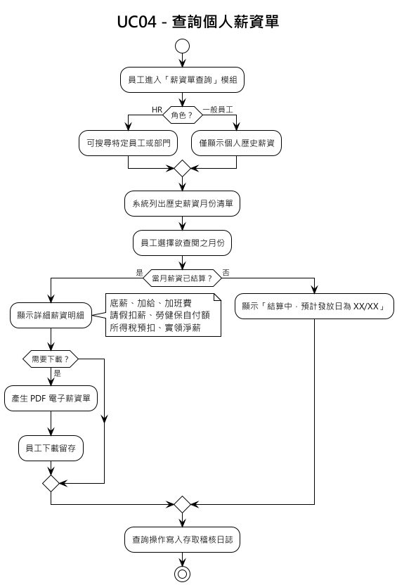

---

### [UC05] 審核下屬差勤表單 (Approve Subordinate Attendance Forms)

*   **參與者 (Actor)**：部門主管
*   **前置條件 (Preconditions)**：主管已登入系統；其下屬已提交請假或加班申請，狀態為 `PENDING_APPROVAL`。
*   **主要流程 (Main Flow)**：
    1.  主管進入「待審核」任務列表，系統列出所有等待其簽核的差勤表單。
    2.  主管選擇一筆表單，查看申請詳情（假別、時段、剩餘餘額、備註、附件）。
    3.  主管選擇「核准」或「駁回」，並填寫審核意見（駁回時為必填）。
    4.  系統更新表單狀態，並透過【NTF 模組】發送審核結果通知給申請員工。
    5.  若核准：正式扣除請假額度，考勤統計即時更新。
    6.  若駁回：還原暫凍額度，申請員工可修改後重新提交。
*   **替代流程 (Alternative Flow)**：
    *   若主管長期不在，HR 可設定代理人審核，代理人具備相同審核權限。
*   **後置條件 (Postconditions)**：請假紀錄依核准結果正式生效；月底薪資結算時自動計入請假扣薪。

**活動圖：**

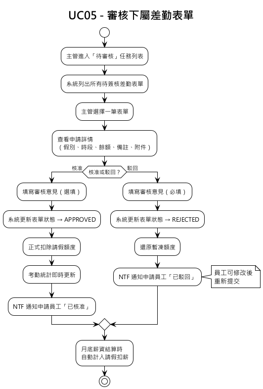

---

### [UC06] 指派專案工作包 (Assign Project Work Package)

*   **參與者 (Actor)**：部門主管 / 專案經理
*   **前置條件 (Preconditions)**：專案已建立並存在有效的 WBS (Work Breakdown Structure)；受指派員工處於在職狀態。
*   **主要流程 (Main Flow)**：
    1.  主管進入「專案管理」模組，選擇目標專案，系統展示 WBS 樹狀結構。
    2.  主管選擇欲指派的工作包 (Work Package)，系統顯示目前指派狀態與預算使用率。
    3.  主管從部門人員清單選擇負責人員，設定預計工時與截止日期。
    4.  系統建立指派記錄，更新工作包狀態為 `ASSIGNED`，並透過【NTF 模組】通知受指派員工。
*   **替代流程 (Alternative Flow)**：
    *   若工作包已有指派對象，重新指派後，舊指派記錄自動標記為 `REASSIGNED`，歷史工時紀錄保留。
*   **後置條件 (Postconditions)**：受指派員工可在「我的工作」頁面看到新任務，並可開始填寫 Timesheet 進行工時回報。

**活動圖：**

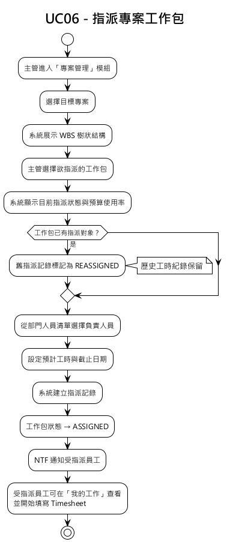

---

### [UC07] 進行下屬績效考核 (Conduct Performance Review)

*   **參與者 (Actor)**：部門主管
*   **前置條件 (Preconditions)**：績效考核週期已由 HR 啟動（如：2026 Q1 考核）；受評員工處於在職狀態。
*   **主要流程 (Main Flow)**：
    1.  主管進入「績效考核」模組，系統列出本週期需評核的下屬清單。
    2.  主管選擇一位員工，查看該員工的 OKR/KPI 目標與自評結果。
    3.  主管填寫各評核項目之評分（工作品質、協作能力、目標達成率等）。
    4.  若啟用 360 度評估，系統彙整同儕互評結果供主管參考。
    5.  主管填寫整體評語並選擇最終評等（A / B / C / D 等）後提交。
    6.  系統通知員工查閱考核結果（依考核政策決定是否公開細項）。
*   **替代流程 (Alternative Flow)**：
    *   員工對考核結果不服，可在申覆期限內提出申覆，系統啟動二次複評流程，由 HR 介入仲裁。
*   **後置條件 (Postconditions)**：考核結果儲存，並可連動後續薪資調整與晉升作業。

**活動圖：**

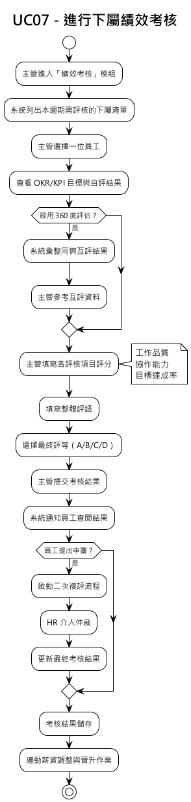

---

### [UC08] 員工到職/離職建檔 (Employee Onboarding / Offboarding)

*   **參與者 (Actor)**：人資管理員
*   **前置條件 (Preconditions)**：到職：招募流程已完成，錄取通知已發出。離職：員工已提交離職申請或勞資協議終止。
*   **主要流程 (到職 Onboarding)**：
    1.  HR 進入「員工建檔」模組，填寫新員工基本資料（姓名、身份證、聯絡方式、到職日、部門、職稱、薪資結構）。
    2.  HR 提交後，系統產生員工編號，並透過 Kafka 發布 `EmployeeCreatedEvent`。
    3.  下游服務自動響應：【IAM】建立登入帳號→發送報到通知；【INS】辦理勞健保加保；【PAY】建立薪資結構。
*   **主要流程 (離職 Offboarding)**：
    1.  HR 進入員工資料頁，執行「辦理離職」，填寫離職日期、離職原因、工作交接人。
    2.  系統透過 Kafka 發布 `EmployeeTerminatedEvent`。
    3.  下游服務自動響應：【IAM】於離職日停用帳號；【INS】辦理退保；【PAY】結算最終薪資（含未休特休折現）。
*   **後置條件 (Postconditions)**：員工狀態更新為 `ACTIVE` 或 `TERMINATED`，所有下游服務自動同步，無需 HR 逐一操作。

**活動圖：**

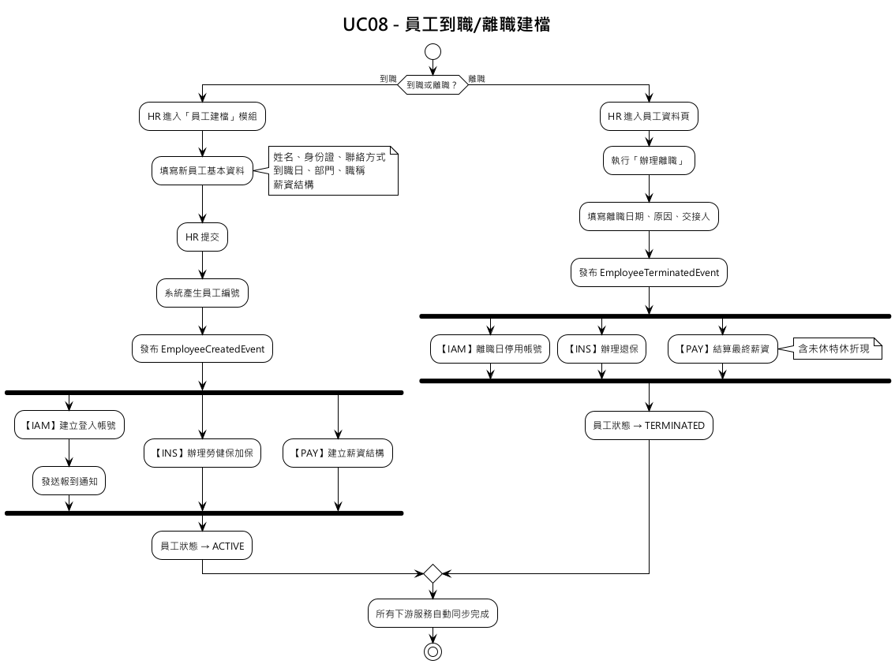

---

### [UC09] 設定班表與假別參數 (Configure Shift Schedule & Leave Types)

*   **參與者 (Actor)**：人資管理員
*   **前置條件 (Preconditions)**：HR 已登入系統，具備系統參數維護權限。
*   **主要流程 (班表設定)**：
    1.  HR 進入「班表管理」模組，建立或修改班別（正常班、早班、晚班、彈性班等）。
    2.  設定各班別的上下班時間、彈性打卡區間、強制休息時間。
    3.  指定部門或個別員工適用之班別，設定生效日期。
*   **主要流程 (假別設定)**：
    1.  HR 進入「假別參數」模組，設定假別清單（特休、病假、事假、公傷假等）。
    2.  設定各假別的年度給假天數、可否跨年度累計、折算規則（如：未休特休時薪折算）。
    3.  設定國定假日行事曆，包含勞基法規定之補班補假對應規則。
*   **後置條件 (Postconditions)**：新設定立即生效，影響後續所有員工的考勤判定邏輯與請假餘額計算。

**活動圖：**

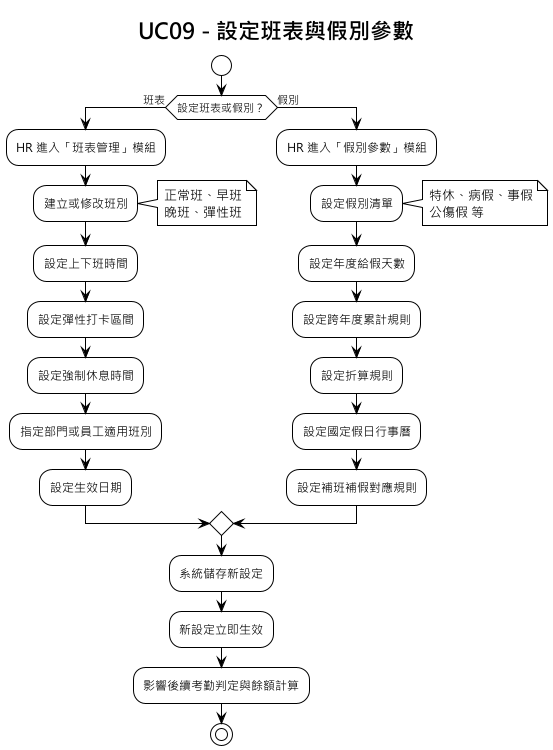

---

### [UC10] 維護勞健保級距表 (Maintain Labor/Health Insurance Grade Table)

*   **參與者 (Actor)**：人資管理員
*   **前置條件 (Preconditions)**：HR 已登入系統，具備系統參數維護權限；政府已公告最新費率表（通常每年 1 月或 7 月調整）。
*   **主要流程 (Main Flow)**：
    1.  HR 進入「勞健保設定」模組，選擇欲更新的費率年度。
    2.  系統顯示目前各級距的投保薪資範圍、勞保費率、健保費率、勞退提撥比率。
    3.  HR 依照政府公告，逐一更新各項費率或調整投保薪資級距表。
    4.  HR 執行「批次試算」，預覽費率調整對全體員工每月保費之影響（顯示差異金額）。
    5.  HR 確認無誤後儲存，設定新生效日期。
*   **異常流程 (Exception Flow)**：
    *   若新費率或新級距低於員工目前投保薪資，系統警示需人工確認是否降級調整，避免違反勞基法最低投保規定。
*   **後置條件 (Postconditions)**：新費率於設定之生效日起套用至薪資結算；歷史費率紀錄保留，不影響已發放薪資。

**活動圖：**

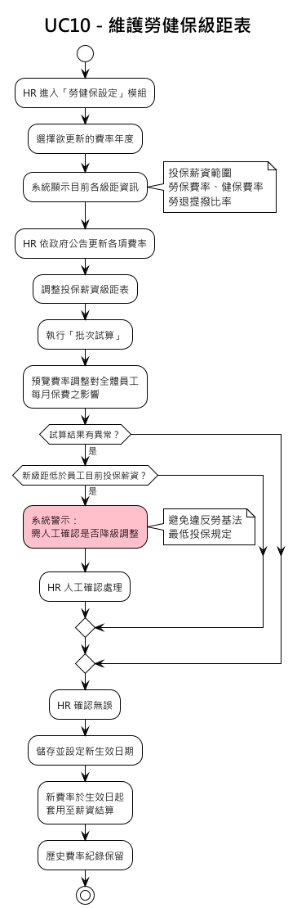

---

### [UC11] 執行每月薪資結算 (Execute Monthly Payroll Run)

*   **參與者 (Actor)**：人資主管 / 系統管理員
*   **前置條件 (Preconditions)**：考勤結算週期已結束，且當月所有請假、加班表單皆已簽核完畢。
*   **主要流程 (Main Flow)**：
    1.  HR 進入「薪資結算」模組，選擇結算計薪年月 (如：2026-02)。
    2.  系統建立一筆結算批次 (Payroll Run)，狀態為 `PROCESSING`。
    3.  系統透過 CQRS 與 API Composition，自動向【ATT 模組】拉取所有員工該月之請假扣薪與加班費加總。
    4.  系統依據【INS 模組】之勞健保與勞退設定，試算各員工之自付額。
    5.  薪資計算引擎 (SAGA Pattern) 依序算出每位員工之 Base Salary, Allowances, Deductions 與 Net Pay。
    6.  計算完畢後提供「發放前試算表」供 HR 預覽與微調。
    7.  HR 確認無誤後點擊「鎖定與發放」。
    8.  系統產出各大銀行之薪資轉帳媒體檔 (TXT/CSV)，並產生個別員工之電子薪水單 (PDF)。
*   **後置條件 (Postconditions)**：批次狀態變更為 `COMPLETED`；員工可於 ESS 自助服務系統中查閱該月電子薪資單。

**活動圖：**

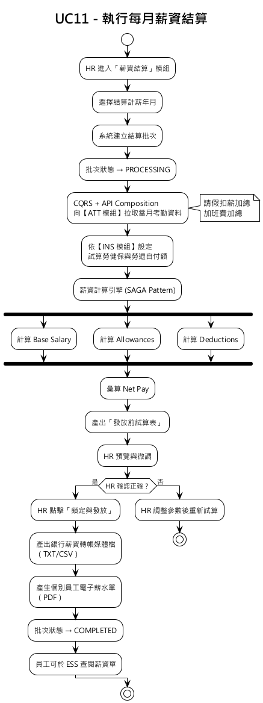

---

### [UC12] 權限角色與工作流配置 (Configure RBAC Roles & Workflow)

*   **參與者 (Actor)**：系統管理員 (Admin)
*   **前置條件 (Preconditions)**：Admin 已登入系統並具備最高管理權限。
*   **主要流程 (角色權限設定)**：
    1.  Admin 進入「角色管理」模組，查看現有角色清單（一般員工、部門主管、HR、財務、系統管理員等）。
    2.  Admin 建立新角色或修改現有角色，針對每個功能模組設定可操作的動作（查詢 / 建立 / 修改 / 刪除）。
    3.  Admin 將角色指派給特定員工帳號或部門群組。
    4.  系統儲存設定，權限變更立即生效。
*   **主要流程 (工作流設定)**：
    1.  Admin 進入「流程設計器」，使用可視化工具建立或修改審核流程。
    2.  設定流程節點（如：請假簽核→員工提交→直屬主管核准→HR 備查）。
    3.  設定各節點的條件規則（如：請假超過 3 天需雙重核准；加班費超過 NT$5,000 需財務複核）。
    4.  發布流程設定，新提交的表單立即套用新流程；進行中的表單沿用舊流程。
*   **替代流程 (Alternative Flow)**：
    *   Admin 可匯出/匯入角色與流程設定，供多租戶環境複製使用。
*   **後置條件 (Postconditions)**：新角色權限與簽核流程立即套用，影響所有相關使用者的操作範圍與表單路由。

**活動圖：**

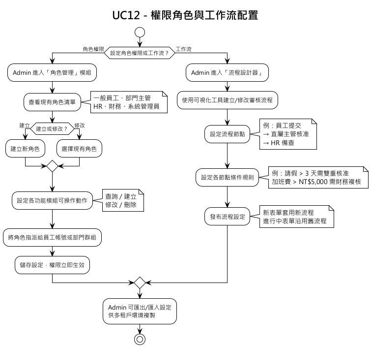

---

## 四、 系統管理使用案例 (System Administration Use Cases)

以下使用案例描述系統管理員對 HRMS 平台層級的管理操作，涵蓋功能開關、系統參數與排程任務三大面向。

### [UC-SYS-01] 功能開關管理 (Manage Feature Toggles)

*   **參與者 (Actor)**：系統管理員 (Admin)
*   **前置條件 (Preconditions)**：Admin 已登入系統並具備 `SYSTEM_ADMIN` 權限；功能開關表 (`feature_toggles`) 已初始化。
*   **主要流程 (Main Flow)**：
    1.  Admin 進入「系統管理 > 功能開關」模組，系統列出所有功能開關項目，包含功能代碼 (`featureCode`)、功能名稱、所屬模組 (`HR01`~`HR14`)、目前啟停狀態。
    2.  Admin 可依模組篩選或依關鍵字搜尋特定功能。
    3.  Admin 選擇一筆功能開關，點擊「啟用」或「停用」按鈕進行切換。
    4.  系統呼叫 `FeatureToggle.toggle(operator)` 更新狀態與異動時間/異動人。
    5.  系統儲存變更並寫入稽核日誌。
    6.  功能開關狀態即時生效（不需重啟服務），影響對應模組的業務流程判斷。
*   **替代流程 (Alternative Flow)**：
    *   Admin 可批次啟用或停用同一模組下的所有功能開關，系統逐筆更新並記錄。
    *   Admin 新增功能開關時，需填寫功能代碼（唯一）、功能名稱、所屬模組與說明，租戶 ID 由系統自動帶入。
*   **例外流程 (Exception Flow)**：
    *   若功能代碼已存在，系統回傳 `409 Conflict` 錯誤，拒絕重複建立。
    *   若操作者不具備 `SYSTEM_ADMIN` 權限，系統回傳 `403 Forbidden`。
*   **商業規則 (Business Rules)**：
    *   BR-SYS-01-01：功能開關以 `featureCode` 為唯一識別，同一租戶下不可重複。
    *   BR-SYS-01-02：多租戶環境下，每個租戶的功能開關獨立管理（依 `tenantId` 隔離）。
    *   BR-SYS-01-03：功能開關異動必須記錄操作者與時間戳，供稽核查閱。
*   **後置條件 (Postconditions)**：功能開關狀態更新完成，各模組即時讀取最新狀態進行業務邏輯判斷（如考勤遲到檢查 `ATTENDANCE_LATE_CHECK`、薪資預支 `SALARY_ADVANCE` 等）。

**活動圖：**

 <!-- TODO: 圖片尚未生成，需執行 PlantUML 產出 --> <!-- 來源: 03_系統使用案例圖與規格_活動圖.puml, 需要重新產生 PNG -->

---

### [UC-SYS-02] 系統參數管理 (Manage System Parameters)

*   **參與者 (Actor)**：系統管理員 (Admin)
*   **前置條件 (Preconditions)**：Admin 已登入系統並具備 `SYSTEM_ADMIN` 權限；系統參數表 (`system_parameters`) 已初始化。
*   **主要流程 (Main Flow)**：
    1.  Admin 進入「系統管理 > 系統參數」模組，系統列出所有參數項目，包含參數代碼 (`paramCode`)、參數名稱、目前值、參數型別 (`STRING`/`INTEGER`/`DECIMAL`/`BOOLEAN`/`JSON`)、所屬模組、參數分類 (`SECURITY`/`BUSINESS`/`UI`/`SYSTEM`)。
    2.  Admin 可依模組或分類篩選參數，或依關鍵字搜尋。
    3.  Admin 選擇欲修改的參數，輸入新的參數值。
    4.  系統呼叫 `SystemParameter.updateValue(newValue, operator)`，回傳 `ParameterChange` 記錄（含舊值、新值、操作者、時間）。
    5.  系統驗證新值是否符合參數型別格式（如 `INTEGER` 型別需為合法整數）。
    6.  系統儲存變更，異動記錄寫入稽核日誌。
*   **替代流程 (Alternative Flow)**：
    *   Admin 可點擊「重設為預設值」，系統呼叫 `SystemParameter.resetToDefault(operator)` 將參數還原至出廠設定。
    *   Admin 新增系統參數時，需填寫參數代碼（唯一）、名稱、預設值、型別、所屬模組、分類、說明，以及是否加密儲存。
    *   若參數標記為加密 (`isEncrypted = true`)，系統以密文形式儲存，查詢時遮罩顯示。
*   **例外流程 (Exception Flow)**：
    *   若新值格式不符合參數型別定義（如 `BOOLEAN` 輸入非 `true/false`），系統回傳 `400 Bad Request`。
    *   若參數代碼已存在，系統回傳 `409 Conflict`。
    *   若操作者不具備 `SYSTEM_ADMIN` 權限，系統回傳 `403 Forbidden`。
*   **商業規則 (Business Rules)**：
    *   BR-SYS-02-01：參數以 `paramCode` 為唯一識別，同一租戶下不可重複。
    *   BR-SYS-02-02：安全類參數（`category = SECURITY`，如 `MAX_FAILED_LOGIN_ATTEMPTS`）異動時，系統需發送通知給所有系統管理員。
    *   BR-SYS-02-03：加密參數的舊值在異動記錄中也以遮罩形式記錄，避免敏感資訊外洩。
    *   BR-SYS-02-04：多租戶環境下，`GLOBAL` 模組參數為共享參數，各租戶僅可覆寫自身範圍的參數。
*   **後置條件 (Postconditions)**：系統參數更新完成並立即生效，影響對應模組的行為（如登入失敗上限、密碼複雜度規則、薪資計算參數等）。

**活動圖：**

 <!-- TODO: 圖片尚未生成，需執行 PlantUML 產出 --> <!-- 來源: 03_系統使用案例圖與規格_活動圖.puml, 需要重新產生 PNG -->

---

### [UC-SYS-03] 排程任務管理 (Manage Scheduled Job Configuration)

*   **參與者 (Actor)**：系統管理員 (Admin)
*   **前置條件 (Preconditions)**：Admin 已登入系統並具備 `SYSTEM_ADMIN` 權限；排程任務配置表已初始化。
*   **主要流程 (Main Flow)**：
    1.  Admin 進入「系統管理 > 排程任務」模組，系統列出所有排程任務項目，包含任務代碼 (`jobCode`)、任務名稱、所屬模組、Cron 表達式、啟停狀態、最近執行時間、執行結果 (`SUCCESS`/`FAILED`/`RUNNING`)、連續失敗次數。
    2.  Admin 可依模組篩選或依執行狀態（正常/告警/停用）篩選。
    3.  Admin 選擇一筆排程任務，可進行以下操作：
        *   **啟用/停用**：呼叫 `ScheduledJobConfig.enable(operator)` 或 `disable(operator)`。
        *   **修改 Cron 表達式**：呼叫 `ScheduledJobConfig.updateCron(newCron, operator)` 調整執行頻率。
        *   **手動觸發**：立即執行一次該排程任務（不影響原排程週期）。
    4.  系統驗證 Cron 表達式格式正確性。
    5.  系統儲存變更並寫入稽核日誌。
*   **替代流程 (Alternative Flow)**：
    *   Admin 可查看特定任務的歷史執行記錄（含執行時間、耗時、結果、錯誤訊息），進行問題排查。
    *   若連續失敗次數 >= 3（`needsAlert() = true`），系統自動在任務列表中標示告警圖示，提醒 Admin 介入處理。
*   **例外流程 (Exception Flow)**：
    *   若 Cron 表達式格式無效，系統回傳 `400 Bad Request`，不儲存變更。
    *   若手動觸發時任務已在執行中（`status = RUNNING`），系統回傳 `409 Conflict`，防止重複執行。
    *   若操作者不具備 `SYSTEM_ADMIN` 權限，系統回傳 `403 Forbidden`。
*   **商業規則 (Business Rules)**：
    *   BR-SYS-03-01：排程任務以 `jobCode` 為唯一識別。
    *   BR-SYS-03-02：連續失敗 >= 3 次時，系統自動發送告警通知（透過 NTF 模組）給所有系統管理員。
    *   BR-SYS-03-03：排程任務的執行歷史保留 90 天，超過自動清除。
    *   BR-SYS-03-04：常見排程任務包含：考勤日結 (`ATT_DAILY_CLOSE`)、薪資月結 (`PAY_MONTHLY_RUN`)、保險申報 (`INS_MONTHLY_REPORT`)、特休年結 (`ATT_ANNUAL_LEAVE_RESET`)。
*   **後置條件 (Postconditions)**：排程任務配置更新完成，排程引擎依新設定執行後續任務。

**活動圖：**

 <!-- TODO: 圖片尚未生成，需執行 PlantUML 產出 --> <!-- 來源: 03_系統使用案例圖與規格_活動圖.puml, 需要重新產生 PNG -->

---

## 五、 輪班排程使用案例 (Shift Scheduling Use Cases)

以下使用案例描述班別定義、排班管理與換班申請的完整流程，對應 HR03 考勤模組中的輪班排程子系統。

### [UC-ATT-SHIFT-01] 班別定義 (Define Shift Types)

*   **參與者 (Actor)**：人資管理員 (HR/Admin)
*   **前置條件 (Preconditions)**：HR 已登入系統並具備考勤管理權限；組織架構已建立。
*   **主要流程 (Main Flow)**：
    1.  HR 進入「考勤管理 > 班別管理」模組，系統列出目前所有已定義的班別，包含班別代碼 (`code`)、名稱、班別類型 (`REGULAR`/`FLEXIBLE`/`SHIFT`)、上下班時間、啟停狀態。
    2.  HR 點擊「新增班別」，填寫以下資訊：
        *   班別代碼（唯一）、班別名稱
        *   班別類型：常規班 (`REGULAR`)、彈性班 (`FLEXIBLE`)、排班制 (`SHIFT`)
        *   上班時間 (`workStartTime`)、下班時間 (`workEndTime`)
        *   休息時間起迄 (`breakStartTime`、`breakEndTime`)（選填）
        *   遲到容忍分鐘數 (`lateToleranceMinutes`)、早退容忍分鐘數 (`earlyLeaveToleranceMinutes`)
        *   是否啟用遲到判定 (`lateCheckEnabled`)、是否遲到扣薪 (`lateSalaryDeduction`)
    3.  HR 提交後，系統建立 `Shift` 聚合根，執行欄位驗證。
    4.  系統儲存班別資料，初始狀態為啟用 (`isActive = true`)。
*   **替代流程 (Alternative Flow)**：
    *   HR 可修改現有班別的各項設定（呼叫 `PUT /api/v1/shifts/{shiftId}`）。
    *   HR 可停用班別（呼叫 `PUT /api/v1/shifts/{shiftId}/deactivate`），已停用的班別不可被排班引用。
    *   HR 可重新啟用已停用的班別。
*   **例外流程 (Exception Flow)**：
    *   若班別代碼已存在，系統回傳 `409 Conflict`。
    *   若上班時間或下班時間為空，系統回傳 `400 Bad Request`（`Shift name/code/type/time cannot be empty/null`）。
    *   若休息開始時間晚於結束時間，系統回傳 `400 Bad Request`（`Break start time cannot be after break end time`）。
    *   若容忍分鐘數為負數，系統回傳 `400 Bad Request`（`Tolerance minutes cannot be negative`）。
*   **商業規則 (Business Rules)**：
    *   BR-ATT-SHIFT-01-01：班別代碼在同一組織下唯一。
    *   BR-ATT-SHIFT-01-02：已被排班引用的班別不可刪除，只能停用。
    *   BR-ATT-SHIFT-01-03：彈性班 (`FLEXIBLE`) 的遲到容忍分鐘數建議設為 30~60 分鐘。
    *   BR-ATT-SHIFT-01-04：班別的遲到判定與扣薪開關可獨立控制（如啟用遲到判定但不扣薪，僅作記錄用途）。
*   **後置條件 (Postconditions)**：班別定義完成，可供排班管理模組引用；考勤打卡模組依據班別設定判定遲到/早退。

**活動圖：**

 <!-- TODO: 圖片尚未生成，需執行 PlantUML 產出 --> <!-- 來源: 03_系統使用案例圖與規格_活動圖.puml, 需要重新產生 PNG -->

---

### [UC-ATT-SHIFT-02] 排班管理 (Manage Shift Schedules)

*   **參與者 (Actor)**：人資管理員 (HR/Admin)、部門主管 (Manager)
*   **前置條件 (Preconditions)**：操作者已登入系統並具備排班管理權限；已定義至少一個啟用中的班別；目標員工處於在職狀態。
*   **主要流程 (手動排班)**：
    1.  操作者進入「考勤管理 > 排班管理」模組，選擇部門與排班月份。
    2.  系統展示月曆格式的排班表，列出該部門所有員工。
    3.  操作者針對特定員工的特定日期，指派班別（建立 `ShiftSchedule` 聚合根，狀態為 `DRAFT`）。
    4.  操作者可加註備註（`note`）說明特殊排班原因。
    5.  操作者完成排班後點擊「發佈排班」，系統呼叫 `ShiftSchedule.publish()` 將狀態從 `DRAFT` 變更為 `PUBLISHED`。
    6.  系統透過 NTF 模組通知受影響員工查閱排班表。
*   **主要流程 (自動排班 - 輪班模式)**：
    1.  操作者進入「排班管理 > 輪班模式」，選擇或建立輪班模式 (`RotationPattern`)。
    2.  設定輪班模式的循環天數 (`cycleDays`) 與每天的班別序列（如：早班→中班→晚班→休息，4 天循環）。
    3.  操作者選擇適用的員工群組，設定排班日期範圍與輪班起算日。
    4.  系統呼叫 `ShiftSchedulingDomainService.generateSchedules()` 自動產生排班（跳過休息日）。
    5.  產生的排班初始為 `DRAFT` 狀態，操作者預覽後可微調再發佈。
*   **替代流程 (Alternative Flow)**：
    *   操作者可將已發佈的排班退回草稿狀態（呼叫 `ShiftSchedule.revertToDraft()`），重新調整後再發佈。
    *   月結後，系統自動呼叫 `ShiftSchedule.lock()` 鎖定排班（`LOCKED`），不可再修改。
    *   操作者可刪除草稿狀態的排班（呼叫 `ShiftSchedule.markAsDeleted()`）。
*   **例外流程 (Exception Flow)**：
    *   若嘗試變更已鎖定的排班，系統拋出 `IllegalStateException`（「已鎖定的排班不可變更」）。
    *   若嘗試發佈非草稿狀態的排班，系統拋出 `IllegalStateException`（「僅草稿狀態可發佈」）。
    *   若嘗試鎖定非已發佈狀態的排班，系統拋出 `IllegalStateException`（「僅已發佈狀態可鎖定」）。
    *   若輪班模式的天序未設定或數量與循環天數不符，系統拋出 `IllegalArgumentException`。
*   **商業規則 (Business Rules)**：
    *   BR-ATT-SHIFT-02-01：排班狀態流轉為 `DRAFT → PUBLISHED → LOCKED`，不可跳級。
    *   BR-ATT-SHIFT-02-02：同一員工同一日期不可重複排班。
    *   BR-ATT-SHIFT-02-03：輪班模式的天序數量必須等於循環天數（`days.size() == cycleDays`）。
    *   BR-ATT-SHIFT-02-04：月結鎖定後的排班為最終版，作為考勤比對與薪資計算的依據。
    *   BR-ATT-SHIFT-02-05：排班至少需在生效日前 3 天發佈，確保員工有足夠時間查閱。
*   **後置條件 (Postconditions)**：排班表發佈完成，員工可於 ESS 查閱自己的班表；考勤模組依排班表判定出勤狀態。

**活動圖：**

 <!-- TODO: 圖片尚未生成，需執行 PlantUML 產出 --> <!-- 來源: 03_系統使用案例圖與規格_活動圖.puml, 需要重新產生 PNG -->

---

### [UC-ATT-SHIFT-03] 換班申請 (Submit Shift Swap Request)

*   **參與者 (Actor)**：一般員工 (Employee)、部門主管 (Manager)
*   **前置條件 (Preconditions)**：申請人與交換對象皆處於在職狀態；雙方在申請的日期皆有已發佈的排班記錄。
*   **主要流程 (Main Flow)**：
    1.  員工 A 進入「考勤管理 > 換班申請」模組，選擇欲換班的日期與交換對象員工 B。
    2.  系統顯示雙方在指定日期的班別資訊。
    3.  員工 A 填寫換班原因後提交申請，系統建立 `ShiftSwapRequest` 聚合根，初始狀態為 `PENDING_COUNTERPART`。
    4.  系統透過 NTF 模組通知員工 B 有換班邀請。
    5.  員工 B 查閱換班詳情後，選擇「同意」或「拒絕」。
    6.  若員工 B 同意（呼叫 `ShiftSwapRequest.acceptByCounterpart()`），狀態變更為 `PENDING_APPROVAL`，系統通知主管進行審核。
    7.  主管查閱換班申請後，選擇「核准」或「駁回」。
    8.  若主管核准（呼叫 `ShiftSwapRequest.approve(approverId)`），系統呼叫 `ShiftSchedulingDomainService.executeSwap()` 交換雙方排班的班別，狀態變更為 `APPROVED`。
    9.  系統透過 NTF 模組通知雙方員工換班已生效。
*   **替代流程 (Alternative Flow)**：
    *   員工 A 可在對方尚未回應或主管尚未審核前取消申請（呼叫 `ShiftSwapRequest.cancel()`），狀態變更為 `CANCELLED`。
    *   若員工 B 拒絕（呼叫 `ShiftSwapRequest.rejectByCounterpart(reason)`），狀態變更為 `REJECTED`，系統通知員工 A。
    *   若主管駁回（呼叫 `ShiftSwapRequest.reject(approverId, reason)`），狀態變更為 `REJECTED`，系統通知雙方員工。
*   **例外流程 (Exception Flow)**：
    *   若申請人與交換對象為同一人，系統拋出 `IllegalArgumentException`（「不可與自己換班」）。
    *   若申請人 ID 或交換對象 ID 為空，系統拋出 `IllegalArgumentException`。
    *   若排班日期為空，系統拋出 `IllegalArgumentException`（「排班日期不可為空」）。
    *   若嘗試在非等待狀態執行操作（如已核准後再次核准），系統拋出 `IllegalStateException`。
    *   若嘗試取消已結案的申請（`APPROVED` 或 `REJECTED`），系統拋出 `IllegalStateException`（「已結案的申請不可取消」）。
*   **商業規則 (Business Rules)**：
    *   BR-ATT-SHIFT-03-01：換班申請狀態流轉為 `PENDING_COUNTERPART → PENDING_APPROVAL → APPROVED/REJECTED`，另可在任何非結案狀態下 `CANCELLED`。
    *   BR-ATT-SHIFT-03-02：換班只能在排班未鎖定的狀態下執行（`ScheduleStatus != LOCKED`）。
    *   BR-ATT-SHIFT-03-03：換班不影響雙方的工時統計，僅交換班別。
    *   BR-ATT-SHIFT-03-04：換班申請需在排班日期前至少 1 天提出。
    *   BR-ATT-SHIFT-03-05：同一員工在同一日期不可同時有多筆進行中的換班申請。
*   **後置條件 (Postconditions)**：換班核准後，雙方排班表更新為交換後的班別；考勤打卡依新班別判定出勤狀態。

**活動圖：**

 <!-- TODO: 圖片尚未生成，需執行 PlantUML 產出 --> <!-- 來源: 03_系統使用案例圖與規格_活動圖.puml, 需要重新產生 PNG -->
