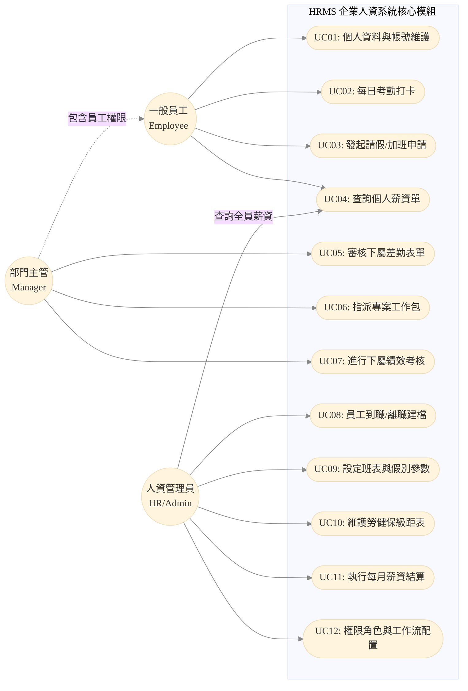

# 系統使用案例圖與規格說明 (Use Case Model & Descriptions)

本文件定義了 HRMS (人資暨專案管理系統) 的核心參與者 (Actors) 及其可執行的系統操作 (Use Cases)，以確保系統功能邊界符合各層級使用者的業務需求。

## 一、 系統參與者定義 (Actors)

系統基於 RBAC (Role-Based Access Control) 設計，主要分為三大參與角色：

1.  **一般員工 (Employee / ESS User)**：系統的基層使用者，可存取 ESS (Employee Self-Service) 功能。
2.  **部門主管 (Manager)**：擁有下屬管理權限的員工，負責審核與進度控管。
3.  **人資/系統管理員 (HR / Admin)**：擁有全域管理權限，負責組織架構維護、系統參數設定與薪資結算。

## 二、 核心系統使用案例圖 (Core Use Case Diagram)

下圖展示了不同參與者在系統中的核心操作與權限交集。

---

## 三、 核心案例規格描述 (Use Case Descriptions)

針對關鍵之使用案例，提供詳細的事件流 (Flow of Events) 與前置/後置條件。

### [UC03] 發起請假/加班申請 (Submit Leave/Overtime Request)

*   **參與者 (Actor)**：一般員工
*   **前置條件 (Preconditions)**：員工已登入系統，且具備有效之在職狀態；當年度仍有可用之請假餘額 (若是特休)。
*   **主要流程 (Main Flow)**：
    1.  員工進入「差勤申請」模組。
    2.  系統帶出此員工目前各假別之可用餘額。
    3.  員工選擇假別 (或加班類別)、輸入起始與結束時間，並上傳證明附件 (選填)。
    4.  員工提交申請。
    5.  系統驗證：確認時間未與其他表單重疊、餘額充足。
    6.  系統建立表單紀錄，並透過【Workflow 引擎】匹配該員工所在部門之直屬主管為簽核者。
    7.  系統發送通知 (經由【NTF 模組】) 給對應之主管。
*   **後置條件 (Postconditions)**：請假單狀態變更為 `PENDING_APPROVAL`；對應時數額度暫時凍結 (Locked)。

### [UC11] 執行每月薪資結算 (Execute Monthly Payroll Run)

*   **參與者 (Actor)**：人資主管 / 系統管理員
*   **前置條件 (Preconditions)**：考勤結算週期已結束，且當月所有請假、加班表單皆已簽核完畢。
*   **主要流程 (Main Flow)**：
    1.  HR 進入「薪資結算」模組，選擇結算計薪年月 (如：2026-02)。
    2.  系統建立一筆結算批次 (Payroll Run)，狀態為 `PROCESSING`。
    3.  系統透過 CQRS 與 API Composition，自動向【ATT 模組】拉取所有員工該月之請假扣薪與加班費加總。
    4.  系統依據【INS 模組】之勞健保與勞退設定，試算各員工之自付額。
    5.  薪資計算引擎 (SAGA Pattern) 依序算出每位員工之 Base Salary, Allowances, Deductions 與 Net Pay。
    6.  計算完畢後提供「發放前試算表」供 HR 預覽與微調。
    7.  HR 確認無誤後點擊「鎖定與發放」。
    8.  系統產出各大銀行之薪資轉帳媒體檔 (TXT/CSV)，並產生個別員工之電子薪水單 (PDF)。
*   **後置條件 (Postconditions)**：批次狀態變更為 `COMPLETED`；員工可於 ESS 自助服務系統中查閱該月電子薪資單。
