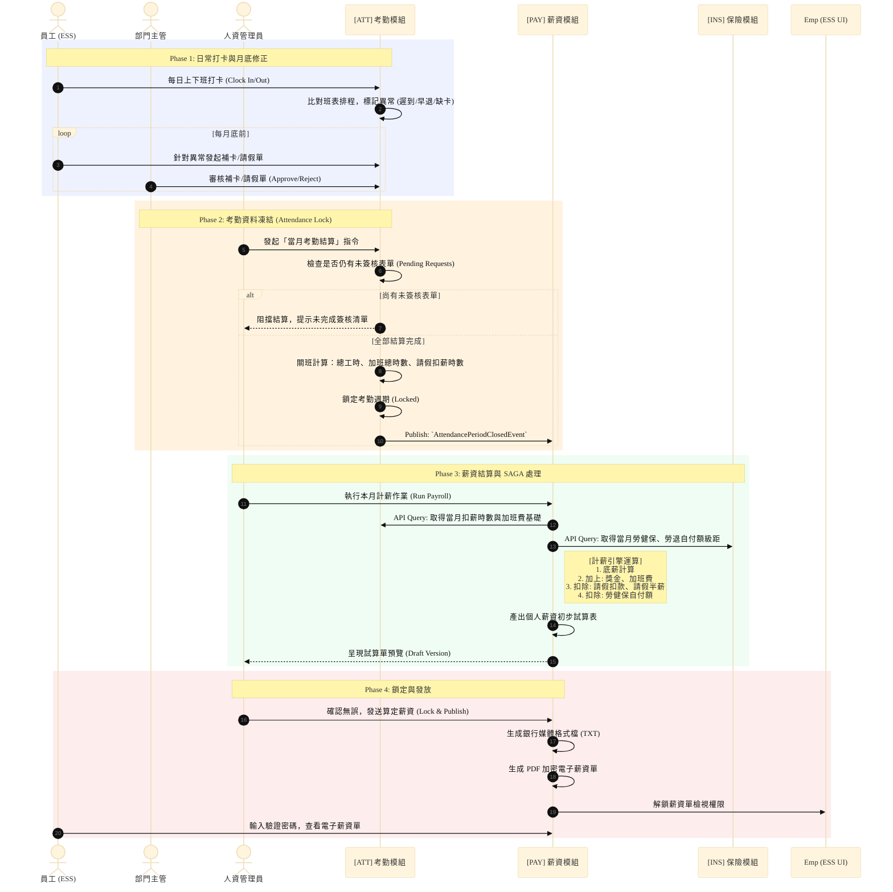

# 核心業務流程圖 (Business Flowcharts & Swimlane)

本文件展示系統中跨模組、高複雜度的核心業務邏輯流程。透過泳道圖 (Swimlane Diagram) 清晰界定出不同角色 (Actors) 以及後端微服務集群 (Microservices) 於各個階段應負擔的責任與系統邊界條件。

---

## 一、 考勤結算至薪資發放流程 (Attendance to Payroll Flow)

此流程涵蓋了企業人資系統中最關鍵的「月結處理」。它不僅牽涉前端使用者的互動，更涉及【考勤模組 (ATT)】與【薪資模組 (PAY)】之間的跨服務資料同步與非同步事件運算。

### 流程設計要點 (Architecture Design Points)

此設計展示了複雜的分散式結算邏輯如何被穩健地處理：

1. **防呆與依賴檢查 (Constraint & Validation)**：在進入薪資計算（Phase 3）前，必須確保考勤資料已經完全鎖定（Phase 2）。系統防呆設計會阻擋在仍有請假單卡在主管端的狀態下進行結算，確保資料一致性 (Data Integrity)。
2. **事件與 API Query 的混合應用 (Hybrid Communication)**：
   * 考勤結班後會發出 Event 告知 PAY 模組「這段期間的資料已鎖定」。
   * 但計薪時，基於資料即時性且為了避免把龐大運算參數塞入 Kafka 訊息中，PAY 模組是主動呼叫 ATT 與 INS 的 Query API 索取精確的時數與級距數字（API Composition 模式）。此做法降低了 Queue 的負載並提高了資料獲取的正確性。
