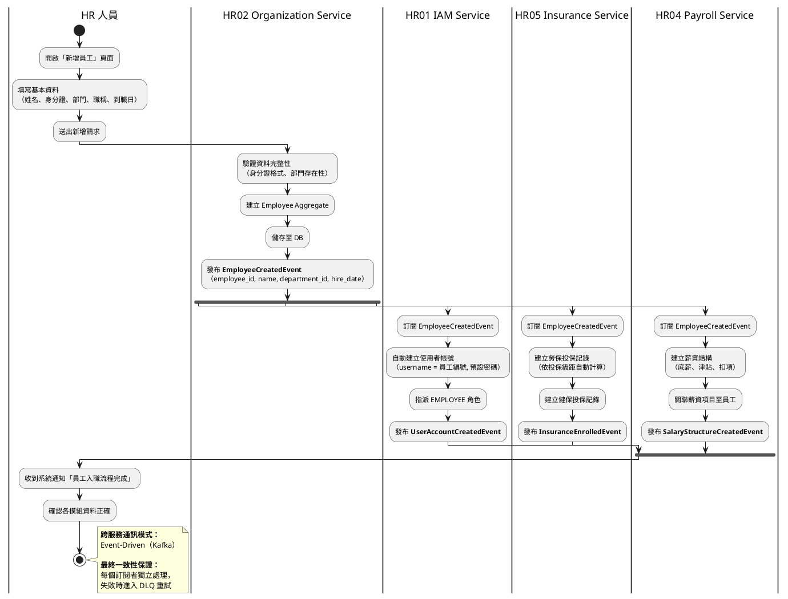
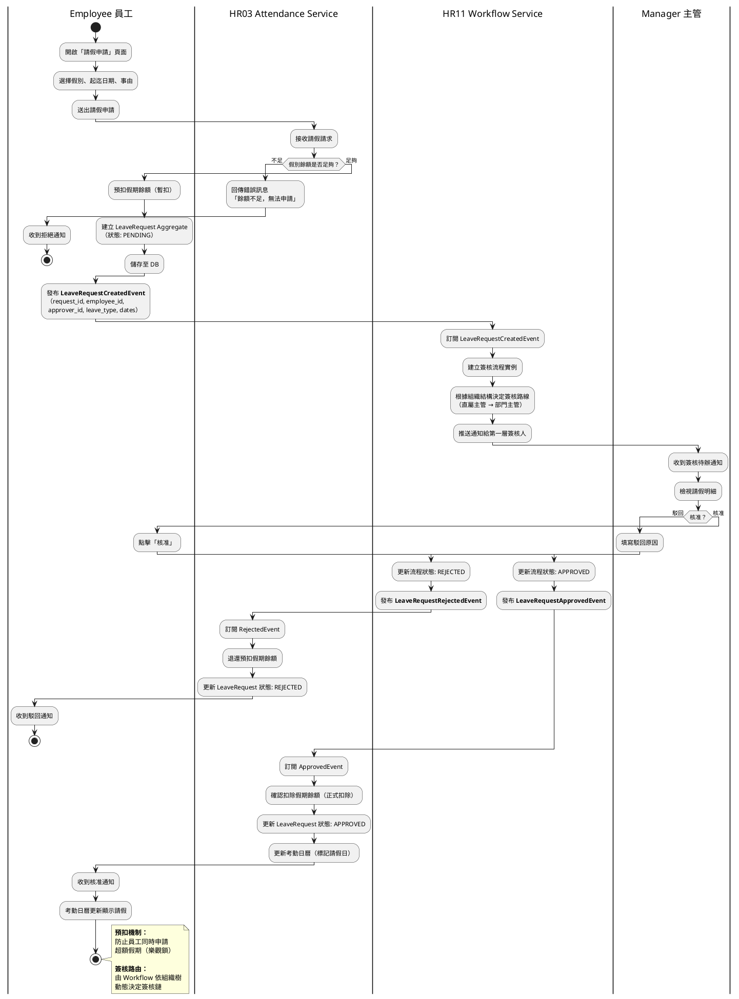
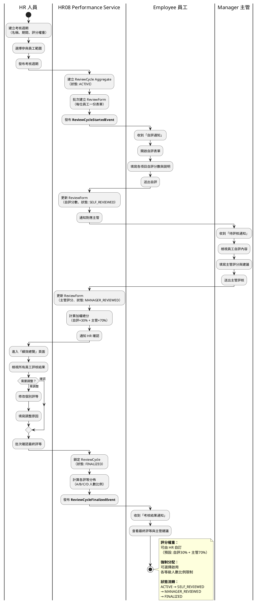
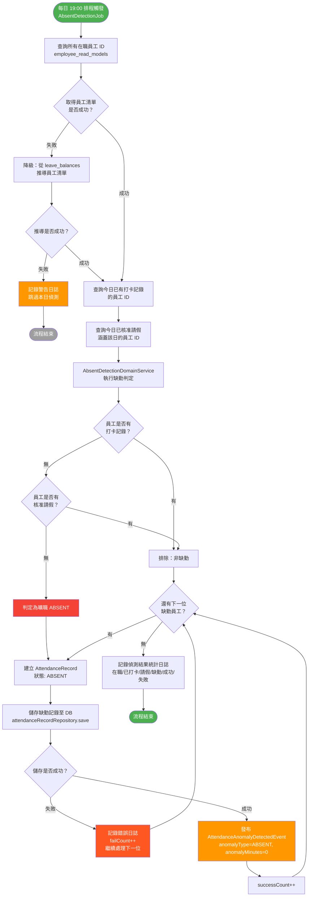
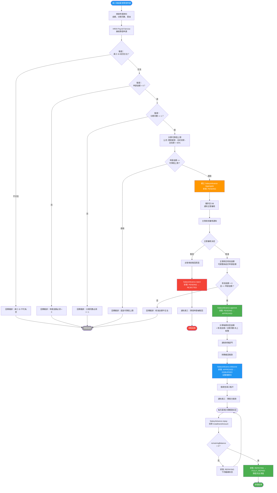
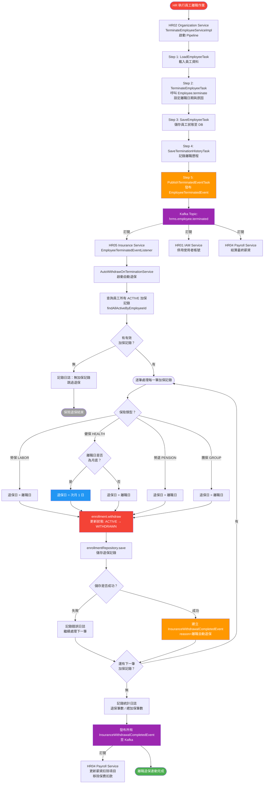

# 核心業務流程圖 (Business Flowcharts & Swimlane)

本文件展示系統中跨模組、高複雜度的核心業務邏輯流程。透過泳道圖 (Swimlane Diagram) 清晰界定出不同角色 (Actors) 以及後端微服務集群 (Microservices) 於各個階段應負擔的責任與系統邊界條件。

---

## 一、 考勤結算至薪資發放流程 (Attendance to Payroll Flow)

此流程涵蓋了企業人資系統中最關鍵的「月結處理」。它不僅牽涉前端使用者的互動，更涉及【考勤模組 (ATT)】與【薪資模組 (PAY)】之間的跨服務資料同步與非同步事件運算。

> **圖表格式：** PlantUML 渲染｜原始碼：`04_核心業務流程圖.puml`｜渲染指令：`java -jar tools/plantuml.jar -smetana -o diagrams 04_核心業務流程圖.puml`

### 流程設計要點 (Architecture Design Points)

此設計展示了複雜的分散式結算邏輯如何被穩健地處理：

1. **防呆與依賴檢查 (Constraint & Validation)**：在進入薪資計算（Phase 3）前，必須確保考勤資料已經完全鎖定（Phase 2）。系統防呆設計會阻擋在仍有請假單卡在主管端的狀態下進行結算，確保資料一致性 (Data Integrity)。
2. **事件與 API Query 的混合應用 (Hybrid Communication)**：
   * 考勤結班後會發出 Event 告知 PAY 模組「這段期間的資料已鎖定」。
   * 但計薪時，基於資料即時性且為了避免把龐大運算參數塞入 Kafka 訊息中，PAY 模組是主動呼叫 ATT 與 INS 的 Query API 索取精確的時數與級距數字（API Composition 模式）。此做法降低了 Queue 的負載並提高了資料獲取的正確性。

---

## 二、員工入職流程 (Employee Onboarding Flow)

此流程描述從 HR 建立員工資料到完成所有系統初始化的跨服務協作。涉及【組織模組 (ORG)】、【IAM 模組】、【保險模組 (INS)】、【薪資模組 (PAY)】四個服務的非同步事件串接。

### 流程設計要點

1. **事件驅動解耦（Event-Driven Decoupling）**：HR02 只負責建立員工本身，其餘服務透過訂閱 `EmployeeCreatedEvent` 自動完成後續作業，實現服務間零耦合。
2. **最終一致性（Eventual Consistency）**：三個下游服務（IAM、Insurance、Payroll）平行處理，任一服務失敗不影響其他服務，透過 Dead Letter Queue 機制確保最終一致。
3. **冪等性設計（Idempotency）**：每個訂閱者以 `employee_id` 作為冪等鍵，重複消費同一事件不會產生重複資料。

---

## 三、請假簽核流程 (Leave Approval Flow)

此流程展示員工發起請假到主管核准的完整路徑，涉及【考勤模組 (ATT)】與【簽核模組 (WFL)】的協作。

### 流程設計要點

1. **預扣機制（Reservation Pattern）**：申請時先預扣餘額避免超額申請，駁回時退還。此模式類似電商的庫存預留。
2. **動態簽核路由（Dynamic Routing）**：Workflow 服務根據組織結構樹自動決定簽核鏈，支援多層簽核與代理人機制。
3. **狀態機驅動（State Machine）**：LeaveRequest 的生命週期由狀態機管理：`PENDING → APPROVED/REJECTED`，確保狀態轉換的合法性。

---

## 四、績效考核流程 (Performance Review Flow)

此流程展示一個完整的績效週期，從 HR 建立考核週期到最終確認評等，涉及【績效模組 (PER)】的多角色協作。

### 流程設計要點

1. **彈性表單設計（Flexible Form）**：考核項目與權重由 HR 於週期建立時自定義，支援 KPI、OKR、360 度等多種考核類型。
2. **狀態機嚴格控制（State Machine）**：表單狀態依序流轉 `ACTIVE → SELF_REVIEWED → MANAGER_REVIEWED → FINALIZED`，不可跳步或回退，確保流程正確性。
3. **強制分配機制（Forced Distribution）**：HR 可選擇啟用各評等的人數比例限制（如 A 等不超過 20%），系統會在確認階段提供分佈警示。

---

## 五、曠職判定流程 (Absent Detection Flow)

此流程描述系統如何透過每日排程自動偵測未出勤員工並判定曠職，涉及【考勤模組 (ATT)】的排程任務與領域服務協作，以及透過 Domain Event 通知相關服務。

### 流程設計要點

1. **排程驅動（Scheduled Job）**：透過 `AbsentDetectionJob` 於每日 19:00 自動執行，以 Spring `@Scheduled(cron = "0 0 19 * * ?")` 宣告，確保每日工作結束後統一偵測。
2. **三層過濾邏輯（Domain Service）**：`AbsentDetectionDomainService` 負責核心判定 —— 從全部在職員工中排除「已打卡」與「已核准請假」者，剩餘即為曠職。此邏輯為純 POJO，不依賴框架。
3. **降級容錯（Fallback Strategy）**：若 `employee_read_models` 表不存在（非 CQRS 環境），自動降級從 `leave_balances` 推導在職員工清單，確保排程不因跨服務表缺失而中斷。
4. **逐筆異常隔離（Per-Record Error Isolation）**：單一員工的缺勤記錄建立失敗不影響其他員工的處理，透過 try-catch 逐筆隔離，最後統計成功/失敗數量。
5. **事件通知（Event-Driven）**：每筆曠職記錄建立後發布 `AttendanceAnomalyDetectedEvent`，下游服務（如通知模組）可訂閱此事件推送給主管。

---

## 六、薪資預借審核流程 (Salary Advance Approval Flow)

此流程描述員工申請薪資預借，經過資格與額度檢查、主管審核、財務撥款，到每月自動扣回的完整生命週期。涉及【薪資模組 (PAY)】的 SalaryAdvance 聚合根狀態機。

### 流程設計要點

1. **聚合根狀態機（Aggregate State Machine）**：`SalaryAdvance` 聚合根嚴格管控狀態轉換 `PENDING → APPROVED → DISBURSED → REPAYING → FULLY_REPAID`，每個方法在入口處驗證當前狀態，不合法的轉換拋出 `IllegalStateException`。另有 `REJECTED` 與 `CANCELLED` 兩個終態。
2. **預借額度公式（Max Advance Calculation）**：`可預借金額 <= (應發薪資 - 法定扣除 - 法扣款) × 90%`，確保員工扣回預借後仍有基本薪資保障。此公式以靜態方法 `SalaryAdvance.calculateMaxAdvance()` 實現。
3. **分期扣回機制（Installment Repayment）**：核准後自動計算 `installmentAmount = approvedAmount / installmentMonths`（向上取整），每月薪資計算時自動呼叫 `repay()` 扣回，最後一期扣回金額 = `remainingBalance`，確保不多扣。
4. **核准金額可調整（Adjustable Approval）**：主管可核准低於申請金額的額度（但不可超過申請金額），提供彈性審核空間。
5. **取消限制（Cancel Constraint）**：僅 `PENDING` 與 `APPROVED` 狀態可取消，已撥款（`DISBURSED`）或扣回中（`REPAYING`）的預借不可取消，保護財務一致性。

---

## 七、離職退保連動流程 (Termination Insurance Withdrawal Flow)

此流程描述員工離職生效後，系統自動觸發退保的跨服務事件驅動流程。涉及【組織模組 (ORG)】、【保險模組 (INS)】、【IAM 模組】、【薪資模組 (PAY)】四個服務的非同步協作。

### 流程設計要點

1. **Pipeline 編排（Business Pipeline）**：離職作業由 `TerminateEmployeeServiceImpl` 透過 `BusinessPipeline` 依序執行 5 個 Task（載入 → 離職 → 儲存 → 歷程 → 事件），符合 Application Service 只做編排不做決策的原則。
2. **事件驅動跨服務連動（Event-Driven Cross-Service）**：`EmployeeTerminatedEvent` 攜帶 `employeeId`、`terminationDate`、`terminationReason` 等完整資訊，透過 Kafka topic `hrms.employee.terminated` 廣播，保險/IAM/薪資服務各自訂閱處理。
3. **退保日期規則引擎（EffectiveDateRule）**：依保險類型自動計算退保生效日 —— 勞保/勞退/團保為離職日退保；健保特殊規則：月底離職者次月 1 日退保。此規則封裝於 `EffectiveDateRule.calculateWithdrawDate()` 值物件中。
4. **逐筆隔離與降級（Per-Record Isolation）**：每筆加保記錄的退保獨立處理，單筆退保失敗不影響其他記錄，透過 try-catch 隔離錯誤並記錄日誌。
5. **雙層事件鏈（Two-Layer Event Chain）**：第一層 `EmployeeTerminatedEvent`（ORG → INS）觸發退保；第二層 `InsuranceWithdrawalCompletedEvent`（INS → PAY）通知薪資模組移除保費扣款項目，實現完整的事件驅動解耦。
6. **冪等性保障（Idempotency）**：`AutoWithdrawOnTerminationService` 查詢的是 `ACTIVE` 狀態的加保記錄，已退保（`WITHDRAWN`）的記錄不會被重複處理，確保事件重複消費的安全性。
